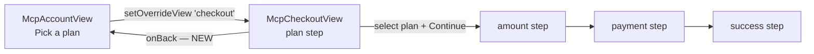
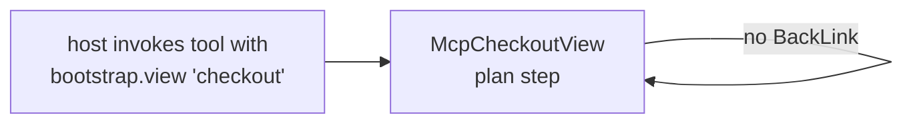

# Account plan-selector back-link

## Goal

When a customer is on `<McpAccountView>` and clicks **Pick a plan** / **See plans**, `<McpAppShell>` flips its in-session `overrideView` to `'checkout'` and the user lands on the plan-selector inside the same iframe. Today there is **no way back to the account surface** — the only escape is host-side teardown.

The topup view solved the symmetric problem with a `<BackLink label="Back to my account" onClick={onBack} />` at the top, wired by the shell to `setOverrideView('account')`. We need the same affordance on the plan-selector step.

## UI

```
┌── McpCheckoutView ─────────────────────────────────────────┐
│                                                            │
│   ← Back to my account     ← NEW                           │
│                                                            │
│   Choose a plan                                            │
│                                                            │
│   ┌────────────────────┐  ┌────────────────────┐           │
│   │ Pay as you go      │  │ Unlimited          │           │
│   │ SEK 0.01 / call    │  │ SEK 500 / month    │           │
│   │ [CURRENT]          │  │                    │           │
│   └────────────────────┘  └────────────────────┘           │
│                                                            │
│   ┌──────────────────────────────────────────────────┐     │
│   │ Continue with Pay as you go                      │     │
│   └──────────────────────────────────────────────────┘     │
│                                                            │
│   Provided by SolvaPay              Terms · Privacy        │
│                                                            │
└────────────────────────────────────────────────────────────┘
```

The BackLink only renders on the **plan** step. After the user picks a plan and advances to amount/payment/success, the state machine's own internal navigation takes over (those steps already have step-local back affordances or are commit-style screens).

## Surface walkthrough



Cold-start (host launched the widget directly into checkout, e.g. paywall takeover) stays untouched:



## Constraints

- **No new bridge surface.** All navigation stays inside `<McpAppShell>`'s local `overrideView`. The bridge (`useMcpBridge`) has no view-change API and we don't want to add one for this.
- **Cold-start respects host intent.** When `bootstrap.view === 'checkout'` and `overrideView === null`, the host wants checkout to be the entry. No BackLink.
- **`fromPaywall` keeps no-back.** Custom integrators using the paywall takeover prop already imply "you must pick a plan to continue" — the shell never sets `fromPaywall`, but the gate (`overrideView !== null`) inherently excludes paywall-only entries.
- **No impact on the hosted-checkout fallback.** When Stripe is CSP-blocked, `<McpCheckoutView>` renders the `HostedCheckout` new-tab path — that surface is out of scope; the plan-step BackLink only matters for the embedded path.
- **Selection state is discarded on back.** Pressing back loses any `selectedPlanRef` the user picked — acceptable because the user explicitly asked to leave the selector. Document on the prop's JSDoc.

## Implementation sketch

### 1. `<McpCheckoutView>` (`packages/react/src/mcp/views/McpCheckoutView.tsx`)

```tsx
export interface McpCheckoutViewProps {
  // existing props ...
  /**
   * Wired by `<McpAppShell>` only when the customer reached checkout
   * in-session (e.g. via "Pick a plan" on the account view). Renders a
   * `<BackLink>` above the plan-selector step. Cold-start checkout
   * entries (`bootstrap.view: 'checkout'`) and paywall takeovers leave
   * this `undefined` because there is no prior in-iframe surface to
   * return to.
   */
  onBack?: () => void
}
```

Forward `onBack` to `<EmbeddedCheckout>`.

### 2. `<EmbeddedCheckout>` (`packages/react/src/mcp/views/checkout/EmbeddedCheckout.tsx`)

```tsx
import { BackLink } from '../BackLink'
import { useCopy } from '../../../i18n/CopyProvider'

return (
  <div className={cx.card} data-refreshing={isRefetching ? 'true' : undefined}>
    {onBack && step === 'plan' ? (
      <BackLink label={copy.checkout.backToAccount} onClick={onBack} />
    ) : null}
    <PlanSelector.Root ...>
      <CheckoutStateMachine ... />
    </PlanSelector.Root>
  </div>
)
```

Rendering the BackLink **outside** `<CheckoutStateMachine>` keeps the state machine prop surface untouched and lets the back-nav sit at the same vertical position as topup's BackLink.

### 3. `<McpAppShell>` / `<McpViewRouter>` (`packages/react/src/mcp/McpAppShell.tsx`)

Add `onBack` to `McpViewRouterProps`:

```tsx
interface McpViewRouterProps {
  // existing props ...
  /** Forwarded into `<CheckoutView>` for the plan-step back-nav. */
  onBack?: () => void
}
```

In the router's `'checkout'` branch, pass it through:

```tsx
case 'checkout':
  return (
    <CheckoutView
      productRef={productRef}
      // ... existing props
      onBack={onBack}
    />
  )
```

In `<McpAppShell>` itself, derive `onBack` from `overrideView`:

```tsx
const onBackFromCheckout = overrideView === 'checkout' ? goAccount : undefined
// ... render
<McpViewRouter
  view={effectiveView}
  bootstrap={bootstrap}
  views={views}
  classNames={classNames}
  suppressDetailCards={isShellSidebarEligible}
  onSurfaceChange={setOverrideView}
  onRefreshBootstrap={onRefreshBootstrap}
  onClose={onClose}
  onBack={onBackFromCheckout}
/>
```

Note: `goAccount` already exists inside the router as `() => onSurfaceChange('account')`. Either expose it on the shell side via a fresh closure, or move the `onBack` derivation inside the router using `view` + `onSurfaceChange`. The latter is cleaner — the router knows enough to decide:

```tsx
// inside McpViewRouter
const goAccount = onSurfaceChange ? () => onSurfaceChange('account') : undefined
// ... checkout case
onBack={view === 'checkout' && /* came from another surface */ ? goAccount : undefined}
```

To answer "came from another surface" the router needs a hint from the shell — the cleanest signal is to pass `previousView: McpViewKind | null` (or just a boolean `hasBackTarget`). Implementation will pick whichever is least intrusive — leaning toward `previousView` since it mirrors how the shell already thinks about overrides.

### 4. i18n (`packages/react/src/i18n/en.ts` + `types.ts`)

Add a top-level `checkout` section with the back-nav string:

```ts
checkout: {
  /** "← Back to my account" — BackLink at the top of the plan step. */
  backToAccount: 'Back to my account',
},
```

Mirror in `types.ts` `SolvaPayCopy['checkout']`. The string deliberately matches the topup view's hard-coded `"Back to my account"` label — the next iteration can lift topup's label into the same i18n section if desired (out of scope here).

### 5. Tests

`packages/react/src/mcp/__tests__/McpAppShell.test.tsx`:

```ts
it('renders a back link on the checkout plan step when reached from the account view', () => {
  // bootstrap.view: 'account', stub views as in the existing change-plan test
  render(<McpAppShell bootstrap={accountBootstrap} ... />)
  fireEvent.click(screen.getByTestId('change-plan'))
  expect(screen.getByRole('button', { name: /back to my account/i })).toBeTruthy()
  fireEvent.click(screen.getByRole('button', { name: /back to my account/i }))
  expect(screen.getByTestId('account-stub')).toBeTruthy()
})

it('does NOT render a back link on cold-start checkout entries', () => {
  // bootstrap.view: 'checkout' from the start
  render(<McpAppShell bootstrap={checkoutBootstrap} ... />)
  expect(screen.queryByRole('button', { name: /back to my account/i })).toBeNull()
})
```

`packages/react/src/mcp/views/__tests__/McpCheckoutView.test.tsx`:

```ts
it('renders the back link only on the plan step', async () => {
  render(<McpCheckoutView ... onBack={vi.fn()} />)
  expect(screen.getByRole('button', { name: /back to my account/i })).toBeTruthy()

  // pick a plan + Continue
  fireEvent.click(screen.getByTestId('plan-payg-card'))
  fireEvent.click(screen.getByRole('button', { name: /continue/i }))

  expect(screen.queryByRole('button', { name: /back to my account/i })).toBeNull()
})
```

### 6. Changeset

`.changeset/checkout-back-to-account.md`:

```md
---
'@solvapay/react': minor
---

Add a "Back to my account" link at the top of the MCP checkout
view's plan-selector step. Wired by `<McpAppShell>` only when the
customer reached checkout from the account view in this session
(parity with the topup view's existing back-nav). Cold-start
checkout entries — `bootstrap.view: 'checkout'` from the host or
paywall takeovers — keep their current no-back behaviour because
there is no prior in-iframe surface to return to.

- New optional `onBack?: () => void` prop on `<McpCheckoutView>`.
- New `checkout.backToAccount` i18n key.
```

## Risks and notes

- **State loss on back:** picking a plan and then pressing back drops the selection. Document on the JSDoc; expected behaviour.
- **Custom integrators using `<McpViewRouter>` directly:** the router gains an optional `onBack` prop. Backwards-compatible (no required new prop). Custom shells that already manage their own surface state can wire it up for free.
- **Hosted-checkout fallback:** when Stripe is blocked and `<McpCheckoutView>` renders `HostedCheckout` instead of `<EmbeddedCheckout>`, no back-nav is added — the hosted path is a different surface and out of scope for this change.
- **i18n placement:** if the team would rather keep the topup BackLink string and the new checkout BackLink string colocated under a single `back` namespace, lift both during this change. Default plan keeps them separate (`checkout.backToAccount` only) to minimise diff.

## Out of scope

- Adding cross-step back navigation inside `<CheckoutStateMachine>` (plan ↔ amount ↔ payment). Already covered by the state machine's internal `BackLink` usage.
- Wiring back navigation when reached via `fromPaywall` (paywall takeover semantics — separate decision; today the shell never sets `fromPaywall`).
- Replacing topup's hard-coded `"Back to my account"` label with the new i18n key. A follow-up cleanup if/when we localise the SDK further.
- Hosted-checkout fallback parity (CSP-blocked path, separate surface).

## Verification checklist

- [ ] `pnpm --filter @solvapay/react test` — all tests pass, including the two new specs.
- [ ] `pnpm --filter @solvapay/react build` — typecheck + tsup pass on the working tree.
- [ ] Manual MCP Jam click-through: account → **Pick a plan** → BackLink visible → click → account view returns with the same `bootstrap.product` header.
- [ ] Manual cold-start probe: tool returns `bootstrap.view: 'checkout'` → BackLink absent.
- [ ] Manual step probe: pick a plan → Continue → BackLink absent on amount/payment/success.
