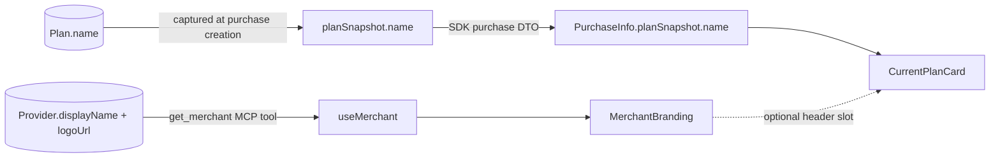

## Problem

Screenshot shows two regressions in the MCP checkout example:
1. Hardcoded `<h1>SolvaPay</h1>` page header — the example should show the merchant's branded display name / logo.
2. `<CurrentPlanCard>` prominently shows `pln_HVPI6W30` as the "plan name" because its fallback chain prefers `planRef` over `productName` ([CurrentPlanCard.tsx:163-164](solvapay-sdk/packages/react/src/components/CurrentPlanCard.tsx)), and the SDK purchase DTO carries no human-readable plan name at all.

Both should be fixed in the SDK so every integrator benefits.

## Architecture



## Changes

### 1. Backend: capture plan name on the purchase snapshot

- [src/purchases/flows/purchase-before-create.flow.ts](solvapay-backend/src/purchases/flows/purchase-before-create.flow.ts) — add `name: planData.name ?? null` to the `planSnapshot` object (around line 105).
- [src/purchases/types/purchase.types.ts](solvapay-backend/src/purchases/types/purchase.types.ts) — add `name?: string | null` to `PurchaseQueryResult.planSnapshot`.
- [src/purchases/schemas/purchase.schema.ts](solvapay-backend/src/purchases/schemas/purchase.schema.ts) — add `name?: string` to the schema's planSnapshot sub-object so Mongoose persists it.
- [src/purchases/types/purchase.dto.ts](solvapay-backend/src/purchases/types/purchase.dto.ts) — add `name?: string` to `PlanSnapshotDto` and `SdkPlanSnapshotDto` (new purchases only; old purchases fall back to productName on the SDK side).
- [src/customers/controllers/customer.sdk.controller.ts](solvapay-backend/src/customers/controllers/customer.sdk.controller.ts) — `planSnapshot` is already typed as `Record<string, unknown>`, so the field passes through; verify with a spec.
- No backfill (old purchases degrade to productName — acceptable per user direction).

### 2. SDK: surface plan name on `PurchaseInfo` + fix `<CurrentPlanCard>`

- [packages/react/src/types/index.ts](solvapay-sdk/packages/react/src/types/index.ts) — add `name?: string | null` to `PurchaseInfo.planSnapshot` (line 36).
- [packages/react/src/components/CurrentPlanCard.tsx](solvapay-sdk/packages/react/src/components/CurrentPlanCard.tsx) — change the resolution at line 163-164 from

```ts
const planName = activePurchase.planRef ?? activePurchase.planSnapshot?.reference ?? activePurchase.productName
```

to

```ts
const planName = activePurchase.planSnapshot?.name ?? activePurchase.productName
```

Drop `planRef` from the visible label entirely — it's an opaque ID. Keep it on a `data-solvapay-current-plan-ref` data attribute for QA / testing.

- Update [CurrentPlanCard.test.tsx](solvapay-sdk/packages/react/src/components/CurrentPlanCard.test.tsx) for the new precedence.

### 3. SDK: new `<MerchantBranding />` component

- `packages/react/src/components/MerchantBranding.tsx` — thin wrapper over `useMerchant()`:

```tsx
export interface MerchantBrandingProps {
  hideLogo?: boolean
  hideName?: boolean
  className?: string
  classNames?: { root?: string; logo?: string; name?: string }
}
```

Returns `null` while loading or on error (graceful degradation in sandboxed hosts that don't register `get_merchant`). Renders `{logoUrl && }` + `<span>{displayName}</span>` with a `data-solvapay-merchant-branding=""` hook. Export from [packages/react/src/index.tsx](solvapay-sdk/packages/react/src/index.tsx).

- Add `MerchantBranding.test.tsx` covering: renders displayName, renders logo when `logoUrl` is set, hides when hook errors, respects `hideLogo` / `hideName`.

### 4. SDK: optional header slot on `<CurrentPlanCard>`

Add two props so the example can drop the standalone `<h1>` and let the card own its branded header:

```ts
export interface CurrentPlanCardProps {
  // ...existing props...
  showBranding?: boolean
  header?: ReactNode
}
```

- `showBranding` → renders `<MerchantBranding />` above the plan info.
- `header` → custom node; takes precedence over `showBranding`.

User picked "both" in the clarifying question — standalone component + card header slot. Default behavior unchanged.

### 5. Example: register `get_merchant` and adopt the new components

- [examples/mcp-checkout-app/src/server.ts](solvapay-sdk/examples/mcp-checkout-app/src/server.ts) — register `MCP_TOOL_NAMES.getMerchant` wrapping `getMerchantCore` from `@solvapay/server`. One `registerAppTool` call, same pattern as the existing `get_payment_method` registration.
- [examples/mcp-checkout-app/src/mcp-app.tsx](solvapay-sdk/examples/mcp-checkout-app/src/mcp-app.tsx) — delete the hardcoded `<h1>SolvaPay</h1>` header at line 474. Pass `showBranding` to `<CurrentPlanCard>` inside `ManageBody`. For the non-paid states (awaiting / upgrade / cancelled) where the card isn't rendered, drop a standalone `<MerchantBranding />` at the top of the `<main>`.

### 6. Docs

- [packages/react/README.md](solvapay-sdk/packages/react/README.md) — add `<MerchantBranding />` to the "Account management in an MCP App" section; mention the new `showBranding` / `header` props on `<CurrentPlanCard>`.
- [examples/mcp-checkout-app/README.md](solvapay-sdk/examples/mcp-checkout-app/README.md) — add `get_merchant` to the Tools table; remove it from the roadmap bullet.
- Add a CHANGELOG entry for `@solvapay/react` (new component + CurrentPlanCard API additions).

## Out of scope

- Fixing `usePlan`'s transport-bypass (uses raw HTTP instead of `transport.listPlans`) — only relevant if we fetched plans lazily, which this plan avoids. Flag it as a follow-up broken-window.
- Backfilling `planSnapshot.name` on existing purchases — user explicitly accepted the productName fallback.
- Adding `list_plans` tool registration to the example — not needed for this fix.