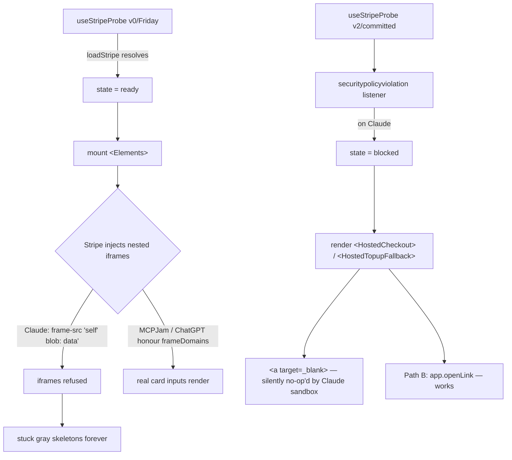

# Claude Stuck-Skeletons: Pivot the Demo, Plan the Bridge

## Confirmed diagnosis (locked in)

Three independent lines of evidence converge on the same answer:

**1. Friday-revert console proof (this morning).** The pre-v1 probe (`loadStripe + 3s timeout`) was reinstated locally with `[FRIDAY_PROBE_v1]` markers. On Claude:

```
[FRIDAY_PROBE_v1] useStripeProbe init { hasPk: true, pkPrefix: 'pk_test_5JSy' }
[FRIDAY_PROBE_v1] loadStripe resolved { hadStripe: true, result: 'ready' }
[FRIDAY_PROBE_v1] final state ready
Framing '<URL>' violates the following Content Security Policy directive:
  "frame-src 'self' blob: data:". The request has been blocked.
```

UI: four gray skeleton rows under "Pay with card", no card-number / expiry / CVC inputs.

**2. Git archaeology (full SDK history).** The MCP iframe widget code is at most 7 days old (first commit `22b663b` on 2026-04-20). Across every commit since, the embedded payment surface uses `<PaymentElement>` (Stripe nested iframes). There is no commit anywhere with `redirectToCheckout`, no auto-redirect on mount, no hand-rolled card form. The hosted fallback has always required a button click to `<a target="_blank">`.

**3. Anthropic public policy.** Documented since at least 2026-02-04 in [anthropics/claude-ai-mcp#40](https://github.com/anthropics/claude-ai-mcp/issues/40). Reaffirmed by Anthropic engineer @antonpk1 on 2026-04-09: _"Unfortunately we can't allow nested iframes on claude.ai at the moment (security concerns). Will keep you posted if we manage to unblock this."_ The block predates the entire SolvaPay MCP codebase.



**Conclusion.** The embedded Stripe form has never rendered on Claude in any commit of this codebase. What was perceived as "the form rendering" was always the stuck-skeleton state above. The v1/v2 probe upgrade (Apr 26) correctly detected the blocked state and routed to a fallback, surfacing the previously hidden brokenness.

## Path A — Demo path (primary, ready in minutes)

The demo runs on a host that honours `_meta.ui.csp.frameDomains` per the public test matrix. MCPJam and ChatGPT both pass; basic-host (MCP Inspector) also works. Zero SolvaPay code changes.

### Action steps

1. **Restore committed v2 probe.** `git checkout -- packages/react/src/mcp/useStripeProbe.ts` in `solvapay-sdk`. Confirm file is back to ~234 lines with `securitypolicyviolation` listener + active throwaway-mount.
2. **Verify bundle rebuilt.** Vite `--watch` rebuilds [examples/mcp-checkout-app/dist/mcp-app.html](solvapay-sdk/examples/mcp-checkout-app/dist/mcp-app.html). Spot-check: `grep -c "FRIDAY_PROBE_v1"` returns 0; `grep -c "securitypolicyviolation"` returns >0.
3. **Smoke on MCPJam / ChatGPT.** Open the existing MCP connector in your chosen host, trigger `topup`, verify real card-number / expiry / CVC inputs render. Run a $0.01 charge end-to-end, verify the balance increments.
4. **Record a fallback video** of the working flow. Last-resort backup if anything destabilises before demo.
5. **Cleanup.** `git worktree remove /tmp/solvapay-sdk-friday`. `rm /tmp/mcp-app-monday.html /tmp/served.html`.

### Why this is the right call for today

- Zero code-change risk for a demo in a few hours.
- Aligns with public Anthropic guidance (don't depend on nested iframes on Claude).
- The audience cares the SDK works inside an MCP host iframe — not which host. MCPJam and ChatGPT are widely recognised as legitimate MCP hosts.
- v2 probe restoration is independent of host choice and makes the SDK behave correctly everywhere.

## Path B — Post-demo `app.openLink` wiring (drafted)

Wires `@modelcontextprotocol/ext-apps@1.5.0`'s `app.openLink({ url })` so the hosted-fallback button actually navigates on Claude. Already verified in `node_modules/.pnpm/@modelcontextprotocol+ext-apps@1.5.0_*/dist/src/app.d.ts:1024-1027` that the API exists in the locked version:

```typescript
openLink(params: McpUiOpenLinkRequest["params"], options?: RequestOptions): Promise<{
    isError?: boolean | undefined;
}>;
```

Unknown: whether Claude's host implementation responds to the request or returns "method not found". Defensive fallback to `<a target="_blank">` covers either case.

### Design

- Plumb the existing ext-apps `App` instance (already created somewhere in the bootstrap, e.g. the postMessage transport setup) into a React context — call it `McpAppContext`.
- New hook: `useOpenLink()` returns `(url: string) => Promise<'opened' | 'denied' | 'unsupported'>`.
  - If `app` is available and host capabilities advertise the bridge → `await app.openLink({ url })`. Map `isError: true` → `'denied'`. Resolved without error → `'opened'`.
  - On thrown "method not found" → `'unsupported'`.
- Refactor [packages/react/src/components/LaunchCustomerPortalButton.tsx](solvapay-sdk/packages/react/src/components/LaunchCustomerPortalButton.tsx) and the `HostedLinkButton` used by `HostedCheckout` to:
  1. Call `useOpenLink()(url)` on click.
  2. On `'unsupported'` → fall through to native `<a target="_blank">` behaviour.
  3. On `'denied'` → render the URL inline as copy-able text + a manual "Copy link" button.
  4. On `'opened'` → start the existing polling loop for the success outcome.

### Files to touch (estimated)

- `packages/react/src/mcp/context/McpAppContext.tsx` (new) — provides `App` instance to descendants.
- `packages/react/src/mcp/hooks/useOpenLink.ts` (new) — the hook.
- `packages/react/src/components/LaunchCustomerPortalButton.tsx` (existing) — swap anchor for hook-driven onClick.
- `packages/react/src/mcp/views/McpCheckoutView.tsx` (existing) — `HostedLinkButton` swap.
- `examples/mcp-checkout-app/src/mcp-app.tsx` (existing) — provide `App` to the context provider at root.
- Tests: probe + click handlers + denied-fallback path.
- Changeset: `@solvapay/react` minor.

### Verification

- Test on Claude: probe says blocked → button renders → click → host opens external tab → user completes hosted Stripe checkout → polling detects → balance updates in widget.
- Test on MCPJam / ChatGPT: probe says ready → embedded form renders directly (Path A path still works, openLink never called).
- Test on a host that doesn't implement openLink (if findable): falls back to `<a>` cleanly.

## Out of scope

- v3 probe redesign — v2 is correct for the observed Claude behaviour.
- Any custom non-Stripe-iframe card collection (PCI compliance burden, would not be ready today).
- Lobbying Anthropic to honour `_meta.ui.csp.frameDomains` — separate workstream tracked via `claude_payment_form_csp_fix_e08bf43f.plan.md`.
- The `hosted_checkout_open_link_fallback.plan.md` already in `solvapay-sdk/.cursor/plans/` overlaps with Path B — once Path A demo is done, that plan should be reconciled with this one (likely merged into a single execution plan).
