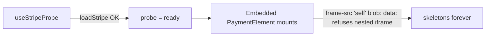
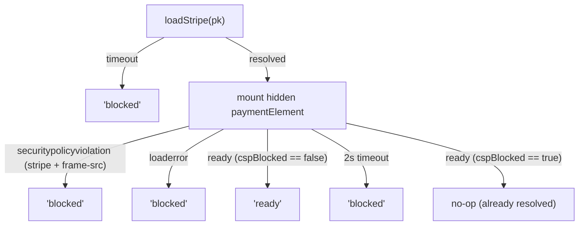

# Fix Claude.ai stuck payment-form skeletons (minimal)

## Symptom

On claude.ai, any SolvaPay intent tool that ends in a card-capture step shows the surrounding UI fine but 4 gray skeleton rows where the Stripe `PaymentElement` should be — never resolve. Reproduces on production and local ngrok. Works on MCPJam.

Affected flows:
- `manage_account` → "Change plan" → `RecurringPaymentStep`
- `upgrade` → `RecurringPaymentStep`
- `topup` → `TopupForm`

All three mount a Stripe `PaymentElement`, so they all fail identically.

## Root cause

Claude's MCP-app iframe hardcodes `frame-src 'self' blob: data:`. Console on claude.ai:

```
Framing 'https://js.stripe.com/' violates the following Content Security Policy directive:
"frame-src 'self' blob: data:". The request has been blocked.
```

(Fires twice — once per Stripe element iframe.) `loadStripe()` itself resolves because **`script-src`** permits `https://js.stripe.com/v3/`. The failure is strictly **`frame-src`**, on the nested iframes `PaymentElement` creates after mount.

[`useStripeProbe.ts:50-54`](solvapay-sdk/packages/react/src/mcp/useStripeProbe.ts) only races `loadStripe()` vs a 3 s timer — which tests `script-src`, not `frame-src`:

```50:54:solvapay-sdk/packages/react/src/mcp/useStripeProbe.ts
    const load = loadStripe(publishableKey)
      .then(stripe => (stripe ? 'ready' : 'blocked'))
      .catch(() => 'blocked' as const)

    Promise.race([load, timeout]).then(result => {
```

So the probe returns `'ready'`, [`McpCheckoutView`](solvapay-sdk/packages/react/src/mcp/views/McpCheckoutView.tsx) / [`McpTopupView`](solvapay-sdk/packages/react/src/mcp/views/McpTopupView.tsx) commit to the embedded branch, and Stripe's own skeletons (inside the refused iframes) sit there forever.

MCPJam honors our declared `_meta.ui.csp.frameDomains` ([`packages/mcp-core/src/csp.ts:20`](solvapay-sdk/packages/mcp-core/src/csp.ts)), so the nested iframes load and skeletons resolve into real inputs.



## Fix (one file)

Rewrite [`packages/react/src/mcp/useStripeProbe.ts`](solvapay-sdk/packages/react/src/mcp/useStripeProbe.ts) to probe what actually matters — mount a real Stripe `paymentElement` on a hidden node and wait for its `ready` event:

1. `const stripe = await loadStripe(publishableKey)` — keep existing step, fast-fail on `script-src`-blocked hosts. If `loadStripe` rejects or times out, return `'blocked'`.
2. `const elements = stripe.elements({ mode: 'setup', currency: 'usd' })`
3. `const el = elements.create('paymentElement')`
4. Create a hidden host node (absolute, `width:1px; height:1px; opacity:0; pointer-events:none; left:-9999px`) and append to `document.body`.
5. `el.mount(node)`, then `el.on('ready', …)` → `'ready'`; `el.on('loaderror', …)` → `'blocked'`; ~2 s timeout → `'blocked'`.
6. Always `el.unmount()` + remove the host node on resolve or effect cleanup; guard against StrictMode double-invoke with a cancellation flag.

Total new budget ≤ 5 s (script load up to 3 s + iframe mount up to 2 s). Public return type unchanged: still `'loading' | 'ready' | 'blocked'`. All call sites (`McpCheckoutView`, `McpTopupView`, their tests) stay untouched.

Header comment updated to say the probe exercises `script-src` and `frame-src`.

### Why nothing else changes

Both views already have hosted fallbacks wired to the probe result:
- [`McpCheckoutView.tsx:141-149`](solvapay-sdk/packages/react/src/mcp/views/McpCheckoutView.tsx) → `HostedCheckout`
- [`McpTopupView.tsx:83`](solvapay-sdk/packages/react/src/mcp/views/McpTopupView.tsx) → `HostedTopupFallback`

Fix the probe, and both paths route correctly on Claude automatically. No `PaymentForm` / `TopupForm` / view edits, no new context fields, no runtime-degrade machinery.

## Tests

Add `packages/react/src/mcp/__tests__/useStripeProbe.test.ts` (mock `@stripe/stripe-js`'s `loadStripe` + a stub `Stripe`/`Elements`/`Element` with `on`/`mount`/`unmount`):

- `publishableKey === null` → `'blocked'` synchronously.
- `loadStripe` rejects → `'blocked'`.
- Element `ready` fires → `'ready'`; host node is removed.
- Element `loaderror` fires → `'blocked'`; host node is removed.
- Neither fires within 2 s → `'blocked'`; host node is removed.
- Unmount before resolution cancels state update (no "can't set state on unmounted component" warning).

Existing tests stay as-is: [`McpCheckoutView.test.tsx:97`](solvapay-sdk/packages/react/src/mcp/views/__tests__/McpCheckoutView.test.tsx) and [`update-model-context.emissions.test.tsx:77`](solvapay-sdk/packages/react/src/mcp/__tests__/update-model-context.emissions.test.tsx) both mock `useStripeProbe` directly — no change needed.

## Changeset

`@solvapay/react` patch: "useStripeProbe now waits for a hidden PaymentElement's `ready` event, so partial-CSP hosts (Claude today: `frame-src 'self' blob: data:`) route to hosted checkout instead of hanging on Stripe's internal skeletons."

## Verification

1. `pnpm -F @solvapay/react test`
2. Run `examples/cloudflare-workers-mcp`, exercise `upgrade`, `topup`, `manage_account` → "Change plan" on:
   - **Claude.ai**: hosted fallback shows immediately; zero `Framing 'https://js.stripe.com/'` CSP errors in console.
   - **MCPJam**: embedded `PaymentElement` still renders inputs normally.

## Out of scope (explicit)

- `PaymentForm` / `TopupForm` `onReady` runtime timeout — not needed once the probe is correct; revisit only if a new host surfaces a partial-CSP variant the probe misses.
- Host-sniffing for `claude.ai` — brittle, rejected.
- Claude's upstream CSP fix (`anthropics/claude-ai-mcp#40`) — when they honor `_meta.ui.csp.frameDomains` the new probe will simply return `'ready'` faster. No code change needed on our side.
- Unrelated `link rel="preload"` warnings for `api-dev.solvapay.com/.../icons/*.stripe.1` — separate plan ([`mcp_server_merchant_favicon.plan.md`](mcp_server_merchant_favicon.plan.md)).
- Hosted-fallback's `Reopen checkout` button being blocked by Claude's iframe sandbox (`allow-popups` unset). Once the probe routes correctly, the sandbox blocks `window.open` on the fallback — separate plan ([`hosted_checkout_open_link_fallback.plan.md`](hosted_checkout_open_link_fallback.plan.md)).

---

## Update: v2 — `SecurityPolicyViolationEvent` gate

Shipped on branch `fix/mcp-host-ui-polish`, [PR #142](https://github.com/solvapay/solvapay-sdk/pull/142). Two commits:

- `2e09385` — v1 as specified above: mount hidden Payment Element, race `ready` / `loaderror` / 2s timeout.
- `7c656bb` — v2 hardening, added after smoke-testing v1 on Claude revealed the `ready` signal itself is unreliable.

### What v1 missed

The v1 plan assumed Stripe's `ready` event only fires when the nested iframe actually loads. Wrong. Chrome's behaviour for a CSP-refused iframe is to insert the element but swap its content for a synthetic `chrome-error://chromewebdata/` placeholder and report `load`. Stripe's JS sees a successful DOM insertion and fires `ready` anyway. The console signature on Claude under v1:

```
Unsafe attempt to load URL https://js.stripe.com/v3/m-outer-3437aad…html
  from frame with URL chrome-error://chromewebdata/
```

…cascading ~5 entries because Stripe continued creating nested iframes (payment-request, controller-with-preconnect, elements-inner-accessory, …) after the initial `ready`. The probe resolved `'ready'` and committed to the embedded branch. Same four stuck skeletons.

### What v2 added

The reliable signal is the standard DOM `SecurityPolicyViolationEvent` (`securitypolicyviolation`) — Chrome dispatches it on `document` synchronously when it refuses an iframe, and typically *before* Stripe's bogus `ready` fires. [`useStripeProbe.ts`](solvapay-sdk/packages/react/src/mcp/useStripeProbe.ts) now:

- Attaches a `securitypolicyviolation` listener on `document` *before* mounting the Payment Element. Filter narrows to `effectiveDirective === 'frame-src'` with a `stripe.com` `blockedURI` so unrelated host CSP noise is ignored.
- Resolves `'blocked'` immediately on a matching violation.
- Treats `ready` as authoritative only when no stripe-domain violation has fired — the `ready` handler no-ops once the `cspBlockedStripeFrame` flag is set.
- Removes the listener on resolve, effect cleanup, and unmount-before-resolution.

Updated flow:



### Tests added in v2

In addition to v1 cases:

- Stripe-domain `frame-src` violation → `'blocked'`.
- Violation wins over a later bogus `ready` (stays `'blocked'`).
- Non-stripe / non-`frame-src` violations ignored (probe still resolves `'ready'` on `ready`).
- CSP listener removed on unmount — late events don't fire a setState.

Suite at 666/666 green at commit `7c656bb` (-5 when the McpApp icon-preload fix was subsequently reverted to narrow this branch's scope).

### Smoke results

- **Claude.ai** via local ngrok: widget shows hosted-checkout fallback UI ("Waiting for payment… Reopen checkout"). The `Framing 'https://js.stripe.com/'` cascade collapses from ~5 iframe attempts to a single violation event that the probe immediately acts on and tears down. (Clicking the "Reopen checkout" button itself is still blocked by Claude's iframe sandbox — follow-up in [`hosted_checkout_open_link_fallback.plan.md`](hosted_checkout_open_link_fallback.plan.md).)
- **MCPJam**: embedded `PaymentElement` flow unchanged — no violation fires, `ready` lands, probe returns `'ready'`, form inputs render normally.
