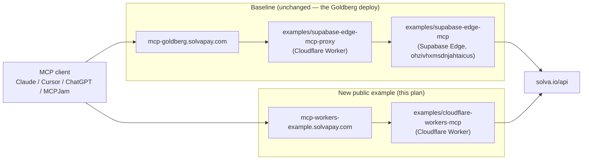

# Cloudflare Workers MCP example (staging-only)

Public identity of the example is runtime-only ("Cloudflare Workers starter for SolvaPay MCP"); "Goldberg" is an internal codename for the live demo instance we're comparing against — it stays out of the public repo surfaces (directory name, Wrangler name, resourceUri, staging route, demo-tools docstring, README framing). The live `mcp-goldberg.solvapay.com` production URL keeps its name because that's the baseline we measure against — we don't touch it in this plan.

## Why this plan had to change

The original plan at [`.cursor/plans/goldberg_cloudflare_workers_example_c65edbe7.plan.md`](/Users/tommy/projects/solvapay/solvapay-frontend/.cursor/plans/goldberg_cloudflare_workers_example_c65edbe7.plan.md) was drafted before the consolidation that shipped in PR #135. The refactor invalidates three of the plan's baseline assumptions; I'm correcting them here before executing.

- **`@solvapay/mcp-fetch` no longer exists as a standalone package** — its contents became the `./fetch` subpath of `@solvapay/mcp@0.2.x`. Every plan reference to `@solvapay/mcp-fetch` becomes `@solvapay/mcp` + `import … from '@solvapay/mcp/fetch'`.
- **`demo-tools.ts` is already runtime-agnostic.** [`examples/supabase-edge-mcp/supabase/functions/mcp/demo-tools.ts`](/Users/tommy/projects/solvapay/solvapay-sdk/examples/supabase-edge-mcp/supabase/functions/mcp/demo-tools.ts) reads env via `readEnv()` (tries `Deno.env.toObject()`, falls back to `process.env`, falls back to `{}`), and `demoToolsEnabled(env?)` already takes an optional `Record<string, string | undefined>`. No `Deno.env.get` calls in any handler. Port is a pure copy plus an import-source tweak.
- **Three of the four "supersedes" targets don't exist.** Only [`solvapay-sdk/.cursor/plans/worker_cache_well_known_c7a91e3b.plan.md`](/Users/tommy/projects/solvapay/solvapay-sdk/.cursor/plans/worker_cache_well_known_c7a91e3b.plan.md) is on disk; that task collapses to a single-file edit (and is arguably moot since a colocated Workers deploy obviates the proxy's caching job entirely).

Everything else the original plan assumed about the SDK is **live as of dev HEAD (`4226018`)**: `createSolvaPayMcpFetch` exists at [`packages/mcp/src/fetch/createSolvaPayMcpFetch.ts`](/Users/tommy/projects/solvapay/solvapay-sdk/packages/mcp/src/fetch/createSolvaPayMcpFetch.ts) with `mode?: 'json-stateless' | 'sse-stateful' | 'sse-stateless'` (handler.ts line 37), `hideToolsByAudience?: string[]`, the per-request mutex is implemented in `createSolvaPayMcpFetchHandler`, and CSP auto-includes `apiBaseUrl` (0.2.1-preview, merged today in PR #137).

## Naming — Goldberg vs public example

The public example's identity is runtime-only. "Goldberg" is an internal codename for the live demo instance (and the Supabase project hosting it) — for public repo hygiene it's kept out of every surface an integrator would read when cloning the starter.

| Surface | Name | Why |
|---|---|---|
| Example directory | `examples/cloudflare-workers-mcp/` | Matches `examples/supabase-edge-mcp/` — runtime is the distinguishing axis |
| Wrangler `name` | `solvapay-mcp-workers-example` | Shows up in `wrangler deploy` output + CF dashboard; must be generic |
| Staging route | `mcp-workers-example.solvapay.com` | Public URL; outlives the comparison exercise as the canonical example endpoint |
| `resourceUri` | `ui://solvapay-mcp-example/mcp-app.html` | The URI authority is public via `resources/list` on every connected MCP client |
| `demo-tools.ts` header | "Demo paywalled tools — toy stock-predictor oracle. Swap in `registerDemoTools`." | Describes what the tools do, not who deployed them |
| Tool names | `predict_price_chart`, `predict_direction` | Already generic — keep |
| README framing | "Cloudflare Workers starter for SolvaPay MCP" | Reads as a template, not a specific product |
| **Baseline for comparison** | `mcp-goldberg.solvapay.com` | **Unchanged**. This is the live Goldberg deploy we're measuring against; we don't touch it in this plan |

The live Goldberg deploy's merchant secret + product ref get reused for the staging deploy so backend behaviour is identical — that's a config-layer thing, not repo-visible. An integrator cloning the starter enters their own `SOLVAPAY_PRODUCT_REF` + `SOLVAPAY_SECRET_KEY`.

`examples/supabase-edge-mcp/` currently has Goldberg strings in its `config.toml`, `demo-tools.ts`, `.env.example`, and README — **deferred** to a follow-up PR so this plan stays staging-focused (tracked as `followup-supabase-degoldberg` in the todos).

## Explicit non-goals (this plan)

Based on your `staging_only` + `duplicate_source` selection:

- **No DNS cutover** of `mcp-goldberg.solvapay.com`. That subdomain keeps pointing at `examples/supabase-edge-mcp-proxy` → Supabase Edge until we evaluate the measurements and open a cutover plan.
- **No changes** to `examples/supabase-edge-mcp/` or `examples/supabase-edge-mcp-proxy/`.
- **No retirement** of the `ohzivhxmsdnjahtaicus` Supabase project, no 1Password changes, no SDK changelog entry about retirement.
- **No MCP Apps widget source refactor** into a shared package. Duplicate verbatim for now; revisit if drift bites.

## Architecture (after this plan)



Both paths terminate at the same `@solvapay/mcp/fetch` factory pointing at the same upstream API and using the same merchant secret key — the only variable is the edge runtime + geography. That's the isolation we want for the latency comparison.

## Target file layout

```
examples/cloudflare-workers-mcp/
├── package.json              // deps: @solvapay/server, @solvapay/mcp
├── wrangler.jsonc            // custom_domain mcp-goldberg-cf.solvapay.com
├── tsconfig.json             // ES2022, Bundler, @cloudflare/workers-types
├── vite.config.ts            // duplicated from supabase-edge-mcp
├── mcp-app.html              // top-level HTML entry (duplicated)
├── .dev.vars.example         // SOLVAPAY_SECRET_KEY, SOLVAPAY_PRODUCT_REF, …
├── README.md
└── src/
    ├── worker.ts             // ~20 line entrypoint
    ├── demo-tools.ts         // copy + import-source tweak only
    ├── mcp-app.tsx           // widget entry, duplicated
    ├── solvapay.tsx          // widget consumer, duplicated
    └── assets/
        └── mcp-app.html      // Vite build output; imported as text
```

## Target `src/worker.ts`

```typescript
import { createSolvaPay } from '@solvapay/server'
import { createSolvaPayMcpFetch } from '@solvapay/mcp/fetch'
import { demoToolsEnabled, registerDemoTools } from './demo-tools'
import mcpAppHtml from './assets/mcp-app.html'

interface Env {
  SOLVAPAY_SECRET_KEY: string
  SOLVAPAY_PRODUCT_REF: string
  MCP_PUBLIC_BASE_URL: string
  SOLVAPAY_API_BASE_URL?: string
  DEMO_TOOLS?: string
}

export default {
  async fetch(req: Request, env: Env): Promise<Response> {
    const apiBaseUrl = env.SOLVAPAY_API_BASE_URL ?? 'https://solva.io/api'
    return createSolvaPayMcpFetch({
      solvaPay: createSolvaPay({ apiKey: env.SOLVAPAY_SECRET_KEY, apiBaseUrl }),
      productRef: env.SOLVAPAY_PRODUCT_REF,
      resourceUri: 'ui://solvapay-mcp-example/mcp-app.html',
      readHtml: async () => mcpAppHtml,
      publicBaseUrl: env.MCP_PUBLIC_BASE_URL,
      apiBaseUrl,
      hideToolsByAudience: ['ui'],
      additionalTools: demoToolsEnabled(env) ? registerDemoTools : undefined,
      mode: 'json-stateless',
    })(req)
  },
}
```

Note: **`@solvapay/mcp/fetch` is a subpath of `@solvapay/mcp`** — one dep, one factory call, no `createSolvaPayMcpServer` wiring.

## `wrangler.jsonc` essentials

```jsonc
{
  "name": "solvapay-mcp-workers-example",
  "main": "src/worker.ts",
  "compatibility_date": "2026-04-26",
  "compatibility_flags": ["nodejs_compat"],
  "rules": [{ "type": "Text", "globs": ["**/*.html"] }],
  "routes": [{ "pattern": "mcp-workers-example.solvapay.com", "custom_domain": true }],
  "vars": {
    // Replace with your SolvaPay product ref when cloning this starter.
    // For this exercise we set it to the same ref Goldberg uses so the
    // comparison isolates to edge runtime, not merchant config.
    "SOLVAPAY_PRODUCT_REF": "<your-product-ref>",
    "MCP_PUBLIC_BASE_URL": "https://mcp-workers-example.solvapay.com",
    "SOLVAPAY_API_BASE_URL": "https://solva.io/api",
    "DEMO_TOOLS": "1"
  }
}
```

`SOLVAPAY_SECRET_KEY` via `wrangler secret put SOLVAPAY_SECRET_KEY` (for this exercise: same live key the Goldberg Supabase deploy uses, so measurements isolate to edge runtime — an integrator cloning the starter would use their own key).

## Demo-tools port (single file, minimal)

Copy [`examples/supabase-edge-mcp/supabase/functions/mcp/demo-tools.ts`](/Users/tommy/projects/solvapay/solvapay-sdk/examples/supabase-edge-mcp/supabase/functions/mcp/demo-tools.ts) verbatim for the function bodies. The only edit is the header doc-comment, which currently reads:

> *"Goldberg paywalled Oracle tools for `supabase-edge-mcp`."*

Rewrite to something like:

> *"Demo paywalled tools for the Cloudflare Workers MCP starter — a toy stock-predictor oracle (`predict_price_chart`, `predict_direction`) that shares a seeded simulation so the two tools agree per ticker. Swap in your own handlers via `registerDemoTools`."*

The function signature is already runtime-agnostic:

```ts
export function demoToolsEnabled(env: Record<string, string | undefined> = readEnv()): boolean {
  return env.DEMO_TOOLS !== 'false'
}
```

The Workers entrypoint passes its env binding explicitly (`demoToolsEnabled(env)`), so `readEnv()` never runs on the Workers path — which incidentally sidesteps Deno-shaped globals. `registerDemoTools` and the oracle math are copied without edit. The tool names `predict_price_chart` and `predict_direction` are already generic; they stay.

## Widget asset (duplicate source)

Copy from `examples/supabase-edge-mcp/`:

- Top-level `mcp-app.html`
- `src/mcp-app.tsx`, `src/solvapay.tsx` (and any sibling TSX files)
- `vite.config.ts`

Wire the build into the Workers example's `package.json` as:

```jsonc
"scripts": {
  "build": "cross-env INPUT=mcp-app.html vite build && cp dist/mcp-app.html src/assets/mcp-app.html",
  "predeploy": "pnpm build",
  "deploy": "wrangler deploy",
  "dev": "wrangler dev"
}
```

`wrangler`'s `rules: [{ type: 'Text', globs: ['**/*.html'] }]` resolves `import mcpAppHtml from './assets/mcp-app.html'` to the string contents — no Workers Assets binding required.

Both READMEs (this one + `supabase-edge-mcp`'s) get a "remember to sync if you change the widget" note so drift is at least visible.

## Validation criteria (the SDK-maturity read)

Because you flagged the "start fresh" ethos, I'm adding these as explicit outputs of the exercise, to capture in the staging PR description:

- **Zero-context integrator test:** how many SDK surfaces did I have to read to get from empty dir to working `mcp-workers-example.solvapay.com`? Count the files.
- **Copy-paste fidelity:** did the JSDoc example on [`packages/mcp/src/fetch/index.ts`](/Users/tommy/projects/solvapay/solvapay-sdk/packages/mcp/src/fetch/index.ts) (lines 8-25) compile without modification? Any gotchas?
- **Error affordances:** what does the SDK do if `SOLVAPAY_SECRET_KEY` is missing, `productRef` is wrong, or `readHtml` throws? Log the UX.
- **Bundle size:** `wrangler deploy --dry-run` output; how close to the 1MB Workers limit after bundling `@solvapay/mcp` + `@solvapay/server` + `@modelcontextprotocol/*`?

## Side-by-side measurement rubric

Capture in the staging PR description — 5 cold + 5 warm samples per endpoint per host:

- `GET /.well-known/oauth-authorization-server`
- `POST /` with `initialize`
- `POST /` with `tools/list`
- `POST /` with `tools/call predict_price_chart`

Hosts:

- `https://mcp-goldberg.solvapay.com` (baseline — live Goldberg on Supabase Edge via Cloudflare proxy; unchanged by this plan)
- `https://mcp-workers-example.solvapay.com` (the new public Workers example, deployed against the same merchant secret + product ref for this exercise)

"Cold" = first request after 5 minutes idle; "warm" = follow-on requests within the same session. Report p50 + p95 and any regressions by client.

Clients to spot-check: Claude Desktop, Cursor, ChatGPT connector, MCPJam, MCP Inspector.

## Superseded plan (single file)

Add a `superseded_by` note to [`solvapay-sdk/.cursor/plans/worker_cache_well_known_c7a91e3b.plan.md`](/Users/tommy/projects/solvapay/solvapay-sdk/.cursor/plans/worker_cache_well_known_c7a91e3b.plan.md) pointing to this plan (id `cloudflare_workers_mcp_example_299944db`). One-line rationale: a colocated public Workers example obviates the proxy's `.well-known` caching job. The other three plans cited in the original draft don't exist on disk — skip.

## Risks / known unknowns

- **Widget source duplication**: any change to Goldberg's MCP App UI will need to be applied in both examples until/unless we extract a shared package. Flagged in READMEs.
- **Cloudflare zone + account access**: the existing `supabase-edge-mcp-proxy` already uses a `custom_domain` route on `solvapay.com`, which proves the CF account + zone are wired. But I'll need you to confirm whether `mcp-workers-example.solvapay.com` needs a DNS record created beforehand or whether Wrangler's `custom_domain: true` provisions it on first deploy (depends on how the proxy's route was originally set up — verifying during staging deploy is fine).
- **Bundle size surprise**: `@modelcontextprotocol/sdk` + `@solvapay/mcp` + `@solvapay/server` may push close to the 1MB Workers limit (paid tier: 10MB). If we hit the free-tier 1MB ceiling, the mitigation is already documented in the original plan's "deferred `mcp-fetch-lite`" section — noted but not in scope here.
- **Two Deno env names you already use** (`SOLVAPAY_API_BASE_URL`, `SOLVAPAY_PRODUCT_REF`) will need to be re-entered in Wrangler. Fine to script via `wrangler secret put` + `wrangler.jsonc` vars; I'll copy values from the linked Supabase project's dashboard.