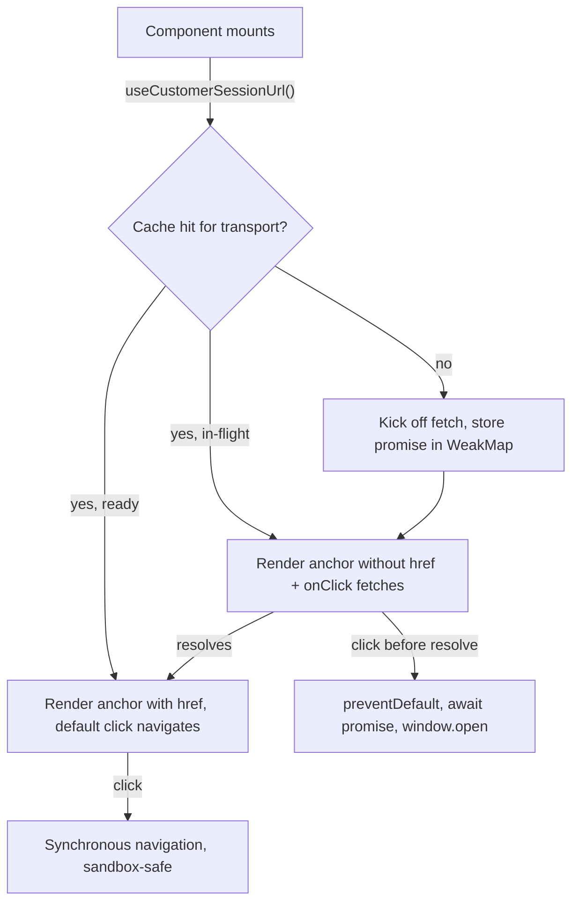

## Why

[`LaunchCustomerPortalButton.tsx:78-95`](solvapay-sdk/packages/react/src/components/LaunchCustomerPortalButton.tsx) fires `transport.createCustomerSession()` in a `useEffect` on mount and renders a disabled "Loading..." `<button>` until the URL resolves. The account view in your screenshot mounts it twice (Manage billing + Update card via [`CurrentPlanCard.tsx:278`](solvapay-sdk/packages/react/src/components/CurrentPlanCard.tsx)), so first paint shows two greyed-out buttons and fires two parallel portal-session round-trips. The session URL doesn't gate the button label or markup — it's only needed at click time.

The existing rationale (preserve transient activation for sandboxed `<a target="_blank">` clicks on Claude) is preserved: when the URL is cached by click time, the click is a synchronous anchor navigation. Only the cache-miss path fetches inside the click handler, and on the demo host (ChatGPT) we expect that path to work too.

## Scope

- Render `<LaunchCustomerPortalButton>` enabled+labeled immediately, regardless of session state.
- Share a single in-flight `createCustomerSession()` promise across all button instances under the same transport.
- Drop the inline "Update card" button from the MCP account view (the customer-portal-driven update flow isn't fully wired and we have no second entry point we want to keep yet). Keep the [`UpdatePaymentMethodButton`](solvapay-sdk/packages/react/src/components/UpdatePaymentMethodButton.tsx) component itself exported for the future Lovable PR — only the widget consumption changes.

## Architecture

Single source of truth for the session URL, keyed by transport identity via a module-scoped `WeakMap<Transport, SessionEntry>` so multiple `<SolvaPayProvider>` instances stay isolated and GC-friendly. No new context provider needed.

## Files to touch

### New

- [`packages/react/src/hooks/useCustomerSessionUrl.ts`](solvapay-sdk/packages/react/src/hooks/useCustomerSessionUrl.ts) — internal hook returning `{ status: 'idle' | 'loading' | 'ready' | 'error'; url?: string; error?: Error; ensure: () => Promise<string> }`. The first call per transport kicks off the fetch and stores the promise in a WeakMap; subsequent calls subscribe via `useSyncExternalStore` over a tiny ref-counted listener set so all instances re-render together. `ensure()` is the click-time accessor — returns the cached URL or awaits the in-flight promise.
- [`packages/react/src/hooks/useCustomerSessionUrl.test.tsx`](solvapay-sdk/packages/react/src/hooks/useCustomerSessionUrl.test.tsx) — covers de-dupe across two consumers, error propagation, refresh, and `ensure()` resolving for late subscribers.

### Refactor

- [`packages/react/src/components/LaunchCustomerPortalButton.tsx`](solvapay-sdk/packages/react/src/components/LaunchCustomerPortalButton.tsx):
  - Replace the in-component `useEffect` + `useState` with `useCustomerSessionUrl()`.
  - Always render an `<a>` (or `Slot` when `asChild`) with the resolved label. When `status === 'ready'`, set `href={url} target="_blank" rel="noopener noreferrer"` so click is a pure synchronous navigation.
  - When the URL isn't ready yet, render the same `<a>` without `href` and a click handler that calls `ensure().then(url => window.open(url, '_blank', 'noopener,noreferrer'))`.
  - Drop the disabled-loading state. Keep `loadingClassName` / `errorClassName` props but apply them only as a brief overlay class on the click-time pending and error states (back-compat).
  - Update the docblock to reflect the new behavior.

- [`packages/react/src/mcp/views/McpAccountView.tsx`](solvapay-sdk/packages/react/src/mcp/views/McpAccountView.tsx) — change the `<CurrentPlanCard />` call at line 122 to `<CurrentPlanCard hideUpdatePaymentButton />`. One-line change. (`hideUpdatePaymentButton` is already plumbed through [`CurrentPlanCard.tsx:278`](solvapay-sdk/packages/react/src/components/CurrentPlanCard.tsx).)

### Tests

- [`packages/react/src/components/LaunchCustomerPortalButton.test.tsx`](solvapay-sdk/packages/react/src/components/LaunchCustomerPortalButton.test.tsx):
  - Replace the "renders a disabled loading button while the fetch is in flight" assertion (no longer the contract) with "renders an enabled link immediately and fetches lazily."
  - Add a test: click before the cache resolves → the click is held, fetch resolves, `window.open` is called with the resolved URL.
  - Add a test: two `<LaunchCustomerPortalButton>` instances under the same transport trigger a single `createCustomerSession()` call.
  - Keep the existing `onLaunch` / `onError` / `asChild` cases, adapted for the new markup.
- [`packages/react/src/components/UpdatePaymentMethodButton.test.tsx`](solvapay-sdk/packages/react/src/components/UpdatePaymentMethodButton.test.tsx) — update behavioral assertions analogously.
- [`packages/react/src/mcp/views/__tests__/McpAccountView.test.tsx`](solvapay-sdk/packages/react/src/mcp/views/__tests__/McpAccountView.test.tsx) — assert "Update card" label is no longer rendered. Verify "Manage billing" still appears on paid-plan path.

### Docs / changeset

- [`packages/react/README.md:277`](solvapay-sdk/packages/react/README.md) — rewrite the "pre-fetches" claim.
- [`docs/guides/mcp-app.mdx:168`](solvapay-sdk/docs/guides/mcp-app.mdx) — already wrong (claims "on hover"); replace with the new render-eager + click-time fetch description.
- [`.changeset/`](solvapay-sdk/.changeset/) new patch entry on `@solvapay/react`: "LaunchCustomerPortalButton renders enabled immediately and shares a single customer-session fetch across instances."

## Out of scope

- `app.openLink` wiring (Path B from [`claude-stuck-skeletons-pivot`](.cursor/plans/claude-stuck-skeletons-pivot_22a05fb9.plan.md)) — held for the post-demo follow-up that reconciles with [`hosted_checkout_open_link_fallback.plan.md`](solvapay-sdk/.cursor/plans/). On Claude this plan keeps today's behavior on cache miss (silently no-op'd by the sandbox); on cache hit the synchronous anchor click works.
- Removing or moving the `<UpdatePaymentMethodButton>` export. The component still ships, it's just not rendered inside the MCP widget.
- Hover-pre-fetch (the docs' currently-wrong claim) — explicit lazy-via-`ensure` is simpler and tests cleanly.
- Any changes to `transport.createCustomerSession()` itself or its caching on the server.

## Verification

1. `pnpm -F @solvapay/react test` — unit + type green.
2. `pnpm -F @solvapay/react build`.
3. The Vite watcher in [`examples/mcp-checkout-app`](solvapay-sdk/examples/mcp-checkout-app) picks up the change automatically; refresh the MCP connector in ChatGPT and confirm:
   - On the account view: a single "Manage billing" button renders enabled immediately, no greyed-out skeleton, no "Update card" button.
   - Network tab shows exactly one `create_customer_session` call regardless of how many surfaces mount the button.
   - Clicking "Manage billing" opens the Stripe customer portal in a new tab.
4. Capture the corrected demo run as the fallback recording.
