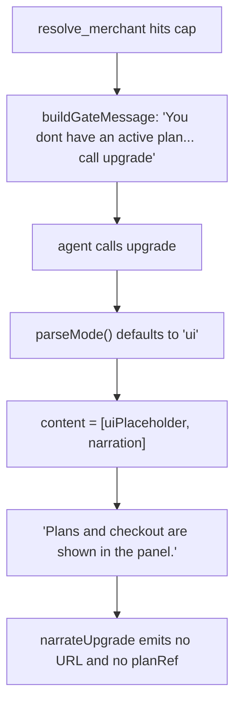

Ref: [DEV-867](https://linear.app/solvapay/issue/DEV-867/improve-mcp-gating-user-flow-for-text-only-hosts)

**Status at time of writing:** docs, contributor rules and examples have landed (uncommitted → now on this branch). No implementation code has changed yet. The reproduction harness is the first executable step.

**Background reading: [docs/contributing/mcp-apps-host-contract.md](../../docs/contributing/mcp-apps-host-contract.md)** — findings from the MCP specs and Anthropic's MCP Apps talk. The governing principle for this whole plan comes from there: **`content` goes to the model, and when `content` is present `structuredContent` is hidden from it.** So anything the model must act on — URL, plan ref, price, counters — belongs in `content[0].text`. `structuredContent` serves the widget and programmatic consumers, and is never the only copy. §5 of that doc is the product bar; §1 is the evidence.

_Note on terminology: the reviewer's `freeIncluded / freeUsed / freeRemaining` maps to our canonical **included** vocabulary. Fields below are named `included.{total,used,remaining}`._

## Scope boundary (matches the ticket)

§1-§9 below are DEV-867. **§10 and §11 (capability detection, URL-mode elicitation) are explicitly out of scope for DEV-867** — the ticket lists handshake capability detection as a follow-up and says not to expand into it. They are kept here so the research is not lost, and should be filed as their own tickets. Also out of ticket scope: view-local tools, and Managed MCP proxy `formatGate` alignment ([DEV-372](https://linear.app/solvapay/issue/DEV-372)).

## Why the checkout was invisible

The demo is thin — `mastercard-mcp-demo/src/tools/resolve_merchant.ts` registers the only custom tool. `upgrade`, `manage_account`, `topup`, `activate_plan` all come from `@solvapay/mcp`. Every defect the reviewer hit is in the SDK:



Four concrete root causes:

- **`parseMode` defaults to `'ui'`** ([packages/mcp-core/src/helpers.ts](../../packages/mcp-core/src/helpers.ts):202-205), so `content[0]` is `uiPlaceholder(...)` = `"Opened … upgrade. Plans and checkout are shown in the panel."` The code comment at [packages/mcp-core/src/descriptors.ts](../../packages/mcp-core/src/descriptors.ts):390 already claims the default is `'auto'` — the code contradicts its own docs.
- **No narrator ever emits a checkout URL or a plan ref.** `narrateUpgrade` / `narrateActivatePlan` / `plansListLines` ([packages/mcp-core/src/narrate.ts](../../packages/mcp-core/src/narrate.ts):257-345) print `name · type · price` only; `p.reference` is in `PlanShape` but unused. `hostedPortalLink` always returns `null` because `BootstrapPayload` carries no URL. So even `mode: 'text'` gives an unselectable plan list.
- **Gate copy is agent-facing and wrong on an active free plan.** `classifyPaywallState` sends a recurring plan at cap to `upgrade_required` ([packages/server/src/paywall-state.ts](../../packages/server/src/paywall-state.ts):102), whose copy is `"You don't have an active plan for this tool."` — false when they are on Free.
- **The `payment_required` gate drops the useful fields.** [packages/server/src/paywall-gate.ts](../../packages/server/src/paywall-gate.ts):88-95 attaches only `balance` and `productDetails`; `plans`, the active plan ref, and included counters are discarded even though `LimitResponse` carries `plans[].freeUnits`, `plans[].perUnitChargeMinor`, `remaining`, and `meterName`.

And the reason none of this was caught: **the gate check in the scaffolder's verify harness has never actually run.** [packages/create-solvapay/templates/mcp/_base/scripts/verify.mjs](../../packages/create-solvapay/templates/mcp/_base/scripts/verify.mjs):253 reads `response?.structuredContent?.gate` and `continue`s when falsy, but `formatGate` sets `structuredContent = gate` **flat** — there is no `.gate` key, so every probe falls through to `status: 'skipped'`. The same bug is in the template's `test.mjs` and in both copies the demo inherited. Every scaffolded MCP project ships a paywall check that silently passes by never running.

## Test harness: the SDK examples first

Fix and prove the contract in `examples/` before touching the demo, which needs a published release anyway.

**Target example: [examples/mcp-checkout-app](../../examples/mcp-checkout-app).** It is the canonical Express + `createSolvaPayMcpServer` example, uses `workspace:*` links so it picks up local package changes with no publish step, and already registers five `registerPayable` tools in `src/demo-tools.ts` (`search_knowledge`, `get_market_quote`, `query_sales_trends`, `predict_price_chart`, `predict_direction`) — enough surface to trip a gate.

### 1. Credential-free stub mode

Today `src/config.ts:37-43` throws on missing `SOLVAPAY_SECRET_KEY` / `SOLVAPAY_PRODUCT_REF`, so exercising a gate requires a live backend and a customer who has actually burned their allowance. `createSolvaPay` already accepts an injected client (`apiClient?: SolvaPayClient`, [packages/server/src/factory.ts](../../packages/server/src/factory.ts):78) and [examples/shared/stub-api-client.ts](../../examples/shared/stub-api-client.ts) implements the full interface with a `freeTierLimit` (default 3) — it is just not wired into any MCP example yet.

Wire it into `mcp-checkout-app` behind an **explicit** `SOLVAPAY_STUB=1` opt-in, matching `examples/express-basic/src/index.ts:12-23`:

```ts
const solvaPay = stubMode
  ? createSolvaPay({ apiClient: createStubClient({ freeTierLimit: 3 }), limitsCacheTTL: 0 })
  : createSolvaPay({ apiKey: requireEnv('SOLVAPAY_SECRET_KEY') })
```

Per the no-fallback rule this must be a declared mode, not a silent degrade: when `SOLVAPAY_STUB` is unset the existing required-env throws stay exactly as they are, and stub mode logs loudly that no real charges occur.

### 2. Extend the stub so the gate is realistic

`StubSolvaPayClient.checkLimits` (line 327) returns only `{ withinLimits, remaining, plan, meterName, checkoutUrl }`. That is enough to trip a gate but not to test the new fields — with no `plans[]`, no `balance`, and no `product`, the included counters and unit price would all be correctly omitted and the assertions would be vacuous. Extend `checkLimits` to also return `plans` (reuse the `freeOptions` / `proOptions` it already builds in `listPlans` at line 966, whose limit `cap` is `freeTierLimit`), `product`, and `balance`, so the offline gate carries the same shape as a real one. Add a case where the customer is on an active free plan at cap — the exact scenario that produced the wrong "no active plan" copy.

### 3. Fix the verify harness at its source

Fix `structuredContent?.gate` → a flat `structuredContent.kind` check in the template `verify.mjs` and the sibling `test.mjs`, then extend `runPaywallGateCheck` into the host-compat checklist (host contract §5):

- `content[0].text` matches an `https://` URL (the pasteable-link requirement)
- `structuredContent.checkoutUrl` is a non-empty https URL
- `structuredContent.planRef` and every `plans[].reference` are present
- included counters present whenever the gate is a `limit_reached`
- narration does **not** contain "in the panel" and does not require a second tool call
- keep the existing `!response._meta?.ui` assertion — gates still must not open an iframe

Add a matching `upgrade`/`activate_plan` check: call each with **no** `mode` argument and assert the response contains a plan ref and an https URL. That is the regression test for the `'auto'` default, and asserting it with the argument omitted is the whole point.

The templates are covered by `packages/create-solvapay`'s own vitest suite, so these fixes get unit coverage there too.

### 4. Run it

```bash
pnpm -w build:packages
SOLVAPAY_STUB=1 pnpm --filter @example/mcp-checkout-app dev   # :3030/mcp
node packages/create-solvapay/templates/mcp/_base/scripts/verify.mjs http://localhost:3030
```

Then repeat the reviewer's exact sequence by hand over JSON-RPC using `lib/mcp-client.mjs`: call a payable tool until it gates, and confirm that single response carries the block reason, counters, price, and URL — with no `upgrade` hop. `examples/cloudflare-workers-mcp` is the secondary check that the same behavior holds on the fetch/Workers path the demo actually uses.

## SDK changes

### 1. Default `mode` to `'auto'` — [packages/mcp-core/src/helpers.ts](../../packages/mcp-core/src/helpers.ts)

`parseMode` returns `'auto'` when unset. Collapse the dead ternary at lines 270-275 (`'text'` and `'auto'` produce identical content today) to `mode === 'ui' ? [placeholderBlock, narratedBlock] : [narratedBlock, ...resourceLinkBlocks]`; keep `'text'` as the only branch stripping `_meta.ui`.

This is safe for UI hosts: `'auto'` retains `_meta.ui`, so the iframe still opens. Update the mode doc comments (helpers.ts:186-199, 208-229) and `MODE_HINT` (descriptors.ts:406) to match.

Note: do **not** lean on `annotations: { audience: ['assistant'] }` to keep the user pane clean — audience-aware hosts hide those blocks from the user, and hosts that ignore the annotation must still see a useful `content[0]`. This is already corrected in the contributor rules on this branch.

### 2. Real URLs in the bootstrap — [packages/mcp-core/src/bootstrap-payload.ts](../../packages/mcp-core/src/bootstrap-payload.ts)

Add `checkoutUrl` (and `portalUrl` for the account view) to `BootstrapPayload`. `createCheckoutSessionCore` / `createCustomerSessionCore` in [packages/server/src/helpers/checkout.ts](../../packages/server/src/helpers/checkout.ts) already return `{ sessionId, checkoutUrl }` / `{ sessionId, customerUrl }` — they are what the `create_checkout_session` transport tool calls. Add them to the existing `Promise.all` fan-out (lines 153-171), gated on `customerRef`, wrapped in `wrapError` so a failure degrades to `null` like the other per-customer reads rather than failing the whole bootstrap.

### 3. Narrators emit refs and URLs — [packages/mcp-core/src/narrate.ts](../../packages/mcp-core/src/narrate.ts)

- `plansListLines` appends `` `planRef: <p.reference>` `` per row so `activate_plan` results are selectable.
- `narrateUpgrade`, `narrateActivatePlan`, `narrateTopup` each add a `Checkout: <url>` row when `data.checkoutUrl` is set, and emit the same URL as a `resource_link`. The URL must be in the **text**, not only the link block — that is the reviewer's hard requirement.
- `narrateManageAccount` adds included counters (`Used N of M this period · K remaining`) from `customer.usage` and a `Next call: $X` row from the active plan's per-unit charge.
- Extend `uiPlaceholder` with plan name, price, and URL so the `'ui'` opt-in is still not a dead end.
- Point gate / account narrations at `docs://solvapay/overview.md` so a text host can discover capabilities without guessing.

**Keep it short.** `content` should be brief — the whole point of MCP Apps is not re-narrating what the iframe already shows. Since `'auto'` now sends the narration on every intent call including UI hosts, the target is *self-sufficient*, not *complete*: plan name, price and the https URL in one or two lines. Trim the existing narrators rather than adding rows to them.

### 4. Distinguish "at limit" from "no plan" — [packages/server/src/paywall-state.ts](../../packages/server/src/paywall-state.ts)

Add `{ kind: 'limit_reached' }` to `PaywallState`. `classifyPaywallState` returns it when `limits.plan` is a non-empty ref and `remaining <= 0` — the case currently falling through to `upgrade_required` at line 102. `buildGateMessage` gains user-facing copy driven by the gate's new counters and `limits.meterName`:

> You've used 3 of 3 included merchant lookups this period. The next lookup is $0.02. Open <checkoutUrl> to continue, or call the `upgrade` tool.

Rewrite the other three cases the same way: state the block, the reason, the price, and the URL in one message. The recovery URL must never depend on a second tool call.

### 5. Machine-readable gate — [packages/server/src/paywall-gate.ts](../../packages/server/src/paywall-gate.ts) + [packages/server/src/types/paywall.ts](../../packages/server/src/types/paywall.ts)

Add to **both** union members of `PaywallStructuredContent` (the `payment_required` branch currently has none of these):

- `planRef` — from `limits.plan`
- `plans` — currently only on the `activation_required` branch
- `meterName`, `unitPriceMinor` + `currency` — from `limits.meterName` and the active plan's `perUnitChargeMinor`
- `included: { total, used, remaining }` — `total` from the active plan's `freeUnits`, `remaining` from `limits.remaining`, `used` derived as `max(0, total - remaining)`; omit the block entirely when `freeUnits` is absent or `0` (the unlimited sentinel) rather than emitting misleading zeros
- `creditBalance` — already coalesced by the classifier from `limits.balance?.creditBalance ?? limits.creditBalance`

`productRef` already ships as `product`. No fallback defaults — a field the backend didn't send is omitted, not invented.

### 6. PAYG at zero balance

`buildPaywallGate` already re-flavours "usage-based, out of credits, all paid plans are PAYG" as `activation_required` (lines 69-72). Give that path its own message naming top-up-first explicitly, inlining the top-up URL and the preset amounts `narrateTopup` already computes, instead of the generic `activate_plan` line.

### 7. Checkout URL lifetime

State the 15-minute validity inline in the gate and narration copy, and confirm an expired link lands somewhere that can re-mint a session rather than a 404 or a silent redirect. **Do not extend the TTL.** Full reasoning in host contract §3b — the session id is a guardless bearer credential over customer PII and purchase completion, and the TTL is the mitigation that makes it acceptable. The durable fix is an authenticated stable entry point, which is platform work and needs raising separately.

### 8. Declare `outputSchema` for the gate and bootstrap

We declare no `outputSchema` anywhere, so nothing on `structuredContent` is validated and hosts have no schema to hydrate against. The tools spec says servers MUST make `structuredContent` conform when a schema is declared, and the MCP Apps guidance is that any tool returning `structuredContent` should declare one.

Since §5 adds machine-readable gate fields, declare the matching schema — a discriminated union on `kind` for `PaywallStructuredContent`, and a schema for the intent tools' `BootstrapPayload`. Derive from the existing types rather than hand-writing a second source of truth.

Caveat: declaring a schema makes conformance mandatory. Fields we omit when absent (per §5) must be genuinely optional in the schema, not required-with-a-default — a default here would be exactly the fallback the no-fallback rule prohibits.

### 9. Tests and contract

The host-compat checklist is already recorded as host contract §5 — no separate `host-compat.md` is needed. Cover the new behavior with tests in [packages/mcp-core/src/narrate.spec.ts](../../packages/mcp-core/src/narrate.spec.ts) (whose current `"default (ui) emits placeholder…"` case at line 400 must be inverted, along with the `parseMode` default case at line 374) and in the `paywall-state` / `paywall-gate` specs. Add a text-only example recipe (Claude Code / Inspector-without-UI) matching host contract §5.

Optional, low cost, from the x402 convention: an agent reads `tools/list` while planning and needs cost as an input to tool selection, *before* it commits to a call. An optional price annotation on `registerPayable` descriptors, rendered into the tool description and `_meta`, addresses the "price of the next call" complaint at the planning stage. Keep it short — Claude Code triggers MCP Tool Search once tool descriptions pass ~10% of context, and we register 12 tools.

## Out of scope for DEV-867 — file separately

Both items are additive on top of a text path that must work regardless of what any host supports. Background and citations: host contract §3c and §4.

### 10. Handshake capability detection — retire the user-agent sniff

MCP Apps support is negotiated under the extension id `io.modelcontextprotocol/ui`; clients advertise `{ mimeTypes: ['text/html;profile=mcp-app'] }` at `initialize`, and the spec tells servers to check it before registering UI-enabled tools. The reference helper is `getUiCapability(clientCapabilities)`; the logic is a lookup in `capabilities.extensions` plus a MIME-type check, so vendor it next to the ext-apps server helpers we already vendor in `packages/mcp/src/internal/extAppsServer.ts`.

Replace the `/openai-mcp/i` match in [packages/mcp-core/src/hideToolsByAudience.ts](../../packages/mcp-core/src/hideToolsByAudience.ts):110-141 as the *primary* signal. Two things to get right:

- **Keep the ChatGPT user-agent bypass.** ChatGPT uses its own Apps SDK and may not advertise the `io.modelcontextprotocol/ui` extension at all. This is an addition for spec-compliant hosts, not a straight swap — deleting the sniff would regress ChatGPT. Claude.ai web, if it advertises the extension, gets fixed properly and the demo's hand-ported `bypassWhen` becomes unnecessary.
- **Verify it works statelessly.** Both the demo and the Workers example run `responseMode: 'json'`. Confirm client capabilities are actually reachable at `tools/list` time in that mode before building on it — if a fresh server instance per request has no retained handshake, this needs a context-propagated flag instead. Establish this first; it determines whether the whole item is viable as designed.

Once this exists, revisit the `mode` default: the handshake can pick `'ui'` vs `'auto'` per host instead of one global choice. Global `'auto'` remains the correct safe default for hosts that declare nothing.

### 11. URL-mode elicitation for checkout

SEP-1036 added `mode: 'url'` to elicitation in spec revision 2025-11-25, with payments as an explicit motivating case — and the normative text forbids using form mode for payment credentials. The server sends `elicitation/create` with `{ mode: 'url', url, message, elicitationId }`, the client asks the user to consent to opening it, and the server later fires `notifications/elicitation/complete` with the same id. A tool may also reject up front with `-32042` carrying the pending elicitations.

This is a better handoff than a pasted URL: explicit, live, user-consented, and it largely dissolves the URL-lifetime problem in §7 because the link is opened in the moment rather than recovered from a transcript.

Gated behind the client declaring `elicitation: { url: {} }`, so the surface becomes a three-tier ladder with the text path as the floor:

1. Host declares MCP Apps → open the widget.
2. Host declares `elicitation.url` → URL-mode elicitation.
3. Neither → checkout URL in `content[0].text`.

Two unknowns to resolve before committing: whether `@modelcontextprotocol/server` v2 exposes URL-mode elicitation (our vendored ext-apps helpers exist precisely because v2 coverage is patchy), and how to correlate `elicitationId` with a completion in a stateless Workers deployment. We already run a webhook service, which is the natural completion signal, but the id-to-session mapping needs somewhere to live. Prototype against `examples/mcp-checkout-app`, which is stateful Express, before attempting the Workers path.

## Demo changes (`mastercard-mcp-demo`)

1. Bump `@solvapay/mcp`, `@solvapay/server`, `@solvapay/react` in `package.json` to the released versions (currently pinned exact at `0.3.0` / `2.3.1` / `2.1.1`), then redeploy.
2. Port the corrected harness from the template into `scripts/verify.mjs` and `scripts/test.mjs` — these are copies of the scaffolder template and carry the same never-running `structuredContent?.gate` bug at lines 253 and 222.
3. Close the `hideToolsByAudience` gap already flagged at `docs/build-spec.md:105`: `src/worker.ts:136` passes the bare array form, so on Claude.ai web the checkout widget renders and then hangs. Port `shouldReturnFullCatalog` from `quanor-mcp-demo` and pass `{ audiences: ['ui'], bypassWhen: shouldReturnFullCatalog }`.
4. Re-run the Grok Bot scenario end to end and confirm the first `resolve_merchant` gate alone contains the block reason, the counters, the price, and a pasteable https URL.

## Sequencing

1. Wire stub mode into `mcp-checkout-app`, extend the stub's `checkLimits`, and fix the template verify harness. Watch the gate check flip from `skipped` to `failed` against today's code — **that failure is the reproduction**, and it is the correct place to resume.
2. Make the SDK changes until the harness passes against `mcp-checkout-app` with no credentials, then re-check on `cloudflare-workers-mcp`.
3. Run the gates: `pnpm test` (vitest, `--filter=!@example/*`), `pnpm lint`, `pnpm typecheck`. Note `turbo` makes `build` depend on `lint`, so lint failures block the build.
4. Changeset and release.
5. Bump and redeploy `mastercard-mcp-demo`, then re-run the reviewer's scenario against the deployed worker.

Demo steps 2 and 3 do not depend on the release and can ship first. §1-§9 are one coherent change and should ship together.

## Original reviewer report (Grok Bot, text-only host)

Kept verbatim as the acceptance source:

> You didn't miss a click. The checkout never rendered in this host. SolvaPay told me "plans and checkout are shown in the panel," and all I got was a one-line placeholder. No iframe, no card, nothing under the messages. Grok Bot here is a text chat: it does not mount MCP App iframes, so default `mode: "ui"` is invisible. To show a checkout link directly I need a real `https://` URL in the tool's text (the part I can paste into chat), not only an embedded UI resource. The first paywall on `resolve_merchant` actually had that URL. I didn't surface it because the narration said to call `upgrade` instead, and `upgrade` then assumed a panel this host cannot show.
>
> - Treat unknown hosts as text. Default `mode: "auto"` (or send both). If the host cannot render the iframe, the same tool result must still contain the hosted checkout URL, plan name, price, and a one-line "open this to continue." Never return only "shown in the panel."
> - Don't hide recovery behind another tool. When a limit is hit, `resolve_merchant` (and any paywalled tool) should say it in the same response: blocked, why, free used / free remaining, price of the next call, and the checkout URL. Asking the model to call `upgrade` is how the URL died in this session.
> - Put machine-readable fields on every gate and account call: `planRef`, `productRef`, `checkoutUrl`, `planName`, `unitPrice`, `freeIncluded`, `freeUsed`, `freeRemaining`, `creditBalance`. `activate_plan` listed "Pay as you go" with no `planRef`, so I could not select it. `manage_account` said "Free, 0 credits" and never remaining free lookups.
> - Paywall copy should be user-facing, not agent-facing: "You've used 3 of 3 free merchant lookups. Next lookup is $0.02. Continue with pay as you go." The first gate we hit was "no active plan / call upgrade," which is wrong if they were already on Free.
> - PAYG at $0 balance: if activation is top-up-first, say that in the same message and include the top-up URL plus presets. Don't open a second invisible panel.
> - Host-compat checklist: iframe optional, https checkout required, plan refs required, usage counters required, one-shot recovery (no tool hop).
