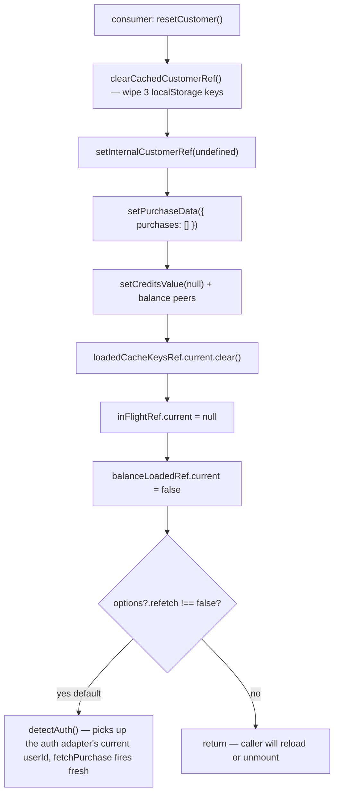

# Expose a public customer-reset API on `@solvapay/react`

## Why

While fixing the chat-checkout-demo's "Reset identity" button (chip in the chat header → popover → reset), we discovered the demo's `resetAnonymousCustomerRef()` only cleared its own anonymous-ref localStorage key. The SDK *also* persists a resolved customer ref in three internal keys:

- `solvapay_customerRef`
- `solvapay_customerRef_expiry`
- `solvapay_customerRef_userId`

set in [`packages/react/src/utils/headers.ts`](solvapay-sdk/packages/react/src/utils/headers.ts) and consumed by `buildRequestHeaders` to attach `x-solvapay-customer-ref` on every transport call.

The SDK's userId-mismatch invalidation in [`SolvaPayProvider.tsx:254-259`](solvapay-sdk/packages/react/src/SolvaPayProvider.tsx) is supposed to clear that cache when the auth adapter returns a different `userId`, **but** it only fires *after* the auth adapter resolves async post-mount. The first `transport.checkPurchase()` after a page reload races that effect, and on cache hit it ships the stale `x-solvapay-customer-ref` header — the backend honours it and returns the *same* customer back, so the chip re-renders with the prior `cus_*` even though the demo minted a fresh `anon_*`.

The chat-checkout-demo's current fix is to wipe `solvapay_customerRef*` directly from the demo:

```ts
// examples/chat-checkout-demo/src/lib/anonymousCustomer.ts
export function resetAnonymousCustomerRef(): void {
  if (typeof window === 'undefined') return
  window.localStorage.removeItem(STORAGE_KEY)
  window.localStorage.removeItem('solvapay_customerRef')
  window.localStorage.removeItem('solvapay_customerRef_expiry')
  window.localStorage.removeItem('solvapay_customerRef_userId')
}
```

That works but is the wrong layering — every SDK consumer that wants to switch buyers / sign out / clear identity now has to know the SDK's internal cache keys by name and stay in sync if we ever rename them. We should expose this as a first-class capability.

## Scope

- **Public**: a `resetCustomer()` method on the `SolvaPayContextValue` returned by `useSolvaPay()`. Calling it wipes the cached ref, resets provider state to "no customer", and optionally re-runs auth detection so a fresh customer materialises in-place (no page reload required).
- **Public, secondary**: re-export `clearCachedCustomerRef` from `@solvapay/react` as a standalone util for non-React callers (rare — most consumers will be inside a provider).
- **Out of scope**: any backend-side customer deletion; this is a *client-side identity reset* only. The backend customer record persists and may be re-resolved if the same `externalRef` reappears.

## Architecture

The provider already centralises the relevant state. We just need a callback that drains it:



The default `refetch: true` lets callers swap users without a page reload (e.g. multi-tenant dashboards). Setting `refetch: false` is the demo's flow: clear, then `window.location.reload()`, where re-running detectAuth would just be wasted work.

## Public API shape

In [`packages/react/src/types/index.ts`](solvapay-sdk/packages/react/src/types/index.ts), extend `SolvaPayContextValue`:

```ts
export interface SolvaPayContextValue {
  // ...existing fields...
  customerRef?: string
  updateCustomerRef?: (newCustomerRef: string) => void
  /**
   * Clear the cached customer identity and reset provider state to
   * "no customer". By default re-runs the auth adapter so a new
   * customer is resolved in-place; pass `{ refetch: false }` if you
   * plan to reload the page (or unmount the provider) right after.
   *
   * Use this instead of touching `solvapay_customerRef*` localStorage
   * keys directly — those are an internal cache and may change shape.
   */
  resetCustomer: (options?: { refetch?: boolean }) => Promise<void>
  // ...
}
```

The `Promise<void>` lets callers `await` the post-reset refetch so they can show a spinner until a new customer is bound (or settle to "anonymous" if no auth adapter).

Also add a re-export at [`packages/react/src/index.tsx`](solvapay-sdk/packages/react/src/index.tsx) for non-React callers (e.g. an axios interceptor outside the React tree wanting to drop the cached header):

```ts
export { clearCachedCustomerRef } from './utils/headers'
```

## Implementation sketch (provider)

In [`packages/react/src/SolvaPayProvider.tsx`](solvapay-sdk/packages/react/src/SolvaPayProvider.tsx), next to `updateCustomerRef`:

```ts
const resetCustomer = useCallback(
  async (options?: { refetch?: boolean }) => {
    clearCachedCustomerRef()

    setInternalCustomerRef(undefined)
    setUserId(null)
    setIsAuthenticated(false)
    setPurchaseData({ purchases: [] })
    setPurchaseError(null)
    setLoading(false)
    setIsRefetching(false)

    setCreditsValue(null)
    setDisplayCurrencyValue(null)
    setCreditsPerMinorUnitValue(null)
    setDisplayExchangeRateValue(null)
    setBalanceLoading(false)
    balanceLoadedRef.current = false

    loadedCacheKeysRef.current.clear()
    inFlightRef.current = null
    balanceInFlightRef.current = false

    if (options?.refetch === false) return

    // Re-run auth detection so the next adapter.getUserId() drives a
    // fresh checkPurchase. The existing detectAuth effect is keyed on
    // userId, which we just nulled — it'll re-fire on the next render.
    // Nothing to await here unless we hoist detectAuth out of the effect.
  },
  [],
)
```

Open questions to resolve in implementation:

1. Whether to hoist `detectAuth` out of the `useEffect` so `resetCustomer` can `await` it directly (cleaner) vs. relying on the effect re-firing (already does, since we mutate `userId`).
2. Whether MCP transport needs special handling — it already short-circuits the auth-detect effect ([`SolvaPayProvider.tsx:233-240`](solvapay-sdk/packages/react/src/SolvaPayProvider.tsx)) because identity is bootstrap-driven. For MCP, `resetCustomer` should probably no-op the cache wipe and just call `refreshBootstrap()` (or even reject — MCP identity is owned by the OAuth bridge).

## Tests

Extend [`packages/react/src/__tests__/SolvaPayProvider.hydration.test.tsx`](solvapay-sdk/packages/react/src/__tests__/SolvaPayProvider.hydration.test.tsx):

- `resetCustomer()` clears `solvapay_customerRef`, `_expiry`, `_userId` from localStorage
- `resetCustomer()` resets `purchase.customerRef`, `customerRef`, `balance.credits` to undefined/null
- `resetCustomer()` (default) triggers a fresh `transport.checkPurchase` call once the auth adapter re-resolves, and the new `customerRef` from the response replaces the old one
- `resetCustomer({ refetch: false })` does NOT call the transport
- In-flight `fetchPurchase` settled before reset is ignored (its `inFlightRef.current === cacheKey` guard reads stale, so the cleared state isn't overwritten)
- MCP transport: `resetCustomer` either no-ops the cache wipe or resolves via `refreshBootstrap` — whichever we land on in the open-question above

## Demo migration

Once the SDK ships:

In [`examples/chat-checkout-demo/src/lib/anonymousCustomer.ts`](solvapay-sdk/examples/chat-checkout-demo/src/lib/anonymousCustomer.ts), drop the SDK-key removals:

```ts
export function resetAnonymousCustomerRef(): void {
  if (typeof window === 'undefined') return
  window.localStorage.removeItem(STORAGE_KEY)
}
```

In [`examples/chat-checkout-demo/components/CustomerChip.tsx`](solvapay-sdk/examples/chat-checkout-demo/components/CustomerChip.tsx), call `resetCustomer({ refetch: false })` before the reload — or drop the reload entirely and just `await resetCustomer()` for an in-place identity swap, which is a nicer demo of what the SDK actually offers:

```ts
const { resetCustomer } = useSolvaPay()

const handleReset = async () => {
  resetAnonymousCustomerRef() // mints a new anon_* on next getAnonymousCustomerRef call
  await resetCustomer()       // wipes SDK cache + refetches with the new identity
  setOpen(false)
}
```

The page-reload UX still works for consumers who prefer it; pass `{ refetch: false }` to avoid a wasted round-trip before navigation.

## Out of scope (flagged for later)

- A *backend-side* "delete this customer" endpoint — different concern, requires GDPR/audit handling
- An auth-adapter `signOut()` lifecycle hook — we currently rely on the auth adapter's `getToken() → null` to trigger the existing clear path. Worth documenting the relationship but no API change here
- Any change to `setCachedCustomerRef`'s 24h TTL — adequate today

## Validation

- `pnpm --filter @solvapay/react test:unit` — provider hydration + topup test files
- `pnpm --filter @solvapay/react build` — confirm the new export resolves cleanly through the package's exports map
- Smoke the chat-checkout-demo locally (`pnpm --filter chat-checkout-demo dev`): chip → reset → assert the customer ref in the chip changes without a full page reload (default path), and assert the page-reload variant (refetch: false) still resets identity in one round-trip post-load

## Execution order

1. Land the SDK changes (provider + types + tests + changeset)
2. Cut a `@solvapay/react` minor release
3. Bump the example's `@solvapay/react` dep and migrate the demo (single follow-up PR)
