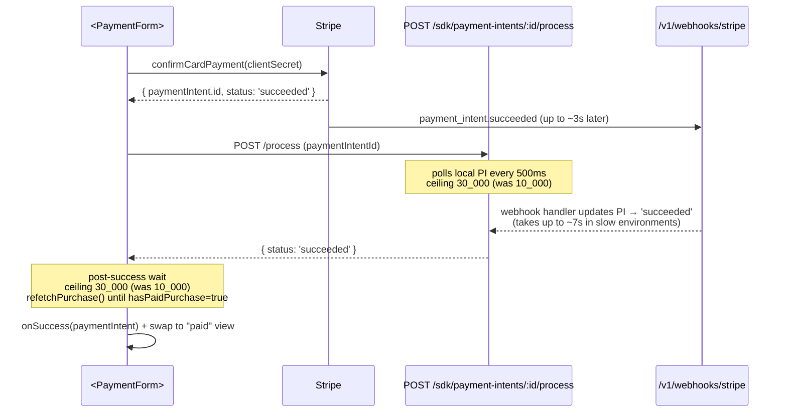

## Problem

The original "Payment processing timed out — webhooks may not be configured" toast the user hit during the MCP checkout smoke covered two distinct failure modes under one ceiling:

1. **Backend `/process` poll timeout (10s).** `POST /v1/sdk/payment-intents/:id/process` polls our local copy of the payment intent every 500ms up to 10s waiting for the webhook handler to flip its status to `succeeded`. If Stripe's webhook delivery is delayed or our handler is slow, the endpoint returns `status: 'timeout'` and the SDK surfaces `paymentProcessingTimeout`.
2. **Frontend post-success confirmation lag (10s).** After `/process` returns success, `<PaymentForm>` waits up to 10s for the provider's `hasPaidPurchase` derivation to flip true so gated consumers (e.g. the MCP checkout view) can swap surfaces. If the purchase record materialises later than the PI status flip, the ceiling trips and the SDK surfaces `paymentConfirmationDelayed` (added in the previous pass).

Both ceilings are 10s. Real-world webhook handling on the user's `tommy-local.ngrok.app` stack already takes **6.8s** end-to-end:

```
Slow request: POST /v1/webhooks/stripe took 6.815s
```

That's 68% of the current window, leaving no room for:

- Stripe's normal webhook-retry jitter (up to several seconds between attempts during a backoff)
- ngrok / tunnel latency (typical 200–800ms per hop)
- Slow fee-transfer retries (`Failed to initiate fee transfer` already costs ~1s in the log before `finalizeSuccessfulPayment` returns)
- `transaction:update` socket emits (~1s observed when the user room has no connected clients)

The `Purchase pur_DYI7PNQM created` line in the user's log lands **6 seconds after `/process` returns** — already inside the new 30s window, comfortably outside the old 10s one.

## Decisions

- **Triple the budget, keep the step.** 10s → 30s on both ceilings. Polling intervals stay at 500ms (backend) / 500–1500ms capped (frontend); the longer window just gives more attempts.
- **No new config surface.** We could expose `PaymentForm`'s ceiling as a prop, or add `SolvaPayConfig.timeouts`, but the observed cases all cluster around 6–10s on the one environment we've measured. Hard-code 30s, ship, and revisit if a second environment reports a different baseline.
- **Rewrite the backend `'timeout'` copy.** The "webhooks may not be configured" string was accurate when the window was 10s (a 10s miss almost always meant misconfigured endpoints). At 30s, handler slowness / retry jitter is the dominant cause; the copy should acknowledge that and tell the caller to refresh rather than misdiagnose webhook wiring. Keep the frontend `paymentConfirmationDelayed` wording unchanged — it's already neutral.
- **Leave `reconcilePayment`'s 5×retry loop alone for this pass.** With the backend poll now at 30s and the outer `<PaymentForm>` loop also at 30s, the inner reconcile retry (~15s of backoffed refetches) is somewhat redundant but harmless — collapsing it is a separate cleanup we can file when we revisit the confirmation-timeout-config discussion.

## Flow (after the change)



## Files touched

### 1. `solvapay-backend/src/payments/flows/payment-intent-poll-status.flow.ts`

Change the default `maxWaitTimeMs` on `pollForPaymentIntentTerminalStatusFlow`:

```ts
export async function pollForPaymentIntentTerminalStatusFlow(
  deps: PollPaymentIntentStatusDeps,
  processorPaymentId: string,
  providerId: string,
  maxWaitTimeMs = 30_000, // was 10_000 — see extend-payment-confirmation-timeouts plan
  pollIntervalMs = 500,
): Promise<'succeeded' | 'failed' | 'cancelled' | null> {
```

Update the trailing warn log so the reported budget reflects the new default:

```
Payment intent ${processorPaymentId} did not reach terminal status after ${maxWaitTimeMs}ms of polling
```

(already interpolated — nothing to change structurally, just verify the test fixture string still matches.)

### 2. `solvapay-backend/src/payments/flows/payment-intent-poll-status.flow.spec.ts`

Existing tests pass `10_000` explicitly for the success/retry cases. Keep those — they pin the contract for callers that still override. Add a new test that invokes with no override and asserts the logger emits `after 30000ms of polling` when it times out:

```ts
it('defaults to a 30s budget when no override is supplied', async () => {
  const findPaymentIntentByStripeIdForProvider = jest
    .fn()
    .mockResolvedValue({ status: 'processing' })
  const logger = { log: jest.fn(), warn: jest.fn() }

  const p = pollForPaymentIntentTerminalStatusFlow(
    { logger, findPaymentIntentByStripeIdForProvider },
    'pi_slow',
    'prov',
    // no maxWaitTimeMs / pollIntervalMs — exercise defaults
  )

  await jest.advanceTimersByTimeAsync(30_000)
  expect(await p).toBeNull()
  expect(logger.warn).toHaveBeenCalledWith(
    expect.stringContaining('did not reach terminal status after 30000ms'),
  )
})
```

### 3. `solvapay-backend/src/payments/services/payment-intent.service.ts` (line ~378)

```ts
return {
  status: 'timeout',
  message:
    'Timed out waiting for the payment to settle. The webhook may still arrive — refresh in a moment, or retry if the charge never shows up.',
}
```

### 4. SDK HTTP client timeout check

Verify `packages/server/src/client.ts` and `packages/react/src/transport/http.ts` do not impose a `<30s` `AbortSignal` / fetch timeout on the `processPayment` call. If an implicit default exists, bump to ≥ `35_000` (backend poll + a 5s margin for DB + response serialisation + tunnel hop).

### 5. `solvapay-sdk/packages/react/src/primitives/PaymentForm.tsx` (line ~407)

```tsx
// Held long enough to cover the backend /process ceiling (30s) plus
// a few seconds of Mongo + socket emit latency on the purchase-create
// path. See extend-payment-confirmation-timeouts plan.
const CONFIRMATION_TIMEOUT_MS = 30_000
```

Keep the capped backoff (`Math.min(500 * attempt, 1500)`). At a 1.5s steady-state interval, 30s yields ~20 refetches, which is more than enough for the MCP `refreshInitial` path to observe the new purchase.

### 6. `solvapay-sdk/packages/react/src/primitives/PaymentForm.test.tsx`

Replace the 12×1s advance loop in the ceiling test with 32×1s so we clear the new 30s budget. Bump the refetch-call floor assertion from `≥ 3` to `≥ 10` (conservative — 30s / ~1.5s ≈ 20 but strict-mode + microtask drift can skip a few).

### 7. `solvapay-sdk/packages/react/src/utils/processPaymentResult.ts`

No code change; add a comment in front of the 5-iteration retry loop explaining that the values aren't being bumped in this pass and linking the plan name. This prevents a future refactor from "helpfully" aligning all the numbers without thinking through whether the redundancy is actually a problem.

### 8. Docs / changelog

- `packages/react/CHANGELOG.md`: "Raised the post-confirmation `hasPaidPurchase` ceiling in `<PaymentForm>` from 10s → 30s to accommodate realistic webhook-handler latency (6–10s observed in slow-tunnel / fee-transfer environments). `paymentConfirmationDelayed` now reliably signals a real webhook or bootstrap issue rather than normal jitter."
- `docs/sdks/typescript/guides/mcp-app.mdx`: if the MCP guide already documents the 10s figure, update; otherwise skip.

## Gates

- `pnpm --filter @solvapay/react test -- --run` (expect all 545+ tests green, including the retimed ceiling test)
- Backend: `pnpm test -- payment-intent-poll-status` and the specs that import `pollForPaymentIntentTerminalStatusFlow`
- Backend `tsc --noEmit` and `pnpm build`
- Manual smoke against `examples/mcp-checkout-app`:
  1. Clear cookies, run through `Subscribe` with the Stripe test `4242…` card (no 3DS)
  2. Confirm the `Payment succeeded but confirmation is taking longer than usual` toast does **not** appear
  3. Repeat with the 3DS test card `4000 0025 0000 3155` — confirm the same
  4. Verify `pur_*` shows up in the Account tab after the swap

## Non-goals / follow-ups

- **Make the ceiling configurable.** A per-integrator `<PaymentForm confirmationTimeoutMs={…}>` prop + `SolvaPayConfig.timeouts.paymentConfirmationMs` root is tempting, but scope that into a separate plan once we have a second datapoint beyond the `tommy-local.ngrok.app` stack.
- **Collapse the `reconcilePayment` retry loop.** The 5×1/2/3/4/5s refetch loop in `processPaymentResult.ts` is now redundant with the 30s outer loop in `<PaymentForm>`. Delete or trim in a follow-up refactor.
- **Investigate the 6.8s webhook handler.** The log shows `Failed to initiate fee transfer` adding ~1s before `finalizeSuccessfulPayment`, plus ~1s per socket emit to a disconnected room. Those are real backend wins worth filing against `solvapay-backend`, but they're independent of the ceiling bump.
