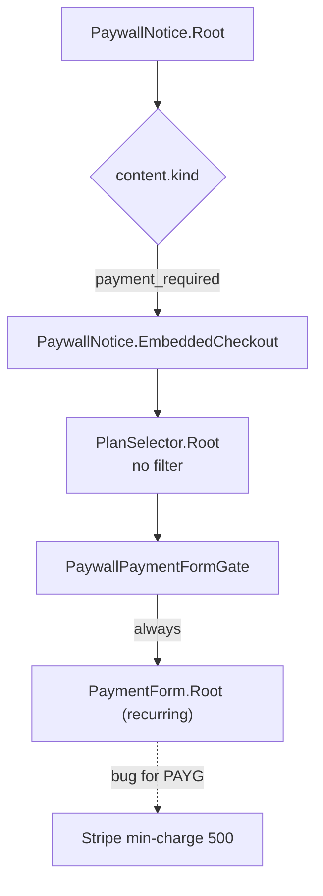

## Problem

Screenshot shows three issues on the paywall at [packages/react/src/primitives/PaywallNotice.tsx](solvapay-sdk/packages/react/src/primitives/PaywallNotice.tsx):

1. Selecting the "Pay as you go" card mounts `PaymentForm` (Stripe `PaymentElement` driven by `POST /v1/sdk/payment-intents`) which fails with Stripe's minimum-charge error because no amount has been chosen.
2. A disabled "Free" card is shown even though it cannot be selected and adds noise.
3. "Purchase required. Remaining: 0" is terse and doesn't tell the user what to do.

## Current flow (relevant bits)



The correct PAYG sequence is already implemented inside [McpCheckoutView.tsx](solvapay-sdk/packages/react/src/mcp/views/McpCheckoutView.tsx) `CheckoutStateMachine` (`plan → amount → payment`, lines 539–615, 720–776, 809–871) and uses `AmountPicker` + `TopupForm` — we'll mirror that pattern inside the paywall.

## Changes

### 1) Branch PAYG vs recurring inside the paywall primitive

File: [packages/react/src/primitives/PaywallNotice.tsx](solvapay-sdk/packages/react/src/primitives/PaywallNotice.tsx) (lines ~278–343)

- Replace `PaywallPaymentFormGate` with a small state machine that switches on the selected plan's type:
  - If selected plan is `usage-based` (or `hybrid`) → render `AmountPicker.Root` (preset chips + custom input + confirm). On confirm, transition to a `TopupForm.Root` step (mirrors `PaygPaymentStep` in `McpCheckoutView`) with a `← Change amount` back link.
  - Otherwise → keep existing `PaymentForm.Root` flow.
- Reuse existing helpers: `isPayg` logic from [McpCheckoutView.tsx:1053](solvapay-sdk/packages/react/src/mcp/views/McpCheckoutView.tsx) (extract to a shared util under `packages/react/src/primitives/utils/` so both surfaces share it), `AmountPicker` from [primitives/AmountPicker.tsx](solvapay-sdk/packages/react/src/primitives/AmountPicker.tsx), `TopupForm` from [primitives/TopupForm.tsx](solvapay-sdk/packages/react/src/primitives/TopupForm.tsx).
- Access the selected plan via `usePlanSelector().selectedPlan` (already exposed, line 534) so we can read `type`/`currency`/`creditsPerUnit` without re-fetching.
- Success handler stays the same — call `ctx.refetch()` so the paywall resolves and `onResolved` fires.

### 2) Filter out the Free plan in the paywall's `PlanSelector`

File: [packages/react/src/primitives/PaywallNotice.tsx](solvapay-sdk/packages/react/src/primitives/PaywallNotice.tsx) (both `Plans` at line 217 and `EmbeddedCheckout` at line 278)

- Pass a `filter` prop to `PlanSelector.Root`:

```tsx
<PlanSelector.Root
  productRef={ctx.content.product}
  filter={(plan) => plan.requiresPayment !== false}
>
```

- Matches the pattern already used in [McpCheckoutView.tsx:257-261](solvapay-sdk/packages/react/src/mcp/views/McpCheckoutView.tsx). (Free doesn't need the "current plan" exception here because the paywall only appears when the user is *out* of free quota; showing Free as context adds no value.)

### 3) Improve "Remaining: 0" copy

Two coordinated changes:

**Server default** — [packages/server/src/paywall.ts:337-342](solvapay-sdk/packages/server/src/paywall.ts):

- Keep the field but rewrite to something actionable and non-numeric-led, e.g.:

```ts
message: remaining <= 0
  ? `You've used all your included calls for this tool. Pick a plan below to continue.`
  : `You have ${remaining} call${remaining === 1 ? '' : 's'} left. Pick a plan to keep going.`
```

- Optionally enrich `PaywallStructuredContent` (kind: `payment_required`) in [packages/server/src/types/paywall.ts](solvapay-sdk/packages/server/src/types/paywall.ts) to include `balance?: LimitActivationBalance` and `productDetails?: LimitActivationProduct` (both are already available on `lastLimitsCheck` in `paywall.ts`). This lets the client render richer copy without parsing the message string.

**Client override** — [packages/react/src/primitives/PaywallNotice.tsx](solvapay-sdk/packages/react/src/primitives/PaywallNotice.tsx) `Message` component (line 145) + [packages/react/src/i18n/en.ts](solvapay-sdk/packages/react/src/i18n/en.ts) (lines 201–211):

- Add new i18n keys under `copy.paywall`:
  - `paymentRequiredMessage: "You've used all your included calls{forProduct}. Choose a plan to keep going."`
  - `paymentRequiredMessageRemaining: "Only {remaining} left{forProduct}. Choose a plan to keep going."`
- In `Message`, prefer client-side copy when `content.kind === 'payment_required'` and `content.balance` is present; fall back to `content.message` (server string) when balance data isn't attached (preserves back-compat with older servers).
- Interpolate `{forProduct}` using `content.productDetails?.name` if available (e.g. ` for Weather Oracle`), else empty string.

### 4) Tests

- Update [packages/react/src/mcp/__tests__/McpApp.paywallEntry.test.tsx](solvapay-sdk/packages/react/src/mcp/__tests__/McpApp.paywallEntry.test.tsx) to cover:
  - Free plan is not rendered in the paywall's plan grid.
  - Selecting a PAYG plan renders `AmountPicker` (not `PaymentForm`); amount confirm swaps in `TopupForm` with the correct `amount`/`currency` props.
  - Selecting a recurring plan still renders `PaymentForm` (regression guard).
  - `Message` renders the new client-side copy when `payment_required` content carries `balance`, and falls back to `content.message` when it doesn't.
- Add a server-side test alongside existing paywall tests to assert the new default `message` string shape.

### 5) Storybook / demo sanity check

If a story exists for `PaywallNotice` (check [packages/react/src/primitives/__stories__/](solvapay-sdk/packages/react/src/primitives/__stories__/) or `packages/react/storybook/`), add a `PaymentRequired.PayAsYouGo` story to demonstrate the new branch visually.

## Out of scope

- No changes to `McpCheckoutView` flow or `CheckoutStateMachine` — it's already correct.
- No changes to the server limits-check logic; only the `message` string and structured-content shape.
- No styling changes beyond what's already provided by `AmountPicker` / `TopupForm` class hooks.