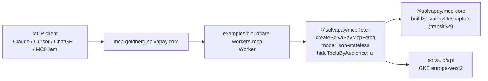

# Goldberg Cloudflare Workers example

## Context

Assumes [`upstream_sdk_fixes_goldberg_workarounds_02b6ef80.plan.md`](solvapay-sdk/.cursor/plans/upstream_sdk_fixes_goldberg_workarounds_02b6ef80.plan.md) has shipped stable, delivering three additive SDK capabilities the Workers port relies on:

- **`createSolvaPayMcpFetch(...)`** — new descriptor-accepting factory on `@solvapay/mcp-fetch` (Fix 4). Takes `BuildSolvaPayDescriptorsOptions` + handler options, returns a `(req: Request) => Promise<Response>`. Internally builds the `McpServer`, so edge consumers import **only** `@solvapay/mcp-fetch`. Realizes the parallel-adapters design stated in [`packages/mcp-core/src/index.ts`](solvapay-sdk/packages/mcp-core/src/index.ts) lines 12-14.
- **`mode: 'json-stateless'`** — transport preset on both `createSolvaPayMcpFetch` and `createSolvaPayMcpFetchHandler` (Fix 1). Builds the transport with `{ sessionIdGenerator: undefined, enableJsonResponse: true }` + per-request connect/close mutex. Correct shape for Workers because isolates don't pin across requests.
- **`hideToolsByAudience: ['ui']`** — filter on `createSolvaPayMcpFetch` (via Fix 2's wrapping logic). Drops UI-only virtual tools (`create_checkout_session`, `process_payment`, etc.) from `tools/list` so text-only LLM hosts (Claude Desktop, MCPJam, ChatGPT connector) don't try to reason about transport tools meant for the embedded iframe.

With those three capabilities, the Workers entrypoint is a **single adapter call**. No `createSolvaPayMcpServer` step, no mutex, no path rewrite, no `_requestHandlers` reach-in, no mcp-lite, no descriptor adapter.

**Supersedes** (mark `superseded_by` at the top of each, leave in place as record):

- [`goldberg_workers_turnkey_port_86ec1ed4.plan.md`](/.cursor/plans/goldberg_workers_turnkey_port_86ec1ed4.plan.md) (combined prerequisite + port)
- [`goldberg_cf_workers_migration_b1015e05.plan.md`](/.cursor/plans/goldberg_cf_workers_migration_b1015e05.plan.md) (mcp-lite approach)
- [`goldberg_mcp_perf_sprint_5965e190.plan.md`](/.cursor/plans/goldberg_mcp_perf_sprint_5965e190.plan.md) (Supabase London sprint)
- [`worker_cache_well_known_c7a91e3b.plan.md`](solvapay-sdk/.cursor/plans/worker_cache_well_known_c7a91e3b.plan.md) (.well-known caching in proxy)

## Architecture



## Expected performance

- Today on Supabase Edge: ~400-800ms cold / ~125ms warm
- Workers with the turnkey handler: ~50-120ms cold / ~5-20ms warm
- 5-10x improvement; well below the human-perceptible threshold

## Target entrypoint

The entire [`src/worker.ts`](solvapay-sdk/examples/cloudflare-workers-mcp/src/worker.ts) body — one adapter import, one adapter call:

```typescript
import { createSolvaPay } from '@solvapay/server'
import { createSolvaPayMcpFetch } from '@solvapay/mcp-fetch'
import { demoToolsEnabled, registerDemoTools } from './demo-tools'
import mcpAppHtml from './assets/mcp-app.html'

interface Env {
  SOLVAPAY_SECRET_KEY: string
  SOLVAPAY_PRODUCT_REF: string
  MCP_PUBLIC_BASE_URL: string
  SOLVAPAY_API_BASE_URL?: string
  DEMO_TOOLS?: string
}

export default {
  async fetch(req: Request, env: Env): Promise<Response> {
    const apiBaseUrl = env.SOLVAPAY_API_BASE_URL ?? 'https://solva.io/api'
    return createSolvaPayMcpFetch({
      solvaPay: createSolvaPay({ apiKey: env.SOLVAPAY_SECRET_KEY, apiBaseUrl }),
      productRef: env.SOLVAPAY_PRODUCT_REF,
      resourceUri: 'ui://goldberg/mcp-app.html',
      readHtml: async () => mcpAppHtml,
      publicBaseUrl: env.MCP_PUBLIC_BASE_URL,
      apiBaseUrl,
      hideToolsByAudience: ['ui'],
      additionalTools: demoToolsEnabled(env) ? registerDemoTools : undefined,
      mode: 'json-stateless',
    })(req)
  },
}
```

Note: `@solvapay/mcp` is not imported. Not a dependency. Not a devDependency. The `mcp-fetch` adapter owns the full edge path.

## File layout

```
examples/cloudflare-workers-mcp/
├── package.json              // deps: @solvapay/server, @solvapay/mcp-fetch; dev: wrangler, typescript, @cloudflare/workers-types
├── wrangler.jsonc            // staging custom domain, env bindings, text-import rule, nodejs_compat
├── tsconfig.json             // Workers + strict
├── README.md                 // deploy steps + env var reference + cutover notes
├── .dev.vars.example         // local wrangler dev secret template
└── src/
    ├── worker.ts             // the ~20-line entrypoint above
    ├── demo-tools.ts         // ported from supabase-edge-mcp, Deno.env.get → env binding
    └── assets/
        └── mcp-app.html      // copied verbatim from supabase-edge-mcp
```

### `wrangler.jsonc` essentials

```jsonc
{
  "name": "goldberg-mcp-cf",
  "main": "src/worker.ts",
  "compatibility_date": "2026-04-26",
  "compatibility_flags": ["nodejs_compat"],
  "rules": [{ "type": "Text", "globs": ["**/*.html"] }],
  "routes": [{ "pattern": "mcp-goldberg-cf.solvapay.com", "custom_domain": true }],
  "vars": {
    "SOLVAPAY_PRODUCT_REF": "prod_…",
    "MCP_PUBLIC_BASE_URL": "https://mcp-goldberg-cf.solvapay.com",
    "SOLVAPAY_API_BASE_URL": "https://solva.io/api",
    "DEMO_TOOLS": "1",
  },
}
```

- `rules: [{ type: 'Text' }]` makes `import html from './assets/mcp-app.html'` resolve to the file contents at build time — no Workers Assets binding / `env.ASSETS.fetch(...)` plumbing needed.
- `nodejs_compat` is a safety net for any transitively Node-ish path in `@modelcontextprotocol/sdk`; the handler itself is fetch-first but we want to be defensive.
- `SOLVAPAY_SECRET_KEY` is stored as a secret (`wrangler secret put SOLVAPAY_SECRET_KEY`), not in the `vars` block.

## Demo-tools port

Current [`supabase-edge-mcp/supabase/functions/mcp/demo-tools.ts`](solvapay-sdk/examples/supabase-edge-mcp/supabase/functions/mcp/demo-tools.ts) shape:

```ts
export function demoToolsEnabled(): boolean {
  return Deno.env.get('DEMO_TOOLS') === '1'
}
export function registerDemoTools(ctx: AdditionalToolsContext): void {
  /* ... */
}
```

Ported shape (only change is the env reader):

```ts
export function demoToolsEnabled(env: { DEMO_TOOLS?: string }): boolean {
  return env.DEMO_TOOLS === '1'
}
export function registerDemoTools(ctx: AdditionalToolsContext): void {
  /* unchanged */
}
```

Port step also needs to check whether any tool _handler_ inside `registerDemoTools` reaches for `Deno.env.get` (predict_price_chart, predict_direction, oracle sim). If yes, thread env through the registration closure; if no (expected — these tools are client-side math/fake data), leave them alone.

## Staging + cutover

Use two subdomains so cutover is a DNS flip, not a deploy:

- `mcp-goldberg.solvapay.com` — current prod (points at `examples/supabase-edge-mcp-proxy`)
- `mcp-goldberg-cf.solvapay.com` — new Workers staging URL

Sequence:

1. Deploy new Worker to `-cf` subdomain, run full smoke test + measure.
2. Remove `mcp-goldberg.solvapay.com` custom-domain route from old proxy's `wrangler.jsonc` → `wrangler deploy` (releases the binding).
3. Add `mcp-goldberg.solvapay.com` to new Worker's `wrangler.jsonc` + flip `MCP_PUBLIC_BASE_URL` back to canonical → `wrangler deploy`.
4. Verify all clients reconnect within 2 min.

## Cleanup + retire

- **Delete** `examples/supabase-edge-mcp-proxy/` entirely once the DNS flip is live — its caching job is obviated by colocated CF Workers delivery.
- **Keep** `examples/supabase-edge-mcp/` as the canonical "how to host SolvaPay MCP on Supabase Edge" reference. Rewrite its README to drop Goldberg branding; simplify its `index.ts` to use `createSolvaPayMcpFetch` (single adapter import, descriptor options in, fetch handler out — the same shape as the Workers example, different host). This also lets us drop `@solvapay/mcp` from that example's `deno.json` imports.
- **Retire** the `ohzivhxmsdnjahtaicus` Supabase project from the dashboard 7 days post-cutover, after green metrics. Remove its secrets from the SDK's 1Password vault.

## Out of scope

- Shared `@solvapay/mcp-workers` adapter package. Defer until a second Workers integrator appears.
- Per-region pinning or KV caching of `.well-known/*`. The Workers runtime is already globally distributed; the edge Cache API is available if wanted later but not needed for v1.

### Deferred: `@solvapay/mcp-fetch-lite` on `mcp-lite`

Explicitly deferred, not rejected. Sized the design so it's a drop-in if future measurements show mcp-fetch's cold start (~50-120ms estimated) isn't fast enough.

Design sketch for when we come back to it:

- New package `@solvapay/mcp-fetch-lite` parallel to `@solvapay/mcp-fetch` (not stacked).
- Peer deps: `mcp-lite`, `zod`, `@solvapay/mcp-core`. Zero `@modelcontextprotocol/*`.
- Exports `createSolvaPayMcpFetchLite(options)` with the same descriptor-accepting shape as `createSolvaPayMcpFetch`.
- Prerequisite refactor: move `createOAuthFetchRouter` + CORS helpers from `@solvapay/mcp-fetch` into `@solvapay/mcp-core` (keep back-compat re-exports). Otherwise the OAuth plumbing would be duplicated.
- Prerequisite spike (2-4 hours): verify `mcp-lite`'s `server.resource()` + `_meta` renders MCP Apps iframes correctly across Claude Desktop + MCP Inspector + Claude Web. Gate the package behind that spike passing.
- Expected bundle: ~500KB-1MB vs mcp-fetch's ~5-10MB. Expected cold start: ~10-30ms on Workers.

Trigger for revisit: if the Workers deploy's cold-path p95 on `discovery + initialize + tools/list` sits above ~150ms after cutover, or if first-connect UX on a real Claude client feels laggy. Measurement criteria go in the cutover PR's description.

Risks we'd accept at that point:

- mcp-lite maintenance (few-hundred-star library, Fiberplane-backed, ~6 months old as of 2026-04-26 — mitigated by isolation to one optional package).
- MCP spec drift (if mcp-lite falls behind elicitation / sampling / progress notifications, `mcp-fetch-lite` falls behind — we'd fall back to `mcp-fetch` or upstream PRs).
- ~80 lines of descriptor-registration duplication between `@solvapay/mcp` and `@solvapay/mcp-fetch-lite` (could be factored out to a `walkSolvaPayDescriptors` helper in `mcp-core`).
