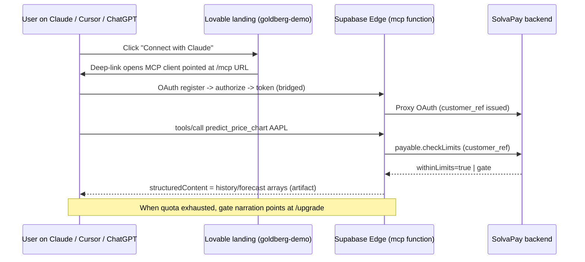

## Why this is low-risk

The `@example/supabase-edge-mcp` example in the SDK is effectively the Goldberg demo already — it ships `predict_price_chart` + `predict_direction`, a full OAuth bridge, and uses `createSolvaPayMcpFetchHandler` over `Deno.serve`. A `pnpm validate` step runs `deno check` with a real Deno binary as a required CI gate on every PR, so the "does this SDK work on Supabase Edge?" question is answered `yes` before we touch anything.

All required npm packages are published: `@solvapay/mcp-fetch@0.1.0`, `@solvapay/mcp@0.1.0`, `@solvapay/mcp-core@0.1.0`, `@solvapay/server@1.0.7`. The production `deno.json` at [examples/supabase-edge-mcp/supabase/functions/mcp/deno.json](solvapay-sdk/examples/supabase-edge-mcp/supabase/functions/mcp/deno.json) resolves them directly from `npm:` — no Node bundler, no vendor step.

## Architecture



## Step 1 - SolvaPay merchant product (you do this separately)

In your SolvaPay admin, set up the Goldberg product with three plans so the whole paywall story is reachable (mirrors [SMOKE_TEST.md](solvapay-sdk/examples/mcp-checkout-app/SMOKE_TEST.md)):
- **Free** - `type: free` / `requiresPayment: false` - quota ~50 calls/month. Makes the paywall exhaustible without admin-zeroing balances on stage.
- **Pay as you go** - `type: usage-based` - $0.01 per call. Featured/recommended on checkout.
- **Pro** - `type: recurring` - $18/mo with 2,000 included credits.

Note the `prod_...` ref and grab a live `sk_live_...` secret scoped to it.

## Step 2 - Trim demo-tools.ts to predictor-only

In [examples/supabase-edge-mcp/supabase/functions/mcp/demo-tools.ts](solvapay-sdk/examples/supabase-edge-mcp/supabase/functions/mcp/demo-tools.ts), keep only:
- `registerPayable('predict_price_chart', ...)` (line ~167)
- `registerPayable('predict_direction', ...)` (line ~211)
- Their matching `registerPrompt(...)` calls in `registerDemoPrompts` (lines ~502-551)
- The entire oracle simulation block (`xmur3`, `mulberry32`, `randn`, `erf`, `simulatePricePath`, `deriveVerdict`, all `ORACLE_*` constants).

Remove:
- `registerPayable('search_knowledge', ...)`, `get_market_quote`, `query_sales_trends`, their prompts, and `buildDeterministicRows`.

Leave `demoToolsEnabled()` and `readEnv()` untouched - the `DEMO_TOOLS=false` escape hatch still works for anyone copying the example.

Update the file's top comment and [examples/supabase-edge-mcp/README.md](solvapay-sdk/examples/supabase-edge-mcp/README.md) "Trying the demo tools" section to list only the two predictor tools.

Run `pnpm --filter @example/supabase-edge-mcp validate` locally - this is the same CI gate (`deno check` on local workspace), so if trimming breaks anything it fails here before we deploy.

## Step 3 - Create and link the Supabase project

```bash
# You do this in the Supabase dashboard (free tier is fine for demo):
#   Create project "goldberg-mcp"
#   Region: whichever matches your audience (us-east-1 is a safe default)
#   Share me the project-ref (format: aaaabbbbccccdddd)

cd solvapay-sdk/examples/supabase-edge-mcp
supabase login      # browser OAuth, first time only
supabase link --project-ref <your-goldberg-ref>
```

## Step 4 - Configure secrets on the Supabase project

```bash
supabase secrets set \
  SOLVAPAY_SECRET_KEY=sk_live_<goldberg> \
  SOLVAPAY_PRODUCT_REF=prod_<goldberg> \
  MCP_PUBLIC_BASE_URL=https://<project-ref>.supabase.co/functions/v1/mcp \
  DEMO_TOOLS=true
```

`MCP_PUBLIC_BASE_URL` must **exactly** match the URL clients hit - the OAuth bridge stamps it as `issuer` in the discovery document. If we switch to a custom domain later, rotate this secret and the URL in the Lovable landing page in the same deploy.

## Step 5 - Local smoke before deploy

```bash
pnpm --filter @example/supabase-edge-mcp validate   # deno check + build
pnpm --filter @example/supabase-edge-mcp serve:local &
sleep 3
curl -s http://localhost:54321/functions/v1/mcp/.well-known/oauth-authorization-server | jq .issuer
# -> "http://localhost:54321/functions/v1/mcp"  (note: local issuer, not public one)
```

Then in another terminal, point the MCP Inspector (`npx @modelcontextprotocol/inspector`) or `basic-host` at the local URL, authenticate, and call `predict_price_chart { symbol: "AAPL", days: 10 }` - verify the host renders a line chart artifact.

## Step 6 - Deploy

```bash
pnpm --filter @example/supabase-edge-mcp build
pnpm --filter @example/supabase-edge-mcp deploy
# -> supabase functions deploy mcp
# Live at https://<project-ref>.supabase.co/functions/v1/mcp
```

Verify:

```bash
curl -s https://<project-ref>.supabase.co/functions/v1/mcp/.well-known/oauth-authorization-server | jq .
```

## Step 7 - Wire the Lovable landing page

Two paths - pick based on DNS decision (you said decide later):

- **Fast path (recommended for the event)**: update the URL in the Lovable landing from `https://goldberg.demo.solvapay.com/mcp` to `https://<project-ref>.supabase.co/functions/v1/mcp`. Ship it. Done.
- **Pretty-domain path (do after)**: one of
  - Supabase paid custom-domain add-on (~$10/mo, official, zero code)
  - Cloudflare Worker at `goldberg.demo.solvapay.com` that proxies to `<project-ref>.supabase.co/functions/v1/mcp` - preserves path, adds no latency. After enabling, rotate `MCP_PUBLIC_BASE_URL` and update the Lovable URL.

## Step 8 - End-to-end smoke on live

Connect Claude Desktop (or ChatGPT apps) to the live URL via the landing page's "Connect with Claude" button. Walk the five-step path from the smoke test:
1. Complete OAuth - bridge issues `customer_ref` behind the scenes
2. Call `predict_price_chart AAPL` - capable hosts render a line-chart artifact
3. Call it ~50 times until the Free quota exhausts
4. Gate fires - `content[0].text` narrates "call the `upgrade` tool..."
5. Call `upgrade` - widget iframe mounts, plan picker appears, complete PAYG flow with Stripe test card `4242 4242 4242 4242`, retry predict_price_chart silently succeeds.

## Risks and fallbacks for event day

- **Supabase cold start** - first request after idle can be ~1-2s. Not a blocker but worth hitting the endpoint once right before the live demo.
- **OAuth redirect_uri mismatches** - if `MCP_PUBLIC_BASE_URL` drifts from the URL in the landing page, the discovery document's issuer won't match and some clients (Cursor) error out. Single source of truth: whatever's in the Lovable page must match the secret.
- **Stripe live vs test** - you're using `sk_live_`. Real cards will be charged on PAYG/Pro. For the live demo, either (a) use a sandbox key against the SolvaPay staging backend by setting `SOLVAPAY_API_BASE_URL=https://api.staging.solvapay.com` + a sandbox `sk_test_` key, or (b) pre-load the demo customer with enough balance that you never hit the paywall on stage.
- **Custom domain** - don't try to set this up the day of the event. Ship with the raw Supabase URL; swap later.

## Deferred (not for this event)

- Automated smoke test (`pnpm smoke` script driving MCP Inspector) - deferred until after the demo per existing `SMOKE_TEST.md` guidance.
- Custom domain + TLS - see step 7 pretty-domain path.
- Lovable as MCP host (not just landing) - requires `@solvapay/react-supabase` adapter exploration; out of scope for the event.