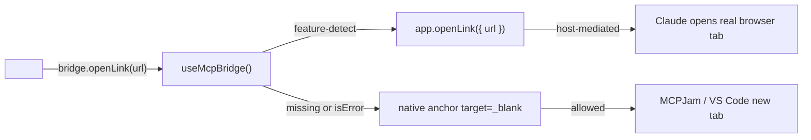

# Hosted-checkout openLink fallback

## Symptom

On Claude.ai, after the Stripe CSP probe correctly routes to the hosted-checkout fallback, clicking **Reopen checkout** (or **Launch customer portal**) does nothing visible. The console logs:

```
Blocked opening 'https://tommy-local.ngrok.app/customer/checkout?id=dd31932…'
in a new window because the request was made in a sandboxed frame
whose 'allow-popups' permission is not set.
```

Claude's MCP-app iframe is mounted with a sandbox that doesn't include `allow-popups`, so the standard `<a target="_blank">` click is refused by the browser. The fallback UI is reachable but operationally dead.

## Root cause

Our hosted-fallback anchors are plain markup:

- [`McpCheckoutView.tsx:225-237`](packages/react/src/mcp/views/McpCheckoutView.tsx) — `HostedLinkButton`
- [`McpCheckoutView.tsx:280-292`](packages/react/src/mcp/views/McpCheckoutView.tsx) — `AwaitingBody` (Reopen checkout)
- Equivalent in `McpTopupView.tsx`'s `HostedTopupFallback`

They all render `<a href={state.href} target="_blank" rel="noopener">`. In a sandboxed iframe without `allow-popups`, the browser blocks `window.open` regardless of `noopener`.

The MCP ext-apps API exposes a host-mediated alternative — [`app.openLink({ url })`](node_modules/.pnpm/@modelcontextprotocol+ext-apps@1.5.0.../dist/src/app.d.ts:1000-1029). The host opens the URL in the user's real browser (Claude does) and returns `{ isError?: boolean }` so callers can detect refusal.

## Fix



### Bridge extension

In [`packages/react/src/mcp/bridge.tsx`](packages/react/src/mcp/bridge.tsx):

- `McpBridgeAppLike.openLink?: (params: { url: string }) => Promise<{ isError?: boolean } | unknown>`
- `McpBridgeValue.openLink: (url: string) => Promise<{ opened: boolean }>`
- `NOOP_BRIDGE.openLink = async () => ({ opened: false })` so views rendered outside `<McpBridgeProvider>` (tests, non-MCP embeddings) fall back to the native anchor.

Implementation — try the method with a shape-feature-detect, swallow throws into `{ opened: false }` to match the existing `sendMessage` / `notifyModelContext` error-safe pattern.

### View wiring

In [`McpCheckoutView.tsx`](packages/react/src/mcp/views/McpCheckoutView.tsx) `HostedLinkButton` and `AwaitingBody`:

```tsx
onClick={async (e) => {
  const { opened } = await bridge.openLink(state.href)
  if (opened) e.preventDefault()
  onLaunch?.(state.href)
}}
```

Semantics:
- Host accepts → `{ opened: true }` → we `preventDefault` (the sandboxed anchor would have been blocked anyway).
- Host refuses or method absent → `{ opened: false }` → native anchor click proceeds.

Apply the same pattern in `McpTopupView.tsx`'s `HostedTopupFallback`.

## Out of scope (explicit)

- The other `<a target="_blank">` anchors in [`McpAppShell.tsx:191,204`](packages/react/src/mcp/McpAppShell.tsx) and [`detail-cards.tsx:228`](packages/react/src/mcp/views/detail-cards.tsx) — those are merchant-support / legal links, not hosted-checkout. Lower priority, follow-up.
- Host-sniffing for "is this iframe sandboxed without allow-popups". Feature-detection on `app.openLink` is cleaner.
- Asking MCP to add `allow-popups` to the sandbox spec — upstream concern, out of our hands.

## Tests

Extend [`packages/react/src/mcp/__tests__/McpBridge.test.tsx`](packages/react/src/mcp/__tests__/McpBridge.test.tsx):

- `openLink` resolves `{ opened: true }` when `app.openLink` resolves with no `isError`.
- Resolves `{ opened: false }` when `app.openLink` is undefined on the app object.
- Resolves `{ opened: false }` when `app.openLink` resolves `{ isError: true }`.
- Swallows throws without propagating.

## Changeset

`@solvapay/react` patch: "Hosted-checkout fallback links in `<McpCheckoutView>` and `<McpTopupView>` now route clicks through the MCP `app.openLink` bridge when available, so Claude (iframe sandboxed without `allow-popups`) can actually open the checkout in a new browser tab. Hosts that don't expose `openLink` continue using the existing `<a target=\"_blank\">` which is unchanged for them."

## Verification

1. `pnpm -F @solvapay/react test`.
2. On Claude.ai, after the Stripe probe routes to hosted fallback: click "Reopen checkout" → a real browser tab opens, no `Blocked opening` console warning.
3. On MCPJam: no regression — clicking the same link still opens a new tab via the native anchor path.
