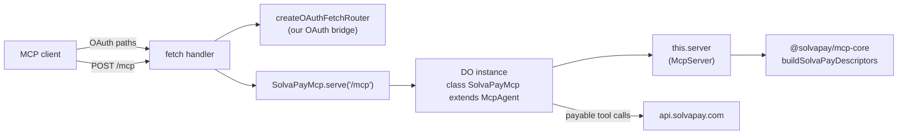

# MCP Agent SDK review — side-by-side evaluation example

## Goal

Give ourselves the hands-on data to decide later. Today the [`examples/cloudflare-workers-mcp/`](solvapay-sdk/examples/cloudflare-workers-mcp/) example uses our own runtime-neutral [`createSolvaPayMcpFetch`](solvapay-sdk/packages/mcp/src/fetch/createSolvaPayMcpFetch.ts) path. Cloudflare ships an alternative — [`McpAgent` from `agents/mcp`](https://developers.cloudflare.com/agents/api-reference/mcp-agent-api/) — built on Durable Objects, with session state, SQL, and hibernation. We have **no hands-on experience** with it on our paywall surface, and no way to compare ergonomics or performance.

This plan:

1. Builds a **second Cloudflare Workers example** at full parity with the existing one, on top of `McpAgent`, so we can run both side by side.
2. Adds **neutral one-line pointers** to the existing example/docs telling integrators the `McpAgent` option exists, with no prescriptive "should migrate" language.
3. Tracks **Vercel** (`@vercel/mcp-adapter`) as a follow-up for the next round, no code here.

No recommendation is made in this plan. No SDK package work is triggered. No skill migration is implied. The evaluation example's README holds an **"Open questions for the review"** checklist we'll fill in after smoke-testing both examples.

## Deliverable layout

```
examples/
├── cloudflare-workers-mcp/           # existing — fetch-first, runtime-neutral
│   └── README.md                     # EDIT: add short "Alternative hosting SDKs" note
└── cloudflare-workers-mcp-agent/     # NEW — stateful, Cloudflare-specific evaluation
    ├── package.json                  # adds `agents`, (optional) @cloudflare/workers-oauth-provider
    ├── tsconfig.json
    ├── wrangler.jsonc                # adds [[durable_objects.bindings]] + [[migrations]]
    ├── vite.config.ts                # same widget build as sibling
    ├── mcp-app.html
    ├── .env.example
    ├── .gitignore
    ├── scripts/deploy.mjs
    ├── README.md                     # labelled "Evaluation example — not recommended path"
    └── src/
        ├── worker.ts                 # class SolvaPayMcp extends McpAgent + OAuth wiring
        ├── demo-tools.ts             # byte-for-byte copy of sibling
        ├── mcp-app.tsx               # byte-for-byte copy of sibling
        └── assets/
            └── mcp-app.html          # vite build output
```

## How the McpAgent entrypoint wires together



Keeping our existing `createOAuthFetchRouter` in front lets us isolate the `McpAgent` value proposition (session pinning, state, SQL, hibernation) from the OAuth choice. The alternative — handing `SolvaPayMcp.serve('/mcp')` to `OAuthProvider` from `@cloudflare/workers-oauth-provider` — we can explore in a second iteration if the first comparison suggests it matters.

## Known implementation wrinkle

[`buildSolvaPayMcpServer`](solvapay-sdk/packages/mcp/src/internal/buildMcpServer.ts) is internal-only today (not exported from `@solvapay/mcp`'s public `.` or `./fetch` entries). To register the full SolvaPay surface onto `this.server` inside `McpAgent.init()`, the evaluation example will either:

- **(a) Vendor ~30 lines of the registration loop** into `src/worker.ts` — keeps the SDK surface untouched and makes the evaluation honest about what a merchant would need to write themselves today.
- **(b) Export a new `registerSolvaPayOnServer(server, options)` helper** from `@solvapay/mcp` — cleaner, but that's SDK surface we'd be adding for a single consumer before deciding if it should stick.

Default to (a) during implementation. If we later decide `McpAgent` is a first-class path, (b) is the trivial next step.

## Neutral pointers in existing docs

Short, non-prescriptive additions — explicitly not recommending migration:

- [`examples/cloudflare-workers-mcp/README.md`](solvapay-sdk/examples/cloudflare-workers-mcp/README.md) — add a 3-5 line "Alternative hosting SDKs" section at the bottom pointing at the new eval example + upstream [`McpAgent` docs](https://developers.cloudflare.com/agents/api-reference/mcp-agent-api/), with a one-line summary of the tradeoff (stateful / DO-backed vs stateless / runtime-neutral).
- [`skills/solvapay/building-mcp-app/hosting/cloudflare.md`](skills/skills/solvapay/building-mcp-app/hosting/cloudflare.md) — single line in "See also" / Troubleshooting footer: "Cloudflare also ships a stateful `McpAgent` alternative; see the upstream docs and our evaluation example if you need session state or hibernation."
- If an [`alternatives.md`](skills/skills/solvapay/building-mcp-app/hosting/alternatives.md) already exists in the hosting guide, add a symmetric one-liner there too.

No skill appendix, no "when to use it" framing, no migration sketch. Just pointers.

## Open questions the evaluation should answer

(These live in the new example's README, not in this plan — we fill them in after both examples are smoke-tested.)

- Cold-start delta on Workers (ms, p50 + p95, 10 samples each).
- Warm-request delta on Workers (same).
- Bundle size delta (post-gzip).
- Client-compat matrix (MCP Inspector, Claude Desktop, Cursor, MCPJam, ChatGPT Custom Connectors) — does `McpAgent.serve()`'s Streamable HTTP shape land identically on all five.
- OAuth composition — can we keep our OAuth bridge in front of `McpAgent.serve()` without stitching, or do we need `workers-oauth-provider`?
- Session behaviour — `McpAgent.state` resets on reconnect per CF docs; what does that mean for our 11-tool surface in practice? Any gotchas during `check_purchase` / `process_payment`?
- DX — what does a merchant onboarding into `examples/cloudflare-workers-mcp-agent/` actually have to do vs the fetch-first example? Count wrangler.jsonc lines, secret puts, deploy steps.
- Ergonomics of registering our descriptor bundle onto `McpAgent.this.server` — is the wrinkle above a real friction or just a line-count thing?

## Follow-up: Vercel equivalent

Tracked here; **no code in this plan**. Parallel evaluation to run next:

- Upstream: [`@vercel/mcp-adapter`](https://vercel.com/blog/introducing-mcp-support-vercel-cli) with Next.js App Router / Vercel Functions.
- Question shape is identical: SDK ergonomics, transport shape, OAuth composition, cold/warm latency on Vercel Edge vs Node functions, bundle size, client-compat.
- File a follow-up plan `examples/vercel-mcp-adapter-eval/` after we've closed out the Cloudflare comparison — same structure, same open-questions checklist.

## Out of scope

- Any conclusion about whether to adopt `McpAgent`, ship a `@solvapay/mcp-cloudflare` package, or migrate the existing example. The evaluation example's README captures observations; the decision happens in a follow-up conversation once both of us have the data.
- Skill-level documentation beyond the one-line neutral pointer. No "stateful variant" appendix in `hosting/cloudflare.md`. No [Lovable MCP paste-in](solvapay-frontend/.cursor/plans/lovable_mcp_paste-in_prompt_e5efdf23.plan.md) edits — it stays on the fetch-first shape.
- The Vercel eval example itself — this plan tracks it as a follow-up only.
- Exporting `buildSolvaPayMcpServer` or adding a `registerSolvaPayOnServer` helper to `@solvapay/mcp`. If the evaluation suggests `McpAgent` is worth adopting, that helper lands in a follow-up SDK PR.
