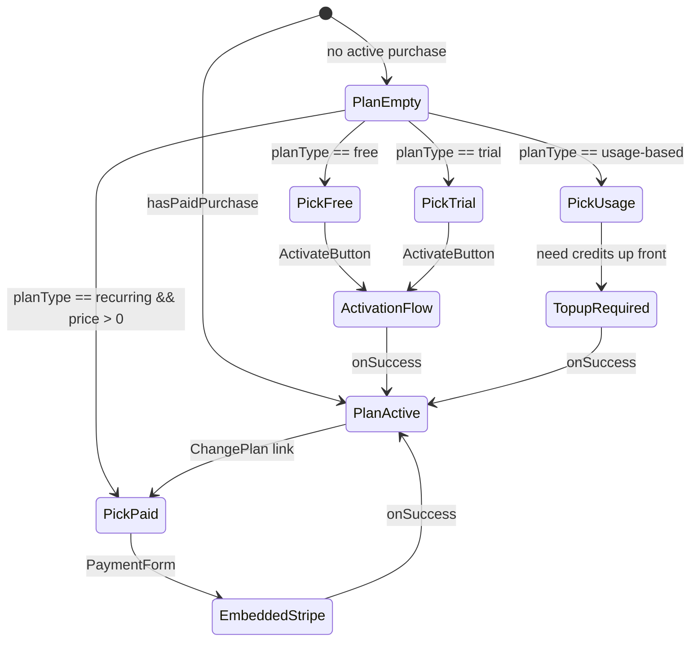
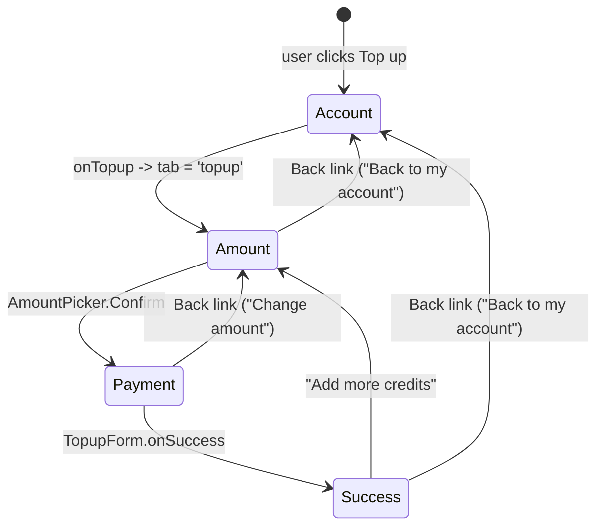

# MCP App UX Discoverability — plan

## Problem recap (from manual testing)

Screenshots show four concrete pain points in the current shell:

- **Plan and Activate tabs render near-identical pickers.** [`McpCheckoutView`](packages/react/src/mcp/views/McpCheckoutView.tsx) opens "Complete your purchase — Free / SEK 500.00"; [`McpActivateView`](packages/react/src/mcp/views/McpActivateView.tsx) opens "Activate your plan — Free / SEK 500.00". A user genuinely cannot tell them apart and the empty state on both screams "why do I have two of these?".
- **Credits tab is dead on arrival without usage data.** `McpUsageView` prints *"No usage-based plan is active."* when the customer has no usage-based purchase — an empty, non-actionable screen that users inevitably click into once and never again.
- **Cold-start users see no narration.** A fresh customer opening `manage_account` lands on Account with "You don't have an active plan" and no guidance on which of the other three tabs leads anywhere productive.
- **Tab labels don't earn their keep.** The tabs exist but don't describe themselves; the user has to click each one to learn what lives inside.

## What we're changing (in one picture)

```mermaid
flowchart LR
  subgraph before [Before]
    B1[Credits]
    B2[Plan]
    B3[Top up]
    B4[Account]
    B5[Activate]
  end
  subgraph after [After]
    A1[About \(product\)]
    A2[Plan]
    A3[Top up]
    A4[Account \+ Credits]
  end
  B1 --> A4
  B2 --> A2
  B3 --> A3
  B4 --> A4
  B5 --> A2
```

- **New `about` tab/view** describing the product (sourced from the provider's `bootstrap.product` config: name, tagline, description, feature bullets) plus the cold-start CTA cards + slash-command hints. End-user vocabulary (host UIs call these "Connected apps" / "MCP servers"); merchant vocabulary ("Product") stays in the admin. In a future multi-product world this tab becomes the list of products the customer has activated on this provider.
- **Shell-header title becomes the product name** (from `bootstrap.product.name`), replacing the static "My account" heading. The merchant logo/displayName stay above it as the seller/brand marker; the product name is what the user is actually looking at.
- **`activate` merges into `plan`.** One contextual tab: shows the picker when no active purchase, the active-plan summary + "Change plan" link when there is one. Activation vs embedded-Stripe is chosen *per card* inside the picker, not at tab level.
- **`usage` (Credits) merges into `account`.** Balance + usage meter live in the Account body; inline "Top up" link routes into the Top up tab.
- **Top up stays as its own tab** because post-paywall flows need a clean landing target.
- **First-run tour** (dismissible, `localStorage`) highlights each tab on first open.
- **Inline tab hints** (`title=` + small `?` glyph on hover) persist after the tour is dismissed.

## Target shell — About view (product description)

Replaces the empty-Account landing screen. Content is driven by `bootstrap.product` (name, tagline, description, feature bullets, logo) so each merchant ships their own brand story without code changes. Two CTA cards and slash-command hints sit below, so cold-start users see both "what is this?" and "what can I do?".

Future-proofed for multi-product: today the view renders one product; once `bootstrap.products` lands (see [`mcp_multi-product_investigation_a9275bd4.plan.md`](packages/sdk/.cursor/plans/mcp_multi-product_investigation_a9275bd4.plan.md)), the same tab becomes a list of activated products with per-product cards. The tab label is always "About" — singular still reads fine when a merchant later lists three products.

```
┌──────────────────────────────────────────────────────────────────┐
│ [logo] Acme Corp                                                 │
│ Acme Knowledge Base                             ← product.name    │
├──────────────────────────────────────────────────────────────────┤
│  About   Plan   Top up   Account                                  │
│  ─────                                                            │
├──────────────────────────────────────────────────────────────────┤
│                                                                   │
│  [product image]                                                  │
│                                                                   │
│  Acme Knowledge Base                                              │
│  AI-ready answers from our curated technical corpus. Search,      │
│  summarise and cite from 10M+ verified sources. Use in the chat   │
│  by typing /search_knowledge or /get_market_quote.                │
│                                                                   │
│  ─────────────────────────────────────────────                    │
│                                                                   │
│  Ready to start?                                                  │
│  ┌──────────────────────────┐  ┌──────────────────────────┐      │
│  │ Choose a plan            │  │ Try without subscribing  │      │
│  │ Free, trial, or paid.    │  │ Add credits now and pay  │      │
│  │ [ See plans ]            │  │ as you go. [ Top up ]    │      │
│  └──────────────────────────┘  └──────────────────────────┘      │
│                                                                   │
│  Quick commands                                                   │
│  · /manage_account   — what you just ran                          │
│  · /search_knowledge — try a paywalled data tool                  │
│  · /topup            — add credits without leaving the chat       │
│                                                                   │
├──────────────────────────────────────────────────────────────────┤
│                  Terms ↗ · Privacy ↗ · Provided by SolvaPay       │
└──────────────────────────────────────────────────────────────────┘
```

The top block reads strictly from the existing `SdkProductResponse` shape carried on `bootstrap.product` ([`generated.ts:1075`](packages/server/src/types/generated.ts)):

- `product.name` — required, used as the heading **and** the shell-header title. No fallback needed — the server guarantees it.
- `product.description` — free-text blurb, rendered as a single paragraph (respects merchant-provided newlines). Omitted when absent.
- `product.imageUrl` — rendered as a constrained-height image above the heading. Omitted when absent. Today this field is a raw string — merchants who have an externally-hosted URL can paste it into the admin and it renders correctly. First-class upload + storage for product images (mirroring the hosted-page logo pipeline) is **FU-4** below; this plan consumes whatever URL is there without blocking on that work.

Conscious scope: **we do NOT add `tagline` or `features` fields to the product schema in this plan.** Those would be a separate backend + OpenAPI change. The current `description` field is the one free-form place the merchant can narrate their product today, and the UI treats it as the single source of editorial copy. If a merchant wants bulleted features, they write them into `description` as markdown-lite (line-break separated bullets) — the renderer shows the text verbatim.

When a merchant has left `description` and `imageUrl` empty, the top block collapses to just the product `name` heading and the view flows straight into the CTA cards + slash commands (same behaviour as the previous "Home" draft). That keeps the plan strictly additive on existing product configs; no backend change required.

Follow-up plan opportunity (not in scope here): extend `SdkProductResponse` with structured `tagline` (short string) and `features` (string[]) fields, and render them as a proper card stack. Captured as a future improvement rather than mixed into this UX plan.

Two CTA cards always render; their labels and visibility are contextual on the available plans and the customer's state (see the "Contextual CTAs by plan-type mix" subsection below). Slash-command hints are derived from the prompts registered in [`packages/mcp/src/descriptors.ts`](packages/mcp/src/descriptors.ts) so hosts without slash-command UI (ChatGPT) gracefully degrade — the list simply renders as copy.

### "Your activity" strip (returning customers)

Below the product description, above the CTA cards, the About view renders a compact "Your activity" strip when the customer has any active purchase. This is what turns About from a cold-start-only landing into a useful daily destination for PAYG customers, who otherwise would only live in Account.

Four variants driven by the active purchase's plan shape:

```
PAYG customer
┌──────────────────────────────────────────────────────────────────┐
│ Your activity                                                     │
│ 865,500 credits (~SEK 802.48)                    [ Top up ]      │
│ Pay as you go · 1 credit = SEK 0.01                               │
└──────────────────────────────────────────────────────────────────┘

Recurring unlimited customer
┌──────────────────────────────────────────────────────────────────┐
│ Your activity                                                     │
│ Unlimited — no limits on this plan                                │
│ SEK 500/mo · Renews 1 May                        [ Manage ↗ ]    │
└──────────────────────────────────────────────────────────────────┘

Recurring metered customer (e.g. 500 queries/mo)
┌──────────────────────────────────────────────────────────────────┐
│ Your activity                                                     │
│ 342 / 500 queries used                           [ Upgrade ]      │
│ ████████████░░░░░░░ · Resets 1 May                                │
└──────────────────────────────────────────────────────────────────┘

Free-tier customer
┌──────────────────────────────────────────────────────────────────┐
│ Your activity                                                     │
│ 25 / 50 queries used on Free                     [ Upgrade ]      │
│ █████████░░░░░░░░░░                                               │
└──────────────────────────────────────────────────────────────────┘
```

Strip routes: `Top up` → Top up tab, `Upgrade` → Plan tab, `Manage ↗` → hosted portal (external, new-tab glyph). All three share the shell's cache-warm in-flow navigation — zero remounts.

Strip is absent when the customer has no active purchase — CTA cards take over, because there's no activity yet to summarise.

### Contextual CTAs by plan-type mix

The two CTA cards at the bottom of About reshape based on which plans `bootstrap.plans` actually exposes, so the copy never promises something the product can't deliver. Evaluated in this order:

- **Card 1 — always `Choose a plan` → See plans.** Routes to the Plan tab picker. Only hidden when `bootstrap.plans` is empty (degenerate case — not shippable).
- **Card 2 — contextual, first-match wins:**
  - If a free plan exists (and the customer hasn't taken it) → `Start free` → activates the free plan inline (same branch as `ActivationFlow.Summary`). Label: "No card required — activate in one click."
  - Else if a usage-based plan exists → `Try without subscribing` → Top up tab. Label: "Add credits now and pay as you go."
  - Else → card hidden entirely. A product that only ships paid recurring has nothing to put here that wouldn't be a duplicate of Card 1.

Returning customers (active purchase) see Card 1 narrowed to `Change plan` copy, and Card 2 hidden (they're past the "pick a starting point" moment — the activity strip is their daily anchor now).

This matrix answers the pressure-test question "does this work for free / PAYG / recurring?": yes, because the CTA slots are plan-type-aware instead of hard-coded around a PAYG assumption.

### Shell header — product-driven title

```
┌──────────────────────────────────────────────────────────────────┐
│ [merchant logo]  Parcel code                   ← merchant.displayName │
│                                                                   │
│ Acme Knowledge Base                            ← bootstrap.product.name │
├──────────────────────────────────────────────────────────────────┤
```

Replaces the static "My account" heading in [`McpAppShell.tsx` `ShellHeader`](packages/react/src/mcp/McpAppShell.tsx). Logic:

- Heading reads `bootstrap.product.name`, truncated with CSS ellipsis at one line.
- Fallback chain when `product` is missing (should only happen in tests / degraded bootstrap): `merchant.displayName` → `'My account'`.
- The merchant display name (top row) stays as the provider/brand marker — answers "who you're paying".
- The product name (bottom row) is the shell title — answers "what you're using".

This mirrors how hosts present connected MCPs: the connector card in ChatGPT shows the merchant brand above the service name. A user scanning multiple active MCP iframes in a future multi-iframe host can tell them apart by their product titles.

## Target shell — Plan tab (contextual)

One tab, two states. The card picker stays identical; the post-selection branch is chosen from the plan's `planType` metadata, eliminating the two-tab confusion.



**Empty state** (no purchase) — sketch:

```
┌──────────────────────────────────────────────────────────────────┐
│  Pick your plan                                                   │
│  Free and trial plans activate instantly. Paid plans collect      │
│  payment here; usage-based plans start with a top-up.             │
│                                                                   │
│  ┌───────────┐  ┌───────────┐  ┌───────────┐                     │
│  │ Free      │  │ Pay-as-   │  │ Unlimited │                     │
│  │ 50/mo     │  │ you-go    │  │ SEK 500/mo│                     │
│  │           │  │ SEK 0.01  │  │           │                     │
│  │ [Start]   │  │ /query    │  │ [Subscribe]│                     │
│  │           │  │ [Top up]  │  │            │                     │
│  └───────────┘  └───────────┘  └───────────┘                     │
│                                                                   │
│  Not sure? Try a demo command: /search_knowledge (uses 1 credit)  │
└──────────────────────────────────────────────────────────────────┘
```

**Active state** (has purchase) — four variants driven by the active purchase's `planType` + meter config. Affordances differ per variant so we never render a nonsensical `Cancel` on PAYG or a `Top up` on unlimited.

```
PAYG — pay as you go
┌──────────────────────────────────────────────────────────────────┐
│  Current plan                                                     │
│  Starter — Pay as you go                                          │
│  Balance: 865,500 credits · 1 credit = SEK 0.01                  │
│  [ Top up ]  [ Change plan ]  [ Manage billing ↗ ]               │
│  ·  No cancellation — just stop topping up when you're done.      │
└──────────────────────────────────────────────────────────────────┘

Recurring unlimited
┌──────────────────────────────────────────────────────────────────┐
│  Current plan                                                     │
│  Unlimited — SEK 500/mo · Renews 1 May                            │
│  [ Change plan ]  [ Cancel ]  [ Manage billing ↗ ]                │
└──────────────────────────────────────────────────────────────────┘

Recurring metered (e.g. 500 queries/mo)
┌──────────────────────────────────────────────────────────────────┐
│  Current plan                                                     │
│  Pro — SEK 200/mo · 342 / 500 queries used · Renews 1 May         │
│  ████████████░░░░░░░                                              │
│  [ Change plan ]  [ Cancel ]  [ Manage billing ↗ ]                │
└──────────────────────────────────────────────────────────────────┘

Free tier (activated)
┌──────────────────────────────────────────────────────────────────┐
│  Current plan                                                     │
│  Free — 25 / 50 queries used                                      │
│  █████████░░░░░░░░░░                                              │
│  [ Upgrade ]  [ Cancel ]                                          │
│  ·  No billing setup — upgrade any time to a paid plan.           │
└──────────────────────────────────────────────────────────────────┘
```

Per-variant affordance rules (encoded as `resolvePlanActions(purchase)` in [`McpCheckoutView.tsx`](packages/react/src/mcp/views/McpCheckoutView.tsx)):

- **`Top up`** — only when `planType === 'usage-based'`. Routes to Top up tab.
- **`Cancel`** — only when `planType === 'recurring'` or `planType === 'free'`. PAYG has no renewal to cancel; the balance persists regardless.
- **`Change plan`** — always, when at least one other plan exists on the product. Routes to the picker.
- **`Manage billing ↗`** — only when the customer has a payment method on file (any recurring or prior PAYG top-up). Free plans that never charged a card skip this — the hosted portal has nothing to manage yet.
- **`Upgrade`** — shown instead of `Change plan` when the current plan is free AND at least one paid plan exists. Makes the upsell intent explicit.

Implementation sketch (replaces the current `McpCheckoutView`):

- Reuse `PlanSelector.Root` with one `Card` per plan. On each card's CTA, branch via a small `resolveActivationStrategy(plan)` helper:
  - `free` / `trial` → render `ActivationFlow.Summary` + `ActivateButton` inline (the current `McpActivateView` branch).
  - `usage-based` → render `ActivationFlow.AmountPicker` + `ContinueButton` (also current).
  - `recurring`, price > 0 → render `PaymentFormGate` + `PaymentForm.*` (current `EmbeddedCheckout` branch).
- Active-purchase case routes to the existing `ManageBody` component (`CurrentPlanCard` + cancel / change-plan links).
- Delete `McpActivateView` from the tab-routing table, keep the source file temporarily behind `views.activate` override for integrator escape hatch (mark as deprecated in a JSDoc, removed in a follow-up).

## Target shell — Account tab (now carries Credits)

```
┌──────────────────────────────────────────────────────────────────┐
│  Your account                                                     │
│  Tommy Berglind · tommy@solvapay.com · cus_MEPLNXUS                │
│                                                                   │
│  Credit balance                                                   │
│  865,500 credits (~SEK 802.48)           [ Top up ]               │
│                                                                   │
│  Active plan                                                      │
│  Unlimited — SEK 500/mo                  [ Manage billing ↗ ]     │
│                                                                   │
│  ─────────────────────────────                                    │
│  Who you're paying                                                │
│  Acme AB · 555-123456 · Stockholm · ✓ Verified seller             │
│  support@acme.com · https://acme.com                              │
└──────────────────────────────────────────────────────────────────┘
```

Key changes in [`packages/react/src/mcp/views/McpAccountView.tsx`](packages/react/src/mcp/views/McpAccountView.tsx):

- Merge `McpUsageView`'s usage meter into the Account body when the active purchase has a meter. Removes the need for a separate Credits tab.
- Balance row promoted from a small footer row to a prominent card with an inline "Top up" button that calls `onTopup` (tab switch to Top up).
- Empty state (no purchase yet) shows "Pick a plan" CTA that routes to the Plan tab — collapses with the Welcome view's primary CTA for a consistent navigation model.

`McpUsageView` stays as a standalone primitive but stops being wired as a tab. Integrators can still mount it via `views.usage` override or by composing the React primitives directly.

## Target shell — Top up tab (three-step flow with back-nav)

The top-up flow already has three internal states in [`McpTopupView.tsx`](packages/react/src/mcp/views/McpTopupView.tsx) — Amount → Payment → Success — driven by `committedAmountMinor` / `justPaidMinor`. Today step 2 has a `Change amount` link but step 1 has no way back to Account, and the success step doesn't offer a path back to the rest of the shell. Fix: make every step offer a single `← Back` link styled identically to the hosted [`CheckoutShell.tsx` line 42](src/components/customer/checkout/CheckoutShell.tsx) "← Back to my account" affordance.

### Navigation model



Three back-link targets, one shared primitive — no history stack needed, each step knows its own previous state.

### Step 1 — Amount selection

Entry point from any `onTopup` call (Account balance card, About "Try without subscribing" CTA, usage meter CTA, post-paywall). No form mounted yet — we don't create a PaymentIntent until the user commits an amount.

```
┌──────────────────────────────────────────────────────────────────┐
│ [logo] Acme Corp                                                 │
│ Acme Knowledge Base                                              │
├──────────────────────────────────────────────────────────────────┤
│  About   Plan   Top up   Account                                 │
│                  ─────                                           │
├──────────────────────────────────────────────────────────────────┤
│  ← Back to my account                                             │  ← new
│                                                                   │
│  Add credits                                   865,500 credits    │
│                                                ~SEK 802.48        │
│                                                                   │
│  Pick an amount                                                   │
│  ┌──────┐ ┌──────┐ ┌──────┐ ┌──────┐                              │
│  │ $10  │ │ $25  │ │ $50  │ │ $100 │                              │
│  └──────┘ └──────┘ └──────┘ └──────┘                              │
│  Custom amount: [________]                                        │
│                                                                   │
│  1 credit = $0.01 · No expiry · Refundable within 30 days         │
│                                                                   │
│  [ Continue → ]                                                   │
└──────────────────────────────────────────────────────────────────┘
```

### Step 2 — Payment form

Mounts `TopupForm.Root` with the committed amount. `Change amount` is the in-step back, but we also keep the outer `← Back to my account` for users who changed their mind entirely.

```
┌──────────────────────────────────────────────────────────────────┐
│ [logo] Acme Corp                                                 │
│ Acme Knowledge Base                                              │
├──────────────────────────────────────────────────────────────────┤
│  About   Plan   Top up   Account                                 │
│                  ─────                                           │
├──────────────────────────────────────────────────────────────────┤
│  ← Back to my account                                             │
│                                                                   │
│  Pay with card                                 865,500 credits    │
│  Adding $25.00 in credits.                                        │
│                                                                   │
│  ┌──────────────────────────────────────────────────┐             │
│  │ Card number      [ 4242 4242 4242 4242       ]   │             │
│  │ Expiry  [MM/YY]    CVC  [123]    ZIP  [ 12345 ]  │             │
│  │ Country ▾ [ United States        ]               │             │
│  └──────────────────────────────────────────────────┘             │
│                                                                   │
│  By continuing you agree to our Terms · Privacy                   │
│                                                                   │
│  [ Pay $25.00 ]                                                   │
│  ← Change amount                                                  │  ← existing
└──────────────────────────────────────────────────────────────────┘
```

### Step 3 — Success

Success persists until the user picks a next action. Primary CTA is implicit ("you're done"); back to Account is the expected default path.

```
┌──────────────────────────────────────────────────────────────────┐
│ [logo] Acme Corp                                                 │
│ Acme Knowledge Base                                              │
├──────────────────────────────────────────────────────────────────┤
│  About   Plan   Top up   Account                                 │
│                  ─────                                           │
├──────────────────────────────────────────────────────────────────┤
│  ← Back to my account                                             │
│                                                                   │
│  ✓ Credits added                               868,000 credits    │
│  $25.00 landed in your balance.                                   │
│                                                                   │
│  [ Add more credits ]                                             │
│  [ Manage billing ↗ ]                                             │
└──────────────────────────────────────────────────────────────────┘
```

### External-link affordance

Every button or link that opens a new browser tab (ie leaves the MCP iframe) gets a trailing `↗` glyph so the user can distinguish in-shell navigation from a pop-out. Rule:

- **In-shell nav** (tab switch, step forward inside a sub-flow) — no icon. Examples: `Top up`, `Continue →`, `Pay $25.00`, `See plans`, `Change plan`.
- **External tab** (`<a target="_blank">`) — trailing `↗` in the label, `aria-label` suffix `" (opens in a new tab)"`. Examples: `Manage billing ↗`, `Open SolvaPay portal ↗`, `Reopen checkout ↗`, `Terms ↗`, `Privacy ↗`.

Concretely in [`LaunchCustomerPortalButton`](packages/react/src/components/LaunchCustomerPortalButton.tsx), the ready-state anchor appends the glyph to the provided `children`:

```0:0:packages/react/src/components/LaunchCustomerPortalButton.tsx
// illustrative — new trailing glyph + a11y hint on the ready-state <a>
<a
  ref={forwardedRef}
  {...readyProps}
  aria-label={`${label} (opens in a new tab)`}
>
  {children ?? copy.customerPortal.launchButton}
  <span className="solvapay-mcp-external-glyph" aria-hidden="true"> ↗</span>
</a>
```

Call sites that render `LaunchCustomerPortalButton` (Account, Top up success, Hosted topup fallback) pick this up automatically — no per-site change. The same `.solvapay-mcp-external-glyph` style is applied to the footer `Terms` / `Privacy` anchors in [`McpAppShell.tsx` ShellFooter](packages/react/src/mcp/McpAppShell.tsx) and to the hosted-checkout fallback buttons in [`McpCheckoutView` HostedLinkButton](packages/react/src/mcp/views/McpCheckoutView.tsx) (`Reopen checkout`, `Upgrade`, `Purchase again`).

Using the `↗` Unicode glyph (not an SVG) keeps the shell free of icon-library imports and matches the existing convention of the `←` back glyph. For users with screen readers, `aria-hidden="true"` hides the decorative arrow while the `aria-label` / trailing `(opens in a new tab)` carries the meaning.

### Shared back-link primitive

Add one small component, reused across Top up steps and (optionally) deep sub-flows that hide the tab strip:

```0:0:packages/react/src/mcp/views/BackLink.tsx
// illustrative — new file, ~20 lines
interface BackLinkProps {
  label: string            // e.g. "Back to my account", "Change amount"
  onClick: () => void
}
export function BackLink({ label, onClick }: BackLinkProps) {
  return (
    <button
      type="button"
      className="solvapay-mcp-back-link"
      onClick={onClick}
    >
      <span aria-hidden="true">← </span>{label}
    </button>
  )
}
```

Styling mirrors the hosted treatment: muted text, left-aligned above the view body, subtle hover darken. Icon is a literal `←` glyph (no svg import) to match [`CheckoutShell.tsx`](src/components/customer/checkout/CheckoutShell.tsx).

### Wiring in `McpTopupView`

The view gets one new prop and two new internal back-handlers:

- `onBack?: () => void` — passed by `<McpAppShell>` as `() => onSelect('account')`. The shell already owns the tab state, so "back to Account" is just a tab switch, no re-mount cost because caches are warm.
- Step 1 renders `<BackLink label="Back to my account" onClick={onBack} />` above the heading.
- Step 2 keeps the existing `Change amount` button but restyles it through `<BackLink label="Change amount" onClick={() => setCommittedAmountMinor(null)} />`; also renders the outer `Back to my account` link at the top.
- Step 3 renders `<BackLink label="Back to my account" onClick={onBack} />` and the existing `Add more credits` button (which resets `justPaidMinor`).

One subtlety: when the user lands on Top up from the **paywall** (secondary flow — the paywall's primary "Top up $N" button), the shell is still in paywall mode and there's no Account tab to go back to. In that case the shell passes `onBack={undefined}` and `McpTopupView` renders the back link only when `onBack` is defined. The paywall's own back affordance (dismiss gate) covers that path instead.

### Parity with the other flows

Plan and Activate already collapse into the Plan tab (see earlier section). For symmetry, the Plan tab's sub-flows get the same back-link treatment at the same anchor position:

- `PlanEmpty → PickPaid → EmbeddedStripe`: `← Change plan` link above the `PaymentForm`, routes back to the picker.
- `PlanActive → Cancel confirmation`: `← Back` link above the cancel summary.

These mirror the Top up back-links and use the same `BackLink` primitive — one consistent affordance per sub-flow across the whole shell.

## First-run tour and inline hints

### First-run tour

A dismissible overlay driven by `localStorage['solvapay-mcp-tour-seen']`. Three steps:

1. **About** — points at the About tab, copy: "Here's what this app does. Start here any time you open it from chat."
2. **Plan** — points at the Plan tab, copy: "Pick free, pay-as-you-go, or subscribe. One tab for all three."
3. **Account** — points at the Account tab, copy: "See your balance, change your card, contact the seller."

Wired inside `McpAppShell`. Skipped entirely when `bootstrap.view === 'paywall'` (the paywall is a gate, not a destination). Re-opens when the user clicks a small "?" button in the shell header.

Minimal implementation — one new file [`packages/react/src/mcp/McpFirstRunTour.tsx`](packages/react/src/mcp/McpFirstRunTour.tsx) with a popover anchored to each tab button via `data-tour-step="about" | "plan" | "account"`. No new deps; the popover is a positioned `<div>` + focus-trap.

### Inline hints

Each tab button gets a `title=` attribute and an accessible description:

```0:0:packages/react/src/mcp/McpAppShell.tsx
<!-- illustrative — new attributes on the existing tab button -->
<button
  role="tab"
  data-tour-step="plan"
  title="Pick, change or cancel your plan"
  aria-describedby={`solvapay-mcp-tab-hint-${tab}`}
>Plan</button>
<span id="solvapay-mcp-tab-hint-plan" hidden>
  Free, pay-as-you-go, and paid plans all live here.
</span>
```

Hover shows the native tooltip; screen readers get the hint as a description; the tour uses the same copy. Single source of truth per tab.

## Usage scenarios (drive tab visibility and routing)

Each scenario is a concrete journey and names the tabs/views it exercises.

### 1. First-time visitor, no purchase, no credits

*Goal*: understand what this is and take a first action.

- Lands on **About**. Sees the product description (name, tagline, features), then "Choose a plan" + "Try without subscribing" cards + slash-command hints.
- Clicks "See plans" → **Plan** tab, picker with all plan types side-by-side. The tour fires on first open of the shell.

### 2. Returning user, active Unlimited plan

*Goal*: confirm "am I still subscribed?" or cancel.

- About tab still visible (it's the product page, not just a cold-start landing). Initial tab is whatever the tool sent (`manage_account` → **Account**).
- Account shows balance card *with "Unlimited" affirmation*, active plan card, seller-details footer.
- Clicks "Manage billing" → `create_customer_session` → portal tab.

### 3. Usage-based customer with credits running low

*Goal*: top up before they run out.

- Initial tab from `check_usage` = **Account** (with usage meter inline).
- Sees "23 / 500 credits used · Resets 1 May", prominent `[ Top up ]` button.
- Clicks → **Top up** tab, Stripe Elements, confirm, balance updates, stays on Top up with "Credits added" success state.

### 4. Data-tool paywall interrupt

*Goal*: unblock themselves from inside the chat.

- `/search_knowledge` gate fires → iframe opens on `view: 'paywall'`. Tabs + footer hidden (unchanged from current).
- User picks `[ Top up $10 ]` → Stripe → `refreshBootstrap` → shell snaps to **Account** tab (not Top up) so they see the affirmed balance.
- OR picks `[ Upgrade to Unlimited — SEK 500/mo ]` → dismiss paywall locally → **Plan** tab with the Unlimited card pre-selected and `PaymentFormGate` mounted.

### 5. Developer exploring the demo

*Goal*: understand what the MCP app surfaces.

- Opens `basic-host` → runs `/manage_account` → tour fires, narrates the three tabs.
- Clicks "?" in header to replay the tour.
- Reads the product description and slash-command hints on **About**, tries `/search_knowledge` to see the paywall loop live.
- Confirms everything on the `docs://solvapay/overview.md` resource.

### 6. Host without slash-command UI (ChatGPT narrow iframe)

*Goal*: discoverability without prompt surface.

- About renders slash-command hints as plain copy ("Type `/topup` in chat to add credits") — no slash-command `title`s required.
- Sidebar hidden at narrow width; Account tab visible and carries the same cards.
- Tour steps anchor to visible elements only (Home → Plan → Account; no sidebar step).

## Text-mode fallback (dual-audience responses)

Not every host that calls a SolvaPay tool renders the UI iframe. Claude Code (CLI), agents, and programmatic MCP clients only see `content[0].text`. Today that text is a raw JSON dump of the `BootstrapPayload` ([`toolResult` in helpers.ts:166](packages/mcp/src/helpers.ts)), which is unusable for humans and pointless for agents. This section specifies how every intent tool produces a response that works in both UI and text modes without asking the host which one it is.

### Protocol reality

- MCP has **no** `ClientCapabilities.preferText` or equivalent flag. Hosts decide rendering; servers must emit content that works either way.
- `ui://` UI resources are a host convention (mcp-ui). UI-capable hosts honour them; text-only hosts silently ignore them and fall back to `content[0].text`.
- So the server's job is to emit *both* a UI resource ref *and* a narrated markdown summary every time. The host picks.

### Layer 1 — narrated minimal-markdown text per tool (required)

Replace [`toolResult(data)`](packages/mcp/src/helpers.ts) with a two-step formatter: structured content stays unchanged for agents (they parse JSON); `content[]` becomes a `text` block of *sparse* markdown plus one or more `resource_link` blocks for external URLs. New helper in `packages/mcp/src/helpers.ts`:

```typescript
// illustrative — replaces the current toolResult for intent tools
export function narratedToolResult(
  data: BootstrapPayload,
  narrate: (b: BootstrapPayload) => { text: string; links?: Array<{ uri: string; name: string }> },
): SolvaPayCallToolResult {
  const { text, links } = narrate(data)
  return {
    content: [
      { type: 'text', text },
      ...(links ?? []).map(l => ({ type: 'resource_link' as const, uri: l.uri, name: l.name })),
    ],
    structuredContent: data as Record<string, unknown>,
  }
}
```

Narrator map lives in `packages/mcp/src/narrate.ts` (new), one function per intent — each returns `{ text, links }`.

### Text style guide (four rules)

The narrated text is intentionally sparse — heavy markdown is noisy on CLI hosts, burns tokens in context, and creates more characters for agents to strip. Every narrator follows the same shape:

1. **First line: a single `**bold title**`.** No `#` or `##` headings. The tool-call framing the host adds around every response already provides structural context; adding headings on top is double-marking and clobbers CLI readability.
2. **Body: `Label: value` rows, one per line, `·` as inline separator.** Never bullets. Keeps vertical space tight, reads as a data sheet in a terminal, renders as a clean key/value list in UI hosts.
3. **Commands: a single line with each command as inline-code.** `Commands: \`/topup\` \`/upgrade\` \`/check_usage\``. Hosts highlight each command; terminals show them as monospace; agents see a single delimited line they can split on spaces.
4. **URLs: `resource_link` content blocks, not inline markdown links.** Claude Desktop / Cursor render these as first-class clickable affordances with a title and icon; hosts that don't honour `resource_link` still see the URL exposed via the block's `uri` field, and our fallback prints a trailing line `Open: <uri>` in the text block only when the narrator knows the host is text-only (never — we don't sniff, so we always rely on the block).

Why sparse wins over heavy markdown or plain text:

- **Renders fine on every host we care about.** Claude Code renders `**bold**` via ANSI; terminals that don't still show readable `**text**`.
- **~45% fewer characters** than the earlier heavy-markdown draft for a `manage_account` response — less token burn when the text is re-submitted into the agent's context.
- **Semantically richer than plain text** — external URLs are their own content blocks, bold-title carries hierarchy without a heading.
- **Easier to parse programmatically** — one header, key/value lines, one commands line. No nested bullet lists to unwrap.

### Narrator output examples

`manage_account` with an active Unlimited purchase:

```
**Acme Knowledge Base — your account**

Plan: Unlimited · SEK 500/mo · renews 1 May 2026
Balance: 865,500 credits (~SEK 802.48)
Customer: Tommy Berglind (tommy@solvapay.com)

Commands: `/topup` `/upgrade` `/check_usage`
```

plus links:

```json
[{ "type": "resource_link", "uri": "https://portal.solvapay.com/s/…", "name": "Open hosted portal" }]
```

`manage_account` on a cold-start customer:

```
**Welcome to Acme Knowledge Base**

No active plan. Plans available:
Free · 50 queries/month · no payment required
Starter · pay as you go · SEK 0.01/query
Unlimited · SEK 500/mo · no limits

Commands: `/activate_plan` `/upgrade`
```

plus links:

```json
[{ "type": "resource_link", "uri": "https://portal.solvapay.com/s/…", "name": "Open hosted portal" }]
```

`check_usage` on a PAYG customer:

```
**Usage — Acme Knowledge Base**

Balance: 865,500 credits (~SEK 802.48)
Plan: Starter · pay as you go · SEK 0.01/query

Commands: `/topup` `/upgrade`
```

`check_usage` on a recurring-metered customer:

```
**Usage — Acme Knowledge Base**

342 / 500 queries used this cycle · resets 1 May 2026
Plan: Pro · SEK 200/mo

Commands: `/upgrade`
```

`topup` (entry):

```
**Top up — Acme Knowledge Base**

Balance: 865,500 credits (~SEK 802.48)
Top-up presets: SEK 100 · SEK 250 · SEK 500 · SEK 1000

Commands: `/check_usage` `/manage_account`
```

### Exceptions & escape hatches

- **Errors use a different shape.** An error response keeps `isError: true` and the text follows the same style (`**Error — <summary>**` + `Reason: ...` lines), no links block. Kept consistent so callers don't have to branch on success/error formatting.
- **Null-state graceful degradation.** Missing fields (no email, no balance) just skip their row — narrators never emit `Balance: —` or `Customer: unknown`. A narrator returning only a title + one line is still well-formed.
- **Localisation is out of scope for this plan.** Narrators write English; follow-up can introduce per-locale copy tables if needed. All structured data that drives the narrators is already locale-agnostic (`BootstrapPayload`), so locale variance lives in the narrator functions, not the plumbing.

### Layer 2 — `mode` arg for explicit override

Every intent tool accepts a new optional arg `{ mode?: 'ui' | 'text' | 'auto' }` with default `'auto'`. Semantics:

- `'auto'` (default) — return both the UI resource ref on `_meta.ui` **and** the narrated markdown. The host picks. Current behaviour plus Layer 1.
- `'text'` — strip the UI resource ref from `_meta.ui` so UI-capable hosts also render text-only for this call. Useful when the user says "just summarise it in chat" on Claude Desktop, or when an agent is scraping.
- `'ui'` — replace the narrated markdown with a minimal placeholder (`"Opening your Acme account…"`) so the chat transcript isn't noisy when the host is *definitely* rendering the iframe. Advanced — agents rarely need this, but some integrators will want their transcripts clean.

Hosts can surface this to users through prompt args (slash-commands accept `mode:` as a parameter), but the server never asks — it just honours what the arg says. Zero backend state, zero protocol changes.

### Layer 3 — host capability matrix in docs

Add a `## Host capability matrix` section to [`examples/mcp-checkout-app/TOOLS.md`](examples/mcp-checkout-app/TOOLS.md) and mirror it into the docs guide. One row per host we've tested:

- **Claude Desktop** — renders UI iframes, shows text content collapsed by default.
- **Claude Code (CLI)** — text-only, ignores `ui://` resources entirely.
- **Cursor IDE** — renders UI iframes as of build X.Y.Z; older builds text-only.
- **ChatGPT MCP connectors** — renders UI via the Apps SDK equivalent.
- **`basic-host`** — dev harness, renders UI and echoes text.
- **Programmatic (n8n, custom agents)** — always both; consumers pick.

Integrators reading the docs know which mode to test against and what their own end users will see.

### What we intentionally do NOT do

- No server-side persisted "hide UI" preference per customer. Host-level concern; adding backend state for it fights against host-native toggles.
- No separate `_text` variants (`manage_account_text`, `upgrade_text`). Doubles the tool surface for no gain — the `mode` arg keeps the 5-intent surface intact.
- No user-agent / client-header sniffing. Unreliable and clobbers explicit user choice.

### Testing burden

- Unit: 5 narrator functions × 3 customer states (cold / PAYG active / recurring active) = 15 snapshot tests of the markdown output.
- Unit: `mode: 'text'` strips `_meta.ui.uiResource`, `mode: 'ui'` replaces `content[0].text` with the placeholder.
- Integration: run `basic-host` in "stdout" mode (suppress UI rendering) and verify `/manage_account`, `/check_usage`, `/topup` all produce coherent markdown without JSON dumps.

## Plan-type pressure test

The shell supports four plan shapes, each with distinct state and affordances. This table pins what every tab renders for every shape so nothing is left implicit:

- **PAYG** (pay-as-you-go, usage-based) — `planType === 'usage-based'`, customer holds a credit balance, decrements per call.
- **Recurring unlimited** — `planType === 'recurring'`, no meter, flat monthly charge.
- **Recurring metered** — `planType === 'recurring'`, meter attached with a cap (e.g. 500 queries/mo).
- **Free tier** — `planType === 'free'`, usually capped by a meter, often an upsell to paid.

### Per-tab behaviour

- **About — "Your activity" strip** (returning customers):
  - PAYG → balance + `Top up` link.
  - Recurring unlimited → plan name + renew date + `Manage ↗`.
  - Recurring metered → usage meter + `Upgrade`.
  - Free → usage meter + `Upgrade`.
  - No active purchase → strip hidden, CTA cards take over.
- **About — CTA card 2** (cold-start contextual, first match wins):
  - Free plan available, not yet activated → `Start free`.
  - Else usage-based plan available → `Try without subscribing` → Top up.
  - Else → hidden.
- **Plan — empty state**: picker showing all four plan shapes side-by-side; per-card CTAs branch (`Start` / `Subscribe` / `Add credits & start`) through `resolveActivationStrategy(plan)`.
- **Plan — active state** (four variants, see sketches above): per-variant affordances controlled by `resolvePlanActions(purchase)`.
- **Top up**: visible when any usage-based plan exists OR the customer currently holds one OR the balance is non-zero. Hidden entirely on a pure recurring-unlimited product.
- **Account**:
  - PAYG → balance card + `Top up` link + portal link ↗.
  - Recurring unlimited → plan card + `Manage billing ↗`. Balance row omitted.
  - Recurring metered → plan card + usage meter + `Upgrade`.
  - Free → plan card + usage meter + `Upgrade`. No `Manage billing` (no billing relationship yet).
- **Paywall take-over** (gate response):
  - PAYG exhaustion → `Top up $N` primary + `Upgrade to <recurring>` secondary (if available).
  - Free-tier exhaustion → `Upgrade to <paid>` primary + `Top up` secondary (if PAYG available).
  - Metered recurring exhaustion → `Upgrade to <higher tier>` primary + `Top up` secondary (rare — mid-cycle extension).

### What changes under the hood

Two small derivation helpers in [`McpAppShell.tsx`](packages/react/src/mcp/McpAppShell.tsx), both driven off `BootstrapPayload` + the active purchase:

```
resolveActivationStrategy(plan) -> 'free' | 'trial' | 'usage-based' | 'recurring-paid'
resolvePlanActions(purchase)     -> { topUp?, cancel?, upgrade?, changePlan?, managePortal? }
```

Every variant sketch maps to one return shape. Unit-test matrix: 4 plan types × 2 states (empty / active) × 3 CTA-card configs = 24 cases, covered by parameterised tests.

## Tab visibility rules (updated)

Evaluated in display order `About / Plan / Top up / Account`:

- **About** — always visible. It's the product page (and the future multi-product list). Even a long-term subscriber can come back to re-read the product description, check features, or find the slash-command list. The cold-start CTA cards self-hide when the customer already has an active purchase, so the view narrows to "description + commands" for returning users.
- **Plan** — always visible. Empty state = picker; active state = current-plan summary.
- **Top up** — visible when any plan is usage-based OR the customer holds a usage-based purchase OR the customer has a non-zero credit balance.
- **Account** — visible when `customer != null`. Carries the usage meter + balance (Credits-tab content) when the customer has usage data.

Sidebar behaviour unchanged from Phase 5 — Account drops from the tab row at `xl` and renders in the right-hand sidebar.

## Files to touch

- `packages/react/src/mcp/McpAppShell.tsx` — add `about` tab kind, update `MCP_TAB_ORDER`, update `computeVisibleTabs`, route `about` to new `McpAboutView`, wire `data-tour-step` attributes and first-run tour mount, add `McpTabHint` slot, and replace the hard-coded "My account" heading in `ShellHeader` with `bootstrap.product.name` (fallback chain: `merchant.displayName` → `'My account'`). ([current file](packages/react/src/mcp/McpAppShell.tsx))
- `packages/react/src/mcp/views/McpAboutView.tsx` *(new)* — product description (name / tagline / description / features from `bootstrap.product`) + two CTA cards + slash-command list. CTA cards hide automatically when the customer already has an active purchase, so returning users see a pure info view.
- `packages/react/src/mcp/McpFirstRunTour.tsx` *(new)* — popover tour with localStorage flag + replay button.
- `packages/react/src/mcp/views/McpAccountView.tsx` — fold balance card + usage meter inline, drop "Manage billing" as secondary. ([current file](packages/react/src/mcp/views/McpAccountView.tsx))
- `packages/react/src/mcp/views/McpTopupView.tsx` — add `onBack` prop; render `<BackLink label="Back to my account">` above step 1 + step 3 bodies; restyle the existing "Change amount" as a `BackLink` in step 2. ([current file](packages/react/src/mcp/views/McpTopupView.tsx))
- `packages/react/src/mcp/views/BackLink.tsx` *(new)* — shared `← <label>` muted button used by Top up, Plan sub-flows, and cancel-confirmation.
- `packages/react/src/components/LaunchCustomerPortalButton.tsx` — append `↗` glyph and `aria-label` suffix to the ready-state anchor so users see it opens in a new tab. ([current file](packages/react/src/components/LaunchCustomerPortalButton.tsx))
- `packages/react/src/mcp/styles.css` — `.solvapay-mcp-external-glyph` (trailing `↗`, matches the `←` back-link convention) plus a small opacity dim.
- Apply `.solvapay-mcp-external-glyph` to every `<a target="_blank">` call site: `ShellFooter` (Terms / Privacy), `HostedLinkButton` in `McpCheckoutView` (`Reopen checkout`, `Upgrade`, `Purchase again`), `HostedTopupFallback` (`Open SolvaPay portal`), `McpSellerDetailsCard` (website link).
- `packages/react/src/mcp/views/McpCheckoutView.tsx` *(refactor)* — add `resolveActivationStrategy(plan)` branch per card so free/trial/usage-based cards render `ActivationFlow` inline instead of `PaymentForm`. Use `BackLink` for `← Change plan` on the embedded Stripe step. ([current file](packages/react/src/mcp/views/McpCheckoutView.tsx))
- `packages/react/src/mcp/views/McpActivateView.tsx` — mark deprecated in JSDoc, leave export so `views.activate` override still works for one release; remove tab routing. ([current file](packages/react/src/mcp/views/McpActivateView.tsx))
- `packages/react/src/mcp/styles.css` — Home card grid, tour popover, `?` header button, inline hint style.
- `packages/mcp/src/types.ts` — add `'about'` to `SolvaPayMcpViewKind`. ([current file](packages/mcp/src/types.ts))
- `packages/mcp/src/bootstrap-payload.ts` + `descriptors.ts` — optional: `manage_account` can set `view: 'about'` when no purchase exists, `view: 'account'` when one does. `bootstrap.product` already carries `name`, `description`, `imageUrl` via the existing `SdkProductResponse` alias ([`generated.ts:1075`](packages/server/src/types/generated.ts)) — no backend change needed for this plan. No new tool.
- `examples/mcp-checkout-app/SMOKE_TEST.md` — update step 1 (Cold start) to expect Home tab + tour; add step 0 "First-run tour" and step 10 "Replay tour" ([current file](examples/mcp-checkout-app/SMOKE_TEST.md)).
- `examples/mcp-checkout-app/TOOLS.md` — drop Credits/Activate rows from prompts table; add About-tab note ([current file](examples/mcp-checkout-app/TOOLS.md)).
- Tests — extend `McpAppShell.test.tsx` with about-tab-always-visible, about-cta-cards-hide-after-purchase, product-name-in-header, tour-localStorage-gate, plan-tab-picker-vs-active, account-tab-has-usage-meter cases.

## Phasing

Keep it at two PRs so each is independently revertable:

1. **Structure** (*~1.5 days*) — Plan+Activate merge, Credits→Account fold, tab order change, `BackLink` primitive + back-nav wired through Top up steps and Plan sub-flows. Ship with visibility-rule tests. Delete `gap-*` todos from the previous plan that this subsumes.
2. **Discovery** (*~1 day*) — Home view, first-run tour, inline hints, `?` replay button, SMOKE_TEST.md update.

Phase 2 depends on Phase 1 (tour anchors need the final tab set). Both together take ~2.5 working days.

## Out of scope

- Multi-product switcher (still one product per MCP server).
- Credit activity / transaction history view (still deferred).
- Theming of the tour popover (matches existing `cx.card` / `cx.heading` tokens only).
- Host-specific quirk handling (Claude vs ChatGPT vs basic-host) — belongs in the docs guide, not the shell.
- Automated tour-driven smoke test (manual walkthrough covers it for now).
- Structured `tagline` + `features[]` fields on the product schema (follow-up below).
- Product image upload pipeline + storage lifecycle parity with the hosted-page branding logo (FU-4 below).

## Empty-state rule (confirmed)

When `product.description` and `product.imageUrl` are both empty, the About view still renders:

- The product `name` heading (always present).
- The two CTA cards (`Choose a plan` / `Try without subscribing`), subject to their own visibility rules — `Try without subscribing` hides when no plan is usage-based.
- The slash-command hint list, filtered to the prompts the server actually registered (so a merchant that opts out of `registerPrompts` still sees a clean collapsed list, not a broken one).
- The footer.

Best-effort: whatever copy the merchant *has* filled in is rendered; nothing invents placeholder text like "No description yet". An empty product with usage-based plans still lands a useful view with actionable CTAs and slash-command hints.

## Follow-ups (separate plans, not this one)

Captured here so they don't leak into this scope but are remembered when the About view's content feels thin.

### FU-1 — Structured product narration fields

Extend `SdkProductResponse` ([`packages/server/src/types/generated.ts:1075`](packages/server/src/types/generated.ts)) and the product admin UI with two optional fields:

- `tagline?: string` — short one-liner rendered below the `name` heading.
- `features?: string[]` — bullet list rendered below the description.

Scope of that separate plan:

- Backend: OpenAPI schema update, `Product` Mongoose model field, admin `UpdateProductRequest` validation, SDK projection on `SdkProductResponse`.
- Frontend: admin edit form (new textarea + tag input), customer hosted manage page, MCP `McpAboutView` renders them when present.
- Migration: none needed — fields are optional; existing products degrade to the current empty-state behaviour.

Effort: ~1 day backend + ~0.5 day admin UI + ~0.5 day MCP view + ~0.25 day hosted page. Land after this plan's Phase 1–2 so the About view already exists to render them into.

### FU-2 — Multi-product listing on the About tab

When the future multi-product MCP server lands (tracked in [`mcp_multi-product_investigation_a9275bd4.plan.md`](packages/sdk/.cursor/plans/mcp_multi-product_investigation_a9275bd4.plan.md)), the About tab becomes a list of the products the customer has activated on this provider. Each product gets its own card; clicking a card scrolls / navigates to its section. Tab label stays `About` (singular reads fine for one; "About your Acme apps" or similar for many is a copy tweak). No code change needed in this plan — the component is designed to accept a single product today and a `products[]` array when the backend delivers one.

### FU-3 — Merchant-owned editorial copy for the empty-state collapse

Today a blank `description` is a blank state. In the follow-up, let merchants opt into a "use our default welcome" copy (SolvaPay-provided default paragraph + bullet list) that renders when their own fields are empty. Outside this plan because it requires a copy library + locale strategy.

### FU-4 — Product image upload + storage parity with branding logo

**Problem**: `SdkProductResponse.imageUrl` is a raw string today. Merchants can paste an externally-hosted URL and it renders, but there's no upload pipeline, no asset lifecycle, no CDN-friendly canonical path — unlike the hosted-page branding logo which has a first-class upload flow. The About view's product image deserves the same treatment.

**Reference pipeline** (what the logo does today — worth mirroring exactly):

- Upload endpoint: `POST preferences/theme/logo` with `multipart/form-data` via `FileInterceptor('logo')` in [`preferences.ui.controller.ts`](src/preferences/controllers/preferences.ui.controller.ts).
- Storage: `storageService.uploadFileBuffer(...)` into `provider-assets/<providerId>/logos/<storageKey>`.
- DB shape: stores a canonical relative path `/v1/ui/files/public/<storageKey>` on `theme.logo`. Never stores the absolute URL.
- Public read: `GET /v1/ui/files/public/<storageKey>` via [`file-download.ui.controller.ts#downloadPublicBrandingAsset`](src/shared/controllers/file-download.ui.controller.ts) — `@Public()`, unauthenticated, cross-origin-safe.
- Resolver: [`resolvePublicAssetUrl`](src/shared/lib/public-asset-url.lib.ts) turns the stored relative path into an absolute URL using `assetsBaseUrl`. Also passes through external `http(s)` URLs untouched.
- Replacement lifecycle: [`extractBrandingStorageKey`](src/shared/lib/public-asset-url.lib.ts) + storage deletion so re-uploading cleans up the previous file.

**Scope of the follow-up plan**:

- **Backend**
  - New endpoint: `POST products/:productRef/image` with `FileInterceptor('image')`. Storage path: `provider-assets/<providerId>/products/<productRef>/images/<storageKey>`. Reuses `storageService.uploadFileBuffer`.
  - Product model: `imageUrl?` already exists — no schema change needed, just store the canonical `/v1/ui/files/public/<storageKey>` path into it.
  - Extend `file-download.ui.controller.ts#downloadPublicBrandingAsset`'s allow-list so storage keys under `.../products/.../images/...` resolve through the same `@Public()` endpoint as logos (single public route, one authorisation rule for both asset types).
  - Product-delete handler also deletes the image blob (so canceling a product cleans up storage).
  - `SdkProductResponse` projection: run `imageUrl` through `resolvePublicAssetUrl` so SDK consumers always get an absolute URL, matching how `merchant.logoUrl` is already shipped.
- **Admin UI (`solvapay-frontend`)**
  - Add an image upload control to the product edit form next to `name` / `description`. Crop/preview UX borrowed from the existing logo upload component.
  - Show current image with a "Remove" button.
- **SDK / MCP**
  - No new fields — `bootstrap.product.imageUrl` already flows through. Once the backend normalises storage, the About view's `imageUrl` render is unchanged from this plan.
- **Migration**
  - None required. Existing external URLs continue to pass through; newly-uploaded images get the canonical relative shape.

**Why a separate plan**: backend endpoint + admin-UI upload + storage lifecycle + delete hooks is a full vertical slice that dwarfs the About-view render. Keeping it separate lets this plan ship without blocking on backend work, and lets FU-4 be reviewed as a focused asset-pipeline PR parallel to the FU-1 schema extension.

**Effort**: ~1 day backend (endpoint + download allow-list + product-delete hook + projection) + ~0.5 day admin UI (reuse logo upload component) + ~0.25 day tests. ~1.75 days total.

