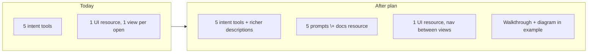
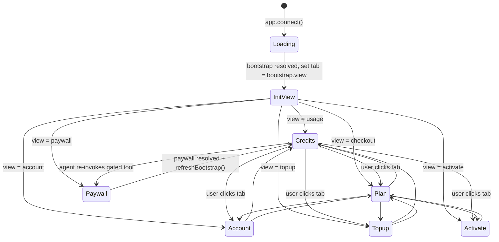
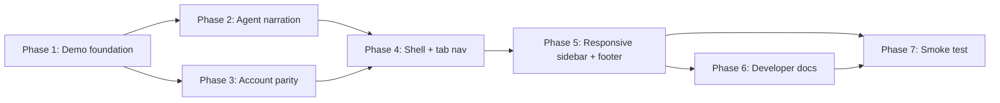

## How to think about MCP Apps

An MCP App is three surfaces that together tell one story:

1. **Tools** — the vocabulary agents see in `tools/list`. One name per user intent, not per UI plumbing step.
2. **UI resource** — a single shell app, not one bundle per view. The `BootstrapPayload.view` field selects the initial view; once mounted, navigation is an in-app concern.
3. **Prompts + docs resources** — the narration layer. Tells agents (via `prompts/list`) and users (via `resources/read`) what this server is for *before* they try a tool.

Today we have surface 1 (trim, 12 tools) and surface 2 (one `<McpApp>` shell), but surface 2 is locked to a single view and surface 3 doesn't exist. Filling those gaps is what "self-explanatory" means here.



## Recommendation on "a shell with all the functions"

Go with the **UI shell** (Layer A below). It's the highest leverage because:
- A *tool shell* (`describe_solvapay` / `help` tool) duplicates what `tools/list` and `prompts/list` already do natively. Spend that effort on better descriptions and registered prompts instead (Layer B).
- A *REPL/playground* page is useful for devs, but `basic-host` already serves that role; a README walkthrough (Layer C) closes the gap at a fraction of the cost.
- The UI shell is the only one of the three that changes what end users see, and it's the piece that makes the "MCP App = a full app, not a single screen" model tangible.

All three layers are independent. You can land any subset.

---

## Layer A — UI shell with in-iframe navigation (end users)

**Problem**: every intent tool opens the shell locked to one view. If the LLM opened `upgrade` but the user actually wants to check usage, the LLM has to call another tool and the iframe remounts.

**Fix**: wrap `McpViewRouter` in a persistent `<McpAppShell>` with a nav bar. `bootstrap.view` becomes the initial tab; the user can switch tabs without any tool call (cache already seeded in [`McpApp.tsx` lines 248–259](packages/react/src/mcp/McpApp.tsx)). On tab change we optionally call `refreshBootstrap()` if the entry is stale.

Files to touch:
- [`packages/react/src/mcp/McpApp.tsx`](packages/react/src/mcp/McpApp.tsx) — replace the `<header>` at lines 333–335 with `<McpAppShell>` (tab bar + body + footer), promote `view` to local state with `bootstrap.view` as initial.
- `packages/react/src/mcp/McpAppShell.tsx` (new) — renders a tab nav in the order `Credits` / `Plan` / `Top up` / `Account` / `Activate` (Credits first — matches the hosted manage-page label; most-consulted view and the entry point most users hit in a data-MCP flow), hides tabs that don't apply (e.g. `Top up` when no usage-based plan, `Credits` when no usage data). On wide iframes (`xl` breakpoint), `Account` collapses out of the tab row and into a right-hand sidebar carrying the Customer + Seller detail cards — direct port of the [`ManageShell.tsx`](src/components/customer/manage/ManageShell.tsx) responsive grid. Uses the seeded `merchant.logoUrl` / `merchant.displayName` for branding and renders the semibold "My account" heading below them.
- `packages/react/src/mcp/views/McpAccountView.tsx` — add Customer details card (name / email / customerRef mono / optional externalRef) and Seller details card (company, org number, address, contact email, website link, "Verified seller" trust badge) on the existing account view. Fields are all already on `BootstrapPayload.customer` / `BootstrapPayload.merchant`.
- `packages/react/src/mcp/styles.css` — nav styling using the existing `solvapay-mcp-*` class convention.
- Accessibility: `role="tablist"`, `aria-selected`, keyboard arrow-key nav.

Key constraint: do **not** break the paywall view — when `view === 'paywall'`, hide the nav (paywall is a modal-style interruption, not a destination). Same for `activate` when called with a `planRef` and the result is `activated` (auto-close-style).

No tool-surface changes. The 12-tool wire contract stays identical; agents still call `upgrade` for upgrades.

### Visual layout

Default layout — three stacked slots, header and footer persist across every view, body swaps on tab change:

```
┌──────────────────────────────────────────────────────────────┐
│ [logo] Acme Corp                                             │  header
│       merchant.displayName + merchant.logoUrl                │  (always shown)
├──────────────────────────────────────────────────────────────┤
│  Credits    Plan    Top up    Account    Activate            │  tab nav
│  ───────                                                     │  (underline = active)
├──────────────────────────────────────────────────────────────┤
│                                                              │
│                                                              │
│   <McpUsageView />                                           │  body
│   ┌────────────────────────────────┐                         │  (swaps on tab click,
│   │ 342 / 500 credits used         │                         │   no tool call)
│   │ Resets on 1 May                │                         │
│   │ [ Top up ]  [ Upgrade plan ]   │                         │
│   └────────────────────────────────┘                         │
│                                                              │
├──────────────────────────────────────────────────────────────┤
│  Support · Terms · Privacy               powered by SolvaPay │  footer
└──────────────────────────────────────────────────────────────┘
```

Paywall override — header kept, tabs and footer hidden because the user hasn't earned navigation yet. `McpPaywallView` renders **two CTAs** so the user can resolve the gate by either topping up (stay on pay-as-you-go) or switching to a recurring plan (no more metering). The upgrade CTA is derived from `bootstrap.plans` — first recurring/unlimited plan found — and omitted cleanly if no such plan exists:

```
┌──────────────────────────────────────────────────────────────┐
│ [logo] Acme Corp                                             │  header kept
├──────────────────────────────────────────────────────────────┤
│                                                              │
│   <McpPaywallView />                                         │  body only
│   ┌────────────────────────────────────────────┐             │  no tabs,
│   │ Out of credits                             │             │  no footer
│   │ You've used all 500 credits in this period.│             │
│   │ Top up to keep using search_knowledge.     │             │
│   │                                            │             │
│   │ [ Top up $10 ]                             │             │  ← stay on
│   │ [ Upgrade to Unlimited — $100/mo ]         │             │    pay-as-you-go
│   └────────────────────────────────────────────┘             │  ← switch plan
│                                                              │
└──────────────────────────────────────────────────────────────┘
```

### Slot-by-slot behaviour

- **Header** — `merchant.logoUrl` (falls back to an initials tile) with `merchant.displayName` below, then a semibold "My account" heading underneath — direct port of [`ManageShell.tsx` lines 84–108](src/components/customer/manage/ManageShell.tsx). Reads from the seeded provider snapshot; never fetches. Fixed height so the body doesn't jump when switching tabs.
- **Tab nav** — up to five tabs in a `role="tablist"` row, in the order `Credits / Plan / Top up / Account / Activate` (label "Credits" matches the hosted manage page; the underlying view kind stays `usage` in code). Credits sits first because it's the most-revisited view (answers "how much have I got left?") and the natural landing spot after a paywall resolution or a fresh topup — putting it first also makes the data-MCP story told by Layer D land on the right screen by default. On wide iframes (`xl` breakpoint and above), `Account` is hidden from the tab row and rendered as a sidebar instead, matching the hosted [`ManageShell.tsx` lines 74–141](src/components/customer/manage/ManageShell.tsx) responsive pattern. Current tab underlined + `aria-selected="true"`. Keyboard: `ArrowLeft`/`ArrowRight` move focus, `Enter`/`Space` activate, `Home`/`End` jump to ends. Tab order is stable; hidden tabs collapse without shifting siblings.
- **Body** — renders one of the existing view primitives (`McpCheckoutView`, `McpAccountView`, `McpTopupView`, `McpUsageView`, `McpActivateView`, `McpPaywallView`). Mounts/unmounts on tab switch so each view owns its own local state; the module-level cache (merchant / product / plans / payment-method) stays warm so unmount+remount doesn't re-fetch.
- **Footer** — `merchant.termsUrl` / `merchant.privacyUrl` rendered as `Terms · Privacy` links when present, plus `Provided by SolvaPay` as the attribution (match the hosted [`LegalFooter.tsx`](src/components/shared/LegalFooter.tsx) wording — not "Powered by"). `merchant.supportUrl` moves into the Account / sidebar `SellerDetailsCard` where it sits alongside the other seller contact fields instead of competing for footer space. Footer hidden entirely when the merchant has no terms/privacy (avoid an empty strip).

### Tab visibility rules

Tabs hide when they would render an empty or nonsensical view. Rules run off the seeded `BootstrapPayload`, evaluated in display order (`Credits / Plan / Top up / Account / Activate`):

- **Credits** — visible when `bootstrap.customer?.usage != null` **or** `bootstrap.customer?.balance != null` **or** the customer's active purchase is on an unlimited plan (`bootstrap.customer?.purchase?.plan?.kind === 'unlimited'`). Covers three cases in one rule: metered usage, prepaid balance, and the affirming "Unlimited — no limits on this plan" state for recurring-subscription customers. No credit data and no unlimited plan → no tab, so Plan slides into the leftmost position (non-usage products don't see a dead tab). The `McpUsageView` empty state for unlimited renders a simple confirmation card (plan name + billing cycle) with no meter or top-up link.
- **Plan** — always visible. Renders the upgrade view if the customer has no active purchase, otherwise the "you're on X" summary card that already exists in `McpCheckoutView` (with the active `PurchaseCard` inline — replaces the hosted `Purchases` tab for our light version). Acts as the guaranteed-present fallback when every other tab is hidden.
- **Top up** — visible when any plan in `bootstrap.plans` is usage-based, **or** the customer currently holds a usage-based purchase. No plans → no tab.
- **Account** — visible when `bootstrap.customer !== null` (authenticated) **and** the viewport is below the `xl` breakpoint. At `xl` and above, Account drops from the tab row and its content lives in the persistent right-hand sidebar instead (always visible across every tab, never hidden — matches the hosted screenshot). Hidden entirely on the unauthenticated checkout-probe mount.
- **Activate** — visible when there is at least one plan the customer could still activate (free plan they haven't taken, or usage-based plan with sufficient balance/grant). Otherwise hidden — the picker would be empty.

Overrides: integrators can pass `McpAppProps.shell = { tabs: 'auto' | 'all' | string[] }` to force-show all tabs (useful for demos) or pin a fixed tab list.

### State machine



Post-paywall lands on Credits by default (not Plan), because the most common resolution path is "top up → view refreshed balance" and Credits is where that number lives.

Tab change handler (pseudocode) lives in `McpAppShell.tsx`:

```typescript
function onTabChange(next: SolvaPayMcpViewKind) {
  if (next === activeTab) return
  setActiveTab(next)                            // pure UI state, no network
  if (shouldRefresh(next, lastRefreshedAt)) {   // >60s old OR cross-view mutation pending
    void refreshBootstrap()                     // re-seeds caches, no re-mount
  }
}
```

`shouldRefresh` is intentionally modest — a navigation isn't a user-invoked refresh. The heavy refresh path stays on the existing post-mutation triggers (`processPayment` success, `cancelRenewal`, etc.), which every layer already wires. This just guards against a user opening the iframe, tabbing around for minutes, and seeing stale numbers.

### Component contract

```typescript
// packages/react/src/mcp/McpAppShell.tsx (new)
export interface McpAppShellProps {
  bootstrap: McpBootstrap
  views?: McpAppViewOverrides
  classNames?: McpViewClassNames
  /** `'auto'` (default) runs the visibility rules; `'all'` pins all five; array pins the given list in that order. */
  tabs?: 'auto' | 'all' | SolvaPayMcpViewKind[]
  /** Render the footer? Defaults to `true` when the merchant has any of support/terms/privacy URLs. */
  footer?: boolean
}
export function McpAppShell(props: McpAppShellProps): JSX.Element
```

`McpApp` renders `<McpAppShell bootstrap={...} />` by default; consumers who want to own layout can still reach in via `<McpViewRouter>` (unchanged from today) and skip the shell entirely.

### Parity with the hosted manage page

The hosted `solvapay-frontend` `/manage` page ([`ManageShell.tsx`](src/components/customer/manage/ManageShell.tsx) + `Products / Browse / Purchases / Credits / Account` tabs) is the reference for how a full SolvaPay self-serve surface looks. The MCP shell is a deliberate *light version* of it — same mental model, narrower scope because the iframe is single-product, short-lived, and host-provisioned.

#### Tab mapping — hosted → MCP shell

- **`Products`** (list of the customer's active products across the SolvaPay provider) → **removed.** Switching products requires a new MCP server connection (new OAuth, new chat, new resource URI). The MCP shell is scoped to exactly one product for the whole session — exposing a product switcher would dead-end in a tab that can't actually switch anything.
- **`Browse`** (pick / change plan for the current product) → **`Plan`** tab. Single-product variant of [`BrowseTab.tsx`](src/components/customer/manage/BrowseTab.tsx) — no "Back to products" link, no `ProductBrowseModal`. Just the plan picker for the one product the MCP server owns.
- **`Purchases`** (purchase list + cancel/reactivate modal) → folded inline into the Plan tab. The active `PurchaseCard` render stays; the history list and [`CreditHistoryView`](src/components/customer/manage/CreditHistoryView.tsx) / [`TransactionsCard`](src/components/customer/manage/TransactionsCard.tsx) / [`CreditActivityCard`](src/components/customer/manage/CreditActivityCard.tsx) all **removed** per your call on topup/transaction history.
- **`Credits`** (balance + top-up entry + activity log) → **`Credits`** tab (rename from "Usage" in earlier plan drafts to match hosted naming — view kind stays `usage` in code). Keeps the balance card with inline "Top up" link from [`CustomerDetailsCard` lines 85–123](src/components/customer/manage/CustomerDetailsCard.tsx); drops the credit-activity history.
- **`Account`** (Customer details + Seller details, hidden on desktop because the sidebar covers it) → **`Account`** tab on narrow iframes, **persistent right-hand sidebar** on wide iframes (always visible across every tab — never hidden). The sidebar renders `SellerDetailsCard` on top with the "Verified seller" trust badge, `CustomerDetailsCard` (name / email / customer ref + credit balance + inline Top up link) below. Direct port of the responsive pattern in [`ManageShell.tsx` lines 74–141](src/components/customer/manage/ManageShell.tsx).

Refined tab strip (updating from the earlier draft): **`Credits / Plan / Top up / Account / Activate`**. Credits stays leftmost (your call on Usage first — just renamed). Top up stays as its own tab because the Layer D paywall flow needs a clean landing target.

#### What we had missed from the hosted page

The earlier Layer A draft under-specified these — porting them from the hosted page:

- **`<CustomerDetailsCard>` content.** Name, email, customer reference (mono font, useful for support tickets), optional external ID. Currently our `McpAccountView` only shows the subscription state. Port the label/value grid from [`CustomerDetailsCard.tsx` lines 37–83](src/components/customer/manage/CustomerDetailsCard.tsx).
- **`<SellerDetailsCard>` content.** Company name, organisation number, address, support email, website link, plus a "Verified seller" trust badge ([`SellerDetailsCard.tsx` lines 166–178](src/components/customer/hosted/SellerDetailsCard.tsx)). This is compliance-relevant — a user paying through the iframe should see who they're actually paying, at the same level of detail the hosted checkout shows. All fields are already on the `Merchant` type on `BootstrapPayload.merchant`; we just weren't rendering them.
- **Responsive sidebar pattern.** `templateColumns={{ base: '1fr', xl: '1fr 340px' }}` with Account tab hidden on xl and rendered as sidebar content instead. Iframes in hosts vary from ~400px (ChatGPT narrow) to ~1024px (Claude Desktop split view), so the same breakpoint works.
- **"My account" heading below the logo** ([`ManageShell.tsx` lines 84–108](src/components/customer/manage/ManageShell.tsx)). Small identity anchor — currently the Layer A header slot only had logo + merchant name. Adding the heading makes the iframe unambiguously "the user's thing" not "an ad-like promo card".
- **Footer attribution wording.** Hosted uses `Provided by SolvaPay` (not "powered by") via [`LegalFooter.tsx`](src/components/shared/LegalFooter.tsx). Align the MCP shell footer to match — it reads more neutral for end users who don't necessarily know what "powered by" means in this context.
- **Back-navigation affordance.** Hosted sub-flows (checkout, topup confirmation) show `← Back to my account` at the top ([`CheckoutPage` pattern in the screenshot]). The MCP shell needs the equivalent when the paywall or a deeply-nested sub-flow takes over the viewport and tabs are hidden — one `← Back` link that returns to the last tab state.
- **Empty-state card pattern.** Products tab shows "No active products — Browse available products" with a CTA. The Plan tab (when no active purchase) should mirror this wording: "No active plan — Pick a plan below" with the picker inline, rather than a loading-looking blank screen.

#### Explicitly out of scope (light-version omissions)

Stated so future readers don't infer these are bugs:

- Product switcher / multi-product list — intentionally single-product per MCP server.
- Full purchase history ([`PurchasesView`](src/components/customer/manage/PurchasesView.tsx)).
- Credit activity / top-up history ([`CreditActivityCard`](src/components/customer/manage/CreditActivityCard.tsx), [`CreditHistoryView`](src/components/customer/manage/CreditHistoryView.tsx), [`TransactionsCard`](src/components/customer/manage/TransactionsCard.tsx)).
- Cancel-renewal confirmation modal as a separate screen — keep it inline on the Plan tab as a button-and-toast.
- Product browse modal ([`ProductBrowseModal`](src/components/customer/manage/ProductBrowseModal.tsx)).
- Billing card with invoice list ([`BillingCard`](src/components/customer/manage/BillingCard.tsx)) — the `create_customer_session` portal handoff (already wired) covers every flow this page supports.

#### Updated visual — wide iframe with sidebar

```
┌──────────────────────────────────────────────────────────────────────┐
│ [logo]                                                                │
│                                                                        │
│ My account                                                             │
├──────────────────────────────────────────────────────────────────────┤
│  Credits    Plan    Top up    Activate                                 │  ← Account hidden
│  ───────                                                               │     (in sidebar)
├──────────────────────────────────────────┬───────────────────────────┤
│                                          │ SELLER DETAILS  ✓ Verified│
│  <McpUsageView />                        │ Parcel code               │
│  ┌────────────────────────────────┐      │ 000000000                 │
│  │ 342 / 500 credits used         │      │ 123 Sandbox St, Stockholm │
│  │ Resets on 1 May                │      │ EMAIL                     │
│  │ [ Top up ]  [ Upgrade plan ]   │      │ tommy@solvapay.com        │
│  └────────────────────────────────┘      │ WEBSITE                   │
│                                          │ parcel.code               │
│                                          │ ───────────────────────── │
│                                          │ YOUR DETAILS              │
│                                          │ Tommy Berglind            │
│                                          │ EMAIL                     │
│                                          │ tommy@solvapay.com        │
│                                          │ CUSTOMER REFERENCE        │
│                                          │ cus_MEPLNXUS              │
│                                          │ CREDIT BALANCE    Top up  │
│                                          │ 865,500 credits           │
│                                          │ ~802.48 kr                │
├──────────────────────────────────────────┴───────────────────────────┤
│              Terms · Privacy  ·  Provided by SolvaPay                 │
└──────────────────────────────────────────────────────────────────────┘
```

Sidebar layout matches the hosted screenshot exactly: `SellerDetailsCard` on top (trust context comes first — who you're paying), `CustomerDetailsCard` below with the credit balance and inline "Top up" link. The sidebar is **persistent** on wide iframes — always visible no matter which tab is active, so the user never loses context on who they are and who they're paying while moving between Credits / Plan / Top up / Activate.

Narrow iframe falls back to the single-column wireframe above the sidebar section, with `Account` re-appearing in the tab strip and the same two cards rendered stacked in the Account tab body.

## Layer B — Agent-facing discovery (LLM agents / hosts)

**Problem**: the only way an agent learns what this server does is the `description` string on each tool. There's no narration of the overall purpose, no example slash-commands, no "start here" resource.

**Fix**: three additions to the MCP surface, all additive.

### B1 — Register MCP prompts

Extend [`packages/mcp/src/descriptors.ts`](packages/mcp/src/descriptors.ts) with a `buildSolvaPayPrompts` helper that registers five prompts on the server (the same five intents):

```typescript
server.registerPrompt('upgrade', {
  title: 'Upgrade plan',
  description: 'Start or change a paid plan for the current customer.',
  argsSchema: { planRef: z.string().optional() },
}, async ({ planRef }) => ({
  messages: [{ role: 'user', content: { type: 'text', text: planRef ? `Activate plan ${planRef}` : 'Show me the upgrade options' } }],
}))
```

Hosts with slash-command support (Claude Desktop, Cursor) surface these as `/upgrade`, `/manage_account`, `/topup`, `/check_usage`, `/activate_plan`. On hosts without, they're a no-op — purely additive.

Wire `registerPrompts: true` into `createSolvaPayMcpServer`'s options (default `true`) so existing integrators pick it up automatically.

### B2 — Add a narrated docs resource

Register a static resource `docs://solvapay/overview.md` that agents can `resources/read` before calling any tool. Content: 200-word plain-English description of the server (who it's for, what the five intents do, dual-audience fallback behaviour, link to the real docs).

New files:
- `packages/mcp/src/resources/overview.md` (new)
- extension in [`packages/mcp/src/descriptors.ts`](packages/mcp/src/descriptors.ts) `registerSolvaPayResources` to register it alongside the existing `ui://` resource.

### B3 — Tighten tool descriptions

Each of the 5 intent tool descriptions in [`descriptors.ts`](packages/mcp/src/descriptors.ts) gets the same structure:

```
<one-sentence purpose for the user> On UI hosts this opens <view>; on text hosts returns <markdown summary>. Also available: <sibling intent tools>.
```

Example for `upgrade`:

```
Start or change a paid plan for the current customer. On UI hosts this opens the embedded checkout; on text hosts returns a checkout URL for the user to click. Also available: manage_account (view current plan), activate_plan (pick and activate), check_usage (credit balance).
```

The "Also available" clause gives an agent enough context from one tool's description to discover the whole surface — it never has to re-read `tools/list` to figure out the next step.

What we are **not** doing: adding a `describe_solvapay` / `help` meta tool. `tools/list` + `prompts/list` + the overview resource already cover this.

## Layer C — Developer narration (people reading the example)

**Problem**: `server.ts` is one line (`createSolvaPayMcpServer(...)`) and `mcp-app.tsx` is ~45 lines. Correct and clean, but a first-time reader has to crack open `@solvapay/mcp-sdk` and `@solvapay/react/mcp` to see the flow.

**Fix**: narrate the flow in the example without bloating the source.

### C1 — Architecture diagram in README

Add a mermaid sequence diagram to [`examples/mcp-checkout-app/README.md`](examples/mcp-checkout-app/README.md) showing the cold-start flow (host opens tool → bootstrap built server-side → UI resource served → React mounts → provider seeded → view renders), and a second diagram for the mutation path (user clicks Pay → `create_payment_intent` → Stripe confirm → `process_payment` → `refreshBootstrap`).

### C2 — WALKTHROUGH.md in the example

Add `examples/mcp-checkout-app/WALKTHROUGH.md` (~150 lines) that walks through the four example files in order — `config.ts` (env), `server.ts` (the single SDK call and what it hides), `mcp-app.tsx` (the client entrypoint), `probe.mjs` (CSP detection). Each section quotes the relevant SDK-internal code with a 1–2 sentence explanation of why.

### C3 — Tool cheat-sheet

Replace the current Tools tables in the README with a single `TOOLS.md` next to the example that lists all 12 tools grouped by audience, with a one-line purpose + a one-line "when to use it" for each. This is what an integrator looking at the SDK for the first time actually wants.

### C4 — Comparison with sibling examples

Add a short paragraph at the top of the README contrasting the three MCP examples:

- `mcp-checkout-app` — full UI, all five intents, embedded Stripe Elements
- `mcp-oauth-bridge` — paywall-only, no UI, virtual tools only
- `mcp-time-app` — virtual tools + minimal UI, showcases the gate response

So the reader picks the right starting point immediately.

## Layer D — Data MCP paywall demo (example-local, no SDK bleed)

**Problem**: the current `mcp-checkout-app` registers the 12-tool SolvaPay surface but nothing *uses* the paywall. There's no way to click through the full story (call a business tool → hit the gate → resolve via the iframe → retry) without hand-rolling a paywalled tool. And because paywalls make most sense for *data-returning* tools, showing that use-case concretely also answers "what is an MCP for?" for a first-time reader.

**Fix**: colocate two paywalled demo tools with the example via the existing `additionalTools({ registerPayable })` hook in [`createSolvaPayMcpServer`](packages/mcp-sdk/src/server.ts) (already supports this — no SDK change). Demo code lives entirely under `examples/mcp-checkout-app/src/` and imports the `payable.mcp()` helper as a normal public API consumer.

### D1 — Two paywalled data tools

Pattern mirrors [`examples/checkout-demo/app/components/UsageSimulator.tsx`](examples/checkout-demo/app/components/UsageSimulator.tsx) — credits decrement per call, exhaustion triggers a paywall — but expressed as MCP tools instead of HTTP routes + UI:

```typescript
// examples/mcp-checkout-app/src/demo-tools.ts
import { z } from 'zod'
import type { AdditionalToolsContext } from '@solvapay/mcp-sdk'

export function registerDemoTools({ registerPayable }: AdditionalToolsContext) {
  registerPayable('search_knowledge', {
    title: 'Search knowledge base (demo)',
    description:
      'Demo data tool — returns fake search snippets for a query. Wrapped with solvaPay.payable.mcp() so each call consumes 1 unit of usage; when the customer runs out, the tool returns a paywall bootstrap instead of results.',
    schema: { query: z.string().min(1) },
    handler: async ({ query }) => ({
      content: [{ type: 'text', text: `Top 3 snippets for "${query}":\n- stub-1\n- stub-2\n- stub-3` }],
      structuredContent: { query, results: ['stub-1', 'stub-2', 'stub-3'] },
    }),
  })

  registerPayable('get_market_quote', {
    title: 'Get market quote (demo)',
    description: 'Demo data tool — returns a deterministic fake quote for a symbol. Same paywall semantics as search_knowledge.',
    schema: { symbol: z.string().min(1).max(8) },
    handler: async ({ symbol }) => ({
      content: [{ type: 'text', text: `${symbol.toUpperCase()}: $123.45 (demo)` }],
      structuredContent: { symbol: symbol.toUpperCase(), price: 123.45, currency: 'USD' },
    }),
  })
}
```

Wired into [`examples/mcp-checkout-app/src/server.ts`](examples/mcp-checkout-app/src/server.ts) with one line:

```typescript
return createSolvaPayMcpServer({
  solvaPay, productRef, resourceUri, htmlPath, publicBaseUrl,
  csp: { connectDomains: [solvapayApiOrigin] },
  additionalTools: process.env.DEMO_TOOLS !== 'false' ? registerDemoTools : undefined,
  // ...
})
```

Two tools chosen to illustrate the breadth of "data MCP" use cases:

- `search_knowledge` — the classic RAG/vector-DB pattern. Most-cited use case for paywalled MCP today.
- `get_market_quote` — the classic data-feed pattern (finance, weather, sports). Shows that even tiny lookups can justify per-call metering.

Both return deterministic stub payloads so the demo is self-contained — no external dependencies, no keys, no rate limits. A developer can swap the handler for a real one in five lines.

### D2 — Demo-specific MCP prompts

Alongside the SDK prompts from Layer B1, register two example-local prompts in `demo-tools.ts` so hosts that support slash commands surface them as `/search_knowledge` and `/get_market_quote`. This lets a reviewer exercise the paywall with one keystroke.

### D3 — "Trying the paywall" recipe in the README

New section in [`examples/mcp-checkout-app/README.md`](examples/mcp-checkout-app/README.md) with the end-to-end flow:

1. Configure a usage-based plan on your product (SolvaPay admin).
2. Start the example and connect from `basic-host`.
3. Activate the usage-based plan via `/activate_plan` (cost: free or small topup).
4. Call `/search_knowledge query: "anything"` N times; each call decrements your credit balance by 1 unit.
5. When credits hit zero, the next call returns a paywall gate. The host opens the UI iframe on `view: 'paywall'` showing the reason + a top-up CTA.
6. Top up in the iframe. `refreshBootstrap()` fires. Close the iframe.
7. Retry `/search_knowledge` — now succeeds.

Include a sequence diagram showing the gate → iframe → topup → retry loop.

### D4 — Env flag to disable demo tools

Gate behind `DEMO_TOOLS` env (default on). The example's `env.example` documents it:

```
# Register the two demo paywalled data tools (search_knowledge, get_market_quote).
# Leave unset in dev to test the paywall; set to "false" when you copy this
# example into your own repo as a starting template.
DEMO_TOOLS=true
```

This is the **one place** where demo vs integration split is encoded. Integrators copying the example set `DEMO_TOOLS=false` in their own env and their copy of the example becomes a clean template.

### Why this stays out of the SDK

The strict rule: **no `@solvapay/*` package knows `search_knowledge` or `get_market_quote` exists**. Everything in `demo-tools.ts` consumes the public API (`registerPayable` from the callback context, `z` from `zod`) just as a third-party integrator would. The SDK's paywall code path is unchanged — the demo simply exercises what's already there. If we ever want a "try paywalled tools in 30 seconds" experience in the SDK itself, that's a **separate** decision (probably a `@solvapay/mcp-sdk/demo` subpath export), not a side-effect of this plan.

### File layout after Layer D

```
examples/mcp-checkout-app/
├── src/
│   ├── config.ts          (unchanged)
│   ├── demo-tools.ts      (NEW — two paywalled data tools + prompts)
│   ├── index.ts           (unchanged)
│   ├── mcp-app.tsx        (unchanged)
│   └── server.ts          (+1 line wiring additionalTools)
├── env.example            (+ DEMO_TOOLS doc)
└── README.md              (+ "Trying the paywall" section, + diagram)
```

## Out of scope

- Adding theme-aware branding (logo/colors) to the UI shell — tracked as part of hosted MCP Pay alignment in [`trim-mcp-tool-surface_1f745de8.plan.md`](.cursor/plans/trim-mcp-tool-surface_1f745de8.plan.md) Bucket 2.
- Plan-switching (`change_plan`) and inline card-update (`create_setup_intent`) — separate plan.
- Per-host quirk list (Claude vs ChatGPT vs basic-host) — belongs in `docs/sdks/typescript/guides/mcp-app.mdx`, not the example README.

## Phasing

**Do not ship this as one PR.** Four layers have four different blast radii (`@solvapay/mcp` descriptors, `@solvapay/react` shell, example source, example docs) and mixing them in one commit makes review and rollback painful. Phased into six sequential PRs, each independently revertable and each leaving `main` in a shippable state:

### Phase 1 — Demo foundation (Layer D) · ~0.5 day · example-only

One PR to `solvapay-sdk`. Adds `examples/mcp-checkout-app/src/demo-tools.ts` with the two paywalled data tools, the two demo prompts, `DEMO_TOOLS` env flag, and the "Trying the paywall" recipe in the README. **Zero SDK changes.** After this phase you can exercise the paywall end-to-end from `basic-host`, which is the test vehicle every subsequent phase needs.

Todos: `layer-d-demo-tools`, `layer-d-demo-prompts`, `layer-d-readme-paywall`, `layer-d-env-toggle`.

### Phase 2 — Agent narration (Layer B) · ~1 day · `@solvapay/mcp`

One PR. SDK prompts + docs resource + tighter intent-tool descriptions. Purely additive on the MCP wire — existing hosts see five new prompts, a new resource URI, and slightly longer tool descriptions. Phase 1's demo prompts + paywalled tools are the natural exercise target.

Todos: `layer-b-prompts`, `layer-b-docs-resource`, `layer-b-descriptions`.

### Phase 3 — Account parity (Layer A1) · ~1 day · `@solvapay/react`

One PR. Just enrich `McpAccountView` with the Customer details + Seller details cards (name / email / customer ref / verified-seller badge / company / address / email / website). **No layout changes yet** — the current single-view router still renders, it just shows the richer account view when `view === 'account'`. Also pins `McpCheckoutView` for an active unlimited purchase (smoke-test gap 3 — should already render but needs a unit test). Low risk because it's pure additive rendering over fields already on `BootstrapPayload`.

Todos: `layer-a-account-view`, `gap-plan-unlimited-render`.

### Phase 4 — Shell + tab nav (Layer A2) · ~1.5 days · `@solvapay/react`

One PR. The big one. Wrap `McpViewRouter` in `<McpAppShell>` with the persistent tab strip (`Credits / Plan / Top up / Account / Activate`), promote `view` to local state, implement the visibility rules + a11y keyboard nav + the state-machine transitions + `refreshBootstrap()` on stale tab change. Also folds in the two smoke-test gaps: the two-CTA paywall (`Top up` + `Upgrade to <plan>`) and the unlimited-plan Credits rule. Ship with the full test suite (tab switch without tool call, paywall nav hidden, post-mutation refresh, initial view = bootstrap.view, paywall renders both CTAs when a recurring plan exists, Credits tab visible on unlimited plans).

Riskiest change in the whole plan because every MCP App integrator picks up the new shell on the next `@solvapay/react` bump. Sits on its own PR so it can be reverted cleanly if a host surfaces a layout regression.

Todos: `layer-a-shell`, `layer-a-refresh`, `gap-paywall-two-ctas`, `gap-credits-unlimited`.

### Phase 5 — Responsive sidebar + footer (Layer A3) · ~1 day · `@solvapay/react`

One PR. Add the `xl` two-column grid: Account drops from the tab strip at `xl+`, SellerDetailsCard + CustomerDetailsCard render in a persistent right-hand sidebar across every tab. Align footer to `Terms · Privacy · Provided by SolvaPay`; move `merchant.supportUrl` into the SellerDetailsCard. Narrow-viewport behaviour unchanged from Phase 4. Splitting this from Phase 4 isolates the layout-grid risk (iframes as small as ~400px in ChatGPT are the failure mode to watch for).

Todos: `layer-a-sidebar`, `layer-a-footer`.

### Phase 6 — Developer narration (Layer C) · ~1 day · docs-only

One PR. README diagrams + `WALKTHROUGH.md` + `TOOLS.md` + the "Choosing the right example" section. Zero code changes.

Todos: `layer-c-readme-diagrams`, `layer-c-walkthrough`, `layer-c-tools-md`, `layer-c-example-compare`.

### Phase 7 — Smoke test · ~0.5 day · example-only

See the [Phase 7 — End-to-end smoke test](#phase-7--end-to-end-smoke-test--05-day--docs--manual-run) section below for the full walkthrough. Lands last so it verifies everything ships together. One PR adding `SMOKE_TEST.md` + `scripts/seed-smoke-product.ts` + a walkthrough run log.

Todos: `smoke-admin-setup`, `smoke-walkthrough`, `smoke-automation`.

### Dependency graph



Phases 2 and 3 can run in parallel (different packages, no shared files). Phases 4–6 are strictly serial because each builds on the previous shell version. Phase 7 lands after the shell is complete because the smoke-test walkthrough requires the responsive sidebar (step 9) and the refreshed docs (step references map back to phase contributions).

### Critical path

The "paywall demo with full tabbed shell" milestone needs Phases 1 → 2 → 3 → 4 (~4 days serial, ~3.5 with parallel work on Phase 2/3). Phases 5 and 6 are polish on top — Phase 5 improves wide-viewport UX but narrow-viewport users are already on the tabbed shell after Phase 4, and Phase 6 is strictly additive docs. Phase 7 adds a final ~0.5 day to produce `SMOKE_TEST.md` and run the 9-step walkthrough end to end.

### When one PR would be acceptable

Only if we treated Phase 4 + 5 as a single "ship the full shell" PR — their code paths are tightly coupled and both touch `McpApp.tsx` / `McpAppShell.tsx`. A combined PR would be ~2.5 days of work reviewed as one unit. **Recommend against** because the responsive-sidebar layout is the highest-risk piece of the whole plan (iframe widths vary wildly by host, and bad CSS on a narrow iframe silently breaks every integrator's checkout). Landing it separately gives us one `main` commit where the shell works without sidebar before the sidebar goes in — so a regression can bisect cleanly.

### Rough timeline

Sequential execution with one person: ~6 days of coding + ~0.5 day for Phase 7 + ~2 days of PR review/iteration = **~8.5 working days end-to-end**. Parallel Phase 2/3: shaves ~1 day. With usual interruptions, plan for ~2 calendar weeks.

### Phase 7 — End-to-end smoke test · ~0.5 day · docs + manual run

Lands after Phases 1–6. Purpose: one reproducible scenario that exercises every layer, shows usage-based and unlimited pricing side-by-side, and catches regressions the unit tests can't (cross-view state transitions, post-mutation refresh, plan-switch mid-session).

Deliverable: `examples/mcp-checkout-app/SMOKE_TEST.md` (new file) with the admin setup + the 9-step walkthrough below + expected behaviour per step mapped back to the phase that introduced it.

#### Product setup (SolvaPay admin, one-time)

A single product with **two plans** exercised by the same customer in one session:

- **Starter — Pay as you go** · usage-based · no monthly fee · e.g. $0.01 per query (1 credit per unit) · customer must top up before first use.
- **Unlimited — Monthly** · recurring · $100 / month · no usage metering · cancellable.

The two-plan shape is deliberate — it's the minimum configuration that demonstrates both metered and unlimited behaviour in a single iframe. Commit the admin setup as a seed script (`examples/mcp-checkout-app/scripts/seed-smoke-product.ts` against the SolvaPay admin API) so it's reproducible across reviewers' local envs.

#### Customer journey — 9 steps

Each step pins a specific behaviour that earlier phases introduced. Layer/phase references in parentheses.

1. **Cold start.** User opens the MCP app in `basic-host`. No purchase yet. *(Phases 2, 3, 4)*
   - Credits tab hidden (no usage/balance). Plan tab shows the empty state `No active plan — Pick one below`. Sidebar shows Seller details + Your details (no credit balance row yet).

2. **Activate the starter plan.** Customer picks "Starter — Pay as you go", clicks Activate. *(existing `activate_plan` smart handler)*
   - `activate_plan` returns `{ status: 'topup_required', topupUrl }` because the usage-based plan activates with zero balance. Shell routes to the Top up tab.

3. **Top up $10.** Stripe Elements inside the iframe, `create_topup_payment_intent` → confirm → `process_payment`. *(Phase 4 refresh)*
   - Balance updates to 1000 credits. Credits tab appears. Credit balance row in sidebar populates.

4. **First paywalled call.** Customer invokes `/search_knowledge query: "hi"` via the host slash command. *(Phase 1 tool + Phase 2 prompt)*
   - Stub snippets returned. Credits decrement to 999 (visible next time Credits tab is opened or sidebar refreshes).

5. **Drain credits.** Customer hammers `/search_knowledge` until balance reaches 0 (or admin sets balance to 0 for speed).
   - Credits tab shows `0 credits remaining`. Last successful call completed normally.

6. **Paywall fires.** Next `/search_knowledge` invocation returns the gate. *(Phase 1 gate response, Phase 4 paywall render)*
   - Host opens the iframe on `view: 'paywall'`. `McpPaywallView` shows **two CTAs**:
     - `[ Top up $10 ]` — stay on the usage-based plan.
     - `[ Upgrade to Unlimited — $100/mo ]` — switch plan.

7. **Upgrade to Unlimited.** Customer clicks the upgrade CTA. Embedded checkout mounts. *(existing checkout flow, Phase 4 refresh)*
   - `create_payment_intent` → Stripe Elements → `process_payment` → `refreshBootstrap()`. Subscription activates. Shell routes to the Plan tab showing `Current plan: Unlimited — $100/mo`.

8. **Verify unlimited.** Customer invokes `/search_knowledge` again. *(Phase 1 tool + plan state)*
   - Tool returns snippets without gating. Credits tab now shows `Unlimited — no limits on this plan` (no meter, no top-up link).

9. **Sidebar stability check.** Customer tabs through Credits / Plan / Top up / Activate on a wide iframe. *(Phase 5)*
   - SellerDetailsCard + CustomerDetailsCard stay mounted across every tab. Credit balance row in sidebar either hides or reads `Unlimited`.

#### What this surfaces that unit tests don't

- Step 2–3: `activate_plan` → `topup_required` → topup → bootstrap refresh produces the right cache seed without a full remount.
- Step 5–6: paywall gate response shape reaches the iframe cleanly (the one genuinely cross-package flow).
- Step 7: plan switch mid-session (usage-based → unlimited) correctly swaps the visible tabs and the sidebar content.
- Step 8: unlimited-plan customers bypass the gate cleanly (the inverse of step 6 — one call going through, not hitting a paywall, on the same tool).
- Step 9: the responsive sidebar is truly persistent and doesn't re-layout on tab switches.

#### Optional automation

A `pnpm --filter @example/mcp-checkout-app smoke` script can drive `basic-host` through the walkthrough via the host's CLI or a scripted MCP client, and assert per-step outcomes. Defer until the manual walkthrough has been run a few times and identifies steps that regress repeatably — script-first tends to freeze behaviour prematurely.

### Gaps surfaced while writing the smoke test

Writing the walkthrough revealed three places where the earlier layers were under-specified for the two-plan scenario. Each is captured as a `gap-*` todo and must land inside the phase referenced.

**Gap 1 — Paywall view needs two CTAs (Phase 4).** Current `McpPaywallView` supports a single "Top up" CTA. Smoke-test step 6 requires a second `Upgrade to <planName> — <price>` CTA for customers who prefer a recurring plan. The paywall bootstrap already carries `bootstrap.plans`, so the view can derive the upgrade CTA from the first recurring (non-usage-based) plan it finds, or hide the upgrade CTA if no recurring plan exists. Wire during Phase 4 alongside `layer-a-shell`.

**Gap 2 — Credits tab on unlimited plans (Phase 4).** Today's visibility rule hides the Credits tab when `usage` and `balance` are both null, which is correct for non-usage products — but for a *customer on an unlimited plan who has no usage to report*, the tab should stay visible with the affirmation `Unlimited — no limits on this plan` rather than silently disappear. Refine the rule to: `visible when customer.usage != null || customer.balance != null || customer.purchase?.plan?.kind === 'unlimited'`. Matching empty state added to `McpUsageView`.

**Gap 3 — Plan tab render for an active unlimited purchase (Phase 3).** Confirm `McpCheckoutView` renders `Current plan: Unlimited — $100/mo` cleanly when `customer.purchase.plan.kind === 'unlimited'`, with no usage meter and a "Change plan" link that opens the plan picker. Should already work via the existing active-purchase render path, but pin it with a unit test during Phase 3.

These gaps are the reason Phase 7 lands **after** Phase 5 — it needs the full shell + sidebar in place to verify steps 7–9.
