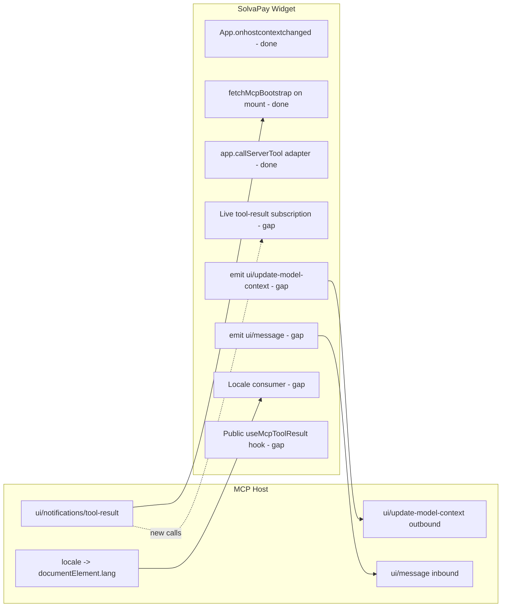

## Context

Assessment source: OpenAI Apps SDK "Build your ChatGPT UI" (treated as the MCP Apps bridge spec since ChatGPT implements the open standard), filtered to non-ChatGPT-specific guidance.

We already consume `@modelcontextprotocol/ext-apps@^1.5.0`, so the transport (JSON-RPC over `postMessage`, `tools/call`, notification plumbing) and `ui/update-model-context` inbound are handled. The items below are the remaining gaps.

### Current state snapshot (as of this revision)

- **Intent-tool surface is now the 4-tool rename target**: `upgrade`, `manage_account`, `topup`, `activate_plan` (`TOOL_FOR_VIEW` in [`packages/mcp/src/descriptors.ts`](packages/mcp/src/descriptors.ts)). The legacy `open_*` tool names and the `check_usage` / `open_paywall` / `open_about` tools are gone; paywall rides on bootstrap, usage folds into account. Any leftover `open_*` narration in doc-comments is tracked separately by the `mcp-legacy-cleanup` plan.
- **`registerPayableTool` requires `ctx.respond(...)`** as the only handler shape (commit `d05d7ea`) — paywall nudges and UI stamping still flow through that envelope, so Phase 1 emits do not touch the tool handler signature.
- **No phase in this plan has landed yet.** All five todos are still pending. `McpApp.tsx` only calls `fetchMcpBootstrap(app)` once in the mount effect, and no file under `packages/react/src/mcp/` references `updateModelContext`, `useHostLocale`, `useMcpToolResult`, or `ui/message`.
- **`formatPrice`** in [`packages/react/src/utils/format.ts`](packages/react/src/utils/format.ts) already accepts an optional BCP-47 `locale` and uses `Intl.NumberFormat` under the hood — Phase 2 can stay narrow (build the hook and thread `locale` through, rather than rewriting formatters).
- **Dependency:** `McpAppShell.resolveSurface` ([`packages/react/src/mcp/McpAppShell.tsx`](packages/react/src/mcp/McpAppShell.tsx) L83–L102) still carries the legacy `about | activate | usage` fallbacks. Phase 3's "derive view from new `structuredContent`" logic should land on top of the tightened `McpViewKind | undefined` shape from the `mcp-legacy-cleanup` plan — coordinate ordering so we don't revive legacy cases while adding the subscription.

## Bridge feature coverage (current vs. target)

## Phase 1 - Outbound `ui/update-model-context` at widget milestones

Goal: the model should learn about meaningful in-widget state changes without waiting for a tool call.

- Add a thin helper in `packages/react/src/mcp/` (e.g. `update-model-context.ts`) that wraps the `App` method exposed by `@modelcontextprotocol/ext-apps@^1.5.0`. Verify the exact method name against the installed package's types before wiring (likely `app.updateModelContext(...)` or a `request` helper); keep a feature-detect fallback so older hosts don't throw.
- Thread it through the existing `<SolvaPayProvider>` context so views can call it without touching `app` directly. Keep the surface to a single `notifyModelContext({ text })` or structured-content call.
- Emit at these transitions (files in `packages/react/src/mcp/views/`):
  - `McpCheckoutView` / plan picker: plan selected but not yet paid ("User selected <planName>").
  - `McpAccountView`: cancel-renewal confirmed, reactivate confirmed.
  - `McpTopupView`: topup amount confirmed.
  - `McpCheckoutView` / `McpPaywallView`: successful payment / activation (post-`processPayment`).
- Do NOT emit on every keystroke/selection churn - debounce to committed actions only. The spec explicitly warns against noisy updates.
- Add unit coverage: render each view, simulate the action, assert the helper was called with the expected payload. Pattern exists in [`packages/react/src/mcp/views/__tests__/McpCheckoutView.test.tsx`](packages/react/src/mcp/views/__tests__/McpCheckoutView.test.tsx).

## Phase 2 - Widget locale handling

Goal: honour the host's locale mirror for money, dates, and renewal terms. Spec: host writes into `document.documentElement.lang`.

- Add a `useHostLocale()` hook in `packages/react/src/mcp/` that reads `document.documentElement.lang` on mount and subscribes to the same `MutationObserver` pattern other SDKs use (locale can change mid-session when the user switches ChatGPT language). Default to `navigator.language`, then `'en-US'`.
- Thread the resolved locale through existing formatters rather than rewriting them:
  - `formatPrice` in [`packages/react/src/utils/format.ts`](packages/react/src/utils/format.ts) already accepts an optional `locale`; pass it from each view.
  - For dates (renewal dates, usage resets) add an analogous `formatDate(date, locale, opts)` helper using `Intl.DateTimeFormat(locale, { dateStyle: 'medium' })` and use it in the views that currently hand-roll date strings.
- Audit targets (grep for existing hardcoded formatting or `formatPrice(` calls missing `locale`): `McpCheckoutView.tsx`, `McpAccountView.tsx`, `McpTopupView.tsx`, `McpPaywallView.tsx`, `McpNudgeView.tsx`, plus the shared `detail-cards.tsx` and any helpers in `packages/react/src/mcp/views/`.
- Out of scope: full i18n of copy strings. This phase is numeric/temporal localisation only. String translations can be a follow-up; the hook + `Intl.*` foundation is what unblocks it.

## Phase 3 - Live `ui/notifications/tool-result` subscription

Goal: if a host re-invokes a tool against an already-mounted widget (no iframe remount), pick up the new `structuredContent` instead of showing stale bootstrap data.

- Today, [`packages/react/src/mcp/McpApp.tsx`](packages/react/src/mcp/McpApp.tsx) runs `fetchMcpBootstrap(app)` once in the mount effect (lines ~186–198) and re-runs it only on the `refreshBootstrap` path (mount-time sweep in `McpAppShell` and any consumer-initiated calls).
- Add a subscription to `@modelcontextprotocol/ext-apps`' tool-result notification stream inside the same effect. The `App` class in v1.5 exposes this via an `on('toolResult', ...)`-style API or an `ontoolresult` setter — confirm the exact name against the installed types before wiring.
- When a result arrives for one of our intent tools (`TOOL_FOR_VIEW` values: `upgrade`, `manage_account`, `topup`, `activate_plan`), derive the new `view` and `BootstrapPayload` from its `structuredContent`, call `bootstrapToInitial`, `seedMcpCaches`, and `setBootstrap(...)` in one atomic update. Reuse the existing `refreshBootstrap` logic — extract it so both paths share one implementation.
- Ignore results for transport tools (`create_payment_intent`, `process_payment`, etc.) — those are already awaited via the adapter's promise, and re-applying them to `bootstrap` would double-apply state.
- Guard against double-apply when the same notification also resolves an in-flight `callServerTool` promise (most hosts send both); a request-id check is the simplest dedupe.
- Sequencing note: land this **after** `mcp-legacy-cleanup` §2 tightens `resolveSurface` to `McpViewKind | undefined`, otherwise the new code path has to keep catering to the legacy `about | activate | usage` strings.
- Test: mock an `App` that emits a second `toolResult` notification with a different `view` after mount, assert the shell re-routes.

## Phase 4 - Public `useMcpToolResult` escape hatch

Goal: integrators who bypass `<McpApp>` / `<McpAppShell>` to build custom widgets need a thin hook matching what the spec's readers expect.

- New file `packages/react/src/mcp/hooks/useMcpToolResult.ts` exporting `useMcpToolResult<T>(app): { structuredContent: T | null, content: ToolContent[], toolName: string | null }`.
- Implementation: subscribes via the same mechanism Phase 3 uses; returns the latest tool result. Use `useSyncExternalStore` for correctness under concurrent rendering.
- Re-export from [`packages/react/src/mcp/index.ts`](packages/react/src/mcp/index.ts).
- Add a short section to [`packages/react/docs/mcp-app-architecture.md`](packages/react/docs/mcp-app-architecture.md) showing the "I want raw `structuredContent`, not the full SolvaPay shell" use case.
- Test: mirror of Phase 3's test, but asserting the hook's returned value updates instead of the shell's routed view.

## Phase 5 - Optional: `ui/message` for chat continuity

Goal: post a user-visible follow-up into the chat after a successful widget action so the model can continue the conversation.

- Spec-canonical usage: widget posts `{ jsonrpc: '2.0', method: 'ui/message', params: { role: 'user', content: [{type: 'text', text: '...'}] } }` via `window.parent.postMessage`, or uses the ext-apps `App` wrapper if it exposes one (prefer the wrapper).
- Candidate trigger points:
  - Post-topup success: `"Topped up $<amount>. Ready to keep working."`
  - Post-plan-activation: `"Activated <planName>."`
  - Post-paywall success: defer to product - depends on whether the user expects the chat to continue or pause.
- Make the message copy merchant-overridable via a new `<McpApp>` prop (e.g. `messageOnSuccess?: (evt: SuccessEvent) => string | null` returning `null` to suppress). Default off for the paywall view, default on for topup/account.
- Guard with a feature-detect so hosts that don't support `ui/message` don't see unhandled `postMessage` frames.
- Follow-up UX review with product before enabling by default - this changes the chat transcript and can feel chatty in some flows.

## Deferred / not in this plan - intent-tool data/render split

The spec recommends splitting data tools (return only `structuredContent`) from render tools (receive final data, return a widget template). Our `upgrade` / `manage_account` / `topup` / `activate_plan` intent tools in [`packages/mcp/src/descriptors.ts`](packages/mcp/src/descriptors.ts) are currently fused: they return both `structuredContent` (full `BootstrapPayload` via `buildBootstrapPayload`) and `_meta.ui.resourceUri` on the tool result.

Why we're not splitting yet:

- The `BootstrapPayload` is small and tightly coupled to one view; splitting would force every intent into two hops for minimal payoff today.
- The `mode: 'ui' | 'text' | 'auto'` input on every intent tool ([`descriptors.ts`](packages/mcp/src/descriptors.ts), `inputSchema: { mode: z.enum(['ui','text','auto']).optional() }`) already gives agents a text-only escape.
- Our narrator (`packages/mcp/src/narrate.ts`) produces a readable summary alongside the UI envelope, so model reasoning over the data is already possible.
- `registerPayableTool` already deliberately avoids stamping `_meta.ui.resourceUri` on paywalled data-tool descriptors (see the docstring at the top of [`packages/mcp-sdk/src/registerPayableTool.ts`](packages/mcp-sdk/src/registerPayableTool.ts) — "The MCP App iframe opens only when there's something to show"), so routine data tools don't trigger iframe opens — the same underlying concern the split addresses.

Revisit trigger: when we want the model to reason over account state before deciding whether to render (e.g. "user has unused credits, don't nudge topup"). At that point, propose a dedicated plan covering `get_account_snapshot` / `render_account_view`, host-compatibility, and migration of the existing intent-tool surface.

## Validation / acceptance

- Host-context theming unaffected by any phase (regression check the existing `onhostcontextchanged` path).
- New outbound frames (`ui/update-model-context`, `ui/message`) feature-detected, so non-compliant hosts silently no-op.
- `packages/react/src/mcp/__tests__` suite and `packages/mcp/src/narrate.spec.ts` continue to pass. New unit coverage per phase as noted above.
- Smoke test in [`examples/mcp-checkout-app`](examples/mcp-checkout-app) against both the embedded MCP host and ChatGPT (or MCPJam) to confirm notifications land correctly.

## Suggested ordering

1. Phase 2 (locale) - smallest blast radius, user-visible win, no bridge semantics risk.
2. Phase 3 (live tool-result subscription) - unblocks re-invoke UX and is a prerequisite for Phase 4. Land after `mcp-legacy-cleanup` §2 tightens `resolveSurface`.
3. Phase 4 (`useMcpToolResult` hook) - trivial once Phase 3 lands.
4. Phase 1 (outbound model-context) - needs product sign-off on which transitions emit.
5. Phase 5 (`ui/message`) - last, needs UX review and is optional by design.
