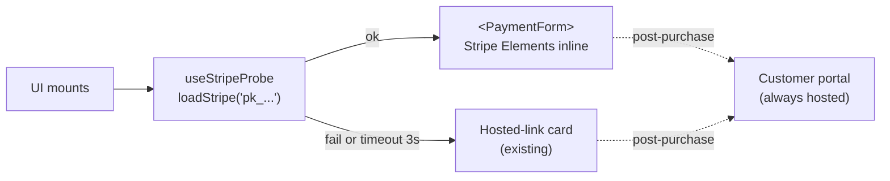

## Context

The [hosted-button pivot plan](.cursor/plans/mcp-checkout-app_hosted-button-pivot_b3d9c1a2.plan.md) concluded Stripe Elements "cannot render" inside an MCP host iframe. Reviewing the MCP Apps spec (extension id `io.modelcontextprotocol/ui`, dated version `specification/2026-01-26/apps.mdx`, co-developed by Anthropic and OpenAI and released January 2026 as the first official MCP extension) and the `@modelcontextprotocol/ext-apps@1.5.0` server helper, that conclusion was based on an incomplete test: the original PoC never declared `_meta.ui.csp` on its resource, so the host fell back to the default deny-all CSP which of course blocks `js.stripe.com`.

The spec is normative: it defines four domain lists — `connectDomains` (→ `connect-src`), `resourceDomains` (→ `img-src`/`script-src`/`style-src`/`font-src`/`media-src`), `frameDomains` (→ `frame-src`), `baseUriDomains` (→ `base-uri`) — and hosts **MUST** honor them when building the sandbox iframe CSP. Defaults are deny-all. This is the path forward (it's the merger point MCP-UI, OpenAI Apps SDK, and Anthropic's early work converged on), not a proposal that might die.

**Host compliance reality (as of this plan):**

- **basic-host** (Anthropic reference): honors the full CSP declaration — embedded path should work.
- **ChatGPT**: reports indicate it respects `frameDomains` — embedded path should work.
- **Claude.ai**: open bug [anthropics/claude-ai-mcp#40](https://github.com/anthropics/claude-ai-mcp/issues/40) (Feb 2026, triaged as `mcp-apps/bug`) — the sandbox hardcodes `frame-src 'self' blob: data:` and **ignores declared `frameDomains`** entirely. `connectDomains` and `resourceDomains` are merged correctly; only `frameDomains` is broken. Stripe Elements renders card inputs as nested iframes from `js.stripe.com` (PCI requirement, can't be worked around), so the embedded path will fail on Claude.ai today **even with a correct CSP declaration**. Same server works on ChatGPT and MCP-Jam.

We pivot back to embedded-by-default with a runtime probe as graceful degradation. The probe is the mitigation for "host MAY honor, but in practice MAY NOT" — we build for the compliant case and fall back cleanly when hosts don't ship the spec fully. Claude's embedded path unlocks automatically when #40 ships; no code change needed on our side.

There is also a separate, less urgent gap unrelated to the probe: Apple Pay / Google Pay require `Permissions-Policy: payment=*` on the app iframe, and the current spec's `_meta.ui.permissions` block only covers `camera` / `microphone` / `geolocation` / `clipboardWrite`. Card-only Elements works; wallet payments need an upstream spec addition (tracked as a non-goal below).

## Flow



## Key changes

### 1. Declare CSP on the resource

In [`examples/mcp-checkout-app/src/server.ts`](examples/mcp-checkout-app/src/server.ts), extend the `registerAppResource` content item with `_meta.ui.csp`:

```ts
_meta: {
  ui: {
    csp: {
      resourceDomains: [
        'https://js.stripe.com',
        'https://*.stripe.com',
        'https://b.stripecdn.com', // Stripe sometimes serves assets from this CDN
      ],
      connectDomains: [
        'https://api.stripe.com',
        'https://m.stripe.com',
        'https://r.stripe.com',
        'https://q.stripe.com',
        'https://errors.stripe.com', // error telemetry (low priority but cheap to include)
        solvaPayApiOrigin, // from config, e.g. https://api.solvapay.com
      ],
      frameDomains: [
        'https://js.stripe.com',
        'https://hooks.stripe.com', // 3DS challenge flows
      ],
    },
    prefersBorder: true,
  },
},
```

`frameDomains` is the critical one — Stripe Elements renders card inputs as nested iframes from `js.stripe.com` for PCI reasons. Declare the full list; don't trim optimistically. We build for the compliant case and rely on the probe (§4) for hosts that ignore parts of the declaration (Claude today, per #40).

Optionally add `domain` using the Claude stable-origin helper (see the SDK's `registerAppResource_withDomain` example) so the SolvaPay backend can pin a CORS allowlist entry if needed.

### 2. Restore the embedded tool surface

Re-add these MCP tools in `server.ts` — the core helpers still exist:

- `create_payment_intent` → `createPaymentIntentCore` from [`packages/server/src/helpers/payment.ts`](packages/server/src/helpers/payment.ts)
- `process_payment_intent` → `processPaymentIntentCore`
- `list_plans` → `listPlansCore` from [`packages/server/src/helpers/plans.ts`](packages/server/src/helpers/plans.ts)
- `get_product` → `getProductCore` from [`packages/server/src/helpers/product.ts`](packages/server/src/helpers/product.ts)

Keep the existing `open_checkout`, `sync_customer`, `check_purchase`, `create_checkout_session`, `create_customer_session` tools — the fallback path and the customer portal still need them.

### 3. Expand the MCP adapter

In [`examples/mcp-checkout-app/src/mcp-adapter.ts`](examples/mcp-checkout-app/src/mcp-adapter.ts), add the three wrappers needed by `<SolvaPayProvider>` for embedded mode (matches the original PoC plan §Architecture):

```ts
createPayment(args): Promise<{ clientSecret, publishableKey, ... }>
processPayment(args): Promise<{ status, purchase, ... }>
fetch(input, init): routes GET /api/list-plans|get-product|get-merchant → tools
```

Current `checkPurchase`, `createCheckoutSession`, `createCustomerSession` stay untouched.

**Sequencing with `SolvaPayTransport`**: [`react-mcp-app-adapter_e5a04f19.plan.md`](.cursor/plans/react-mcp-app-adapter_e5a04f19.plan.md) has an open `pick-shape` decision between per-method overrides on `SolvaPayProviderProps` (today's shape) and a single unified `transport: SolvaPayTransport` prop. This plan targets the current per-method shape. If the adapter plan lands the unified transport first, restructure Step 3 so the adapter exports a single `SolvaPayTransport` impl instead of individual `createPayment` / `processPayment` / `fetch` overrides — functionally equivalent, different API surface. Track the dependency; don't block on it.

### 4. Runtime Stripe probe + hybrid UI in `mcp-app.tsx`

Add a `useStripeProbe` hook (based on the one deleted in the pivot) that returns `'loading' | 'ready' | 'blocked'`:

```ts
const STRIPE_PROBE_TIMEOUT_MS = 3_000
// attempt loadStripe(publishableKey); race against 3s timeout;
// 'ready' if mount succeeds, 'blocked' if it rejects / times out
```

Top-level structure becomes:

```tsx
function CheckoutApp({ productRef, publishableKey }) {
  const probe = useStripeProbe(publishableKey)
  if (probe === 'loading') return <LoadingCard />
  if (probe === 'ready') return <EmbeddedCheckout productRef={productRef} />
  return <HostedCheckout productRef={productRef} /> // the current code
}
```

`EmbeddedCheckout` renders `<SolvaPayProvider>` with the full adapter (`checkPurchase`, `createPayment`, `processPayment`, `fetch`) and composes `<PaymentForm>` from [`packages/react/src/primitives/PaymentForm.tsx`](packages/react/src/primitives/PaymentForm.tsx) with `stripe.confirmPayment({ redirect: 'if_required' })`. After `hasPaidPurchase` flips true it shows a **Manage purchase** button that opens the customer portal in a new tab (portal is always hosted — no embedded equivalent exists).

`HostedCheckout` is the existing `CheckoutBody` renamed, unchanged.

### 5. Publishable key delivery

Embedded mode needs the Stripe publishable key in the browser. Add it to the `open_checkout` tool response:

```ts
toolResult({ productRef, stripePublishableKey: process.env.SOLVAPAY_STRIPE_PUBLISHABLE_KEY })
```

Document the new env var in `.env.example` and README.

### 6. Verification (hybrid approach)

The probe means we get a safe default: if anything goes wrong on a given host, users still see the hosted-button card. So verification is about confirming the happy path works where the spec is implemented, not gating release on hosts that haven't caught up.

**Expected outcomes by host:**

| Host | Embedded path | Notes |
|---|---|---|
| basic-host | ✅ works | Anthropic's reference implementation — proves the CSP declaration is correct |
| ChatGPT | ✅ works (reported) | Respects `frameDomains`; third data point for portability |
| Claude.ai | ⏳ falls back to hosted | Blocked by [anthropics/claude-ai-mcp#40](https://github.com/anthropics/claude-ai-mcp/issues/40); unlocks automatically when fix ships |

**basic-host** (primary — verifies CSP is correct):

1. `pnpm --filter @example/mcp-checkout-app build && pnpm --filter @example/mcp-checkout-app serve`
2. Open from basic-host at `localhost:8080`
3. Probe resolves `'ready'`, `<PaymentElement>` mounts, card input renders with the Stripe iframe nested inside
4. Enter `4242 4242 4242 4242`, submit — `create_payment_intent` → Stripe confirms → `process_payment_intent` → `check_purchase` shows active purchase
5. Card flips to "Manage purchase" button that opens the customer portal in a new tab

**ChatGPT** (secondary — proves portability):

1. Deploy the MCP server where ChatGPT can reach it; install as a connector
2. Open the app and confirm the embedded path resolves `'ready'` and the happy path completes
3. If it works: our CSP declaration is portable across compliant hosts and the fallback only fires on broken ones
4. If it doesn't: capture the served CSP header via DevTools and diagnose before shipping

**Claude.ai** (tertiary — exercises the fallback):

1. Deploy the MCP server somewhere Claude can reach
2. Install as a Claude connector, open the app
3. Confirm the app iframe renders under `{hash}.claudemcpcontent.com`
4. Expected result: probe reports `'blocked'` (Stripe's nested iframe is refused by the hardcoded `frame-src 'self' blob: data:`), hosted-button fallback renders, hosted flow completes as today
5. Capture the actual `Content-Security-Policy` header served on the app iframe via DevTools → Network, and post it as a comment on [anthropics/claude-ai-mcp#40](https://github.com/anthropics/claude-ai-mcp/issues/40) with the Stripe-specific context. Do **not** file a new issue — #40 is already triaged as `mcp-apps/bug`; more real-world cases on the existing thread help it move faster.
6. Fallback UX should be identical to today; embedded path unlocks automatically once #40 ships — no code change on our side.

### 7. Docs

Rewrite [`examples/mcp-checkout-app/README.md`](examples/mcp-checkout-app/README.md):

- Remove the "Stripe Elements cannot render" claim
- Describe the hybrid flow: embedded-first, hosted-button fallback via runtime probe
- Document the declared CSP domains and why each is needed
- Per-host expectations table (basic-host ✅, ChatGPT ✅, Claude ⏳ pending [#40](https://github.com/anthropics/claude-ai-mcp/issues/40))
- Note the known limitation: Apple Pay / Google Pay require `Permissions-Policy: payment=*` on the app iframe, and the current spec's `permissions` block only covers camera / microphone / geolocation / clipboardWrite. Card-only Elements works; wallet payments need an upstream spec addition.
- Note the OpenAI directory consideration: iframes/frames are explicitly discouraged by OpenAI reviewers for apps submitted to the ChatGPT directory ("subject to higher scrutiny at review time and likely to be rejected"). This doesn't block the embedded path technically, but if SolvaPay ever wants to be in ChatGPT's curated directory, the hosted-button fallback doubles as a submission-path hedge — not just a Claude workaround.

Supersede the hosted-button pivot plan with a short "Superseded by…" note at the top linking to this plan; keep it in-tree for historical context.

## Non-goals

- Apple Pay / Google Pay in the embedded flow — blocked by spec gap, track separately
- Full tool-surface parity (topup, activate_plan, cancel/reactivate, track_usage, get_merchant) — still roadmap from the original PoC plan
- Extracting `createMcpAppAdapter` into `@solvapay/react` — tracked separately in [`react-mcp-app-adapter_e5a04f19.plan.md`](.cursor/plans/react-mcp-app-adapter_e5a04f19.plan.md)

## Future extensions (after SDK Phase 2 lands)

This plan deliberately keeps post-purchase management hosted — the "Manage purchase" button opens the SolvaPay customer portal in a new tab. [`sdk_plan_management_phase2_6e40d833.plan.md`](.cursor/plans/sdk_plan_management_phase2_6e40d833.plan.md) introduces embeddable post-purchase primitives (`<CurrentPlanCard>`, `<PlanSwitcher>`, `<PaymentMethodForm>`, `<UpdatePaymentMethodButton>`) plus the backend endpoints and `@solvapay/server` core helpers they ride on (`changePlanCore`, `createSetupIntentCore`, `getPaymentMethodCore`).

Once Phase 2 ships, this example can replace the hosted-portal redirect with fully embedded management:

1. Register three more MCP tools in `server.ts`: `change_plan`, `create_setup_intent`, `get_payment_method` — each a thin wrapper around the new core helpers, identical to how this plan wraps the existing ones.
2. Extend the MCP adapter (or the `SolvaPayTransport` impl, depending on which shape the adapter plan lands) with matching methods.
3. In `EmbeddedCheckout`, render `<CurrentPlanCard>` on `hasPaidPurchase` instead of the "Manage purchase" button. The card's `<ChangePlanButton>` and `<UpdatePaymentMethodButton>` slots use `<PlanSwitcher>` and `<PaymentMethodForm>` internally — both rely on Stripe Elements via SetupIntent/PaymentIntent, so the same CSP declaration this plan adds already covers them.
4. Keep `create_customer_session` and the hosted-portal fallback for `HostedCheckout` — that path has no embedded alternative because the probe failed.

Track as a follow-up plan once Phase 2 is merged; don't extend this one retroactively.
