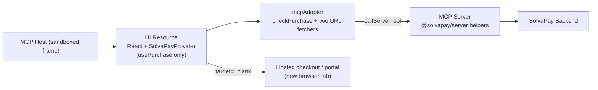

## Why pivot

The original PoC ([mcp-checkout-app_poc_55ffe77e.plan.md](solvapay-sdk/.cursor/plans/mcp-checkout-app_poc_55ffe77e.plan.md)) called out Stripe-in-nested-iframe as the main risk and named hosted checkout as the fallback. The PoC has now confirmed the risk: the MCP host sandbox blocks `js.stripe.com` (script load + nested payment iframe), so embedded Elements cannot render.

The fallback is already in production in two adjacent examples:

- [`examples/mcp-time-app`](solvapay-sdk/examples/mcp-time-app/src/mcp-app.ts) — when the `get-current-time` virtual tool returns `payment_required`, the UI populates `<a id="paywall-link" target="_blank">` with the `checkoutUrl` and shows an "Upgrade" button. The user clicks a real anchor (not a scripted `window.open`), which the sandbox permits.
- [`examples/hosted-checkout-demo`](solvapay-sdk/examples/hosted-checkout-demo/app/page.tsx) — defines the welcome / upgrade / manage card UX we want to mirror: one button for new purchases, another for managing an existing purchase, plus a cancelled-notice state.

We adopt both patterns: hosted-checkout-demo's card UX + mcp-time-app's pre-populated `<a target="_blank">` trigger.

## Architecture after the pivot



No Stripe dependencies in the browser bundle. Every payment UI lives on `solvapay.com` in a top-level tab.

## Server changes (`src/server.ts`)

Tool surface after the pivot:

| Tool                      | Purpose                                                                           |
| ------------------------- | --------------------------------------------------------------------------------- |
| `open_checkout`           | Returns `{ productRef }` so the UI knows which product to charge for — unchanged  |
| `sync_customer`           | Ensures a SolvaPay customer exists for the authenticated MCP user — unchanged     |
| `check_purchase`          | Fetches the active purchase — unchanged                                           |
| `create_checkout_session` | **New** — wraps `createCheckoutSessionCore`, returns `{ sessionId, checkoutUrl }` |
| `create_customer_session` | **New** — wraps `createCustomerSessionCore`, returns `{ sessionId, customerUrl }` |

Remove: `create_payment_intent`, `process_payment_intent`, `list_plans`, `get_product`. None of those are used once plan selection moves to the hosted page.

Both new tools already exist as core helpers in [packages/server/src/helpers/checkout.ts](solvapay-sdk/packages/server/src/helpers/checkout.ts). Wire them through the existing `buildRequest` + `traceTool` helpers, forwarding `customer_ref` via `x-user-id` exactly like the other tools. `create_checkout_session` input schema: `{ planRef?: string, productRef?: string, returnUrl?: string }` (all optional; default `productRef` from config). `create_customer_session` input schema: `{}`.

`returnUrl`: hosted checkout uses this as the "back to site" link inside the hosted page. There is no meaningful URL for an MCP iframe — leave it unset so the SolvaPay backend falls back to its default. Document this choice in the tool description.

## Adapter changes (`src/mcp-adapter.ts`)

Before: `{ createPayment, checkPurchase, processPayment, fetch }`.

After: `{ checkPurchase, createCheckoutSession, createCustomerSession }`.

Drop the `config.fetch` override entirely — nothing in the new UI calls the list-plans / get-product endpoints. Keep the `callTool` + `unwrap` helpers (they are the only reason this file exists). Export two thin wrappers:

```ts
createCheckoutSession(args: { planRef?: string; productRef?: string }): Promise<{ checkoutUrl: string }>
createCustomerSession(): Promise<{ customerUrl: string }>
```

## UI changes (`src/mcp-app.tsx`)

Gut the Stripe/`CheckoutLayout` path. Final shape:

1. `<SolvaPayProvider>` receives only `checkPurchase` (so `usePurchase` / `usePurchaseStatus` work) and `config.fetch` defaults — no adapter fetch shim.
2. `Bootstrap` calls `open_checkout` once to get `productRef`, then renders `<CheckoutApp productRef={productRef} />`.
3. `CheckoutApp` mirrors [`hosted-checkout-demo/app/page.tsx`](solvapay-sdk/examples/hosted-checkout-demo/app/page.tsx):
   - `usePurchase` → `activePurchase`, `hasPaidPurchase`, `refetch`
   - `usePurchaseStatus` → `shouldShowCancelledNotice`, `cancelledPurchase`, `formatDate`, `getDaysUntilExpiration`
   - Three card states: active purchase (show "Manage purchase"), cancelled (show "Purchase again"), default (show "Upgrade")
4. URLs are **pre-fetched** before the buttons become active, matching the `mcp-time-app` pattern. On mount:
   - Always call `createCheckoutSession({ productRef })` → populate `upgradeHref`
   - If `hasPaidPurchase`, call `createCustomerSession()` → populate `manageHref`
   - Render each button as `<a href={upgradeHref} target="_blank" rel="noopener noreferrer">` wrapping the visible `<button>` (the time-app's proven anchor-click pattern — the sandbox blocks scripted `window.open` after an async tool round-trip, but a direct anchor click is allowed)
   - While the URL is still loading, render the `<button>` disabled with "Loading…"
5. Refocus handling: on `window` `focus` and `visibilitychange` (visible), call `refetch()` so the card flips to the active-purchase state once the user completes payment on the hosted page and switches back to the MCP host tab.
6. Error states: if a session-tool call fails, fall back to a disabled button + inline error message. Do not attempt `window.open` fallbacks (they are blocked inside the sandbox).

Delete the `useStripeProbe` hook and `StripeDebugBanner` — their job was to surface whether Stripe could load; with the pivot that question is moot.

## Package + bundle changes

`package.json`:

- Remove `@stripe/react-stripe-js`, `@stripe/stripe-js`
- Everything else stays (we still ship a React single-file bundle via Vite)

`src/mcp-app.css`: drop `.checkout-*` rules that belonged to the embedded flow (`CheckoutLayout` container padding, Stripe error banner). Keep the card / main layout rules and extend with hosted-checkout-demo-style classes for the three card states.

## Docs

Rewrite `examples/mcp-checkout-app/README.md`:

- Replace the "embeds Stripe Elements" claim with "launches the SolvaPay hosted checkout in a new tab"
- Update the flow section to the five steps: load UI → call `open_checkout` → pre-fetch `create_checkout_session` + (optional) `create_customer_session` → user clicks anchor → refocus triggers `check_purchase`
- Explicitly document why Stripe Elements was dropped (CSP + sandbox), so a future reader does not re-attempt the embedded path without new evidence
- Link back to this plan

Mark [mcp-checkout-app_poc_55ffe77e.plan.md](solvapay-sdk/.cursor/plans/mcp-checkout-app_poc_55ffe77e.plan.md) as superseded with a pointer to this plan's ID. Do not delete it — the risks + roadmap sections remain useful context for whoever eventually lands full parity (topup, cancel/reactivate, track_usage UIs).

## Verification

1. `pnpm --filter @example/mcp-checkout-app build`
2. `pnpm --filter @example/mcp-checkout-app dev`
3. From `basic-host`, open the app — card renders with "Upgrade" button enabled within ~1s of the UI mounting
4. Click Upgrade → hosted checkout opens in a new top-level tab
5. Complete payment with a Stripe test card on the hosted page, close the tab, return to `basic-host`
6. Focus event fires → `check_purchase` returns the new purchase → card swaps to "Manage purchase" state
7. Click Manage → customer portal opens in a new tab; cancelling there + refocus flips to the cancelled-notice state

## Non-goals for this pivot

- Keeping any form of embedded payment UI (deferred indefinitely; revisit only if MCP hosts relax their CSP + sandbox flags)
- Shipping the topup / track-usage / cancel-renewal tools (still in the roadmap section of the original PoC plan)
- Extracting a reusable `createMcpAppAdapter` into `@solvapay/react` (also still roadmap)
