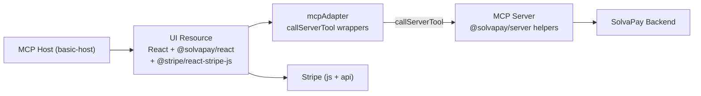

> **Superseded** by [mcp-checkout-app_hosted-button-pivot_b3d9c1a2.plan.md](solvapay-sdk/.cursor/plans/mcp-checkout-app_hosted-button-pivot_b3d9c1a2.plan.md). The embedded-Stripe-Elements risk called out below was confirmed in practice (host CSP + sandbox blocks `js.stripe.com`), and the example pivoted to a hosted-checkout-launch button. The risks + roadmap sections are preserved because they remain useful context for future parity work (topup, cancel/reactivate, track_usage).

## Goal

Validate end-to-end that a SolvaPay checkout works entirely from an MCP App UI resource talking to MCP tools on the MCP server (which holds `SOLVAPAY_SECRET_KEY`). Key unknown to de-risk: **Stripe Elements rendering and confirming inside an MCP host iframe.**

## Minimal dependencies

Auth comes from `createMcpOAuthBridge` (already used by [mcp-time-app/src/index.ts](solvapay-sdk/examples/mcp-time-app/src/index.ts)), which delivers `customer_ref` via `extra.authInfo.extra.customer_ref`. No separate identity provider, no auth adapter on the client.

Runtime deps:

- `@modelcontextprotocol/ext-apps`, `@modelcontextprotocol/sdk`
- `@solvapay/core`, `@solvapay/server`, `@solvapay/react`
- `@stripe/stripe-js`, `@stripe/react-stripe-js` (script loaded from `js.stripe.com`, not bundled)
- `express`, `zod`, `react`, `react-dom`

`<SolvaPayProvider>` is rendered without `config.auth` — the `mcpAdapter` overrides replace every HTTP call with a `callServerTool`, so the client never needs a user token.

## Architecture

## PoC scope (narrow slice)

Example at `examples/mcp-checkout-app/`, cloned from [examples/mcp-time-app](solvapay-sdk/examples/mcp-time-app). Ship **only** these tools:

- `sync_customer` → `syncCustomerCore`
- `check_purchase` → `checkPurchaseCore`
- `list_plans` → `listPlansCore`
- `get_product` → `getProductCore`
- `create_payment_intent` → `createPaymentIntentCore`
- `process_payment_intent` → `processPaymentIntentCore`

Each handler adapts MCP `args` + `extra.authInfo` into a synthetic `Request` (setting `x-user-id` from `extra.authInfo.extra.customer_ref`) and delegates to the core helper. Mirror the virtual-tools wiring already in [examples/mcp-time-app/src/server.ts](solvapay-sdk/examples/mcp-time-app/src/server.ts).

UI (React single-file bundle via `vite-plugin-singlefile`):

- `<SolvaPayProvider>` with a custom `mcpAdapter` passed to the existing override props:
  - `checkPurchase`, `createPayment`, `processPayment` implemented as thin `app.callServerTool(...)` wrappers that unwrap `structuredContent`
  - `fetch` override that routes `GET /api/list-plans|get-product` to the corresponding tools (so `<CheckoutLayout>` keeps working unchanged)
- `<CheckoutLayout>` from `@solvapay/react` (same component used by [checkout-demo/app/checkout/page.tsx](solvapay-sdk/examples/checkout-demo/app/checkout/page.tsx))
- Stripe loaded via CDN from inside the bundle (`loadStripe(publishableKey)` with `clientSecret` returned by `create_payment_intent`)

Auth: `createMcpOAuthBridge` on the MCP server produces `customer_ref`, which each tool handler forwards into a synthetic `Request` for the core helpers.

## PoC success criteria

- `basic-host` at `http://localhost:8080` renders the checkout iframe
- Plan selector populates (proves `list_plans` + `get_product` tools work)
- Stripe `<PaymentElement>` mounts and accepts a test card (proves nested iframe + CSP is viable — **the main unknown**)
- `create_payment_intent` → Stripe confirmation → `process_payment_intent` completes
- `check_purchase` shows the active purchase on reload
- Fallback: if Stripe Elements is blocked by the host, verify the `upgrade` virtual tool's hosted checkout URL works as the escape hatch, and document the finding

## Risks to close during PoC

- **Stripe in nested iframe** — spike this first; if it fails, pivot the example to hosted-checkout-only (via `createCheckoutSession`) and surface that as a known limitation
- **Single-file bundling of Stripe.js** — Stripe.js MUST be loaded from `https://js.stripe.com/v3` at runtime (Stripe forbids bundling). Confirm CSP permits the script tag
- **Return URL for `stripe.confirmPayment`** — no real URL in an iframe app; use `redirect: 'if_required'` and handle the PaymentIntent result in place
- **`@solvapay/react` bundling** — confirm it bundles cleanly via Vite single-file (time app only uses vanilla JS today)

## Plan file references

- New: `examples/mcp-checkout-app/` (package.json, vite.config.ts, src/server.ts, src/index.ts, src/config.ts, src/mcp-app.tsx, src/mcp-adapter.ts, mcp-app.html, .env.example, README.md)
- Reuse: [packages/server/src/helpers/*](solvapay-sdk/packages/server/src/helpers), [packages/react/src/SolvaPayProvider.tsx](solvapay-sdk/packages/react/src/SolvaPayProvider.tsx), `createMcpOAuthBridge`
- Reference: [examples/mcp-time-app/src/server.ts](solvapay-sdk/examples/mcp-time-app/src/server.ts), [examples/checkout-demo/app/checkout/page.tsx](solvapay-sdk/examples/checkout-demo/app/checkout/page.tsx)

## After the PoC — general roadmap

Ordered by value once Stripe-in-iframe is confirmed.

### 1. Tool surface parity

Add the remaining tools to the example so every route in [checkout-demo/app/api](solvapay-sdk/examples/checkout-demo/app/api) has an MCP equivalent: `create_topup_payment_intent`, `customer_balance`, `activate_plan`, `cancel_renewal`, `reactivate_renewal`, `track_usage`, `get_merchant`.

### 2. Reusable React adapter

Extract the ad-hoc `mcpAdapter` into `@solvapay/react/mcp` (or a new `@solvapay/mcp-app` package) exporting `createMcpAppAdapter(app)` that returns the full set of `SolvaPayProvider` overrides. Goal: a consumer can write `<SolvaPayProvider {...createMcpAppAdapter(app)}>` and reuse every existing hook/component.

May need to extend `SolvaPayProviderProps` with overrides for hooks that currently only go via `fetch` (`useBalance`, `useProduct`, `useMerchant`, cancel/reactivate/activate). Either broaden the override surface or introduce a single `transport` prop.

### 3. Tool-surface helper in `@solvapay/server`

Ship a `registerCheckoutToolsMcp(server, options)` helper that registers the full tool set the same way `registerVirtualToolsMcp` does today ([virtual-tools.ts](solvapay-sdk/packages/server/src/virtual-tools.ts)). Removes boilerplate for every MCP integrator that wants checkout + account UIs.

### 4. Topup + account management UI

Add a second resource URI (e.g. `ui://mcp-checkout-app/account.html`) that renders balance, topup form, and cancel/reactivate controls using existing React components (`<BalanceBadge>`, `<TopupForm>`, `<CancelPlanButton>`). Wire via a new tool like `open_account` with `_meta.ui.resourceUri` pointing to the account bundle.

### 5. Docs

- New page in [docs](docs) under MCP Server section: "Embed checkout + account in your MCP App"
- Update [examples/mcp-time-app/README.md](solvapay-sdk/examples/mcp-time-app/README.md) to cross-link the new example
- Document the Stripe-in-iframe outcome and the hosted-checkout fallback

### 6. E2E test (stretch)

Extend `examples/mcp-oauth-bridge`'s test harness or add a Playwright spec that drives `basic-host` through a test-card purchase, preventing regressions in the tool-surface/adapter contract.