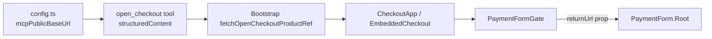

## Root cause

Inside an MCP App iframe, `window.location.href` is something like `ui://mcp-checkout-app/mcp-app.html`. The SDK's `PaymentForm.Root` falls back to that value when the caller omits `returnUrl`:

```169:173:solvapay-sdk/packages/react/src/primitives/PaymentForm.tsx
  const finalReturnUrl =
    returnUrl || (typeof window !== 'undefined' ? window.location.href : '/')
```

which is then passed straight into Stripe:

```70:72:solvapay-sdk/packages/react/src/utils/confirmPayment.ts
        confirmParams: {
          return_url: returnUrl,
```

Stripe validates `return_url` as http/https regardless of whether a redirect actually happens (card flow uses `redirect: 'if_required'`, but the validator still runs). `ui://…` fails → "Not a valid URL" bubbles up above the Subscribe button.

## Fix

Pass an explicit, valid `returnUrl` to `PaymentForm.Root` from the MCP example app. The MCP example server already has `mcpPublicBaseUrl` (`http://localhost:3006` in dev, the deployed origin in prod) — return it from `open_checkout` so the client can thread it through.



## Changes

### 1. [`examples/mcp-checkout-app/src/server.ts`](solvapay-sdk/examples/mcp-checkout-app/src/server.ts)

Add `returnUrl: mcpPublicBaseUrl` to the `open_checkout` structured result (currently returns `{ productRef, stripePublishableKey }` at lines ~260-263). Also import `mcpPublicBaseUrl` from `./config`.

### 2. [`examples/mcp-checkout-app/src/mcp-adapter.ts`](solvapay-sdk/examples/mcp-checkout-app/src/mcp-adapter.ts)

Extend the `fetchOpenCheckoutProductRef` return type and implementation to surface `returnUrl: string`:

```ts
export async function fetchOpenCheckoutProductRef(app: App): Promise<{
  productRef: string
  stripePublishableKey: string | null
  returnUrl: string
}>
```

Fall back to `window.location.origin` if the server omits it (backward compat while the committed server change rolls out), not to `window.location.href` which is the broken `ui://` value.

### 3. [`examples/mcp-checkout-app/src/mcp-app.tsx`](solvapay-sdk/examples/mcp-checkout-app/src/mcp-app.tsx)

- Add `returnUrl` to the `Bootstrap` state alongside `productRef` / `publishableKey`.
- Thread it down: `Bootstrap` -> `CheckoutApp` -> `EmbeddedCheckout` -> `PaymentFormGate` -> `<PaymentForm.Root returnUrl={returnUrl} …>`.
- `HostedCheckout` is unaffected (it doesn't call `confirmPayment`).

### Why not fix in the SDK?

The default fallback `window.location.href` is correct for normal browser apps. Adding MCP-specific logic (sniffing `ui://` and substituting) to `PaymentForm.Root` would couple the SDK to a host-specific detail. The MCP example is the right layer to know its own serving origin.

## Out of scope

- No changes to `confirmPayment.ts` or `PaymentForm.tsx`.
- No SDK type changes.
- No backend changes.
- Hosted checkout path unchanged.