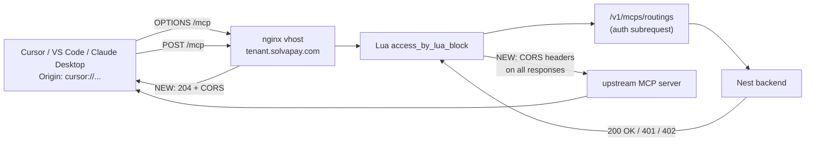

## Scope

Edge-only change in [solvapay-infrastructure/nginx/config/conf.d/mcp-locations.inc](../../../solvapay-infrastructure/nginx/config/conf.d/mcp-locations.inc). No backend code changes: `McpDiscoveryService` is already self-consistent, and the real auth endpoints are already reached via the catch-all `location /`.

## Root cause

The current `/mcp` block at `mcp-locations.inc:203-463` parses the request body first, then checks the MCP method, then calls the `/v1/mcps/routings` auth subrequest, then proxies. For an Electron client like Cursor, the browser runtime sends an `OPTIONS` preflight with `Origin: cursor://...` before the real `POST`. Because the block:

- has no `if ($request_method = OPTIONS)` short-circuit,
- reads the body and tries to `cjson.decode` it (empty on OPTIONS),
- bails with `ngx.status = 400; ngx.say("Missing method in request body")`,
- adds no `Access-Control-Allow-*` headers,

the preflight fails CORS in the client's browser runtime, the real `POST` never fires, and Cursor logs `Transient error connecting to streamableHttp server`. Same symptom we just diagnosed on the Lovable/Supabase function.

Additionally, when the auth subrequest to `/v1/mcps/routings` returns `401` with `WWW-Authenticate` (RFC 9728), nginx relays that status + header but adds no CORS headers. Native-scheme clients can't read the `WWW-Authenticate` value through CORS without `Access-Control-Allow-Origin` + `Access-Control-Expose-Headers: WWW-Authenticate`, so even if preflight were passing, OAuth discovery still wouldn't kick in.

## Changes

### 1. Short-circuit `OPTIONS` at the top of the `/mcp` Lua block

In [mcp-locations.inc](../../../solvapay-infrastructure/nginx/config/conf.d/mcp-locations.inc), at the start of `location = /mcp { access_by_lua_block { ... } }` (line 215-ish), before `ngx.req.read_body()`, insert:

```nginx
if ($request_method = OPTIONS) {
    add_header 'Access-Control-Allow-Origin' $http_origin always;
    add_header 'Vary' 'Origin' always;
    add_header 'Access-Control-Allow-Methods' 'GET, POST, OPTIONS' always;
    add_header 'Access-Control-Allow-Headers'
        'Authorization, Content-Type, MCP-Protocol-Version, Mcp-Session-Id, Accept' always;
    add_header 'Access-Control-Expose-Headers' 'WWW-Authenticate, Mcp-Session-Id' always;
    add_header 'Access-Control-Max-Age' 600 always;
    add_header 'Content-Length' 0;
    return 204;
}
```

Mirroring `$http_origin` (not `*`) because Electron custom-scheme origins need an exact echo, same reasoning as in [oauth-bridge.ts](../../solvapay-sdk/packages/server/src/mcp/oauth-bridge.ts). Rely on backend CORS middleware ([cors.config.ts](../../solvapay-backend/src/shared/config/cors.config.ts)) to reject non-allowlisted origins when the matching real request hits Nest — but to be defensive at the edge, the `if` block could also add a regex check via `$http_origin ~* "^(https://.*\.solvapay\.com|cursor|vscode(-webview)?|claude)://"` and return 403 otherwise. Decision: skip the regex at edge; the backend's `ALLOWED_ORIGINS` already gates it and we don't want to duplicate the list in two places.

### 2. Add CORS response headers to every `/mcp` response

At the top of the `location = /mcp { ... }` block, alongside the existing `proxy_*` directives:

```nginx
add_header 'Access-Control-Allow-Origin' $http_origin always;
add_header 'Vary' 'Origin' always;
add_header 'Access-Control-Expose-Headers' 'WWW-Authenticate, Mcp-Session-Id' always;
```

The `always` keyword is critical so headers also land on non-2xx responses (401 from the auth subrequest, 402 from paywall denial, 400 from malformed body). Without `always`, nginx strips `add_header` from error responses and the 401 `WWW-Authenticate` stays unreadable through CORS.

### 3. Remove the misleading comment at line 204

The current comment `"CORS headers are not needed here because production MCP clients connect server-to-server"` is the reason this bug exists. Replace with a one-liner: `"CORS headers required: Electron-based MCP clients (Cursor, VS Code, Claude Desktop) trigger preflights via their native-scheme origin."`

### 4. Align the two other `.well-known` blocks (cleanup)

`oauth-protected-resource` (lines 15-84) already has an `OPTIONS` short-circuit returning 204. `oauth-authorization-server` (lines 146-201) and `openid-configuration` (lines 86-144) do not — they run a full backend GET on OPTIONS and return 200 with the JSON body. Functionally works because they emit `Access-Control-Allow-Origin: *` on the 200, but it's an unnecessary backend round-trip.

Add the same OPTIONS short-circuit block to both, mirroring the one already in `oauth-protected-resource`:

```nginx
if ($request_method = OPTIONS) {
    add_header 'Access-Control-Allow-Origin' '*' always;
    add_header 'Access-Control-Allow-Methods' 'GET, OPTIONS' always;
    add_header 'Access-Control-Allow-Headers' 'Authorization, Content-Type, MCP-Protocol-Version' always;
    add_header 'Access-Control-Max-Age' 600 always;
    add_header 'Content-Length' 0;
    return 204;
}
```

Keeps wildcard `*` because that block already does so for `oauth-protected-resource` and these are purely public discovery docs.

## Verification

Against a deployed dev tenant (e.g. `somebody.dev.solvapay.com`) after rolling out the nginx change:

```bash
# 1. OPTIONS /mcp preflight from cursor:// must now return 204 with CORS headers
curl -i -X OPTIONS -H 'Origin: cursor://smoke' \
  -H 'Access-Control-Request-Method: POST' \
  -H 'Access-Control-Request-Headers: authorization, content-type' \
  https://somebody.dev.solvapay.com/mcp

# 2. POST /mcp unauth must return 401 WWW-Authenticate with CORS headers
curl -i -X POST -H 'Origin: cursor://smoke' \
  -H 'content-type: application/json' \
  -d '{"jsonrpc":"2.0","id":1,"method":"initialize"}' \
  https://somebody.dev.solvapay.com/mcp

# 3. Discovery docs from cursor:// must still work (regression)
curl -i -H 'Origin: cursor://smoke' \
  https://somebody.dev.solvapay.com/.well-known/oauth-authorization-server
curl -i -X OPTIONS -H 'Origin: cursor://smoke' \
  https://somebody.dev.solvapay.com/.well-known/oauth-authorization-server

# 4. Real end-to-end: connect Cursor to https://somebody.dev.solvapay.com/mcp
#    - No "Transient error" in the Cursor MCP log
#    - DCR + authorize + token round-trip completes
#    - tools/list succeeds
```

Expected for (1): `HTTP/1.1 204`, `Access-Control-Allow-Origin: cursor://smoke`, `Access-Control-Allow-Methods: GET, POST, OPTIONS`, `Access-Control-Expose-Headers: WWW-Authenticate, Mcp-Session-Id`.

Expected for (2): `HTTP/1.1 401`, `WWW-Authenticate: Bearer resource_metadata="..."`, `Access-Control-Allow-Origin: cursor://smoke`, `Access-Control-Expose-Headers: WWW-Authenticate, Mcp-Session-Id`.

## Out of scope

- Backend Nest changes. `McpDiscoveryService`, `WellKnownController`, `McpRoutingController`, and `McpOAuthController` are all correct as-is.
- CORS preflight on non-`/mcp` routes. The catch-all `location /` (line 467-ish) already handles OPTIONS with 204 + `*`, which covers `/v1/customer/auth/*`.
- `ALLOWED_ORIGINS` in [cors.config.ts](../../solvapay-backend/src/shared/config/cors.config.ts). Already includes native schemes from the earlier commit on `feature/sdk-checkout-composition`.
- mcp-pay hosted discovery for non-hosted / BYO-resource servers (`McpOAuthController.getNonHostedDiscoveryMetadata`). Separate code path; discovery is already self-consistent there.

## Data flow reference


