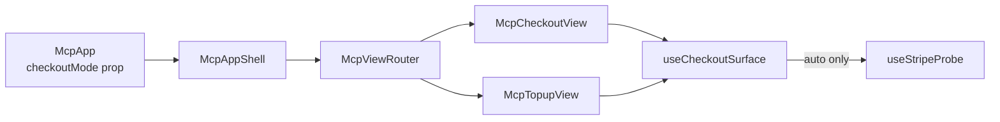

# First-class `checkoutMode` option for MCP views

## Problem

`<McpCheckoutView>` and `<McpTopupView>` decide between the embedded Stripe
Payment Element and the hosted-checkout new-tab link entirely from
[`useStripeProbe`](packages/react/src/mcp/useStripeProbe.ts). The probe exists
for a good reason — Stripe's `ready` event lies on Claude, so we listen for
`SecurityPolicyViolationEvent` instead — but it is the *only* input to the
decision.

The single bypass today is passing `publishableKey={null}`, which
`useStripeProbe` short-circuits to `'blocked'`:

```81:91:packages/react/src/mcp/useStripeProbe.ts
export function useStripeProbe(publishableKey: string | null): StripeProbeState {
  const [state, setState] = useState<StripeProbeState>(
    publishableKey ? 'loading' : 'blocked',
  )

  useEffect(() => {
    if (typeof document === 'undefined') return
    if (!publishableKey) {
      setState('blocked')
      return
    }
```

That bypass is unreachable through the turnkey entry point. `<McpApp>` reads the
key from the server bootstrap and `McpViewRouter` hands it straight to both
views:

```215:247:packages/react/src/mcp/McpAppShell.tsx
  switch (view) {
    case 'checkout':
      return (
        <CheckoutView
          productRef={productRef}
          publishableKey={stripePublishableKey}
```

So an integrator who knows their deployment (text-only host, a host whose
sandbox they've already characterised, a QA run that shouldn't depend on
`js.stripe.com` reachability) has to either wrap the view via the `views`
override purely to null out a prop, or hand-roll `<McpAppShell>` and mutate the
bootstrap object. Both are workarounds around a decision that should be
configurable.

Secondary motivation: on a host we already know is compliant, the probe costs up
to 5s of worst-case latency (3s script load + 2s element mount) behind a
`Loading checkout…` interstitial for zero information gain.

## Design

One prop, a three-value union (per the repo's "prefer union types over `enum`"
rule):

```ts
export type McpCheckoutMode = 'auto' | 'embedded' | 'hosted'
```

| Value | Behaviour |
| --- | --- |
| `'auto'` (default) | Run `useStripeProbe`. Exactly today's behaviour. |
| `'hosted'` | Skip the probe. Always render the hosted-checkout link path. |
| `'embedded'` | Skip the probe. Always mount the embedded Stripe flow. |

`'auto'` being the default is what makes this a non-breaking additive change:
existing callers, including the `publishableKey={null}` trick, keep their
current behaviour byte-for-byte.

### `'embedded'` does not need a publishable key

Worth stating explicitly because it is non-obvious: the probe key and the
payment key are different things. `EmbeddedCheckout` takes no `publishableKey`
prop at all —

```36:46:packages/react/src/mcp/views/checkout/EmbeddedCheckout.tsx
export interface EmbeddedCheckoutProps {
  productRef: string
  returnUrl: string
  onPurchaseSuccess?: () => void
```

— because the real flow re-fetches the platform pk and the connected
`accountId` from `create_payment_intent` and boots its own `Stripe` instance
inside `useCheckout` / `useTopup`. The bootstrap key exists *only* to give
`loadStripe()` something valid enough to exercise `script-src` + `frame-src`.
So `checkoutMode="embedded"` is coherent even when
`bootstrap.stripePublishableKey` is `null`.

### Shared decision hook

Extract the branch so both views agree and `useStripeProbe` stays a pure probe
with an unchanged public contract.

New file `packages/react/src/mcp/useCheckoutSurface.ts`:

```ts
export type McpCheckoutMode = 'auto' | 'embedded' | 'hosted'

export type CheckoutSurface = 'loading' | 'embedded' | 'hosted'

export function useCheckoutSurface(
  mode: McpCheckoutMode,
  publishableKey: string | null,
): CheckoutSurface {
  // Passing `null` outside `'auto'` short-circuits the probe synchronously
  // without loading Stripe.js, while still calling the hook unconditionally
  // so hook order is stable across mode changes.
  const probe = useStripeProbe(mode === 'auto' ? publishableKey : null)
  if (mode === 'hosted') return 'hosted'
  if (mode === 'embedded') return 'embedded'
  if (probe === 'loading') return 'loading'
  return probe === 'ready' ? 'embedded' : 'hosted'
}
```

The `mode === 'auto' ? publishableKey : null` line is load-bearing: it satisfies
the rules of hooks while guaranteeing forced modes never issue a network
request or mount a hidden probe host node.

### Threading



Both views are exported publicly, so the prop lands on `McpCheckoutViewProps`
and `McpTopupViewProps` as well as the three shell-level types — integrators who
mount the views directly get the same control as `<McpApp>` users.
`McpAccountView` is unaffected.

## Files

| File | Change |
| --- | --- |
| `packages/react/src/mcp/useCheckoutSurface.ts` | **new** — `McpCheckoutMode`, `CheckoutSurface`, `useCheckoutSurface` |
| `packages/react/src/mcp/views/McpCheckoutView.tsx` | `checkoutMode` prop; swap `useStripeProbe` → `useCheckoutSurface`; update the `publishableKey` JSDoc |
| `packages/react/src/mcp/views/McpTopupView.tsx` | same swap; note the `merchantLoading` gate stays combined with the `'loading'` surface |
| `packages/react/src/mcp/McpAppShell.tsx` | `checkoutMode` on `McpAppShellProps` + `McpViewRouterProps`, forwarded in the `checkout` / `topup` switch arms |
| `packages/react/src/mcp/McpApp.tsx` | `checkoutMode` on `McpAppProps`, passed to `<McpAppShell>` |
| `packages/react/src/mcp/index.ts` | export `McpCheckoutMode` (and `CheckoutSurface`) beside `StripeProbeState` |
| `packages/react/__tests__/types-surface.test-d.ts` | cover the new type + props |
| `packages/react/docs/mcp-app-architecture.md` | document the three modes and when to leave `'auto'` |
| `examples/mcp-checkout-app/README.md` | extend the existing "A note on `stripePublishableKey`" section |

## Trade-off: `'embedded'` will not self-heal

Forcing `'embedded'` on a host that actually refuses `js.stripe.com` produces a
Payment Element that cannot render. The SDK deliberately will **not** silently
fall back to hosted in that case — that would be exactly the masking the repo
rules forbid, and it would make the option meaningless. The Stripe element's own
`loaderror` surfaces to the user as it does today.

This must be spelled out in the JSDoc and the docs page: `'embedded'` is an
escape hatch for integrators who have characterised their host, not a
performance toggle to reach for by default.

## Out of scope (explicit)

- **Server-side default on `BootstrapPayload`.** A `checkoutMode` field on the
  payload (set from `createSolvaPayMcpServer` options, flowing through
  `@solvapay/mcp-core`'s `createBuildBootstrapPayload`) is a reasonable
  follow-up for merchants who want to configure once server-side, but it widens
  the change across three packages and a wire contract. Client prop first; the
  bootstrap field can layer underneath the prop later as the default.
- **Deprecating `publishableKey={null}`.** It keeps its current meaning ("no key
  available"), which is a genuine state — `createBuildBootstrapPayload` returns
  `null` when `getPlatformConfig()` fails. Only the JSDoc changes.
- **Changing the probe itself.** Timeouts, the `securitypolicyviolation`
  listener, and the `StripeProbeState` union all stay as they are.
- **A host allowlist / denylist.** `useHostName()` exists and could in principle
  pre-answer the probe for known hosts, but baking a host table into the SDK
  ages badly. Explicit integrator config is the honest version.

## Tests

New `packages/react/src/mcp/__tests__/useCheckoutSurface.test.ts`:

- `'hosted'` → `'hosted'` for every probe state, and `loadStripe` is never
  called.
- `'embedded'` → `'embedded'` for every probe state, including when a
  `securitypolicyviolation` is dispatched; `loadStripe` never called.
- `'auto'` reproduces the current mapping: `loading → 'loading'`,
  `ready → 'embedded'`, `blocked → 'hosted'`.
- `'auto'` with a `null` key resolves `'hosted'` synchronously (the existing
  bypass still works).

Extend `packages/react/src/mcp/views/__tests__/McpCheckoutView.test.tsx` and
`McpTopupView.test.tsx`:

- `checkoutMode="hosted"` with a valid `publishableKey` renders the hosted link
  UI (`Upgrade` / `Reopen checkout` anchors) and never shows the
  `Loading checkout…` interstitial.
- `checkoutMode="embedded"` with `publishableKey={null}` renders the plan
  picker, proving the key is not required for the embedded path.
- Omitting the prop is unchanged (guards against an accidental default flip).

Extend `packages/react/src/mcp/__tests__/McpAppShell.test.tsx` for
router-level threading into both views.

## Changeset

`@solvapay/react` **minor**:

> `<McpApp>`, `<McpAppShell>`, `<McpViewRouter>`, `<McpCheckoutView>` and
> `<McpTopupView>` accept a new `checkoutMode` prop (`'auto' | 'embedded' |
> 'hosted'`). `'auto'` is the default and keeps the existing Stripe CSP probe
> behaviour; `'hosted'` always renders the hosted-checkout link without probing;
> `'embedded'` always mounts the embedded Stripe flow. Forced modes skip
> `loadStripe` entirely, so they also skip the probe's up-to-5s worst case.

## Verification

1. `pnpm -F @solvapay/react test` and `pnpm -F @solvapay/react type-check`.
2. Mount the example MCP app with `checkoutMode="hosted"` on MCPJam (a host the
   probe normally clears): the hosted link renders immediately, no
   `Loading checkout…` frame, no `js.stripe.com` request in the network panel.
3. Mount with `checkoutMode="embedded"` on MCPJam: embedded flow renders and a
   real payment still completes (proves the payment path's own key fetch is
   independent of the probe key).
4. Mount with no prop on Claude: unchanged — probe fires, resolves `'blocked'`,
   hosted fallback renders.
