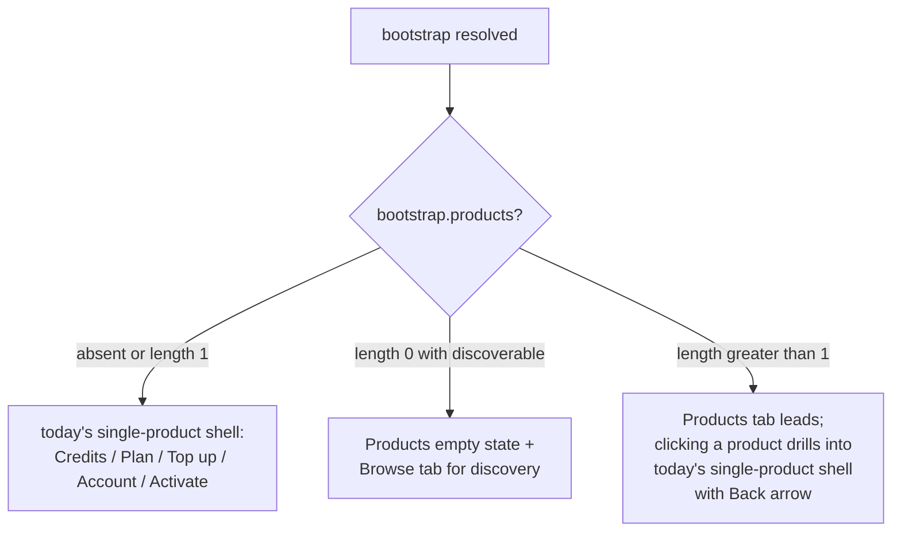

## Status

**Investigation, deferred.** Captured here so the single-product scoping decisions in [`mcp-app_self-explanatory_ec1d0a5b.plan.md`](./mcp-app_self-explanatory_ec1d0a5b.plan.md) don't get re-litigated ad-hoc. Converts to an execution plan only if the questions below have satisfying answers and the scope justifies the cost.

## Why this needs its own plan

The MCP shell as implemented (and as extended in `mcp-app_self-explanatory`) is single-product by design:

- OAuth bridge scopes a session to one product via [`createMcpOAuthBridge`](packages/oauth-bridge/src) — the issued `customer_ref` is bound to a product.
- `productRef` is fixed at [`createSolvaPayMcpServer(...)`](packages/mcp-sdk/src/server.ts) construction time.
- UI resource URI is tenant- and product-specific (`ui://<example>/mcp-app.html`).
- `BootstrapPayload.product` and `BootstrapPayload.plans` are single-product fields.
- Intent tools (`upgrade`, `manage_account`, `topup`, `check_usage`, `activate_plan`) all default `productRef` to the server's single product.

Breaking that constraint touches every layer. The current plan's [Tab mapping explanation for the `Products` tab](./mcp-app_self-explanatory_ec1d0a5b.plan.md) makes the single-product commitment explicit:

> Switching products requires a new MCP server connection (new OAuth, new chat, new resource URI). The MCP shell is scoped to exactly one product for the whole session — exposing a product switcher would dead-end in a tab that can't actually switch anything.

Multi-product either unwinds that commitment or finds a way around it (e.g. multi-product OAuth scope, or provider-scoped connections that expose products as sub-resources).

## Scenarios to cover

- **A. Single provider, single product.** Today. No change.
- **B. Single provider, multiple active products.** Customer has purchased at Product 1 and Product 2. Credits (if provider-scoped) deplete across both. Shell should show an aggregate view plus per-product drill-down.
- **C. Single provider, product discovery.** Customer knows about Product 1, discovers Product 2 exists via the shell (the hosted `Browse` tab pattern), activates it without leaving the iframe.
- **D. (Stretch) single provider, multiple products, multiple customers on shared billing.** B2B case. Almost certainly out of scope for v1.

## Questions to answer before writing an execution plan

1. **Credit ledger scope.** Are credits provider-scoped (shared across products at the same provider) or product-scoped in the backend? Check [`solvapay-backend/src/providers/`](src/providers/) and the credit/balance tables. If provider-scoped, the multi-product case is cleaner (one balance, many products). If product-scoped, multi-product means N separate ledgers the UI has to aggregate.
2. **MCP server topology.** Three plausible shapes, pick one:
   - **One-server-per-product** (today). Each product gets its own MCP server, OAuth bridge, UI resource. Multi-product means N connections in the host. *Pro:* zero SDK changes. *Con:* user has to connect N times; hosts don't help coordinate across servers.
   - **One-server-per-provider.** One MCP server exposes every product for a provider. `productRef` becomes a per-call arg instead of a server-construction arg. *Pro:* single connection, natural discovery. *Con:* every descriptor function, every tool schema, every cache key needs `productRef` in its signature — touches ~every SDK file.
   - **Hybrid.** One server default-scoped to one product but accepts `productRef` overrides on a subset of tools (`list_products`, `activate_plan({ productRef })`). *Pro:* backward-compatible. *Con:* two APIs in parallel; confusing surface.
3. **Discovery.** How does an LLM (or user) learn what products exist?
   - `list_products` intent tool that returns `{ products: [...] }`?
   - Extend `BootstrapPayload` with `otherProducts: Product[]` alongside the currently-scoped `product`?
   - Resource URI `solvapay://provider/<id>/products`?
4. **Tool parameterisation.** Current intent tools default to the server's `productRef`. Multi-product either:
   - Adds optional `productRef` arg to each intent tool (`activate_plan({ planRef, productRef? })`, `upgrade({ productRef? })`, etc.).
   - Requires product selection to happen *first* via a new `select_product` prelude tool that switches the server's active product for subsequent calls. Stateful and brittle.
5. **Shell mode detection.** How does `<McpApp>` decide 1-product vs N-product layout without a breaking API change?
   - Look at `bootstrap.product` (single) vs `bootstrap.products` (plural). If plural present, render the Products tab; otherwise today's shell.
6. **Hosted MCP Pay proxy parity.** The hosted proxy today registers virtual tools per tenant keyed by subdomain. Multi-product on hosted probably means the subdomain maps to a provider (not a product), and each provider's products are enumerated on connection. See [`trim-mcp-tool-surface_1f745de8.plan.md`](./trim-mcp-tool-surface_1f745de8.plan.md) hosted-alignment section for the current proxy model.

## Hosted manage page — reference components to port if we go N-product

Everything the MCP shell deliberately omitted in `mcp-app_self-explanatory` because of single-product scoping would come back into play:

- [`ManageShell.tsx`](src/components/customer/manage/ManageShell.tsx) full 5-tab layout: Products | Browse | Purchases | Credits | Account.
- [`MyProductsList.tsx`](src/components/customer/manage/MyProductsList.tsx) — the active-products list, empty state, CTA.
- [`deriveActiveProducts.ts`](src/components/customer/manage/deriveActiveProducts.ts) — server→UI derivation of "what products is this customer on?".
- [`BrowseTab.tsx`](src/components/customer/manage/BrowseTab.tsx) — pick a product, then pick a plan for it.
- [`ProductBrowseModal.tsx`](src/components/customer/manage/ProductBrowseModal.tsx) — discover products not yet activated.
- [`PurchasesView.tsx`](src/components/customer/manage/PurchasesView.tsx) — cross-product purchases list (not just the current product's active one).

## Proposed shell decision tree

Key idea: the single-product shell stays as the canonical "inside a product" view. Multi-product adds a layer *above* it — a products list that deep-links into the existing shell when one is picked. Minimises regression risk because the view primitives stay unchanged.

## Cross-plan impact if we do this

- `mcp-app_self-explanatory` paywall two-CTA gap — upgrade CTA today picks from `bootstrap.plans` (single product). Multi-product means the paywall might want to offer "upgrade to unlimited on **this** product" vs "top up credits (good for all products)" — different text, same intents.
- Credits tab empty state — currently "Unlimited — no limits on this plan". Multi-product unlimited on Product 1 but pay-as-you-go on Product 2 is a weird mixed state the copy needs to handle.
- Sidebar `CustomerDetailsCard` credit balance — trivially unchanged if credits are provider-scoped. If product-scoped, sidebar would show N balances and get cluttered fast.

## Out of scope for this investigation

- Actual implementation — this is a research plan.
- Multi-provider (a customer spanning different SolvaPay providers). Separate concern, probably "just log into N servers".
- B2B / team / org accounts with shared billing. Separate concern.
- Theming per-product. The merchant-branding work is tracked in [`trim-mcp-tool-surface_1f745de8.plan.md`](./trim-mcp-tool-surface_1f745de8.plan.md) hosted-alignment section.

## Deliverables

1. Answers to the six questions above, each with a concrete recommendation.
2. A follow-up execution plan IF the answers justify the work — or a documented decision to defer indefinitely with the reason stated.
3. If the decision is to proceed: a scoping note on whether to ship multi-product in SDK first, hosted first, or both together.

## When to revisit

- After `mcp-app_self-explanatory` ships all 7 phases and stabilises.
- After the hosted MCP Pay alignment work (Bucket 2 in `trim-mcp-tool-surface`) picks a server topology — the answer there likely dictates the topology for SDK-integrated multi-product too.
- When a customer or integrator actually asks for it. Until then, one product per server is a feature, not a limitation.
