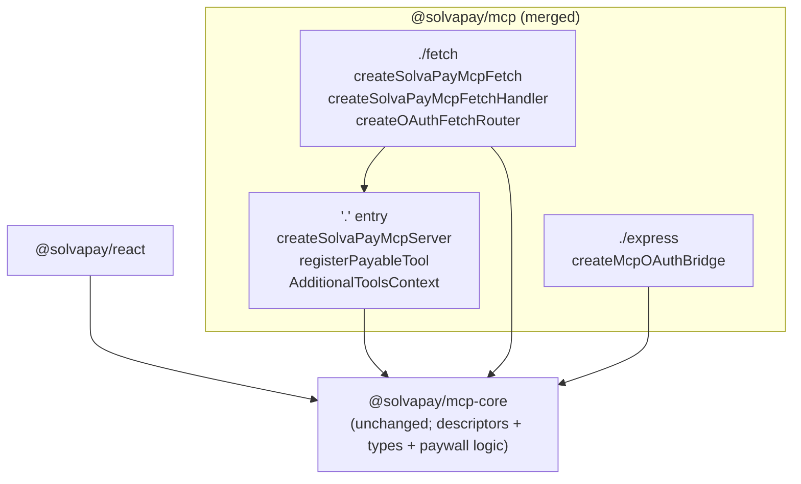

# MCP packages consolidation

## Why

Three separate adapter packages (`@solvapay/mcp`, `@solvapay/mcp-fetch`, `@solvapay/mcp-express`) split our own ~90 KB of adapter code across peer-dep matrices and forced per-package duplication for every new SDK-adapter helper (the `registerPayableTool` case we just hit). The split buys near-zero on edge cold start because `@modelcontextprotocol/sdk` (2.9 MB) + `@modelcontextprotocol/ext-apps` (1.4 MB) dominate the load cost regardless of how we organise our own code. `@solvapay/mcp-core` stays separate — it's framework-neutral, SDK-runtime-free, and consumed by `@solvapay/react` without any of the adapter machinery.

Preview-only shipping means we can rename the public surface cleanly without a deprecation cycle.

## Shape after the merge



Consumer import rename:

- `@solvapay/mcp-fetch` → `@solvapay/mcp/fetch`
- `@solvapay/mcp-express` → `@solvapay/mcp/express`
- `@solvapay/mcp` → `@solvapay/mcp` (unchanged)
- `@solvapay/mcp-core` → `@solvapay/mcp-core` (unchanged)

## Step 1 — move source into `packages/mcp/`

Target layout:

```
packages/mcp/src/
  index.ts                       # '.' entry (unchanged exports)
  server.ts                      # unchanged
  registerPayableTool.ts         # unchanged
  fetch/
    index.ts                     # './fetch' entry (was packages/mcp-fetch/src/index.ts)
    handler.ts                   # was packages/mcp-fetch/src/handler.ts
    oauth-bridge.ts              # was packages/mcp-fetch/src/oauth-bridge.ts
    cors.ts                      # was packages/mcp-fetch/src/cors.ts
    createSolvaPayMcpFetch.ts    # now imports ../server + ../registerPayableTool (no duplication)
  express/
    index.ts                     # './express' entry (was packages/mcp-express/src/index.ts)
    oauth-bridge.ts              # was packages/mcp-express/src/oauth-bridge.ts
```

Inside [packages/mcp-fetch/src/createSolvaPayMcpFetch.ts](packages/mcp-fetch/src/createSolvaPayMcpFetch.ts), the duplicated `registerDescriptor` / `registerPromptDescriptor` / `registerDocsResource` helpers are already near-copies of the ones in [packages/mcp/src/server.ts](packages/mcp/src/server.ts). During the move:

- Extract the three registration helpers + the `McpServer` construction into a new shared module `packages/mcp/src/internal/buildMcpServer.ts`.
- Both [packages/mcp/src/server.ts](packages/mcp/src/server.ts) (`createSolvaPayMcpServer`) and the moved `fetch/createSolvaPayMcpFetch.ts` import from `../internal/buildMcpServer.ts`. Duplication drops to zero.
- `AdditionalToolsContext` becomes a single canonical type exported from `packages/mcp/src/index.ts`, with `registerPayable` bound — the factory's context shape matches `createSolvaPayMcpServer`'s exactly.

Delete `packages/mcp-fetch/` and `packages/mcp-express/` directories entirely.

## Step 2 — merged `packages/mcp/package.json`

Key changes vs. [packages/mcp/package.json](packages/mcp/package.json):

```json
{
  "name": "@solvapay/mcp",
  "version": "0.2.0",
  "exports": {
    ".": {
      "types": "./dist/index.d.ts",
      "import": "./dist/index.js",
      "require": "./dist/index.cjs"
    },
    "./fetch": {
      "types": "./dist/fetch/index.d.ts",
      "import": "./dist/fetch/index.js",
      "require": "./dist/fetch/index.cjs"
    },
    "./express": {
      "types": "./dist/express/index.d.ts",
      "import": "./dist/express/index.js",
      "require": "./dist/express/index.cjs"
    }
  },
  "peerDependencies": {
    "@modelcontextprotocol/ext-apps": "^1.5.0",
    "@modelcontextprotocol/sdk": "^1.28.0",
    "@solvapay/mcp-core": "workspace:*",
    "@solvapay/server": "workspace:*",
    "zod": "^3.25.0 || ^4.0.0"
  },
  "peerDependenciesMeta": { "zod": { "optional": true } }
}
```

Update `tsup.config.ts` to the multi-entry build:

```ts
entry: ['src/index.ts', 'src/fetch/index.ts', 'src/express/index.ts']
```

Externals stay the same set that `mcp-fetch` already lists.

## Step 3 — consolidate tests + changesets

- Move [packages/mcp-fetch/__tests__/](packages/mcp-fetch/__tests__/) → `packages/mcp/__tests__/fetch/`.
- Move [packages/mcp-express/__tests__/](packages/mcp-express/__tests__/) → `packages/mcp/__tests__/express/`.
- Merge [packages/mcp/vitest.config.ts](packages/mcp/vitest.config.ts) + the fetch/express vitest configs into one — include paths already use glob matching.
- Rewrite the three pending changesets to target only `@solvapay/mcp`:
  - [.changeset/mcp-fetch-stateless-modes.md](.changeset/mcp-fetch-stateless-modes.md) → retarget `@solvapay/mcp`.
  - [.changeset/mcp-fetch-unified-factory.md](.changeset/mcp-fetch-unified-factory.md) → retarget `@solvapay/mcp`.
  - [.changeset/mcp-hide-tools-by-audience.md](.changeset/mcp-hide-tools-by-audience.md) → keep `@solvapay/mcp` + `@solvapay/mcp-core` targets (both exist).
- Write one new `.changeset/mcp-packages-consolidation.md` — `minor` on `@solvapay/mcp`, documenting the renames for preview-channel migrators.

## Step 4 — update every consumer

Import rewrites across the repo (each is a one-line change):

- [examples/supabase-edge-mcp/supabase/functions/mcp/index.ts](examples/supabase-edge-mcp/supabase/functions/mcp/index.ts) — full rewrite to ~55 LOC using `createSolvaPayMcpFetch` from `@solvapay/mcp/fetch`, drop the mutex/transport/reach-in workarounds (the whole Supabase example cleanup folds in here). Keep `rewriteRequestPath` + browser-CORS shims.
- [examples/supabase-edge-mcp/supabase/functions/mcp/demo-tools.ts](examples/supabase-edge-mcp/supabase/functions/mcp/demo-tools.ts) — `AdditionalToolsContext` import stays from `@solvapay/mcp` (default entry now owns it).
- [examples/supabase-edge-mcp/supabase/functions/mcp/deno.json](examples/supabase-edge-mcp/supabase/functions/mcp/deno.json) — drop `@solvapay/mcp-fetch`; add subpath resolver `"@solvapay/mcp/": "npm:/@solvapay/mcp@preview/"` alongside the bare `"@solvapay/mcp"` entry so Deno resolves `@solvapay/mcp/fetch` through the published subpath.
- [examples/supabase-edge-mcp/supabase/functions/mcp/deno.local.json](examples/supabase-edge-mcp/supabase/functions/mcp/deno.local.json) — same pattern, but pointed at the local `packages/mcp/dist/`.
- [examples/supabase-edge-mcp/package.json](examples/supabase-edge-mcp/package.json) — drop `@solvapay/mcp-fetch` devDep (already had `@solvapay/mcp`).
- [examples/mcp-checkout-app/src/index.ts](examples/mcp-checkout-app/src/index.ts) — `@solvapay/mcp-express` → `@solvapay/mcp/express`.
- [examples/mcp-checkout-app/package.json](examples/mcp-checkout-app/package.json) — drop `@solvapay/mcp-express` devDep.
- [examples/mcp-checkout-app/src/server.ts](examples/mcp-checkout-app/src/server.ts) — `@solvapay/mcp` unchanged.
- [examples/mcp-time-app/src/index.ts](examples/mcp-time-app/src/index.ts) — `@solvapay/mcp-express` → `@solvapay/mcp/express`.
- [examples/mcp-time-app/package.json](examples/mcp-time-app/package.json) — drop `@solvapay/mcp-express` devDep, add `@solvapay/mcp`.
- [examples/mcp-time-app/tsconfig.json](examples/mcp-time-app/tsconfig.json) — swap path mapping.
- [examples/mcp-oauth-bridge/src/index.ts](examples/mcp-oauth-bridge/src/index.ts), [examples/mcp-oauth-bridge/package.json](examples/mcp-oauth-bridge/package.json), [examples/mcp-oauth-bridge/tsconfig.json](examples/mcp-oauth-bridge/tsconfig.json) — same swap.
- [docs/guides/mcp.mdx](docs/guides/mcp.mdx) — `@solvapay/mcp-express` → `@solvapay/mcp/express`.
- [packages/server/README.md](packages/server/README.md) — update the two "See also" links (lines 142, 144) to point at `@solvapay/mcp/fetch` and `@solvapay/mcp/express` subpath docs.
- [packages/server/src/__tests__/edge-exports.test.ts](packages/server/src/__tests__/edge-exports.test.ts) — update the doc comment reference to `@solvapay/mcp-fetch` → `@solvapay/mcp/fetch`.

## Step 5 — update CI gates

- [scripts/validate-fetch-runtime.ts](scripts/validate-fetch-runtime.ts) — change the `'@solvapay/mcp-fetch'` entry (line 43) to `'@solvapay/mcp/fetch'`. The script already walks a package list; the subpath resolves through Node's `exports` field.
- [scripts/check-dependency-health.ts](scripts/check-dependency-health.ts) — drop `@solvapay/mcp-express` + `@solvapay/mcp-fetch` from the comment block (line 28); they're gone.
- [scripts/README.md](scripts/README.md) — update the corresponding description.
- [.github/workflows/publish-preview.yml](.github/workflows/publish-preview.yml) — no change (uses generic pnpm commands). The Deno gate step (`pnpm --filter @example/supabase-edge-mcp validate`) continues to gate on type-check against the new subpath resolution.

## Step 6 — validation

Run locally from repo root:

```bash
pnpm install
pnpm build:packages
pnpm test                              # all packages, including the merged mcp suite
pnpm validate:fetch-runtime            # Node-only bare-fetch import smoke
pnpm --filter @example/supabase-edge-mcp validate   # Deno type-check gate
pnpm --filter @example/mcp-checkout-app build
pnpm --filter @example/mcp-time-app build
pnpm --filter @example/mcp-oauth-bridge build
```

Expected outcome:
- `@solvapay/mcp` builds three entries (`dist/index.js`, `dist/fetch/index.js`, `dist/express/index.js`) + matching `.d.ts` / `.cjs`.
- All tests that used to live under `mcp-fetch` and `mcp-express` now pass under the merged package's suite.
- Deno gate passes against the new subpath import map.

## Step 7 — publish preview snapshot

- Push to `dev`. `publish-preview.yml` cuts a preview with:
  - `@solvapay/mcp@0.2.0-preview.N` (new minor, new subpaths).
  - `@solvapay/mcp-core@0.Y.Z-preview.N` — unchanged semantics, patch bump from the `hideToolsByAudience` addition.
  - `@solvapay/mcp-fetch` + `@solvapay/mcp-express` — silently stop publishing (workspace entries gone). Their last preview snapshot on npm stays pinned as a ghost; the `@preview` tag no longer updates for those names.
- Run the MCPJam / ChatGPT connector smoke tests against the Goldberg deploy once the preview snapshot resolves.

## Out of scope

- Moving `@solvapay/mcp-core` into `@solvapay/mcp` (option C from discussion). Keeping `mcp-core` separate preserves `@solvapay/react`'s minimal install graph — React consumers pull only the types + paywall-state engine, never the SDK-adapter machinery.
- Renaming `@solvapay/mcp` itself (e.g. to `@solvapay/mcp-adapter`). The existing name is the right one; the package was always meant to be the single MCP adapter surface, and we're just completing that consolidation now.
- Changing `@solvapay/server`'s public surface. Untouched.
- Stable-channel release. This PR lands on preview; the Version Packages PR promotes `@solvapay/mcp@0.2.0` to `latest` once the smoke tests pass.
