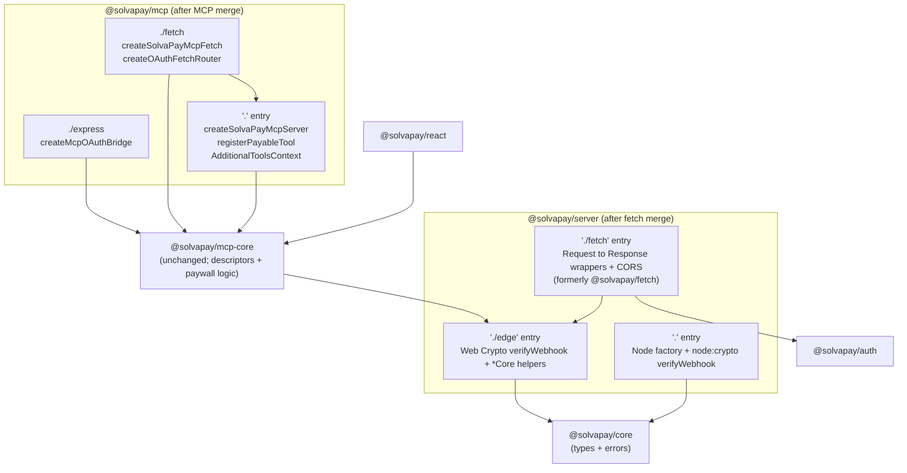

# MCP and fetch packages consolidation

## Why

Four separate adapter packages (`@solvapay/mcp`, `@solvapay/mcp-fetch`, `@solvapay/mcp-express`, `@solvapay/fetch`) split ~90 KB of our own adapter code across peer-dep matrices and forced per-package duplication for every new SDK-adapter helper (the `registerPayableTool` case we just hit in the MCP tree; the thin `*Core` → `Response` wrappers in the `fetch` tree). The split buys near-zero on edge cold start because the vendored MCP SDK (~4.3 MB) dominates the MCP cold-start, and the fetch handlers are ~290 LOC of repetitive wrappers around `@solvapay/server` `*Core` helpers that already ship in the dependency graph regardless.

`@solvapay/mcp-core` stays separate — it's framework-neutral, SDK-runtime-free, and consumed by `@solvapay/react` without any of the adapter machinery.

Two fresh-publish windows align right now:

- **MCP packages**: preview-only on npm. `@preview` tag drops, `@latest` never existed. Rename freely.
- **`@solvapay/fetch`**: published `1.0.0` ~24h ago, 0 dependents on the npm registry, inside the 72-hour unpublish window. Same "preview-only" economics in practice. Consumers are all internal (examples/supabase-edge, `validate-fetch-runtime` script). Unpublish now = no deprecation cycle.

Both workstreams land in the same PR, publish on the same preview snapshot, and the `@solvapay/fetch` merge happens after the MCP merge's steps so the git history reads cleanly as two stacked refactors.

## Shape after the merges



Consumer import renames:

- `@solvapay/mcp-fetch` → `@solvapay/mcp/fetch`
- `@solvapay/mcp-express` → `@solvapay/mcp/express`
- `@solvapay/mcp` → `@solvapay/mcp` (unchanged)
- `@solvapay/mcp-core` → `@solvapay/mcp-core` (unchanged)
- `@solvapay/fetch` → `@solvapay/server/fetch`
- `@solvapay/server` → `@solvapay/server` (unchanged, gains `./fetch` subpath)

## Step 1 — move source into `packages/mcp/`

Target layout:

```
packages/mcp/src/
  index.ts                       # '.' entry (unchanged exports)
  server.ts                      # unchanged
  registerPayableTool.ts         # unchanged
  fetch/
    index.ts                     # './fetch' entry (was packages/mcp-fetch/src/index.ts)
    handler.ts                   # was packages/mcp-fetch/src/handler.ts
    oauth-bridge.ts              # was packages/mcp-fetch/src/oauth-bridge.ts
    cors.ts                      # was packages/mcp-fetch/src/cors.ts
    createSolvaPayMcpFetch.ts    # now imports ../server + ../registerPayableTool (no duplication)
  express/
    index.ts                     # './express' entry (was packages/mcp-express/src/index.ts)
    oauth-bridge.ts              # was packages/mcp-express/src/oauth-bridge.ts
```

Inside [packages/mcp-fetch/src/createSolvaPayMcpFetch.ts](packages/mcp-fetch/src/createSolvaPayMcpFetch.ts), the duplicated `registerDescriptor` / `registerPromptDescriptor` / `registerDocsResource` helpers are already near-copies of the ones in [packages/mcp/src/server.ts](packages/mcp/src/server.ts). During the move:

- Extract the three registration helpers + the `McpServer` construction into a new shared module `packages/mcp/src/internal/buildMcpServer.ts`.
- Both [packages/mcp/src/server.ts](packages/mcp/src/server.ts) (`createSolvaPayMcpServer`) and the moved `fetch/createSolvaPayMcpFetch.ts` import from `../internal/buildMcpServer.ts`. Duplication drops to zero.
- `AdditionalToolsContext` becomes a single canonical type exported from `packages/mcp/src/index.ts`, with `registerPayable` bound — the factory's context shape matches `createSolvaPayMcpServer`'s exactly.

Delete `packages/mcp-fetch/` and `packages/mcp-express/` directories entirely.

## Step 2 — merged `packages/mcp/package.json`

Key changes vs. [packages/mcp/package.json](packages/mcp/package.json):

```json
{
  "name": "@solvapay/mcp",
  "version": "0.2.0",
  "exports": {
    ".": {
      "types": "./dist/index.d.ts",
      "import": "./dist/index.js",
      "require": "./dist/index.cjs"
    },
    "./fetch": {
      "types": "./dist/fetch/index.d.ts",
      "import": "./dist/fetch/index.js",
      "require": "./dist/fetch/index.cjs"
    },
    "./express": {
      "types": "./dist/express/index.d.ts",
      "import": "./dist/express/index.js",
      "require": "./dist/express/index.cjs"
    }
  },
  "peerDependencies": {
    "@modelcontextprotocol/ext-apps": "^1.5.0",
    "@modelcontextprotocol/sdk": "^1.28.0",
    "@solvapay/mcp-core": "workspace:*",
    "@solvapay/server": "workspace:*",
    "zod": "^3.25.0 || ^4.0.0"
  },
  "peerDependenciesMeta": { "zod": { "optional": true } }
}
```

Update `tsup.config.ts` to the multi-entry build:

```ts
entry: ['src/index.ts', 'src/fetch/index.ts', 'src/express/index.ts']
```

Externals stay the same set that `mcp-fetch` already lists.

## Step 3 — consolidate tests + hand-set versions

- Move [packages/mcp-fetch/__tests__/](packages/mcp-fetch/__tests__/) → `packages/mcp/__tests__/fetch/`.
- Move [packages/mcp-express/__tests__/](packages/mcp-express/__tests__/) → `packages/mcp/__tests__/express/`.
- Merge [packages/mcp/vitest.config.ts](packages/mcp/vitest.config.ts) + the fetch/express vitest configs into one — include paths already use glob matching.
- **Hand-set versions** (bypass Changesets cascade). The original plan called for retargeting the pending changesets, but the peer-dep cascade would force `mcp` + `mcp-core` to `1.0.0` (and `react` to `2.0.0`) because `@solvapay/server` minor-bumps to `1.0.8`. Delete the six cascading changesets (`mcp-fetch-stateless-modes.md`, `mcp-fetch-unified-factory.md`, `mcp-hide-tools-by-audience.md`, `text-only-paywall.md`, `server-edge-exports.md`, `server-edge-exports-regression-test.md`), merge their narrative into each affected package's `CHANGELOG.md` entry by hand (`mcp@0.2.0`, `mcp-core@0.2.0`, `server@1.0.8`, `react@1.0.10`, `react-supabase@1.0.8`), and add [.changeset/hand-set-versions-consolidation.md](.changeset/hand-set-versions-consolidation.md) as an empty-frontmatter override. See [.cursor/plans/npm_housekeeping_mcp_packages_0f253f3b.plan.md](.cursor/plans/npm_housekeeping_mcp_packages_0f253f3b.plan.md) for the full rationale, target-version table, and prevention tweaks (experimental config flag + `workspace:^` on internal peers).

## Step 4 — update every consumer

Import rewrites across the repo (each is a one-line change):

- [examples/supabase-edge-mcp/supabase/functions/mcp/index.ts](examples/supabase-edge-mcp/supabase/functions/mcp/index.ts) — full rewrite to ~55 LOC using `createSolvaPayMcpFetch` from `@solvapay/mcp/fetch`, drop the mutex/transport/reach-in workarounds (the whole Supabase example cleanup folds in here). Keep `rewriteRequestPath` + browser-CORS shims.
- [examples/supabase-edge-mcp/supabase/functions/mcp/demo-tools.ts](examples/supabase-edge-mcp/supabase/functions/mcp/demo-tools.ts) — `AdditionalToolsContext` import stays from `@solvapay/mcp` (default entry now owns it).
- [examples/supabase-edge-mcp/supabase/functions/mcp/deno.json](examples/supabase-edge-mcp/supabase/functions/mcp/deno.json) — drop `@solvapay/mcp-fetch`; add subpath resolver `"@solvapay/mcp/": "npm:/@solvapay/mcp@preview/"` alongside the bare `"@solvapay/mcp"` entry so Deno resolves `@solvapay/mcp/fetch` through the published subpath.
- [examples/supabase-edge-mcp/supabase/functions/mcp/deno.local.json](examples/supabase-edge-mcp/supabase/functions/mcp/deno.local.json) — same pattern, but pointed at the local `packages/mcp/dist/`.
- [examples/supabase-edge-mcp/package.json](examples/supabase-edge-mcp/package.json) — drop `@solvapay/mcp-fetch` devDep (already had `@solvapay/mcp`).
- [examples/mcp-checkout-app/src/index.ts](examples/mcp-checkout-app/src/index.ts) — `@solvapay/mcp-express` → `@solvapay/mcp/express`.
- [examples/mcp-checkout-app/package.json](examples/mcp-checkout-app/package.json) — drop `@solvapay/mcp-express` devDep.
- [examples/mcp-checkout-app/src/server.ts](examples/mcp-checkout-app/src/server.ts) — `@solvapay/mcp` unchanged.
- [examples/mcp-time-app/src/index.ts](examples/mcp-time-app/src/index.ts) — `@solvapay/mcp-express` → `@solvapay/mcp/express`.
- [examples/mcp-time-app/package.json](examples/mcp-time-app/package.json) — drop `@solvapay/mcp-express` devDep, add `@solvapay/mcp`.
- [examples/mcp-time-app/tsconfig.json](examples/mcp-time-app/tsconfig.json) — swap path mapping.
- [examples/mcp-oauth-bridge/src/index.ts](examples/mcp-oauth-bridge/src/index.ts), [examples/mcp-oauth-bridge/package.json](examples/mcp-oauth-bridge/package.json), [examples/mcp-oauth-bridge/tsconfig.json](examples/mcp-oauth-bridge/tsconfig.json) — same swap.
- [docs/guides/mcp.mdx](docs/guides/mcp.mdx) — `@solvapay/mcp-express` → `@solvapay/mcp/express`.
- [packages/server/README.md](packages/server/README.md) — update the two "See also" links (lines 142, 144) to point at `@solvapay/mcp/fetch` and `@solvapay/mcp/express` subpath docs.
- [packages/server/src/__tests__/edge-exports.test.ts](packages/server/src/__tests__/edge-exports.test.ts) — update the doc comment reference to `@solvapay/mcp-fetch` → `@solvapay/mcp/fetch`.

## Step 5 — update CI gates

- [scripts/validate-fetch-runtime.ts](scripts/validate-fetch-runtime.ts) — change the `'@solvapay/mcp-fetch'` entry (line 43) to `'@solvapay/mcp/fetch'`. The script already walks a package list; the subpath resolves through Node's `exports` field.
- [scripts/check-dependency-health.ts](scripts/check-dependency-health.ts) — drop `@solvapay/mcp-express` + `@solvapay/mcp-fetch` from the comment block (line 28); they're gone.
- [scripts/README.md](scripts/README.md) — update the corresponding description.
- [.github/workflows/publish-preview.yml](.github/workflows/publish-preview.yml) — no change (uses generic pnpm commands). The Deno gate step (`pnpm --filter @example/supabase-edge-mcp validate`) continues to gate on type-check against the new subpath resolution.

## Step 6 — `@solvapay/fetch` → `@solvapay/server/fetch` merge

Second workstream, runs after Steps 1–5 land (ideally in a stacked commit on the same branch so bisect stays clean).

### 6a — move source

Target layout:

```
packages/server/src/
  index.ts                # '.' entry (Node) — unchanged
  edge.ts                 # './edge' entry (Web Crypto) — unchanged
  fetch/
    index.ts              # './fetch' entry (was packages/fetch/src/index.ts)
    handlers.ts           # was packages/fetch/src/handlers.ts
    cors.ts               # was packages/fetch/src/cors.ts
    utils.ts              # was packages/fetch/src/utils.ts
```

Internal imports become relative: `fetch/handlers.ts` imports `*Core` helpers from `'../helpers'` (not `'@solvapay/server'`), avoiding the self-import indirection.

### 6b — fix latent `verifyWebhook` async bug

[packages/fetch/src/handlers.ts](packages/fetch/src/handlers.ts) line 269 currently does:

```ts
event = verifyWebhook({ body, signature, secret })
```

No `await`. This works on Deno today because the `deno` export condition resolves `@solvapay/server` to [packages/server/src/edge.ts](packages/server/src/edge.ts) (async variant) and awaiting a non-Promise is a no-op — but the returned `WebhookEvent` is actually a `Promise<WebhookEvent>`, so the subsequent `options.onEvent(event)` hands the user code a promise cast as an event. Latent bug.

The merge fixes it by importing the async variant explicitly from `'../edge'` and adding the `await`:

```ts
// packages/server/src/fetch/handlers.ts
import { verifyWebhook } from '../edge'
// ...
event = await verifyWebhook({ body, signature, secret })
```

This makes the `./fetch` subpath deterministically Web Crypto, independent of which export condition a consumer's bundler selects for `@solvapay/server`.

### 6c — update `packages/server/package.json`

Add `"./fetch"` to the exports map; promote `@solvapay/auth` from devDependencies to peerDependencies (fetch handlers authenticate requests):

```json
{
  "name": "@solvapay/server",
  "version": "1.1.0",
  "exports": {
    ".": {
      "types": "./dist/index.d.ts",
      "edge-light": "./dist/edge.js",
      "worker": "./dist/edge.js",
      "deno": "./dist/edge.js",
      "import": "./dist/index.js",
      "require": "./dist/index.cjs"
    },
    "./edge": {
      "types": "./dist/edge.d.ts",
      "import": "./dist/edge.js",
      "default": "./dist/edge.js"
    },
    "./fetch": {
      "types": "./dist/fetch/index.d.ts",
      "import": "./dist/fetch/index.js",
      "require": "./dist/fetch/index.cjs"
    }
  },
  "peerDependencies": {
    "@solvapay/auth": "workspace:*",
    "zod": "^3.25.0 || ^4.0.0"
  },
  "peerDependenciesMeta": { "zod": { "optional": true } }
}
```

Update `packages/server/tsup.config.ts` entries:

```ts
entry: ['src/index.ts', 'src/edge.ts', 'src/fetch/index.ts']
```

Verify post-build that `dist/fetch/index.js` does not reference `node:crypto` or `require('crypto')` — the fetch subpath must stay Web-standards only (covered by the CI gate in Step 6f).

### 6d — delete `packages/fetch/` + archive changelog

Remove the directory entirely (source, tests, README, CHANGELOG, tsconfigs). Copy the `packages/fetch/CHANGELOG.md` 1.0.0 entry as a historical appendix at the bottom of `packages/server/CHANGELOG.md` — documents the `@solvapay/supabase` → `@solvapay/fetch` → `@solvapay/server/fetch` chain for future archaeology.

### 6e — update consumers

- 16 handler files under [examples/supabase-edge/supabase/functions/](examples/supabase-edge/supabase/functions/) (`activate-plan`, `cancel-renewal`, `check-purchase`, `create-checkout-session`, `create-customer-session`, `create-payment-intent`, `create-topup-payment-intent`, `customer-balance`, `get-merchant`, `get-payment-method`, `get-product`, `list-plans`, `process-payment`, `reactivate-renewal`, `solvapay-webhook`, `sync-customer`, `track-usage`) — each is a one-line change:

  ```diff
  - import { checkPurchase } from '@solvapay/fetch'
  + import { checkPurchase } from '@solvapay/server/fetch'
  ```

- [examples/supabase-edge/supabase/functions/deno.json](examples/supabase-edge/supabase/functions/deno.json) — drop the `@solvapay/fetch` entry; add a subpath resolver so Deno finds `@solvapay/server/fetch`:

  ```json
  {
    "imports": {
      "@solvapay/server": "npm:@solvapay/server",
      "@solvapay/server/": "npm:/@solvapay/server@preview/",
      "@solvapay/auth": "npm:@solvapay/auth",
      "@solvapay/core": "npm:@solvapay/core"
    }
  }
  ```

- [examples/supabase-edge/supabase-edge.test.ts](examples/supabase-edge/supabase-edge.test.ts) — mirror the import rewrite.
- [examples/supabase-edge/README.md](examples/supabase-edge/README.md) + [packages/server/README.md](packages/server/README.md) — merge the `@solvapay/fetch` README content into a new "Web-standards runtimes (`./fetch` subpath)" section of the server README; update the supabase-edge README's setup snippet to the new import.
- Root [README.md](README.md), [CONTRIBUTING.md](CONTRIBUTING.md), [packages/react/README.md](packages/react/README.md) — doc mentions.

### 6f — CI gates

- [scripts/validate-fetch-runtime.ts](scripts/validate-fetch-runtime.ts) — replace the `@solvapay/fetch` entry (line 38) with:

  ```ts
  {
    name: '@solvapay/server/fetch',
    distEsm: path.join(REPO_ROOT, 'packages/server/dist/fetch/index.js'),
    expectedExports: ['checkPurchase', 'createPaymentIntent', 'solvapayWebhook', 'configureCors'],
  }
  ```

  The `FORBIDDEN_MODULES` guard (express / connect / body-parser / @supabase/*) stays — it's the whole point of the gate. Also flip the MCP target in the same file from `@solvapay/mcp-fetch` to `@solvapay/mcp/fetch` (folded in from the MCP workstream, Step 5).

- [scripts/check-dependency-health.ts](scripts/check-dependency-health.ts) + [scripts/README.md](scripts/README.md) — drop all `@solvapay/fetch` + `@solvapay/mcp-fetch` + `@solvapay/mcp-express` mentions.
- [packages/server/__tests__/edge-exports.unit.test.ts](packages/server/__tests__/edge-exports.unit.test.ts) — extend to probe the new `./fetch` subpath exports alongside `./` and `./edge`.

### 6g — changeset

Add `.changeset/server-fetch-subpath.md`:

```md
---
'@solvapay/server': minor
---

Add `@solvapay/server/fetch` subpath for Web-standards Request→Response handlers
(`checkPurchase`, `createPaymentIntent`, `solvapayWebhook`, …). Formerly shipped
as standalone package `@solvapay/fetch` which is now unpublished (was at 1.0.0
with 0 dependents inside the npm 72h window). Fixes a latent async-webhook bug
in the `solvapayWebhook` factory.
```

### 6h — unpublish `@solvapay/fetch`

After the PR merges and `publish-preview.yml` confirms `@solvapay/server@1.1.0-preview.N` includes the `./fetch` subpath:

```bash
npm unpublish @solvapay/fetch@1.0.0
npm unpublish @solvapay/fetch --force  # drops every 1.0.1-preview-* snapshot
```

Confirm via `npm view @solvapay/fetch` that the package is gone from the registry. The 72h window is the gating deadline — if the PR slips past it, pivot to a compat shim (unlikely, but document the fallback in the changeset).

## Step 7 — validation

Run locally from repo root:

```bash
pnpm install
pnpm build:packages
pnpm test                              # all packages, including the merged mcp + server suites
pnpm validate:fetch-runtime            # Node-only bare-fetch import smoke (now covers @solvapay/server/fetch + @solvapay/mcp/fetch)
pnpm --filter @example/supabase-edge validate       # Deno type-check gate for server/fetch subpath
pnpm --filter @example/supabase-edge-mcp validate   # Deno type-check gate for mcp/fetch subpath
pnpm --filter @example/mcp-checkout-app build
pnpm --filter @example/mcp-time-app build
pnpm --filter @example/mcp-oauth-bridge build
```

Expected outcome:
- `@solvapay/mcp` builds three entries (`dist/index.js`, `dist/fetch/index.js`, `dist/express/index.js`) + matching `.d.ts` / `.cjs`.
- `@solvapay/server` builds three entries (`dist/index.js`, `dist/edge.js`, `dist/fetch/index.js`) + matching `.d.ts` / `.cjs`.
- All tests that used to live under `mcp-fetch`, `mcp-express`, and `fetch` pass under their new host packages' suites.
- Both Deno gates pass against the new subpath import maps.
- `validate-fetch-runtime` confirms neither `@solvapay/server/fetch` nor `@solvapay/mcp/fetch` leaks a Node-only builtin.

## Step 8 — publish preview snapshot + active unpublish

Under the hand-set-versions approach from the housekeeping plan (see [.cursor/plans/npm_housekeeping_mcp_packages_0f253f3b.plan.md](.cursor/plans/npm_housekeeping_mcp_packages_0f253f3b.plan.md) Step A.7 for the full CI-workflow interaction):

- Push to `dev`. `publish-preview.yml` runs `changeset version --snapshot preview` first. With only the empty-frontmatter `hand-set-versions-consolidation.md` override changeset staged, the release plan is empty and no `package.json` is mutated. Then `changeset publish --tag preview` reads each `package.json` version and publishes whatever's new on npm:
  - `@solvapay/mcp@0.2.0` (new minor + three subpath exports).
  - `@solvapay/mcp-core@0.2.0` (new exported `applyHideToolsByAudience` + text-only-paywall surface trim).
  - `@solvapay/server@1.0.8` (hand-set; the original cascade would have bumped this to `1.1.0`, but the new `./fetch` subpath + auth peer-dep promotion land here with the more accurate patch semantics — the fetch-merge narrative moved into `packages/server/CHANGELOG.md@1.0.8`).
  - `@solvapay/react@1.0.10` (text-only-paywall surface trim).
  - `@solvapay/react-supabase@1.0.8` (internal peer bump to track react).
  - Exact hand-set version numbers, initially pinned to the `@preview` dist-tag (no `-preview-<commit>` suffix because the release plan was empty).
- `@solvapay/mcp-fetch`, `@solvapay/mcp-express`, and `@solvapay/fetch` are removed from the workspace, so no publish attempt happens for them. They stay on npm until the unpublish step below clears them.
- Run the MCPJam / ChatGPT connector smoke tests against the Goldberg deploy once the preview snapshot resolves.
- Run the Supabase-edge example end-to-end (deploy to a test project, hit `check-purchase` / `create-payment-intent` / `solvapay-webhook`) to confirm the `./fetch` subpath resolves cleanly on the Deno runtime with the new import map.
- Once smoke tests pass, promote each package from `@preview` to `@latest` via `npm dist-tag add` (no re-publish needed).
- **After promotion** (see housekeeping plan Step D), unpublish from a maintainer's local machine:
  - Name-level: `npm unpublish @solvapay/mcp-fetch --force` + `npm unpublish @solvapay/mcp-express --force` + `npm unpublish @solvapay/fetch --force`. Name-level window closes 2026-04-27 22:28 UTC.
  - Version-specific: `npm unpublish <name>@<exact-version>` for the wrong-numbered preview snapshots (`@solvapay/mcp@1.0.0-preview-*`, `@solvapay/mcp-core@1.0.0-preview-*`, `@solvapay/react@2.0.0-preview-*`, `@solvapay/react-supabase@2.0.0-preview-*`, `@solvapay/server@1.1.0-preview-*`). Version-level window closes 2026-04-28 16:45 UTC.
  - Fallback if a window has elapsed: `npm deprecate` with a pointer to the new subpath names.

## Out of scope

- Moving `@solvapay/mcp-core` into `@solvapay/mcp`. Keeping `mcp-core` separate preserves `@solvapay/react`'s minimal install graph — React consumers pull only the types + paywall-state engine, never the SDK-adapter machinery.
- Renaming `@solvapay/mcp` or `@solvapay/server` themselves. Both names are the right surface; we're just completing subpath consolidation.
- Merging `@solvapay/mcp-core` into `@solvapay/server` (different audience, different runtime constraints).
- Stable-channel release. This PR lands on preview; the Version Packages PR promotes `@solvapay/mcp@0.2.0` + `@solvapay/server@1.1.0` to `latest` once the smoke tests pass.
- Changes to `@solvapay/core`, `@solvapay/auth`, `@solvapay/next`, `@solvapay/react*`, `@solvapay/cli`. Untouched.
