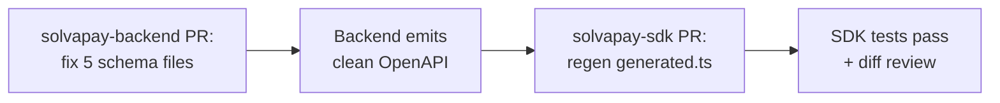

# Fix SDK-facing DTOs hit by the nestjs-zod v5 optional-record OpenAPI quirk

## Background

`z.record(...).optional()` wrapped in `createZodDto` is emitted into OpenAPI with the field in the `required` array and `selfRequired: false` on the property. Runtime `ZodValidationPipe` correctly treats it as optional, but every SDK consumer of the generated types sees the field as required. Bugbot flagged this on [solvapay-sdk#107](https://github.com/solvapay/solvapay-sdk/pull/107); we already fixed `UpdateCustomerSdkSchema.metadata` in [solvapay-backend#102](https://github.com/solvapay/solvapay-backend/pull/102). This plan closes the remaining SDK surface.

Fix pattern: `z.record(z.any()).optional()` → `z.unknown().optional()`. Every affected field is a Stripe-style opaque bag (metadata / limits / features / properties), so weakening from `Record<string, any>` to `unknown` is semantically a no-op.

## Scope

**In scope** (13 fields, 5 backend files, 1 SDK regen):

- [`src/customers/types/customer.schemas.ts:8`](solvapay-backend/src/customers/types/customer.schemas.ts) — `CreateCustomerRequest.metadata`
- [`src/products/types/product.schemas.ts`](solvapay-backend/src/products/types/product.schemas.ts) lines 54, 67, 84, 109 — `CreateProductRequest.metadata`, `UpdateProductRequest.metadata`, `McpBootstrapPlanInputSchema.features`, `McpBootstrapSchema.metadata`
- [`src/plans/types/plan.schemas.ts`](solvapay-backend/src/plans/types/plan.schemas.ts) lines 32, 33, 34, 54, 55, 59 — `CreatePlanSchema.{limits,metadata,features}`, `UpdatePlanSchema.{limits,features,metadata}`
- [`src/usage/types/usage.schemas.ts:19`](solvapay-backend/src/usage/types/usage.schemas.ts) — `CreateUsageSchema.metadata`
- [`src/usage/types/meter.schemas.ts:8`](solvapay-backend/src/usage/types/meter.schemas.ts) — `RecordMeterEventSchema.properties`

**Out of scope** (tracked but deliberately skipped):

- UI / admin DTOs (`UpdateCustomerUiDto`, `CreateProductUiDto`, `UpdateProviderUiDto`, `CreateProviderAdminDto`, `UpdateProviderAdminDto`, `UpdateUserAdminDto`, `UpdateProfileZodDto`, `UpdatePreferencesZodDto`, `CreateStripePaymentDto`, `CreateManualPayoutDto`, `CreateNotificationZodDto`, `BroadcastNotificationDto`, `TrackAnalyticsEventDto`, `ExecuteAnalyticsQueryDto`, `RefundTransactionDto`, `CreatePreregistrationZodDto`) — internal console only, no integrator impact.
- Narrower records (`customFields: z.record(z.string(), z.string())`, `parameters: z.record(z.string(), z.unknown())`) — runtime contract would weaken; leave intact.
- Array-of-any and standalone `z.any()` fields (`legalEntity.people`, `paymentProcessor.requirements`, `UpdateProviderUiDto.theme`, `CreateProductUiDto.config`) — different quirk shape; fix separately if it matters.

## Canonical replacement

```ts
metadata: z.record(z.any()).optional()
metadata: z.record(z.string(), z.any()).optional()

metadata: z.unknown().optional()
```

Same runtime semantics (anything is accepted, field is optional). Clean OpenAPI output (field drops out of `required`). Generated SDK type becomes `metadata?: unknown`.

## Rollout

Two independent PRs, both targeting `dev` on their respective repos.



### PR 1 — `solvapay-backend`

Branch: `fix/openapi-optional-record-sweep` off `dev`.

1. Apply the 13 substitutions across the 5 files above.
2. Start the local backend (hot reload or `npm run start:dev`).
3. Verify via `curl -s http://localhost:3001/v1/openapi.json | jq` that each of these schemas no longer lists the affected field in `required`:
   - `CreateCustomerRequest`, `CreateProductRequest`, `UpdateProductRequest`, `McpBootstrapDto`, `CreatePlanRequest`, `UpdatePlanRequest`, `CreateUsageRequest`, `RecordMeterEventZodDto`
4. Run affected module specs: `npx jest src/customers src/products src/plans src/usage` — validation is unchanged so all existing tests should continue to pass.
5. Commit: `fix(openapi): emit opaque-bag fields as optional in SDK DTOs`.
6. Open PR to `dev`; wait for CI + Bugbot.

### PR 2 — `solvapay-sdk`

Branch: `chore/regen-types-openapi-sweep` off `dev` (after PR 1 is merged, or chained against PR 1's branch if we want them to land together).

1. `cd packages/server && npm run generate:types` against the running backend.
2. `npx turbo run build --filter='./packages/*'` and `npm run test:unit` in `packages/server`.
3. Expected diff in [`packages/server/src/types/generated.ts`](solvapay-sdk/packages/server/src/types/generated.ts): each of the 8 affected generated types now has its metadata/limits/features/properties field annotated with `?` and typed `unknown`.
4. Commit: `chore(server): regen types — opaque-bag fields are now optional`.
5. Open PR to `dev`.

## Verification

No new tests needed. The fix is proven by:

- OpenAPI spec diff: grep `required` arrays for the affected schemas pre/post.
- Generated SDK types diff: every affected field now has `?:` and `unknown` in [`generated.ts`](solvapay-sdk/packages/server/src/types/generated.ts).
- Existing backend specs still green (runtime Zod behaviour is identical).
- Bugbot on the SDK PR should have nothing to flag since the generated types now match the hand-typed client interfaces.

## Risk

- None at runtime — `z.unknown().optional()` is a strict superset of `z.record(z.any()).optional()` at validation time.
- SDK consumers who imported and destructured the generated request types by reading `metadata` as a `Record<string, unknown>` will see it typed as `unknown` instead. No one does this in our own code (grep confirms), and the hand-typed `SolvaPayClient` interfaces — which integrators actually use — already declare these fields as optional records. Still worth a quick scan of `packages/server/src` for direct imports of generated body types.

## Follow-ups (explicitly deferred)

- Same cleanup for UI/admin DTOs — low value, cosmetic.
- Investigate a root-cause fix in nestjs-zod (upstream bug, patched fork, or version bump) — would remove the need for the `z.unknown()` workaround across the codebase.
- Clean up `z.any().optional()` standalone fields and `z.array(z.any()).optional()` nesting if they show the same quirk.