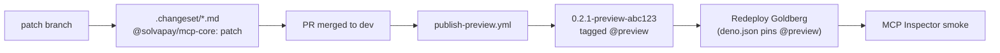
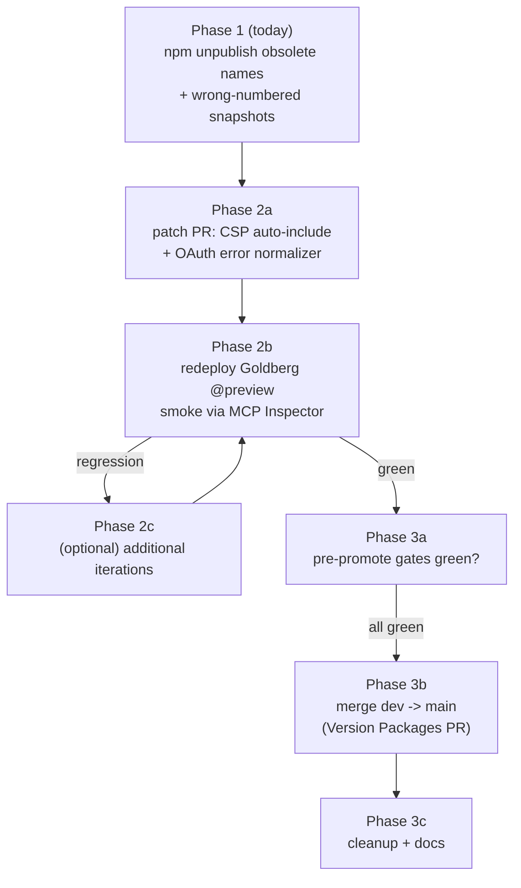

# Preview iteration + promote roadmap

Three phases, run independently. Phase 1 is time-sensitive (windows close tomorrow); Phase 2 runs on the normal PR flow; Phase 3 is gated on Phase 2 stabilising.

## Phase 1 — npm cleanup (executed 2026-04-26)

### Actual outcome

- **§1b, §1c name-level cleanup — done.** `@solvapay/fetch`, `@solvapay/mcp-fetch`, `@solvapay/mcp-express` are gone; `npm view @solvapay/<name>` returns `E404` on all three. Deleted via the npmjs.com web UI's per-package "Delete Package" button.
- **§1d version-level cleanup — deferred.** Ten wrong-numbered preview snapshots remain on `mcp`, `mcp-core`, `react`, `react-supabase`, `server`. See rationale below.

### Why the CLI path failed

The @solvapay org enforces package-level `mfa=publish` on all scoped packages, and the maintainer account (`tommy-solvapay`) has `two-factor auth: disabled`. Every mutating op (unpublish, deprecate, `npm access set mfa=*`) hits a 403 because:

1. The package requires an OTP.
2. The account has no TOTP secret registered to generate one.
3. `npm access set mfa=none` is itself a write op → also 403.

The web UI does expose a per-*package* delete (used for §1b), but does not expose a per-*version* delete button, so the ten orphan snapshots couldn't be cleared by hand.

### Why the remaining orphans are cosmetic only

The ten `1.0.0-preview-*` / `2.0.0-preview-*` / `1.1.0-preview-*` versions are not pointed to by any dist-tag:

- `@latest` → the real stable (`0.1.0` / `1.0.7`).
- `@preview` → the correct next-minor (`0.2.0` / `1.0.11-preview-e89911bc...` / `1.0.8`).

Consumers never resolve them via `npm i`, `npm i @preview`, `npm outdated`, or semver ranges. Only a literal pinned install (`npm i @solvapay/mcp@1.0.0-preview-4a7c...`) would land on one, which no one does.

The only real cost of leaving them:

- Cosmetic noise in `npm view @solvapay/<pkg> versions --json` output.
- `1.0.0-preview-*` on `mcp`/`mcp-core`, `2.0.0-preview-*` on `react`/`react-supabase`, and `1.1.0-preview-*` on `server` are burnt — a future publish at any of those exact strings fails `EVERSIONEXISTS`. Our publish pipeline always appends a fresh commit SHA so collision is impossible.

### 1d (deferred) — the original plan, re-runnable once 2FA is enabled

The ten targets are enumerated below for whoever comes back to this. By then the 72h unpublish windows will have elapsed (closed 2026-04-28 16:45 UTC for all ten), so the fallback is `npm deprecate`:

```bash
# Once tommy-solvapay has 2FA enrolled (authenticator app or WebAuthn),
# `npm whoami` returns the username, and `npm access set mfa=publish` can
# be round-tripped, these ten versions can be deprecated with a message
# that steers anyone who stumbles into them toward the correct @preview.

for sha in 6937fcbe75dae6a35c37625a329a2531ae972b11 4a7c769f90e0a4169dd30338d9139a3631aa6906; do
  npm deprecate "@solvapay/mcp@1.0.0-preview-$sha"            'Use @solvapay/mcp@preview (0.2.x) — this was a wrong-numbered hand-set snapshot during consolidation.'
  npm deprecate "@solvapay/mcp-core@1.0.0-preview-$sha"       'Use @solvapay/mcp-core@preview (0.2.x) — this was a wrong-numbered hand-set snapshot during consolidation.'
  npm deprecate "@solvapay/react@2.0.0-preview-$sha"          'Use @solvapay/react@preview (1.0.11-preview-e89911bc...) — this was a wrong-numbered hand-set snapshot.'
  npm deprecate "@solvapay/react-supabase@2.0.0-preview-$sha" 'Use @solvapay/react-supabase@preview (1.0.x) — this was a wrong-numbered hand-set snapshot.'
  npm deprecate "@solvapay/server@1.1.0-preview-$sha"         'Use @solvapay/server@preview (1.0.x) — this was a wrong-numbered hand-set snapshot.'
done
```

`deprecate` prints a yellow warning on `npm i` but doesn't remove the version — it'd be nice-to-have eventually for hygiene, but no downstream behaviour changes without it.

## Phase 2 — Iterate on `@preview`

Two latent-bug patches, either as one combined PR or two narrow ones. Each PR carries a changeset; merging to `dev` auto-publishes a new `@preview` snapshot.



### 2a. Patch A — CSP auto-include `apiBaseUrl`

**Problem:** `SOLVAPAY_DEFAULT_CSP` in [packages/mcp-core/src/csp.ts](packages/mcp-core/src/csp.ts) only lists Stripe origins. Merchant assets served from the configured SolvaPay API origin (e.g. `https://api-dev.solvapay.com/v1/files/public/...`) get CSP-blocked by the widget iframe unless the integrator manually extends `csp.resourceDomains` — the footgun you hit during Goldberg smoke.

**Fix:** plumb the configured API origin through `buildSolvaPayDescriptors` and auto-extend `resourceDomains` + `connectDomains`. Three sub-changes:

- [packages/mcp-core/src/csp.ts](packages/mcp-core/src/csp.ts) — `mergeCsp` grows an optional second arg `apiBaseUrl?: string`. When provided, the function appends the origin (with protocol, no trailing slash) to `resourceDomains` and `connectDomains` via the same `Set`-based dedup. Keeps the callsite signature additive.

  ```ts
  export function mergeCsp(
    overrides: SolvaPayMcpCsp | undefined,
    apiBaseUrl?: string,
  ): Required<SolvaPayMcpCsp> {
    const autoOrigin = apiBaseUrl ? new URL(apiBaseUrl).origin : undefined
    // ...append autoOrigin to resourceDomains + connectDomains, dedup with Set
  }
  ```

- [packages/mcp-core/src/descriptors.ts](packages/mcp-core/src/descriptors.ts) — `buildSolvaPayDescriptors` reads `solvaPay.apiBaseUrl` (or a new explicit `apiBaseUrl` on the options bag if the client doesn't expose it) and passes it to `mergeCsp`. Confirm the source location during implementation.

- [packages/mcp-core/CHANGELOG.md](packages/mcp-core/CHANGELOG.md) — add a `## 0.2.1` entry describing the auto-include behaviour. Integrators who pass custom `csp.resourceDomains` still work (dedup on merge).

- [packages/mcp-core/__tests__/descriptors.unit.test.ts](packages/mcp-core/__tests__/descriptors.unit.test.ts) — unit test asserts the resolved CSP on the resource descriptor contains the configured API origin.

- `.changeset/csp-auto-include-api-base.md` — `@solvapay/mcp-core: patch`, narrative points at this roadmap.

- [examples/supabase-edge-mcp/supabase/functions/mcp/index.ts](examples/supabase-edge-mcp/supabase/functions/mcp/index.ts) — remove the temporary `csp: { resourceDomains: [apiBaseUrl], connectDomains: [apiBaseUrl] }` override once the SDK default covers it. Keep the deploy lean.

### 2b. Patch B — OAuth error normalizer false-positive

**Problem:** `hasOAuthErrorShape()` at [packages/mcp/src/fetch/oauth-bridge.ts](packages/mcp/src/fetch/oauth-bridge.ts) returns `true` when a body has any string `error` field, so NestJS-shaped bodies like `{ error: "Unauthorized", message: "Invalid or inactive client", statusCode: 401 }` leak through unnormalized. RFC 6749 §5.2 defines a finite set of valid token error codes; `"Unauthorized"` is not one of them. MCP clients that validate the error code surface the response as a generic "auth failed".

**Fix:** gate the early-return on `body.error` being a recognised RFC 6749 token error code.

  ```ts
  const VALID_OAUTH_TOKEN_ERROR_CODES = new Set<string>([
    'invalid_request',
    'invalid_client',
    'invalid_grant',
    'unauthorized_client',
    'unsupported_grant_type',
    'invalid_scope',
    'server_error',
    'temporarily_unavailable',
    'access_denied',
  ])

  function hasOAuthErrorShape(body: unknown): body is OAuthErrorBody {
    const err = (body as { error?: unknown } | null)?.error
    return typeof err === 'string' && VALID_OAUTH_TOKEN_ERROR_CODES.has(err)
  }
  ```

  When the check fails, control falls through to `deriveOAuthErrorCode` + `buildErrorDescription`, which map the NestJS status phrase + status code to a valid OAuth error code (e.g. 401 `"Unauthorized"` -> `invalid_client`).

- [packages/mcp/__tests__/fetch/oauth-bridge.spec.ts](packages/mcp/__tests__/fetch/oauth-bridge.spec.ts) — add a fixture where upstream returns `{ error: "Unauthorized", message: "...", statusCode: 401 }` and assert the client sees `{ error: "invalid_client", error_description: "..." }`.

- [packages/mcp/CHANGELOG.md](packages/mcp/CHANGELOG.md) — `## 0.2.1` entry.

- `.changeset/mcp-oauth-error-normalize.md` — `@solvapay/mcp: patch`.

### 2c. PR structure

Two options:

- **One combined PR** — `refactor(sdk): CSP auto-include + OAuth error normalizer` — simpler, single iteration cycle, both fixes ship on the next `@preview` snapshot.
- **Two narrow PRs** — each lands independently; cleaner bisect; two `@preview` cycles (lightweight).

My recommendation: **one combined PR**. Both are ~20-line diffs, both surfaced from the same Goldberg smoke, small blast radius.

### 2d. Per-iteration checklist (post-merge)

```bash
# 1. Confirm @preview moved
for pkg in mcp mcp-core; do
  printf '%-22s preview=%s\n' "@solvapay/$pkg" "$(npm view @solvapay/$pkg@preview version)"
done

# 2. Redeploy Goldberg (deno.json already pins @preview)
cd examples/supabase-edge-mcp && supabase functions deploy mcp --use-api

# 3. Purge any stale Deno module cache on your local (if iterating locally)
deno cache --reload 'npm:@solvapay/mcp@preview' 'npm:@solvapay/mcp-core@preview'

# 4. Smoke:
#   - MCP Inspector: https://mcp-goldberg.solvapay.com/mcp
#   - Open the upgrade widget -> merchant branding images should render (CSP fix)
#   - Try a token exchange with a bad code -> response body should be
#     { "error": "invalid_client", "error_description": "..." } not { "error": "Unauthorized" }
```

## Phase 3 — Promote `@preview` -> `@latest`

### 3a. Pre-promote gates

Block the promote until all of:

1. Goldberg `MCP Inspector` E2E round-trip: auth -> tools/list -> call `upgrade` -> widget opens -> merchant images render -> no CSP violations in the iframe console
2. Goldberg topup: either the backend-config issue on `api-dev.solvapay.com` is resolved (Stripe Connect + PAYG plan configured for `prd_30BAQH9T`) OR explicitly deferred as a backend ticket unrelated to the SDK (your call)
3. No new errors on Supabase edge function logs for the deployed `@preview` snapshot over a 24-48h observation window
4. `pnpm validate:fetch-runtime` CI gate stays green on `dev` across all iteration merges
5. At least one other integrator on `@preview` (if any) has been pinged + no regression reports

### 3b. Promotion mechanics — two options

**Option X: manual `dist-tag` promote** of whatever `@preview` version is current at promote time.

```bash
# Example — substitute the actual versions from `npm view @solvapay/mcp@preview version` etc.
npm dist-tag add @solvapay/mcp@0.2.1-preview-<commit> latest
npm dist-tag add @solvapay/mcp-core@0.2.1-preview-<commit> latest
npm dist-tag add @solvapay/server@1.0.8 latest
npm dist-tag add @solvapay/react@1.0.11-preview-<commit> latest
npm dist-tag add @solvapay/react-supabase@1.0.8 latest
```

Pros: instant, no re-publish. Cons: `@latest` ends up on a `-preview-<commit>`-suffixed version which reads as non-stable to consumers who parse versions.

**Option Y: canonical Changesets release PR** — merge `dev` into `main`; the auto-generated "Version Packages" PR accumulates every changeset since the last release and produces clean semver bumps (`0.2.1`, `1.0.9`, `1.0.11`, etc.) tagged `@latest`.

```bash
# Locally:
git checkout main
git pull
git merge origin/dev --no-edit
git push

# The version-packages.yml workflow fires, opens a "Version Packages" PR.
# Review + merge that PR; publish.yml publishes the clean versions to @latest.
```

Pros: clean version numbers on `@latest`. Cons: two-merge dance; takes slightly longer.

**Recommendation:** Option Y. The hand-set rescue was a one-time event; resuming the canonical flow means future releases read cleanly.

### 3c. Post-promote cleanup

Once `@latest` moves:

```bash
# Remove the empty-frontmatter override changeset that won't be needed anymore.
# (It's harmless to leave, but tidy.)
rm .changeset/hand-set-versions-consolidation.md

# Document the consolidation as "shipped" in the SDK docs index.
# Close PR/issue trackers referencing the old package names.
```

And the housekeeping + consolidation plan files get their `unpublish-*` todos flipped to `completed`.

## What goes where



Phases 1 and 2 are fully independent — run in parallel once Phase 1 is done. Phase 3 waits for Phase 2 to stabilise.

## Out of scope

- Fixing the topup `503` from `api-dev.solvapay.com`. This is a backend-config issue (Stripe Connect / PAYG plan on `prd_30BAQH9T`), not an SDK bug; reproduces identically on the old and new SDK. File as a separate `solvapay-backend` ticket.
- Rewriting `mcpPath` / `rewriteRequestPath` semantics in the Goldberg example. The current shape works for this deployment; the Bugbot LOW-severity comments resolved during PR #135 merge are informational, not regressions.
- Any further cascade-prevention work. The experimental changesets flag + `workspace:^` on the server peer already handle the 1.x - 1.x cases; 0.x - 0.x cascades are a known Changesets limitation and will only matter again when we bump `mcp-core` out of 0.x.