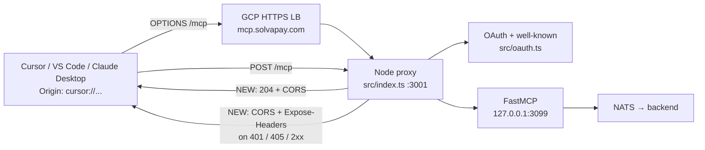

## Scope

Edit two files in [solvapay-mcp](../../solvapay-mcp):

- [src/index.ts](../../solvapay-mcp/src/index.ts) — `/mcp` proxy entry.
- [src/oauth.ts](../../solvapay-mcp/src/oauth.ts) — OAuth + `.well-known` routes.

Plus one new small module [src/cors.ts](../../solvapay-mcp/src/cors.ts) that re-implements the native-scheme CORS helpers from the SDK's [oauth-bridge.ts](../../solvapay-sdk/packages/server/src/mcp/oauth-bridge.ts) (`applyCorsHeaders`, `handlePreflight`, `isNativeClientOrigin`) — we can't import across package boundaries, so this is a deliberate, small duplication kept in sync by reviewer discipline. The helpers are <40 lines total.

Out of scope:
- `POST /authorize/callback` — already has origin-gated CORS for `FRONTEND_URL` only (oauth.ts:72-94). That's intentional (it's the browser handoff, not a native-client endpoint). Leave it alone.
- `GET /authorize` — 302 redirect to frontend with no custom request headers, no preflight needed in practice.
- Any infra / nginx / GCP LB change — not needed.
- Any backend (Nest) change — not needed.

## Root cause (same as mcp-pay + SDK bridge)

Cursor / VS Code / Claude Desktop run their MCP client in an Electron renderer with `Origin: cursor://...`, `vscode://...`, `vscode-webview://...`, `claude://...`. Their fetch sends an `OPTIONS` preflight before `POST /mcp`, `POST /token`, `POST /register`, and before `GET` on the `.well-known` docs whenever the client adds `MCP-Protocol-Version` (a non-simple header).

Today, `solvapay-mcp` responds to those preflights with whatever FastMCP or the route handler happens to do for a non-matching method — usually 400/404/405 with no `Access-Control-Allow-Origin`. The preflight fails → real request never fires → Cursor logs "Transient error connecting to streamableHttp server". Additionally, the explicit 401 on `POST /mcp` in [src/index.ts:127-136](../../solvapay-mcp/src/index.ts) sets `WWW-Authenticate` but without `Access-Control-Expose-Headers` the native-scheme client cannot read it, so OAuth discovery never kicks in.

## Changes

### 1. New [src/cors.ts](../../solvapay-mcp/src/cors.ts)

Port the three helpers from the SDK bridge, adapted to `node:http` `IncomingMessage` / `ServerResponse` (not the SDK's `RequestLike` / `ResponseLike` abstraction):

```ts
import type { IncomingMessage, ServerResponse } from 'node:http'

const NATIVE_CLIENT_ORIGIN_SCHEMES = [
  'cursor:', 'vscode:', 'vscode-webview:', 'claude:',
] as const

function getHeader(req: IncomingMessage, name: string): string | null {
  const v = req.headers[name.toLowerCase()]
  if (typeof v === 'string') return v
  if (Array.isArray(v)) return v[0] ?? null
  return null
}

function isNativeClientOrigin(origin: string): boolean {
  try {
    const u = new URL(origin)
    return NATIVE_CLIENT_ORIGIN_SCHEMES.includes(
      u.protocol as (typeof NATIVE_CLIENT_ORIGIN_SCHEMES)[number],
    )
  } catch {
    return false
  }
}

export function applyMcpCorsHeaders(req: IncomingMessage, res: ServerResponse): void {
  const origin = getHeader(req, 'origin')
  if (!origin || !isNativeClientOrigin(origin)) return
  res.setHeader('Access-Control-Allow-Origin', origin)
  res.setHeader('Vary', 'Origin')
  res.setHeader('Access-Control-Expose-Headers', 'WWW-Authenticate, Mcp-Session-Id')
}

export function handleMcpPreflight(req: IncomingMessage, res: ServerResponse): void {
  applyMcpCorsHeaders(req, res)
  const method = getHeader(req, 'access-control-request-method') ?? 'POST'
  const headers = getHeader(req, 'access-control-request-headers')
    ?? 'authorization, content-type, mcp-protocol-version, mcp-session-id, accept'
  res.setHeader('Access-Control-Allow-Methods', `${method}, GET, POST, OPTIONS`)
  res.setHeader('Access-Control-Allow-Headers', headers)
  res.setHeader('Access-Control-Max-Age', '600')
  res.setHeader('Content-Length', '0')
  res.writeHead(204)
  res.end()
}
```

Same mirror-origin-back semantics as the SDK and the mcp-pay nginx plan — exact echo, not `*`, because Electron custom-scheme origins don't work with wildcard.

### 2. [src/index.ts](../../solvapay-mcp/src/index.ts)

At the top of the request handler (before `handleOAuthRoute`):

```ts
if (clientReq.method === 'OPTIONS' && (pathname === '/mcp' || pathname.startsWith('/mcp/'))) {
  handleMcpPreflight(clientReq, clientRes)
  return
}
```

On the explicit 401 branch (currently lines 127-136) and on the proxied response (line 163), call `applyMcpCorsHeaders(clientReq, clientRes)` before `writeHead`. For the proxied path, also merge the CORS headers into the `headers` object we pass to `clientRes.writeHead(statusCode, headers)` so they survive.

Also add `applyMcpCorsHeaders` to the `GET /mcp → 405` branch (line 104) so native-scheme clients aren't confused by a CORS-less 405 during capability probing.

### 3. [src/oauth.ts](../../solvapay-mcp/src/oauth.ts)

Wire preflight + CORS into each handler. Concretely:

- Route `handleOAuthRoute` (lines 177-210): before the path/method switch, if `req.method === 'OPTIONS'` for any path we own (`/.well-known/oauth-authorization-server`, `/.well-known/oauth-protected-resource`, `/token`, `/register`), call `handleMcpPreflight(req, res)` and return `true`.
- `handleMetadata` (line 216) and `handleProtectedResource` (line 235): call `applyMcpCorsHeaders(req, res)` before `json(res, 200, ...)`.
- `handleToken` (line 362) and `handleRegister` (line 403): call `applyMcpCorsHeaders(req, res)` before every `json(res, ...)` (success and error cases). Replace `json(res, status, body)` with a small `jsonWithCors(req, res, status, body)` helper to avoid sprinkling the call everywhere.

Leave `handleAuthorize` (302 redirect) and the existing `handleAuthorizeCallback` logic untouched.

### 4. Tests

Add [test/cors.test.ts](../../solvapay-mcp/test/cors.test.ts) covering:

- `isNativeClientOrigin` accepts `cursor://x`, `vscode://x`, `vscode-webview://x`, `claude://x`; rejects `https://evil.com`, `null`, garbage.
- `applyMcpCorsHeaders` mirrors the origin only for native schemes and sets `Vary: Origin` + `Expose-Headers`.
- `handleMcpPreflight` returns 204 with `Access-Control-Allow-Methods`/`-Headers`/`-Max-Age` set, mirroring `Access-Control-Request-*` headers.

Add integration coverage in a new [test/oauth.test.ts](../../solvapay-mcp/test/oauth.test.ts) that boots `handleOAuthRoute` with mock `IncomingMessage`/`ServerResponse` and asserts `OPTIONS` on each of the four routes returns 204 with CORS headers, and that `GET /.well-known/*` + `POST /token` + `POST /register` carry `Access-Control-Allow-Origin` when `Origin: cursor://smoke` is sent.

No new runtime dependency — keep using the `node:http` primitives already in use.

## Verification

After deploying to dev (`mcp.dev.solvapay.com`):

```bash
# 1. OPTIONS /mcp with native origin → 204 + CORS
curl -i -X OPTIONS -H 'Origin: cursor://smoke' \
  -H 'Access-Control-Request-Method: POST' \
  -H 'Access-Control-Request-Headers: authorization, content-type' \
  https://mcp.dev.solvapay.com/mcp

# 2. POST /mcp unauth with native origin → 401 + WWW-Authenticate + CORS + Expose-Headers
curl -i -X POST -H 'Origin: cursor://smoke' -H 'Content-Type: application/json' \
  -d '{"jsonrpc":"2.0","id":1,"method":"tools/call"}' \
  https://mcp.dev.solvapay.com/mcp

# 3. Discovery + preflight on the two well-known docs
curl -i -X OPTIONS -H 'Origin: cursor://smoke' \
  https://mcp.dev.solvapay.com/.well-known/oauth-authorization-server
curl -i -H 'Origin: cursor://smoke' \
  https://mcp.dev.solvapay.com/.well-known/oauth-protected-resource

# 4. Preflight on /token and /register
curl -i -X OPTIONS -H 'Origin: cursor://smoke' \
  -H 'Access-Control-Request-Method: POST' \
  -H 'Access-Control-Request-Headers: content-type' \
  https://mcp.dev.solvapay.com/token
curl -i -X OPTIONS -H 'Origin: cursor://smoke' \
  -H 'Access-Control-Request-Method: POST' \
  -H 'Access-Control-Request-Headers: content-type' \
  https://mcp.dev.solvapay.com/register

# 5. Regression: non-native origin (https://evil.com) must NOT receive Access-Control-Allow-Origin
curl -i -X OPTIONS -H 'Origin: https://evil.com' \
  -H 'Access-Control-Request-Method: POST' \
  https://mcp.dev.solvapay.com/mcp

# 6. End-to-end: add https://mcp.dev.solvapay.com/mcp to Cursor, confirm
#    - No "Transient error"
#    - DCR POST /register returns 201
#    - Authorize → frontend → callback → /token exchange succeeds
#    - tools/list succeeds
```

Expected for (1): `204`, `Access-Control-Allow-Origin: cursor://smoke`, `Access-Control-Allow-Methods: POST, GET, POST, OPTIONS` (or similar, with `OPTIONS` present), `Access-Control-Max-Age: 600`.

Expected for (2): `401`, `WWW-Authenticate: Bearer resource_metadata="https://mcp.dev.solvapay.com/.well-known/oauth-protected-resource"`, `Access-Control-Allow-Origin: cursor://smoke`, `Access-Control-Expose-Headers: WWW-Authenticate, Mcp-Session-Id`.

Expected for (5): response has no `Access-Control-Allow-Origin` header (the `applyMcpCorsHeaders` no-op path).

## Data flow reference

