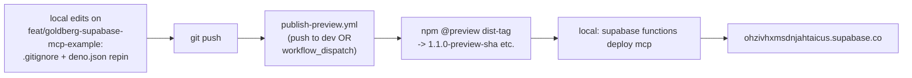

## Why the deploy is currently boot-erroring

`supabase functions deploy` ships source only; Supabase's edge runtime resolves `@solvapay/*` imports from npm at boot using the import map in [supabase/functions/mcp/deno.json](solvapay-sdk/examples/supabase-edge-mcp/supabase/functions/mcp/deno.json). No workspace code crosses the wire.

The published `@solvapay/mcp-core@0.1.0` imports 16 `*Core` helpers from `@solvapay/server`, but the published `@solvapay/server@1.0.8-preview.10` tarball is missing `getPaymentMethodCore` and `getUsageCore` (they only exist in the workspace source). The pending [.changeset/text-only-paywall.md](solvapay-sdk/.changeset/text-only-paywall.md) already captures all of these changes as a `minor` bump — we just need to let the automation ship it.

## How publishing actually works in this repo

[.github/workflows/publish-preview.yml](solvapay-sdk/.github/workflows/publish-preview.yml) does the full snapshot publish end-to-end: `pnpm changeset version --snapshot preview && pnpm changeset publish --tag preview --no-git-tag`. Triggers are push-to-`dev` or `workflow_dispatch`. No local `pnpm changeset:*` commands needed, no `npm login` needed.

The `@preview` npm dist-tag is a mutable pointer to the latest snapshot — the root [solvapay-sdk/.gitignore](solvapay-sdk/.gitignore) documents this explicitly: "We pin workspace imports to `@preview` dist-tags on purpose (mutable; each gate run should pick up the latest preview)". The `daaf461` commit's explicit `@1.0.8-preview.10` pins in [deno.json](solvapay-sdk/examples/supabase-edge-mcp/supabase/functions/mcp/deno.json) were my session hotfix — we undo that to restore the canonical shape.



The only genuinely-local step is `supabase functions deploy mcp` because the project link + auth live in `supabase/.temp/` on your machine, and no workflow here is wired to deploy to Supabase.

## Steps

### 1. Branch + gitignore cleanup

- `cd solvapay-sdk`
- `git checkout feat/goldberg-supabase-mcp-example` — HEAD is commit `daaf461`. All the trimmed demo-tools / `config.toml` / temporary `deno.json` pin / README edits from the earlier session are already there.
- Append to [examples/supabase-edge-mcp/.gitignore](solvapay-sdk/examples/supabase-edge-mcp/.gitignore):

  ```
  # Supabase CLI machine-local state (project-ref, linked-project.json,
  # upstream version pins). Written by `supabase link` / every subsequent
  # CLI call against the linked project. Not portable across developers.
  supabase/.temp/
  ```

- Untrack what `daaf461` snapshotted (keeps files on disk so the `supabase` CLI keeps working):

  ```bash
  git rm --cached -r examples/supabase-edge-mcp/supabase/.temp/
  ```

### 2. Repin [deno.json](solvapay-sdk/examples/supabase-edge-mcp/supabase/functions/mcp/deno.json) to `@preview`

```json
"@solvapay/mcp": "npm:@solvapay/mcp@preview",
"@solvapay/mcp-core": "npm:@solvapay/mcp-core@preview",
"@solvapay/mcp-fetch": "npm:@solvapay/mcp-fetch@preview",
"@solvapay/server": "npm:@solvapay/server@preview",
```

### 3. Commit + push

Two tidy commits on top of `daaf461`:

```bash
git add examples/supabase-edge-mcp/.gitignore
git rm --cached -r examples/supabase-edge-mcp/supabase/.temp/
git commit -m "chore(example): gitignore supabase CLI machine-local state"

git add examples/supabase-edge-mcp/supabase/functions/mcp/deno.json
git commit -m "chore(supabase-edge-mcp): repin deno.json to @preview dist-tag"

git push -u origin feat/goldberg-supabase-mcp-example
```

### 4. Kick the publish automation

Pick one:

- **Preferred (conventional):** open PR `feat/goldberg-supabase-mcp-example` -> `dev`, get it reviewed, merge. `publish-preview.yml` runs on the `dev` push and snapshot-publishes.
- **Faster (one-off, ok for an event crunch):** `gh workflow run publish-preview.yml --ref feat/goldberg-supabase-mcp-example`. Same workflow body, runs against the branch ref directly. Still open the PR afterwards so the branch lands on `dev` and future pushes behave the same.

Either way, the Deno gate (`pnpm --filter @example/supabase-edge-mcp validate`) uses the workspace `file:` resolution in [deno.local.json](solvapay-sdk/examples/supabase-edge-mcp/supabase/functions/mcp/deno.local.json), not `@preview`, so it'll pass even while the current `@preview` tarballs are broken.

### 5. Watch CI + confirm the new `@preview`

```bash
gh run watch --exit-status $(gh run list --workflow=publish-preview.yml --branch feat/goldberg-supabase-mcp-example --limit 1 --json databaseId --jq '.[0].databaseId')

npm view @solvapay/server dist-tags
# actual:  { latest: '1.0.7', preview: '1.1.0-preview-<shortsha>' }

npm view @solvapay/mcp-core dist-tags
# actual:  { latest: '0.1.0', preview: '1.0.0-preview-<shortsha>' }   ← major bump, not 0.2.0

npm view @solvapay/react dist-tags
# actual:  { latest: '1.0.9', preview: '2.0.0-preview-<shortsha>' }   ← major bump, not 1.1.0
```

If `@preview` still points at the old 0.1.0 / preview.10 versions, something gated the publish — inspect `gh run view --log`.

**Versioning reality check.** The initial draft of this plan expected `@preview` to land at `0.2.0-preview-<sha>` for `@solvapay/mcp-core` / `@solvapay/mcp` and `1.1.0-preview-<sha>` for `@solvapay/react`. That was wrong: Changesets actually resolves this release to a **major** bump for all three, via the peer-dependency cascade documented in [`.changeset/migration-hand-set-versions.md`](solvapay-sdk/.changeset/migration-hand-set-versions.md) — every `@solvapay/*` cross-package relationship is pinned on `peerDependencies: workspace:*` (exact pin at publish time), so the moment `@solvapay/server` bumps `1.0.8-preview.10 → 1.1.0` the peer range is out of range and all dependents must major-bump. The 0.x packages compound this — `^0.1.0` does not include `0.2.0` in standard semver, so any minor on a 0.x package cascades to major on its peers regardless.

Running `pnpm changeset status --verbose` on the branch shows the real plan:

```
minor: @solvapay/server 1.1.0
major: @solvapay/mcp-core 1.0.0, @solvapay/mcp 1.0.0, @solvapay/react 2.0.0
major (peer cascade): @solvapay/mcp-express 1.0.0, @solvapay/mcp-fetch 1.0.0, @solvapay/react-supabase 2.0.0
```

This is semver-correct. The next Version Packages PR on `main` will publish these as stable 1.0.0 / 1.1.0 / 2.0.0 — explicitly accepted.

### 6. Local redeploy

```bash
rm -rf examples/supabase-edge-mcp/supabase/functions/mcp/node_modules \
       examples/supabase-edge-mcp/supabase/functions/mcp/deno.lock

pnpm --filter @example/supabase-edge-mcp build
pnpm --filter @example/supabase-edge-mcp run deploy
```

The cache clear is important: Deno's npm cache in `node_modules/.deno/` is keyed by resolved version, so it'll happily keep serving the broken preview.10 tarball after the `@preview` tag moves. Nuking forces re-resolution.

### 7. Verify live

```bash
curl -s https://ohzivhxmsdnjahtaicus.supabase.co/functions/v1/mcp/.well-known/oauth-authorization-server | jq .
```

Expected: a full OAuth discovery document with `"issuer": "https://ohzivhxmsdnjahtaicus.supabase.co/functions/v1/mcp"`. No more `BOOT_ERROR`.

Exercise the MCP endpoint with the Inspector:

```bash
npx @modelcontextprotocol/inspector
# URL: https://ohzivhxmsdnjahtaicus.supabase.co/functions/v1/mcp
```

Tool list -> expect `predict_price_chart`, `predict_direction`, `upgrade`, `manage_account`, `topup`.

## Gotchas actually hit while executing this plan

Three issues weren't in the original plan but came up live; recorded here so the next pass is one-shot:

1. **NPM_TOKEN rotation.** Every `publish-preview.yml` run since PR #128 (`ci/harden-publish-workflow`) 404'd with `npm error 404 Not Found - PUT https://registry.npmjs.org/@solvapay%2fserver`. The `NPM_TOKEN` secret had expired; npm returns 404 (not 403) for unauthenticated publishes. Refreshed in repo Settings → Secrets → Actions before re-running. Needs an **Automation token** (classic or granular) with publish scope for the whole `@solvapay` org.

2. **`@solvapay/server` edge-entrypoint export gap.** `@solvapay/mcp-core@1.0.0-preview-*` imports `buildNudgeMessage` and `isPaywallStructuredContent` from `@solvapay/server`. Under Deno the `deno` export condition resolves to `./dist/edge.js`, which never re-exported those symbols — boot crashed with `SyntaxError: The requested module '@solvapay/server' does not provide an export named 'buildNudgeMessage'`. Fixed by re-exporting the paywall-state engine + type-guard + shared payment types from `packages/server/src/edge.ts` (see commit `4a7c769`). Shipped as a patch-level changeset (`.changeset/server-edge-exports.md`).

3. **Two deploy-time environment mismatches**, both in `supabase-edge-mcp` (commit `5f6b487`):
   - `supabase functions deploy`'s eszip bundler only ships `.ts` / `.json` source by default. The `mcp-app.html` iframe asset has to be declared in `supabase/config.toml` under `[functions.mcp]` as `static_files = ["./functions/mcp/mcp-app.html"]` — otherwise every request returns `WORKER_ERROR` once the boot-time `await Deno.readTextFile(new URL('./mcp-app.html', import.meta.url))` fails with `path not found`.
   - Supabase's edge gateway strips `/functions/v1` before the request reaches the function, so `req.url`'s pathname looks like `/mcp/…`, not `/functions/v1/mcp/…`. The `@solvapay/mcp-fetch` handler matches routes against the pathname verbatim, so `.well-known/*` and `/oauth/*` never match without stripping the `/mcp` segment first and setting `mcpPath: '/'` on the handler. `MCP_PUBLIC_BASE_URL` stays `https://<proj>.supabase.co/functions/v1/mcp` so the OAuth issuer / endpoint URLs emitted to clients are correct.

## Risks + fallbacks

- **Publish-preview workflow fails on an unrelated test**: fix forward; nothing published yet means nothing to unwind. If it's a genuinely stuck test, `workflow_dispatch` re-runs are cheap.
- **Stable release timing**: the [text-only-paywall.md](solvapay-sdk/.changeset/text-only-paywall.md) changeset still sits in `.changeset/` after the snapshot publish (snapshots don't delete changesets). It'll be consumed by the next Version Packages PR on `main` as a proper `@solvapay/server@1.1.0` + `@solvapay/mcp-core@1.0.0` + `@solvapay/mcp@1.0.0` + `@solvapay/react@2.0.0` stable release (plus cascade: `@solvapay/mcp-express@1.0.0`, `@solvapay/mcp-fetch@1.0.0`, `@solvapay/react-supabase@2.0.0`) — see "Versioning reality check" above. Accepted.
- **Rollback**: if the new snapshot boots but misbehaves, pin `deno.json` temporarily to `npm:@solvapay/server@1.0.8-preview.10` (matching daaf461) and redeploy. The Lovable landing URL doesn't change because the Supabase project is unchanged.
