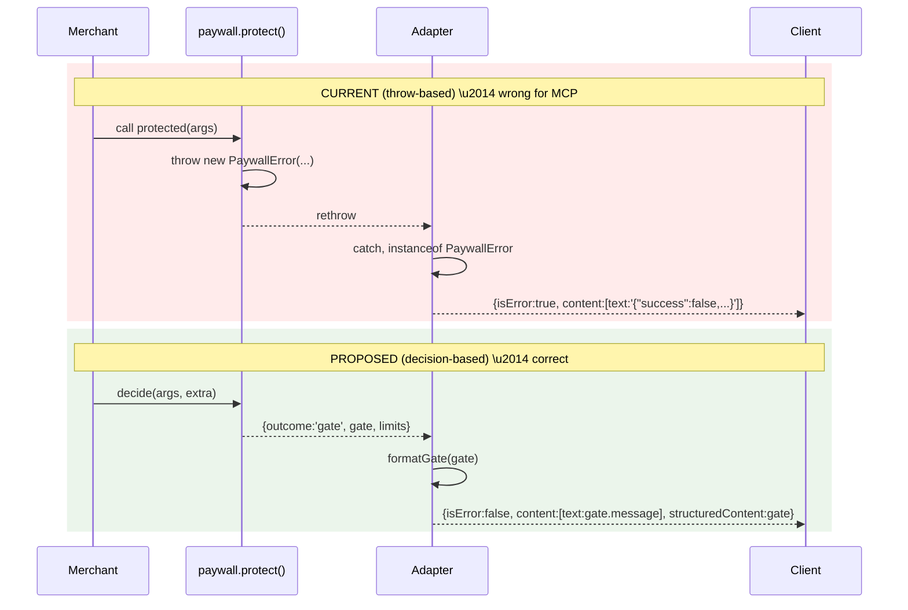

# Paywall UI not mounting \u2014 root-cause fix

## TL;DR

- **Branch:** `feature/mcp-app-self-explanatory` (continuing, not new). Four sequential commits, each gated by a passing test suite. No PR split.
- **Symptom:** paywall widget never mounts in the MCP inspector when a plan needs activation. User sees the raw JSON result instead of the activation UI.
- **Surface cause (fixed in C1):** the `hostRenders: true` opt-in on the two Oracle demo tools strips `_meta.ui.resourceUri` from `tools/list`, blinding descriptor-reading hosts (MCPJam) to the widget's existence \u2014 even when the paywall response itself advertises the UI.
- **Root cause (fixed in C2\u2013C4):** the SolvaPay paywall uses `throw new PaywallError` as its gate signal, which forces every adapter to serialise `{success:false,"error":"Payment required"}` into MCP `content[0].text` and stamp `isError: true`. MCP hosts short-circuit both signals and suppress widget opens. The in-progress branch's `@solvapay/mcp` wrapper already rewrites these fields defensively, but only for consumers using the full SDK stack \u2014 custom adapters, FastMCP-style integrators, and `@solvapay/server`-only consumers still leak the failure shape.

## Spec grounding

The design choice to emit `isError: false` for paywall responses is grounded in the MCP specification's own definition of `isError`. From [Tools \u00a7 Error Handling (2025-11-25)](https://modelcontextprotocol.io/specification/2025-11-25/server/tools#error-handling) (identical wording in the draft):

> Tool Execution Errors **contain actionable feedback that language models can use to self-correct and retry with adjusted parameters**:
> - API failures
> - Input validation errors (e.g., date in wrong format, value out of range)
> - Business logic errors
>
> They are reported in tool results with `isError: true`.
>
> Clients SHOULD provide tool execution errors to language models to enable self-correction.

Paywall responses do not fit this definition:

- **Not self-correctable.** No parameter adjustment resolves a paywall; the user must complete payment out-of-band (checkout URL / activation flow). The LLM cannot "retry with adjusted parameters."
- **Not a retry target.** Paywall is a terminal control transfer to the UI, not a nudge to the model.
- **`isError: true` is an LLM-directed signal.** The spec nowhere ties `isError: true` to host UI suppression. Hosts that suppress `_meta.ui.resourceUri` opens on `isError: true` (MCPJam observed) are making a non-spec editorial choice, so relying on `isError: true` to open host UI is architecturally backwards in both directions.
- **`isError: false` with `structuredContent` is legitimate.** The spec describes `structuredContent` as a first-class return channel and says nothing that precludes pairing it with `isError: false` when the semantic is "no data this call; here's the gate payload."

**Honest caveat:** the spec lists "business logic errors" under `isError: true`, which a reader could apply broadly to include paywall. The tiebreaker is the rationale clause quoted above: `isError: true` is for feedback that enables self-correction and retry. Paywall does not fit that rationale.

Two spec requirements the refactor honours regardless of the `isError` choice:

1. **`content[0]` MUST be LLM-actionable text.** The spec says tool result content should help the LLM understand and act on the outcome. Today's serialized `{"success":false,"error":"Payment required",...}` JSON blob fails this \u2014 it's machine-readable junk, not natural-language narration. `formatGate` emits `gate.message` ("You've used all your included calls on the Pro plan. Visit the checkout URL to upgrade."), which is LLM-actionable.
2. **`structuredContent` is the correct channel for the paywall payload.** The paywall's `{view:'paywall', productRef, checkoutUrl, ...}` machine-readable shape belongs in `structuredContent`; unchanged between band-aid and refactor.

MCP Apps layer ([blog.modelcontextprotocol.io/posts/2026-01-26-mcp-apps](https://blog.modelcontextprotocol.io/posts/2026-01-26-mcp-apps)) defines `_meta.ui.resourceUri` on the tool descriptor and `ui/notifications/tool-result` as the bridge to the iframe. It does **not** define `isError`-based widget gating. Per the contract, a paywall widget SHOULD open regardless of `isError`; the fact that MCPJam suppresses it is a host-side quirk and a bug to work around in our emissions, not a spec signal to follow.

## Architectural assessment



Paywall is deterministic control flow, not an exception. Five concrete problems with the throw-based design:

1. **Serialisation leak** \u2014 `formatError` JSON-stringifies `paywallErrorToClientPayload` into MCP `content[0].text`, producing the `{success:false,"error":"Payment required"}` blob that MCPJam treats as a failure signal.
2. **`isError: true` contamination** \u2014 MCP hosts short-circuit `isError: true` and suppress `_meta.ui` triggers. We're lying to the protocol.
3. **Brittle `instanceof` across package boundaries** \u2014 9 `instanceof PaywallError` sites in the SDK plus every custom adapter a merchant writes. Bundler module-dedup hazards.
4. **Stack-trace cost** on every paywall hit.
5. **Type safety** \u2014 a thrown `Error` is invisible to TypeScript; a `PaywallDecision` union is exhaustively checkable.

## Target shape

```ts
export type PaywallDecision<T> =
  | { outcome: 'allow'; args: T; limits: LimitResponseWithPlan; customerRef: string }
  | { outcome: 'gate'; gate: PaywallStructuredContent; limits: LimitResponseWithPlan | null }

class SolvaPayPaywall {
  async decide<T>(args: T, metadata): Promise<PaywallDecision<T>>
  async protect(handler, metadata, getCustomerRef): (args) => Promise<TResult>  // kept
}

interface Adapter<TContext, TResult> {
  extractArgs(ctx): Promise<Record<string, unknown>>
  getCustomerRef(ctx, extra?): Promise<string>
  formatResponse(result, ctx): TResult
  formatGate(gate: PaywallStructuredContent, ctx): TResult   // NEW
  formatError(error: Error, ctx): TResult                    // narrowed
}
```

`McpAdapter.formatGate` emits the new clean shape:

```ts
formatGate(gate: PaywallStructuredContent): PaywallToolResult {
  return {
    content: [{ type: 'text', text: gate.message }],
    isError: false,
    structuredContent: gate,
  }
}
```

HTTP + Next `formatGate` preserves the `{success:false, error, ...}` JSON body \u2014 REST consumers expect that shape; MCP does not.

## Commit sequence

```mermaid
flowchart TB
  Current[feature/mcp-app-self-explanatory<br/>HEAD: e3a6380 feat(mcp-react): paywall surface parity]
  C1[C1 \u2014 fix(mcp): always advertise _meta.ui.resourceUri on payable descriptors<br/>Band-aids retained<br/>Paywall UI renders on inspector]
  C2[C2 \u2014 refactor(server): introduce PaywallDecision and paywall.decide() scaffold<br/>Pure additive, zero consumer impact]
  C3[C3 \u2014 refactor(server,mcp): route paywall through formatGate instead of throw/catch<br/>Band-aids removed as dead code]
  C4[C4 \u2014 refactor(server): drop internal PaywallError throws; keep as compat shim<br/>Docs + deprecation notes]
  Backend[Out-of-band ticket \u2014 align hosted proxy response shape]

  Current --> C1 --> C2 --> C3 --> C4
  C3 -.tracking.-> Backend
```

Each commit is independently revertable via `git revert`. Each commit runs the full test suite BEFORE the commit \u2014 we commit only if the suite is green.

### Commit protocol

For each commit:

1. Apply the file edits for that commit.
2. Run `pnpm -r test` (full workspace) \u2014 must be green.
3. Run the e2e check relevant to that commit (descriptor log for C1, paywall repro for C1+C3).
4. `git add -A && git commit -m "<conventional commit message>"`.
5. Move to the next commit. If a later commit fails tests, `git revert HEAD` to roll back to the last green state rather than force-fixing in place.

No force-push. No rebase across commits unless the user explicitly asks. Commits land directly on `feature/mcp-app-self-explanatory`.

---

## C1 \u2014 `hostRenders` revert + band-aid retention

Atomic fix for the surface symptom. No architectural changes.

### Root cause (C1 scope)

The backend log shows `predict_price_chart` descriptor is empty:

```
[mcp-checkout-app] descriptor predict_price_chart {
  _meta: {},
  annotations: { readOnlyHint: true, openWorldHint: true, idempotentHint: true }
}
```

Caused by `hostRenders: true` on both Oracle demo tools in [examples/mcp-checkout-app/src/demo-tools.ts](examples/mcp-checkout-app/src/demo-tools.ts), which [packages/mcp-sdk/src/registerPayableTool.ts](packages/mcp-sdk/src/registerPayableTool.ts) translates into:

```215:227:packages/mcp-sdk/src/registerPayableTool.ts
  const suppressDefaultResource = hostRenders === true && !('resourceUri' in baseUi)
  const hasIcons = icons !== undefined && icons.length > 0
  const mergedUi: Record<string, unknown> = {
    ...(suppressDefaultResource ? {} : { resourceUri }),
    ...baseUi,
    ...(hasIcons ? { icons } : {}),
  }
  const toolMeta: Record<string, unknown> =
    Object.keys(mergedUi).length > 0 ? { ...baseMeta, ui: mergedUi } : baseMeta
```

Descriptor-reading hosts (MCPJam, MCP App inspector) never learn a widget exists, so paywall results \u2014 which DO stamp result-level `_meta.ui` \u2014 fall through as raw JSON.

### Audit of in-progress working tree

- **Keep unchanged (orthogonal fixes):**
  - [packages/mcp/src/paywallToolResult.ts](packages/mcp/src/paywallToolResult.ts) \u2014 `isError: false`.
  - [packages/mcp/src/payable-handler.ts](packages/mcp/src/payable-handler.ts) \u2014 `isError: false` + narration text replacing `{success:false}` JSON blob.
  - [packages/react/src/mcp/bootstrap.ts](packages/react/src/mcp/bootstrap.ts) \u2014 accepts both `isError: true` (old) and `false` (new).
  - [packages/react/src/mcp/McpApp.tsx](packages/react/src/mcp/McpApp.tsx) \u2014 `requestTeardown()` timeout fallback. Trim comment to drop `hostRenders` reference.
  - Test files for all of the above.
  - [examples/mcp-checkout-app/src/server.ts](examples/mcp-checkout-app/src/server.ts) \u2014 `SOLVAPAY_DEBUG=true` descriptor dump. Add a top-level comment marking it as a debug-only escape hatch.
- **Partial revert:**
  - [packages/mcp-sdk/__tests__/create-solvapay-mcp-server.unit.test.ts](packages/mcp-sdk/__tests__/create-solvapay-mcp-server.unit.test.ts) \u2014 keep the renamed `auto-stamps _meta.ui.resourceUri on merchant payable tools` test; delete the three `hostRenders`-specific tests.
- **Full revert:**
  - [packages/mcp-sdk/src/registerPayableTool.ts](packages/mcp-sdk/src/registerPayableTool.ts) \u2014 delete `hostRenders` field + suppression branch. Restore unconditional `ui.resourceUri` injection.
  - [examples/mcp-checkout-app/src/demo-tools.ts](examples/mcp-checkout-app/src/demo-tools.ts) \u2014 drop `hostRenders: true` from `predict_price_chart` and `predict_direction`; keep Oracle tool logic.
  - [examples/mcp-checkout-app/README.md](examples/mcp-checkout-app/README.md) \u2014 rewrite the "Host-rendered artifacts" bullet.

### C1 final shape of `registerPayableTool`

```ts
const baseMeta = meta ?? {}
const baseUi = (baseMeta.ui as Record<string, unknown> | undefined) ?? {}
const hasIcons = icons !== undefined && icons.length > 0
const mergedUi: Record<string, unknown> = {
  resourceUri,
  ...baseUi,
  ...(hasIcons ? { icons } : {}),
}
const toolMeta: Record<string, unknown> = { ...baseMeta, ui: mergedUi }
```

### C1 verification

1. **Build:** `pnpm --filter @solvapay/mcp-sdk build`, `pnpm --filter @solvapay/mcp build`, `pnpm --filter @solvapay/react build`.
2. **Unit tests:** `pnpm --filter @solvapay/mcp-sdk test`, `pnpm --filter @solvapay/mcp test`, `pnpm --filter @solvapay/react test --run McpApp.paywallEntry`.
3. **Descriptor log:** `SOLVAPAY_DEBUG=true pnpm --filter @example/mcp-checkout-app start`, then grep the log for `descriptor predict_price_chart` \u2014 should now show `_meta.ui.resourceUri`.
4. **E2E repro:** invoke `predict_price_chart AAPL 30` against the zero-balance customer from the screenshot. Paywall widget mounts.
5. **Regression:** `get_market_quote BTCUSDT`, `activate_plan`, post-activation `predict_direction NVDA 10` all behave correctly.

Commit message: `fix(mcp): always advertise _meta.ui.resourceUri on payable descriptors`

---

## C2 \u2014 `PaywallDecision` scaffold (pure additive)

Land the type + `decide()` method without changing observable behaviour. Safe checkpoint.

### Files touched

- [packages/server/src/types/paywall.ts](packages/server/src/types/paywall.ts) \u2014 add `PaywallDecision<T>` export:

```ts
export type PaywallDecision<T> =
  | {
      outcome: 'allow'
      args: T
      limits: LimitResponseWithPlan
      customerRef: string
    }
  | {
      outcome: 'gate'
      gate: PaywallStructuredContent
      limits: LimitResponseWithPlan | null
    }
```

- [packages/server/src/paywall.ts](packages/server/src/paywall.ts) \u2014 add `SolvaPayPaywall.decide()` method that performs the pre-check and returns a `PaywallDecision` instead of throwing. Refactor existing `protect()` to call `decide()` internally and `throw new PaywallError(gate)` on `gate` outcomes \u2014 behaviour is byte-identical to today.

### C2 verification

- All existing tests still green, no rewrites.
- New unit tests added for `decide()` covering allow / activation_required / payment_required paths.
- `pnpm -r test` green.

Commit message: `refactor(server): introduce PaywallDecision and paywall.decide() scaffold`

---

## C3 \u2014 Adapters consume `decide()` directly; band-aids removed

The substantive change.

### Files touched

- [packages/server/src/adapters/base.ts](packages/server/src/adapters/base.ts)
  - Extend `Adapter<TContext, TResult>` with `formatGate(gate, ctx): TResult`.
  - Rewrite `createAdapterHandler` to call `paywall.decide()` first; on `gate` call `adapter.formatGate(decision.gate, context)`; on `allow` call the handler and wrap with `adapter.formatResponse`.
  - Default `formatGate` fallback on a new `AbstractAdapter` base class: `return this.formatError(new PaywallError(gate.message, gate), ctx)` \u2014 keeps third-party adapters that didn't implement `formatGate` working.
- [packages/server/src/adapters/mcp.ts](packages/server/src/adapters/mcp.ts)
  - Add `formatGate` emitting `{isError:false, content:[{text:gate.message}], structuredContent:gate}`.
  - Narrow `formatError` to genuine uncaught errors only \u2014 delete the `instanceof PaywallError` branch at lines 77\u201387.
- [packages/server/src/adapters/http.ts](packages/server/src/adapters/http.ts), [packages/server/src/adapters/next.ts](packages/server/src/adapters/next.ts)
  - Add `formatGate` emitting the existing `{success:false,"error":"Payment required"|"Activation required",product,checkoutUrl,message,...}` body via `paywallErrorToClientPayload(new PaywallError(gate.message, gate))` (or a renamed `paywallGateToClientPayload`). JSON/REST consumers unchanged.
  - Narrow `formatError` \u2014 delete the `instanceof PaywallError` branches at lines 80 and 108.
- [packages/server/src/edge.ts](packages/server/src/edge.ts) \u2014 wire through the decide-first entry points.
- [packages/server/src/virtual-tools.ts](packages/server/src/virtual-tools.ts) \u2014 unchanged for now; virtual tools don't use `PaywallError` internally (they're free-path). Review for `isError` consistency.
- [packages/mcp/src/payable-handler.ts](packages/mcp/src/payable-handler.ts) \u2014 **delete** the defensive paywall rewrite (currently lines 138\u2013186). The adapter now delivers the correct shape. `buildPayableHandler`'s remaining job is merging `_meta.ui` for result-level stamping, running `buildBootstrap` for the bootstrap payload, and stamping `ui.icons`. Bootstrap merge still lives here because it's MCP-specific and outside `@solvapay/server`'s scope.
- [packages/mcp/src/paywallToolResult.ts](packages/mcp/src/paywallToolResult.ts) \u2014 simplify: accept either a `PaywallError` instance or a `PaywallStructuredContent` gate; emit the new clean shape. Merchants who still `throw new PaywallError(...)` from nested code keep working.
- [packages/mcp/src/response-context.ts](packages/mcp/src/response-context.ts) \u2014 `ctx.gate(reason)` switches from `throw new PaywallError` to returning a tagged sentinel. `buildPayableHandler` detects and routes through `formatGate`. Merchant signature `(args, ctx) => ctx.gate(reason)` unchanged.

### Test rewrites

- [packages/server/__tests__/paywall.unit.test.ts](packages/server/__tests__/paywall.unit.test.ts) \u2014 replace `instanceof PaywallError` assertions with `.outcome === 'gate'` + gate shape.
- [packages/server/__tests__/create-mcp-handler.unit.test.ts](packages/server/__tests__/create-mcp-handler.unit.test.ts) \u2014 rewrite paywall branch assertions against `formatGate` output.
- [packages/server/__tests__/backend.integration.test.ts](packages/server/__tests__/backend.integration.test.ts) \u2014 verify e2e paywall responses.
- [packages/mcp/__tests__/payable-handler.unit.test.ts](packages/mcp/__tests__/payable-handler.unit.test.ts) \u2014 paywall branch now asserts no defensive rewrite happens (adapter did the right thing upstream).
- [packages/mcp/__tests__/mcp-helpers.unit.test.ts](packages/mcp/__tests__/mcp-helpers.unit.test.ts) \u2014 `paywallToolResult()` tests against the new accept-PaywallError-or-gate signature.

### Risk mitigations

1. **Request dedup + limits cache** \u2014 preserve `sharedCustomerLookupDeduplicator` and `limitsCache` exactly; move only the decision branching, not the caching logic.
2. **Usage tracking** \u2014 add an explicit `if (decision.outcome === 'allow') { await trackUsage(...) }` in the wrapper so gate calls are not counted as usage.
3. **Adapter `extra` threading** \u2014 `__solvapayExtra` forward-key mechanism at [adapters/base.ts:128-138](packages/server/src/adapters/base.ts#L128-L138) must keep working; the decide-first wrapper still populates it before invoking the handler.
4. **Streaming** \u2014 gate decision resolves before `handler(args, ctx)` is invoked, so there is no risk of partial stream + gate race.
5. **Third-party adapters** \u2014 default `formatGate` via `AbstractAdapter` class; custom adapters keep working without a manual upgrade.

### C3 verification

- `pnpm -r test` full workspace green.
- Re-run e2e paywall reproduction (still works after band-aid removal).
- Regression sweep (`get_market_quote`, `activate_plan`, post-activation `predict_direction`).

Commit message: `refactor(server,mcp): route paywall through formatGate instead of throw/catch`

---

## C4 \u2014 Remove internal throws, soft-deprecate `PaywallError`

### Files touched

- [packages/server/src/paywall.ts](packages/server/src/paywall.ts)
  - Remove `throw new PaywallError(...)` at lines 329, 345, 823 \u2014 return `{outcome:'gate', gate}` instead. `protect()` still throws on `gate` outcomes for any external consumer still calling it directly.
- [packages/mcp/src/response-context.ts](packages/mcp/src/response-context.ts)
  - `ctx.gate(reason)` already switched in C3; C4 updates its JSDoc to document the non-throwing internal path.
- [packages/mcp/src/types.ts](packages/mcp/src/types.ts) \u2014 update `ctx.gate` docstring (line 547).

### Doc updates

- [packages/mcp-sdk/README.md](packages/mcp-sdk/README.md) line 98 \u2014 "`ctx.gate(reason)`: returns a paywall sentinel" (was "Sugar over `throw new PaywallError(...)`.")
- [packages/mcp/README.md](packages/mcp/README.md)
- [docs/guides/mcp.mdx](docs/guides/mcp.mdx) \u2014 rewrite both `instanceof PaywallError` snippets at lines 387, 643.
- [docs/guides/express.mdx](docs/guides/express.mdx) \u2014 rewrite snippets at lines 242, 269, 427.
- [docs/contributing/error-handling.md](docs/contributing/error-handling.md) \u2014 document the gate-return pattern; `PaywallError` as compat shim.
- [examples/mcp-checkout-app/README.md](examples/mcp-checkout-app/README.md) line 294 \u2014 `ctx.gate(reason?)` docstring.

### PaywallError as compat shim

Keep the class exported. Kept-working paths:

- Merchant `throw new PaywallError(message, structuredContent)` from deep in their handler \u2014 caught at the adapter boundary; routed through `formatGate`. Documented as an escape hatch, not the preferred path.
- Custom adapters that don't implement `formatGate` \u2014 default `AbstractAdapter.formatGate` wraps in `PaywallError` and delegates to `formatError`. Lossy (loses the `isError:false`/narration improvement) but functional.
- `paywallErrorToClientPayload` \u2014 stays exported, unchanged signature. HTTP/Next consumers depend on it.

### C4 verification

- `pnpm -r test` green.
- `pnpm --filter @solvapay/docs build` (if docs site exists) to catch stale doc snippets.

Commit message: `refactor(server): drop internal PaywallError throws; keep as compat shim`

---

## Out-of-band follow-up (tracking only, not blocking)

- [src/mcp/controllers/mcp.routing.controller.ts](solvapay-backend/src/mcp/controllers/mcp.routing.controller.ts) in `solvapay-backend` has its own `buildPaymentRequiredResponse` helper around line 484. Verified: it does NOT emit `{success:false}` (uses markdown + `_paywallInfo` structure instead), so this is **not** the same bug. But post-C4, we should align its response shape with `formatGate` so hosted-proxy consumers get the same `structuredContent` + `BootstrapPayload` contract. File Linear ticket, not part of this branch.

## Effort estimate

- C1: 2\u20133 hours (revert + verify)
- C2: 0.5 day
- C3: 1.5 days (substantive)
- C4: 0.5 day (mostly docs)

**Total: 2.5\u20133 calendar days, one engineer, all on `feature/mcp-app-self-explanatory`.**

## Public API impact summary

- `solvaPay.payable(product, getCustomerRef).mcp(handler)` \u2014 **unchanged.**
- `registerPayableTool(name, opts)` \u2014 **unchanged** (minus the `hostRenders` option dropped in C1).
- `ctx.gate(reason)` \u2014 **unchanged signature.**
- `ctx.respond(data, opts)` \u2014 **unchanged.**
- `throw new PaywallError(...)` from merchant code \u2014 **still works** via compat shim. Soft-deprecated in docs.
- `paywallErrorToClientPayload` \u2014 **unchanged**, still exported.
- `Adapter` interface \u2014 **additive**: `formatGate` added with a default fallback; custom adapters continue to compile and work.

**No semver major. Minor release under changesets when the branch eventually lands.**

## Out of scope

- Hosted MCP Pay proxy response-shape harmonisation \u2014 tracked separately.
- SDK changesets migration + package rename at [.cursor/plans/sdk_changesets_and_package_rename_0a391a68.plan.md](.cursor/plans/sdk_changesets_and_package_rename_0a391a68.plan.md) \u2014 unrelated.
- Promoting `server._registeredTools` debug dump to a first-class `listDescriptors()` helper \u2014 future polish.
