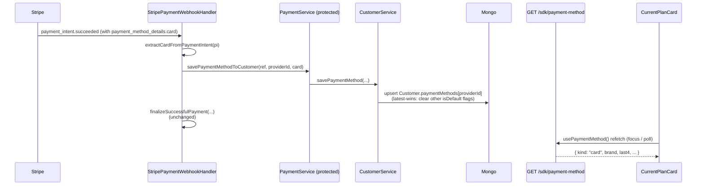

## Problem

The MCP-first phase 2 SDK slice shipped `<CurrentPlanCard>`, `usePaymentMethod`, `<UpdatePaymentMethodButton mode="portal">`, and `GET /v1/sdk/payment-method`, all reading from `Customer.paymentMethods[providerId]`. But **nothing populates that subdocument today**:

- `saveCustomerPaymentMethodFlow` + `CustomerService.savePaymentMethod` + `PaymentService.savePaymentMethodToCustomer` are fully implemented
- Grep across `solvapay-backend/src` finds **zero call sites** for any of them
- Docstrings on the read path falsely claim the subdocument is "populated on every successful PaymentIntent"

Consequence in production: `GET /v1/sdk/payment-method` always returns `{ kind: 'none' }` and `<CurrentPlanCard>` always shows "No payment method on file".

## Decisions locked in

- **Scope A**: save-path only. No preview-readiness audit, no publish wiring. Existing MCP React surface stays untouched.
- **Webhook-only save** (no inline-during-`processPaymentIntent`). `<CurrentPlanCard>` catches up on the next refetch after the webhook fires; SDK polling / focus-refetch already handles this.
- **Latest-PI-wins default-card swap**. When a new card is saved, clear `isDefault` on existing entries so the display always reflects the card the customer is currently paying with.
- **No protected-file edits**. Card details extracted from the `Stripe.PaymentIntent` object already in hand at the webhook boundary. No `stripe.processor.ts` retrieve call needed. Calling the existing public `PaymentService.savePaymentMethodToCustomer` from a NEW call site is not an edit to the protected service.

## Data flow after the fix



## Files touched

### 1. Fix the misleading docstrings (cleanup)

Three strings claim the subdocument is populated on every PI. Replace with accurate wording pointing at the webhook handler (see task 3 below for the actual wiring):

- [packages/server/src/... N/A](#) — NO, wait, these live on the BACKEND:
- [src/customers/services/flows/customer-payment-method.flow.ts](solvapay-backend/src/customers/services/flows/customer-payment-method.flow.ts) — JSDoc on `getDefaultPaymentMethodFlow`: replace "populated on every successful PaymentIntent via `saveCustomerPaymentMethodFlow`" with "populated by `StripePaymentWebhookHandler.handlePaymentIntentSucceeded` when a card PI settles". Keep the "no Stripe round-trip" note.
- [src/customers/services/customer.service.ts](solvapay-backend/src/customers/services/customer.service.ts) around line 493 — same JSDoc fix on the `getDefaultPaymentMethod` service method.
- [src/customers/controllers/payment-method.sdk.controller.ts](solvapay-backend/src/customers/controllers/payment-method.sdk.controller.ts) — controller JSDoc ("populated on every successful PaymentIntent") — same treatment.

### 2. New helper: `extractCardFromPaymentIntent`

New file [src/payments/lib/payment-intent-card.ts](solvapay-backend/src/payments/lib/payment-intent-card.ts). Pure function:

```ts
import type Stripe from 'stripe'

export interface SavedCardInput {
  paymentMethodId: string
  type: 'card'
  card: { brand: string; last4: string; expMonth: number; expYear: number }
}

export function extractCardFromPaymentIntent(
  pi: Stripe.PaymentIntent,
): SavedCardInput | null {
  const pmRef = typeof pi.payment_method === 'string' ? pi.payment_method : pi.payment_method?.id
  const card = pi.payment_method_details?.card ?? pi.charges?.data?.[0]?.payment_method_details?.card
  if (!pmRef || !card) return null
  if (!card.brand || !card.last4 || !card.exp_month || !card.exp_year) return null
  return {
    paymentMethodId: pmRef,
    type: 'card',
    card: {
      brand: card.brand,
      last4: card.last4,
      expMonth: card.exp_month,
      expYear: card.exp_year,
    },
  }
}
```

Plus spec [src/payments/lib/payment-intent-card.spec.ts](solvapay-backend/src/payments/lib/payment-intent-card.spec.ts) covering: card PI, non-card PI (bank/wallet) → null, missing `payment_method` → null, partial card data → null, charges-array fallback when `payment_method_details` is empty.

### 3. Update `saveCustomerPaymentMethodFlow` for latest-wins semantics

In [src/customers/services/flows/customer-payment.flow.ts](solvapay-backend/src/customers/services/flows/customer-payment.flow.ts) around line 52-68, change the logic:

- When `existingIndex !== -1` (same `paymentMethodId` already saved) → noop, keep existing, no isDefault change. Idempotent for webhook retries.
- When adding a new entry → push with `isDefault: true`, then iterate the existing entries and set `isDefault: false` on all of them (clearing the previous default). This keeps exactly one default card per provider.
- Drop the existing `const isDefault = customer.paymentMethods[providerId].length === 0` line (first-wins logic removed).

Add new spec [src/customers/services/flows/customer-payment.flow.spec.ts](solvapay-backend/src/customers/services/flows/customer-payment.flow.spec.ts) covering:

- Empty → new card becomes default
- One existing card → new card becomes default; old card flips `isDefault: false`
- Duplicate `paymentMethodId` → noop; existing `isDefault` preserved
- Multiple existing cards → all flip to `isDefault: false`, only new card has `isDefault: true`

### 4. Wire save into webhook handler

In [src/payments/handlers/stripe-payment-webhook.handler.ts](solvapay-backend/src/payments/handlers/stripe-payment-webhook.handler.ts) `handlePaymentIntentSucceeded` around lines 46-90, add a best-effort save between `updatePaymentIntentStatusByStripeId` (line 68-72) and `finalizeSuccessfulPayment` (line 77):

```ts
try {
  const cardInput = extractCardFromPaymentIntent(paymentIntent)
  if (cardInput) {
    const customerRef = localPaymentIntent.customerRef
    const providerId = localPaymentIntent.metadata?.providerId
    if (customerRef && providerId) {
      await this.paymentService.savePaymentMethodToCustomer(customerRef, providerId, cardInput)
    }
  }
} catch (err) {
  this.logger.error('[handlePaymentIntentSucceeded] savePaymentMethod failed (non-fatal):', err)
}
```

Critical behaviour:

- **Fail-soft**: try/catch wraps the save independently from `finalizeSuccessfulPayment`. Payment finalisation is the money-moving critical path; card-display is polish and must never block it.
- **Skip silently** when `extractCardFromPaymentIntent` returns null (non-card PIs).
- **Skip silently** when `customerRef` or `providerId` is missing (defensive; `finalizeSuccessfulPayment` already handles the `providerId`-missing case on the next line).
- **No new DI**: `paymentService` and `logger` are already injected on the handler.

No edit to `payment.service.ts` itself — `savePaymentMethodToCustomer` already exists as a public facade at `src/payments/services/payment.service.ts:471`. Using an existing public method from a new call site does not count as modifying the protected file.

### 5. Extend the webhook handler spec

In [src/payments/handlers/stripe-payment-webhook.handler.spec.ts](solvapay-backend/src/payments/handlers/stripe-payment-webhook.handler.spec.ts), add cases to the `handlePaymentIntentSucceeded` describe block (line 102):

- **saves card on card-PI success** — asserts `paymentService.savePaymentMethodToCustomer` called with extracted card input.
- **skips save for non-card PI** — `payment_method_details.card` absent → save not called; finalisation still runs.
- **save throwing does not break finalisation** — `savePaymentMethodToCustomer` rejects → `finalizeSuccessfulPayment` still called, error logged.
- **second webhook delivery does not double-save** — `saveCustomerPaymentMethodFlow` already dedupes on `paymentMethodId`; verify the mock is called both times but no assertions on duplicate DB writes (that's covered by the flow spec in task 3).

## Validation gates

- All new + existing specs green: `customer-payment.flow.spec.ts` (new), `payment-intent-card.spec.ts` (new), `stripe-payment-webhook.handler.spec.ts` (extended), `customer-payment-method.flow.spec.ts` (unchanged — still 8 green), `payment-method.sdk.controller.spec.ts` (unchanged — still 4 green)
- `npx tsc --noEmit` clean on `solvapay-backend`
- `npm run build` clean on `solvapay-backend`

## Manual smoke (deferred to a live dev session)

With backend + `mcp-checkout-app` running + a real Stripe test card:

1. Pay for a plan via hosted checkout
2. Wait for webhook delivery (~1-3s)
3. `<CurrentPlanCard>` refetches (focus/poll) → shows "Visa •••• 4242, expires 12/2030"
4. Pay again with Mastercard 5555... → `<CurrentPlanCard>` updates to Mastercard on next refetch (latest-wins)

Documented in plan notes only; not automated in this slice.

## Explicitly out of scope

- **MCP preview-readiness audit** — user chose Scope A. No hunt for other MCP-flow blockers.
- **Version bump / CHANGELOG / publish** — user chose Scope A. `scripts/version-bump-preview.ts` + `publish-preview.yml` remain your call to run.
- **`setup_intent.succeeded` webhook** — only needed when `<PaymentMethodForm>` ships (deferred Phase 2 slice for the Lovable HTTP path). MCP flow doesn't hit SetupIntents.
- **`customer.updated` / `payment_method.attached` webhooks** — keeping the Mongo mirror in sync after the user updates their card in the hosted customer portal. Today the next PI after the portal update still triggers our webhook, so the mirror catches up on next charge. File as follow-up.
- **Inline save during `processPaymentIntent`** — SDK's sync processing path. User chose webhook-only; card display catches up after webhook delivery.
- **Multi-card UI / user-initiated default swap** — beyond the `{ kind: 'card', ... }` default projection the SDK already exposes.

## Follow-up notes (not todos in this plan)

- After first real checkout, verify webhook delivery time in sandbox. If >5s consistently, consider revisiting the inline-save decision.
- `payment.service.ts:471` facade `savePaymentMethodToCustomer` stays. One new call site justifies keeping it; deleting it would require routing the webhook handler through `CustomerService` directly, which crosses module boundaries unnecessarily.