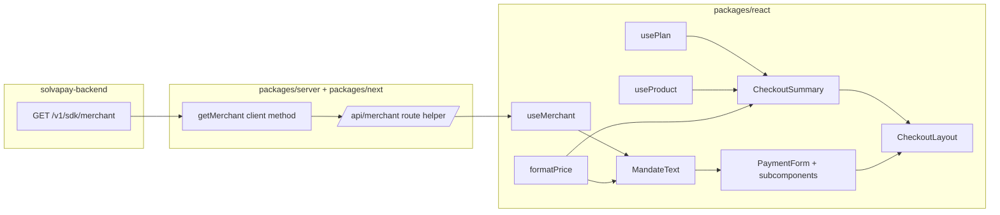

## Context

Lovable's integration pain maps to concrete gaps in `@solvapay/react`:

- [packages/react/src/PaymentForm.tsx](packages/react/src/PaymentForm.tsx) ships only a card field (`CardElement`) with no summary, mandate, customer echo, or slots. Consumers must reconstruct every trust signal around it.
- `usePlans(productRef)` exists but returns the list; there is no single-entity `usePlan(planRef)` or `useProduct(productRef)` hook exposing `{ name, amount, currency, interval, intervalCount, trialDays }`.
- No `useMerchant()` — so recurring-payment/SCA mandate text has nothing accurate to render (legal entity name, support email, terms URL, privacy URL).
- No `formatPrice`, no `<CheckoutSummary>`, no `<CheckoutLayout>`, no `prefillCustomer`.
- `StripePaymentFormWrapper` uses the legacy `CardElement`; Stripe's `PaymentElement` (Link, Apple/Google Pay, SEPA, iDEAL) is what actually converts.

## Deliverable layers



## 1. Backend: merchant metadata endpoint

Add to [solvapay-backend/src/providers/](../solvapay-backend/src/providers) (or new `merchant` module) a public-ish SDK route authenticated with the publishable/account key that already authorizes checkout:

- `GET /v1/sdk/merchant` → `{ legalName, displayName, supportEmail, supportUrl?, termsUrl?, privacyUrl?, country, statementDescriptor?, logoUrl? }`.
- Source the values from the existing provider/account profile (Stripe business profile is already read in `payments/processors/stripe/stripe-account.processor.ts`).
- Cache-safe, returns 200 even when optional fields are missing so the SDK can gracefully degrade mandate text.

Regenerate `packages/server/src/types/generated.ts` from the updated OpenAPI spec.

## 2. `@solvapay/server` + `@solvapay/next`

- Add `getMerchant()` to the client in [packages/server/src/client.ts](packages/server/src/client.ts) and the typed interface in [packages/server/src/types/client.ts](packages/server/src/types/client.ts).
- Add `getProduct(productRef)` to the same client (the OpenAPI spec already has `ProductSdkController_getProduct`; wire it up). This is the foundation for `useProduct`.
- New core helper [packages/server/src/helpers/merchant.ts](packages/server/src/helpers/merchant.ts) → `getMerchantCore(request)`.
- New Next.js route wrapper [packages/next/src/helpers/merchant.ts](packages/next/src/helpers/merchant.ts) and update [packages/next/src/helpers/index.ts](packages/next/src/helpers/index.ts).
- Register the new API route default in `SolvaPayConfig.api`:
  ```ts
  api?: {
    // existing...
    getMerchant?: string  // Default: '/api/merchant'
    getProduct?: string   // Default: '/api/get-product'
  }
  ```
  Docs + example route handlers added under [examples/checkout-demo](examples/checkout-demo).

## 3. `@solvapay/react` — foundational hooks & utilities

- **`formatPrice(amountMinor, currency, opts?)`** in new `packages/react/src/utils/format.ts`. `opts = { locale?, interval?, intervalCount?, free?: 'free' | 'no charge' }`. Uses `Intl.NumberFormat` in minor units. Exported from the root index.
- **`usePlan(planRef, opts?)`** in `packages/react/src/hooks/usePlan.ts`. If `productRef` is known, piggybacks on the `usePlans` cache to avoid a new endpoint; otherwise fetches via `listPlans` and filters. Returns `{ plan, loading, error, refetch }` with a derived view: `{ name, amountMinor, currency, interval, intervalCount, trialDays }`.
- **`useProduct(productRef)`** in `packages/react/src/hooks/useProduct.ts`. Calls the new `/api/get-product` route, caches by `productRef` (module-level Map, mirrors `plansCache` in [packages/react/src/hooks/usePlans.ts](packages/react/src/hooks/usePlans.ts)).
- **`useMerchant()`** in `packages/react/src/hooks/useMerchant.ts`. Single-flight cached fetch against `/api/merchant`. Returns `{ merchant, loading, error }`.
- **`prefillCustomer` wiring**: extend `SolvaPayContextValue.createPayment` to accept `{ customer?: { name?, email? } }` and forward to the PaymentIntent creation helper so the server-side customer record is authoritative. React surface: `<PaymentForm prefillCustomer={{ name, email }} />` + matching prop on `<CheckoutLayout>`. No read of arbitrary JS state — the echoed "Charging visa •••• to john@x.com" comes from `useCustomer()` after the intent is created (already validated against the backend customer).

## 4. `<CheckoutSummary>` and mandate text

- **`packages/react/src/components/CheckoutSummary.tsx`** — headless by default with sensible default styles gated behind `className`/`unstyled` props. Signature:
  ```tsx
  <CheckoutSummary
    planRef?: string
    productRef?: string
    showTrial?: boolean
    showTaxNote?: boolean
    className?: string
    children?: (data) => ReactNode  // render-prop escape hatch
  />
  ```
  Internals use `usePlan` + `useProduct` + `formatPrice`. Shows: product name, plan name, amount, interval (`kr 199 / month`, `$12 / 3 months`, `Free`), trial banner, and optional small-print tax/VAT note.
- **`packages/react/src/components/MandateText.tsx`** — renders the correct legal/authorization copy for each checkout shape, keyed off `Plan.type` (`'recurring' | 'one-time' | 'usage-based'`) plus a new `'topup'` mode used by `<TopupForm>`. Pure, composable, exported for consumers who want to render it outside `<PaymentForm>`. Falls back gracefully when merchant fields are missing.

  Variant copy (shipped as overridable defaults via a `copy` prop, accepting either strings or render-props that receive `{ merchant, plan, product, amountMinor, currency, formatPrice }`):

  - **Recurring (SCA-compliant mandate, required for EU PSD2)**: `By subscribing, you authorize {merchant.legalName} to charge {formatPrice(amount, currency)} every {intervalCount > 1 ? intervalCount + ' ' : ''}{interval}{trialDays ? ' after your ' + trialDays + '-day free trial' : ''} until you cancel. You can cancel any time. Payments are processed by SolvaPay. See {termsUrl} and {privacyUrl}.`
  - **One-time (`type: 'one-time'`)**: `By confirming, you authorize {merchant.legalName} to charge {formatPrice(amount, currency)} for {product.name}. Payments are processed by SolvaPay. See {termsUrl} and {privacyUrl}.`
  - **Topup (credit balance, used by `<TopupForm>` / `type: 'usage-based'` pre-paid)**: `By confirming, you authorize {merchant.legalName} to charge {formatPrice(amount, currency)} to add credits to your {product.name} balance. Credits are non-refundable once used. Payments are processed by SolvaPay. See {termsUrl} and {privacyUrl}.`
  - **Usage-based post-paid (`type: 'usage-based'` + `billingModel: 'post-paid'`)**: `By confirming, you authorize {merchant.legalName} to charge your payment method for metered usage of {product.name} at {formatPrice(unitPrice, currency)} per {measures}, billed {billingCycle}. You can cancel any time. Payments are processed by SolvaPay. See {termsUrl} and {privacyUrl}.`

  Variant selection is automatic from the resolved plan (or `mode="topup"` prop when there is no plan, as in `<TopupForm>`), but can be overridden with `variant="recurring" | "one-time" | "topup" | "usage-metered"`.

## 5. `<PaymentForm>` — composition & PaymentElement support

Refactor [packages/react/src/PaymentForm.tsx](packages/react/src/PaymentForm.tsx) into a root that provides context to subcomponents while keeping the single-prop API working for backwards compatibility.

```tsx
<PaymentForm planRef productRef prefillCustomer onSuccess>
  <PaymentForm.Summary />            {/* wraps CheckoutSummary */}
  <PaymentForm.CustomerFields readOnly />  {/* name/email echo */}
  <PaymentForm.PaymentElement />     {/* default, Stripe PaymentElement */}
  <PaymentForm.CardElement />        {/* opt-in, minimal card-only (chat embed) */}
  <PaymentForm.MandateText />
  <PaymentForm.TermsCheckbox label={...} />
  <PaymentForm.SubmitButton>Pay Now</PaymentForm.SubmitButton>
</PaymentForm>
```

Mechanics:

- New context in `packages/react/src/components/PaymentFormContext.tsx` holding `{ stripe, elements, clientSecret, planRef, productRef, isProcessing, termsAccepted, setTermsAccepted, canSubmit, submit, error }`.
- Existing "single-shot" usage keeps working: if no `children` are passed, render a default tree (`Summary → PaymentElement → MandateText → optional TermsCheckbox → SubmitButton`) so nothing breaks for today's users. `requireTermsAcceptance` prop toggles the default tree to include the checkbox + gate submit.
- **Stripe variant selection** via `<PaymentForm.PaymentElement />` vs `<PaymentForm.CardElement />` — PaymentElement becomes the default; CardElement is explicitly for narrow embeds. Current submit logic lives in [packages/react/src/components/StripePaymentFormWrapper.tsx](packages/react/src/components/StripePaymentFormWrapper.tsx); extract the confirmation flow into `packages/react/src/utils/confirmPayment.ts` so it can branch on `stripe.confirmPayment({ elements })` (PaymentElement) vs `stripe.confirmCardPayment` (CardElement).
- `<PaymentForm.SubmitButton>` disables when `!canSubmit` (missing terms, not ready, processing, no completed input) and shows the spinner.
- **CTA copy derived from plan type**, with a `submitButtonText` prop override that still takes precedence:
  - `recurring` → `Subscribe` (or `Start {trialDays}-day free trial` when `trialDays > 0`)
  - `one-time` → `Pay {formatPrice(amount, currency)}`
  - `topup` / `usage-based` pre-paid → `Add {formatPrice(amount, currency)}` (or `Top up` when amount is selected via `<TopupForm>`)
  - `usage-based` post-paid → `Start using {product.name}` (authorization only, no immediate charge)
  - Fallback when plan is still loading or unknown → existing `Pay Now` default.
  The same derivation powers the default `aria-label`, and the mandate `<MandateText>` variant, so the CTA, authorization text, and button all stay consistent.

## 6. `<CheckoutLayout>` — opinionated preset

New `packages/react/src/components/CheckoutLayout.tsx`. One-line drop-in:

```tsx
<CheckoutLayout
  planRef="pln_premium"
  productRef="prd_myapi"
  prefillCustomer={{ email }}
  onSuccess={onSuccess}
  size="auto"                 // 'chat' | 'mobile' | 'desktop' | 'auto'
  requireTermsAcceptance
/>
```

- Internally composes `<PaymentForm>` + subcomponents with a two-column grid at desktop, stacked on mobile/chat.
- **Size-agnostic via container queries**, not viewport — this is what makes it work identically in a chat bubble, phone, or full page. Layout rules:
  - `< 480px container`: stacked, no decorative padding, CardElement preferred over PaymentElement height-wise (auto-downgrades when `size="chat"`).
  - `480–768px`: stacked with larger type.
  - `≥ 768px`: two-column, summary left, form right.
- Ships minimal CSS as a CSS-in-JS style tag (scoped) or optional `import '@solvapay/react/checkout-layout.css'`; consumers can override via a `classNames` prop (`{ root, summary, form, mandate, submit }`). No Tailwind dependency.
- `size="auto"` uses a `ResizeObserver` so it reflows correctly inside Lovable chat bubbles and resizable iframes.

## 7. Exports, docs, tests

- Update [packages/react/src/index.tsx](packages/react/src/index.tsx) with new hooks, components, and types.
- Add TypeScript types for `UseMerchantReturn`, `UsePlanReturn`, `UseProductReturn`, `Merchant`, `CheckoutSummaryProps`, `MandateTextProps`, `CheckoutLayoutProps`, `PaymentFormSlotProps` in [packages/react/src/types/index.ts](packages/react/src/types/index.ts).
- Unit tests alongside each hook/component mirroring the pattern in [packages/react/src/hooks/usePlans.test.ts](packages/react/src/hooks/usePlans.test.ts).
- Update [packages/react/README.md](packages/react/README.md) with the composition example and a "minimal drop-in" CheckoutLayout snippet.

## Backwards compatibility

- `<PaymentForm planRef productRef onSuccess />` with no children keeps its current rendered output by default; the new slots only activate when children are passed or a new prop (e.g. `requireTermsAcceptance`) is set.
- `CardElement` behavior is preserved for chat embeds via `<PaymentForm.CardElement />`.
- `createPayment` signature extended additively (`customer?` is optional).

## Out of scope (call out in the work)

- Tax/VAT line-item rendering beyond a generic note — requires backend tax calculation.
- Full i18n of mandate text — ship English first, accept a `mandateText` render-prop override.
- Ad-hoc one-time purchases UI — same mandate scaffolding applies but copy differs; follow-up.
