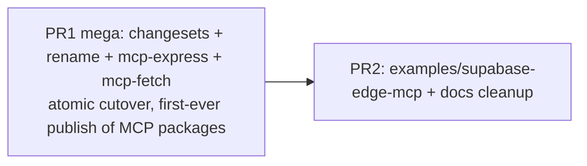
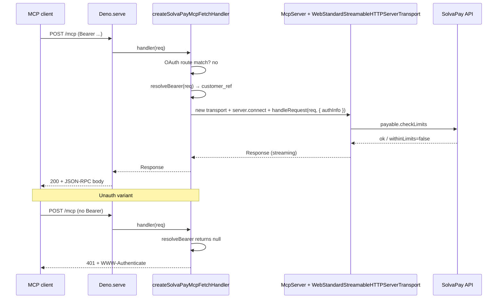

## Context and verified premises

- **No MCP package has ever been published to npm** (verified against the registry — `@solvapay/mcp`, `@solvapay/mcp-sdk`, `@solvapay/mcp-core`, `@solvapay/mcp-fetch`, `@solvapay/mcp-express` all return 404 on `registry.npmjs.org`). Rename is purely internal; no deprecation stubs, no consumer codemod needed.
- `@solvapay/fetch` is also unpublished — free to claim for the `@solvapay/supabase` rename.
- `@solvapay/supabase` has 11 published versions (`latest: 1.0.1`, `preview: 1.0.8-preview.11`) — smallest npm footprint of the published packages, making a hard rename cheap. No deprecation shim; one clean release under the new name, announced migration in the PR body and README.
- `@solvapay/supabase`'s code is runtime-neutral (fetch-first handlers around `@solvapay/server` cores) — nothing Supabase-specific lives in the package itself; Supabase-idiomatic bits live in [examples/supabase-edge/](examples/supabase-edge/). The name creates false discovery friction for Cloudflare / Bun / standalone Deno users.
- Other 7 published packages stay named: `@solvapay/core`, `@solvapay/auth`, `@solvapay/server`, `@solvapay/react`, `@solvapay/react-supabase`, `@solvapay/next`, `solvapay`. `latest` = `1.0.7`, `preview` = `1.0.8-preview.11`. `@solvapay/react-supabase` stays named — it's genuinely Supabase-Auth-specific.
- Current `packages/mcp/package.json` says `1.0.8-preview.10` but the preview dist-tag on npm reads `1.0.8-preview.11` across every published package — there's been a publish event since the workspace was last tagged. The MCP packages escaped it because the preview workflow is `workflow_dispatch` (manual trigger) and wasn't run since they were added. This is exactly why we want to migrate BEFORE the next manual trigger: the moment someone clicks it, the unpublished MCP packages land on npm under the wrong semantics.
- No `mcp-lite` runtime dep exists anywhere. Remaining mentions are comments/docs, cleaned up in PR2.
- `@modelcontextprotocol/sdk@1.29` ships `server/webStandardStreamableHttp.js` — confirmed on disk at `node_modules/.pnpm/@modelcontextprotocol+sdk@1.29.0/.../dist/esm/server/webStandardStreamableHttp.js`.
- Supabase-deployed MCP example doesn't exist. `examples/supabase-edge/` is checkout-only; `examples/mcp-checkout-app/` is Node/Express.

## Target package layout

```
Base:
  @solvapay/core              unchanged
  @solvapay/auth              unchanged

Runtime adapters (by runtime family — consistent naming rule):
  @solvapay/server            unchanged (Node server SDK)
  @solvapay/fetch             ← HARD RENAME from @solvapay/supabase
                                (fetch-first checkout for Deno/Supabase Edge/
                                 CF Workers/Bun/Next edge/Vercel Functions).

Framework adapters:
  @solvapay/next              unchanged (Next.js)
  @solvapay/react             unchanged (peer: @solvapay/mcp → @solvapay/mcp-core)
  @solvapay/react-supabase    unchanged (genuinely Supabase-Auth-specific)

MCP:
  @solvapay/mcp-core          ← rename of current @solvapay/mcp
                                framework-neutral contracts only.
                                buildSolvaPayDescriptors, buildPayableHandler,
                                MCP_TOOL_NAMES, types, CSP, paywall meta,
                                bootstrap payload, pure discovery-JSON builders,
                                bearer/JWT helpers. Zero runtime peer beyond @solvapay/core.

  @solvapay/mcp               ← rename of current @solvapay/mcp-sdk
                                Happy path: createSolvaPayMcpServer, registerPayableTool.
                                Peer deps: @modelcontextprotocol/sdk ^1.29,
                                @modelcontextprotocol/ext-apps ^1.5, @solvapay/mcp-core,
                                @solvapay/server.

  @solvapay/mcp-express       ← NEW — Node (req,res,next) OAuth middleware lifted out.
                                Peer: @solvapay/mcp-core.
                                Consumed by examples/mcp-checkout-app + mcp-oauth-bridge.

  @solvapay/mcp-fetch         ← NEW — fetch-first OAuth + turnkey handler.
                                Peer: @solvapay/mcp-core, @solvapay/mcp,
                                @modelcontextprotocol/sdk.
                                Works on Deno, Supabase Edge, Cloudflare Workers,
                                Bun, Next edge, Node (via Web Streams).

CLI:
  solvapay                    unchanged
```

Naming rule after PR1: **runtime packages are named by runtime family** (`server` for Node, `fetch` for Web-standards runtimes, `mcp-express` for Node MCP, `mcp-fetch` for Web-standards MCP). Framework packages keep framework names (`next`, `react`). Integration packages use compound names (`react-supabase`).

Symmetry:

```
Runtime adapters:                 MCP runtime adapters:
  @solvapay/server       (Node)     @solvapay/mcp-express  (Node)
  @solvapay/fetch        (Web)      @solvapay/mcp-fetch    (Web)
```

Net: 3 renames (2 free names, 1 hard-rename with announced migration), 2 new packages. 12 published packages after first preview publish (`@solvapay/supabase` stays in the registry as an orphaned history line — no new releases, no shim).

Consumption:

```ts
// Node / Express MCP
import { createSolvaPayMcpServer } from '@solvapay/mcp'
import { createMcpOAuthBridge } from '@solvapay/mcp-express'

// Deno / Supabase Edge / Cloudflare / Bun / Next edge — MCP
import { createSolvaPayMcpServer } from '@solvapay/mcp'
import { createSolvaPayMcpFetchHandler } from '@solvapay/mcp-fetch'
Deno.serve(
  createSolvaPayMcpFetchHandler({ server, publicBaseUrl, apiBaseUrl, productRef })
)

// Web-standards checkout (new name — was @solvapay/supabase)
import { checkPurchase, createPaymentIntent } from '@solvapay/fetch'
Deno.serve(checkPurchase)

// Framework adapter author (fastmcp, raw JSON-RPC)
import { buildSolvaPayDescriptors } from '@solvapay/mcp-core'
```

## PR sequence



Two PRs. PR1 is large but atomic — if any step fails, the monorepo stays on the old pre-change state. PR2 is small and low-risk (only docs + one example).

## PR1 — atomic SDK refactor

### Step-by-step (order matters within the PR)

1. **Add changesets infrastructure.** `pnpm add -Dw @changesets/cli`, `pnpm changeset init`, then replace `.changeset/config.json` with:

```json
{
  "$schema": "https://unpkg.com/@changesets/config@3.0.0/schema.json",
  "changelog": "@changesets/cli/changelog",
  "commit": false,
  "linked": [],
  "access": "public",
  "baseBranch": "main",
  "updateInternalDependencies": "patch",
  "ignore": ["@example/*", "@solvapay/demo-services", "@solvapay/test-utils", "@solvapay/tsconfig"]
}
```

2. **Rewrite workflows.** [.github/workflows/publish-preview.yml](.github/workflows/publish-preview.yml) becomes snapshot-on-push-to-dev with a **pre-publish fetch-runtime gate**:

```yaml
name: Publish Preview
on:
  push:
    branches: [dev]
jobs:
  publish:
    runs-on: ubuntu-latest
    steps:
      - uses: actions/checkout@v4
      - uses: pnpm/action-setup@v4
      - uses: actions/setup-node@v4
        with: { node-version: '20', registry-url: 'https://registry.npmjs.org' }
      - run: pnpm install --frozen-lockfile
      - run: pnpm build:packages
      - run: pnpm test
      - name: Validate fetch-runtime smoke test
        run: pnpm tsx scripts/validate-fetch-runtime.ts
      - name: Publish snapshot to @preview
        run: |
          pnpm changeset version --snapshot preview
          pnpm changeset publish --tag preview --no-git-tag
        env:
          NODE_AUTH_TOKEN: ${{ secrets.NPM_TOKEN }}
```

[scripts/validate-fetch-runtime.ts](scripts/validate-fetch-runtime.ts) gates the publish: it imports the just-built `@solvapay/mcp-fetch`, `@solvapay/mcp`, `@solvapay/mcp-core`, `@solvapay/mcp-express` from the pnpm workspace (post-`pnpm build:packages`), constructs a mock `McpServer`, wraps with `createSolvaPayMcpFetchHandler`, boots an in-process Node HTTP server bridging `IncomingMessage` ↔ Web `Request`, and asserts:

- `GET /.well-known/oauth-protected-resource` → 200 + valid JSON
- `GET /.well-known/oauth-authorization-server` → issuer equals publicBaseUrl; `JSON.stringify(body)` does not contain `'product_ref'`
- `OPTIONS /oauth/register` with `Origin: cursor://x` → 204 + `Access-Control-Allow-Origin: cursor://x`
- `OPTIONS /oauth/register` with `Origin: https://evil.com` → 204 + no CORS header
- `POST /mcp` without bearer → 401 + `WWW-Authenticate: Bearer resource_metadata="..."`
- `POST /oauth/token` body `grant_type=authorization_code&code=a+b&code_verifier=%20x` → upstream mock receives the body **byte-for-byte** (no URLSearchParams round-trip)

Any failure aborts the publish. CI-enforceable without Supabase CLI, without Deno, without a UI bundle — pure Node.

[.github/workflows/publish.yml](.github/workflows/publish.yml) uses `changesets/action@v1` in release-PR mode for stable releases:

```yaml
- uses: changesets/action@v1
  with:
    publish: pnpm changeset publish
    version: pnpm changeset version
    commit: 'chore(release): version packages'
    title: 'chore(release): version packages'
  env:
    GITHUB_TOKEN: ${{ secrets.GITHUB_TOKEN }}
    NPM_TOKEN: ${{ secrets.NPM_TOKEN }}
```

3. **Delete hand-rolled scripts.** [scripts/version-bump.ts](scripts/version-bump.ts), [scripts/version-bump-preview.ts](scripts/version-bump-preview.ts), [scripts/sync-versions-from-tags.ts](scripts/sync-versions-from-tags.ts). Remove corresponding `version:bump*`, `version:sync*`, `publish:preview*`, `publish:packages` scripts from root [package.json](package.json).

4. **Rename `@solvapay/mcp` → `@solvapay/mcp-core`.** `git mv packages/mcp packages/mcp-core`, update [packages/mcp-core/package.json](packages/mcp-core/package.json) `name`, reset `version` to `0.1.0`. Remove [packages/mcp-core/src/oauth-bridge.ts](packages/mcp/src/oauth-bridge.ts) — the Node middleware moves to `mcp-express` (step 6). Keep the pure JSON builders `getOAuthProtectedResourceResponse` and `getOAuthAuthorizationServerResponse` inline in a new `packages/mcp-core/src/oauth-discovery.ts` so both Node and Fetch sides can import them from the kernel.

5. **Rename `@solvapay/mcp-sdk` → `@solvapay/mcp`.** `git mv packages/mcp-sdk packages/mcp`, update [packages/mcp/package.json](packages/mcp/package.json) `name`, reset `version` to `0.1.0`, flip the `@solvapay/mcp` dep to `@solvapay/mcp-core`. Consumers already import `createSolvaPayMcpServer` / `registerPayableTool` from `@solvapay/mcp-sdk`; only the package name changes.

6. **Scaffold `packages/mcp-express/`.** Lift the Node OAuth middleware and the existing [packages/mcp/src/oauth-bridge.spec.ts](packages/mcp/src/oauth-bridge.spec.ts) (now at the old path, before the rename) into the new package:

```
packages/mcp-express/
  package.json              @solvapay/mcp-express, peer @solvapay/mcp-core
  tsconfig.build.json
  tsup.config.ts
  src/
    index.ts
    oauth-bridge.ts         # lifted verbatim from old @solvapay/mcp
    bearer.ts               # re-exports from @solvapay/mcp-core for convenience
  __tests__/
    oauth-bridge.spec.ts    # moved, behaviour-preserving + negative product_ref assertion
```

7. **Scaffold `packages/mcp-fetch/`.** New fetch-first primitives + turnkey handler:

```
packages/mcp-fetch/
  package.json              @solvapay/mcp-fetch
  src/
    index.ts
    oauth-bridge.ts         # (req: Request) => Promise<Response | null> handlers
    cors.ts                 # native-scheme CORS preflight + authChallenge
    handler.ts              # createSolvaPayMcpFetchHandler turnkey
  __tests__/
    oauth-bridge.test.ts
    handler.test.ts
    cors.test.ts
```

Turnkey signature:

```ts
export function createSolvaPayMcpFetchHandler(opts: {
  server: McpServer
  publicBaseUrl: string
  apiBaseUrl: string
  productRef: string
  mcpPath?: string          // default '/mcp'
  requireAuth?: boolean     // default true
}): (req: Request) => Promise<Response>
```

Internally the turnkey routes on `new URL(req.url).pathname` — no Hono, no Express. Hono stays an example-level choice.

Invariants enforced by tests (mirrors [the obsolete plan's](.cursor/plans/supabase-mcp_sdk_package_c319cb08.plan.md) behavioural contract, just on fetch-first):

- `issuer === publicBaseUrl` exactly. Trailing-slash in input normalized.
- Every endpoint URL in discovery starts with `publicBaseUrl`.
- `product_ref` injected only in `/oauth/register` query string — never in discovery JSON. Negative assertion `expect(JSON.stringify(doc)).not.toContain('product_ref')`.
- `/oauth/token` and `/oauth/revoke` forward `await req.text()` **verbatim**. Test constructs a body with both `+` and `%20` and asserts upstream mock receives it unchanged.
- Native-scheme CORS mirrors `Origin` only when it matches `/^(cursor|vscode|vscode-webview|claude):\/\/.+$/`.

8. **Hard-rename `@solvapay/supabase` → `@solvapay/fetch`.** `git mv packages/supabase packages/fetch`, update [packages/fetch/package.json](packages/fetch/package.json) `name` and reset `version` to `1.0.0` — continuity with `@solvapay/supabase@1.0.1`'s code maturity makes a fresh `1.0.0` honest, whereas dropping to `0.x` would erase battle-testing signal. No shim, no deprecation re-export, no transition release. Write CHANGELOG explicitly noting "Renamed from `@solvapay/supabase`. Migrate imports with a single find-and-replace; the API surface is unchanged." so the first npm release under the new name is self-documenting.

9. **Update workspace consumers.** Single sweep, internal-only:
   - [packages/react/package.json](packages/react/package.json) peer dep `@solvapay/mcp` → `@solvapay/mcp-core`.
   - [packages/react/src/mcp/*](packages/react/src/mcp/) import rewrites.
   - [packages/next/package.json](packages/next/package.json) if it imports from `@solvapay/mcp` anywhere.
   - [examples/mcp-checkout-app/](examples/mcp-checkout-app/): `@solvapay/mcp-sdk` → `@solvapay/mcp`; `createMcpOAuthBridge` import → `@solvapay/mcp-express`.
   - [examples/mcp-oauth-bridge/](examples/mcp-oauth-bridge/): same as above.
   - [examples/supabase-edge/](examples/supabase-edge/): `@solvapay/supabase` → `@solvapay/fetch` across every function's [deno.json](examples/supabase-edge/supabase/functions/deno.json) and `index.ts` file.
   - Any [docs/*.mdx](docs/) references to `@solvapay/supabase`.

10. **Write the inaugural changesets.** One or two `.changeset/*.md` files. Note the mixed semver levels — the first release of a package with `version: "0.1.0"` in `package.json` is triggered by a `minor` changeset (changesets treats initial publish as a minor bump from `0.0.0`); `@solvapay/fetch` is already `1.0.0` in `package.json` so its initial publish needs no changeset (publishing the current version is idempotent), but we include a `patch` changeset to generate a CHANGELOG entry announcing the rename:

```markdown
---
'@solvapay/mcp-core': minor
'@solvapay/mcp': minor
'@solvapay/mcp-express': minor
'@solvapay/mcp-fetch': minor
'@solvapay/fetch': patch
'@solvapay/react': patch
---

Introduce independent-versioned MCP packages (all debut at 0.1.0 — pre-1.0
signals API still stabilising while the MCP ecosystem evolves):
- @solvapay/mcp-core (framework-neutral contracts)
- @solvapay/mcp (official @modelcontextprotocol/sdk adapter, happy path)
- @solvapay/mcp-express (Node req/res/next OAuth bridge)
- @solvapay/mcp-fetch (fetch-first OAuth + turnkey createSolvaPayMcpFetchHandler)

Hard-rename @solvapay/supabase → @solvapay/fetch (debuts at 1.0.0 for
continuity with @solvapay/supabase@1.0.1's production maturity). The code
is runtime-neutral (Deno, Cloudflare Workers, Bun, Next edge, Vercel
Functions); the new name reflects that. Migrate with a find-and-replace —
API surface is unchanged. No deprecation shim; @solvapay/supabase stays
on npm at its current version with no further updates.

@solvapay/react peer dep switches from @solvapay/mcp → @solvapay/mcp-core to
match the rename (no API surface change for consumers).
```

Starting version table:

| Package | Starts at | Why |
| --- | --- | --- |
| `@solvapay/mcp-core` | `0.1.0` | Net-new on npm, underlying MCP ecosystem still moving fast |
| `@solvapay/mcp` | `0.1.0` | Same |
| `@solvapay/mcp-express` | `0.1.0` | Same |
| `@solvapay/mcp-fetch` | `0.1.0` | Brand new, turnkey handler shape likely to iterate |
| `@solvapay/fetch` | `1.0.0` | Code is what `@solvapay/supabase@1.0.1` ships — downgrading would erase battle-testing signal |
| `@solvapay/react` | bump from `1.0.7`+preview | Peer change only, patch bump |

Consumers end up with a legitimately mixed lockfile — that's the independent-versioning contract:

```json
{
  "dependencies": {
    "@solvapay/core": "^1.0.7",
    "@solvapay/server": "^1.0.7",
    "@solvapay/fetch": "^1.0.0",
    "@solvapay/mcp": "^0.1.0",
    "@solvapay/mcp-fetch": "^0.1.0"
  }
}
```

Promoting any `0.x` package to `1.0.0` later is a normal `major` changeset — no special ceremony.

11. **PR description checklist:**

    ```
    - [ ] All imports in workspace updated (@solvapay/mcp-sdk, @solvapay/mcp, @solvapay/supabase → new names)
    - [ ] Existing oauth-bridge.spec.ts passes verbatim in @solvapay/mcp-express
    - [ ] New @solvapay/mcp-fetch tests: byte-for-byte token body, discovery self-consistency, native-scheme CORS
    - [ ] scripts/validate-fetch-runtime.ts passes locally (`pnpm tsx scripts/validate-fetch-runtime.ts`) — required CI gate before snapshot publish
    - [ ] examples/supabase-edge/ and supabase/functions/deno.json import maps updated to @solvapay/fetch
    - [ ] @solvapay/fetch CHANGELOG explicitly documents the rename from @solvapay/supabase
    - [ ] docs/guides/mcp.mdx reads correctly under new names (full cleanup in PR2)
    - [ ] .changeset/*.md covers every affected package
    - [ ] pnpm install / pnpm build / pnpm test all green
    - [ ] No `mcp-lite` in any production source path
    ```

### Preview release mechanics after PR1

On push to `dev`:
1. CI runs `pnpm changeset version --snapshot preview` — generates `0.0.0-preview-<timestamp>-<sha>` versions on every package with a pending changeset (plus internal dependents).
2. CI runs `pnpm changeset publish --tag preview --no-git-tag`.
3. `@preview` dist-tag updates for each affected package. Other packages keep their existing `1.0.8-preview.11`.
4. Changesets stay in `.changeset/` so the next stable release includes them.

Consumer migration:

```bash
# MCP — name flipped
pnpm add @solvapay/mcp-sdk@1.0.8-preview.10   # old
pnpm add @solvapay/mcp@preview                # new

# Checkout on Web-standards runtimes — name renamed
pnpm add @solvapay/supabase@preview           # old (stays on npm, no new releases)
pnpm add @solvapay/fetch@preview              # new
```

Migration is a single find-and-replace:

```bash
find . -type f \( -name '*.ts' -o -name '*.tsx' -o -name '*.json' -o -name '*.mdx' \) \
  -exec sed -i '' 's|@solvapay/supabase|@solvapay/fetch|g' {} +
```

## PR2 — `examples/supabase-edge-mcp/` + docs

```
examples/supabase-edge-mcp/
  README.md
  package.json
  vite.config.ts
  mcp-app.html
  src/
    mcp-app.tsx
  supabase/
    functions/
      deno.json
      mcp/
        index.ts
        mcp-app.html        # build artefact, copied from ../dist/mcp-app.html
        demo-tools.ts       # copy of mcp-checkout-app/src/demo-tools.ts
```

Function entrypoint ([supabase/functions/mcp/index.ts](examples/supabase-edge-mcp/supabase/functions/mcp/index.ts)):

```ts
import 'jsr:@supabase/functions-js/edge-runtime.d.ts'
import { createSolvaPay } from 'npm:@solvapay/server'
import { createSolvaPayMcpServer } from 'npm:@solvapay/mcp'
import { createSolvaPayMcpFetchHandler } from 'npm:@solvapay/mcp-fetch'
import { registerDemoTools, demoToolsEnabled } from './demo-tools.ts'

const solvaPay = createSolvaPay({ apiKey: Deno.env.get('SOLVAPAY_SECRET_KEY')! })
const productRef = Deno.env.get('SOLVAPAY_PRODUCT_REF')!
const publicBaseUrl = Deno.env.get('MCP_PUBLIC_BASE_URL')!
const apiBaseUrl = Deno.env.get('SOLVAPAY_API_BASE_URL') ?? 'https://api.solvapay.com'

const html = await Deno.readTextFile(new URL('./mcp-app.html', import.meta.url))

const server = createSolvaPayMcpServer({
  solvaPay,
  productRef,
  resourceUri: 'ui://supabase-edge-mcp/mcp-app.html',
  readHtml: async () => html,
  publicBaseUrl,
  additionalTools: demoToolsEnabled() ? registerDemoTools : undefined,
})

Deno.serve(
  createSolvaPayMcpFetchHandler({ server, publicBaseUrl, apiBaseUrl, productRef })
)
```

Relies on the edge-neutral `readHtml` branch wired in what will be `packages/mcp-core/src/descriptors.ts` (currently [packages/mcp/src/descriptors.ts:611-617](packages/mcp/src/descriptors.ts#L611-L617)) — no `node:fs/promises` dynamic import fires on Deno.

[supabase/functions/deno.json](examples/supabase-edge-mcp/supabase/functions/deno.json):

```json
{
  "imports": {
    "@modelcontextprotocol/sdk/": "npm:@modelcontextprotocol/sdk@^1.29.0/",
    "@modelcontextprotocol/ext-apps/": "npm:@modelcontextprotocol/ext-apps@^1.5.0/",
    "@solvapay/mcp": "npm:@solvapay/mcp",
    "@solvapay/mcp-fetch": "npm:@solvapay/mcp-fetch",
    "@solvapay/mcp-core": "npm:@solvapay/mcp-core",
    "@solvapay/server": "npm:@solvapay/server",
    "zod": "npm:zod@^4"
  }
}
```

Build step copies the UI bundle into the function directory so `supabase functions deploy` picks it up, and a `validate` script runs the Deno-native pre-publish gate:

```json
{
  "scripts": {
    "build": "cross-env INPUT=mcp-app.html vite build && cp dist/mcp-app.html supabase/functions/mcp/mcp-app.html",
    "validate": "pnpm -w build:packages && pnpm build && deno check --import-map=supabase/functions/mcp/deno.local.json supabase/functions/mcp/index.ts",
    "deploy": "supabase functions deploy mcp"
  }
}
```

Two deno.json files sit side-by-side in the function directory:

- [supabase/functions/mcp/deno.json](examples/supabase-edge-mcp/supabase/functions/mcp/deno.json) — **production**, bare specifiers map to `npm:@solvapay/*` (shown earlier in the deno.json block).
- [supabase/functions/mcp/deno.local.json](examples/supabase-edge-mcp/supabase/functions/mcp/deno.local.json) — **local dev**, bare specifiers map to `file:../../../../packages/*/dist/index.js`. Committed (not gitignored) so CI can reproduce the gate.

```json
{
  "imports": {
    "@solvapay/mcp": "../../../../packages/mcp/dist/index.js",
    "@solvapay/mcp-core": "../../../../packages/mcp-core/dist/index.js",
    "@solvapay/mcp-fetch": "../../../../packages/mcp-fetch/dist/index.js",
    "@solvapay/server": "../../../../packages/server/dist/index.js",
    "@modelcontextprotocol/sdk/": "../../../../node_modules/@modelcontextprotocol/sdk/dist/esm/",
    "@modelcontextprotocol/ext-apps/": "../../../../node_modules/@modelcontextprotocol/ext-apps/dist/esm/",
    "zod": "../../../../node_modules/zod/index.mjs"
  }
}
```

The function source uses bare specifiers only (`from '@solvapay/mcp'`, not `from 'npm:@solvapay/mcp'`) so no swap is needed between dev and prod — the import map alone picks the resolution.

Supabase CLI smoke test (optional manual step, documented in the example README):

```bash
cd examples/supabase-edge-mcp
pnpm validate                                                           # type-check under real Deno
supabase functions serve mcp \
  --import-map=./supabase/functions/mcp/deno.local.json &               # boot locally
sleep 3
curl -s http://localhost:54321/functions/v1/mcp/.well-known/oauth-authorization-server \
  | jq '.issuer'                                                        # should print "http://localhost:54321/functions/v1/mcp"
```

PR2 adds the `pnpm --filter @example/supabase-edge-mcp validate` call to `.github/workflows/publish-preview.yml` as a second gate (runs after the Node-based `validate-fetch-runtime.ts`), so snapshot publishing is now blocked on **both** Node-fetch validity AND Deno type-checkability.

Docs cleanup in the same PR:

- Delete [.cursor/plans/supabase-mcp_sdk_package_c319cb08.plan.md](.cursor/plans/supabase-mcp_sdk_package_c319cb08.plan.md) — obsolete, targeted `mcp-lite`.
- Remove stale `mcp-lite` mentions in comments/docs:
  - [packages/mcp-core/src/{index,types,tool-names,descriptors,payable-handler}.ts](packages/mcp-core/src/)
  - [packages/mcp-core/README.md](packages/mcp-core/README.md)
  - [packages/mcp/src/index.ts](packages/mcp/src/index.ts), [packages/mcp/README.md](packages/mcp/README.md)
  - [packages/server/README.md](packages/server/README.md)
  - [docs/guides/mcp.mdx](docs/guides/mcp.mdx)
- Update [examples/mcp-checkout-app/README.md](examples/mcp-checkout-app/README.md)'s "Choosing the right example" table to add the Supabase Edge row.
- Sweep remaining `@solvapay/supabase` references in [docs/](docs/) and [packages/fetch/README.md](packages/fetch/README.md) — the README should open with the rename notice, not bury it.

## Sequence diagram — request path on Supabase after PR2



## Versioning implications after PR1

- `@solvapay/cli` patch-fix no longer republishes `@solvapay/react`. Changesets computes the smallest graph of affected packages per changeset.
- Breaking changes in `@solvapay/mcp-express` don't force `@solvapay/mcp-fetch` consumers to adopt majors.
- Snapshot preview publishes on every push to `dev`; stable releases gated by the auto-generated Version Packages PR.
- Package-level CHANGELOG.md files generated automatically per release.
- Preview users migrate from pinning `@solvapay/<pkg>@1.0.8-preview.N` to `@solvapay/<pkg>@preview`. The snapshot version string (`0.0.0-preview-<timestamp>-<sha>`) is opaque — the dist-tag is the contract.
- No implicit cross-package preview coordination. Peer-dep caret ranges handle it in practice because all packages sit on `1.x`. Future optional `@solvapay/sdk-preview` meta-package could pin coherent sets if needed.

## Out of scope

- Renaming `@solvapay/server` → `@solvapay/node` (considered, rejected — current name matches ecosystem convention).
- Renaming `@solvapay/supabase` → `@solvapay/edge` (considered, rejected — the package is genuinely Supabase-idiomatic).
- Extracting React's MCP App widget into its own package (cheap to do later with independent versioning).
- Cloudflare Workers example (`@solvapay/mcp-fetch` already works there; follow-up example).
- Codemod for consumer repos (not needed — neither target MCP package has npm consumers).
