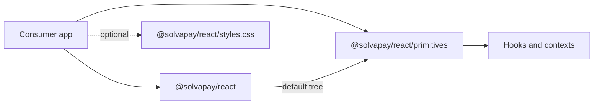

## Scope

**In scope** (all in this repo):

- Vendor Slot + compose helpers at `packages/react/src/primitives/`.
- Compound-primitive rewrite of 12 components + deletion of `PricingSelector`.
- `packages/react/src/styles.css` golden-path CSS.
- `packages/react/src/utils/errors.ts` structured errors.
- `packages/react/package.json` exports, sideEffects, files, version.
- `packages/react/{AGENTS,CONTRIBUTING,CHANGELOG,README}.md` (create/rewrite).
- `examples/{checkout-demo,tailwind-checkout,shadcn-checkout}`.
- `packages/react/registry/{registry,checkout,theme}.json` + `scripts/build-registry.mjs` (authoring only).
- CI: non-Next bundle smoke (Vite + Remix).
- Delete retired plans.
- Publish all 8 packages at `1.0.8-preview.1` to npm under the `preview` dist-tag (PR 8).

**Deferred to follow-up ticket (not this plan):**

- Cut `1.0.9` stable (or `1.0.10` if the release is deemed breaking): align `scripts/version-bump*.ts` `PACKAGES_TO_VERSION` with the filesystem scan, lockstep bump all 8 packages, publish, promote `preview` → `latest`, git tag.
- `docs/headless-primitives.mdx`, `docs/ai-builders/{lovable,v0,bolt}.mdx`, `docs/frameworks/{vite,remix}.mdx`, `docs/shadcn.mdx` (live in [`solvapay/docs`](https://github.com/solvapay/docs)).
- Mintlify `llms.txt` / `llms-full.txt` configuration.
- `solvapay.com/r/*` rewrite to unpkg (lives in [`solvapay/solvapay-website`](https://github.com/solvapay/solvapay-website)).
- Registry end-to-end CI (`shadcn add <hosted-url>`) — needs hosting first.
- Lovable smoke test by external reviewer — runs against the `1.0.8-preview.1` build published in PR 8.

## Target architecture

Two-tier entry points from `@solvapay/react`:

Every primitive: compound shape (`Foo.Root` + subcomponents), `asChild?` on leaves, `data-state` attribute with a fixed vocabulary, `data-solvapay-<primitive>[-<part>]` opaque selector, `.Loading` + `.Error` on every async primitive, no `classNames`/`unstyled`/function-child. State lives in existing `PlanSelectionContext` / `PaymentFormContext`.

## Version cadence

**State of the world:**

- npm `latest` (all 8 publishable packages): `1.0.7` (stable, predates this cutover).
- npm `preview`: `1.0.9-preview.1` — orphaned; published 2026-04-16 without the primitives work and unpublished before PR 8 runs (within the 72h self-service window). `@solvapay/supabase` never got this version, stuck at `1.0.1`.
- Local source (all 8 publishable packages): `1.0.8-preview.1` — a fresh preview track one patch above `1.0.7`. Reset from `1.0.10-preview.6`. PR commit messages 1-6 still reference the old `1.0.10-preview.*` numbers; that history is preserved as-is.

**Going forward:**

- PR 7 ships no version bump. Stays on `1.0.8-preview.1`. Not published.
- PR 8 publishes all 8 packages at `1.0.8-preview.1` to npm under the `preview` dist-tag via the `publish-preview.yml` workflow (manually triggered with `start_from_version=1.0.8-preview.1`). This is the build Lovable smoke-tests.
- PR 9 (visual regression) ships no code change consumers depend on; version bump optional — default: stay on `preview.1` unless regressions force a fix, in which case bump to `1.0.8-preview.2` and re-publish.
- Stable cut to `1.0.8` is a **separate follow-up ticket** after Lovable signs off (see Scope).

**All 8 publishable packages bump in lockstep**, not just `@solvapay/react`. This is a project-wide convention enforced by `scripts/check-dependency-health.ts`: stable + prerelease versions must match across `@solvapay/{auth,core,next,react,react-supabase,server,supabase}` and the flagship `solvapay` (CLI). The SDK-only cutover does not ship code changes to the other 7 — they get version-only bumps to preserve the invariant.

## TDD posture (pragmatic)

Per primitive: write the new primitive + rewrite its test file in the same commit. Test checklist per primitive (covers the plan's exit criteria):

1. Default render — subcomponents render expected DOM.
2. `asChild` composition — refs merge, event handlers chain, `data-*` + `aria-*` forward.
3. `data-state` transitions — context-driven state flips attribute correctly.
4. `.Loading` / `.Error` — subcomponents render when context signals loading/error.
5. Provider-missing + env-missing — structured error classes thrown with docs URL.

Delete legacy tests that assert on `classNames` / function-child / `RenderArgs` before landing the rewrite for that primitive.

---

## PR 1 — Foundation (no user-visible change)

Files create:

- [`packages/react/src/primitives/slot.tsx`](packages/react/src/primitives/slot.tsx) — vendored Radix `Slot` + `Slottable`.
- [`packages/react/src/primitives/composeRefs.ts`](packages/react/src/primitives/composeRefs.ts), [`packages/react/src/primitives/composeEventHandlers.ts`](packages/react/src/primitives/composeEventHandlers.ts).
- [`packages/react/src/primitives/index.ts`](packages/react/src/primitives/index.ts) — barrel (empty initially, re-exports Slot/Slottable).
- [`packages/react/src/utils/errors.ts`](packages/react/src/utils/errors.ts) — `MissingProviderError`, `MissingEnvVarError`, `MissingApiRouteError`, `MissingProductRefError`. Each message includes fix + docs URL.
- [`packages/react/CONTRIBUTING.md`](packages/react/CONTRIBUTING.md) — primitive contract (compound, asChild, data-state vocabulary, prohibitions). The cross-repo `docs/headless-primitives.mdx` is deferred; this file is the canonical contract until then.

Tests:

- `slot.test.tsx` — ref merging, event composition, `data-*`/`aria-*` forwarding, Slottable placement.
- `composeRefs.test.ts`, `composeEventHandlers.test.ts`.
- `errors.test.ts` — message shape + docs URL.

Package wiring:

- [`packages/react/package.json`](packages/react/package.json): add `./primitives` to `exports` pointing at `dist/primitives/index.{js,cjs,d.ts}`; extend `build` script with `src/primitives/index.ts` entry.

Delete:

- [`.cursor/plans/sdk_headless_remediation_a7c4e2f1.plan.md`](.cursor/plans/sdk_headless_remediation_a7c4e2f1.plan.md).
- [`.cursor/plans/sdk_headless_v2_d9181d28.plan.md`](.cursor/plans/sdk_headless_v2_d9181d28.plan.md).

Green gate: all existing tests pass, new primitive-barrel tests pass, `examples/checkout-demo` builds unchanged.

## PR 2 — Canary primitives: CheckoutSummary + PlanSelector

Rewrite both as compound primitives. `src/components/{CheckoutSummary,PlanSelector}.tsx` become thin default-tree shims that render the primitive with golden-path children + `.solvapay-*` class names (no CSS yet — classes are named targets for PR 5).

Primitive shapes:

- `CheckoutSummary.{Root, Product, Plan, Price, Trial, TaxNote}`.
- `PlanSelector.{Root, Heading, Grid, Card, CardName, CardPrice, CardInterval, CardBadge, Loading, Error}`. Card emits `data-state=idle|selected|current|disabled` + `data-free`, `data-popular`, `data-trial`.

Test rewrites: [`packages/react/src/components/CheckoutSummary.test.tsx`](packages/react/src/components/CheckoutSummary.test.tsx) and [`packages/react/src/components/PlanSelector.test.tsx`](packages/react/src/components/PlanSelector.test.tsx). Re-use the existing `plansCache`/`productCache` seeding pattern.

Barrel: remove `CheckoutSummaryRenderArgs`, `PlanSelectorClassNames`, `PlanSelectorRenderArgs` from [`packages/react/src/index.tsx`](packages/react/src/index.tsx). Add primitive exports at `./primitives`.

Green gate: unit tests pass, `CheckoutLayout.test.tsx` still green (CheckoutLayout still uses internal RenderedSelector this PR).

## PR 3 — CheckoutLayout recompose + PaymentForm primitives

- Delete `RenderedSelector` + `SelectBody` internals in [`packages/react/src/components/CheckoutLayout.tsx`](packages/react/src/components/CheckoutLayout.tsx) (~175 lines). Recompose from `PlanSelector.Root` default tree + sibling `<button className="solvapay-continue">`. Replace all inline `style={...}` with class names (rules land in PR 5).
- Delete `CheckoutLayoutProps.renderActivation` escape hatch + `CheckoutLayoutClassNames` from the barrel.
- Promote [`packages/react/src/components/PaymentFormSlots.tsx`](packages/react/src/components/PaymentFormSlots.tsx) into primitive form at `packages/react/src/primitives/PaymentForm.tsx`: `{Root, Summary, CustomerFields, PaymentElement, CardElement, MandateText, TermsCheckbox, SubmitButton, Loading, Error}`. SubmitButton emits `data-state=idle|processing|disabled` + `data-variant=paid|free|topup|activate`.
- Rebuild `FreePlanActivationForm` in [`packages/react/src/PaymentForm.tsx`](packages/react/src/PaymentForm.tsx) as composition of `PaymentForm.Summary + .MandateText + .TermsCheckbox + .SubmitButton`; activation submit handled in `PaymentFormContext`.

Tests: full rewrite of `PaymentForm.freePlan.test.tsx` + `CheckoutLayout.test.tsx` per the TDD checklist.

## PR 4 — Remaining primitives + PricingSelector deletion

Primitives (one commit per primitive ideal, all land in this PR):

- `ActivationFlow.{Root, Summary, ActivateButton, AmountPicker, ContinueButton, Retrying, Activated, Loading, Error}` — `data-state=summary|activating|selectAmount|topupPayment|retrying|activated|error`.
- `CreditGate.{Root, Heading, Subheading, Topup, Loading, Error}` — `data-state=allowed|blocked|loading`.
- `PurchaseGate.{Root, Allowed, Blocked, Loading, Error}`.
- `CancelledPlanNotice.{Root, Heading, Expires, DaysRemaining, AccessUntil, CancelledOn, Reason, ReactivateButton}` — `data-state=active|expired` + `data-has-reason`.
- `CancelPlanButton` leaf with `asChild` + `data-state=idle|cancelling`.
- `TopupForm.{Root, AmountPicker, PaymentElement, SubmitButton, Loading, Error}`.
- `AmountPicker.{Root, Option, Custom, Confirm}` — Option emits `data-state=idle|selected|disabled`.
- `BalanceBadge` leaf + `asChild` + `data-state=loading|zero|low|ok`.
- `MandateText`, `ProductBadge`, `PlanBadge` — leaves + `asChild`.

Delete: [`packages/react/src/components/PricingSelector.tsx`](packages/react/src/components/PricingSelector.tsx) + export from [`packages/react/src/index.tsx`](packages/react/src/index.tsx) + `PricingSelectorProps` type.

Barrel cleanup: remove every `*ClassNames`, `*RenderArgs` type export from [`packages/react/src/index.tsx`](packages/react/src/index.tsx); remove function-child type overloads on rewritten components.

Full test rewrite per primitive. Kill legacy `unstyled` / function-child tests.

Green gate: all primitive tests green, `examples/checkout-demo` builds using new primitives.

## PR 5 — Styles, package shape, types audit

Files:

- [`packages/react/src/styles.css`](packages/react/src/styles.css) — golden-path defaults keyed off `data-state=*` + `.solvapay-*` classes. Expose `--solvapay-accent`, `--solvapay-radius`, `--solvapay-surface`, `--solvapay-muted`, `--solvapay-font`.
- [`packages/react/package.json`](packages/react/package.json):
  - `exports`: add `./styles.css`, `./registry/*`.
  - `sideEffects: ["*.css"]`.
  - `files`: add `registry/`, `AGENTS.md`.
- tsup entries: confirm `src/primitives/index.ts` entry is wired from PR 1 and still building.

Types-surface audit: add a `packages/react/__tests__/types-surface.test-d.ts` type-level test (using `tsd` or a plain `tsc --noEmit` fixture) that imports every primitive's `Props` + every subcomponent's `Props` from `@solvapay/react/primitives`. CI job runs `tsc --noEmit` on this fixture.

## PR 6 — Examples

- Rewrite [`examples/checkout-demo`](examples/checkout-demo) against primitives. Golden-path `CheckoutLayout` continues to work as the drop-in.
- Create `examples/tailwind-checkout` (Next 16 + Tailwind v4). Uses `data-[state=X]:` variants. Does **not** import `@solvapay/react/styles.css`.
- Create `examples/shadcn-checkout` (Next 16 + shadcn/ui). Composes primitives with shadcn components via `asChild`. Source tree = the 4 files PR 7 registry installs (component + api route + lib + provider patch).

All three examples build green (`next build`) in CI.

## PR 7 — Registry authoring

Scope: registry JSON + generator + unit-level schema validation. No docs, no CI changes, no publish.

Files create:

- [`packages/react/registry/registry.json`](packages/react/registry/registry.json).
- [`packages/react/registry/checkout.json`](packages/react/registry/checkout.json) — `type: registry:block`, installs 4 files, declares env vars, `registryDependencies: ["button","card","input","checkbox","label"]`.
- [`packages/react/registry/theme.json`](packages/react/registry/theme.json).
- [`scripts/build-registry.mjs`](scripts/build-registry.mjs) — generates `checkout.json` from `examples/shadcn-checkout/`. CI runs on every PR touching `registry/` or `examples/shadcn-checkout/`; diff must be clean.
- Registry JSON schema validation test (unit test, no end-to-end shadcn install).

No version bump. Stays on `1.0.8-preview.1`. **Not published to npm** — registry JSON has no runtime consumer until the `solvapay.com/r/*` hosting follow-up lands.

Green gate: `build-registry.mjs` diff-check passes in CI; schema validation unit test passes; existing suites stay green.

## PR 8 — Docs + release readiness + preview publish

Scope: everything a Lovable operator needs to read, plus the CI that proves the package is framework-agnostic, plus the npm publish.

Docs (package-local, shipped in npm tarball):

- [`packages/react/README.md`](packages/react/README.md) rewrite — cap at 400 lines. 3-line quickstart, primitive cheat-sheet table, three worked examples (CheckoutLayout drop-in, Tailwind variants, shadcn composition). Link out to `AGENTS.md` + deferred Mintlify pages.
- [`packages/react/AGENTS.md`](packages/react/AGENTS.md) — cap at 300 lines. Agent instructions for consumer repos: install command (future hosted `shadcn add`), primitive cheat sheet, env var names, "don't hand-roll fetch" rule. This is what Lovable's system prompt will ingest.
- [`packages/react/CHANGELOG.md`](packages/react/CHANGELOG.md) — `1.0.8-preview.1` entry + migration guide (framed as "upcoming 1.0.8"). Before/after per primitive; two recipes ("I used `classNames`", "I used `unstyled` / function-child").

CI additions:

- Non-Next bundle smoke: Vite + Remix minimal builds importing `@solvapay/react/primitives`; verify no `next/*` imports leak in dist.

Pre-flight (outside the PR, done separately before the workflow runs):

- **Unpublish** of `1.0.9-preview.1` is blocked by npm (E405: "has dependent packages in the registry" — the 7 `1.0.9-preview.1` versions cross-reference each other). Self-service unpublish within the 72h window does not override this rule.
- **Deprecation is the realistic path** if cleanup hygiene is desired: `./scripts/deprecate-version.sh 1.0.9-preview.1 "orphaned preview - use @preview tag"`. Marks all 7 published packages as deprecated; `@solvapay/supabase` is automatically skipped (never on that version).
- **Doing nothing is also acceptable**: `--tag preview` on the `1.0.8-preview.1` publish moves the `preview` dist-tag automatically. The orphaned `1.0.9-preview.1` versions remain installable only by exact pin; Lovable's smoke test resolves `@preview` to `1.0.8-preview.1`.

Release (preview only, via `publish-preview.yml`):

- Confirm all 8 publishable packages are pinned at `1.0.8-preview.1` in the branch: `packages/{auth,cli,core,next,react,react-supabase,server,supabase}/package.json`. The workflow rewrites 7 of these at runtime but does **not** rewrite `packages/supabase/package.json`, so that one must be committed by hand (already done in the branch that introduces this plan change).
- Trigger `Publish Preview to NPM` (`.github/workflows/publish-preview.yml`) from the GitHub Actions UI with `start_from_version=1.0.8-preview.1`. The workflow runs `deps:check` + `test` + `build:packages` + `pnpm publish:preview` and pushes a `v1.0.8-preview.1` git tag.
- `pnpm publish:preview` uses `--tag preview --access public --no-git-checks --no-provenance`, which re-points the npm `preview` dist-tag to `1.0.8-preview.1`.
- Do **not** promote to `latest` — that is the stable follow-up ticket.

Pre-existing gap flagged (not fixed in this PR): `scripts/version-bump-preview.ts`, `scripts/version-bump.ts`, and `publish-preview.yml` itself hard-code a packages list that omits `packages/supabase/package.json`. Workaround is hand-committing supabase's version. The follow-up ticket for cutting stable will align all three lists with the source of truth (`scripts/check-dependency-health.ts`'s filesystem scan).

Green gate: non-Next bundle smoke green; all 8 packages resolve at `@solvapay/<pkg>@1.0.8-preview.1` from npm under `preview` tag; `npm install @solvapay/react@preview` in a scratch repo succeeds.

**Exit of PR 8 is the handoff point to Lovable for smoke testing.**

## PR 9 — Visual regression

- Playwright baselines per `examples/*` and each `CheckoutLayout` step (select / pay / activate / free-plan). Images committed as `*.png` artifacts under `packages/react/visual-regression/baselines/`.
- No version bump by default. If the tooling surfaces regressions that require code changes, bump to `1.0.8-preview.2` and re-publish under `preview`.

## Follow-up — cut stable (not in this plan)

Runs after Lovable confirms the `1.0.8-preview.1` build works in their flow. Tracked as a separate ticket so this plan can close cleanly.

Primary target is `1.0.8` stable. If the primitives rewrite is judged breaking enough to warrant a higher minor bump, the follow-up may cut `1.1.0` instead. `CHANGELOG.md` drafted in PR 8 is version-agnostic on this point.

Steps (for the follow-up ticket — recorded here so nothing is lost):

1. Align `scripts/version-bump-preview.ts` + `scripts/version-bump.ts` + `.github/workflows/publish-preview.yml` + `publish.yml` packages lists with the filesystem scan in `scripts/check-dependency-health.ts` so all 8 packages bump automatically (including `supabase`).
2. Lockstep bump all 8 packages to the chosen stable version.
3. Publish to npm (default tag).
4. Promote: `npm dist-tag add @solvapay/<pkg>@<version> latest` for each.
5. Git tag `@solvapay/react@<version>` (existing convention; other packages ride the same tag).

## Exit criteria for this plan (PR 8 merged + 1.0.8-preview.1 on npm)

- All 12 primitives migrated; `Loading` + `Error` on every async primitive.
- Zero inline styles in `packages/react/src/primitives/**`.
- `classNames` / `unstyled` / function-child / `*RenderArgs` removed everywhere.
- `styles.css` + CSS custom properties documented.
- `package.json` exports `./primitives`, `./styles.css`, `./registry/*`; `files` ships `registry/` + `AGENTS.md`.
- `examples/{checkout-demo,tailwind-checkout,shadcn-checkout}` all build green.
- Non-Next bundle smoke CI green.
- Visual regression baselines captured (PR 9).
- `README.md` &lt;400 lines; `AGENTS.md` &lt;300 lines; `CHANGELOG.md` migration guide published.
- Dev errors self-heal for: missing provider, missing env var, missing API route, missing product ref.
- All 8 packages published at `1.0.8-preview.1` on npm under `preview` dist-tag. `latest` untouched (stays on `1.0.7`).

## Open risks

- **`CheckoutLayout.renderActivation` escape hatch** — confirmed: deleted in PR 3 per the contract ("no escape hatches"). The primitives rewrite removes `classNames` / `unstyled` / `*RenderArgs` across the board. Whether this warrants `1.0.8` vs `1.1.0` is decided when the follow-up stable cut runs.
- **Registry end-to-end validation** — unit-level JSON schema check only until cross-repo hosting follow-up lands. Risk: shadcn install-time failures slip through to first external consumer. Mitigation: `examples/shadcn-checkout` is the source of truth for the registry and builds green in CI; Lovable smoke test on `1.0.8-preview.1` surfaces issues before `latest`.
- **Visual regression tooling** — split to PR 9 after the Lovable handoff.
- **Preview-only release** — consumers who install `@solvapay/react` without specifying a tag stay on `1.0.7` (`latest`). Intentional: this plan does not promote `preview` → `latest`; that happens in the follow-up ticket after Lovable sign-off.
- **Orphaned `1.0.9-preview.1`** — the prior preview track was published 2026-04-16 without the primitives work. npm blocks unpublishing because the 7 versions cross-reference each other in the registry (E405). Deprecation is available as an optional cleanup; otherwise the versions remain installable by exact pin but untagged. The `preview` dist-tag moves to `1.0.8-preview.1` on PR 8's publish, so Lovable's smoke test is unaffected.
- **Version number continuity** — PR commits 1-6 reference `1.0.10-preview.*` in their messages. Those versions were never published to npm. Local source has been reset to `1.0.8-preview.1` — a fresh track one patch above current stable (`1.0.7`). Historical commit messages are preserved as-is; no git rewrite.
