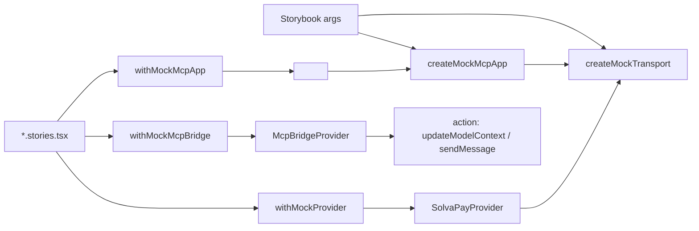

## Approach

Storybook 8 (Vite builder) installed at the repo root — no new pnpm workspace. Storybook config lives in `/.storybook/`, dev-deps land in the root `package.json`, and stories are colocated next to their components as `*.stories.tsx` under `packages/react/src/` (primitives under `components/` + `primitives/`, MCP surfaces under `mcp/views/` and `mcp/components/`). This matches how Radix UI, Chakra, shadcn, and most Turborepo component-library templates wire Storybook: the tool belongs to the repo, not to a workspace. The package `files` field already excludes tests from the npm tarball; stories follow the same pattern (tsup entry is unaffected because tsup only bundles `src/index.tsx` / `src/mcp/index.ts` and their imports, not `*.stories.tsx`).

Two rendering layers cover the two audiences:

1. **Primitives** — every component reads data through the `SolvaPayTransport` abstraction ([`packages/react/src/transport/types.ts`](packages/react/src/transport/types.ts)). One in-memory mock transport unlocks the entire library offline.
2. **MCP surfaces** — the same transport, but wrapped by a mock `McpAppFull` that also satisfies `McpBridgeAppLike` + `McpAppBootstrapLike`. That lets us mount the real [`<McpApp>`](packages/react/src/mcp/McpApp.tsx) shell (bootstrap → router → view) without a backend *or* an MCP host iframe, and render individual views with just `<SolvaPayProvider>` + `<McpBridgeProvider>` for tighter iteration.



## Key files

- New root-level Storybook config: `/.storybook/main.ts`, `/.storybook/preview.tsx`, `/.storybook/decorators.tsx`. `main.ts` globs stories via `['../packages/react/src/**/*.stories.@(ts|tsx)']` and sets `framework: '@storybook/react-vite'`. No new `package.json` / `tsconfig.json` / `vite.config.ts` — root configs extend cleanly.
- Root `package.json` gets Storybook devDeps (`storybook`, `@storybook/react-vite`, `@storybook/addon-essentials`, `@storybook/addon-a11y`, `@storybook/addon-interactions`) and scripts `storybook` / `storybook:build`.
- New fixtures module `packages/react/src/testing/mockTransport.ts` exporting `createMockTransport(overrides)` — returns a full `SolvaPayTransport` backed by mutable in-memory state (plans, product, merchant, purchases, balance, payment method). Reuse existing test fixtures if they exist under `packages/react/src/__tests__/` or the `@solvapay/test-utils` workspace; otherwise create a minimal fixture set here. Exported via a new `./testing` subpath export so stories (and integrators' own tests) can import it.
- New MCP-host mock `packages/react/src/testing/mockMcpApp.ts` exporting `createMockMcpApp(opts)` — returns an `McpAppFull` satisfying [`McpAppLike`](packages/react/src/mcp/adapter.ts), [`McpBridgeAppLike`](packages/react/src/mcp/bridge.tsx), and [`McpAppBootstrapLike`](packages/react/src/mcp/bootstrap.ts). Internals:
  - `callServerTool({ name, arguments })` — routes transport tool names (`list_plans`, `create_payment_intent`, `process_payment`, `activate_plan`, `create_topup_payment_intent`, `check_purchase`, `cancel_plan`, …) through the wrapped `createMockTransport`; routes intent tool names (`upgrade`, `manage_account`, `topup`, `nudge`, `paywall`) to a canned bootstrap payload per scenario preset.
  - `connect()` / `onhostcontextchanged` / `onteardown` / `requestTeardown()` — resolve immediately; `requestTeardown` is an `action('requestTeardown')` so stories capture close intent.
  - `getHostContext()` — returns a scenario-configurable `{ toolInfo: { tool: { name } }, theme: 'light'|'dark', fontFamily, safeAreaInsets, locale }` so `<McpApp>` can exercise `applyContext` and [`useHostLocale`](packages/react/src/mcp/useHostLocale.ts).
  - `addEventListener('toolresult', handler)` — stored in a set and fired by the exposed `emitToolResult(params)` helper, so a story action button can simulate the host re-invoking an intent tool against the mounted widget (the Phase 3 re-route path in [`McpApp.tsx`](packages/react/src/mcp/McpApp.tsx)).
  - `updateModelContext` / `sendMessage` — wrapped in `action()` so the Storybook Actions panel shows every bridge emission (great for verifying the Phase-5 `notifySuccess` copy).
- New `.stories.tsx` files colocated with each component under:
  - `packages/react/src/primitives/` and `packages/react/src/components/` for primitives (`PlanSelector`, `AmountPicker`, `CheckoutLayout`, `CheckoutSummary`, `CurrentPlanCard`, `CancelledPlanNotice`, `CreditGate`, `BalanceBadge`, `ProductBadge`, `ActivationFlow`, `UpdatePaymentMethodButton`, `LaunchCustomerPortalButton`, `MandateText`, `PaymentForm`, `TopupForm`).
  - `packages/react/src/mcp/views/` for view-level stories (`McpCheckoutView`, `McpAccountView`, `McpTopupView`, `McpPaywallView`, `McpNudgeView`, `detail-cards`) and `packages/react/src/mcp/components/` for `McpUpsellStrip`.
  - `packages/react/src/mcp/McpApp.stories.tsx` for shell-level routing / bootstrap stories.
- `/.storybook/preview.tsx` imports `@solvapay/react/styles.css` and `@solvapay/react/mcp/styles.css` once globally and registers `withMockProvider` as a default decorator. `/.storybook/decorators.tsx` exports opt-in `withMockMcpBridge` and `withMockMcpApp` (imported by stories via a relative path, e.g. `../../../../.storybook/decorators`).

## Story shape

```tsx
// packages/react/src/components/CurrentPlanCard.stories.tsx
import type { Meta, StoryObj } from '@storybook/react'
import { CurrentPlanCard } from './CurrentPlanCard'
import { withMockProvider } from '../../../.storybook/decorators'

const meta: Meta<typeof CurrentPlanCard> = {
  title: 'Account/CurrentPlanCard',
  component: CurrentPlanCard,
  decorators: [withMockProvider],
  argTypes: {
    transportScenario: {
      control: 'select',
      options: ['recurring-active', 'one-time-expiring', 'usage-based', 'cancelled'],
    },
  },
}
export default meta
export const RecurringActive: StoryObj<typeof CurrentPlanCard> = { args: { transportScenario: 'recurring-active' } }
export const Cancelled: StoryObj<typeof CurrentPlanCard> = { args: { transportScenario: 'cancelled' } }
```

The decorator reads `transportScenario` from `context.args` and maps to a fixture preset, so you can flip scenarios live in the sidebar without touching code.

## Scenario coverage (mock transport presets)

- `no-purchase` — empty `purchases: []`
- `recurring-active` — active recurring plan, card on file
- `recurring-cancelled` — scheduled to end at period end
- `one-time-active` — non-recurring paid purchase
- `usage-based` — balance + top-up flow
- `free-tier-exceeded` — triggers `CreditGate`
- `loading` — transport methods return never-resolving promises
- `error` — transport methods reject

## Stripe-backed components

`PaymentForm` / `StripePaymentFormWrapper` need `@stripe/stripe-js` with a publishable key. Two stories per Stripe component:
- **Visual shell** (default, no Stripe key): wrap in a stub that renders a skeleton matching the real layout so we can iterate on the surrounding chrome (labels, buttons, error states). Set via a feature flag in the decorator.
- **Live** (requires `VITE_STRIPE_PUBLISHABLE_KEY` in `/.env.local` at the repo root): renders real Stripe Elements in test mode.

## MCP SDK components

The MCP layer (`@solvapay/react/mcp`) has three surfaces worth storying, each with its own decorator stack:

### 1. View-level stories (fastest iteration)

Mount a view directly under `<SolvaPayProvider>` + `<McpBridgeProvider>` with a fake `app` — skips bootstrap/router entirely. Use for pure chrome iteration on `McpCheckoutView`, `McpAccountView`, `McpTopupView`, `McpPaywallView`, `McpNudgeView`, `McpUpsellStrip`, `McpCustomerDetailsCard`, `McpSellerDetailsCard`, `BackLink`.

```tsx
// packages/react/src/mcp/views/McpAccountView.stories.tsx
import type { Meta, StoryObj } from '@storybook/react'
import { McpAccountView } from './McpAccountView'
import { withMockProvider, withMockMcpBridge } from '../../../../.storybook/decorators'

const meta: Meta<typeof McpAccountView> = {
  title: 'MCP/Views/McpAccountView',
  component: McpAccountView,
  decorators: [withMockProvider, withMockMcpBridge],
  args: { productRef: 'prod_demo', returnUrl: 'https://example.test/r', publishableKey: 'pk_test_demo' },
  argTypes: {
    transportScenario: { control: 'select', options: ['recurring-active', 'recurring-cancelled', 'usage-based'] },
  },
}
export default meta
export const RecurringActive: StoryObj<typeof McpAccountView> = { args: { transportScenario: 'recurring-active' } }
export const UsageBased: StoryObj<typeof McpAccountView> = { args: { transportScenario: 'usage-based' } }
```

### 2. Shell-level stories (bootstrap + router exercise)

Mount `<McpApp app={createMockMcpApp(scenario)} />` so the real `McpApp.tsx` drives `connect → classifyHostEntry → fetchMcpBootstrap → McpViewRouter`. One shell story per view kind plus one "data-tool entry" story that exercises the `ui/notifications/tool-result` wait path and one "host re-routes" story that uses `emitToolResult` to flip view kind live.

```tsx
// packages/react/src/mcp/McpApp.stories.tsx
export const BootstrapToCheckout: StoryObj = {
  args: { entry: 'intent', toolName: 'upgrade', transportScenario: 'recurring-active', hostTheme: 'light' },
}
export const DataToolEntry: StoryObj = {
  args: { entry: 'data', toolName: 'search_knowledge', transportScenario: 'free-tier-exceeded' },
}
export const HostRerouteLive: StoryObj = {
  args: { entry: 'intent', toolName: 'upgrade', transportScenario: 'recurring-active' },
  render: (args, ctx) => <HostRerouteHarness {...args} />, // exposes a button that calls ctx.app.emitToolResult(...)
}
```

### 3. Bridge-emission stories

Exercise [`notifyModelContext`](packages/react/src/mcp/bridge.tsx) + [`notifySuccess`](packages/react/src/mcp/bridge.tsx). `createMockMcpApp` routes `updateModelContext` / `sendMessage` through Storybook's `action()` helper, so clicking through the PAYG top-up or recurring activation flow produces a visible event trail in the Actions panel. No extra stories required — this is a free byproduct of the shell-level stories.

### Scenario axes (added to the existing list)

- View kind — `checkout | account | topup | paywall | nudge` (drives bootstrap `view` + host-context `toolInfo.tool.name`).
- Host entry classification — `intent | data | unknown` (see [`classifyHostEntry`](packages/react/src/mcp/bootstrap.ts)).
- Stripe probe — `ready | blocked | loading` via a `mockStripeProbe` helper that swaps [`useStripeProbe`](packages/react/src/mcp/useStripeProbe.ts) with a Storybook-arg-driven stub in `/.storybook/preview.tsx` (Vite alias). The default covers all three programmatically; a separate "Live probe" story omits the stub and uses `VITE_STRIPE_PUBLISHABLE_KEY` for realism.
- Host context — `theme: light|dark`, `fontFamily`, `safeAreaInsets`, `locale` (exercises `applyContext` + `useHostLocale`).
- Success follow-ups — `messageOnSuccess` prop toggle: `default | custom | suppressed` (so designers can preview the three Phase-5 copy modes).

### Cache-seed + refresh caveats

`<McpApp>` calls [`seedMcpCaches`](packages/react/src/mcp/cache-seed.ts) synchronously during render. Because Storybook remounts between args changes but `seedMcpCaches` mutates module-level caches, the preview decorator must clear those caches between stories. Add a `resetMcpCaches()` export alongside `seedMcpCaches` (or call the existing seed with an empty snapshot) from the `withMockMcpApp` decorator's cleanup to avoid cross-story bleed — flag as a small follow-up to the existing cache-seed module.

## Scripts + tooling

- Root `package.json` scripts: `storybook` → `storybook dev -p 6006`, `storybook:build` → `storybook build`. Run with `pnpm storybook` from the repo root.
- `turbo.json` gets a `storybook:build` task (no inputs caching for the dev server).
- Storybook addons: `@storybook/addon-essentials` (controls, actions, viewport, backgrounds), `@storybook/addon-a11y`, `@storybook/addon-interactions`. Skip Chromatic for now per your hosting choice.
- Document usage in root `README.md` ("Browse every component locally: `pnpm storybook`") with a short pointer from `packages/react/README.md`.

## Non-goals (flag for later)

- No public hosting in this pass — purely local `pnpm storybook`. Likely follow-up is a static build deployed behind the existing nginx wildcard at `storybook.solvapay.com` (see [`solvapay-infrastructure/nginx/`](solvapay-infrastructure/nginx/)); deferred to its own plan.
- No Chromatic visual regression — easy to bolt on later since CSF stories are the source of truth.
- Not migrating existing `examples/checkout-demo` / `examples/mcp-checkout-app` — they remain the end-to-end integration proofs; Storybook is the per-component / per-view explorer.
- Not covering a real MCP host iframe (`@modelcontextprotocol/ext-apps` host runtime) — `createMockMcpApp` is a structural mock; actual iframe transport is already covered by `examples/mcp-checkout-app` + MCP Inspector.