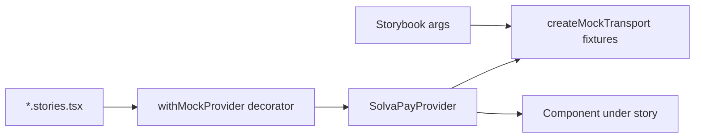

## Approach

Storybook 8 (Vite builder) as a new `apps/storybook` workspace that depends on `@solvapay/react` via `workspace:*`. Stories are colocated next to their components as `*.stories.tsx` under `packages/react/src/components/` so they live with the code they document and are picked up by Storybook's glob. The package `files` field already excludes tests from the npm tarball; stories will follow the same pattern (tsup entry is unaffected because tsup only bundles `src/index.tsx` and its imports, not `*.stories.tsx`).

Every component reads data through the `SolvaPayTransport` abstraction ([`packages/react/src/transport/types.ts`](packages/react/src/transport/types.ts)). One in-memory mock transport unlocks the entire library offline.



## Key files

- New workspace `apps/storybook/` with `package.json`, `vite.config.ts`, `.storybook/main.ts`, `.storybook/preview.tsx`, `tsconfig.json`.
- New fixtures module `packages/react/src/testing/mockTransport.ts` exporting `createMockTransport(overrides)` — returns a full `SolvaPayTransport` backed by mutable in-memory state (plans, product, merchant, purchases, balance, payment method). Reuse existing test fixtures if they exist under `packages/react/src/__tests__/` or the `@solvapay/test-utils` workspace; otherwise create a minimal fixture set here. Exported via a new `./testing` subpath export so stories (and integrators' own tests) can import it.
- New `.stories.tsx` files colocated with each component under `packages/react/src/components/` and `packages/react/src/` (for `PaymentForm`, `TopupForm`). Cover the checkout surface first (`PlanSelector`, `AmountPicker`, `CheckoutLayout`, `CheckoutSummary`, `CurrentPlanCard`, `CancelledPlanNotice`, `CreditGate`, `BalanceBadge`, `ProductBadge`, `ActivationFlow`, `UpdatePaymentMethodButton`, `LaunchCustomerPortalButton`, `MandateText`).
- `apps/storybook/.storybook/preview.tsx` imports `@solvapay/react/styles.css` once globally and registers a `withMockProvider` decorator that wires `SolvaPayProvider config={{ transport: createMockTransport(args.transport) }}`.

## Story shape

```tsx
// packages/react/src/components/CurrentPlanCard.stories.tsx
import type { Meta, StoryObj } from '@storybook/react'
import { CurrentPlanCard } from './CurrentPlanCard'
import { withMockProvider } from '../../../apps/storybook/.storybook/decorators'

const meta: Meta<typeof CurrentPlanCard> = {
  title: 'Account/CurrentPlanCard',
  component: CurrentPlanCard,
  decorators: [withMockProvider],
  argTypes: {
    transportScenario: {
      control: 'select',
      options: ['recurring-active', 'one-time-expiring', 'usage-based', 'cancelled'],
    },
  },
}
export default meta
export const RecurringActive: StoryObj<typeof CurrentPlanCard> = { args: { transportScenario: 'recurring-active' } }
export const Cancelled: StoryObj<typeof CurrentPlanCard> = { args: { transportScenario: 'cancelled' } }
```

The decorator reads `transportScenario` from `context.args` and maps to a fixture preset, so you can flip scenarios live in the sidebar without touching code.

## Scenario coverage (mock transport presets)

- `no-purchase` — empty `purchases: []`
- `recurring-active` — active recurring plan, card on file
- `recurring-cancelled` — scheduled to end at period end
- `one-time-active` — non-recurring paid purchase
- `usage-based` — balance + top-up flow
- `free-tier-exceeded` — triggers `CreditGate`
- `loading` — transport methods return never-resolving promises
- `error` — transport methods reject

## Stripe-backed components

`PaymentForm` / `StripePaymentFormWrapper` need `@stripe/stripe-js` with a publishable key. Two stories per Stripe component:
- **Visual shell** (default, no Stripe key): wrap in a stub that renders a skeleton matching the real layout so we can iterate on the surrounding chrome (labels, buttons, error states). Set via a feature flag in the decorator.
- **Live** (requires `VITE_STRIPE_PUBLISHABLE_KEY` in `apps/storybook/.env.local`): renders real Stripe Elements in test mode.

## Scripts + tooling

- Root `turbo.json` gets a `storybook` task.
- `apps/storybook/package.json` scripts: `dev` → `storybook dev -p 6006`, `build` → `storybook build`.
- Add `pnpm storybook` passthrough in root `package.json` scripts for convenience.
- Storybook addons: `@storybook/addon-essentials` (controls, actions, viewport, backgrounds, a11y disabled by default), `@storybook/addon-a11y`, `@storybook/addon-interactions`. Skip Chromatic for now per your hosting choice.
- Document usage in `packages/react/README.md` ("Browse every component locally: `pnpm --filter storybook dev`") and in `apps/storybook/README.md`.

## Non-goals (flag for later)

- No public hosting in this pass — purely local `pnpm dev`.
- No Chromatic visual regression — easy to bolt on later since CSF stories are the source of truth.
- Not migrating existing `examples/checkout-demo` et al. — they remain the end-to-end integration proofs; Storybook is the per-component explorer.