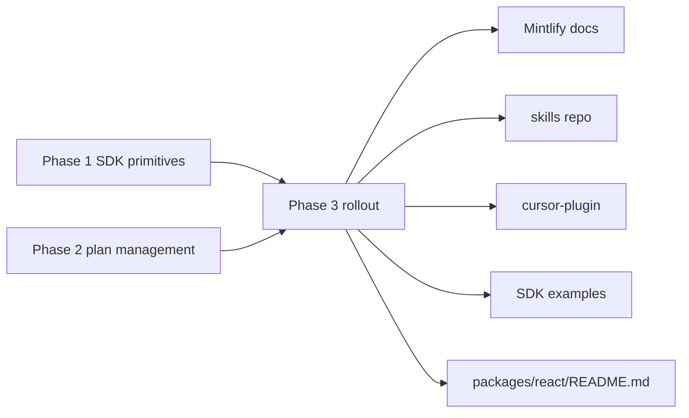

## Relationship to Phase 1 and Phase 2

- Phase 1 ([sdk_plan_selector_3646143f.plan.md](.cursor/plans/sdk_plan_selector_3646143f.plan.md)) ships the full checkout loop: `<CheckoutLayout>` golden path, `<PlanSelector>`, `<ActivationFlow>`, `<AmountPicker>`, `<CancelPlanButton>`, `<CancelledPlanNotice>`, `<CreditGate>`, plus Supabase-edge parity for `getMerchant` + `getProduct`.
- Phase 2 ([sdk_plan_management_phase2_6e40d833.plan.md](.cursor/plans/sdk_plan_management_phase2_6e40d833.plan.md)) adds post-checkout management: `<CurrentPlanCard>`, `<PlanSwitcher>`, `<PaymentMethodForm>`, `<UpdatePaymentMethodButton>` + three new backend endpoints.

Phase 3 is pure downstream: no SDK code changes, no backend changes. It propagates the new surface out to every consumer-facing channel (`packages/react/README.md`, Mintlify docs, skills repo, cursor plugin, remaining examples) so agents and humans reach for `<CheckoutLayout>` first.

## Dependency and sequencing

Phase 3 work can start **incrementally** as Phase 1 + Phase 2 PRs land — there's no hard gate. Recommended order:

1. `readme-react-three-layer` — runs in parallel with the tail end of Phase 1 so the SDK README matches the shipped surface on day one.
2. Docs pages (`docs-checkout-composition-guide`, `docs-merchant-endpoint-ref`, `docs-localization-guide`) — open after Phase 1 PRs merge; extend after Phase 2 merges.
3. Skills + plugin updates — open after Phase 1 PRs merge; one follow-up after Phase 2.
4. Examples audit + Supabase-edge React snippet — any time after Phase 1.
5. Final verification pass once all the above have landed.

Each todo is independently shippable. Treat Phase 3 as a rolling maintenance phase, not a single landing.

## Carried over from `sdk-checkout-composition`

Three follow-up items were pending on the now-completed composition plan and are absorbed here:

| Original todo                                                                    | Carried into                                                     |
| -------------------------------------------------------------------------------- | ---------------------------------------------------------------- |
| `followup-sdk-examples` (backfill CheckoutLayout into all examples)              | `other-examples-audit` + `supabase-edge-react-snippet`           |
| `followup-docs` (composition guide, merchant reference, localization guide)      | `docs-checkout-composition-guide`, `docs-merchant-endpoint-ref`, `docs-localization-guide` |
| `followup-skills` (CheckoutLayout-first agent skills)                            | `skills-checkout-layout-first`, `skills-lovable-overlay`, `skills-account-surface`, `plugin-mirror-skills` |

The fourth composition todo (`docs-examples` — packages/react/README + checkout-demo rewrite) is fully subsumed by Phase 1's `readme` + `demo-rewrite-page` + `demo-mount-routes` todos and does not need to carry forward.

## Out of scope

- Translating the `SolvaPayCopy` bundle into any non-English locale in-SDK. The localization docs page ships with a Swedish snippet as a worked example only. Full bundles remain integrator-owned (matches `stripe-js`, `react-i18next`).
- Building a dedicated "React-on-Supabase" example app. Lovable wiring is documented via the README snippet + skills guide; a standalone example is a separate plan if demand appears.
- Phase 3 tracking for any hybrid-plan copy — hybrid plans are still backend-gated (see composition plan out-of-scope section).
- Customer-portal UI beyond `<CurrentPlanCard>` + `<PlanSwitcher>` (invoice history, billing address, tax ID). Tracked as Phase 4 candidates in the Phase 2 plan's out-of-scope section.
