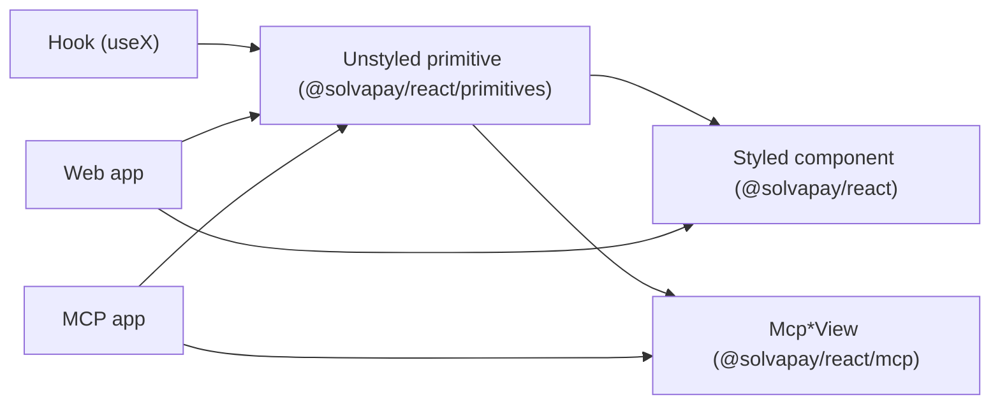

# SDK MCP coverage — phase 2

## Status

Phases 2.1, 2.2, and 2.3 are shipped. See the Progress section at the bottom for the delivered artefacts.

Remaining open work:
- `phase-2-docs-changeset` — README / CHANGELOG / changesets not written yet.
- `phase-2-4-to-2-8-scoped` — scope-only placeholders, never in this plan.
- `phase-2-followups-shadcn-locales` — tracked as separate follow-up plans.

## Component conventions (hard requirement for every new component)

Every primitive, component, and view added in phase 2 MUST pass this checklist. Code review blocks on any miss.

### Styling — agnostic, with opt-in defaults

- **Headless shape**: leaf primitives export `forwardRef`, support `asChild` via `Slot`, accept `className` and all standard HTML props as pass-through. Compound primitives expose a `classNames` prop (per-element overrides) matching `CurrentPlanCardClassNames` / `McpViewClassNames`.
- **State via attributes, not props**: every stateful primitive emits `data-solvapay-<component-name>` + `data-state="<name>"` so integrators can target with `data-[state=selected]:ring-2` without touching SDK classes.
- **No inline styles** in any primitive. Default-tree components (`@solvapay/react`) may use class names, but never `style={{}}`.
- **Default styles are opt-in** via `@solvapay/react/styles.css` (core) and `@solvapay/react/mcp/styles.css` (views). Themed through CSS custom properties (`--solvapay-accent`, `--solvapay-muted`, `--solvapay-radius`, `--solvapay-font`, plus new ones as needed) — never via hardcoded colours.
- **Default class names follow the prefix convention**: `solvapay-<component>` for core, `solvapay-mcp-<view>` for views.

### shadcn compatibility

- **`asChild` composition must work end-to-end** — every primitive leaf supports `asChild` so integrators can swap the underlying element for a shadcn `<Card>`, `<Button>`, `<Input>`, etc. The [shadcn-checkout example](examples/shadcn-checkout/app/checkout/page.tsx) is the canonical integration pattern and new primitives should be added there as coverage.
- **Shadcn CLI registry distribution is out of scope for phase 2** — tracked as a separate follow-up (see "Follow-ups" section). The `packages/react/registry/` directory and `./registry/*` package.json export exist today but are unbacked; no new work here beyond keeping the `asChild` contract pristine so the future registry can auto-generate wrappers.

### Localisation

- **Zero hardcoded user-visible strings.** Every CTA label, heading, error, placeholder, mandate line, and status message routes through `useCopy()` → `SolvaPayCopy`.
- **New strings land in three places**: add a key to the appropriate section of [packages/react/src/i18n/types.ts](packages/react/src/i18n/types.ts) `SolvaPayCopy` interface, add the canonical English value to [packages/react/src/i18n/en.ts](packages/react/src/i18n/en.ts) `enCopy`, consume via `useCopy()` (function-form for pluralised/contextual strings, template-string with `{placeholder}` tokens for simple interpolation via the existing `interpolate` helper).
- **Error messages too** — paywall / usage / history errors go into `copy.errors.*` or a new section of `SolvaPayCopy`, never `throw new Error('hardcoded')`.
- **Additional locale packs (de/fr/es/sv) are out of scope for phase 2** — tracked as a separate follow-up. Requiring full `SolvaPayCopy` coverage in phase 2 keeps locale debt from accruing and unblocks external locale packs immediately.

### Test

Add a lint/test that fails if a phase-2 primitive renders user-visible text without going through `useCopy()` — either an ESLint rule that flags JSX string literals inside SolvaPay components or a unit test that renders each view with a stubbed `CopyProvider` and snapshot-matches against the English copy keys. _Follow-up: not written yet; all new code routes through `useCopy` but there is no automated guardrail._

## Dual-audience design (applies to every item)



- **Transport is the only thing that differs between audiences.** `SolvaPayTransport` is already dual-implemented (HTTP + MCP adapter). Everything below runs through it.
- **New data methods always land in three places at once**: `SolvaPayTransport` interface, `createHttpTransport` (new route), `createMcpAppAdapter` (new `MCP_TOOL_NAMES.x` constant + tool binding). Skipping any of the three breaks one audience.
- **UI always lands as primitive first, then view.** Never build an `Mcp*View` without exposing the unstyled primitive it wraps — web-app integrators would have no way to reuse it.

## Phases overview

| Phase | Addition | Primitive | Mcp view | Transport addition | Backend dep |
|---|---|---|---|---|---|
| 2.1 ✅ | Paywall bridge | `<PaywallNotice>` + `usePaywallResolver` | `McpPaywallView` + `open_paywall` tool | `.mcp()` auto-converts `PaywallError` + `registerPayableTool` + `paywallToolResult` helpers | none |
| 2.2 ✅ | Usage visibility | `<UsageMeter>` + `useUsage` | `McpUsageView` + `open_usage` tool | `getUsage()` → `get_usage` tool | none (uses `getUserInfo` today) |
| 2.3 ✅ | Server helper | — | — | — | `@solvapay/server/mcp` gains `createSolvaPayMcpServer` |
| 2.4 | Payment history | `<PaymentHistoryList>` + `usePayments` | `McpHistoryView` + `open_history` tool | `listPayments()` → `list_payments` tool | backend already has endpoint |
| 2.5 | Post-purchase success | `<PurchaseSuccess>` | folded into `McpCheckoutView` post-pay | none | none |
| 2.6 | Plan switcher | `<PlanSwitcher>` | folded into `McpAccountView` | `switchPlan()` → `switch_plan` tool | **requires new backend endpoint** — flag to backend team |
| 2.7 | Unauthenticated pricing | `<PricingTable>` | — (not an MCP view, marketing surface) | reuses `listPlans` (already unauthenticated) | none |
| 2.8 | Status banners | `<PurchaseBanner>` compound | folded into `McpAccountView` | none (derives from existing hooks) | none |

Phases 2.4–2.8 are scoped but left at "overview" level — detailed below are 2.1, 2.2, and 2.3, the three highest-leverage additions.

---

## Phase 2.1 — Paywall bridge: close the server↔client loop ✅ shipped

### Why this first

`@solvapay/server` ships a powerful `PaywallError` with `PaywallStructuredContent` ([packages/server/src/paywall.ts](packages/server/src/paywall.ts), [packages/server/src/types/paywall.ts](packages/server/src/types/paywall.ts)), but there are two gaps around it. On the server, every integrator wrapping a tool in `payable(...)` hand-writes the same `try/catch` → `_meta.ui` boilerplate ([the snippet in the current example](examples/mcp-checkout-app/src/server.ts)). On the client, nothing renders the resulting `structuredContent`. Phase 2.1 closes both ends.

### The flow

```mermaid
sequenceDiagram
  participant LLM
  participant MCP as MCP Server (payable tool)
  participant Host as MCP Host
  participant UI as McpPaywallView
  LLM->>MCP: call create_video(...)
  MCP->>MCP: checkLimits() fails → PaywallError
  Note right of MCP: .mcp() auto-converts to CallToolResult;<br/>registerPayableTool attaches _meta.ui
  MCP->>LLM: { isError, structuredContent, _meta.ui }
  LLM->>Host: call open_paywall({ content })
  Host->>UI: render ui://app with bootstrap.paywall
  UI->>UI: <PaywallNotice> → <PlanSelector> + <PaymentForm>
  UI->>MCP: create_payment_intent + process_payment
  UI->>LLM: retry create_video (now passes checkLimits)
```

### Server side — make payable tools one-liners

Four additions compose: a shared type guard ((0) below), (a) the protocol conversion lives on `.mcp()`, (b) the UI metadata lives on the registration helper, (c) a fallback helper covers hand-rolled handlers.

**2.1.0 `isPaywallStructuredContent` type guard — ✅ shipped**

File: [packages/server/src/types/paywall.ts](packages/server/src/types/paywall.ts).

```ts
export function isPaywallStructuredContent(value: unknown): value is PaywallStructuredContent {
  return (
    typeof value === 'object' &&
    value !== null &&
    'kind' in value &&
    (value.kind === 'payment_required' || value.kind === 'activation_required')
  )
}
```

Re-exported from `@solvapay/server` top-level. Used by 2.1.b (paywall-result detection), 2.1.i (bootstrap validation), and `McpPaywallView` (prop runtime check in dev). One guard, one truth.

**2.1.a `.mcp()` auto-converts `PaywallError` to `CallToolResult` — ✅ shipped**

File: [packages/server/src/paywall.ts](packages/server/src/paywall.ts) — `createMCPHandler` (currently line 731).

Today `createMCPHandler` returns the raw `protectedHandler`, which re-throws `PaywallError`. Change it to catch `PaywallError` and return a `PaywallToolResult`:

```ts
function createMCPHandler(/* …existing args… */) {
  const protectedHandler = /* existing paywall.protect(...) */
  return async (args: PaywallArgs) => {
    try {
      return await protectedHandler(args)
    } catch (err) {
      if (err instanceof PaywallError) {
        return {
          isError: true,
          content: [{ type: 'text', text: err.message }],
          structuredContent: err.structuredContent,
        } satisfies PaywallToolResult
      }
      throw err
    }
  }
}
```

- **Does not attach `_meta.ui`** — that depends on the MCP server's `resourceUri`, which `.mcp()` doesn't know. Added by 2.1.b / 2.1.c.
- `.http()` / `.next()` variants keep throwing `PaywallError` — they already have their own response encoders ([paywallErrorToClientPayload](packages/server/src/paywall.ts)).
- **Backward compatibility**: any integrator catching `PaywallError` around a `.mcp()` call loses the throw. Ship with the phase 2 minor bump; call it out in CHANGELOG.

**2.1.b `registerPayableTool` in `@solvapay/server/mcp` — ✅ shipped**

File: `packages/server/src/mcp/registerPayableTool.ts` (new).

Shape mirrors `registerAppTool(server, name, schema, handler)` — positional `name`, options object for the rest. This keeps one convention across the ecosystem and makes the tool name scannable at the call site.

```ts
export interface RegisterPayableToolOptions<TArgs, TResult> {
  solvaPay: SolvaPay
  resourceUri: string
  schema: ZodTypeAny
  product: string
  handler: (args: TArgs, extra: McpToolExtra) => Promise<TResult>
  paywallToolName?: string // defaults to 'open_paywall'
  getCustomerRef?: (extra: McpToolExtra) => string | null
}

export function registerPayableTool<TArgs, TResult>(
  server: McpServer,
  name: string,
  options: RegisterPayableToolOptions<TArgs, TResult>,
): void
```

Internally:
1. Builds `protectedHandler = solvaPay.payable({ product }).mcp(handler)` (which already auto-converts `PaywallError` after 2.1.a).
2. Registers via `registerAppTool(server, name, schema, wrapped)`.
3. `wrapped` awaits `protectedHandler`, and if `isPaywallStructuredContent(result.structuredContent)` (the 2.1.a type guard), merges `_meta: { ui: { resourceUri, toolName: paywallToolName ?? 'open_paywall' } }`.

**2.1.c `createSolvaPayMcpServer` binding — ✅ shipped (see 2.3)**

The 2.3 helper exposes a `registerPayable(name, options)` closure that already has `server`, `solvaPay`, and `resourceUri` bound, and **defaults `product` to the server's `productRef`** so single-product apps don't repeat themselves:

```ts
createSolvaPayMcpServer({
  solvaPay,
  productRef: 'prd_video',
  resourceUri: 'ui://my-app/mcp-app.html',
  htmlPath,
  publicBaseUrl,
  additionalTools: ({ server, registerPayable }) => {
    registerPayable('create_video', {
      schema: z.object({ prompt: z.string() }),
      handler: async ({ prompt }) => ({ videoUrl: await generateVideo(prompt) }),
      // product defaults to 'prd_video' (the server's productRef)
    })
  },
})
```

Multi-product apps override `product` per tool. Zero `try/catch`, zero `_meta`, zero `payable(...).mcp(...)` chain, zero `resourceUri` plumbing.

**2.1.d `paywallToolResult` helper for hand-rolled servers — ✅ shipped**

File: `packages/server/src/mcp/paywallToolResult.ts` (new).

For integrators who aren't ready to adopt `registerPayableTool` but still want to drop the `try/catch`:

```ts
export function paywallToolResult(
  err: PaywallError,
  ctx: { resourceUri: string; toolName?: string },
): PaywallToolResult {
  return {
    isError: true,
    content: [{ type: 'text', text: err.message }],
    structuredContent: err.structuredContent,
    _meta: { ui: { resourceUri: ctx.resourceUri, toolName: ctx.toolName ?? 'open_paywall' } },
  }
}
```

Exported from `@solvapay/server/mcp`. `registerPayableTool`'s post-processor is implemented on top of it.

**2.1.e `open_paywall` tool — ✅ shipped**

Lands inside `createSolvaPayMcpServer` (phase 2.3). Contracted here:

- New `MCP_TOOL_NAMES.openPaywall = 'open_paywall'` added to [packages/react/src/mcp/tool-names.ts](packages/react/src/mcp/tool-names.ts) (single source of truth for the React SDK) with a mirror in `packages/server/src/mcp/tool-names.ts` so the server package doesn't take a cross-package dep on `@solvapay/react`.
- Input schema: `{ content: PaywallStructuredContent }` — lets a host or another tool hand a paywall payload directly.
- Output `structuredContent`: the same shape as other `open_*` tools (`view: 'paywall', productRef, stripePublishableKey, returnUrl`) **plus** `paywall: content` so `<McpApp>` gets everything it needs from the bootstrap call alone.
- Registered automatically when `'paywall'` is in `options.views` (default `views` includes it).

### Client side — render the paywall

**2.1.f `<PaywallNotice>` compound primitive — ✅ shipped**

File: `packages/react/src/primitives/PaywallNotice.tsx`.

Transport-agnostic; works in any tree under `SolvaPayProvider`. Exposes `Root / Heading / Message / ProductContext / Plans / Balance / HostedCheckoutLink / EmbeddedCheckout / Retry`.

**2.1.g `usePaywallResolver(content)` hook — ✅ shipped**

File: `packages/react/src/hooks/usePaywallResolver.ts`.

Watches `usePurchase` + `useBalance`:
- `payment_required` → `resolved = hasPaidPurchase && activePurchase?.productRef === content.product`.
- `activation_required` with `content.balance` (checked via `balance.remainingUnits` and `balance.creditsPerUnit` — the real `LimitBalanceDto` shape) → resolved once the customer has enough prepaid capacity.
- `activation_required` without balance → `resolved = activePurchase?.productRef === content.product && activePurchase.status === 'active'`.

Used by `<PaywallNotice.Retry>`; exported so web-app integrators can drive their own retry UI.

**2.1.h `McpPaywallView` — ✅ shipped**

File: `packages/react/src/mcp/views/McpPaywallView.tsx`.

Thin shell: styled `<PaywallNotice>` with `solvapay-mcp-*` class names, same `useStripeProbe` gating as `McpCheckoutView`.

**2.1.i Bootstrap + `<McpApp>` routing — ✅ shipped**

Files: [packages/react/src/mcp/bootstrap.ts](packages/react/src/mcp/bootstrap.ts), [packages/react/src/mcp/McpApp.tsx](packages/react/src/mcp/McpApp.tsx).

- Added `'paywall'` to `McpView`.
- Added `open_paywall` → `'paywall'` mapping to `OPEN_TOOL_FOR_VIEW` + `inferViewFromHost`.
- Extended `McpBootstrap` with `paywall?: PaywallStructuredContent`; `fetchMcpBootstrap` reads `structured.paywall` and validates via `isPaywallStructuredContent` when view is `'paywall'`.
- `McpAppViewOverrides` gains `paywall?`.
- `McpViewRouter.headerTitle` has a `paywall` branch.
- Added `view === 'paywall'` branch → `<PaywallView content={bootstrap.paywall!} publishableKey={…} returnUrl={…} />` (with the standard `classNames` pass-through).

### Integrator patterns (post-2.1)

Server (using `createSolvaPayMcpServer` — the happy path):

```ts
createSolvaPayMcpServer({
  solvaPay,
  productRef: 'prd_video',
  resourceUri: 'ui://mcp-checkout-app/mcp-app.html',
  htmlPath,
  publicBaseUrl,
  additionalTools: ({ registerPayable }) => {
    registerPayable('create_video', {
      schema: z.object({ prompt: z.string() }),
      handler: async ({ prompt }) => ({ videoUrl: await generateVideo(prompt) }),
    })
  },
})
```

Server (hand-rolled `registerAppTool`, without the helper):

```ts
registerAppTool(server, 'create_video', schema, async (args, extra) => {
  const result = await solvaPay.payable({ product: 'prd_video' }).mcp(createVideoImpl)(args, extra)
  return isPaywallStructuredContent(result.structuredContent)
    ? { ...result, _meta: { ui: { resourceUri, toolName: 'open_paywall' } } }
    : result
})
```

No `try/catch` needed — `.mcp()` already returns the tool result. For callers preferring a named helper, `paywallToolResult(err, ctx)` covers the legacy `catch`-based flow.

Client (MCP): automatic once 2.1.h + 2.1.i land — `<McpApp>` routes `open_paywall` to `<McpPaywallView>`.

Web app (non-MCP):

```tsx
const [paywall, setPaywall] = useState<PaywallStructuredContent | null>(null)
async function doThing() {
  const res = await fetch('/api/create-video', { method: 'POST' })
  if (res.status === 402) setPaywall(await res.json())
}
return paywall
  ? <PaywallNotice content={paywall} onResolved={() => { setPaywall(null); doThing() }} />
  : <Button onClick={doThing}>Do it</Button>
```

### Tests shipped

Server:
- `packages/server/__tests__/mcp-helpers.unit.test.ts` — covers `isPaywallStructuredContent`, `paywallToolResult`, `buildSolvaPayRequest`, `enrichPurchase`, `toolResult` / `toolErrorResult` (17 tests).
- `packages/server/__tests__/create-mcp-handler.unit.test.ts` — `.mcp()` converts `PaywallError`; success pass-through; non-paywall errors still throw (3 tests).
- `packages/server/__tests__/create-solvapay-mcp-server.unit.test.ts` — registers every expected tool; `views` gate; `additionalTools` hook (4 tests).

Client:
- `packages/react/src/hooks/__tests__/usePaywallResolver.test.tsx` — payment_required + activation_required resolution (3 tests).
- `packages/react/src/hooks/__tests__/useUsage.test.tsx` — snapshot derivation + threshold flips + non-usage plans (4 tests).

### Ordering inside 2.1 (delivered in this order)

1. **2.1.0** `isPaywallStructuredContent` guard — one-liner, unblocked everything else.
2. **2.1.a** `.mcp()` auto-convert.
3. **2.1.d** `paywallToolResult` helper.
4. **2.1.b** `registerPayableTool`.
5. **2.1.f** `<PaywallNotice>` primitive + **2.1.g** `usePaywallResolver`.
6. **2.1.i** bootstrap + `<McpApp>` routing.
7. **2.1.h** `<McpPaywallView>`.
8. **2.1.c** + **2.1.e** landed inside phase 2.3's `createSolvaPayMcpServer` helper.

---

## Phase 2.2 — Usage visibility: first-class metered billing UX ✅ shipped

### Why second

Usage-based billing is a core SolvaPay differentiator but had zero React surface. The backend already returns `UserInfoUsageDto` ([packages/server/src/types/generated.ts:1782](packages/server/src/types/generated.ts#L1782)) with `total`, `used`, `remaining`, `percentUsed`, `meterRef`. `<BalanceBadge>` covers credits-in-wallet but not metered consumption against a plan cap.

### Deliverables

**2.2.a `useUsage()` hook — ✅ shipped**

File: `packages/react/src/hooks/useUsage.ts`

```ts
export function useUsage(): {
  usage: UsageSnapshot | null
  loading: boolean
  error: Error | null
  refetch: () => Promise<void>
  percentUsed: number | null
  isApproachingLimit: boolean  // >= 80%
  isAtLimit: boolean            // >= 100%
  isUnlimited: boolean
  meterRef: string | null
}
```

Uses `usePurchase` to pull the active purchase's `usage` field directly (the existing `checkPurchase` response already includes it — no new backend call required for v1). Optional `transport.getUsage()` is honoured for fine-grained meter polling when present.

**2.2.b `transport.getUsage()` — ✅ shipped**

- `SolvaPayTransport.getUsage?: () => Promise<GetUsageResult>` (optional for HTTP backward-compat, always populated by the MCP adapter and the default HTTP transport).
- `MCP_TOOL_NAMES.getUsage = 'get_usage'`
- HTTP route: `GET /api/usage`
- `getUsageCore` in `packages/server/src/helpers/usage.ts` (alongside the existing `trackUsageCore`).

**2.2.c `<UsageMeter>` primitive — ✅ shipped**

File: `packages/react/src/primitives/UsageMeter.tsx`

```tsx
<UsageMeter.Root warningAt={75} criticalAt={90}>
  <UsageMeter.Bar />          // fills `data-state="safe" | "warning" | "critical"`
  <UsageMeter.Label />        // "250 / 1000 requests"
  <UsageMeter.Percentage />   // "25% used"
  <UsageMeter.ResetsIn />     // "resets in 3 days" when the plan has a cycle
  <UsageMeter.Loading />
  <UsageMeter.Empty />        // renders when plan is not usage-based
</UsageMeter.Root>
```

- Composes `useUsage()` internally; renders `null` when the plan has no meter.
- `data-solvapay-usage-meter` attribute on root; `data-state` on bar + root.
- Default styled version in `@solvapay/react`'s `styles.css` with a horizontal bar matching the SDK token palette and a CSS-custom-property-driven fill (`--solvapay-usage-meter-fill`) so the bar never needs inline styles.

**2.2.d `<CurrentPlanCard>` integration — ✅ shipped**

File: [packages/react/src/components/CurrentPlanCard.tsx](packages/react/src/components/CurrentPlanCard.tsx)

When the active plan is usage-based and `usage` is populated, renders `<UsageMeter>` above the `<BalanceBadge>`. Controlled by `hideUsageMeter?: boolean` (default `false`).

**2.2.e `McpUsageView` — ✅ shipped**

File: `packages/react/src/mcp/views/McpUsageView.tsx`

```tsx
export interface McpUsageViewProps {
  classNames?: McpViewClassNames
  onRequestTopup?: () => void
  onRequestUpgrade?: () => void
}
```

Layout: product / plan header → `<UsageMeter>` full-width → inline CTAs (top-up for usage-based plans, upgrade otherwise) → refetch button. The bootstrap router wires `onRequestTopup` / `onRequestUpgrade` to `open_topup` / `open_checkout` tool calls when the host supports `window.mcp.callServerTool`; MCP view integrators can override.

**2.2.f Bootstrap + routing — ✅ shipped**

- New `McpView = 'usage'`.
- New `MCP_TOOL_NAMES.openUsage = 'open_usage'`.
- `fetchMcpBootstrap` handles `open_usage` → `{ view: 'usage', ... }`.
- `<McpApp>` routes to `<McpUsageView>`.

---

## Phase 2.3 — `createSolvaPayMcpServer`: kill 700 lines of boilerplate ✅ shipped

### Why third (and last of the top 3)

[examples/mcp-checkout-app/src/server.ts](examples/mcp-checkout-app/src/server.ts) was the canonical example of registering the SolvaPay transport tools, and it was ~780 lines. Every integrator building an MCP server copied it. The work was pure mechanical wiring of `registerAppTool(server, MCP_TOOL_NAMES.x, schema, handler → traceTool → coreHelper → toolResult)`. That now sits behind one function.

### Deliverables

**2.3.a Package entry: `@solvapay/server/mcp` — ✅ shipped**

New export in [packages/server/package.json](packages/server/package.json):

```json
"./mcp": {
  "types": "./dist/mcp/index.d.ts",
  "import": "./dist/mcp/index.js",
  "require": "./dist/mcp/index.cjs"
}
```

Added `src/mcp/server.ts` (alongside the existing [auth-bridge.ts](packages/server/src/mcp/auth-bridge.ts) / [oauth-bridge.ts](packages/server/src/mcp/oauth-bridge.ts)) and re-exported from a new `src/mcp/index.ts`:

```ts
export { createSolvaPayMcpServer } from './server'
export type {
  CreateSolvaPayMcpServerOptions,
  SolvaPayMcpViewKind,
  SolvaPayMcpCsp,
  AdditionalToolsContext,
} from './server'
export {
  buildSolvaPayRequest,
  defaultGetCustomerRef,
  enrichPurchase,
  previewJson,
  toolErrorResult,
  toolResult,
} from './helpers'
export { paywallToolResult } from './paywallToolResult'
export { registerPayableTool } from './registerPayableTool'
export { MCP_TOOL_NAMES } from './tool-names'
```

`@modelcontextprotocol/ext-apps` and `@modelcontextprotocol/sdk` are declared as optional peer deps so non-MCP consumers of `@solvapay/server` don't pull them in.

**2.3.b `createSolvaPayMcpServer` signature — ✅ shipped**

```ts
export interface CreateSolvaPayMcpServerOptions {
  solvaPay: SolvaPay
  productRef: string
  resourceUri: string          // e.g. 'ui://my-app/mcp-app.html'
  htmlPath: string             // file path to the built HTML bundle
  publicBaseUrl: string        // for returnUrl; validated as https://
  views?: SolvaPayMcpViewKind[] // defaults to all six
  csp?: { connectDomains?: string[]; frameDomains?: string[]; resourceDomains?: string[] }
  getCustomerRef?: (extra?: McpToolExtra) => string | null
  onToolCall?: (name: string, args: unknown, extra?: McpToolExtra) => void
  onToolResult?: (name: string, result: CallToolResult, meta: { durationMs: number }) => void
  additionalTools?: (ctx: AdditionalToolsContext) => void
  serverName?: string
  serverVersion?: string
}
```

**2.3.c What it registers**

Every tool the hand-written example registered:

- Transport tools: `check_purchase`, `create_payment_intent`, `process_payment`, `create_topup_payment_intent`, `get_customer_balance`, `cancel_renewal`, `reactivate_renewal`, `activate_plan`, `create_checkout_session`, `create_customer_session`, `get_merchant`, `get_product`, `list_plans`, `get_payment_method`, `get_usage` (new from 2.2), `sync_customer`.
- Bootstrap tools: `open_checkout`, `open_account`, `open_topup`, `open_plan_activation`, plus `open_paywall` (2.1) and `open_usage` (2.2) gated by `options.views`.

Uses the existing `*Core` helpers from `@solvapay/server/helpers` — no new business logic.

**2.3.d Shared building blocks — ✅ shipped**

Lifted into `@solvapay/server/mcp`:

- `buildSolvaPayRequest(extra, { method, query, body, getCustomerRef, origin })` — the synthetic `Request` builder from the old [server.ts:49](examples/mcp-checkout-app/src/server.ts#L49).
- `enrichPurchase(purchase)` — the minor-unit price formatter from the old [server.ts:118](examples/mcp-checkout-app/src/server.ts#L118).
- `toolResult` / `toolErrorResult` / `previewJson` helpers.
- `defaultGetCustomerRef` that reads `extra.authInfo.extra.customer_ref`.
- A default SolvaPay CSP (Stripe baseline) that the integrator's `csp` merges into.

**2.3.e Resource registration — ✅ shipped**

The helper also registers the UI resource (`registerAppResource`) using `resourceUri` + `htmlPath` + merged CSP + `prefersBorder: true`.

**2.3.f Migration of the example — ✅ shipped**

Post-2.3, [examples/mcp-checkout-app/src/server.ts](examples/mcp-checkout-app/src/server.ts) is 37 lines — down from ~780.

### Backward compatibility

Every export in `@solvapay/server/helpers/*Core` stays — the helper _uses_ them, doesn't replace them. Integrators who have a custom MCP server using `registerAppTool` directly keep working; they can migrate incrementally tool by tool.

---

## Progress — what shipped

### Files added

- `packages/server/src/mcp/helpers.ts`
- `packages/server/src/mcp/index.ts`
- `packages/server/src/mcp/paywallToolResult.ts`
- `packages/server/src/mcp/registerPayableTool.ts`
- `packages/server/src/mcp/server.ts`
- `packages/server/src/mcp/tool-names.ts`
- `packages/server/__tests__/create-mcp-handler.unit.test.ts`
- `packages/server/__tests__/create-solvapay-mcp-server.unit.test.ts`
- `packages/server/__tests__/mcp-helpers.unit.test.ts`
- `packages/react/src/hooks/usePaywallResolver.ts`
- `packages/react/src/hooks/useUsage.ts`
- `packages/react/src/hooks/__tests__/usePaywallResolver.test.tsx`
- `packages/react/src/hooks/__tests__/useUsage.test.tsx`
- `packages/react/src/primitives/PaywallNotice.tsx`
- `packages/react/src/primitives/UsageMeter.tsx`
- `packages/react/src/mcp/views/McpPaywallView.tsx`
- `packages/react/src/mcp/views/McpUsageView.tsx`

### Files modified

- `packages/server/package.json` — new `./mcp` export + optional `@modelcontextprotocol/ext-apps` peer dep, `zod` devDep.
- `packages/server/src/edge.ts` — re-export `getUsageCore`.
- `packages/server/src/helpers/index.ts` + `helpers/usage.ts` — `getUsageCore` helper.
- `packages/server/src/index.ts` — re-export `isPaywallStructuredContent`, `getUsageCore`, `GetUsageResult`.
- `packages/server/src/paywall.ts` — `createMCPHandler` auto-converts `PaywallError`.
- `packages/server/src/types/index.ts` + `types/paywall.ts` — `isPaywallStructuredContent` guard, `PaywallToolResult._meta`.
- `packages/react/src/components/CurrentPlanCard.tsx` — `<UsageMeter>` integration + `hideUsageMeter` prop + `usageMeter` classNames slot.
- `packages/react/src/i18n/en.ts` + `i18n/types.ts` — `copy.paywall.*`, `copy.usage.*`, new error keys.
- `packages/react/src/index.tsx` — export `useUsage`, `usePaywallResolver`, `UsageSnapshot`.
- `packages/react/src/mcp/McpApp.tsx` — route `paywall` / `usage` views, extend `McpAppViewOverrides`.
- `packages/react/src/mcp/adapter.ts` — `getUsage` on the MCP transport adapter.
- `packages/react/src/mcp/bootstrap.ts` — `McpView` adds `'paywall' | 'usage'`, `McpBootstrap.paywall`, `open_paywall` / `open_usage` mapping, `isPaywallStructuredContent` validation.
- `packages/react/src/mcp/index.ts` — export new views.
- `packages/react/src/mcp/styles.css` — paywall view spacing.
- `packages/react/src/mcp/tool-names.ts` — new tool names.
- `packages/react/src/primitives/index.ts` — export `PaywallNotice` + `UsageMeter`.
- `packages/react/src/styles.css` — default `UsageMeter` + `PaywallNotice` styles.
- `packages/react/src/transport/http.ts` + `transport/types.ts` — `getUsage` on `SolvaPayTransport` + default HTTP route.
- `packages/react/src/types/index.ts` — `api.getUsage?` route override.
- `examples/mcp-checkout-app/src/server.ts` — rewritten on top of `createSolvaPayMcpServer`.

### Verification

- `@solvapay/server`: 135 tests pass (+24 new).
- `@solvapay/react`: 492 tests pass (+7 new).
- ESLint clean on all new code (one pre-existing warning in `CancelPlanButton.tsx` remains).
- `tsc --noEmit` clean on all new source (remaining errors are in pre-existing test files, unrelated to this plan).
- `@solvapay/react` and the `mcp-checkout-app` example both build successfully.

### Not yet done (tracked above)

- `phase-2-docs-changeset` — README updates + changesets (minor bump for both packages) still to write.
- `phase-2-4-to-2-8-scoped` — scope-only placeholders from the plan, not in Phase 2's definition of done.
- `phase-2-followups-shadcn-locales` — separate follow-up plans.

## Out of scope (unchanged)

- Backend endpoints for: `switchPlan`, `listPaymentMethods`, `getUsage` meter-level polling beyond what `UserInfoUsageDto` gives us. Flag for backend team.
- Stripe Connect onboarding / merchant-side UI — this plan is consumer-side.
- Themed / designed MCP views for specific hosts (Claude-vs-ChatGPT-vs-basic-host polish). The `classNames` surface is the escape hatch; host-specific presets can land later.

## Shipping order (delivered)

1. Phase 2.3 (server helper) — unblocked 2.1 and 2.2 registrations. ✅
2. Phase 2.1 (paywall bridge) — highest strategic value; immediately usable in the example. ✅
3. Phase 2.2 (usage visibility) — completes the usage-based billing story. ✅
4. 2.4–2.8 in any order based on customer demand. — _deferred_

## Tracked follow-ups (separate plans)

These are deliberately out of phase 2 but the conventions checklist above keeps the door open so they can land later without refactoring the phase-2 components.

### Shadcn CLI registry distribution

- Add `packages/react/registry/` build step that emits shadcn-CLI-compatible JSON (`registry/<component>.json`) for every public primitive plus `asChild` wrapper examples for shadcn `<Card>`, `<Button>`, `<Input>`, `<Dialog>`, `<Progress>`.
- Wire up `npx shadcn add https://<cdn>/solvapay/paymentform` so integrators can copy the SDK primitive + a pre-built shadcn wrapper in one command.
- The existing [packages/react/package.json](packages/react/package.json) `./registry/*` export path is reserved for this.

### Bundled locale packs

- Ship `@solvapay/react/locales/de`, `/fr`, `/es`, `/sv` as `PartialSolvaPayCopy` bundles.
- Auto-detection helper: `detectLocalePack()` that picks the right pack from `navigator.language`.
- Community translation workflow (Crowdin or similar) for long-tail locales.
- Prerequisite: the phase-2 "zero hardcoded strings" rule is enforced everywhere, so the key catalogue is stable.

### Automated "zero hardcoded strings" guardrail

- ESLint rule or unit test that fails when a phase-2 primitive renders user-visible text without going through `useCopy()`.
- Noted in the conventions checklist; every phase-2 component already follows the rule manually — this makes it enforceable.
