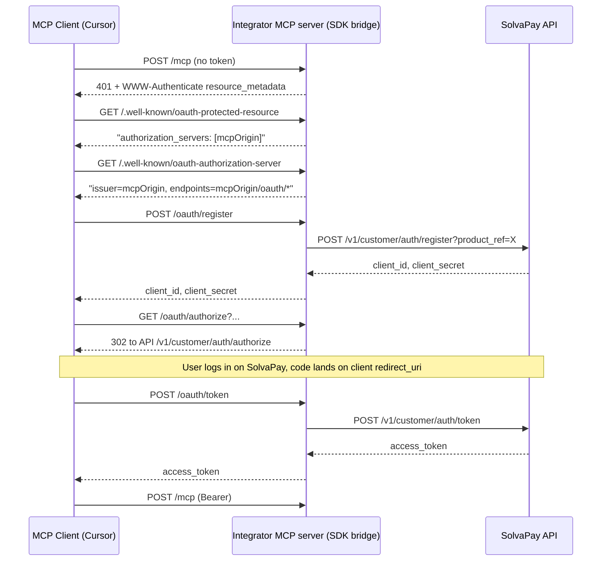

# SDK OAuth Bridge: Full RFC 8414 Proxy (Option A)

## Why hello MCP "works" but Supabase Edge doesn't

Both implementations use `@solvapay/server`'s [`createMcpOAuthBridge`](/Users/tommy/projects/solvapay/solvapay-sdk/packages/server/src/mcp/oauth-bridge.ts). As shipped, the SDK produces a discovery doc that **already violates RFC 8414 §3.3** (issuer must match the metadata URL):

```85:103:/Users/tommy/projects/solvapay/solvapay-sdk/packages/server/src/mcp/oauth-bridge.ts
export function getOAuthAuthorizationServerResponse({
  apiBaseUrl,
  productRef,
}: OAuthAuthorizationServerOptions) {
  const normalizedApiBaseUrl = withoutTrailingSlash(apiBaseUrl)
  const registrationEndpoint = `${normalizedApiBaseUrl}/v1/customer/auth/register?product_ref=${encodeURIComponent(productRef)}`

  return {
    issuer: normalizedApiBaseUrl,
```

`issuer` is the SolvaPay API (e.g. `https://api.solvapay.com`), but the doc is served at `<mcp-url>/.well-known/oauth-authorization-server`. Lax clients (Claude Desktop, older Cursor, the `run-oauth-flow.ts` example script that blindly follows URLs) ignore the mismatch. Strict clients (current Cursor) reject it silently with "Transient error".

The Supabase Edge implementer worked around this by changing `authorization_servers` in `.well-known/oauth-protected-resource` to point at the SolvaPay API base so Cursor would fetch metadata directly from SolvaPay. That dodge then exposed the missing `/.well-known/oauth-authorization-server` on the API root (now fixed), and next will expose the DCR's "product_ref required" blocker.

The hello MCP example path of least resistance has been hiding this because it was primarily validated with Claude Desktop and an in-repo flow script that doesn't validate RFC 8414.

## Target architecture

The integrator's MCP origin becomes the authorization server from the client's perspective. The SDK proxies requests to SolvaPay with `product_ref` injected at DCR.



Key point: `/authorize` and `/token` in the backend already resolve product context from `client_id` alone (see [authorization-server.controller.ts](/Users/tommy/projects/solvapay/solvapay-backend/src/auth/controllers/customer/authorization-server.controller.ts)), so `product_ref` only needs to be injected at DCR.

## Changes

### 1. `packages/server/src/mcp/oauth-bridge.ts`

Rewrite the discovery doc + add four proxy middlewares.

- **`getOAuthAuthorizationServerResponse({ publicBaseUrl, paths })`** — issuer = `publicBaseUrl`, endpoints = `${publicBaseUrl}/oauth/{register,authorize,token,revoke}`. Drop `apiBaseUrl`/`productRef` from this function — it no longer points at SolvaPay.
- **`createOAuthRegisterHandler({ apiBaseUrl, productRef })`** — `POST /oauth/register`. Reads the RFC 7591 JSON body, forwards to `${apiBaseUrl}/v1/customer/auth/register?product_ref=${productRef}` with `Content-Type: application/json`, mirrors status + body.
- **`createOAuthAuthorizeHandler({ apiBaseUrl })`** — `GET /oauth/authorize`. Emits `302` to `${apiBaseUrl}/v1/customer/auth/authorize?<original-query>`. No product_ref needed.
- **`createOAuthTokenHandler({ apiBaseUrl })`** — `POST /oauth/token`. Accepts `application/x-www-form-urlencoded` or `application/json`, forwards to `${apiBaseUrl}/v1/customer/auth/token` preserving Authorization header (for Basic auth client credentials).
- **`createOAuthRevokeHandler({ apiBaseUrl })`** — `POST /oauth/revoke`. Pass-through to `${apiBaseUrl}/v1/customer/auth/revoke`.
- **`createMcpOAuthBridge(...)`** — add the four handlers to the returned middleware array; accept optional `oauthPaths` override (defaults: `/oauth/register|authorize|token|revoke`).
- **Error handling** — preserve upstream status codes and JSON body verbatim (so RFC 7591 `invalid_redirect_uri` etc. bubble through). On network failure, return 502 with `{ error: 'upstream_unreachable' }`.
- **CORS** — the existing allowed-origin logic is the integrator's concern, but the middleware should set `Access-Control-Allow-Origin` mirroring the request `Origin` for the native-scheme clients (`cursor://`, `vscode://`, `vscode-webview://`, `claude://`) on `/oauth/register` so preflight works. Handle `OPTIONS` explicitly.

### 2. `packages/server/src/mcp/oauth-bridge.spec.ts` (new)

Unit tests covering:
- Discovery doc has `issuer === publicBaseUrl` and all endpoints on `publicBaseUrl`.
- Register handler injects `?product_ref=...` and forwards body/headers.
- Authorize handler 302s with original query string preserved.
- Token handler forwards `application/x-www-form-urlencoded` body and Authorization header.
- Error passthrough: upstream 400 body is returned unmodified.
- OPTIONS preflight returns 204 with correct CORS headers for `cursor://` origin.

Mock upstream with [`msw`](https://github.com/mswjs/msw) or a local `http.createServer` (whichever the repo already uses; check `packages/server/vitest.config.ts`).

### 3. `examples/mcp-time-app/src/index.ts` and `examples/mcp-oauth-bridge/src/index.ts`

Verify they compile and run with the new signature. The exported `createMcpOAuthBridge` API surface stays the same (still takes `publicBaseUrl`, `apiBaseUrl`, `productRef`) — only the returned metadata doc and new proxy routes change.

### 4. `examples/mcp-oauth-bridge/scripts/run-oauth-flow.ts`

Works unchanged since it reads `registration_endpoint` from the metadata — which will now be the local `/oauth/register` that proxies to SolvaPay.

### 5. SDK docs

- [`docs/guides/mcp.mdx`](/Users/tommy/projects/solvapay/solvapay-sdk/docs/guides/mcp.mdx): update the OAuth bridge section to note that all OAuth endpoints are now served from the MCP origin and the bridge fully proxies DCR/authorize/token.
- [`examples/mcp-oauth-bridge/README.md`](/Users/tommy/projects/solvapay/solvapay-sdk/examples/mcp-oauth-bridge/README.md): update the "Endpoints" list and remove the outdated note about backend-hosted discovery inference.

### 6. Keep the backend `.well-known/*` fix in place

The recently-added [WellKnownController](/Users/tommy/projects/solvapay/solvapay-backend/src/mcp/controllers/well-known.controller.ts) at the API root stays. It doesn't conflict with Option A and remains useful for any integrator who still points `authorization_servers` directly at SolvaPay. No backend changes needed for this plan.

## Verification

1. `pnpm --filter @solvapay/server test` — new unit tests green.
2. Run `mcp-oauth-bridge` example locally; run `pnpm oauth:flow` — flow completes.
3. Curl smoke test against ngrok tunnel:
   - `GET /.well-known/oauth-authorization-server` on integrator's MCP origin → `issuer` matches host, all endpoints on host.
   - `POST /oauth/register` with `{client_name, redirect_uris}` → 201 with `client_id` (proxied).
   - `POST /oauth/token` with form-encoded body → 200 with `access_token`.
4. Reconnect Cursor to the integrator MCP URL → auth completes without "Transient error".

## Out of scope

- Backend changes (none required).
- Hosted MCP flow (unaffected — SolvaPay subdomains already serve self-consistent discovery via nginx + `McpDiscoveryService`).
- Relaxing DCR to accept registrations without `product_ref` (Option B/C) — not needed with Option A.