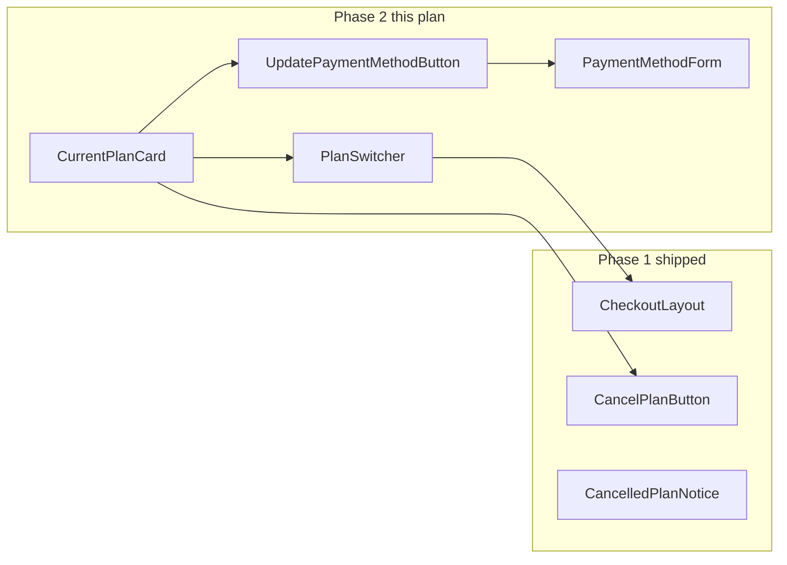
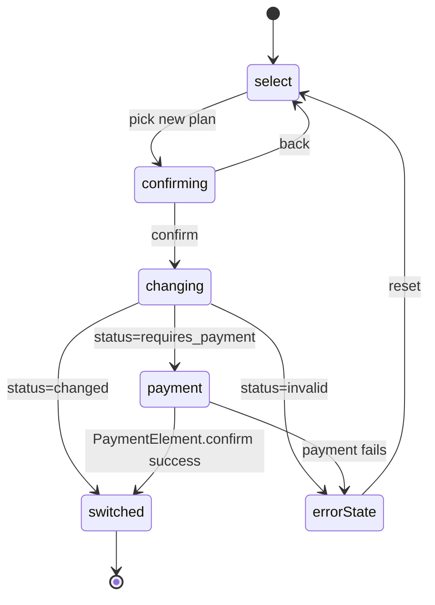

## Relationship to Phase 1

Phase 1 ([sdk_plan_selector_3646143f.plan.md](.cursor/plans/sdk_plan_selector_3646143f.plan.md)) ships the full checkout loop: `<PlanSelector>`, `<PaymentForm>`, `<ActivationFlow>`, `<CheckoutLayout>`, `<CancelPlanButton>`, `<CancelledPlanNotice>`, `<CreditGate>`. A Lovable app after Phase 1 can: sign up → pick plan → pay/activate → cancel → reactivate.

**Gap**: no way to view the currently active plan, switch to a different tier mid-cycle, or update the card on file. Phase 2 closes this loop.



## Prerequisite: backend endpoints

Three endpoints needed on [solvapay-backend](../solvapay-backend). **Verify existence before starting SDK work**; add any that are missing as a separate backend PR. None should be novel — all follow existing `activatePlan` / `cancelRenewal` patterns:

### `POST /v1/sdk/change-plan`

```ts
Request:  { purchaseRef: string; newPlanRef: string }
Response:
  | { status: 'changed'; purchase: Purchase }            // immediate swap (downgrade scheduled, free→paid with no charge, etc.)
  | { status: 'requires_payment'; clientSecret: string } // proration charge needed; integrator confirms via PaymentElement
  | { status: 'invalid'; message: string }               // cross-product switch not allowed, no-op, etc.
```

Proration semantics live entirely backend-side. The SDK just routes the response.

### `POST /v1/sdk/create-setup-intent`

```ts
Request: {
}
Response: {
  clientSecret: string
} // Stripe SetupIntent for attaching a new card without charge
```

### `GET /v1/sdk/payment-method`

```ts
Response:
  | { kind: 'card'; brand: string; last4: string; expMonth: number; expYear: number }
  | { kind: 'none' }
```

Used by `<CurrentPlanCard>` to render "Visa •••• 4242" line. Optional for phase 2; degrade gracefully if not available.

## 1. `@solvapay/server` core helpers

Add three helpers in [packages/server/src/helpers/](packages/server/src/helpers/) following the `activation.ts` / `renewal.ts` pattern:

- [packages/server/src/helpers/change-plan.ts](packages/server/src/helpers/change-plan.ts) → `changePlanCore(req, { purchaseRef, newPlanRef })`
- [packages/server/src/helpers/payment-method.ts](packages/server/src/helpers/payment-method.ts) → `createSetupIntentCore(req)` and `getPaymentMethodCore(req)`

Wire `changePlan` and equivalents into the typed client interface in [packages/server/src/types/client.ts](packages/server/src/types/client.ts).

## 2. `@solvapay/next` and `@solvapay/supabase` wrappers

Mirror the new handlers in both runtime adapters (three-line wrappers in both):

- [packages/next/src/helpers/change-plan.ts](packages/next/src/helpers/change-plan.ts), [packages/next/src/helpers/payment-method.ts](packages/next/src/helpers/payment-method.ts)
- [packages/supabase/src/handlers.ts](packages/supabase/src/handlers.ts) — add `changePlan`, `createSetupIntent`, `getPaymentMethod` handlers + export from index.
- [examples/supabase-edge/supabase/functions/](examples/supabase-edge/supabase/functions/) — add three 3-line Deno.serve files.

Default API routes in `SolvaPayConfig.api`:

```ts
api?: {
  changePlan?: string           // '/api/change-plan'
  createSetupIntent?: string    // '/api/create-setup-intent'
  getPaymentMethod?: string     // '/api/payment-method'
}
```

## 3. React SDK primitives

### `<CurrentPlanCard>`

New file [packages/react/src/components/CurrentPlanCard.tsx](packages/react/src/components/CurrentPlanCard.tsx). Styled card showing the customer's active plan with inline management actions.

```tsx
<CurrentPlanCard
  showCancelButton?: boolean        // default true
  showChangeButton?: boolean        // default true
  showPaymentMethod?: boolean       // default true
  onChangePlan?: () => void          // override default behaviour (open PlanSwitcher inline)
  classNames?: CurrentPlanCardClassNames
  children?: (args: CurrentPlanCardRenderArgs) => ReactNode
/>
```

Default rendered tree:

- Plan name + amount + interval (via `usePurchase` + `usePlan` + `formatPrice`)
- Next billing date (recurring) / expiration (cancelled but active) / usage meter (usage-based via `useBalance`)
- Payment method: "Visa •••• 4242, expires 12/26" (from `getPaymentMethod` endpoint; hidden if unavailable)
- Action row: `<ChangePlanButton />`, `<UpdatePaymentMethodButton />`, `<CancelPlanButton />` (reuses Phase 1 component)
- Renders nothing when `usePurchase` reports no active purchase.

Plan-type-aware rendering:

- `recurring` → next billing date, "{n} days until next charge"
- `one-time` → "Expires {date}" or "Valid indefinitely"
- `usage-based` → `<BalanceBadge>` + "Top up" CTA (inline `<TopupForm>` opens on click)

### `<PlanSwitcher>`

New file [packages/react/src/components/PlanSwitcher.tsx](packages/react/src/components/PlanSwitcher.tsx). Orchestrates plan selection → change API call → optional proration payment → success. Reuses Phase 1 primitives.

```tsx
<PlanSwitcher
  productRef?: string                 // default: from active purchase
  currentPlanRef?: string              // default: from active purchase (excluded from selector)
  onSwitched?: (result) => void
  onCancelled?: () => void              // user backs out
  planSelector?: PlanSelectorFilterProps
  classNames?: PlanSwitcherClassNames
/>
```

Internal step machine:



Slot subcomponents (matching Phase 1 patterns): `<PlanSwitcher.Selector />`, `<PlanSwitcher.ConfirmStep />`, `<PlanSwitcher.PaymentStep />`.

Confirmation step shows diff: "You're switching from {currentPlan.name} ({currentPrice}) to {newPlan.name} ({newPrice})" + proration note when recurring. Plan-type transitions (e.g. recurring → usage-based) either: (a) backend rejects as `invalid`, or (b) SDK displays "You'll cancel your current subscription and activate the new plan" and routes through `<CheckoutLayout>` for activation instead.

### `<PaymentMethodForm>`

New file [packages/react/src/components/PaymentMethodForm.tsx](packages/react/src/components/PaymentMethodForm.tsx). Variant of `<PaymentForm>` that uses SetupIntent instead of PaymentIntent — no charge, just attaches a new card.

```tsx
<PaymentMethodForm
  onSuccess?: (paymentMethodId: string) => void
  onError?: (err: Error) => void
  classNames?: PaymentMethodFormClassNames
/>
```

Reuses Stripe PaymentElement via the existing [packages/react/src/components/StripePaymentFormWrapper.tsx](packages/react/src/components/StripePaymentFormWrapper.tsx) — extract the "setup vs payment" branch into the already-planned [packages/react/src/utils/confirmPayment.ts](packages/react/src/utils/confirmPayment.ts) util so the same confirm path handles both `stripe.confirmPayment` and `stripe.confirmSetup`.

### `<UpdatePaymentMethodButton>`

Thin trigger component: opens a modal or inline drawer containing `<PaymentMethodForm>`. Default opens inline; render-prop override for custom modal styling.

### Hook additions

Extend [packages/react/src/hooks/usePurchaseActions.ts](packages/react/src/hooks/usePurchaseActions.ts) with two methods + loading flags:

```ts
changePlan: (params: { purchaseRef: string; newPlanRef: string }) => Promise<ChangePlanResult>
updatePaymentMethod: () => Promise<{ clientSecret: string }> // creates SetupIntent
isChangingPlan: boolean
isUpdatingPaymentMethod: boolean
```

Plus a new hook [packages/react/src/hooks/usePaymentMethod.ts](packages/react/src/hooks/usePaymentMethod.ts) that wraps `getPaymentMethod` with cache + loading state (mirrors `useMerchant`).

## 4. i18n additions

Three new tight slices in [packages/react/src/i18n/types.ts](packages/react/src/i18n/types.ts) + [packages/react/src/i18n/en.ts](packages/react/src/i18n/en.ts):

```ts
currentPlan: {
  heading: string // "Your plan"
  nextBilling: string // "Next billing: {date}"
  renewsOn: string // "Renews {date}"
  expiresOn: string // "Expires {date}"
  paymentMethod: string // "{brand} •••• {last4}"
  paymentMethodExpires: string // "expires {month}/{year}"
  noPaymentMethod: string // "No payment method on file"
  changePlanButton: string // "Change plan"
  updatePaymentButton: string // "Update card"
}

planSwitcher: {
  heading: string // "Switch your plan"
  confirmHeading: string // "Confirm plan change"
  currentLabel: string // "Currently on"
  newLabel: string // "Switching to"
  prorationNote: string // "You'll be charged a prorated amount for the remainder of this billing cycle."
  downgradeNote: string // "This change takes effect at the end of your current billing cycle."
  freeUpgradeNote: string // "No charge — your current credit balance will be used."
  confirmButton: string // "Confirm switch"
  switchingLabel: string // "Switching..."
  switchedHeading: string // "Plan switched"
  switchedSubheading: string // "You're now on {planName}."
}

paymentMethod: {
  heading: string // "Update payment method"
  saveButton: string // "Save card"
  savingLabel: string // "Saving..."
  savedLabel: string // "Card updated"
}
```

## 5. Types and exports

Add to [packages/react/src/types/index.ts](packages/react/src/types/index.ts) and root barrel:

- `<CurrentPlanCard>`, `<PlanSwitcher>` (+ `.Selector`, `.ConfirmStep`, `.PaymentStep`), `<PaymentMethodForm>`, `<UpdatePaymentMethodButton>`
- `ChangePlanResult`, `ChangePlanStatus`, `PaymentMethodInfo` types
- `CurrentPlanCardProps`, `PlanSwitcherProps`, `PaymentMethodFormProps`, all ClassNames/RenderArgs variants
- `usePaymentMethod` hook

No internal/public surface changes to Phase 1 primitives.

## 6. Tests

Following the Phase 1 test pattern:

- `CurrentPlanCard.test.tsx` — renders only with active purchase; plan-type variants (recurring/one-time/usage-based); payment method display with + without endpoint; slot overrides; render-prop.
- `PlanSwitcher.test.tsx` — full state machine: select → confirming → changing → switched; select → confirming → changing → payment → switched; error recovery; excludes current plan from selector; cross-type transition routes through activation path.
- `PaymentMethodForm.test.tsx` — SetupIntent flow; Stripe confirmSetup branch; success callback payload; error handling.
- `usePaymentMethod.test.tsx` — cached fetch, error state.
- `usePurchaseActions.test.ts` — add `changePlan` and `updatePaymentMethod` coverage.

## 7. Documentation

Add a fourth section to the SDK README after Phase 1's three-layer model:

- **Managing plans post-checkout** — `<CurrentPlanCard>` one-liner + `<PlanSwitcher>` composition. Show the drop-in for a typical `/account` page.
- Extend the Supabase Edge Functions section with the three new endpoints + Deno.serve files.

## 8. Demo integration

Add a new `/account` route to [examples/checkout-demo](examples/checkout-demo) that demonstrates the phase 2 primitives:

- [examples/checkout-demo/app/account/page.tsx](examples/checkout-demo/app/account/page.tsx): `<CurrentPlanCard />` as the entire page body. That's it.
- Add three API route wrappers: `/api/change-plan`, `/api/create-setup-intent`, `/api/payment-method`.
- Link from the home page nav: "Account" (only when authenticated + has active purchase).
- README update: new "Managing plans" section showing the drop-in.

The [examples/checkout-demo/app/checkout/page.tsx](examples/checkout-demo/app/checkout/page.tsx) from Phase 1 stays unchanged — checkout and account management are separate routes, and the `<CancelPlanButton>` in the checkout footer already covers inline cancellation.

## Out of scope (Phase 3)

- Invoice history / downloadable receipts / PDF generation
- Refund UI / dispute handling
- Billing address edit
- Payment failure retry flow / dunning
- Multi-product accounts (managing multiple active subscriptions in one UI)
- Tax ID / VAT number collection
- Coupons / promo codes
- Usage analytics / per-feature breakdown
- Team billing (seats, organization accounts)

## Backwards compatibility

- All additive. No changes to Phase 1 primitive signatures.
- New `api` config keys are optional; missing `getPaymentMethod` endpoint degrades `<CurrentPlanCard>` gracefully (payment method section hidden).
- New i18n slices follow the "English defaults preserve exactly" pattern.

## Dependency chain

1. Backend PR: three new endpoints (can ship independently)
2. `@solvapay/server` core helpers (depends on 1)
3. `@solvapay/next` + `@solvapay/supabase` wrappers (depends on 2)
4. `@solvapay/react` primitives + hooks (depends on 3)
5. Tests + docs + demo (depends on 4)

Each step is a separate PR. Phase 2 is not landable in a single PR.
