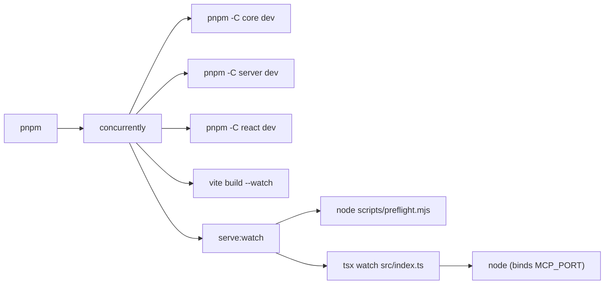

## Root cause

Current `dev` script in [examples/mcp-checkout-app/package.json](examples/mcp-checkout-app/package.json):

```text
pnpm → concurrently → nodemon → /bin/sh -c "tsx src/index.ts" → tsx → node (binds :MCP_PORT)
```

- Nodemon SIGTERMs the shell on restart; if the shell exits before forwarding, `tsx`/`node` are reparented to PID 1 and keep the port bound.
- `concurrently` doesn't track grandchildren, so orphans survive Ctrl-C / terminal detach.
- [`src/index.ts`](examples/mcp-checkout-app/src/index.ts:116) has no EADDRINUSE handler, so boot failures against a zombie are silent.
- `--watch dist/mcp-app.html` is pointless: [`server.ts:571`](examples/mcp-checkout-app/src/server.ts:571) reads the HTML per-request. It only adds restart triggers that create more orphan windows.

## Target process tree



One supervisor layer between `concurrently` and the node process that owns the port.

## Changes

### 1. Rewrite `dev` in [examples/mcp-checkout-app/package.json](examples/mcp-checkout-app/package.json)

```json
"scripts": {
  "build": "cross-env INPUT=mcp-app.html vite build && tsc",
  "serve": "tsx src/index.ts",
  "serve:watch": "node scripts/preflight.mjs && tsx watch --clear-screen=false src/index.ts",
  "dev": "concurrently --kill-others-on-fail --handle-input -n core,server,react,ui,app -c auto \"pnpm -C ../../packages/core dev\" \"pnpm -C ../../packages/server dev\" \"pnpm -C ../../packages/react dev\" \"cross-env INPUT=mcp-app.html vite build --watch\" \"pnpm run serve:watch\""
}
```

- `tsx watch` replaces `nodemon --exec "tsx ..."` — no shell wrapper in the signal path.
- `tsx watch` already watches the import graph, which resolves through `packages/*/dist`, so the explicit nodemon `--watch` flags go away.
- `--kill-others-on-fail --handle-input` makes Ctrl-C and sibling crashes take down the whole group.
- Remove `nodemon` from `devDependencies`.

### 2. Add `examples/mcp-checkout-app/scripts/preflight.mjs`

Probe-bind `:MCP_PORT`; on `EADDRINUSE`, `lsof` the holder(s), SIGTERM → (short grace) → SIGKILL, then return so `tsx watch` can bind cleanly. Handle macOS `lsof` exit-1-when-empty and skip gracefully on non-Darwin.

### 3. Harden [examples/mcp-checkout-app/src/index.ts](examples/mcp-checkout-app/src/index.ts)

- Capture `const server = app.listen(port, host, ...)`.
- `server.on('error', err => ...)`: on `EADDRINUSE`, log the port + incumbent PID/ppid (parsed from `lsof`) and `process.exit(1)` with an actionable message referencing the preflight.
- Single graceful-shutdown handler for `SIGTERM`/`SIGINT`/`SIGHUP` that calls `server.close()` inside a bounded timeout, then exits.

### 4. Clean up debug logs in [examples/mcp-checkout-app/src/server.ts](examples/mcp-checkout-app/src/server.ts:244-258)

Remove the `[open_checkout debug]` `console.warn` blocks added during the zombie hunt — they're noise now that boot is deterministic.

### 5. Update [examples/mcp-checkout-app/README.md](examples/mcp-checkout-app/README.md) "Run" section

Short "If the dev loop gets stuck" subsection documenting the `lsof -iTCP:$MCP_PORT -sTCP:LISTEN` + `kill` diagnostic as a fallback, noting the preflight now self-heals this.

## Verification

1. `pnpm --filter @example/mcp-checkout-app dev` starts cleanly on a free port.
2. Ctrl-C → `lsof -iTCP:$MCP_PORT -sTCP:LISTEN` returns nothing.
3. Manually leak a zombie: `tsx src/index.ts &` then detach; rerun `dev`; preflight reports + kills it; server binds.
4. Edit a file in `packages/server/src` → server package rebuilds → `tsx watch` restarts the app → first request after restart returns fresh code (no stale listener).

## Out of scope

- Replacing `concurrently` with a custom supervisor. The nodemon/shell layer was the actual culprit; `concurrently` with `--handle-input` is good enough.
- Changes to other examples or packages.