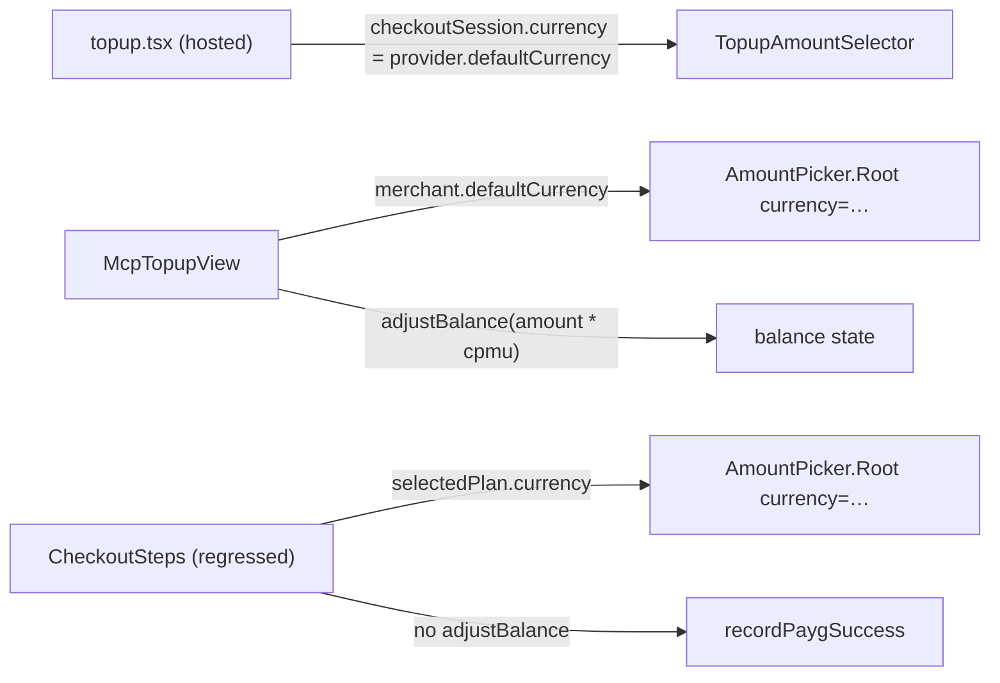
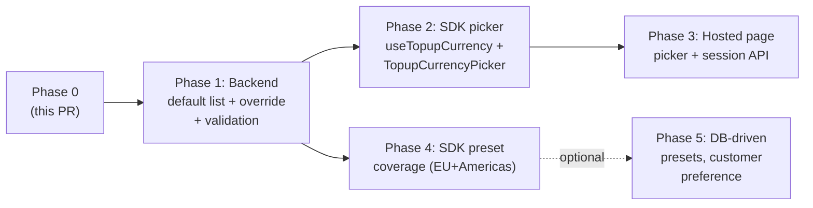

# Topup credits + multi-currency support

## What this plan does

Two things in one document, sequenced:

1. **Phase 0 — actionable now.** Fixes the immediate `<CheckoutSteps>` PAYG topup regression: drive currency off `merchant.defaultCurrency` (never `plan.currency`), call `adjustBalance` optimistically, fix lifetime "Subscribe …/mo" copy. Adds an optional `topupCurrency` prop as the forward-compat hook.
2. **Phases 1-5 — forward roadmap.** Multi-currency credit topups end-to-end (backend `topupCurrencies` config, SDK picker primitive, hosted page picker, preset coverage). Sequence + design captured here so each phase has unambiguous scope when we pick it up.

The Phase 0 todos are the next 1-2 days of work. Phases 1-5 stay as scope-locked forward intent — pick them up when ready.

## Currency invariant (load-bearing)

**Credits are merchant-wide, not plan-specific.** A topup is "add wallet credits to a customer" — independent of which plan was selected. Topup currency must resolve from the merchant, never from `plan.currency`. The SDK currently violates this in [`packages/react/src/primitives/checkout/index.tsx`](packages/react/src/primitives/checkout/index.tsx) by reading `selectedPlan.currency` for the amount picker, the continue label, the topup form, and the mandate text.

The recurring/one-time branch (`<RecurringPayment>`) keeps reading `selectedPlan.currency` — those settle in the plan's denominated currency, not the wallet's. That invariant is correct for purchases (different from topups).

## Phase 0 — implementation

Six small edits + one drive-by + tests. All in `@solvapay/react`.

### Symptoms (current)

1. Header pill stays at `0 left` after a successful topup until the next chat send forces a `refetchBalance`.
2. Quick-amount presets and the submit-button label use `selectedPlan.currency` instead of the merchant base — wrong currency the moment a PAYG plan happens to carry a different `currency` field, and conceptually wrong even when they happen to match.
3. (Drive-by) Lifetime plans render `Subscribe — $19/mo` because `<RecurringPayment>` falls back to `'monthly'` whenever `billingCycle` is absent.

### Root-cause map



Hot spots in [`packages/react/src/primitives/checkout/index.tsx`](packages/react/src/primitives/checkout/index.tsx):
- `AmountPicker` (~line 346) reads `selectedPlanShape?.currency ?? 'USD'`
- `AmountContinueButton` (~line 405) same
- `PaygPayment` (~line 455) same

In [`packages/react/src/hooks/useCheckoutFlow.ts`](packages/react/src/hooks/useCheckoutFlow.ts):
- `recordPaygSuccess` (~line 259) computes `creditsAdded` but never calls `balance.adjustBalance(...)`.

### Edits

#### 1. `topupCurrency` prop on `<CheckoutSteps.Root>`

[`packages/react/src/primitives/checkout/index.tsx`](packages/react/src/primitives/checkout/index.tsx) `RootProps`:

```ts
interface RootProps {
  productRef: string
  returnUrl: string
  /**
   * Currency for PAYG topups. Defaults to `merchant.defaultCurrency`.
   * Pass an explicit value when integrators surface a per-customer
   * currency picker (multi-currency topup, future). Recurring/one-time
   * plans always settle in their own `plan.currency`; this prop only
   * affects the topup branch.
   */
  topupCurrency?: string
  …
}
```

Forward through `<RootWithEnv>` → `<Root>` → `<FlowProvider>` → `useCheckoutFlow({ topupCurrency, … })`. Mirror on `<PaywallNotice.EmbeddedCheckout>` so the paywall path can pin a currency too.

#### 2. Resolve `flow.topupCurrency` in `useCheckoutFlow`

[`packages/react/src/hooks/useCheckoutFlow.ts`](packages/react/src/hooks/useCheckoutFlow.ts):

```ts
import { useMerchant } from './useMerchant'
…
const { merchant } = useMerchant()
const topupCurrency: string | null =
  opts.topupCurrency?.toUpperCase() ??
  merchant?.defaultCurrency?.toUpperCase() ??
  null
const topupCurrencyReady = topupCurrency != null
```

Two new fields on `UseCheckoutFlowReturn`:

- `topupCurrency: string | null` — resolved code. **Plan currency is never consulted.**
- `topupCurrencyReady: boolean` — `true` once prop or merchant supplies a value.

Step components consume both via `useCheckoutContext`.

#### 3. Use `topupCurrency` in PAYG step components

Drop every `selectedPlanShape?.currency` read in the PAYG branch:

- `AmountPicker` → `<AmountPickerPrimitive.Root currency={flow.topupCurrency}>`
- `AmountContinueButton` → price label
- `PaygPayment` → `<TopupForm.Root currency>`, `<MandateText currency>`, order-summary, submit label

#### 4. Skeleton/disabled gate while merchant loads

When `!topupCurrencyReady`:
- `AmountPicker`: skeleton row of preset buttons + disabled custom input
- `AmountContinueButton` and topup `SubmitButton`: disabled with neutral copy (`Continue` / `Processing…`)

The merchant fetch is fast (5-minute cache, often seeded), so this is rarely visible. Hard rule: never paint a currency we haven't confirmed.

If a host has no `/api/merchant` route configured (custom transport without `getMerchant`), `useMerchant` resolves to `null` permanently — the only way to drive the topup flow there is the explicit `topupCurrency` prop. Already the correct API shape (consumer pins).

#### 5. Optimistic `adjustBalance` on PAYG success

[`useCheckoutFlow.ts`](packages/react/src/hooks/useCheckoutFlow.ts) `recordPaygSuccess`:

```ts
const creditsAdded =
  creditsPerMinorUnit != null && creditsPerMinorUnit > 0
    ? Math.floor((selectedAmountMinor / (displayExchangeRate ?? 1)) * creditsPerMinorUnit)
    : 0
if (creditsAdded > 0) balance.adjustBalance(creditsAdded)   // ← new
…
setSuccessMeta({…})
setStep('success')
```

`adjustBalance` is on `useBalance().adjustBalance`. The 8s grace window in [`SolvaPayProvider.adjustBalanceImpl`](packages/react/src/SolvaPayProvider.tsx) auto-reconciles via the deferred `fetchBalanceRef.current?.()`, so no race against the real webhook.

#### 6. Lifetime / one-time copy in `<RecurringPayment>` (drive-by)

```tsx
const cycle = selectedPlanShape.billingCycle
const isRecurring = !!cycle
…
<PaymentForm.SubmitButton …>
  {isRecurring
    ? `Subscribe — ${formatPrice(amountMinor, currency, { locale })}/${shortCycle(cycle)}`
    : `Pay ${formatPrice(amountMinor, currency, { locale })}`}
</PaymentForm.SubmitButton>
```

Same conditional in the order-summary `/cycle` line above.

### Validation

- Unit test on `useCheckoutFlow`: explicit prop wins over merchant; merchant SEK + plan USD → `'SEK'` (plan currency ignored); merchant absent + prop absent → `topupCurrency: null`, `topupCurrencyReady: false`.
- Unit test asserting `<CheckoutSteps.AmountPicker>` renders skeleton/disabled while `topupCurrencyReady` is `false`.
- Unit test asserting `recordPaygSuccess` calls `adjustBalance` exactly once with the computed `creditsAdded`.
- Update existing `<CheckoutSteps>` quick-amount test: seed `merchantCache` with `defaultCurrency: 'SEK'` and assert `[100, 500, 1000, 5000]` presets.
- Lifetime regression test: plan with `type: 'one-time'`, `billingCycle: null` → submit button text is `Pay {…}` not `Subscribe …/mo`.
- Manual smoke against `prd_ULZK5MVD` (PAYG-only): 0 credits → 402 → drawer auto-skips plan → AmountPicker shows merchant-currency presets → "Continue — X" → `<TopupForm>` mounts → "Pay X" → Stripe test card → pill flips to estimated credits **immediately**, then reconciles after webhook.

### Cross-reference

| Surface | Currency source | Optimistic balance | Multi-currency-ready |
|---|---|---|---|
| Hosted [`topup.tsx`](https://github.com/solvapay/solvapay-frontend/blob/dev/src/pages/customer/checkout/topup.tsx) | `checkoutSession.currency` (server-pinned from `provider.defaultCurrency`) | Server-driven via webhook | Phase 3 — session-create accepts `currency` |
| MCP [`McpTopupView`](packages/react/src/mcp/views/McpTopupView.tsx) | `merchant.defaultCurrency.toUpperCase()` | `adjustBalance(amount * (cpmu ?? 100))` | Phase 2 — picker drives `currency` |
| SDK `<CheckoutSteps>` (after Phase 0) | `topupCurrency` prop ∥ `merchant.defaultCurrency` (no plan-currency fallback) | `adjustBalance(creditsAdded)` in `recordPaygSuccess` | Phase 2 — picker passes `topupCurrency` prop |

After Phase 0 all three surfaces speak the same language today and have the right future-shape.

---

## Forward roadmap (Phases 1-5)

Phase 0 unblocks the demo and lays the API. Phases 1-5 deliver full multi-currency support. Sequence:



### Design stance: SDK defaults, merchant overrides only when economics demand it

The list of "currencies SolvaPay supports for topups" is mostly the same across merchants. What varies is dictated by FX fee economics, not taste:

- Stripe charges the merchant ~1% for non-settlement-currency conversion. A USD-settled merchant accepting EUR topups eats that fee — or passes it on with a price uplift.
- A merchant that wants the *customer* to bear FX cost forces single-currency topups. Customer's bank does the conversion at issue-card rates.
- A merchant comfortable absorbing FX (or with native local Stripe Connect accounts) opens the full list.

So per-merchant configuration is an opt-out lever, not the default. SDK + backend ship a canonical `DEFAULT_TOPUP_CURRENCIES` list (EU + US + Americas at Phase 1 scope). Merchants override only when fee economics push them off the default. Loosely matches Stripe's "Products have prices per currency, but the platform decides the candidate currency set."

### Override shape (final form locked in Phase 1 scoping)

| Shape | Semantics | Pro | Con |
|---|---|---|---|
| `?: string[]` | If set, full override; else default. | Simplest schema. | Merchant has to re-list every supported currency just to drop one. |
| `?: { include?, exclude? }` | Allow narrows; deny subtracts from default. | Common case is one-line; full override stays expressive via `include`. | Needs precedence rule (`include` wins). |
| `?: { mode, codes }` | Discriminated union. | No precedence ambiguity. | Two fields where one would do. |

Recommendation when we get there: **Option 2** (`{ include?, exclude? }`):

- "I only want USD" → `{ include: ['USD'] }`
- "I support everything except high-volatility currencies" → `{ exclude: ['ARS', 'TRY', 'VEF'] }`
- Default merchant (unset) → SDK default list applies

### Phase 1 — Backend default list + override + validation

Owned by the backend.

**Default constant** (`solvapay-backend/src/payments/lib/topup-currencies.ts` — new):

```ts
export const DEFAULT_TOPUP_CURRENCIES = [
  'USD', 'EUR', 'GBP',                       // major
  'CAD', 'CHF',                              // North America + CH
  'SEK', 'NOK', 'DKK', 'ISK',                // Nordics
  'PLN', 'CZK', 'HUF', 'RON', 'BGN',         // Eastern EU
  'MXN', 'BRL', 'ARS', 'CLP', 'COP', 'PEN',  // Americas
] as const
```

SDK mirrors the same list at `packages/react/src/utils/topup-currencies.ts` for client-side picker rendering. Server validation is authoritative.

**Schema** (`solvapay-backend/src/providers/schemas/provider.schema.ts`):

```ts
@Prop({ type: Object, default: undefined })
topupCurrencies?: {
  include?: string[]
  exclude?: string[]
}
```

**Resolution helper** (`solvapay-backend/src/payments/lib/resolve-topup-currencies.ts` — new):

```ts
function resolveEffectiveTopupCurrencies(provider: Provider): string[] {
  const override = provider.topupCurrencies
  if (override?.include?.length) return [...override.include]
  if (override?.exclude?.length) {
    const deny = new Set(override.exclude)
    return DEFAULT_TOPUP_CURRENCIES.filter(c => !deny.has(c))
  }
  return [...DEFAULT_TOPUP_CURRENCIES]
}
```

Always returns at least one currency. Always intersects with `SUPPORTED_CURRENCIES`.

**DTO** — `SdkMerchantResponseDto.topupCurrencies: string[]` (resolved, always populated). `MerchantAssembler.toSdkMerchantResponse` calls the helper. SDK never sees the override shape.

**Validation** in `createTopupPaymentIntentCore` ([`packages/server/src/helpers/payment.ts`](packages/server/src/helpers/payment.ts)) and `checkout-topup-reset.flow.ts`:
- Reject 400 when requested `currency` not in effective list.
- Reject 400 when not in global `SUPPORTED_CURRENCIES` (defense in depth).

**Provider admin** — single section: default "Accept all SolvaPay-supported currencies (recommended)"; opt-out via "Restrict" (writes `include`) or "Exclude" (writes `exclude`); tooltip explaining FX-fee implication.

No migration. Existing merchants get the default list at next merchant-fetch.

**SDK side**: extend `Merchant` type in [`@solvapay/server`](packages/server/src/types) and [`@solvapay/react`](packages/react/src/types) with `topupCurrencies: string[]`. `useMerchant` returns it.

### Phase 2 — SDK picker primitive

Two new pieces alongside `<AmountPicker>` / `<TopupForm>`.

**`useTopupCurrency()` hook** at `packages/react/src/hooks/useTopupCurrency.ts`:

```ts
function useTopupCurrency(opts?: {
  initial?: string
  persistKey?: string
}): {
  currency: string | null
  available: string[]
  setCurrency: (code: string) => void
  ready: boolean
}
```

Resolution:
1. `opts.initial`
2. Persisted value in `localStorage[persistKey:merchantId]` if still in `available`
3. `merchant.defaultCurrency`
4. First entry in `available`
5. `null`

**`<TopupCurrencyPicker>` primitive** at `packages/react/src/primitives/TopupCurrencyPicker.tsx`. Compound primitive (`Root`, `Option`). **Renders nothing when `available.length <= 1`** — single-currency merchants never see chrome. Class names under `solvapay-topup-currency-*`.

**Wiring**:
- `<CheckoutSteps.Root>` keeps the `topupCurrency` prop (shipped in Phase 0). Integrators pair `<TopupCurrencyPicker>` + `useTopupCurrency()` + `<CheckoutSteps.Root topupCurrency={currency}>`.
- `<McpTopupView>` integrates the picker internally above `<AmountPicker>`. Auto-collapses when single. Bridge `notifyModelContext` fires on currency change.
- `<PaywallNotice.EmbeddedCheckout>` exposes `topupCurrency` pass-through. Chat-checkout-demo reads `useTopupCurrency()` and forwards.

### Phase 3 — Hosted topup page

Server:
- `POST /checkout-sessions/:id/select-topup-amount` accepts optional `currency`.
- New `POST /checkout-sessions/:id/select-topup-currency` (or fold into `/select-topup-amount`) re-creates the topup PI in the new currency.
- Session-create accepts `currency` query/body param.

Frontend ([`solvapay-frontend/src/pages/customer/checkout/topup.tsx`](https://github.com/solvapay/solvapay-frontend/blob/dev/src/pages/customer/checkout/topup.tsx)):
- Mount Chakra-styled `<TopupCurrencyPicker>` above `<TopupAmountSelector>` when `session.topupCurrencies.length > 1`.
- On change → POST `/select-topup-currency` → re-derive presets.
- Pass `currency` through `selectedAmount * minorUnitsPerMajor(currency)` to keep zero-decimal currencies honest.

### Phase 4 — Preset coverage (small, parallel to Phase 1)

Extend `getQuickAmounts` in [`useTopupAmountSelector.ts`](packages/react/src/hooks/useTopupAmountSelector.ts) and the frontend mirror. Calibrated to ~$10/$50/$100/$500 equivalents:

```ts
'USD' | 'EUR' | 'GBP' | 'CHF' | 'CAD'   → [10, 50, 100, 500]
'SEK' | 'NOK' | 'DKK'                   → [100, 500, 1000, 5000]   // already
'PLN'                                   → [50, 200, 500, 2000]      // ~4 PLN/USD
'CZK'                                   → [200, 1000, 2000, 10000]  // ~23 CZK/USD
'RON'                                   → [50, 250, 500, 2500]      // ~5 RON/USD
'BGN'                                   → [20, 100, 200, 1000]      // ~1.8 BGN/USD
'HUF'                                   → [3000, 15000, 30000, 150000] // recalibrate from existing
'ISK'                                   → [1000, 5000, 10000, 50000]   // already
'MXN'                                   → [200, 1000, 2000, 10000]
'BRL'                                   → [50, 250, 500, 2500]
'ARS'                                   → [10000, 50000, 100000, 500000]
'CLP' (zero-decimal)                    → [10000, 50000, 100000, 500000]
'COP'                                   → [50000, 200000, 500000, 2000000]
'PEN'                                   → [40, 200, 400, 2000]
'UYU'                                   → [400, 2000, 4000, 20000]
'JPY' | 'KRW' (zero-decimal)            → keep existing
```

Ships in any minor SDK release. No DB. Custom presets via future `quickAmounts={[…]}` prop on `<AmountPicker.Root>` (out of Phase 4 scope).

### Phase 5 — Optional polish

Defer until real demand:

- DB-driven per-merchant preset overrides (`provider.topupSettings.quickAmounts`).
- Server-side customer last-used currency (`customer.preferredTopupCurrency`).
- FX rounding hardening for zero-decimal currencies (CLP, COP, JPY, KRW).
- Refund flow polish in original currency (already partially supported).

## Decisions captured

- **Credits stay merchant-wide.** Wallet's internal unit = USD cents. FX conversion at PI creation. Credit-minting webhook is currency-agnostic. Nothing to change in the credit ledger.
- **No `plan.currency` anywhere in topup paths.** Wallet credits are merchant-wide, not plan-specific.
- **Default list lives in code, not config.** SDK + backend ship the same canonical `DEFAULT_TOPUP_CURRENCIES`. Per-merchant config is the exception.
- **Override is `include` ∥ `exclude`.** Common admin actions map to one-line config. Backend resolves to the effective set in one place.
- **DTO ships the resolved list.** SDK never sees override shape — just `merchant.topupCurrencies: string[]`. No client-side resolution; no drift.
- **Hardcoded SDK presets, not DB.** Cheap, deterministic, override-able by prop later.
- **Picker is data-driven invisible.** `available.length <= 1` → renders nothing.
- **Server is authoritative for accepted currencies.** Picker reads resolved list off merchant DTO; backend re-resolves and validates at PI/session creation.

## Open questions (resolve during Phase 1 scoping — does not block Phase 0)

1. Lock the override shape — recommendation: `{ include?, exclude? }` with `include` taking precedence.
2. Final `DEFAULT_TOPUP_CURRENCIES` list — recommendation: the 20 codes in Phase 1.
3. Customer last-used currency persistence — recommendation: `localStorage` for Phase 2, server-side only in Phase 5.
4. Stripe Connect cross-currency settlement — confirm during Phase 1 that all our supported countries' Connect accounts handle FX transparently.

## Out of scope

- Backend changes for Phase 0. The merchant config + topup webhook are correct today.
- Building the multi-currency picker UI in Phase 0. Belongs to Phase 2.
- Adding `provider.topupCurrencies` to the data model in Phase 0. Belongs to Phase 1.
- Legacy "credit pack" plan support. Deleted on the demo product; SDK no longer needs to handle them.
- `buildDefaultCheckoutPlanFilter`. With the topup product PAYG-only there's nothing to filter — auto-skip-single-plan handles it.
