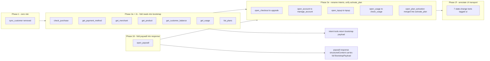
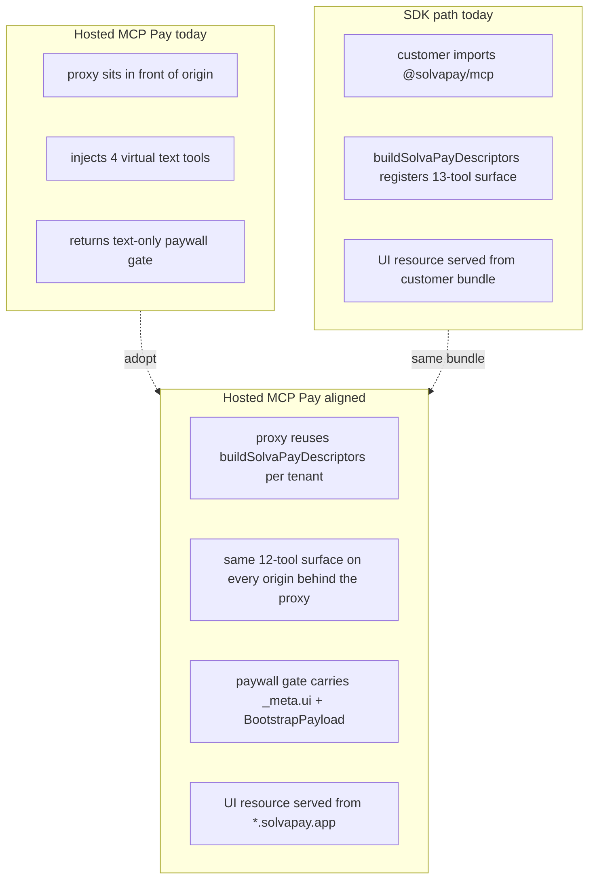

## Current surface (22 tools)

[`packages/mcp/src/descriptors.ts`](packages/mcp/src/descriptors.ts) registers every tool unconditionally. Each of the 16 "transport" tools was cross-checked against real consumers in `@solvapay/react` below.

### Consumer audit

| Tool                          | Shell consumer                                                                                   | Status      |
| ----------------------------- | ------------------------------------------------------------------------------------------------ | ----------- |
| `sync_customer`               | none — not on `SolvaPayTransport`, not in adapter, never called                                  | dead weight |
| `check_purchase`              | [`SolvaPayProvider.tsx`](packages/react/src/SolvaPayProvider.tsx) line 269                       | live        |
| `create_payment_intent`       | [`SolvaPayProvider.tsx`](packages/react/src/SolvaPayProvider.tsx) line 177                       | live        |
| `process_payment`             | [`SolvaPayProvider.tsx`](packages/react/src/SolvaPayProvider.tsx) line 186                       | live        |
| `create_topup_payment_intent` | [`SolvaPayProvider.tsx`](packages/react/src/SolvaPayProvider.tsx) line 192                       | live        |
| `get_customer_balance`        | [`SolvaPayProvider.tsx`](packages/react/src/SolvaPayProvider.tsx) line 134                       | live        |
| `cancel_renewal`              | [`SolvaPayProvider.tsx`](packages/react/src/SolvaPayProvider.tsx) line 321                       | live        |
| `reactivate_renewal`          | [`SolvaPayProvider.tsx`](packages/react/src/SolvaPayProvider.tsx) line 330                       | live        |
| `activate_plan`               | [`SolvaPayProvider.tsx`](packages/react/src/SolvaPayProvider.tsx) line 339                       | live        |
| `create_checkout_session`     | [`McpCheckoutView.tsx`](packages/react/src/mcp/views/McpCheckoutView.tsx) line 372               | live        |
| `create_customer_session`     | [`LaunchCustomerPortalButton.tsx`](packages/react/src/components/LaunchCustomerPortalButton.tsx) | live        |
| `get_merchant`                | `useMerchant` + `createMcpFetch` shim                                                            | live        |
| `get_product`                 | `useProduct` + `createMcpFetch` shim                                                             | live        |
| `list_plans`                  | `createMcpFetch` shim + `PlanSelector`                                                           | live        |
| `get_payment_method`          | [`usePaymentMethod.ts`](packages/react/src/hooks/usePaymentMethod.ts) line 31                    | live        |
| `get_usage`                   | [`useUsage.ts`](packages/react/src/hooks/useUsage.ts) line 104                                   | live        |

### Conclusion

Exactly one tool can be removed today with zero ripple: **`sync_customer`**. Every other transport tool has a live shell consumer. Trimming the surface further requires moving the consumer off the tool first — the bootstrap-enrichment work in Phase 2.

### Strategy for Phase 2

Two commits:

**1. One bootstrap, no follow-up reads.** Every view mounts from a single bootstrap payload carrying the full customer + product snapshot. That collapses three categories of tools:

- **Per-customer and product-scoped reads** — `check_purchase`, `get_payment_method`, `get_merchant`, `get_product`, `get_customer_balance`, `get_usage`, `list_plans` — all folded into the bootstrap payload. Consumers (`SolvaPayProvider` hooks, the checkout view's `PlanSelector`) seed their cache from the snapshot instead of calling tools.
- **`list_plans` specifically** — not a general "what plans do you offer?" catalog. Scoped to a single product, exists only to resolve plans for the embedded checkout view ([`descriptors.ts` lines 435–438](packages/mcp/src/descriptors.ts)). Consumers are all checkout-path. Belongs in the product-scoped section of bootstrap alongside `merchant` and `product`.
- **`open_paywall`** — host-plumbing, not an intent. Invoked by the host when a paywalled tool returns a gate result. The React shell has to awkwardly re-invoke it on mount ([`bootstrap.ts` lines 145–154](packages/react/src/mcp/bootstrap.ts)). The fix: the paywall response itself carries the full `BootstrapPayload`.

**2. Intent-driven tool names, not UI-plumbing names.** The `open_*` prefix encodes UI semantics that only make sense on hosts with UI resource support. On text-only hosts, `open_checkout` returning a markdown link with an URL reads awkwardly — nothing "opens". The hosted MCP Pay proxy already uses intent names for its virtual tools (`upgrade`, `manage_account`, `activate_product`), which map to user phrasing and work cleanly in both modes. We adopt that pattern across the SDK so one surface serves both contexts:

- `open_checkout` → `upgrade`
- `open_account` → `manage_account`
- `open_topup` → `topup`
- `open_usage` → `check_usage`
- `open_plan_activation` — absorbed into `activate_plan` (no separate picker tool; `activate_plan({})` with no planRef returns the activation picker bootstrap, `activate_plan({ planRef })` acts smartly)

Concrete surface after both commits:

- 5 intent tools (LLM-facing, dual-audience): `upgrade`, `manage_account`, `topup`, `check_usage`, `activate_plan`
- 7 UI transport (tagged `audience: 'ui'`): the Stripe Elements / portal / session / cancel-reactivate state-changers
- 10 tools removed: `sync_customer`, `check_purchase`, `get_payment_method`, `get_merchant`, `get_product`, `get_customer_balance`, `get_usage`, `list_plans`, `open_paywall`, `open_plan_activation`

End-state: **12 tools, down from 22.**



## Phase 1 — remove `sync_customer`

Single commit, no behaviour change for the shell.

1. Delete the `syncCustomer` key from [`packages/mcp/src/tool-names.ts`](packages/mcp/src/tool-names.ts) line 24.
2. Delete the import and the `tools.push` block in [`descriptors.ts` lines 31, 293–306](packages/mcp/src/descriptors.ts).
3. Remove the matching expectation from [`packages/mcp/__tests__/descriptors.unit.test.ts`](packages/mcp/__tests__/descriptors.unit.test.ts).
4. Keep `syncCustomerCore` exported from `@solvapay/server` — [`packages/next`](packages/next/src/helpers/customer.ts) and [`packages/supabase`](packages/supabase/src/handlers.ts) use it for HTTP routes.

After Phase 1: 21 tools, zero consumer changes, zero risk.

## Phase 2 — right-size the surface for MCP Apps with UI

### 2a. Enrich the bootstrap payload

Fold per-customer state into the bootstrap payload (returned by every intent tool) under a single `customer` namespace so the provider mounts with cached data instead of firing per-view tool calls. With nothing left calling them, the read tools are safely droppable.

Extend `BootstrapPayload` in [`packages/mcp/src/types.ts` lines 108–115](packages/mcp/src/types.ts) and `buildBootstrapPayload` in [`descriptors.ts` lines 202–215](packages/mcp/src/descriptors.ts) to carry two new top-level fields: a product-scoped snapshot and a nullable per-customer snapshot.

```typescript
export interface BootstrapPayload {
  // existing — unchanged
  view: SolvaPayMcpViewKind
  productRef: string
  stripePublishableKey: string | null
  returnUrl: string
  paywall?: SolvaPayMcpPaywallContent

  // new — product-scoped, non-null (bootstrap fails loudly if these can't load)
  merchant: Merchant
  product: Product
  plans: Plan[]

  // new — per-customer, null when unauthenticated
  customer: {
    ref: string
    purchase: PurchaseCheckResult | null
    paymentMethod: PaymentMethodInfo | null
    balance: CustomerBalanceResult | null
    usage: GetUsageResult | null
  } | null
}
```

Why the split and nullability:

- `merchant`, `product`, `plans` are product-scoped — available on unauthenticated mounts (checkout probe before OAuth completes). Non-null because the shell can't render meaningfully without them: `MandateText` needs `merchant.legalName`, checkout views need `product.name`, the plan picker needs `plans`. If any product-scoped sub-read errors, the bootstrap handler returns an MCP error (normal error boundary path). `plans` defaults to `[]` — an empty array is meaningful ("no plans configured"), not an error.
- `customer` is `null` for unauthenticated mounts; fields underneath are `null` when the sub-read errored or doesn't apply. Per-customer nullability is graceful degradation: `purchase: null` → no active purchase, `paymentMethod: null` → no card on file (or endpoint errored), `balance: null` → balance unavailable, `usage: null` → not a usage-based plan. Each matches an existing "empty state" the UI already handles.

Replacement map:

- `customer.ref` replaces `sync_customer`
- `customer.purchase` replaces `check_purchase`
- `customer.paymentMethod` replaces `get_payment_method`
- `customer.balance` replaces `get_customer_balance`
- `customer.usage` replaces `get_usage`
- `merchant` replaces `get_merchant`
- `product` replaces `get_product`
- `plans` replaces `list_plans`

Wall-clock cost is unchanged — all eight reads run in parallel inside `buildBootstrapPayload` via `Promise.all`, bounded by the slowest (usually `checkPurchase`, which the shell fires today immediately after mount anyway). Mount net latency is the same or better than today's mount-then-fetch pattern.

### 2b. Hydrate the provider from bootstrap

Two cache layers need seeding: provider state (purchase, balance, customerRef, auth) and module-level `Map`s (`merchantCache`, `productCache`, `plansCache`, `paymentMethodCache`). Setting provider state alone isn't enough — `useMerchant`/`useProduct`/`usePlans`/`usePaymentMethod` read from their own module-level caches and will fetch on mount if those caches are empty.

#### `initial` slot on provider config

Extend `SolvaPayProviderConfig` with an `initial` prop that carries the full seed:

```typescript
interface SolvaPayProviderInitial {
  customerRef: string | null
  purchase: PurchaseCheckResult | null
  paymentMethod: PaymentMethodInfo | null
  balance: CustomerBalanceResult | null
  usage: GetUsageResult | null
  merchant: Merchant
  product: Product
  plans: Plan[]
}
```

Non-MCP integrators leave `initial` undefined — all current behaviour (fetch on mount, HTTP routes) is preserved.

#### `seedMcpCaches` helper

Add a new helper `seedMcpCaches(initial)` in [`packages/react/src/mcp/cache-seed.ts`](packages/react/src/mcp/cache-seed.ts) (new file) that pre-populates module caches before the provider mounts:

```typescript
export function seedMcpCaches(initial: SolvaPayProviderInitial, cacheKey: string): void {
  const now = Date.now()
  merchantCache.set(cacheKey, { merchant: initial.merchant, promise: null, timestamp: now })
  productCache.set(cacheKey, { product: initial.product, promise: null, timestamp: now })
  plansCache.set(initial.product.reference, { plans: initial.plans, promise: null, timestamp: now })
  if (initial.paymentMethod && initial.customerRef) {
    paymentMethodCache.set(paymentMethodCacheKey(cacheKey), {
      paymentMethod: initial.paymentMethod,
      promise: null,
      timestamp: now,
    })
  }
}
```

`McpApp` calls `seedMcpCaches(bootstrap, transportCacheKey)` before rendering `SolvaPayProvider`. The seeded entries share the same 5-minute TTL as normal fetches — once expired the caches fall back to their existing behaviour (which, for MCP, returns the seeded value again because the hooks' fetchers are no-ops after Phase 2c drops the tools).

#### Provider-state hydration rules

When `config.initial` is present, the provider initialises with:

- `purchaseData` = `{ purchases: initial.purchase?.purchases ?? [], customerRef: initial.customerRef, email: initial.purchase?.email, name: initial.purchase?.name }`
- `internalCustomerRef` = `initial.customerRef ?? undefined`
- `isAuthenticated` = `initial.customerRef !== null` (skip the `detectAuth` effect in MCP mode)
- `creditsValue`, `displayCurrencyValue`, `creditsPerMinorUnitValue`, `displayExchangeRateValue` seeded from `initial.balance`
- `balanceLoadedRef.current = true` when `initial.balance` is set (prevents "loading" flash on first refetch)
- `loadedCacheKeysRef` seeded with `initial.customerRef` when non-null (post-mutation refetches correctly flip `isRefetching: true`, not `loading: true`)
- `loading`, `balanceLoading` start `false`

#### Auth adapter for MCP mode

The provider's `detectAuth` effect calls `getAuthAdapter(config).getToken()` on a 30-second interval. For MCP, auth happened before the UI loaded (via the MCP OAuth bridge). Two approaches:

- **Preferred**: `createMcpAppAdapter` returns a `transport` with an attached auth-adapter-ish helper, and `McpApp` wires `config.auth` to a synthetic adapter: `{ getToken: () => 'mcp', getUserId: () => initial.customerRef, subscribe: () => () => {} }`. `detectAuth` then resolves immediately and never polls.
- Alternative: provider branches on `initial.customerRef !== null` and skips the auth effect entirely. Less clean but fewer files touched.

Pick the adapter approach — keeps provider branching minimal and makes the MCP auth story explicit at the adapter boundary.

#### Post-mutation refresh: `refreshBootstrap()`

Add a provider-context helper `refreshBootstrap()` that:

1. Calls the `manage_account` intent tool (covers every customer-state field).
2. Receives a fresh `BootstrapPayload`.
3. Re-seeds module caches via `seedMcpCaches`.
4. Updates provider state (purchase, balance).

Every mutation that can change customer state calls `refreshBootstrap()` on success instead of today's ad-hoc `refetchPurchase()`:

- `processPayment` success → `refreshBootstrap()`
- `cancelRenewal` / `reactivateRenewal` success → `refreshBootstrap()`
- `activatePlan` with `status: 'activated'` → `refreshBootstrap()`
- Topup payment confirmed → `refreshBootstrap()` after the optimistic `adjustBalance` grace window

`refreshBootstrap()` is a no-op on non-MCP transports (the HTTP transport's equivalent is the existing `refetchPurchase()` + `balance.refetch()` pair).

#### In-session staleness policy

After Phase 2c drops the read tools, the module caches have no fetcher to call on TTL expiry. Policy: **accept in-session staleness for product-scoped data (`merchant`, `product`, `plans`).** MCP sessions are short (user opens → completes flow → closes). When a cache entry TTL expires mid-session, the next access returns the seeded value again (cache stays warm, fetcher is a no-op). Re-opening the app re-bootstraps.

Customer-scoped data (`purchase`, `balance`, `usage`, `paymentMethod`) stays fresh because every mutation calls `refreshBootstrap()`.

If a genuinely-stale scenario emerges (long-running session, plan prices changed, usage counter drifted), `refreshBootstrap()` is also exposed on the provider context so views can trigger it on user action (pull-to-refresh, etc.). Not wired up by default.

#### Hooks stay unchanged

`usePurchase`, `useBalance`, `useMerchant`, `useProduct`, `usePlans`, `usePlan`, `usePaymentMethod`, `useUsage` all keep their current signatures and fetch logic. The seeded caches and provider-state initialisation make their "fetch on mount" paths no-op in MCP mode — no per-hook branching. Cleaner than Option C in the audit (every hook reading `initial` from context).

### 2c. Drop the seven read tools

Once 2a and 2b land, remove all seven from [`tool-names.ts`](packages/mcp/src/tool-names.ts), [`descriptors.ts`](packages/mcp/src/descriptors.ts), and [`adapter.ts`](packages/react/src/mcp/adapter.ts):

- `check_purchase` ([descriptors.ts lines 308–330](packages/mcp/src/descriptors.ts), [adapter.ts line 91](packages/react/src/mcp/adapter.ts))
- `get_payment_method` ([descriptors.ts lines 360–374](packages/mcp/src/descriptors.ts), [adapter.ts line 131](packages/react/src/mcp/adapter.ts))
- `get_merchant` ([descriptors.ts lines 471–483](packages/mcp/src/descriptors.ts), adapter line 115)
- `get_product` ([descriptors.ts lines 453–469](packages/mcp/src/descriptors.ts), adapter line 117)
- `get_customer_balance` ([descriptors.ts lines 532–546](packages/mcp/src/descriptors.ts), adapter line 101)
- `get_usage` ([descriptors.ts lines 548–562](packages/mcp/src/descriptors.ts), adapter line 133)
- `list_plans` ([descriptors.ts lines 434–451](packages/mcp/src/descriptors.ts), [adapter.ts lines 123–129](packages/react/src/mcp/adapter.ts))

Shrink `SolvaPayTransport` in [`packages/react/src/transport/types.ts`](packages/react/src/transport/types.ts) by dropping the matching methods. The HTTP transport keeps its HTTP routes (used by non-MCP integrators).

Delete the entire `createMcpFetch` shim ([`packages/react/src/mcp/bootstrap.ts` lines 169–241](packages/react/src/mcp/bootstrap.ts)) — all three branches (`/api/list-plans`, `/api/get-product`, `/api/merchant`) become dead when the data is on bootstrap. Remove the export from the package index.

### 2d. Fold paywall response into bootstrap; remove `open_paywall`

The paywall flow today:

1. LLM calls a paywalled tool (e.g. a usage-tracked tool wrapped with `solvaPay.payable.mcp()`).
2. Gate fires → tool returns `{ isError: true, structuredContent: PaywallStructuredContent, _meta.ui: { resourceUri, toolName: 'open_paywall' } }` ([`paywallToolResult.ts`](packages/mcp/src/paywallToolResult.ts)).
3. Host reads `_meta.ui.toolName`, calls `open_paywall({ content })` to fetch the real bootstrap payload.
4. Host opens the UI resource. Inside, the React shell calls `open_paywall` a **second** time to recover the payload (can't read tool args from host context) — and falls back to the account view when the content is missing ([`bootstrap.ts` lines 145–154](packages/react/src/mcp/bootstrap.ts)).

New flow:

1. LLM calls a paywalled tool.
2. Gate fires → tool returns `{ isError: true, structuredContent: BootstrapPayload (view: 'paywall', paywall: content, + customer/merchant/product/plans snapshot), _meta.ui: { resourceUri } }`.
3. Host opens the UI resource with the structured content as its initial state. React shell reads the bootstrap directly. No second tool call, no fallback.

Changes:

- [`packages/mcp/src/paywallToolResult.ts`](packages/mcp/src/paywallToolResult.ts) — accept a `buildBootstrap: () => Promise<BootstrapPayload>` in `PaywallToolResultContext` (or the already-built payload). `paywallToolResult` calls it and puts the result on `structuredContent` with `view: 'paywall'` and `paywall: err.structuredContent` merged in. Drop the `toolName` field from `PaywallToolResultContext`.
- [`packages/mcp/src/paywall-meta.ts`](packages/mcp/src/paywall-meta.ts) — remove `PAYWALL_BOOTSTRAP_TOOL_NAME`, drop `toolName` from `PaywallUiMetaInput`. `_meta.ui` becomes `{ resourceUri }` only.
- [`packages/mcp/src/payable-handler.ts`](packages/mcp/src/payable-handler.ts) — drop the `paywallToolName` option from `BuildPayableHandlerOptions`.
- [`packages/mcp-sdk/src/registerPayableTool.ts`](packages/mcp-sdk/src/registerPayableTool.ts) — drop the `paywallToolName` option; wire `buildBootstrap` through from the server descriptor.
- [`packages/mcp/src/descriptors.ts`](packages/mcp/src/descriptors.ts) — remove the `open_paywall` registration ([lines 257–289](packages/mcp/src/descriptors.ts)). Export `buildBootstrapPayload` so the payable-handler path can call it. Keep `'paywall'` in `SolvaPayMcpViewKind` — the shell still renders a paywall view based on `structuredContent.view`.
- [`packages/mcp/src/tool-names.ts`](packages/mcp/src/tool-names.ts) — delete `openPaywall`.
- [`packages/mcp/src/types.ts`](packages/mcp/src/types.ts) — the view↔tool map (renamed to `TOOL_FOR_VIEW` in Phase 2e) drops the `paywall` entry; `VIEW_FOR_TOOL` regenerates from it.
- [`packages/react/src/mcp/bootstrap.ts`](packages/react/src/mcp/bootstrap.ts) — `fetchMcpBootstrap` reads the bootstrap from the host-supplied initial state (the structured content on the resource) when `view === 'paywall'`, instead of calling `open_paywall`. The "fall back to account" workaround at lines 145–154 is deleted.
- [`packages/react/src/mcp/views/McpPaywallView.tsx`](packages/react/src/mcp/views/McpPaywallView.tsx) — no change; it already reads `paywall` off the bootstrap.

### 2e. Rename intent tools and unify activation

Two changes land together because they both touch the same files ([`tool-names.ts`](packages/mcp/src/tool-names.ts), [`types.ts`](packages/mcp/src/types.ts), [`descriptors.ts`](packages/mcp/src/descriptors.ts)) and the same test suite.

#### Rename `open_*` to intent verbs

The `open_*` prefix encodes UI semantics that only make sense on hosts with UI resource support. On text-only hosts, `open_checkout` returning a markdown link with a URL reads awkwardly — nothing opens. Intent-verb names work cleanly in both modes (UI hosts open the embedded view; text hosts narrate the markdown) and match the hosted MCP Pay proxy's existing virtual tool naming (`upgrade`, `manage_account`).

Renames:

| Before                 | After                                      | User intent                     |
| ---------------------- | ------------------------------------------ | ------------------------------- |
| `open_checkout`        | `upgrade`                                  | "buy / change my plan"          |
| `open_account`         | `manage_account`                           | "show / manage my subscription" |
| `open_topup`           | `topup`                                    | "add credits"                   |
| `open_usage`           | `check_usage`                              | "how much have I used?"         |
| `open_plan_activation` | (absorbed into `activate_plan`, see below) | "start a plan"                  |

Files:

- [`packages/mcp/src/tool-names.ts`](packages/mcp/src/tool-names.ts) — rename the `openCheckout` / `openAccount` / `openTopup` / `openUsage` keys to `upgrade` / `manageAccount` / `topup` / `checkUsage`. Delete `openPlanActivation` (replaced by existing `activatePlan` key).
- [`packages/mcp/src/types.ts`](packages/mcp/src/types.ts) — rename `OPEN_TOOL_FOR_VIEW` → `TOOL_FOR_VIEW` and `VIEW_FOR_OPEN_TOOL` → `VIEW_FOR_TOOL` to drop the `open` legacy. Values update:

  ```typescript
  export const TOOL_FOR_VIEW = {
    checkout: 'upgrade',
    account: 'manage_account',
    topup: 'topup',
    activate: 'activate_plan',
    usage: 'check_usage',
  } as const satisfies Record<SolvaPayMcpViewKind, ...>
  ```

  `SolvaPayMcpViewKind` values are unchanged — views are a UI-internal concept, tool names are the MCP contract.

- [`packages/mcp/src/descriptors.ts`](packages/mcp/src/descriptors.ts) — the four `pushOpenTool(...)` calls in [lines 231–255](packages/mcp/src/descriptors.ts) update their `title` / `description` (e.g. "Open checkout" → "Upgrade plan") and draw their tool name from the renamed `MCP_TOOL_NAMES` entries via the `TOOL_FOR_VIEW` map. Rename `pushOpenTool` → `pushIntentTool` while we're in there.
- [`packages/react/src/mcp/bootstrap.ts`](packages/react/src/mcp/bootstrap.ts) — `inferViewFromHost` reads `toolInfo?.tool?.name` and maps it via `VIEW_FOR_TOOL`. Update the import.
- [`packages/mcp-sdk`](packages/mcp-sdk) and test files — find-and-replace `open_checkout` → `upgrade`, `open_account` → `manage_account`, etc. No runtime logic change.
- Tool description tightening: each intent tool's description gets one sentence that works for both audiences, e.g. `upgrade` → "Start or change a paid plan for the current customer. On UI hosts this opens the embedded checkout; on text hosts returns a checkout URL for the user to click."

#### Unify `activate_plan` (absorb `open_plan_activation` + promote from UI-only)

Today two tools exist with overlapping purpose:

- `open_plan_activation` — opens the activation picker view (bootstrap only, no plan selected)
- `activate_plan` — UI-transport only, strict (errors for paid plans), executes the activation

These merge into one smart `activate_plan` that works in both modes:

- `activate_plan({ planRef })` → smart activation. Returns discriminated outcome (free → activated; usage-based → activated or topup URL; paid → checkout URL). Mirrors the hosted `activate_product` semantics.
- `activate_plan({})` (no planRef) → returns the activation-picker bootstrap (plans + customer). UI host opens the picker view; text host lists plans as markdown.

Shape:

```typescript
{
  name: 'activate_plan',
  title: 'Activate plan',
  description: 'Activate a plan for the current customer. With a planRef: free plans activate immediately, usage-based prepaid plans activate if balance covers usage or a free grant is available (otherwise returns a top-up link), paid plans return a checkout link. Without a planRef: returns the available plans so the customer can pick one.',
  inputSchema: {
    productRef: z.string().optional(),
    planRef: z.string().optional(),
  },
  // no audience: 'ui' — LLM-callable and shell-callable
  handler: async (args, extra) => {
    if (!args.planRef) {
      // no plan picked — return picker bootstrap (same as old open_plan_activation)
      return toolResult(await buildBootstrapPayload('activate', extra))
    }
    // smart activation — discriminated outcome
    return {
      content: [{ type: 'text', text: /* markdown status + any action URL */ }],
      structuredContent: {
        status: 'activated' | 'checkout_required' | 'topup_required',
        purchase?: ActivatePlanResult,
        checkoutUrl?: string,
        topupUrl?: string,
      },
    }
  },
}
```

Backend handler: extend [`packages/server/src/helpers/activation.ts`](packages/server/src/helpers/activation.ts) with a new `activatePlanSmartCore` wrapping `activatePlanCore` + the discrimination logic (free → activate; usage-based → balance check → activate or topup URL; paid → checkout URL). Backend endpoints already exist — `createCheckoutSession` and the topup session creator — so this is pure SDK plumbing.

React shell: existing [`ActivationFlow` / `useActivation`](packages/react/src/hooks/useActivation.ts) reads `structuredContent.status`, branches. When `checkout_required` or `topup_required` fires, shell pipes to existing payment flow or re-calls `topup`. The shell pre-filters at the activation view so these branches are defensive only.

### 2f. Annotate remaining UI transport

Seven state-change tools that need a server round-trip and have no LLM-facing use tag themselves as UI-only:

- `create_payment_intent`
- `process_payment`
- `create_topup_payment_intent`
- `cancel_renewal`
- `reactivate_renewal`
- `create_checkout_session`
- `create_customer_session`

Tag each with `_meta: { ...toolMeta, audience: 'ui' }` and prefix descriptions with "UI-only; agents should prefer `upgrade` / `manage_account` / `activate_plan`." Advisory (hosts that honour `_meta.audience` can hide from LLM), but free to add.

## End-state surface (12 tools, down from 22)

- **Intent tools (5, LLM-callable and shell-callable):** `upgrade`, `manage_account`, `topup`, `check_usage`, `activate_plan`
- **UI transport (7, tagged `audience: 'ui'`):** `create_payment_intent`, `process_payment`, `create_topup_payment_intent`, `cancel_renewal`, `reactivate_renewal`, `create_checkout_session`, `create_customer_session`
- **Removed (10):** `sync_customer`, `check_purchase`, `get_payment_method`, `get_merchant`, `get_product`, `get_customer_balance`, `get_usage`, `list_plans`, `open_paywall`, `open_plan_activation`
- **Renamed (4):** `open_checkout` → `upgrade`, `open_account` → `manage_account`, `open_topup` → `topup`, `open_usage` → `check_usage`

All five intent tools are **dual-audience**. They return a bootstrap payload as `structuredContent` (for UI hosts that open the embedded view) plus a markdown `content[0].text` summary (for text-only hosts and as a fallback the LLM can narrate). `activate_plan` additionally discriminates its output when a `planRef` is provided (`activated` / `checkout_required` / `topup_required`).

The paywall view is unchanged from the user's perspective — it still renders when a paywalled tool gate fires. It just no longer requires a separate tool registration because the paywall response carries the bootstrap directly.

One tool, one intent, one name — no more split between UI-plumbing (`open_*`) and LLM-facing (virtual) surfaces. The hosted MCP Pay proxy can adopt this surface verbatim.

## Considered and rejected

### Unify `create_payment_intent` + `create_topup_payment_intent` under a `{ type }` discriminator

Both tools return the same shape (`processorPaymentId`, `clientSecret`, `publishableKey`, `accountId?`, `customerRef`) and both sit on the Stripe Elements path, so at first glance they look fold-able:

```typescript
// rejected shape
inputSchema: {
  type: z.enum(['purchase', 'topup']),
  planRef: z.string().optional(),    // purchase branch
  productRef: z.string().optional(), // purchase branch
  amount: z.number().int().positive().optional(),  // topup branch
  currency: z.string().optional(),                 // topup branch
  description: z.string().optional(),              // topup branch
}
```

Rejected because:

1. **UI-only tools.** Both are tagged `audience: 'ui'`; the LLM never sees them. The "fewer tools for the agent" argument doesn't apply. The only consumers are [`SolvaPayProvider.tsx` line 177](packages/react/src/SolvaPayProvider.tsx) (`transport.createPayment`) and [line 192](packages/react/src/SolvaPayProvider.tsx) (`transport.createTopupPayment`) — each call site already knows its type. A wire-level discriminator adds no information the shell doesn't have.
2. **Post-confirm flow diverges anyway.** Purchase requires a subsequent `process_payment` call; topup settles via webhook. Unifying just the create step leaves the pair asymmetric right after — two flows, still two flows.
3. **Backend endpoints are distinct.** `POST /v1/sdk/payment-intents` (plan) vs `POST /v1/sdk/topup-payment-intents` (topup) — different controllers, different DB semantics (purchase vs credit-ledger), different webhook handlers. Merging the tool would add a client-side routing layer that fights the server's shape.

The genuine simplification available is removing `process_payment` (it exists only to short-circuit webhook latency for plan purchases), but that's a backend improvement, not an SDK one, and out of scope here.

## Example projects to review post-implementation

Each example project that depends on the MCP tool surface or the SolvaPay React provider needs a sanity check after Phase 2f lands. Grouped by impact.

### High impact — directly affected by Phase 2

- **[`examples/mcp-checkout-app/`](examples/mcp-checkout-app/)** — the reference MCP App. Every phase touches it. Current `examples/mcp-checkout-app/README.md` lists the 12-tool surface it registers by hand (`open_checkout`, `sync_customer`, `check_purchase`, `create_checkout_session`, `create_customer_session`, `get_payment_method`, `create_payment_intent`, `process_payment_intent`, `list_plans`, `get_product`, `get_merchant`). Post-implementation checklist:
  - Server entry ([`src/server.ts`](examples/mcp-checkout-app/src/server.ts)) uses `buildSolvaPayDescriptors` and registers the new 12-tool bundle.
  - README tool list updated to reflect 5 intent tools + 7 UI transport (drop all reads).
  - UI mount path verifies bootstrap hydration — no fetches on mount, views render from seeded state.
  - `probe.mjs` (runtime CSP probe) still passes on basic-host and falls back correctly on Claude Desktop.
  - Embedded payment flow end-to-end (create intent → Elements confirm → process payment → `refreshBootstrap()`).
  - Paywall flow — trigger a gated tool, verify the new bootstrap-carrying gate response renders the paywall view without the legacy `open_paywall` call.
  - Activation flow — exercise both `activate_plan({})` (picker mode) and `activate_plan({ planRef })` (smart action).

- **[`examples/mcp-time-app/`](examples/mcp-time-app/)** — MCP App using `solvaPay.getVirtualTools()` (`get_user_info`, `upgrade`, `manage_account`). Verifies the SDK virtual-tools path. Checklist:
  - After Phase 2e's cross-repo follow-up, virtual tools add `activate_plan` and deprecate `get_user_info`; update the example's expected tool list.
  - Paywall (`payable.mcp()`) still fires and the gated response carries the new bootstrap shape.
  - If the example's UI (`dist/mcp-app.html`) reads any data from tool responses, confirm it works with the new shapes.

- **[`examples/mcp-oauth-bridge/`](examples/mcp-oauth-bridge/)** — paywall-only MCP server using `registerVirtualToolsMcp`. No embedded UI. Sanity check:
  - Virtual tools list matches what `@solvapay/server/virtual-tools.ts` exports after Phase 2e follow-up.
  - README tool list updated if `activate_plan` is added (replacing `activate_product` parity gap mentioned in [`.cursor/plans/mcp-tool-surface-review_16a7b145.plan.md`](.cursor/plans/mcp-tool-surface-review_16a7b145.plan.md)).
  - OAuth flow still produces `customer_ref` the new bootstrap consumes.

### Medium impact — uses `SolvaPayProvider` via HTTP transport

Confirm these still compile and run with the new `SolvaPayProviderConfig.initial` slot present but unset. They should be entirely unaffected, but the React provider rewrite in Phase 2b touches provider-state initialisation paths they depend on.

- **[`examples/checkout-demo/`](examples/checkout-demo/)** — Next.js 15 app, full HTTP route set, `SolvaPayProvider` in client components. The canonical non-MCP integration.
- **[`examples/shadcn-checkout/`](examples/shadcn-checkout/)** — shadcn/ui wrapper around the same provider. UI regression risk low.
- **[`examples/tailwind-checkout/`](examples/tailwind-checkout/)** — Tailwind wrapper, single SolvaPay API route. Low risk.
- **[`examples/hosted-checkout-demo/`](examples/hosted-checkout-demo/)** — redirects to hosted SolvaPay, no Stripe Elements. Minimal provider usage.

### Low impact — no `@solvapay/react` dependency

These only use `@solvapay/server` core helpers on the backend. Phase 2 doesn't rename or remove any `*Core` helper (`syncCustomerCore`, `checkPurchaseCore`, `getPaymentMethodCore`, etc. all stay exported). Quick verify that imports still resolve.

- **[`examples/express-basic/`](examples/express-basic/)** — Express wrapping `*Core` helpers.
- **[`examples/supabase-edge/`](examples/supabase-edge/)** — Supabase Edge Functions wrapping `*Core` helpers.

### Scaffolding only

- **[`examples/shared/`](examples/shared/)** — test stubs. Re-run the shared test suite after Phase 2 to catch any signature drift.

### Review checklist per example

For each high/medium-impact example:

1. `pnpm --filter <example> build` passes.
2. `pnpm --filter <example> test` (when present) passes.
3. Tool / provider usage matches the new surface (no removed tool names referenced).
4. README lists the correct tool surface and flow.
5. For MCP examples: run against `basic-host` and verify the full flow end-to-end (cold bootstrap, mutation, `refreshBootstrap`, paywall trigger).

## Out of scope

- Docs refresh in [`docs/sdks/typescript/guides/mcp-app.mdx`](docs/sdks/typescript/guides/mcp-app.mdx).
- Virtual-tools-only MCP servers (no UI): already correct — they don't register any of the 16 transport tools via `registerVirtualToolsMcp`.
- Removing `process_payment` by speeding up the plan-purchase webhook — backend work, not SDK.

## Future: hosted MCP Pay alignment (cross-repo)

The 12-tool end-state is designed to be shared between the SDK path (customer imports `@solvapay/mcp`) and the hosted MCP Pay proxy ([`solvapay-backend/src/mcp/controllers/mcp.routing.controller.ts`](solvapay-backend/src/mcp/controllers/mcp.routing.controller.ts)). Today the proxy only registers 4 virtual text tools (`get_user_info`, `upgrade`, `manage_account`, `activate_product`) and returns text-only paywall gates — no UI resource, no full intent surface, no embedded checkout for hosts that support MCP UI resources. The SDK naming adopted in Phase 2e (`upgrade`, `manage_account`) already matches two of the hosted names, so adoption is largely additive rather than a rename.

Bringing hosted to parity means MCP clients that support UI resources (e.g. Claude Desktop, Cursor) render the same embedded flow for monetized origins behind MCP Pay as they do for SDK integrators. Clients without UI support keep working unchanged (they narrate the markdown fallback in `content[0].text`).

### How the pieces line up



### Three buckets of work

**Bucket 1 — reuse `@solvapay/mcp` on the backend.** The SDK's `buildSolvaPayDescriptors` is framework-neutral; the proxy consumes it directly rather than maintaining its own virtual tool list. Requires:

- Wrap the proxy's per-tenant backend client in the `SolvaPay` factory shape so `buildSolvaPayDescriptors({ solvaPay, productRef, resourceUri, publicBaseUrl, ... })` works per request.
- Derive `productRef`, `resourceUri`, `publicBaseUrl`, `getCustomerRef` from the MCP server record the proxy already looks up by subdomain.
- Retire the hand-rolled `VIRTUAL_TOOLS` array in [`solvapay-backend/src/mcp/lib/virtual-tools.constants.ts`](solvapay-backend/src/mcp/lib/virtual-tools.constants.ts) and the case-switch in [`mcp.routing.controller.ts`](solvapay-backend/src/mcp/controllers/mcp.routing.controller.ts). The five intent tools from `buildSolvaPayDescriptors` (`upgrade`, `manage_account`, `topup`, `check_usage`, `activate_plan`) replace the 4 text-only virtuals wholesale. `get_user_info` retires as its data is a subset of what `manage_account` returns.

**Bucket 2 — host the UI resource.** The React shell bundle needs a publicly served URL the proxy can reference as `resourceUri`. Preferred: serve from `*.solvapay.app/mcp-app.html` (same-origin as the proxy, simpler CSP). The bundle is tenant-agnostic — `BootstrapPayload` carries everything tenant-specific — so one hosted bundle serves every origin behind the proxy. Infrastructure work, but one-time. Includes the branding work (next section).

**Bucket 3 — reshape the paywall gate.** The proxy's current text-only gate response becomes the same shape Phase 2d produces on the SDK side: `{ isError: true, structuredContent: BootstrapPayload, _meta: { ui: { resourceUri } }, content: [{ type: 'text', text: markdown }] }`. Clients with UI support open the embedded flow; clients without fall through to the markdown. One-line swap inside the gate path once the helper from `@solvapay/mcp` is consumed.

### Why the current plan is already aligned

- **Intent-verb naming.** Phase 2e adopts `upgrade`, `manage_account`, `topup`, `check_usage`, `activate_plan` — names that match the hosted virtual tools (partially) and read naturally to both LLMs and users. No `open_*` legacy to rename later.
- **`activate_plan` is dual-audience.** Agents in text-only clients narrate the markdown reply; hosts with UI render the embedded activation view. Same tool, same backend, same name everywhere.
- **Intent tools are LLM-callable and host-callable.** Works identically in SDK-integrated and proxied contexts.
- **Bootstrap folds six reads into one round-trip.** The proxy's per-request overhead becomes a single parallelised `buildBootstrapPayload` call rather than N sub-reads per view.
- **Paywall carries its own bootstrap.** No separate `open_paywall` registration needed on either side.

### Prerequisite dependencies

Phases 1, 2a, 2b, 2c, 2d, 2e, 2f must land before hosted alignment begins. The bucket-1 consumer relies on the descriptor bundle being stable at the 12-tool shape. Starting hosted work before the SDK trim settles would create churn.

### Branding in the hosted UI

Tenants need their logo and name rendered in the embedded UI, not SolvaPay's. The infrastructure is mostly there — the remaining work is UI polish plus a CSP extension.

**Already available (zero additional work):**

- `Merchant` type in [`packages/react/src/types/index.ts`](packages/react/src/types/index.ts) carries `displayName`, `logoUrl`, `supportUrl`, `termsUrl`, `privacyUrl`, `legalName`.
- [`solvapay-backend/src/providers/assemblers/merchant.assembler.ts`](solvapay-backend/src/providers/assemblers/merchant.assembler.ts) maps `provider.theme.brandName` → `displayName` and `provider.theme.logo` → `logoUrl`. Per-provider branding is how the system is modelled today.
- Phase 2a puts `merchant` on every `BootstrapPayload`. The React shell mounts with the tenant's merchant snapshot already in provider state — no extra fetch.

**UI work to do (part of Bucket 2):**

- Add a shared `McpViewHeader` component that renders `` next to `merchant.displayName`, falling back to the display name alone when no logo is set.
- Add a shared `McpViewFooter` with support / terms / privacy links when the merchant has them (optional fields; hide cleanly when absent).
- Mount the header + footer from each view (`McpCheckoutView`, `McpAccountView`, `McpTopupView`, `McpActivationView`, `McpUsageView`, `McpPaywallView`). Tenant branding surrounds the embedded SolvaPay flow rather than replacing it — "powered by SolvaPay" stays visible in the footer.

**CSP extension:**

Today's `SOLVAPAY_DEFAULT_CSP` in [`packages/mcp/src/csp.ts`](packages/mcp/src/csp.ts) has `resourceDomains` / `connectDomains` / `frameDomains` but no `imageDomains`. Logos on customer-controlled CDNs would be blocked. Two options:

- **Option A — add `imageDomains` to `SolvaPayMcpCsp`.** SDK integrators pass their logo origin. Hosted derives per-tenant from each merchant's `logoUrl` host. Simpler SDK surface, slight per-request CSP variation on hosted.
- **Option B — proxy logos through SolvaPay.** Hosted serves logos at `*.solvapay.app/merchant-logos/{providerId}.png` (cached). Single `img-src 'self'` covers every tenant, no surprise 404s if the merchant's CDN goes down.

Recommend **Option B for hosted** (consistent CSP, availability guarantee) and **Option A for SDK integrators** (they manage their own hosting). The SDK change is small and can land anytime; the hosted proxy implements B as part of Bucket 2.

**Theme colors (out of scope here):**

If the goal extends to fully themed UI (primary brand color, accent, custom tokens), that's a bigger addition across three layers (backend `provider.theme` schema, SDK `Merchant` type, UI CSS custom properties). Not required for logo + name branding; worth a separate plan if it becomes a priority.

### Retire legacy hosted tool names as part of Bucket 1

Since the hosted proxy is live with agents in production using `activate_product` and `get_user_info` by name, these renames need staging:

1. Add the new intent tools (`upgrade`, `manage_account`, `topup`, `check_usage`, `activate_plan`) from `buildSolvaPayDescriptors` alongside the existing `activate_product` and `get_user_info`.
2. Log a deprecation warning when `activate_product` or `get_user_info` is invoked. Update the proxy's system prompt to steer agents to the new names.
3. Drop both deprecated tools once telemetry shows near-zero usage.

Note: hosted `upgrade` and `manage_account` already exist with matching names — they're updated in place to return the richer dual-audience response from `buildSolvaPayDescriptors` (adds `structuredContent` bootstrap alongside the existing markdown). No rename needed for those two.

This closes the parity gap tracked in [`.cursor/plans/mcp-tool-surface-review_16a7b145.plan.md`](.cursor/plans/mcp-tool-surface-review_16a7b145.plan.md).

### Out of scope for this plan

The hosted alignment work is not planned here — it's cross-repo infrastructure that depends on this plan landing first. Tracked as a future workstream; the SDK changes in this plan are designed so hosted adoption is a clean reuse rather than a parallel rewrite.
