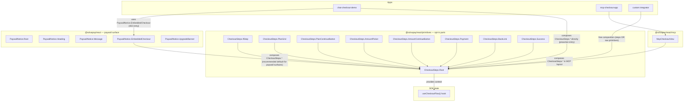

# Unify checkout: shared state engine, app-owned layout

## Problem

After the previous chatbot SDK refactor (commit `5ab73a5`), the chat-checkout-demo's inline drawer surfaces two real defects that point to a structural issue:

1. **MCP-flavored copy bleeds into the web UI.** `<PaywallNotice.Message>` in [`packages/react/src/primitives/PaywallNotice.tsx`](packages/react/src/primitives/PaywallNotice.tsx) defaults to `content.message`, which [`buildGateMessage`](packages/server/src/paywall-state.ts) intentionally writes for MCP/CLI hosts ("Call the `upgrade`/`activate_plan` tool…"). Web integrators inherit that text.
2. **Plan selection isn't first-class.** `<PaywallNotice.EmbeddedCheckout>` mounts `<PlanSelector>` with `autoSelectFirstPaid={true}` and the payment form below the grid. The MCP layer has the right answer in `mcp/views/checkout/CheckoutStateMachine` (stepped plan → amount → payment → success with explicit Continue) but it's locked behind `@solvapay/react/mcp` because of `useMcpBridge` / `useHostLocale` deps.

The deeper symptom: **two parallel `EmbeddedCheckout` components** with diverging UX, and no clear answer to "which do I import?".

## Design principles

Three commitments shape this plan:

1. **State in the SDK, layout in the app.** The state machine (transitions, validation, status flags) is hard to get right and benefits everyone. The layout (drawer vs full-page vs modal vs conversational) is opinionated and cheap. Following the Radix UI / TanStack pattern: ship a headless hook + opt-in styled parts, never a default tree that locks one layout into the SDK.
2. **No surface bleed.** The checkout primitive does not know it's mounted inside a paywall. Paywall context (banner, "you hit a paywall" copy) lives in `<PaywallNotice>`. MCP-specific UX ("Stay on Free", `notifyModelContext`) lives in the MCP wrapper.
3. **Clear "which to import" rules** documented and enforced by naming.

## Target architecture



**"Which component when" — the rules:**

| Use case | Import |
|---|---|
| Building any checkout UX (web, chatbot, custom) — want the state engine and pre-styled parts | `useCheckoutFlow` + `CheckoutSteps` from `@solvapay/react` |
| Reacting to a 402 paywall response with the SDK's recommended stepped layout | `<PaywallNotice.EmbeddedCheckout>` |
| Building an MCP App iframe | `<McpApp>` / `<McpCheckoutView>` from `@solvapay/react/mcp` |
| Need full layout control or a custom step ordering | Compose `CheckoutSteps.*` parts in your own JSX, or drop to `<PlanSelector>` / `<PaymentForm>` / `<TopupForm>` directly |

## Tier 1 — Headless hook + composable parts

### `useCheckoutFlow()` — state, transitions, lifecycle

New file [`packages/react/src/hooks/useCheckoutFlow.ts`](packages/react/src/hooks/useCheckoutFlow.ts):

```ts
type CheckoutStep = 'plan' | 'amount' | 'payment' | 'success'
type CheckoutStatus = 'idle' | 'activating' | 'paying' | 'error'

interface UseCheckoutFlowOptions {
  productRef: string
  // Lifecycle hooks — all optional, fired at well-defined transition points.
  onPlanSelect?: (planRef: string, plan: Plan) => void
  onAmountSelect?: (amountMinor: number, currency: string) => void
  onPurchaseSuccess?: (meta: SuccessMeta) => void
  onError?: (err: Error, phase: 'activate' | 'pay') => void
  // Test seam.
  initialStep?: CheckoutStep
}

interface UseCheckoutFlowReturn {
  step: CheckoutStep
  status: CheckoutStatus
  selectedPlan: Plan | null
  selectedPlanRef: string | null
  selectedAmountMinor: number | null
  successMeta: SuccessMeta | null
  error: string | null
  // Transitions.
  selectPlan: (planRef: string) => void
  selectAmount: (amountMinor: number) => void
  advance: () => Promise<void>   // current step → next
  back: () => void                // current step → prev
  reset: () => void               // back to plan
  retry: () => void               // re-attempt last failed transition
}

export function useCheckoutFlow(opts: UseCheckoutFlowOptions): UseCheckoutFlowReturn
```

The hook owns:
- The four-step machine (plan → amount [PAYG only] → payment → success).
- Calling `transport.activatePlan` between plan and amount steps for PAYG (the side effect currently in [`mcp/views/checkout/CheckoutStateMachine.tsx:123-153`](packages/react/src/mcp/views/checkout/CheckoutStateMachine.tsx)).
- Firing lifecycle callbacks at the right moments. All MCP-specific calls (`notifyModelContext`, `notifySuccess`, `sendMessage`) become callback consumers' responsibility.

The hook does NOT own:
- Plan-list fetching (delegated to `<PlanSelector.Root>` already, available via context).
- Stripe element rendering (delegated to `<PaymentForm>` / `<TopupForm>` parts).
- Any UI / layout decisions.

### `CheckoutSteps.*` — opt-in styled parts

New folder [`packages/react/src/primitives/checkout/`](packages/react/src/primitives/checkout/) exporting a single namespace:

```ts
export const CheckoutSteps = {
  Root,            // provides CheckoutContext + PlanSelector.Root, no chrome of its own
  IfStep,          // <CheckoutSteps.IfStep step="plan">…</> — declarative step gating
  PlanGrid,        // <PlanSelector.Grid> with the right filter/sort defaults
  PlanContinueButton, // disabled until selectedPlan, fires advance()
  AmountPicker,    // <AmountPicker> wired to selectAmount
  AmountContinueButton,
  Payment,         // branches PAYG → <TopupForm>, recurring → <PaymentForm>
  BackLink,        // calls back()
  Success,         // optional receipt
}
```

`<CheckoutSteps.Root>` accepts the `useCheckoutFlow` instance OR creates one internally if not provided:

```tsx
<CheckoutSteps.Root productRef={ref} returnUrl={url} onPurchaseSuccess={onSuccess}>
  <CheckoutSteps.IfStep step="plan">
    <CheckoutSteps.PlanGrid />
    <CheckoutSteps.PlanContinueButton />
  </CheckoutSteps.IfStep>

  <CheckoutSteps.IfStep step="amount">
    <CheckoutSteps.BackLink />
    <CheckoutSteps.AmountPicker />
    <CheckoutSteps.AmountContinueButton />
  </CheckoutSteps.IfStep>

  <CheckoutSteps.IfStep step="payment">
    <CheckoutSteps.BackLink />
    <CheckoutSteps.Payment />
  </CheckoutSteps.IfStep>

  <CheckoutSteps.IfStep step="success">
    <CheckoutSteps.Success />
  </CheckoutSteps.IfStep>
</CheckoutSteps.Root>
```

Power users can pass their own `flow={useCheckoutFlow(opts)}` for shared state across surfaces (e.g. a header that reads `flow.step`).

### Naming + class names

- Hook: `useCheckoutFlow` (not `useCheckout` — that already exists at [`packages/react/src/hooks/useCheckout.ts`](packages/react/src/hooks/useCheckout.ts)).
- Parts namespace: `CheckoutSteps` (not `Checkout` — avoids the same collision and makes it self-documenting that these are step components).
- Class names: `solvapay-checkout-*` namespace on the parts. MCP CSS uses parent-selector specificity (`.solvapay-mcp-shell .solvapay-checkout-card { … }`) instead of remapping classNames at the wrapper level. Cleaner than the originally-planned className mapping.

## Tier 2 — Reduce `<McpCheckoutView>` to a layout wrapper

[`packages/react/src/mcp/views/McpCheckoutView.tsx`](packages/react/src/mcp/views/McpCheckoutView.tsx) and the entire [`packages/react/src/mcp/views/checkout/`](packages/react/src/mcp/views/checkout/) folder collapse into one `McpCheckoutView` that:

1. Calls `useMcpBridge()` once.
2. Calls `useCheckoutFlow({ productRef, onPlanSelect: bridge.notifyModelContext, onPurchaseSuccess: bridge.notifySuccess, … })`.
3. Renders the MCP-styled layout: `<UpgradeBanner>` (kept inline in this file — MCP-specific copy), `<CheckoutSteps.*>` parts wired via `<CheckoutSteps.Root flow={flow}>`, plus the MCP-only `<StayOnFreeButton>` at the bottom of the plan step.
4. Forwards the `useStripeProbe` gating (CSP-blocked path keeps the existing `HostedCheckout`).

Existing tests in [`packages/react/src/mcp/views/__tests__/McpCheckoutView.test.tsx`](packages/react/src/mcp/views/__tests__/McpCheckoutView.test.tsx) pass unchanged: `activate_plan` firing, `notifyModelContext` text, banner copy, "Stay on Free" — all preserved by the wrapper composition. The state-machine tests can move to `useCheckoutFlow.test.ts` and assert via the hook return rather than via DOM, simplifying them.

## Tier 3 — Web-friendly paywall copy + stepped `EmbeddedCheckout`

### Copy fix (i18n)

Add to [`packages/react/src/i18n/types.ts`](packages/react/src/i18n/types.ts) and [`packages/react/src/i18n/en.ts`](packages/react/src/i18n/en.ts) `paywall` block:

```ts
paywall: {
  // existing keys retained…
  activationRequiredMessage: 'This tool needs an active plan{forProduct}. Pick one below to keep going.',
  topupRequiredMessage: "You're out of credits{forProduct}. Add more below to keep going.",
  paymentRequiredMessageNoBalance: "You've used your included messages{forProduct}. Pick a plan below to keep chatting.",
}
```

Rewrite `resolvePaywallMessage` in [`packages/react/src/primitives/PaywallNotice.tsx`](packages/react/src/primitives/PaywallNotice.tsx) (lines 183-209) to resolve by `kind` first, falling back to `content.message` only when no kind-specific i18n string exists:

- `kind: 'payment_required'` + balance with `remainingUnits > 0` → `paymentRequiredMessageRemaining`
- `kind: 'payment_required'` + balance with `remainingUnits === 0` → `paymentRequiredMessage`
- `kind: 'payment_required'` no balance → `paymentRequiredMessageNoBalance`
- `kind: 'activation_required'` → `activationRequiredMessage`
- Any future kind → `content.message` fallback (unchanged behaviour for forward compat)

Net effect: `<PaywallNotice.Message>` never displays "Call the `upgrade` tool…" in a web UI. The MCP layer routes `content.message` through `content[0].text` (its actual consumer), so MCP behaviour is unchanged.

### `<PaywallNotice.EmbeddedCheckout>` becomes a stepped composition

[`packages/react/src/primitives/PaywallNotice.tsx`](packages/react/src/primitives/PaywallNotice.tsx) `EmbeddedCheckout` (line 338) is rewritten as a thin stepped composition of `<CheckoutSteps.*>`. This is the SDK's documented "recommended default for paywall surfaces" — apps wanting a different layout compose `<CheckoutSteps.*>` directly.

```tsx
function EmbeddedCheckout({ returnUrl, className }: EmbeddedCheckoutProps) {
  const ctx = usePaywallNoticeCtx('EmbeddedCheckout')
  if (!ctx.content.product) return null
  return (
    <CheckoutSteps.Root
      productRef={ctx.content.product}
      returnUrl={returnUrl}
      onPurchaseSuccess={() => void ctx.refetch()}
      className={className ?? ctx.classNames.embeddedCheckout}
    >
      <CheckoutSteps.IfStep step="plan">
        <CheckoutSteps.PlanGrid />
        <CheckoutSteps.PlanContinueButton />
      </CheckoutSteps.IfStep>
      <CheckoutSteps.IfStep step="amount">
        <CheckoutSteps.BackLink />
        <CheckoutSteps.AmountPicker />
        <CheckoutSteps.AmountContinueButton />
      </CheckoutSteps.IfStep>
      <CheckoutSteps.IfStep step="payment">
        <CheckoutSteps.BackLink />
        <CheckoutSteps.Payment />
      </CheckoutSteps.IfStep>
    </CheckoutSteps.Root>
  )
}
```

Drop the now-unused `PaywallSelectedPlanGate` / `PaywallPaygGate` / `PaywallPaymentFormGate` (lines 385-502).

`<PaywallNotice>` does NOT push paywall context into `CheckoutSteps`. If consumers want a banner above the steps they render `<PaywallNotice.Heading>` + `<PaywallNotice.Message>` (already covered by the existing PaywallNotice surface) — no new banner export needed.

## Tier 4 — Demo cleanup

[`examples/chat-checkout-demo/components/InlineCheckout.tsx`](examples/chat-checkout-demo/components/InlineCheckout.tsx) shrinks because all the work moves into the SDK:

- **Real-402 entry**: keep `<PaywallNotice.Root>` + `Heading` + `Message` + `EmbeddedCheckout` — now stepped automatically with web-friendly copy.
- **Proactive-upgrade entry** (user clicked "Upgrade" before hitting a 402): compose `<CheckoutSteps.Root productRef={…} returnUrl={…} onPurchaseSuccess={handleSuccess}>` with the same stepped composition shown in the EmbeddedCheckout snippet above. Drop the synthetic `payment_required` content block in [`examples/chat-checkout-demo/App.tsx`](examples/chat-checkout-demo/App.tsx) `handleUpgrade` (lines 197-214).

`paywallContent: PaywallStructuredContent | null` state in `App.tsx` becomes `{ mode: 'paywall', content } | { mode: 'upgrade', productRef } | null`, which `ChatWindow` and `InlineCheckout` route on.

## Tier 5 — Public exports + docs

- Add to [`packages/react/src/index.tsx`](packages/react/src/index.tsx): `export { useCheckoutFlow } from './hooks/useCheckoutFlow'`, `export { CheckoutSteps } from './primitives/checkout'`, plus the related types (`UseCheckoutFlowOptions`, `UseCheckoutFlowReturn`, `CheckoutStep`, `CheckoutStatus`, `SuccessMeta`).
- Update [`examples/chat-checkout-demo/README.md`](examples/chat-checkout-demo/README.md)'s "Architecture" section with the "Which component when" matrix from this plan.
- Update the docstring on `<PaywallNotice>` to reflect that `EmbeddedCheckout` is now a stepped composition + the copy resolution rule.
- Add a changeset under `.changeset/` documenting the additions as a `minor` bump on `@solvapay/react`. (Collapses with the existing pending `first-class-chatbot-sdk` changeset into a single `1.1.3 → 1.2.0` bump at release.)

## Validation

- All existing MCP tests in `packages/react/src/mcp/views/__tests__/McpCheckoutView.test.tsx` pass unchanged (behaviour preserved through the layout wrapper composition).
- New `useCheckoutFlow.test.ts` covering: stepped traversal (plan → continue → payment → success), PAYG branch (plan → continue → amount → payment), `selectPlan` updating context, lifecycle callback ordering, `back` / `reset` / `retry` semantics, error paths.
- New unit tests for `resolvePaywallMessage` covering the kind × balance-presence matrix.
- Manual smoke: all 3 chat-checkout-demo scenarios end-to-end (free quota → 402 → stepped checkout → resume; proactive Upgrade click; PAYG top-up) on Vite + Wrangler.

## Migration / breaking-change risk

| Surface | Risk | Mitigation |
|---|---|---|
| `useCheckoutFlow` (new) | None — additive | — |
| `CheckoutSteps` (new) | None — additive | — |
| `<PaywallNotice.EmbeddedCheckout>` (behavior change: now stepped) | Low — published in v1.2.0 with one consumer (the demo) | Treated as a UX bugfix on a not-yet-shipped primitive; documented in the changeset under "Behavioural changes" |
| `<PaywallNotice.Message>` (resolution change) | Very low — strict improvement, fallback path preserved for forward compat | New i18n keys are additive |
| MCP layer | None — wrapper preserves identical DOM, MCP tests pass unchanged | — |
| MCP `mcp/views/checkout/*` files (deleted) | None — internal implementation, no public exports | Test file moves to `useCheckoutFlow.test.ts` |

## Out of scope

- Generalising checkout over non-Stripe processors. Same Stripe coupling as today.
- A `useCheckoutFlow` variant that runs without `<PlanSelector>` (e.g. pre-selected plan from URL, single-plan products that skip the plan step). Easy follow-up; the hook can grow an `initialPlanRef` option then.
- Touching `paywall-state.ts` / `buildGateMessage` server-side. The MCP-flavored text remains correct for its actual consumer (`content[0].text` in MCP responses).
- A full `<Checkout>` default tree. Deliberately omitted — apps own layout. If a "batteries-included" wrapper turns out to be needed after first integrators land, easy to add then; the primitive composition stays correct either way.
- `<PaywallNotice.UpgradeBanner>` as a separate composable. The existing `Heading` + `Message` already cover the banner role.
- Splitting the i18n fix into its own ship. Consolidated per the user's preference for one PR.
