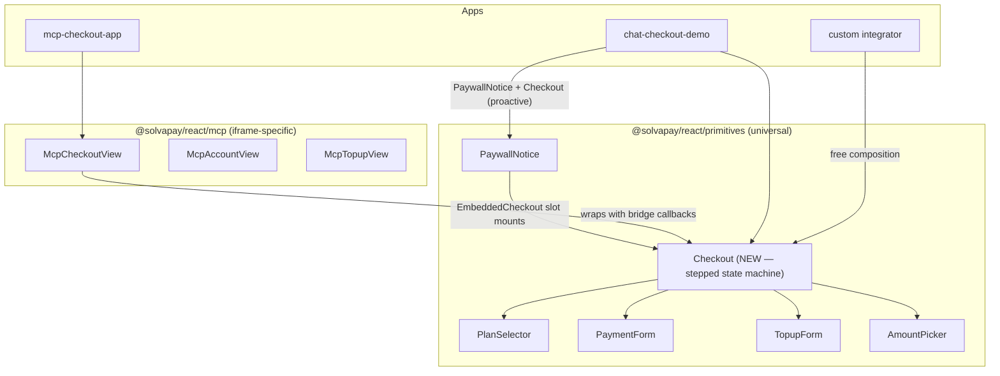

# Unify checkout: one stepped primitive for MCP apps + chatbot/web

## Problem

After landing the previous chatbot SDK refactor (commit `5ab73a5`), the chat-checkout-demo's inline drawer surfaces two real defects that point to a structural issue, not a styling one:

1. **MCP-flavored copy bleeds into the web UI.** `<PaywallNotice.Message>` in [`packages/react/src/primitives/PaywallNotice.tsx`](packages/react/src/primitives/PaywallNotice.tsx) defaults to `content.message`, which `buildGateMessage` in [`packages/server/src/paywall-state.ts`](packages/server/src/paywall-state.ts) intentionally writes for MCP/CLI hosts ("Call the `upgrade`/`activate_plan` tool…"). Web integrators inherit that text.
2. **Plan selection isn't first-class.** `<PaywallNotice.EmbeddedCheckout>` mounts `<PlanSelector>` with `autoSelectFirstPaid={true}` and immediately mounts the payment form below the grid. The MCP layer has the right answer — `mcp/views/checkout/CheckoutStateMachine` runs a stepped plan → amount → payment → success flow with an explicit Continue button — but it lives behind `@solvapay/react/mcp` and depends on `useMcpBridge` / `useHostLocale`, so non-MCP integrators can't reuse it.

The deeper symptom is **two parallel checkout components named `EmbeddedCheckout`** (one primitive, one MCP) with diverging UX. Integrators have no clear answer to "which do I import?".

## Target architecture



**Decision rules ("which component when"):**

- Building any web checkout flow (chatbot, custom dashboard, marketing landing) → `<Checkout>` from `@solvapay/react/primitives`. First-class stepped flow, no MCP deps.
- Reacting to a 402 paywall response in any web app → `<PaywallNotice.Root>` for the heading/message chrome, with `<PaywallNotice.EmbeddedCheckout>` (now thin wrapper around `<Checkout>`) as the action surface.
- Building an MCP App iframe → `@solvapay/react/mcp`'s `<McpApp>` / `<McpCheckoutView>`. Internally uses `<Checkout>` plus bridge wiring.
- Need lower-level control (custom layout, custom step ordering) → drop to `<PlanSelector>` / `<PaymentForm>` / `<TopupForm>` / `<AmountPicker>` directly. Same as today.

## Tier 1 — Hoist `CheckoutStateMachine` into a transport-agnostic primitive

**Move + decouple** (functional behavior preserved 1:1):

- New folder [`packages/react/src/primitives/checkout/`](packages/react/src/primitives/checkout/) containing:
  - `Checkout.tsx` — public compound: `<Checkout.Root>`, `<Checkout.PlanStep>`, `<Checkout.AmountStep>`, `<Checkout.PaymentStep>`, `<Checkout.SuccessStep>`, plus a default `<Checkout>` that renders all four.
  - `CheckoutStateMachine.tsx` — moved from `mcp/views/checkout/`, with the three `useMcpBridge` call sites turned into injected callbacks.
  - `steps/{PlanStep,AmountStep,PaygPaymentStep,RecurringPaymentStep,SuccessStep}.tsx` — moved as-is, with `useHostLocale` swapped to `useLocale` (the MCP host locale already flows into `CopyContext` via `<McpApp>`'s `applyContext`, so the swap is transparent for MCP).
  - `shared.ts` — moved unchanged.

**Inject MCP-only side effects via callbacks on `<Checkout.Root>`:**

```ts
interface CheckoutRootProps {
  productRef: string
  returnUrl: string
  // Lifecycle hooks — all optional. MCP wrapper supplies them; web apps usually skip them.
  onPlanSelect?: (planRef: string, plan: Plan) => void  // → notifyModelContext
  onAmountSelect?: (amountMinor: number, currency: string) => void  // → notifyModelContext
  onPurchaseSuccess?: (meta: SuccessMeta) => void  // → notifySuccess + parent's onResolved
  onStayOnFreeRequest?: () => void  // → sendMessage('Sticking with the free tier…') + onClose
  // Surface variants
  fromPaywall?: boolean
  paywallKind?: 'payment_required' | 'activation_required'
  hideUpgradeBanner?: boolean
  classNames?: CheckoutClassNames
  plans?: readonly BootstrapPlanLike[]  // optional pre-fetched plans
}
```

The state machine's existing transitions stay pure; the bridge calls in [`packages/react/src/mcp/views/checkout/CheckoutStateMachine.tsx`](packages/react/src/mcp/views/checkout/CheckoutStateMachine.tsx) (lines 96, 126, 189, 226, 264) just route through `props.on*Select` / `props.onPurchaseSuccess` / `props.onStayOnFreeRequest` instead of `useMcpBridge`.

**Class-name strategy:** the MCP `cx` helper (`solvapay-mcp-*`) is replaced with a primitive `solvapay-checkout-*` namespace. The MCP wrapper passes `classNames` that map back to `solvapay-mcp-*` so existing MCP styles in `@solvapay/react/mcp/styles.css` keep working.

## Tier 2 — Reduce `<McpCheckoutView>` to a thin bridge wrapper

[`packages/react/src/mcp/views/McpCheckoutView.tsx`](packages/react/src/mcp/views/McpCheckoutView.tsx) and [`packages/react/src/mcp/views/checkout/EmbeddedCheckout.tsx`](packages/react/src/mcp/views/checkout/EmbeddedCheckout.tsx) collapse into one `McpCheckoutView` that:

- Calls `useMcpBridge()` once and binds `notifyModelContext` / `notifySuccess` / `sendMessage` into the `<Checkout.Root>` callback props.
- Forwards `useStripeProbe` gating (only the embedded-Stripe path mounts `<Checkout>`; CSP-blocked path keeps the existing `HostedCheckout`).
- Passes the MCP-flavored `classNames` so styling stays pixel-identical.

Existing tests in [`packages/react/src/mcp/views/__tests__/McpCheckoutView.test.tsx`](packages/react/src/mcp/views/__tests__/McpCheckoutView.test.tsx) should pass unchanged; all the MCP-specific assertions (e.g. `activate_plan` firing, `notifyModelContext` text) are preserved by the wrapper.

## Tier 3 — Make `<PaywallNotice.EmbeddedCheckout>` stepped + fix the copy

**Stepped flow (no API change, behavior fix):**

[`packages/react/src/primitives/PaywallNotice.tsx`](packages/react/src/primitives/PaywallNotice.tsx) `EmbeddedCheckout` (line 338) becomes a thin wrapper:

```tsx
function EmbeddedCheckout({ returnUrl, className, children }: EmbeddedCheckoutProps) {
  const ctx = usePaywallNoticeCtx('EmbeddedCheckout')
  if (!ctx.content.product) return null
  return (
    <Checkout
      productRef={ctx.content.product}
      returnUrl={returnUrl}
      fromPaywall
      paywallKind={ctx.content.kind}
      hideUpgradeBanner    // PaywallNotice.Heading/Message already cover this
      onPurchaseSuccess={() => void ctx.refetch()}
      classNames={resolvePaywallEmbeddedClassNames(ctx.classNames, className)}
    >
      {children}
    </Checkout>
  )
}
```

Drop the now-unused `PaywallSelectedPlanGate` / `PaywallPaygGate` / `PaywallPaymentFormGate` (lines 385-502).

**Web-friendly copy (the i18n fix the user already approved):**

Add to [`packages/react/src/i18n/types.ts`](packages/react/src/i18n/types.ts) `paywall` block and [`packages/react/src/i18n/en.ts`](packages/react/src/i18n/en.ts):

```ts
paywall: {
  // existing keys retained…
  activationRequiredMessage: 'This tool needs an active plan{forProduct}. Pick one below to keep going.',
  topupRequiredMessage: "You're out of credits{forProduct}. Add more below to keep going.",
  paymentRequiredMessageNoBalance: "You've used your included messages{forProduct}. Pick a plan below to keep chatting.",
}
```

Rewrite `resolvePaywallMessage` in `PaywallNotice.tsx` (lines 183-209) to choose by `kind` first, falling back to `content.message` only when no kind-specific i18n string exists:

- `kind: 'payment_required'` + balance → existing `paymentRequiredMessage` / `paymentRequiredMessageRemaining`
- `kind: 'payment_required'` no balance → `paymentRequiredMessageNoBalance`
- `kind: 'activation_required'` → `activationRequiredMessage`
- Any future kind → `content.message` fallback (unchanged behaviour)

Net effect: `<PaywallNotice.Message>` never displays "Call the `upgrade` tool…" in a web UI. The MCP layer already routes `content.message` through `content[0].text` (its actual consumer), so MCP behaviour is unchanged.

## Tier 4 — Demo cleanup

[`examples/chat-checkout-demo/components/InlineCheckout.tsx`](examples/chat-checkout-demo/components/InlineCheckout.tsx) shrinks to ~40 lines because all the work moves into the SDK:

- Real-402 branch: keep `<PaywallNotice.Root>` + `Heading` + `Message` + `EmbeddedCheckout` — now stepped automatically with web-friendly copy.
- Proactive-upgrade branch: switch [`examples/chat-checkout-demo/App.tsx`](examples/chat-checkout-demo/App.tsx) `handleUpgrade` (lines 197-214) to mount `<Checkout productRef={…} returnUrl={…} onPurchaseSuccess={handleFormSuccess} />` directly. Drop the synthetic `payment_required` content block — it was a workaround for the "PaywallNotice required a structured content shape" coupling that no longer exists.

`paywallContent: PaywallStructuredContent | null` state in `App.tsx` becomes a discriminated union: `{ mode: 'paywall', content } | { mode: 'upgrade', productRef } | null`, which `ChatWindow` and `InlineCheckout` route on.

## Tier 5 — Public exports + docs

- Add to [`packages/react/src/index.tsx`](packages/react/src/index.tsx): `export { Checkout } from './primitives/checkout'` and the related types.
- Update [`examples/chat-checkout-demo/README.md`](examples/chat-checkout-demo/README.md)'s "Architecture" section to reference `<Checkout>` directly and add a "When to use what" matrix matching the diagram above.
- Update the docstring on `<PaywallNotice>` to reflect that `EmbeddedCheckout` is now stepped + the copy resolution rule.
- Add a changeset under `.changeset/` documenting the `<Checkout>` addition + the `PaywallNotice.EmbeddedCheckout` UX fix as a `minor` bump on `@solvapay/react`.

## Validation

- All existing MCP tests in `packages/react/src/mcp/views/__tests__/McpCheckoutView.test.tsx` pass unchanged (behaviour preserved through the wrapper).
- New unit tests for `<Checkout>` covering: stepped traversal (plan → continue → payment → success), PAYG branch (plan → continue → amount → payment), `fromPaywall` banner suppression, `onPurchaseSuccess` callback firing.
- New unit tests for `resolvePaywallMessage` covering each `kind` × balance-presence matrix.
- Manual smoke: all 3 chat-checkout-demo scenarios end-to-end (free quota → 402 → stepped checkout → resume) on Vite + Wrangler.
- Diff `pnpm pack` of `@solvapay/react` between current dev and the branch — only additions to public API plus the deletion of the inline `PaywallSelectedPlanGate` (internal, no consumers).

## Out of scope

- Generalising `<Checkout>` over non-Stripe processors. Same Stripe coupling as today.
- A `<Checkout>` variant that runs without `<PlanSelector>` (e.g. pre-selected plan from the URL). Easy follow-up if asked.
- Touching `paywall-state.ts` / `buildGateMessage` server-side. The MCP-flavored text remains correct for its actual consumer (`content[0].text` in MCP responses); the fix is to stop the web `<PaywallNotice.Message>` from leaking it.
- Changing `<PaywallNotice.EmbeddedCheckout>`'s prop signature. Stays a non-breaking behaviour fix.
