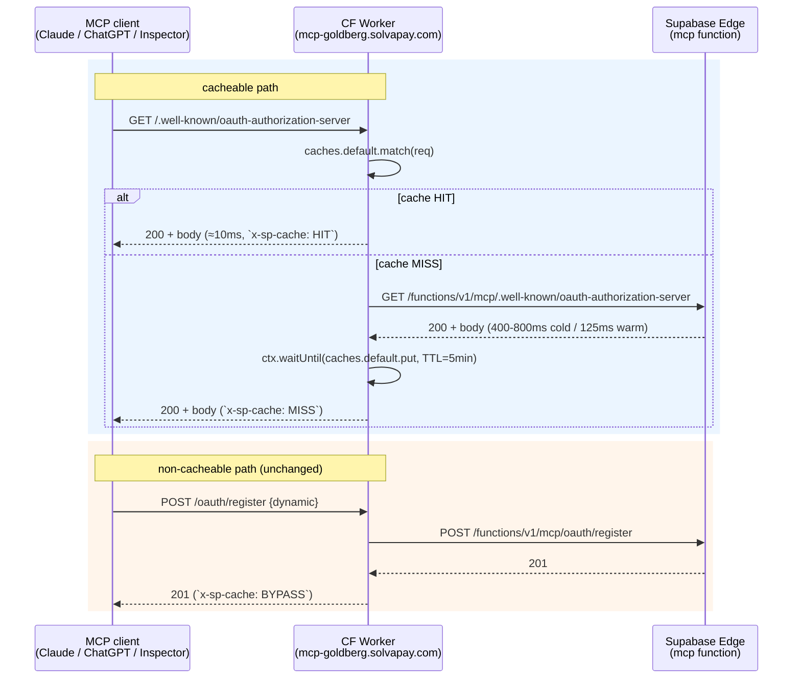

## Why this is the right layer to cache at

The three RFC 9728 / OAuth discovery documents served by the Supabase function are 100% static per deploy — their body only depends on `MCP_PUBLIC_BASE_URL` and the OAuth bridge's compiled-in paths:

- `/.well-known/oauth-protected-resource` — 200, JSON
- `/.well-known/oauth-authorization-server` — 200, JSON
- `/.well-known/openid-configuration` — 404, empty body (MCP clients probe this anyway; caching the 404 kills a pointless warm-up on every connect)

They're served by the built-in SDK handlers at [packages/mcp-fetch/src/oauth-bridge.ts](solvapay-sdk/packages/mcp-fetch/src/oauth-bridge.ts) lines 186 / 199 / 219 and have no per-request auth, no per-request state, no `Set-Cookie`, no `Authorization`-dependent body. They're also the exact paths every MCP client hits *before* `tools/call`, so caching them is the biggest visible win for connect-time latency.

Every other route the Worker proxies **must not** be cached: OAuth DCR (`/oauth/register`) mints fresh client credentials, `/oauth/authorize` is user-specific, `/oauth/token` is POST-with-secrets, and `/mcp` is dynamic JSON-RPC. The allowlist approach keeps that boundary unambiguous.



## Worker changes

Edit [examples/supabase-edge-mcp-proxy/src/worker.ts](solvapay-sdk/examples/supabase-edge-mcp-proxy/src/worker.ts):

**1. Update the fetch signature to accept `ExecutionContext`.** The Workers Cache API requires `ctx.waitUntil(...)` so the `cache.put` completes after the response has streamed back to the client. Today the handler is `fetch(req, env)`; change it to `fetch(req, env, ctx)`.

**2. Add a cacheable-path allowlist.**

```ts
const CACHEABLE_PATHS = new Set([
  '/.well-known/oauth-protected-resource',
  '/.well-known/oauth-authorization-server',
  '/.well-known/openid-configuration',
])

function isCacheable(req: Request): boolean {
  if (req.method !== 'GET') return false
  const url = new URL(req.url)
  return CACHEABLE_PATHS.has(url.pathname)
}
```

**3. In the handler, branch on `isCacheable`.** Non-cacheable path → exactly today's behaviour + `x-sp-cache: BYPASS`. Cacheable path → the Cache-API dance below.

```ts
const TTL_SECONDS = 300

async function handleCacheable(
  req: Request,
  env: Env,
  ctx: ExecutionContext,
): Promise<Response> {
  // Cache key is URL-only on purpose: Origin, cookies, auth are
  // irrelevant to a public metadata document. Works around the
  // default keying-by-request which would miss on any header change.
  const cacheKey = new Request(new URL(req.url).toString(), {
    method: 'GET',
  })
  const cache = caches.default

  const hit = await cache.match(cacheKey)
  if (hit) {
    const headers = new Headers(hit.headers)
    headers.set('x-sp-cache', 'HIT')
    return new Response(hit.body, { status: hit.status, statusText: hit.statusText, headers })
  }

  const target = rewriteUrl(new URL(req.url), env)
  const upstreamReq = forwardRequest(req, target)
  const upstreamRes = await fetch(upstreamReq)

  // Do not cache 5xx — they're either transient Supabase failures or
  // a deploy mid-roll. 404s are cacheable (the openid probe is a
  // permanent 404 by design).
  const shouldCache =
    upstreamRes.status === 200 || upstreamRes.status === 404

  const headers = new Headers(upstreamRes.headers)
  // Public metadata — normalise CORS so browsers from any origin can
  // read from the cached variant. Anything scoped to a specific
  // origin would poison the cache. Safe because metadata contains no
  // credentials.
  headers.set('Access-Control-Allow-Origin', '*')
  headers.delete('Vary')
  // Tell CF's HTTP cache layer how long to hold the response.
  // `s-maxage` applies to shared caches (the Worker's `caches.default`
  // honours it), `max-age` applies downstream so clients also dedupe.
  headers.set('Cache-Control', `public, max-age=${TTL_SECONDS}, s-maxage=${TTL_SECONDS}`)
  headers.set('x-sp-cache', 'MISS')

  const body = await upstreamRes.arrayBuffer()
  const response = new Response(body, {
    status: upstreamRes.status,
    statusText: upstreamRes.statusText,
    headers,
  })

  if (shouldCache) {
    // Clone BEFORE handing the response to the client — response.body
    // is a single-consumer stream. Cache gets the clone, client gets
    // the original; `waitUntil` lets the put finish async.
    ctx.waitUntil(cache.put(cacheKey, response.clone()))
  }
  return response
}
```

**4. Wire `OPTIONS` preflight for `.well-known/*` explicitly** at the top of `fetch` so browser-origin MCP clients (ChatGPT Custom Connector UI, MCP Inspector web) don't round-trip Supabase for preflight either:

```ts
if (req.method === 'OPTIONS' && isCacheable(new Request(req.url))) {
  const headers = new Headers({
    'Access-Control-Allow-Origin': '*',
    'Access-Control-Allow-Methods': 'GET, OPTIONS',
    'Access-Control-Allow-Headers':
      req.headers.get('access-control-request-headers') ?? '*',
    'Access-Control-Max-Age': '600',
    'x-sp-cache': 'BYPASS',
  })
  return new Response(null, { status: 204, headers })
}
```

Preflight responses are trivially small and Cloudflare's own edge-gateway caches them via `Access-Control-Max-Age`; we don't need Cache API for these.

**5. Keep the rest of `fetch` as today** for non-cacheable paths. Just add one header:

```ts
const upstreamRes = await fetch(upstreamReq)
const headers = new Headers(upstreamRes.headers)
headers.set('x-sp-cache', 'BYPASS')
return new Response(upstreamRes.body, {
  status: upstreamRes.status,
  statusText: upstreamRes.statusText,
  headers,
})
```

## What explicitly stays a passthrough

- `POST /oauth/register` — DCR mints fresh client creds
- `GET /oauth/authorize` — redirects with user-specific session state
- `POST /oauth/token` — authenticated token exchange
- `POST /oauth/revoke` — authenticated revocation
- `POST /mcp` — JSON-RPC payloads
- Anything else (404s on unknown paths get the `x-sp-cache: BYPASS` tag but aren't cached)

## Local smoke

```bash
cd examples/supabase-edge-mcp-proxy
pnpm exec wrangler dev
# in another shell:
curl -sI http://127.0.0.1:8787/.well-known/oauth-authorization-server | rg -i 'x-sp-cache|cache-control'
# expect: x-sp-cache: MISS, cache-control: public, max-age=300, s-maxage=300
curl -sI http://127.0.0.1:8787/.well-known/oauth-authorization-server | rg -i 'x-sp-cache'
# expect: x-sp-cache: HIT
curl -sI -X POST http://127.0.0.1:8787/mcp -d '{}' | rg -i 'x-sp-cache'
# expect: x-sp-cache: BYPASS
```

Note: `wrangler dev`'s in-memory cache doesn't perfectly mirror production CF cache semantics — you'll sometimes see a MISS on the second hit in dev. The production test (next step) is the authoritative one.

## Deploy + production verify

```bash
cd examples/supabase-edge-mcp-proxy
pnpm deploy       # = wrangler deploy — no wrangler.jsonc changes needed
```

Verify end-to-end against the live Worker:

```bash
for i in 1 2 3; do
  curl -s -o /dev/null -w 'try %{http_code} %{time_total}s  %header{x-sp-cache}  %header{cf-cache-status}\n' \
    "https://mcp-goldberg.solvapay.com/.well-known/oauth-authorization-server"
done
```

Expected shape:

```
try 200 0.45s  MISS  MISS
try 200 0.02s  HIT   HIT
try 200 0.02s  HIT   HIT
```

First call populates the cache (≈400-800ms from Supabase cold), subsequent calls serve from CF edge in ≈10-30ms.

Also verify the sensitive routes bypass:

```bash
curl -sI -X POST https://mcp-goldberg.solvapay.com/oauth/register \
  -H 'content-type: application/json' -d '{}' | rg -i 'x-sp-cache'
# -> x-sp-cache: BYPASS
```

Run the full MCP Inspector flow once (`npx @modelcontextprotocol/inspector` pointed at `https://mcp-goldberg.solvapay.com/`) to confirm nothing in the CORS / metadata shape broke.

## Cache invalidation on redeploy

The metadata body changes only if `MCP_PUBLIC_BASE_URL` or the function's OAuth paths change — both only happen when `@example/supabase-edge-mcp` redeploys. Short 5-minute TTL handles the worst case: at most 5 minutes of stale metadata while old clients get the previous `issuer` URL. In practice nobody redeploys the function during a live demo.

If you need immediate purge during a demo, one of:

- **Manual**: `curl -X POST https://api.cloudflare.com/client/v4/zones/<zone>/purge_cache -H 'Authorization: Bearer <token>' -d '{"files":["https://mcp-goldberg.solvapay.com/.well-known/oauth-authorization-server","https://mcp-goldberg.solvapay.com/.well-known/oauth-protected-resource","https://mcp-goldberg.solvapay.com/.well-known/openid-configuration"]}'`
- **Automated (deferred todo `purge-on-deploy`)**: add a `postdeploy` script to `@example/supabase-edge-mcp` that hits the same endpoint via a `CLOUDFLARE_API_TOKEN` env. Overkill for a demo; worth it if we ever put a real customer MCP server on this topology.

## README update

Rewrite [examples/supabase-edge-mcp-proxy/README.md](solvapay-sdk/examples/supabase-edge-mcp-proxy/README.md)'s "Non-goals" block:

```md
## What's cached, what isn't

The Worker caches three `.well-known/*` OAuth discovery documents at
Cloudflare's edge (TTL 5 min, keyed by URL only) to take the Supabase
cold-start penalty off MCP connect flows. Verify on a response with
`x-sp-cache: HIT|MISS|BYPASS`.

Every other route — `/oauth/*`, `/mcp`, anything else — is a pure
passthrough. Auth enforcement and JSON-RPC handling stay entirely in
the Supabase function.

If you redeploy the Supabase function with a new `MCP_PUBLIC_BASE_URL`,
either wait 5 minutes for the cache to expire or purge the three URLs
via the Cloudflare API (see `pnpm purge-cache` once the postdeploy
script lands).
```

## Risks + fallbacks

- **Cached metadata drifts after a redeploy that changes issuer/URL**: mitigated by 5-min TTL + optional purge. Worst case is 5 minutes of a client seeing the old `issuer` and failing discovery verification. Not a concern during a demo (no redeploys mid-stage).
- **CORS regression from `Access-Control-Allow-Origin: *`**: only applies on the three cacheable paths. All three are unauthenticated public metadata; `*` is the recommended value per the spec. Other paths keep the origin-mirror CORS the Supabase function emits.
- **Cache API differences between wrangler dev and prod**: dev is best-effort, prod is authoritative. The `deploy-and-verify` step is the acceptance gate.
- **Worker deploy fails mid-demo**: zero-risk rollback — `wrangler rollback` returns to the current passthrough-only version in seconds. Supabase function is unchanged.

## Out of scope

- Caching the MCP JSON-RPC transport (`/mcp`). The request body is user- and session-specific; never cacheable.
- Serving static `mcp-app.html` from the Worker. It's served by the Supabase function via `ui://…` resource fetches from within MCP tool responses, not over HTTP — no Worker touchpoint.
- Precomputing warm-up on function redeploy. That's the cron keep-warm pattern and belongs in a separate plan.
- Authenticated caching of `/oauth/token` introspection endpoints. Not exposed on this topology.
