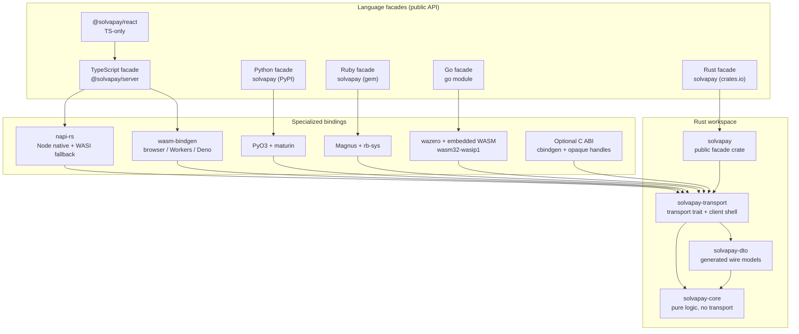

# SDK architecture (contributors)

This is the canonical **as-built** reference for the `solvapay-sdk` monorepo. It
describes the SDK as it exists today, after the Rust-core migration: one Rust
semantic core reused by every language surface, with thin language facades on top.

For _why_ it is built this way (decisions, rationale, per-step research), see
[`rust-core-sdk-redesign-v2.md`](./rust-core-sdk-redesign-v2.md). For _how far_
the migration got, see [`rust-migration-map.md`](./rust-migration-map.md). For
_how the code is generated_, see [`sdk-codegen.md`](./sdk-codegen.md).

## Two-layer model

The SDK is two layers:

1. **Language facades** — thin, idiomatic packages that own type conversion,
   env/config resolution, and host concerns (timers, caches, event loops).
2. **One Rust semantic core** — models, validation, request construction,
   response normalization, retry _schedules_, paywall decisions, webhook
   verification, and the shared MCP payload contracts. Written once, reused by
   every surface.

The governing rule is the **thin-facade rule** (redesign-v2 §1): every facade —
TypeScript included — is a type-conversion shim over the Rust core. Semantic
logic lives in Rust unless it appears on the [never-moves list](#what-stays-in-the-facades)
below. Divergence between surfaces is a build failure (cross-language
signature-parity suites), not a support ticket.

Two boundary rules the core must never break (redesign-v2 §4.2):

- **No env-var reads in core.** Env resolution stays in the facades; core
  receives explicit config. This is what makes browser-WASM capability
  separation verifiable.
- **No timers in core.** The retry engine computes _schedules_ (pure); the
  binding owns the actual sleep. Deduplication and cache intervals stay
  host-side entirely.

## Component diagram

Facades sit over specialized bindings, which sit over the Rust workspace
(reproduced from redesign-v2 §4.1):



## Repository layout

The monorepo holds both the TypeScript packages and the Rust workspace.

```text
solvapay-sdk/
├─ packages/            # TypeScript packages (published to npm)
│  ├─ core/             # shared types + Rust-core-backed helpers
│  ├─ server/           # server runtime SDK (paywall, client, webhooks)
│  ├─ react/            # provider, hooks, checkout UI (TS-only)
│  ├─ react-supabase/   # Supabase adapter for @solvapay/react
│  ├─ mcp/              # official MCP SDK adapter
│  ├─ mcp-core/         # framework-neutral MCP contracts
│  ├─ auth/             # auth adapters and request helpers
│  ├─ next/             # Next.js wrappers
│  ├─ cli/              # `solvapay` CLI (npx solvapay init)
│  ├─ create-solvapay/  # scaffolder for new MCP apps
│  ├─ init/             # shared init/env logic
│  ├─ demo-services/    # private
│  ├─ test-utils/       # private
│  └─ tsconfig/         # private
├─ rust/                # Rust workspace (semantic core + bindings + tools)
│  ├─ crates/
│  │  ├─ solvapay-core/       # pure logic; serde/hmac only; no HTTP, no tokio
│  │  ├─ solvapay-dto/        # generated wire models + SDK overlays
│  │  ├─ solvapay-transport/  # transport trait, reqwest/fetch impls, client shell
│  │  └─ solvapay/            # public crates.io facade crate
│  ├─ bindings/
│  │  ├─ node/          # napi-rs (Node native + WASI fallback)
│  │  ├─ wasm/          # wasm-bindgen (edge + browser profiles)
│  │  ├─ python/        # PyO3 + maturin
│  │  ├─ ruby/          # Magnus + rb-sys
│  │  ├─ go/            # wazero + embedded wasm32-wasip1 core
│  │  └─ c/             # optional cbindgen C ABI
│  └─ tools/
│     ├─ dto-gen/        # OpenAPI + manifest → IR → all surfaces
│     ├─ fixture-runner/ # replays Phase 0 golden fixtures against the core
│     ├─ live-contract/  # live wire-contract checks
│     └─ shadow-invoker/ # shadow-mode parity harness (Rust side)
├─ contract/            # OpenAPI snapshot, manifest, golden fixtures
├─ examples/            # per-language examples (go/python/ruby/rust/typescript)
├─ docs/
├─ pnpm-workspace.yaml
├─ turbo.json
└─ package.json
```

### Rust crate responsibilities

| Crate                | Responsibility                                                                                          | Dependency discipline                                                          |
| -------------------- | ------------------------------------------------------------------------------------------------------ | ----------------------------------------------------------------------------- |
| `solvapay-core`      | Validation, retry policy, webhook verify, helper decision cores, paywall, business/credit/seller logic, MCP payload builders, error model | `serde`, `hmac`/`sha2`, `subtle`. **No** `reqwest`, **no** `tokio`, **no** `wasm-bindgen` — this is what keeps browser WASM small |
| `solvapay-dto`       | Generated wire models + SDK overlays                                                                     | `serde` only; generated — never hand-edited                                    |
| `solvapay-transport` | `Transport` trait, `reqwest`/rustls (native) + Fetch (wasm32) impls, client shell, all 36 methods       | Depends on core + dto; async but runtime-agnostic                             |
| `solvapay`           | Public crates.io facade: idiomatic re-exports + `blocking` feature                                       | Depends on transport + core; ergonomics only, no new logic                    |

## What's implemented where

The core ask of this doc: a map from each behavior to its Rust source and the
TypeScript facade that delegates to it. All paths are verified on disk.

**Pure logic — `solvapay-core`:**

- **Webhook verify** → `rust/crates/solvapay-core/src/webhook.rs` (+ shared
  `hmac_util.rs`) ← `packages/server/src/{webhook-native,webhook-wasm}.ts`
- **Retry policy** (schedules, not sleeps) → `.../src/retry.rs`
- **Paywall** → `paywall_state.rs`, `paywall_gate.rs`, `paywall_decision.rs`,
  `paywall_payload.rs`
- **Helper decision cores** → `customer_sync.rs`, `payment.rs`, `checkout.rs`,
  `purchase.rs`, `renewal.rs`, `usage.rs`, `limits.rs`, `plans.rs`, `product.rs`,
  `route_error.rs`, `activation.rs`, `auth_resolution.rs`, `balance_poll.rs`
  (shared shape in `helper_error.rs`)
- **Core value helpers** → `business_details.rs`, `credit_display.rs`,
  `seller_identity.rs`
- **MCP payload contracts** → `src/mcp/` (`tool_names.rs`, `descriptors.rs`,
  `envelope.rs`, `paywall_tool_result.rs`)
- **Error model** → `error.rs` (`SdkError`) — see [error-handling.md](./error-handling.md)

**HTTP client — `solvapay-transport`:** the `Transport` trait plus the reqwest
(native) and Fetch (wasm32) implementations and the client shell that wires auth
headers, idempotency, and retry, with all 36 client methods →
`rust/crates/solvapay-transport/src/{transport,reqwest_transport,fetch_transport,shell,client}.rs`.

**TypeScript delegation glue:**

- Node → `packages/server/src/native.ts` (+ `native-decisions.ts`,
  `native-registry.ts`) over `rust/bindings/node/src/*` (napi-rs)
- Edge/browser → `packages/server/src/wasm.ts` over `rust/bindings/wasm`
  (wasm-bindgen)
- `@solvapay/core` is Rust-backed (its helpers delegate to the core via the
  same bindings)

## Language surfaces

Five first-party surfaces, plus an optional C ABI. All expose the same public
capabilities; only syntax differs (cross-surface parity is enforced in CI).

| Surface        | Binding toolchain                                          | Status                                                                        |
| -------------- | --------------------------------------------------------- | ---------------------------------------------------------------------------- |
| TypeScript     | napi-rs (Node native), wasm-bindgen (edge + browser)      | GA — the published `@solvapay/*` packages                                     |
| Python         | PyO3 + maturin (`abi3` wheels)                            | Built + tested in CI; publish is TestPyPI-gated (not GA)                      |
| Ruby           | Magnus + rb-sys (platform gems)                           | Built + tested in CI; publish gated (not GA)                                  |
| Go             | wazero + embedded `wasm32-wasip1` core (`//go:embed`)     | Built + tested in CI; subtree module release (not GA)                         |
| Rust           | `solvapay` crate (thin facade, no FFI) + `blocking` feature | Built + tested in CI; crates.io publish gated (not GA)                        |
| C ABI (opt.)   | cbindgen + opaque handles (`rust/bindings/c`)            | Scaffold only — hand-maintained `dispatch.rs` allowlist; no codegen emitter yet |

The TypeScript surface further splits by runtime:

- **Node** → napi-rs native package (with a napi-rs WASI fallback)
- **Edge / Workers / Deno** → the `edge` wasm-bindgen profile (`@solvapay/server-wasm`)
- **Browser** → the `browser` wasm-bindgen profile — a public-safe pure-logic
  subset only (no webhook / no secret-key symbols)

## Runtime strategy

`@solvapay/server` picks the right binding per runtime, so consumers keep one
import style:

- **Node** loads the napi-rs native addon; if no prebuild matches the platform,
  the napi-rs WASI fallback loads automatically.
- **Edge/browser** load the wasm-bindgen build via export conditions
  (`deno`/`workerd`/`worker`/`edge-light`/`browser` before generic
  `import`/`default`).

**Capability-separated builds** (redesign-v2 §7.1) keep secret-key operations out
of the browser: the `browser` profile compiles only the public-safe subset, and a
CI symbol audit (`rust/bindings/wasm/scripts/check-browser-symbols.mjs`)
allowlists exactly the public-safe exports. Webhook verification and the
transport client are `edge`-gated, so no secret-key `WasmClient` symbol can enter
the browser module. The structural gate is the Cargo feature graph plus the
export audit — not a runtime check.

**Runtime bindings:** `@solvapay/core` and `@solvapay/server` are Rust-only after
Steps 52/53 — Node uses `@solvapay/server-native` (napi), edge/browser uses
`@solvapay/server-wasm`. Missing bindings throw; there is no `SOLVAPAY_IMPL`
rollback flag. See [testing.md](./testing.md).

## How code generation works

The five surfaces are generated from two committed inputs — the OpenAPI snapshot
and the reviewed contract manifest — lowered to a canonical IR and rendered by
per-surface emitters:

```text
Backend OpenAPI ──► snapshot (committed) ──┐
                                           ├──► pnpm gen (dto-gen) ──► DTOs, facades,
SDK contract manifest (reviewed) ──────────┘        binding glue, parity suites, fixtures
```

`pnpm gen` regenerates Rust DTOs, TS overlays/marshalling, Node/WASM/Python/Ruby/
Go/Rust binding shims, and the signature-parity suites. Hand-editing generated
files fails CI (`@generated` header gate + `pnpm gen:check`). The **full runbook**
(scaffolding operations, binding reconciliation, gates, failure modes) lives in
[`sdk-codegen.md`](./sdk-codegen.md) — this doc does not duplicate it.

## What stays in the facades

Some surfaces are deliberately hand-written and never move to Rust (redesign-v2
§8 — the exhaustive list lives there):

- The entire `@solvapay/react` package (components, hooks, Stripe.js glue, i18n)
- Framework adapters (`http.ts`, `next.ts`, `mcp.ts`) and `fetch` handlers —
  thin shells that delegate to the Rust decision/client cores
- `createSolvaPay` factory ergonomics
- `createRequestDeduplicator` + limits-cache plumbing (host timers/maps)
- `@solvapay/auth`, `@solvapay/next`, `@solvapay/cli`, `create-solvapay`, `@solvapay/init`
- MCP SDK registration glue and the `@solvapay/mcp-core` transport parts (OAuth
  bridge, bearer, CSP, narration) — only the MCP _payload builders_ moved
- Per-language examples under `examples/<language>/`

## Design principles

- Semantic logic lives in Rust once; facades stay thin (thin-facade rule).
- Keep secrets in server code only; browser builds are capability-separated.
- No env reads or timers in the core; facades own host concerns.
- Prefer shared types from the core/`@solvapay/core` over duplicated interfaces.
- Generated surfaces are never hand-edited — change the manifest and rerun `pnpm gen`.

## Build and release model

- `turbo` orchestrates workspace tasks; TS packages build with `tsup`.
- `pnpm gen` produces the committed generated surfaces; committed WASM/glue
  artifacts mean TypeScript contributors do not need a Rust/wasm-bindgen
  toolchain for `pnpm build:packages`.
- Per-package versioning is driven by Changesets; branch/release flow is in
  [`CONTRIBUTING.md`](../../CONTRIBUTING.md) and `docs/publishing.mdx`.

## Where to read next

- [`sdk-codegen.md`](./sdk-codegen.md) — regenerating DTOs, facades, binding glue (`pnpm gen`)
- [`rust-core-sdk-redesign-v2.md`](./rust-core-sdk-redesign-v2.md) — deep spec, decisions, and rationale
- [`rust-migration-map.md`](./rust-migration-map.md) — per-step migration status
- [`testing.md`](./testing.md) — fixtures, dual-impl suites, parity, cargo gates
- [`error-handling.md`](./error-handling.md) — the `SdkError` model and stable codes
- [`performance.md`](./performance.md) — WASM budgets and measurement methodology
- [`CONTRIBUTING.md`](../../CONTRIBUTING.md) — setup and pull request workflow
- package-level `README.md` files for package-specific constraints
