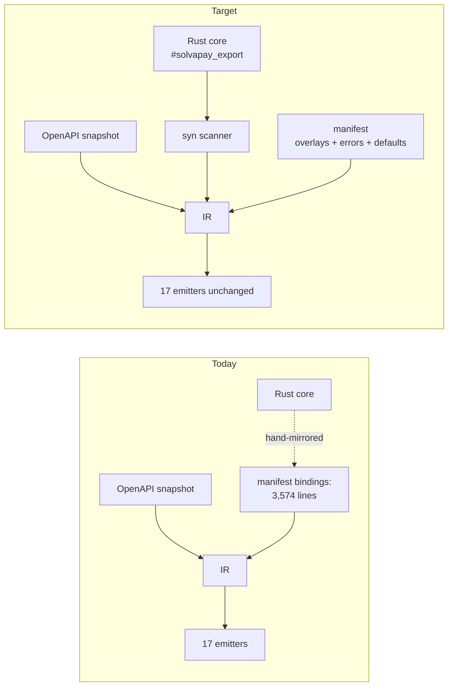

# Codegen AST derivation

How to collapse the SDK’s five hand-mirror layers into Rust-derived descriptors,
then generated conformance harnesses. This is the design and implementation
sequence; numbered migration steps stay in
[`rust-migration-map.md`](./rust-migration-map.md) (after step 55).

> **Status:** Phase 1 landed (C dispatch + fixture-runner registry emitters).
> Sequences **after** step 55. Steps 1–54 are Done; step 55 is in progress
> (55-a/b/c in-repo done; maintainer branch-protection apply remain).
> `parity:check` is green. Fixture-runner `parsed=550 executed=446 passed=446
> failed=0 skipped-unbound=104`.

Companion docs:

- As-built: [`architecture.md`](./architecture.md)
- Spec: [`rust-core-sdk-redesign-v2.md`](./rust-core-sdk-redesign-v2.md) §5.6 / §5.7
- Runbook: [`sdk-codegen.md`](./sdk-codegen.md)

## The problem

Today one public helper is described five times. Each copy can drift, and
coverage stops wherever someone stopped hand-writing.

| Axis | Where | Size |
| --- | --- | --- |
| Binding descriptors | `bindings:` in `contract/manifest/sdk-contract.yaml` (lines 2899–6473) | **3,574 of 6,595 lines (54%)** |
| Boundary types | `packages/core/src/*.ts` (`customer-sync.ts`, `paywall-decision.ts`, `product-readiness.ts`, `business-details-public.ts`, `renewal.ts`, `usage.ts`, `payment.ts`, `seller-identity.ts`, …) | ~300 lines of TS mirroring Rust structs/enums. **None carry `@generated`.** |
| Dispatch wrappers | `packages/server/src/native-decisions.ts` (454), `packages/core/src/native-helpers.ts` (365), `native-core.ts` (109), `native-dispatch.ts` (92) | ~1,020 lines |
| Fixture-runner registry | `tools/conformance/fixture-runner/src/registry.rs` (`@generated`) + hand-written residue in `bindings.rs` / `bindings/*.rs` | Generated 73-entry table + 41 wrap bodies; 32 verbatim/extra bodies stay hand-written |
| Per-language replay harnesses | See table below | **4,171 lines** |

The last two together are **4,926 lines of hand-written replay plumbing** for one
550-file corpus.

| Surface | Files | Lines |
| --- | --- | --- |
| TypeScript | `tools/conformance/lib/fixture-harness.ts` | 2,201 |
| Python | `sdks/python/tests/contract/*.py` (8 files) | 895 |
| Ruby | `sdks/ruby/test/{contract.rb,contract/*.rb}` (8 files) | 552 |
| Go | `sdks/go/fixture_conformance_test.go` | 277 |
| Rust facade | `sdks/rust/tests/fixture_conformance.rs` | 246 |

Two clearest symptoms:

- **Descriptor axis.** `verbatimBody` is Rust-inside-YAML, hand-indented, duplicated
  per toolchain. That is the escape hatch telling on the rest of `bindings:`.
- **Test axis.** Each harness decomposes the same way — fixture loader, dispatch
  table, comparison/normalization, stub backend, name-casing map, clock patch —
  which is exactly the shape an emitter family produces. Coverage stops wherever
  that table was not finished by hand.

### Sequencing constraint — wrappers need types first

`native-decisions.ts` returns types such as `CustomerRefKind`.
`IrBindingSymbol.return_shape` (`tools/codegen/dto-gen/src/ir.rs`) is always
`"value"`. No type information exists in the binding IR, so generating the
wrappers requires **boundary-type IR first**. Adding types to the YAML is the
wrong fix: it grows the manifest this work exists to delete.

## Target state

**Today**, adding a core helper means: write the Rust fn, add a `bindings:`
block (and often a `verbatimBody`), mirror TS types, update four dispatch
wrappers, register in `bindings.rs`, and patch every language’s dispatch table
that someone remembers to touch. Go’s non-client path and C never get the
fixture.

**After**, adding a core helper means: write the Rust fn with rustdoc, add
`#[solvapay_export]`, write fixtures, review the snapshot diff. Every surface’s
conformance suite extends automatically.

The 17 emitters stay. The input that feeds them moves from YAML to the core.

## Where descriptors come from

Three extraction options. The hybrid is the recommendation because of the
`solvapay-dto` build cycle, which is the non-obvious constraint.

**A — inert `#[solvapay_export]` + `syn` scanner in dto-gen.** The attribute is
a marker. dto-gen walks `solvapay-core` / `solvapay-transport` with `syn` and
fills `Ir.binding_symbols`. No build cycle, incremental, but syntactic only:
blind to type aliases, generics, and re-exports.

**B — trait-resolved descriptors.** Each export implements a `Boundary` trait;
a dump binary prints `<T as Boundary>::TY`. Compiler-resolved types, and a
boundary violation is a compile error. But `solvapay-transport` depends on the
generated `solvapay-dto`, so a descriptor binary that links transport forces a
two-pass `pnpm gen`.

**Hybrid (recommended) — `syn` for extraction, plus generated type asserts.**
Emitters write `const _: () = assert_boundary::<T>();` into each generated shim.
Generated code already must compile in CI, so this buys B’s type-level
enforcement on A’s build graph. dto-gen stays a one-pass scanner.

## Derivable vs never derivable

Golden-fixture **outputs** are derivable later (see [Fixture derivation](#future-work-fixture-derivation-post-phase-5));
they are not listed here as never-derivable. Case selection and inputs stay
human.

| `IrBindingSymbol` / adjacent field | Source after extraction | Notes |
| --- | --- | --- |
| `id`, `rust_fn_name`, `core`, `core_call` | Rust path + `#[solvapay_export]` | Scanner |
| `names` (`IrLangNames`) | Existing casing rules | Identity `nameOverrides` for `SCREAMING_SNAKE` constants are a casing rule, not data. `reservedWords` is empty for all five languages. |
| `catalog` | Attribute or catalog reconciliation | Keep the existing 1:1 gate |
| `args[].name`, `ty`, `required`, `extract` | Fn signature + `syn` | `extract` already defaults from `(type, required)` |
| `args[].doc` / `IrDocModel` params | rustdoc `/// # Arguments` + `` * `name` - desc `` | Already used in ~120 places across 27 `solvapay-core` files (e.g. `customer_sync.rs`). Closes the “per-param docs are YAML-only” gap. |
| `doc` / returns | rustdoc + `/// # Returns` | Same convention |
| `sync`, `envelope`, `artifact`, `emit_order`, `section` | Attribute args + stable sort | Defaults from fn kind; deviations are residue |
| `call` (`wrap` vs `verbatim`) | Default `wrap` from signature | Verbatim is the escape hatch |
| `return_shape` | Always `"value"` today | Typed returns wait on Phase 2 IR |
| `split_path_refs` | Attribute or catalog | Keep reconciliation |
| `dto_type` | Signature / catalog | |
| `host_injected` | Attribute | 2 uses today |
| `typed_as` / `typed_style` | Attribute | 8 `typedAs` uses |
| `client_call_args` | Attribute | 9 uses |
| `verbatim_body` / `verbatim_body_wasm` | Attribute / stay in overlay | **27 + 1** uses — the residue to shrink, not grow |

**Never derivable** (stay human, in the manifest or in fixtures):

- Fixture **case selection and inputs** (the 299s / 300s / 301s webhook triple is judgment)
- OpenAPI wire shapes (`overlays:` stays OpenAPI-driven)
- Prose quality beyond rustdoc / OpenAPI fallback
- Semver intent (what is a breaking change)

Escape-hatch usage is small enough to enumerate in review: 27 `verbatimBody` +
1 `verbatimBodyWasm`, 8 `typedAs`, 2 `hostInjected`, 9 `clientCallArgs`.

## Five implementation phases

Phases 1–4 collapse the descriptor axes. Phase 5 collapses the
conformance-harness axis. Each phase is independently shippable. Numbered
migration-map steps after 55 should point here rather than duplicate this
sequence.

Every new emitter follows the **chrome-snapshot** pattern already used by
`emit_bindings_rs` / `emit_bindings_ts`: committed
`tools/codegen/dto-gen/assets/*.snapshot.json` refreshed by
`tools/codegen/dto-gen/scripts/extract-*.mjs`. The emitter owns tokens, order, and
section comments; rustfmt (or the language formatter) owns whitespace. Register
the emitter next to the existing `emit_*` calls in
`tools/codegen/dto-gen/src/lib.rs` and add outputs to `GENERATED_PATHS` in
`tools/codegen/gen.ts`.

### Phase 1 — free wins, existing IR, no AST

Two emitters, no scanner.

1. **`Toolchain::C` column** on the `Toolchain` enum in `emit_bindings_rs.rs`,
   replacing the hand-written **one-op** (`getMerchant`) scaffold in
   `sdks/capi/src/dispatch.rs` with a generated 36-op table. Closes the
   deferred half of step 54. Prerequisite for C full parity in Phase 5: fixture
   replay needs all 36 ops reachable; `ctest/smoke.c` still exercises one op.
2. **Fixture-runner registry emitter.** `IrBindingSymbol` already carries
   `core`, `core_call`, `args`, and `call.serialize` — everything a wrap invoke
   fn needs. Generating `tools/conformance/fixture-runner/src/registry.rs` emits the
   registration table plus the 41 mechanically-derivable wrap bodies. 32
   verbatim / non-IR bodies stay hand-written under `bindings.rs` and
   `bindings/*.rs`. Build this as the template for the Phase 5 emitter family,
   not as a one-off.

**Done when:** C dispatch is generated for the full client surface; fixture-runner
`registry.rs` is `@generated` and drift-gated; `pnpm gen:check` is green; C smoke
still passes; fixture-runner still reports `executed=446 skipped-unbound=104`
(client unbound is unchanged — see caveat 2 below). **Landed:** `Toolchain::C`
via `--c-bindings-out`; fixture-runner via `--fixture-runner-out`; chrome
snapshots `assets/c-emit.snapshot.json` and
`assets/fixture-runner-emit.snapshot.json`.

### Phase 2 — boundary-type IR

First AST increment. Types only, no functions.

Extract Rust structs/enums (honoring `serde(rename_all)` and
`skip_serializing_if`) into a new IR type map. Smallest useful slice of `syn`
work. This is what unblocks Phase 3: wrappers cannot be typed from
`return_shape: "value"`.

**Done when:** IR carries a type map for the exported core structs/enums;
serde rename/skip round-trips in dto-gen tests; no TS still generated.

### Phase 3 — generate the TS layer

Emit the ~300 lines of boundary types and the ~1,020 lines of dispatch wrappers
from Phase 2’s IR. `native.ts` (408 lines, generated) already sits next to
`native-decisions.ts` (454, hand-written) as proof the wrapper shape is
mechanical.

**Done when:** those TS files carry `@generated`; byte-identical (or
intentionally slimmed) below the header vs the hand-written sources they
replace; both-flag unit suites unchanged.

### Phase 4 — the full descriptor extractor

`#[solvapay_export]` over functions. Retire `bindings:` and all 28 verbatim
blocks from the YAML. Attribute arguments cover the genuine residue:
sync-matrix deviations, Ruby receiver, error set, `hostInjected`.

Hard rule: **explicit per-item attribute, never derive from `pub` visibility.**
The attribute is a better forcing function than YAML because it sits next to
the implementation under review.

`contract/manifest/binding-symbols.snapshot.json` (~4,979 lines, drift-gated by
`pnpm gen:check` and `.husky/pre-commit`) is **retained unchanged**. It remains
the reviewed dump of what the IR believes the boundary is.

**Done when:** `bindings:` is gone from `sdk-contract.yaml`; every current
symbol is produced from `#[solvapay_export]`; snapshot byte-identical;
`pnpm manifest:check` + `pnpm gen:check` green; 17 emitters consume the same IR
shape they do today.

### Phase 5 — generated facade conformance harnesses

Emit the per-language replay harness from the same IR. Retire the 4,171
hand-written lines in the harness table. Full-corpus coverage becomes the
default for every surface.

The corpus is 550 fixtures. What each surface actually replays today:

| Surface | Fixtures replayed | Signature-parity suite | Notable gap |
| --- | --- | --- | --- |
| Python | 550 (full) | `emit_parity_suite_py.rs` — presence only, no arity | — |
| Ruby | 550 (full) | `emit_parity_suite_rb.rs` — presence + exact keyword arity | Full suite runs **only** on the `x86_64-linux` `full: true` CI leg; macOS/aarch64 runs `smoke_test.rb` alone |
| TypeScript | 550 via the JS harness | `emit_parity_suite_ts.rs` — type-level only | napi/WASM binaries are not fixture-replayed for client ops in CI (webhook-only smoke) |
| Go | **104** (`client/` only — `fixture_conformance_test.go` skips `suite != "client"`) | `emit_parity_suite_go.rs` — reflect arity | **~446 fixtures never replayed**: paywall, business-details, retry, helper-\*, mcp |
| Rust facade | 104 (`client/`) | `emit_parity_suite_rs.rs` — compile-time refs | Non-client suites go through `fixture-runner`, not the facade |
| C ABI | **0** | **none** | `ctest/smoke.c` covers exactly one op (`getMerchant`); 35 client ops and every helper are untested |

Two conclusions. First, “add native-language facade tests” is mostly
**gap-closing**, not greenfield — Python and Ruby already do the thing. Second,
coverage correlates with harness effort: Python and Ruby are complete because
someone wrote 895 and 552 lines; Go stopped at the client subset and C never
started. Generating the harness makes full coverage the cheap default.

The six components each harness hand-rolls map onto emitter output:

| Component | Derivation |
| --- | --- |
| Dispatch table | `IrBindingSymbol` (`core`, `args`, sync/async, per-language name) — same data Phase 1’s registry emitter consumes |
| Name casing | `names.py` / `names.rb` / `dispatch.ToPascal` are the manifest’s casing rules restated per language |
| Fixture loader, comparison/normalization, stub backend, clock patch | Structurally identical across languages; one template per surface |

Order so each step is independently shippable:

1. **Python first.** Generate the harness for a surface that already has full
   coverage, and require all 550 fixtures to stay green. Validates the emitter
   against a known-good baseline before it is used to *add* coverage.
2. **Ruby.** Regenerate, and fix the CI-matrix gap so the full suite runs on
   every platform leg, not only `x86_64-linux`.
3. **Go.** Drop the `suite != "client"` skip. This alone takes Go from 104 to
   550 fixtures.
4. **C.** Pair with a new `emit_parity_suite_c.rs` (the only surface with no
   parity emitter). Depends on Phase 1’s `Toolchain::C` column.
5. **Normalize parity assertions.** Today they differ per language (TS
   type-level, Python presence-only, Ruby exact keyword arity, Go reflect
   arity). Presence-only cannot catch a wrong argument order. Pick the strongest
   assertion each language can express and generate to that.

**TypeScript is last and may stay partly hand-written.** `fixture-harness.ts` is
2,201 lines because it carries genuine host concerns the other surfaces do not
have: dual node/edge `verifyWebhook` bindings, `process.env` patching for
`resolveAuthenticatedUser`, the `WasmClient` override. Split the generatable
dispatch table out from the host-specific remainder. Do not imply wholesale
generation.

**Done when:** Python/Ruby/Go replay 550 fixtures from generated harnesses; C
replays the full reachable surface (client + helpers once dispatch exists);
parity suites assert the strongest check each language can express; adding a
core helper extends every surface’s conformance suite without a hand-edit.
Migration-map steps after 55 should cite these bullets.

Payoff as a property, not a line count: **adding a core helper extends every
surface’s conformance suite automatically.** Today it extends Python and Ruby
only if someone edits two dispatch tables, and never reaches Go’s non-client
path or C at all.

## Future work: fixture derivation (post-Phase 5)

A fixture is an **oracle**. Deriving `expect.*` from the implementation turns
specification tests into characterization tests, so full derivation is
impossible. Of a fixture’s three parts, only the expected output is derivable.
Case selection and inputs stay human.

Phase 4 is the nominal prerequisite (the extractor). **Phase 5 is the binding
one.** Generating a fixture is only safe when every surface replays the full
corpus — otherwise a regenerated fixture that drifts is caught on Python and
Ruby but silently missed on Go’s non-client path and on C entirely. Do not
start this track before Phase 5.

### Recommended mechanism: `solvapay_fixture!`

A declarative macro that emits JSON at **test runtime**, not via `syn`.

The developer writes one block naming the suite and case, the input expression,
and the expected outcome. It expands to an ordinary `#[test]` (`cargo test`
unchanged). Under `SOLVAPAY_FIXTURE_EMIT=1` the same expansion serializes its
already-materialized serde values to `contract/fixtures/<suite>/<case>.json` as
a `@generated` artifact gated by `pnpm gen:check`.

Runtime emission is required because fixture inputs are **computed**. The
`webhook.rs` unit tests already mirror the 18 webhook fixtures nearly
case-for-case (`accept_first_t_and_v1_parts` ↔ `accept-extra-comma-parts.json`,
…), which is the duplicate authorship this section removes. But
`webhook.rs` builds signatures with `format!("t={NOW},v1={hex}")` after
`compute_hmac_hex`. A `syn` scanner sees the `format!` tokens, not
`t=1782864000,v1=04834cba…`. Client fixtures have the same property via
`rngSeed: 42`-derived idempotency keys. The oracle stays human-authored, in
Rust rather than JSON: no circularity, no duplicate authorship. The JSON corpus
survives as the language-neutral interchange every other runner consumes.

### Rejected / orthogonal

- **Record mode (`fixture-runner --record`) — rejected.** Writing `expect.*` by
  executing the implementation against a human-written input can only ever
  confirm that the core does what the core does.
- **proptest cross-binding replay — orthogonal, not an alternative.** Generated
  inputs plus recorded outputs replayed across bindings test *marshalling*
  parity (unicode, big numbers, absent-vs-null), never semantics. Can land
  independently.

### Two caveats

1. **The fixtures are now the only executable record of the behavior they
   captured.** Steps 52 and 53 deleted every superseded TS semantic
   implementation (`verifyWebhookTs`, `timingSafeEqual`, `calculateDelayTs`,
   the `paywall-*-ts` modules, `tsFallback`, `SOLVAPAY_IMPL`, and all client
   `fetch` bodies). `tools/conformance/lib/superseded-server-ts-check.ts` currently
   reports `OK`. There is no TypeScript oracle left:

   - `packages/server/src/edge.ts` calls `verifyWebhookWasm`, which loads the
     binding, injects `Math.floor(Date.now()/1000)`, calls the **sync** Rust
     `verifyWebhook` export, and `JSON.parse`s the result. Zero `crypto.subtle`
     / `createHmac` / `timingSafeEqual` in any `packages/**/src/**` file.
   - The client wire suite also delegates: `tools/conformance/lib/fixture-harness.ts`
     loads the real `@solvapay/server-wasm` `WasmClient` and patches only
     `globalThis.fetch`. URL, method, headers, and body are built by Rust
     `FetchTransport` + `ClientShell`.

   Rust is already the sole reference — the arrow flipped at step 53. This is
   not a pending-migration blocker. Regenerating a fixture is the one operation
   that can silently discard captured behavior, which is why byte-identical
   reproduction is a **gate**, not a sanity check.

2. **`fixture-runner` cannot execute the client suite.** It registers 73
   `solvapay-core` pure helpers and **zero client methods**, so all 104
   `contract/fixtures/client/` fixtures return `skipped_unbound`. Rust still
   replays them — via wiremock suites (`client_group_{a,b,c}_fixtures.rs`,
   `solvapay/tests/fixture_conformance.rs`) — just not through the runner.
   Emitting a client wire fixture from a Rust test means emitting from those
   wiremock suites. Closing the runner gap needs a stub transport in the runner
   itself; Phase 1’s registry emitter and Phase 5’s generated stub backend both
   bear on that.

Migration is a per-suite ratchet, not a big bang: annotate the Rust tests for
one suite, emit, and require the output to reproduce the committed fixtures
byte-identically before that suite’s JSON is considered derived.
`webhook-verification` (18 fixtures, near 1:1 with existing `webhook.rs` tests)
is the natural first suite. Where the emitted JSON does not match, the answer
is either a missing Rust test case or a redundant fixture — both findings worth
having.

## The review gate

The attribute is a *better* forcing function than YAML: it lives next to the
fn, in the same PR as the implementation. `binding-symbols.snapshot.json` stays
the drift-gated dump reviewers already know how to read.

Hard rule: **explicit per-item `#[solvapay_export]`, never derive from `pub`
visibility.** Accidental exports are worse than a missed YAML row because they
ship on five language surfaces.

## Validation

The technique that made step 39G-b trustworthy: regenerate, then require
**byte-identical** output below the `@generated` header against the committed
(or previously hand-written) file. Header-only diffs are the expected first
green. Behavioral proof is the existing both-flag / fixture / unit suites,
unchanged.

Use the same ratchet for Phase 5 harnesses (Python 550 green before expanding
Go/C) and for post-Phase-5 fixture emission (webhook suite first).

## Risks and open questions

- **`syn` blindness.** Aliases, generics, and re-exports are invisible to a
  scanner. The generated `assert_boundary::<T>()` is the backstop; a type the
  scanner mis-read fails to compile rather than silently shipping.
- **Verbatim residue.** 28 verbatim bodies must either become structured `wrap`
  calls or stay as explicit attribute/overlay exceptions. Do not smuggle them
  back into YAML.
- **Client unbound in the runner.** Phase 1 generating `registry.rs` does not
  by itself register client methods. Treat stub-transport-in-the-runner as a
  follow-on, not a Phase 1 scope creep.
- **Parity:check is green.** Locked baseline before Phase 1: fixture-runner
  `parsed=550 executed=446 passed=446 failed=0 skipped-unbound=104`. Do not
  start later phases until that summary (or its documented successor) is
  re-locked, or the regen ratchet will encode extras.
- **Ruby CI matrix.** Full-suite-on-every-leg may be slow; measure before
  requiring it on every PR, but the generated harness must *be able* to run
  everywhere.

## Out of scope

- Golden-fixture **judgment** (case selection, inputs) stays hand-written.
  Output derivation is future work after Phase 5; none of it lands in
  Phases 1–5.
- `overlays:` stays OpenAPI-driven.
- The MCP-authoring track (MA-\*) is unrelated.
- This work sequences **after** step 55. Byte-identical-regen validation
  requires a locked-green baseline.
- Full generation of `fixture-harness.ts` — host-specific half stays
  hand-written (Phase 5).
- Opt-in live/shadow workflows (`shadow-{python,ruby,go}.yml`, `live_dev.rs`,
  `live_contract_test.rb`) are not the generated conformance surface. Phase 5
  targets the offline golden gate only.
