# Rust Core SDK Redesign — v2 draft

> Alternative draft of [`rust-core-sdk-redesign.md`](./rust-core-sdk-redesign.md), written for side-by-side comparison. Same decisions, substantially more implementation detail: behavioral inventories mined from the current source, code-level contract sketches, per-step scope and gotchas for all 55 steps, and dated research notes against upstream toolchains.

Implementation-oriented architecture decision document for migrating SolvaPay's shared SDK behavior into a Rust semantic core while preserving the existing TypeScript/React surface and adding idiomatic Python, Ruby, Go, and Rust packages.

**Status:** living document. Every migration step starts with online research against current upstream sources; findings that confirm, sharpen, or contradict a decision are written back here in the same session. Dated research notes live in §15.

**Related docs:**

- Current package layout and runtime strategy: [`architecture.md`](./architecture.md)
- Public TypeScript surface: [`packages/server/src/index.ts`](../../packages/server/src/index.ts), [`packages/server/src/client.ts`](../../packages/server/src/client.ts), [`packages/react/src/index.tsx`](../../packages/react/src/index.tsx)
- OpenAPI type generation today: [`packages/server/scripts/generate-types.ts`](../../packages/server/scripts/generate-types.ts)

---

## 1. Goals

1. **One semantic core.** Models, validation, request construction, response normalization, retries, paywall decisions, webhook verification, and shared MCP contracts live in Rust once and are reused by every language binding. Divergence between surfaces becomes a build failure, not a support ticket. The corollary is the **thin-facade rule**: every language facade — TypeScript included — is a type-conversion shim over the Rust core. Facades perform type conversion, env/config resolution, and host concerns (timers, caches, event loops) only; no semantic logic lives language-side outside the §8 exclusion list. This applies uniformly to TypeScript, Python, Ruby, and Go.
2. **Cross-surface API parity (non-negotiable).** TypeScript, Python, Ruby, Go, and Rust expose the same public capabilities, used in more or less the same way. Only surface syntax differs. §2 defines the catalog, §2.8 the homogeneous signature-parity tests, §5.6 the deterministic signature-generation pipeline, and §10.3 the CI enforcement.
3. **Preserve the TS/React product surface.** Existing npm package names, React imports, and framework adapters stay stable throughout migration. The binding under the facade is invisible to `@solvapay/react`.
4. **Specialized bindings, not one raw C ABI for everything.** First-party wrappers use idiomatic toolchains (`napi-rs`, `wasm-bindgen`, PyO3, Magnus, wazero). Whatever the mechanism, the wrapper stays a shim per the thin-facade rule in principle 1 — the binding layer converts types and owns host plumbing, never decisions. The first-party Rust surface is a thin crates.io facade over the workspace (no FFI). A narrow versioned C ABI remains an optional portability layer for third parties (§5.5, §9 step 54).
5. **Session-sized translation.** Work lands as 55 ordered steps (Phases 0–10), each one PR with a verifiable "done when" check a fresh agent can run without prior context.

### Non-goals

- Rewriting `@solvapay/react`, framework adapters, or CLI tooling in Rust (§8).
- Changing any wire contract with the backend. The `/v1/sdk/*` API is an input to this design, not a subject of it.
- Performance as a primary motivation. The workload is I/O-bound; the motivation is *semantic consolidation*. Performance claims must cite the budgets in §7.8.
- Framework adapters for Go or Rust (no Gin/Echo/Chi middleware packages, no Axum/Actix adapters in the 55 steps).

---

## 2. Cross-surface API parity

This is a primary success criterion, not a nice-to-have. A developer who knows the SDK in one language should recognize the same operations, arguments, defaults, errors, and results in another.

### 2.1 Single canonical public-API catalog

The SDK contract manifest (Phase 0, step 2) is the one source of truth for what "public" means. It enumerates every public entry point of the current SDK and maps it to an idiomatic name per language. No wrapper may add, omit, or silently rename a public entry point outside the catalog.

### 2.2 Portable surface — 1:1 parity required

All five surfaces must expose, with equivalent semantics:

| Category | Current TypeScript anchors |
| --- | --- |
| Client factory | `createSolvaPayClient` ([`client.ts`](../../packages/server/src/client.ts)) |
| Client methods | Every `SolvaPayClient` method (full catalog in §2.3) |
| Top-level functions | `verifyWebhook`, `withRetry` |
| Paywall helpers | `buildPaywallGate`, `buildGateMessage`, `buildNudgeMessage`, `classifyPaywallState`, `paywallErrorToClientPayload` |
| Errors | `SolvaPayError`, `PaywallError` |
| Core helpers | `@solvapay/core` business-details, credit-display, seller-identity |
| High-level facade | `createSolvaPay(...)` with `payable` / `protect` gating (§2.4) |

### 2.3 `SolvaPayClient` method catalog

The interface in [`types/client.ts`](../../packages/server/src/types/client.ts) currently declares 36 methods. Grouped by domain, with the wire route each hits:

| Domain | Method | Route |
| --- | --- | --- |
| Limits & usage | `checkLimits` | `POST /v1/sdk/limits` |
| | `trackUsage` | `POST /v1/sdk/usages` |
| | `trackUsageBulk` | `POST /v1/sdk/usages/bulk` |
| Customers | `createCustomer` | `POST /v1/sdk/customers` |
| | `updateCustomer` | `PATCH /v1/sdk/customers/{ref}` |
| | `getCustomer` | `GET /v1/sdk/customers/{ref}` or `?externalRef=` / `?email=` |
| | `assignCredits` | `POST /v1/sdk/customers/{ref}/credits` |
| | `getCustomerBalance` | `GET /v1/sdk/customers/{ref}/balance` |
| | `getUserInfo` | `POST /v1/sdk/user-info` |
| Merchant & config | `getMerchant` | `GET /v1/sdk/merchant` |
| | `getPlatformConfig` | `GET /v1/sdk/platform-config` |
| Products | `getProduct`, `listProducts`, `createProduct`, `updateProduct`, `deleteProduct`, `cloneProduct` | `/v1/sdk/products[/{ref}]` |
| | `bootstrapMcpProduct` | `POST /v1/sdk/products/mcp/bootstrap` |
| | `configureMcpPlans` | `PUT /v1/sdk/products/{ref}/mcp/plans` |
| Plans | `listPlans`, `createPlan`, `updatePlan`, `deletePlan` | `/v1/sdk/products/{ref}/plans[/{planRef}]` |
| Payments | `createPaymentIntent` | `POST /v1/sdk/payment-intents` |
| | `createTopupPaymentIntent` | `POST /v1/sdk/payment-intents` (purpose `credit_topup`) |
| | `processPaymentIntent` | `POST /v1/sdk/payment-intents/{id}/process` |
| | `attachBusinessDetails` | `POST /v1/sdk/payment-intents/{id}/business-details` |
| Purchases | `cancelPurchase` | `POST /v1/sdk/purchases/{ref}/cancel` |
| | `reactivatePurchase` | `POST /v1/sdk/purchases/{ref}/reactivate` |
| Sessions & activation | `createCheckoutSession` | `POST /v1/sdk/checkout-sessions` |
| | `createCustomerSession` | `POST /v1/sdk/customers/customer-sessions` |
| | `activatePlan` | `POST /v1/sdk/activate` |
| Payment method & auto-recharge | `getPaymentMethod` | `GET /v1/sdk/payment-method?customerRef=` |
| | `getAutoRecharge`, `saveAutoRecharge`, `disableAutoRecharge` | `GET`/`PUT`/`DELETE /v1/sdk/auto-recharge` |

**Behavioral quirks that are part of the contract** (the Rust client must reproduce these exactly; each becomes a golden fixture in Phase 0 step 7):

- `getCustomer` by `externalRef`/`email` accepts three backend response shapes — a direct customer object, a bare array, and `{ customers: [...] }` / `{ customer: {...} }` wrappers — and normalizes to `CustomerResponseMapped`, throwing when nothing matches.
- `createCustomer` / `updateCustomer` map `result.reference || result.customerRef` into `{ customerRef }`.
- `listProducts` and `listPlans` handle both bare-array and wrapped (`{ products }` / `{ plans }`) responses and unwrap a nested `data` field. For `listPlans` the merge order is `{ ...data, ...plan }` with an explicit `price` precedence (`plan.price ?? data.price`) and the `data` key deleted afterwards.
- `getProduct` merges `{ ...result.data, ...result }`.
- `cancelPurchase` / `reactivatePurchase` extract a nested `{ purchase: {...} }` when present, fall back to a top-level object with `reference`, validate JSON parseability, and map 404 → "Purchase not found", 400 → cannot-cancel/cannot-reactivate messages.
- `deleteProduct` / `deletePlan` treat 404 as success (idempotent deletes).
- `createPaymentIntent` auto-generates an idempotency key of the form `payment-{planRef}-{epochMs}-{random9}` when the caller omits one; `createTopupPaymentIntent` uses `topup-{epochMs}-{random9}`. `assignCredits` forwards a caller-provided `Idempotency-Key` header.
- Error path everywhere: non-OK → read text body → throw `SolvaPayError` with a per-method message prefix (e.g. `"Check limits failed (429): ..."`) and `status` set. These message prefixes are load-bearing (tests and integrator code match on them) and go into the contract manifest verbatim.
- Debug logging is gated on `SOLVAPAY_DEBUG=true`; the Rust core exposes an equivalent tracing hook per binding rather than reading env vars in core.

### 2.4 High-level ergonomic facade — idiomatic equivalent required

`createSolvaPay(...)` in [`factory.ts`](../../packages/server/src/factory.ts) and its `payable` / `protect` gating ergonomics must have an idiomatic counterpart in Python, Ruby, Go, and Rust, driven by the same shared paywall decision core so gate/allow/paywall outcomes and copy match byte-for-byte across languages.

What the facade owns today (stays language-side; decisions move to Rust):

- `CreateSolvaPayConfig`: `apiKey` (default `SOLVAPAY_SECRET_KEY` env), `apiClient` injection for tests/stub mode, `apiBaseUrl`, `limitsCacheTTL` (default 10 000 ms).
- `payable({ product })` returning adapters: `http()` (Express/Fastify), `next()` (App Router), `mcp()`, `function()`, and the decision-shaped `gate()` returning `PayablePaywallResult | PayableAllowResult` with bound `trackSuccess` / `trackFail` recorders and optional Workers `ctx.waitUntil` routing.
- `SolvaPayPaywall` internals: shared customer-lookup deduplicator (60 s TTL, errors not cached), 10 s limits cache with optimistic decrement, customer-ref mapping.

Idiomatic counterparts (sketch level — exact shapes fixed in the contract manifest, step 2):

```python
# Python — decorator + explicit gate
sp = create_solvapay(api_key=os.environ["SOLVAPAY_SECRET_KEY"])

@sp.payable(product="prd_myapi")
async def create_task(args): ...

result = await sp.gate(customer_ref, product="prd_myapi")
if result.kind == "paywall":
    return JSONResponse(result.content, status_code=402)
result.track_success(duration=elapsed_ms)
```

```ruby
# Ruby — block/wrapper method, sync-first
sp = SolvaPay.create(api_key: ENV.fetch("SOLVAPAY_SECRET_KEY"))

sp.payable(product: "prd_myapi").protect do |args|
  create_task(args)
end

result = sp.gate(customer_ref, product: "prd_myapi")
return render_402(result.content) if result.paywall?
result.track_success(duration: elapsed_ms)
```

```go
// Go — middleware-style wrapper + explicit Gate; sync-first, ctx-first
sp := solvapay.New(solvapay.Config{APIKey: os.Getenv("SOLVAPAY_SECRET_KEY")})

handler := sp.Payable(solvapay.PayableOpts{Product: "prd_myapi"}).Wrap(func(ctx context.Context, args Args) (Result, error) {
    return createTask(ctx, args)
})

result, err := sp.Gate(ctx, customerRef, solvapay.GateOpts{Product: "prd_myapi"})
if err != nil { /* SdkError → solvapay.Error via errors.As */ }
if result.Paywall() {
    return render402(result.Content)
}
result.TrackSuccess(solvapay.TrackOpts{Duration: elapsedMs})
```

```rust
// Rust — async-first facade crate; optional `blocking` feature
let sp = solvapay::Client::new(solvapay::Config {
    api_key: std::env::var("SOLVAPAY_SECRET_KEY")?,
    ..Default::default()
});

match sp.gate(customer_ref, solvapay::GateOpts { product: "prd_myapi" }).await? {
    solvapay::GateOutcome::Paywall(content) => return render_402(content),
    solvapay::GateOutcome::Allow(allow) => allow.track_success(solvapay::TrackOpts { duration: elapsed_ms }).await?,
}
```

All five call the same Rust decision core (`classify → build gate → decide`), so gate copy and `PaywallStructuredContent` are byte-identical to the TS output. Only the framework wiring (decorator vs block vs middleware vs enum match) is per-language.

### 2.5 Explicit TypeScript-only exception

Framework glue does **not** need a Python/Ruby/Go/Rust equivalent:

- `@solvapay/react`, `@solvapay/next`, `@solvapay/react-supabase`
- Framework adapters in [`packages/server/src/adapters`](../../packages/server/src/adapters) (`http.ts`, `next.ts`, `mcp.ts`)
- Fetch route handlers in [`packages/server/src/fetch`](../../packages/server/src/fetch)
- MCP SDK registration glue ([`register-virtual-tools-mcp.ts`](../../packages/server/src/register-virtual-tools-mcp.ts)) and `createVirtualTools`
- `@solvapay/auth`, `@solvapay/cli`, `create-solvapay`, `@solvapay/init`

Python, Ruby, Go, and Rust still get the underlying decision cores those adapters call into (paywall gate, virtual-tool payload builders), just not the JS framework wiring. A Python FastAPI, Ruby Rack, Go middleware, or Rust Axum adapter is a possible *future* package but is out of scope for the 55 steps. Go and Rust get decision cores and the high-level facade (`Payable`/`gate`); they do **not** get first-party framework adapters in this plan.

Per-language **MCP-authoring adapters** — the thin `registerPayable(...)` / `ctx.respond(...)` ergonomic over each language's *own* MCP SDK that `@solvapay/mcp` provides today — fall in the same category. They are idiomatic, hand-written framework glue, **not** core, and are **not** produced by the §5.6/§5.7 signature/binding-glue generators. Like the framework adapters above they are out of scope for steps 1–55, but — unlike an accidental omission — they are a **named future track** (see §9, "MCP-authoring adapters"). The distinction is deliberate: steps 1–55 deliver *core-surface* parity (§2); turnkey paid-MCP *authoring* parity in every language is the additive commitment carried by that track (gate in §13).

### 2.6 Consistency rules

| Rule | Requirement |
| --- | --- |
| Operations | Same set and semantics — no wrapper-only methods, no omissions |
| Names | Adapted only to language convention: `checkLimits` (TS) / `check_limits` (Py, Rb, Rust) / `CheckLimits` (Go, exported PascalCase) |
| Arguments | Same shapes, same required/optional split; keyword args in Python/Ruby mirror the TS options object; Go uses option structs; Rust uses typed option structs |
| Defaults | Same retry policy (2 retries / 500 ms / fixed), same idempotency-key formats, same 300 s webhook tolerance, same 10 s limits-cache TTL |
| Errors | Same taxonomy, same stable `code` values, same message prefixes (§6.4) |
| Results | Same shapes after normalization; discriminated unions map to tagged enums / sealed hierarchies / Go structs with kind fields |
| Sync/async | Per event-loop-ownership rules (§7.5): TS async-only; Python async + blocking sync; Ruby sync-first; Go sync-first with `ctx context.Context` as first parameter; Rust async-first with optional `blocking` feature |

### 2.7 Enforced, not aspirational

A per-language parity/coverage check fails CI when any surface is missing a catalogued public entry point or diverges in signature/semantics. Shared golden fixtures run against all five surfaces. See Phase 0 (manifest + fixtures), steps 18/41/44/47/50 (parity gates), and §10.3 (CI gates).

### 2.8 Homogeneous signature-parity tests (all surfaces)

Every surface (TypeScript, Python, Ruby, Go, Rust) must carry the **same class of tests** for public function signatures — not merely overlapping golden fixtures. The signature-generation pipeline (§5.6) emits one suite per language from the canonical IR that asserts, for each catalogued entry point:

| Assertion | What it locks |
| --- | --- |
| Presence | Symbol / method exists under the idiomatic name |
| Arity & parameter names | Required vs optional args match the catalog (TS options object ↔ Python/Ruby kwargs ↔ Go/Rust option structs; Go `ctx` is first and catalogued) |
| Default values | Documented defaults match across languages |
| Return / throw shape | Success type and `SdkError` → native error mapping agree on `kind` / `code` / message template |
| Sync·async availability | Matches the per-language sync matrix in the manifest (§2.6) |

These suites are structural (signature / contract), distinct from behavioral golden fixtures (§5.3). A binding that passes fixtures but fails signature parity is still a CI failure. Steps 18 / 41 / 44 / 47 / 50 introduce the suite for TS / Python / Ruby / Rust / Go respectively; step 55 makes all five required on main.

---

## 3. Current state (what we are migrating from)

Today the SDK is TypeScript-only across the monorepo (see [`architecture.md`](./architecture.md)). Inventory of what exists, with approximate size, as migration-planning input:

| Module | LOC | Role | Fate |
| --- | --- | --- | --- |
| [`packages/core/src/business-details.ts`](../../packages/core/src/business-details.ts) + `business-details-public.ts` | ~430 | Tax-ID validation, country/tax-type derivation, Zod schema | → Rust (step 9) |
| [`packages/core/src/credit-display.ts`](../../packages/core/src/credit-display.ts) | ~50 | Zero-decimal currency handling, credit → minor-unit conversion | → Rust (step 10) |
| [`packages/core/src/seller-identity.ts`](../../packages/core/src/seller-identity.ts) | ~90 | Seller tax-identifier display resolution | → Rust (step 10) |
| [`packages/core/src/index.ts`](../../packages/core/src/index.ts) | ~155 | `SolvaPayError` (`status`, `code`), `Env` Zod schema, `getSolvaPayConfig` | Error → Rust (step 17); config facade stays TS |
| [`packages/server/src/client.ts`](../../packages/server/src/client.ts) | ~1 020 | All 36 client methods + normalization quirks (§2.3) | → Rust (steps 22–24) |
| [`packages/server/src/utils.ts`](../../packages/server/src/utils.ts) | ~320 | `withRetry` (3 backoff strategies), `createRequestDeduplicator` (Workers-safe lazy interval) | Retry policy → Rust (step 11); deduplicator stays host-side (timers/maps are per-runtime) |
| [`packages/server/src/index.ts`](../../packages/server/src/index.ts) `verifyWebhook` | ~50 | Node-sync HMAC verification | → Rust (step 12) |
| [`packages/server/src/edge.ts`](../../packages/server/src/edge.ts) `verifyWebhook` | ~60 | Async Web Crypto duplicate of the same logic | Deleted by the same step 12 (one Rust impl, two facades) |
| [`packages/server/src/paywall-state.ts`](../../packages/server/src/paywall-state.ts) | ~155 | `classifyPaywallState`, gate/nudge copy builders | → Rust (step 13) |
| [`packages/server/src/paywall-gate.ts`](../../packages/server/src/paywall-gate.ts) | ~100 | `buildPaywallGate`, PAYG-topup reclassification | → Rust (step 14) |
| [`packages/server/src/paywall.ts`](../../packages/server/src/paywall.ts) | ~1 160 | `SolvaPayPaywall` (caches, customer resolution, decide/protect), `PaywallError`, `paywallErrorToClientPayload` | Decision core → Rust (steps 32–33); cache/plumbing stays TS facade |
| [`packages/server/src/factory.ts`](../../packages/server/src/factory.ts) | ~1 230 | `createSolvaPay`, `payable` adapters, `gate()` | Stays TS; Python/Ruby/Go/Rust get idiomatic equivalents (§2.4) |
| [`packages/server/src/helpers/*`](../../packages/server/src/helpers) | ~1 900 | 24 framework-agnostic route cores (`*Core`), `handleRouteError`, balance-poll schedules | → Rust (steps 26–31); `Request` parsing stays thin TS |
| [`packages/server/src/types/generated.ts`](../../packages/server/src/types/generated.ts) | generated | OpenAPI DTOs via `openapi-typescript` | Replaced by generated Rust DTOs + generated TS decls (steps 15, 18) |
| [`packages/server/src/types/client.ts`](../../packages/server/src/types/client.ts) | ~550 | Hand-maintained SDK overlays (§6.3) | Encoded in manifest + generator (step 16) |
| [`packages/mcp-core`](../../packages/mcp-core) pure parts | ~450 | `paywallToolResult`, `response-envelope`, `tool-names`, `descriptors` | → Rust (steps 34–35) |
| [`packages/mcp-core`](../../packages/mcp-core) transport parts | ~2 000 | OAuth bridge, bearer, CSP, narrate, response-context | Stays TS |
| [`packages/react`](../../packages/react), `@solvapay/next`, adapters, fetch handlers, auth, cli | large | Product/framework surface | Never moves (§8) |

Key facts about the current runtime strategy that constrain the design:

- `@solvapay/server` uses **export conditions**: Node runtimes get `node:crypto` sync `verifyWebhook`; edge/Deno/Workers resolve to `dist/edge.js` with an async Web Crypto implementation. `@solvapay/mcp-core` imports `@solvapay/server` top-level and Deno resolves it to the edge build — so the edge surface is a real, consumed contract, not a fallback.
- The OpenAPI pipeline ([`generate-types.ts`](../../packages/server/scripts/generate-types.ts)) fetches `http://localhost:3001/v1/openapi.json`, filters to `/v1/sdk/*` (excluding `/v1/sdk/agents`, which has known-invalid refs), prunes unreachable schemas, inserts placeholder schemas for unresolved `$ref`s, runs `openapi-typescript`, and rewrites `@description` tags. The Rust DTO generator (step 15) inherits all four of those behaviors.
- Nothing in this redesign changes public npm import paths or React component APIs during migration. Cutover happens under the existing facades.

---

## 4. Recommended architecture

### 4.1 Target-state component diagram

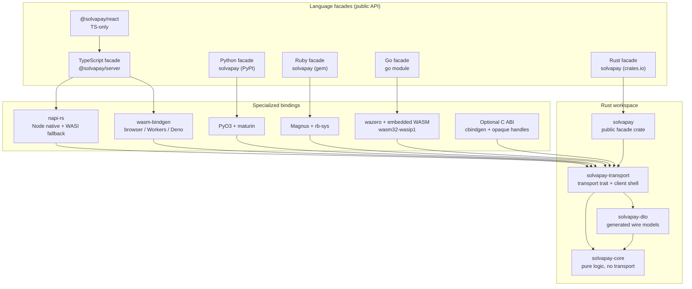

### 4.2 Layering and boundaries

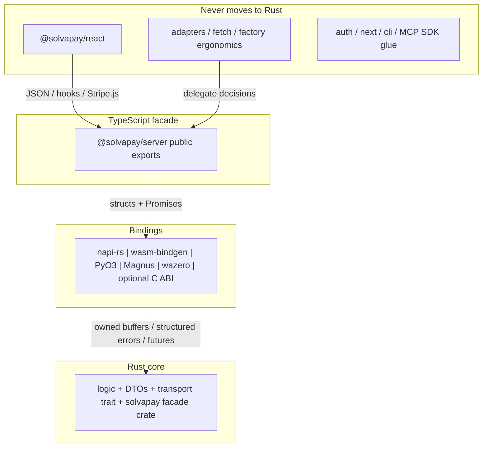

**What crosses each boundary — and what must never:**

| Boundary | Crosses | Must not cross |
| --- | --- | --- |
| React → TS facade | JSON, typed hooks, transport callbacks | Secret keys, native handles |
| TS facade → binding | Structs/JSON, Promises, AbortSignals | Framework objects (`Request`, Next.js types), timers |
| Binding → core | Owned buffers, typed errors, cancellation tokens | Host event-loop types (no tokio `Handle` in core public API) |
| Core → wire | HTTP via the transport trait | Language-specific exceptions, env-var reads |

Two boundary rules worth calling out explicitly because the current TS code violates them and the Rust core must not:

1. **No env-var reads in core.** Today `client.ts` and `paywall.ts` read `SOLVAPAY_DEBUG`, and `factory.ts` reads `SOLVAPAY_SECRET_KEY` / `SOLVAPAY_PRODUCT`. In the target state, env resolution stays in the language facades; core receives explicit config. This is what makes browser-WASM capability separation (§7.1) verifiable.
2. **No timers in core.** `withRetry` sleeps and `createRequestDeduplicator` runs a cleanup interval today. The Rust retry engine computes *schedules* (pure); the binding owns the actual sleep (tokio timer, JS `setTimeout` via the facade, GVL-released `sleep` in Ruby). The deduplicator stays host-side entirely.

### 4.3 Workspace split

```text
rust/
├─ Cargo.toml                 # workspace
├─ crates/
│  ├─ solvapay-core/          # pure logic; serde only; no HTTP, no tokio
│  │  ├─ src/business_details.rs
│  │  ├─ src/credit_display.rs
│  │  ├─ src/seller_identity.rs
│  │  ├─ src/retry.rs         # policy computation, not timers
│  │  ├─ src/webhook.rs       # parse + HMAC + constant-time compare
│  │  ├─ src/hmac_util.rs     # shared HMAC-SHA256 / ct-eq (webhook + auth)
│  │  ├─ src/auth_resolution.rs  # authenticated-user decision core (step 26)
│  │  ├─ src/customer_sync.rs    # ensureCustomer decision pieces (step 26)
│  │  ├─ src/activation.rs       # activate-plan param validation (step 26)
│  │  ├─ src/helper_error.rs     # shared ErrorResult shape
│  │  ├─ src/paywall/         # state.rs, gate.rs, decision.rs, payload.rs
│  │  ├─ src/mcp/             # tool_names.rs, descriptors.rs, envelope.rs
│  │  └─ src/error.rs         # structured cross-language error model
│  ├─ solvapay-dto/           # generated from OpenAPI snapshot + manifest overlays
│  ├─ solvapay-transport/     # transport trait, reqwest impl, fetch impl, client shell
│  └─ solvapay/               # public facade crate (crates.io); re-exports + ergonomics
├─ bindings/
│  ├─ node/                   # napi-rs
│  ├─ wasm/                   # wasm-bindgen
│  ├─ python/                 # PyO3 + maturin
│  ├─ ruby/                   # Magnus + rb-sys
│  ├─ go/                     # wazero loader, host transport, instance pool, embedded .wasm
│  └─ capi/                   # optional cbindgen C ABI
└─ tools/
   ├─ dto-gen/                # OpenAPI + manifest → IR → TS/Py/Rb/Go/Rust/C outputs
   └─ fixture-runner/         # replays Phase 0 golden fixtures
```

| Crate | Responsibility | Dependency discipline |
| --- | --- | --- |
| `solvapay-core` | Validation, retry policy, webhook verification, auth/customer/activation helper decision cores, paywall state/gate/decision, business-details, credit-display, seller-identity, MCP payload builders, error model | `serde`, `serde_json` (webhook body parse / `invalid_payload` / JWT payload), `hmac`/`sha2`, `subtle` (constant-time). **No** `reqwest`, **no** `tokio`, **no** `wasm-bindgen`. This is what keeps the browser WASM small and the core runtime-agnostic. |
| `solvapay-dto` | Generated wire models + SDK overlays | `serde` only; generated — never hand-edited |
| `solvapay-transport` | `Transport` trait, `reqwest`/rustls impl (native), Fetch impl (wasm32), client shell (auth headers, idempotency, retry wiring), all 36 method implementations | Depends on core + dto; async but runtime-agnostic (§7.4) |
| `solvapay` | Public crates.io facade: idiomatic re-exports of transport + core, `gate`/`payable` ergonomics, optional `blocking` feature | Depends on transport + core; no new semantic logic — ergonomics only (§4.5, Phase 9) |

### 4.4 Core contract sketches

The transport trait — deliberately minimal, so both `reqwest` and browser Fetch can satisfy it:

```rust
// Landed (steps 19–20): cfg'd BoxFuture alias — Send on native, !Send on wasm32.
// Dyn-compatible for Arc<dyn Transport>; equivalent to the original #[maybe_async_send] sketch.
// Impls: ReqwestTransport (native), FetchTransport (wasm32 via js_sys::global().fetch).
#[cfg(not(target_arch = "wasm32"))]
pub type BoxFuture<'a, T> = Pin<Box<dyn Future<Output = T> + Send + 'a>>;
#[cfg(target_arch = "wasm32")]
pub type BoxFuture<'a, T> = Pin<Box<dyn Future<Output = T> + 'a>>;

pub trait Transport {
    // Returns SdkError (not a parallel TransportError) — step 17 froze the single error surface.
    fn send(&self, req: HttpRequest) -> BoxFuture<'_, Result<HttpResponse, SdkError>>;
}

pub struct HttpRequest {
    pub method: Method,
    pub url: String,
    pub headers: Vec<(HeaderName, String)>, // includes Authorization, Idempotency-Key
    pub body: Option<Vec<u8>>,
}

pub struct HttpResponse {
    pub status: u16,
    pub body: Vec<u8>,
}
```

The structured error model (replaces `SolvaPayError { status?, code? }` and `PaywallError { structuredContent }`):

```rust
#[derive(Serialize)]
#[serde(tag = "kind")]
pub enum SdkError {
    /// Maps to `SolvaPayError` in TS, `SolvaPayError` exception in Python/Ruby,
    /// `solvapay.Error` in Go (`errors.As`), and `solvapay::Error` in the Rust facade.
    Api { message: String, status: Option<u16>, code: Option<String> },
    /// Maps to `PaywallError`; carries the full gate for 402 formatting.
    Paywall { message: String, gate: PaywallStructuredContent },
    /// Webhook verification failures with stable codes:
    /// missing_signature | malformed_signature | timestamp_too_old | invalid_signature | invalid_payload
    Webhook { message: String, code: WebhookErrorCode },
    Transport { message: String, retryable: bool },
}
```

Every binding converts `SdkError` to its native idiom — TS `SolvaPayError`/`PaywallError` classes (unchanged public shape), Python/Ruby exceptions, Go `solvapay.Error` (retrievable via `errors.As`), Rust facade `Error` — using the same `code` strings. Message prefixes from §2.3 are preserved verbatim; the manifest carries them as templates (`"Check limits failed ({status}): {body}"`).

**`SdkError` is the only error surface.** Core crates return `Result<T, SdkError>` (or a thin domain alias that still serializes as `SdkError`). Bindings never invent parallel error taxonomies: each wrapper has one conversion layer (`SdkError` → native exception / rejected Promise) that preserves `kind`, `code`, `status`, and message templates. New failure modes extend `SdkError` (or a nested code enum) in the core and regenerate binding conversions — they do not add ad-hoc string throws in a single language.

**No `.unwrap()` / `.expect()` in production Rust.** Under no circumstance may shipped core or binding code call `.unwrap()`, `.expect()`, `unwrap_err()`, or `panic!` for recoverable failure. Use exhaustive `match` / `?` with `SdkError` (or `map_err` into it). Infallible cases that are truly static invariants use typed constructors or `debug_assert!` with an explicit `Err(...)` fallback in release — never a panic path that can reach an FFI edge. Clippy `unwrap_used` / `expect_used` (deny) and a CI ripgrep gate enforce this from step 8 onward. Test-only helpers may use unwrap inside `#[cfg(test)]` modules when the failure mode is "fixture is malformed," not production control flow.

The retry policy engine — pure, timers host-side:

```rust
pub enum Backoff { Fixed, Linear, Exponential } // Fixed is default

pub struct RetryPolicy {
    pub max_retries: u32,        // default 2 — retries *after* the initial call
    pub initial_delay_ms: u64,   // default 500
    pub backoff: Backoff,        // default Fixed
}

impl RetryPolicy {
    /// `attempt` is the zero-based failed-call index.
    /// None => exhausted (`attempt >= max_retries`) — do not call host callbacks.
    /// Some(delay) => host may consult shouldRetry/onRetry, then sleeps `delay`, then retries.
    pub fn next_delay(&self, attempt: u32) -> Option<Duration>;
}
```

Delay formulas (saturating integer arithmetic so extreme typed inputs cannot overflow): fixed → `d`, linear → `d*(attempt+1)`, exponential → `d*2^attempt`.

`shouldRetry` / `onRetry` callbacks stay facade-side (host closures). Documented host weaving:

```text
call operation(attempt)
if success: return
if policy.next_delay(attempt) is None: reject last error   // last attempt: no callbacks
if shouldRetry exists: call it; reject immediately when false
if onRetry exists: call it
host sleeps for delay                                      // timer is host-owned
increment attempt and call again
```

Ordering locked by Step 5 fixtures: last attempt consults neither callback; `shouldRetry` precedes `onRetry`; `onRetry` precedes host sleep. The Rust core never owns a timer or host closure.

### 4.5 Binding strategy

| Target | Toolchain | Notes |
| --- | --- | --- |
| Node TypeScript | `napi-rs` v3 | Prebuilds per platform as optional-dependency packages; official WASI fallback package (`cpu: ["wasm32"]`) loads automatically when no native prebuild matches (§15 note 1) |
| Browser / edge / Workers / Deno | `wasm-bindgen` + `wasm32-unknown-unknown` | Capability-separated build (§7.1); host Fetch transport; **not** napi-rs's WASI artifact — that path requires SharedArrayBuffer/cross-origin isolation in browsers and doesn't fit Workers |
| Python | PyO3 0.28+ + maturin | `pyo3-async-runtimes` tokio bridge; async + blocking sync facades; `abi3` wheels; free-threaded CPython supported (§15 note 2) |
| Ruby | Magnus + rb-sys | Precompiled platform gems via `rb-sys-dock`; sync-first facade; GVL released during blocking calls (§15 note 3) |
| Go | wazero + embedded `wasm32-wasip1` | Pure Go, zero cgo. Core compiled to WASI, embedded via `//go:embed`, executed by wazero. Host implements the `Transport` contract as a wazero host function backed by `net/http`. Instance pool for concurrency (one WASM instance is single-threaded). Sync-first, `ctx context.Context` first param (§15 note 4). |
| Rust (public crate) | Native `solvapay` crate on crates.io | Thin idiomatic facade over `solvapay-transport` + `solvapay-core` — re-exports and ergonomics, not new logic. Async-first (`tokio`-compatible via runtime-agnostic core); optional `blocking` feature. Same parity obligations as other surfaces (catalog names, signature-parity suite, fixtures, contract tests, docs.rs). No FFI layer. |
| Third-party / exotic | Optional C ABI | cbindgen headers, opaque handles, owned buffers, explicit free, panic containment (step 54) |

### 4.6 Why not the alternatives

| Approach | Why weaker for this target set |
| --- | --- |
| **Single raw C ABI for all first-party wrappers** | Forces every language through the least common denominator: manual memory management, no idiomatic async (Promises/awaitables/GVL-aware blocking all need hand-built shims), duplicated safety wrappers per language, and a worse DX than napi-rs/PyO3/Magnus which generate those shims. Each first-party binding through C ABI roughly doubles its maintenance cost to save one core artifact. Keep the C ABI optional for *third parties*, where we don't own the wrapper anyway. |
| **cgo for Go** | Go modules cannot ship prebuilt native libraries. cgo breaks `go build` cross-compilation for consumers and forces a C toolchain on every integrator. The established pattern (Arcjet's Rust-core SDKs, `ncruces/go-sqlite3`, wasilibs) is wazero + `//go:embed` of a `wasm32-wasip1` artifact — pure Go, zero deps, no consumer toolchain burden. |
| **UniFFI-only** | Strong for Kotlin/Swift/Python/Ruby mobile-style components with its scaffolding + UDL/proc-macro contract. But Node is served only by third-party generators and there is no browser-WASM story matching `wasm-bindgen`. Our most important surfaces (Node, browser) would be second-class. Revisit only if a sixth language arrives that specialized bindings don't cover (§14). |
| **Diplomat-only** | Excellent hub-and-spoke FFI generator (the ICU4X model) with strong C/C++/JS output. Python output is newer (nanobind-based) and Ruby/Go are absent — we'd be writing and maintaining those backends ourselves, which is the cost we were trying to avoid. |
| **WIT / Wasm Component Model only** | The right long-term host model, but shipping idiomatic CPython wheels, Ruby platform gems, and Node native addons through component tooling is not a mature path today. WASM remains our browser/edge/fallback delivery and the Go embedding vehicle (wazero), not the universal packaging format. Re-evaluate at each Phase boundary (research rule). |
| **WASM for every language** | Works as the Node fallback (napi-rs) and as Go's primary delivery (wazero — no better pure-Go option). As the *primary* Python/Ruby delivery it loses: wasmtime-in-Python/Ruby adds a runtime dependency and an interop layer heavier than a native extension, startup cost is real, and GIL/GVL integration is manual. Native extensions remain the ecosystem norm for those server SDKs. |

**Decision (D1):** specialized generated runtime bindings per language (including wazero for Go), a first-party native Rust facade crate, and a stable optional C ABI for third parties.

---

## 5. Contract and code-generation strategy

### 5.1 Two inputs

1. **Checked-in filtered OpenAPI snapshot** — `/v1/sdk/*` paths, excluding `/v1/sdk/agents`, with the same prune/placeholder logic as today's [`generate-types.ts`](../../packages/server/scripts/generate-types.ts). Source of truth for wire DTOs. Upstream authorities: backend Zod schemas and the webhook event catalog. The snapshot is a file in this repo, diffed in CI against a fresh fetch, so backend drift is a visible PR, not a silent break.
2. **SDK contract manifest** — non-wire behavior and overlays. Schema-validated (JSON Schema or Zod), checked in, and the single input to parity checks.

Manifest entry sketch (one operation):

```yaml
operations:
  checkLimits:
    route: { method: POST, path: /v1/sdk/limits }
    names: { ts: checkLimits, py: check_limits, rb: check_limits, go: CheckLimits, rust: check_limits }
    request: CheckLimitsRequest        # DTO ref + overlay: includeCheckoutSession
    response: LimitResponseWithPlan    # overlay: SDK-added `plan` field
    errors:
      default: { messageTemplate: "Check limits failed ({status}): {body}" }
    idempotency: none
    sync: { ts: async, py: [async, blocking], rb: blocking, go: blocking, rust: [async, blocking] }
facade:
  createSolvaPay: { ts: createSolvaPay, py: create_solvapay, rb: "SolvaPay.create", go: "solvapay.New", rust: "Client::new" }
  gate:           { ts: "payable.gate", py: "sp.gate", rb: "sp.gate", go: "sp.Gate", rust: "sp.gate" }
errors:
  webhook:
    codes: [missing_signature, malformed_signature, timestamp_too_old, invalid_signature, invalid_payload]
defaults:
  retry: { maxRetries: 2, initialDelayMs: 500, backoff: fixed }
  webhookToleranceSec: 300
  limitsCacheTTLMs: 10000
```

### 5.2 What gets generated

OpenAPI snapshot + contract manifest compile into one **canonical IR** (§5.6). Emitters consume only the IR — no emitter reads the manifest directly.

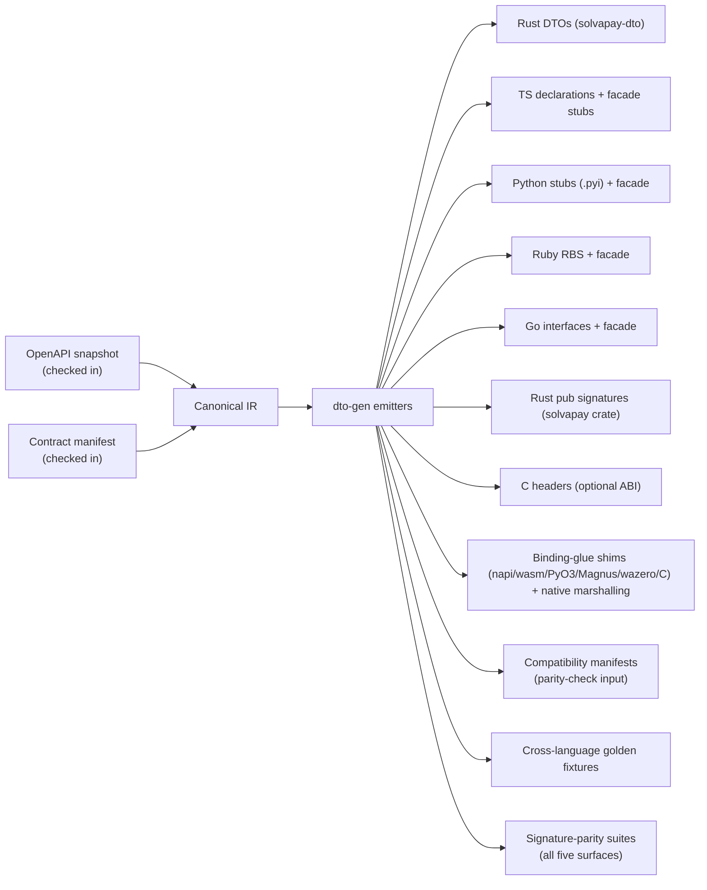

### 5.3 Golden fixture format

Fixtures are the behavioral contract shared by the TS harness (Phase 0), the Rust runner (Phase 1+), and the Python/Ruby/Go/Rust conformance suites (Phases 7–10). One format for all pure-logic and client-level checks:

```jsonc
{
  "suite": "webhook-verification",
  "case": "expired-timestamp",
  "input": {
    "fn": "verifyWebhook",
    "args": { "body": "{...}", "signature": "t=1600000000,v1=abc...", "secret": "whsec_test" },
    "clock": "2026-07-01T00:00:00Z"          // injected time — no Date.now() in fixtures
  },
  "expect": {
    "error": { "kind": "Webhook", "code": "timestamp_too_old", "message": "Webhook signature timestamp too old" }
  }
}
```

Client fixtures add a `wire` block (expected request method/path/headers/body + canned response) replayed against a mock transport. Rules: injected clock and RNG (idempotency-key generation is seeded in fixture mode), byte-exact expected messages, at least one success and one error case per client method.

### 5.4 Known schema blockers (fix before generation cutover)

These currently live as hand-maintained overlays in [`types/client.ts`](../../packages/server/src/types/client.ts) and must be encoded in OpenAPI and/or the manifest before step 15's cutover:

| Blocker | Today | Required before gen cutover |
| --- | --- | --- |
| `CheckLimitsRequest.includeCheckoutSession` | TS intersection overlay; source comment says temporary until OpenAPI republish | Field in OpenAPI, or explicit manifest overlay |
| `LimitResponseWithPlan` | `LimitResponse` + SDK-added `plan: string` | Documented manifest overlay (the field is SDK-synthesized, not wire) |
| `ProcessPaymentResult` | 7-branch discriminated union: `succeeded+recurring`, `succeeded+one-time`, bare `succeeded` (webhook race), `processing`, `timeout`, `failed`, `cancelled` | **Resolved for Rust wire DTOs (step 15):** snapshot `oneOf` + untagged serde enum preserves all branches including bare-`succeeded`; TS union regeneration stays Phase 2 later |
| `TopupProcessResult` | Narrowed projection with optional `creditsAdded` (balance-poll delta) | Manifest projection rule over `ProcessPaymentResult` |
| `CustomerResponseMapped` | Field mapping (`reference` → `customerRef`) + purchase enrichments (`paidAt`, `nextBillingDate`) | Manifest normalization rules |
| SDK-only result types | `OneTimePurchaseInfo`, `McpBootstrapResponse`, `AutoRechargeConfig` + display blocks, `CreditDisplayBlock`, etc. | Manifest overlays with generation tests |
| Response-shape polymorphism | `getCustomer`/`listProducts`/`listPlans`/`cancelPurchase` accept multiple backend shapes (§2.3) | Manifest normalization rules + fixtures for *each* accepted shape |

### 5.5 Compatibility model

- Generated TS declarations must be drop-in compatible with current exports during Phase 2 — the API diff (via `api-extractor` or equivalent) is empty.
- Per-language parity/coverage check asserts every catalogued public entry point exists with matching semantics; it consumes the generated compatibility manifests, not hand-written lists.
- Golden fixtures are the behavioral contract; a binding that diverges fails CI before it can publish.
- Signature generation is deterministic and CI-enforced (§5.6): regeneration idempotence, committed-output drift check, and generated signature-parity suites for all five surfaces.

### 5.6 Signature generation pipeline

Deterministic per-language API generation so adding or renaming a catalogued method updates all five surfaces, their facades, and their signature-parity suites in one PR. A missing regen is a CI failure, not a review catch.

#### Canonical IR

`dto-gen` compiles the OpenAPI snapshot + contract manifest into one typed intermediate representation. The IR carries, for every operation and facade entry point:

- Operation id, route, request/response DTO refs (including overlays)
- Per-language names (already cased — emitters do not re-case)
- Parameter list (required/optional, defaults, doc strings)
- Error message templates and `SdkError` kind mapping
- Sync/async availability matrix
- Idempotency and retry annotations needed for stub generation

**All emitters consume only the IR.** No emitter reads the OpenAPI snapshot or the YAML manifest directly. Regenerating the IR from the same inputs must be byte-identical (idempotence gate).

#### Deterministic name derivation

| Language | Case | Example (`checkLimits`) |
| --- | --- | --- |
| TypeScript | camelCase | `checkLimits` |
| Python | snake_case | `check_limits` |
| Ruby | snake_case | `check_limits` |
| Go | exported PascalCase | `CheckLimits` |
| Rust | snake_case | `check_limits` |

Reserved-word and collision tables live in the manifest (checked in). Manual name overrides are allowed **only** via the manifest `names` block — never hard-coded in an emitter. Go always inserts `ctx context.Context` as the first parameter for callable surface methods; that parameter is catalogued in the IR, not invented by the Go emitter.

#### Type-mapping table

Wire / IR types map to language types through one reviewable matrix (not implicit emitter heuristics):

| IR / wire type | TypeScript | Python | Ruby | Go | Rust |
| --- | --- | --- | --- | --- | --- |
| `string` | `string` | `str` | `String` | `string` | `String` |
| `int` / `i64` | `number` | `int` | `Integer` | `int64` | `i64` |
| `decimal` | `string` (decimal string) | `Decimal` | `BigDecimal` | `string` (or `shopspring/decimal` if adopted) | rust_decimal / string per manifest |
| `timestamp` | `string` (ISO) or `number` (unix) per field annotation | same | same | `time.Time` or `int64` per annotation | `i64` seconds (core) / facade newtype |
| `enum` | string union | `Literal[...]` | string + RBS union | typed string constants (no iota) | `enum` / `#[serde(rename_all)]` |
| discriminated union | TS union | tagged union / Protocol | duck + RBS | struct + `Kind` string field | `enum` with serde tag |
| options bag | options object | kwargs | keyword args | `XxxOpts` struct | `XxxOpts` struct |
| errors | `SolvaPayError` / `PaywallError` | exceptions | exceptions | `solvapay.Error` (`errors.As`) | `solvapay::Error` |

#### Emitters and outputs

| Emitter | Outputs |
| --- | --- |
| TypeScript | `.d.ts` declarations + facade stubs |
| Python | `.pyi` stubs + facade module |
| Ruby | RBS signatures + facade |
| Go | interfaces + facade (`CheckLimits`, `Gate`, …) |
| Rust | `pub` signatures for the `solvapay` facade crate |
| C (optional) | cbindgen-compatible headers |
| Tests | signature-parity suites for all five surfaces, generated from the same IR |
| Snapshots | golden signature snapshots per language, reviewed as normal diffs |

Every generated file carries a `generated — do not edit` header. Hand edits to generated files are a CI failure.

#### Reliability gates (also §10.3)

| Gate | What it proves |
| --- | --- |
| Regeneration idempotence | Running the generator twice produces zero diff |
| Committed-output drift | CI regenerates and fails on any diff against committed outputs |
| Hand-edit detection | CI greps for generated headers; files without them in generated paths fail |
| Generated signature-parity suites | Manifest change updates catalog, facades, *and* parity tests in one PR |
| Golden signature snapshots | Per-language signature snapshots reviewed as ordinary diffs |

#### Add-a-method workflow

1. Edit the contract manifest (and OpenAPI snapshot if the wire shape changed).
2. Run `dto-gen` (IR → all emitters).
3. All five language signatures, facade stubs, signature-parity suites, and fixture stubs update in a single PR.
4. CI fails if regeneration was skipped or drifted.

### 5.7 Binding-glue generation (native ↔ envelope ↔ core)

§5.6 generates the public facade **signatures** (`.d.ts` / `.pyi` / RBS / Go / Rust) and the signature-parity suites. §5.7 generates the **binding-glue layer**: the per-toolchain FFI shims that marshal arguments across the boundary and reconstruct results/errors around the existing JSON-envelope-over-string ABI (`{"ok":true,"value":…}` | `{"ok":false,"error":<SdkError>}`, §15 note 32). This is the layer today hand-mirrored across [`rust/bindings/node/src/`](../../rust/bindings/node/src/decisions.rs) and [`rust/bindings/wasm/src/`](../../rust/bindings/wasm/src/decisions.rs) — `args`, `decisions`, `payload_builders`, the client dispatch (`native_client.rs` / `wasm_client.rs`), and the native-side `native.ts` / `wasm.ts` dispatch + envelope reconstructor. Adding a core fn currently means a hand-written `#[napi(js_name=…)]` and a byte-for-byte-parallel `#[wasm_bindgen(js_name=…)]` wrapper (extract each JSON arg with `require_string` / `optional_f64`, call core, `to_value`, wrap in `run_envelope_sync`); §5.7 makes that a manifest edit.

The boundary substrate does not change: the JSON envelope stays the universal ABI (D16). No first-party cbindgen — D1 / §4.6 intact — and the optional C ABI (step 54) reuses the same envelope emitter for third parties. §5.7 generates only the marshalling/shim code around the envelope; emitters still consume only the IR (§5.6).

#### Binding-boundary IR

`dto-gen` gains a `BindingSymbol` per core symbol, lowered into `Ir.binding_symbols` from a new Zod-validated manifest section `bindings:`. Each descriptor carries:

- Core Rust fn path (e.g. `solvapay_core::paywall_state::classify_paywall_state`).
- Per-toolchain export name (`js_name` / py / rb / go / c), reusing the existing `IrLangNames` casing rules (§5.6) — emitters never re-case.
- Ordered JSON-args keys with boundary type + required/optional + a **host-injected** flag for args the host supplies rather than the caller (e.g. `nowMs`, injected clock, seeded RNG).
- Path-ref split rules — the existing `split_path_refs` case (ordered `productRef` / `planRef` / `customerRef` extracted from the combined args JSON, remainder is the body; §15 note 34).
- Return shape, sync/async, and envelope mode (sync `run_envelope_sync` vs async `run_envelope`; the webhook-throw path stays the one documented exception, §15 note 32).

The descriptor set is reconciled against the existing catalog (`entry_points` / `OPERATION_NAMES`): every non-§8 core symbol has exactly one `BindingSymbol` and every `BindingSymbol` maps to a real core symbol (`manifest:check` cross-check, mirroring the step-24 coverage gate).

#### Boundary type-mapping matrix

One reviewable table maps each IR boundary type to its arg-extractor + serializer per language, analogous to the §5.6 facade type table. Adding a language is one new column + one emitter.

| IR boundary type | Rust extract (napi/wasm) | Rust serialize | TS reconstruct | Python (later) | Ruby (later) | Go (later) |
| --- | --- | --- | --- | --- | --- | --- |
| `string` (required) | `require_string(key)` | `to_value` | `String(v)` | `str` decode | `String` | `string` |
| `string?` (optional) | `optional_string(key)` | skip-absent | `v ?? undefined` | `Optional[str]` | `nil`-coalesce | `*string` |
| `f64` / number | `require_f64` / `optional_f64` | `serialize_whole_f64` (whole → int) | `Number(v)` | `float` / `int` | `Float` / `Integer` | `float64` / `int64` |
| `bool` | `require_bool` | `to_value` | `Boolean(v)` | `bool` | `true`/`false` | `bool` |
| raw `Value` passthrough | `require_value` | verbatim | verbatim | dict | Hash | `json.RawMessage` |
| host-injected (`nowMs`, clock, RNG) | read from injected arg, not caller | n/a | supplied by host adapter | host adapter | host adapter | host adapter |
| envelope error | `err_envelope(<SdkError>)` | envelope JSON | `Api`→`SolvaPayError`, `Paywall`→`PaywallError` (`structuredContent`), `Webhook`/`Transport`→`SolvaPayError` | exceptions | exceptions | `errors.As` |

#### Emitters

New dto-gen emitters produce, all carrying the `generated — do not edit` header (hand edits are a CI failure, §5.6):

- **Rust-side toolchain shims** — the napi `#[napi]` and wasm `#[wasm_bindgen]` `args.rs` / `decisions.rs` / `payload_builders.rs` / client-dispatch modules; later PyO3, Magnus, `wazero`-export, and the cbindgen surface (step 54).
- **Native-side marshalling/reconstruction** — the TS `native.ts` / `wasm.ts` dispatch + the envelope → `SolvaPayError` / `PaywallError` reconstructor; later the Python / Ruby / Go equivalents.

#### Reliability gates (also §10.3)

The §5.6 gate table extends to the shim files:

| Gate | What it proves |
| --- | --- |
| Binding-glue regen idempotence | Running the generator twice over the shim files produces zero diff |
| Binding-glue committed-output drift | CI regenerates and fails on any diff against the committed shim + native-glue files |
| Hand-edit header detection | The generated-header grep (§5.6) covers `args`/`decisions`/`payload_builders`/client-dispatch + `native.ts` / `wasm.ts` |
| Binding-boundary catalog reconciliation | Every non-§8 core symbol has exactly one `BindingSymbol` and vice-versa |
| Retrofit byte-identical proof | Regenerated node + wasm shims are byte-identical to the committed 37R/38R hand-written output; both-`SOLVAPAY_IMPL`-flag suites stay green on the generated glue |

#### Add-a-core-symbol workflow

1. Add/edit the manifest `bindings:` entry (and the core fn).
2. Run `dto-gen` (IR → §5.6 signatures **and** §5.7 glue).
3. Every toolchain shim + native marshalling updates in one PR.
4. A skipped or drifted regen fails CI (same class as §5.6).

---

## 6. Behavioral contracts to freeze (module-level detail)

This section pins the *semantics* Phase 0 fixtures must capture. It exists so a session translating a module doesn't have to reverse-engineer intent from TS.

### 6.1 Webhook verification

One algorithm, currently duplicated in [`index.ts`](../../packages/server/src/index.ts) (Node sync, `node:crypto`) and [`edge.ts`](../../packages/server/src/edge.ts) (async, Web Crypto):

1. Header format `t={unix-seconds},v1={hex-hmac}` from the `SV-Signature` header; missing → `missing_signature`, unparsable → `malformed_signature`.
2. Tolerance: reject when `|now - t|` > **300 s** → `timestamp_too_old`.
3. HMAC-SHA256 over `"{timestamp}.{rawBody}"`, keyed by the **full** secret including the `whsec_` prefix.
4. Constant-time comparison (length check first, then timing-safe equality) → `invalid_signature`.
5. Body must parse as JSON → `invalid_payload`; returns the typed `WebhookEvent`.

The Rust implementation (step 12) replaces both copies; the Node facade stays sync (napi-rs sync call — HMAC is CPU-trivial), the edge facade stays `async` in signature for backward compatibility even though the WASM call is also synchronous underneath. Fixture axes: accept, each of the five error codes, boundary timestamps (±299/±301 s), non-hex v1, multiple comma parts, empty body.

### 6.2 Retry engine

From [`utils.ts`](../../packages/server/src/utils.ts): defaults `maxRetries: 2`, `initialDelay: 500`, `backoffStrategy: 'fixed'` (also `contract/manifest/sdk-contract.yaml` `defaults.retry`). Delay computation: fixed → `d`, linear → `d*(attempt+1)`, exponential → `d*2^attempt`. `attempt` is zero-based; `maxRetries` counts retries after the initial call. Semantics to preserve exactly: when `next_delay(attempt)` returns `None` (exhausted), the host rejects without consulting `shouldRetry` or `onRetry`; otherwise `shouldRetry(error, attempt)` may veto; `onRetry(error, attempt)` fires *after* the retry decision, *before* the host-owned sleep. Overflow-safe in Rust via saturating/`checked_shl` arithmetic. Fixture axes (`contract/fixtures/retry-schedule/`, 13 cases): all three strategies × attempts 0–3, shouldRetry veto paths, onRetry ordering, non-`Error` throwables (host wraps via `String(error)` — coercion stays out of `solvapay-core`).

### 6.3 Paywall state, gate, and payload

From [`paywall-state.ts`](../../packages/server/src/paywall-state.ts) / [`paywall-gate.ts`](../../packages/server/src/paywall-gate.ts) / [`paywall.ts`](../../packages/server/src/paywall.ts):

- **Classification precedence** (`classifyPaywallState`): (1) `activationRequired === true` trumps all → `activation_required`; (2) usage-based plan out of credits → `topup_required`, where "usage-based" is `activePlan.type === 'usage-based'` **or** presence of the `balance` block, and "out of credits" checks `balance.creditBalance === 0`, then top-level `creditBalance === 0`, then falls back to `remaining === 0` when both credit channels are absent; (3) everything else (including `limits === null`) → `upgrade_required`. `reactivation_required` exists in the type but is never returned under current backend behavior — keep it in the Rust enum, keep it unreachable.
- **Gate/nudge copy** (`buildGateMessage` / `buildNudgeMessage`): exact strings, including the backtick-quoted tool names (`` `activate_plan` ``, `` `topup` ``, `` `upgrade` ``, `` `manage_account` ``) and the conditional `, or open {url} in a browser` / `, or visit {url}` clauses. These are byte-for-byte fixtures — the copy is consumed verbatim by MCP hosts.
- **Gate building** (`buildPaywallGate`): `plan` falls back to `''` for `LimitResponse`-only callers; the PAYG-topup reclassification (`useActivationForTopup`) fires when not `activationRequired`, state is `topup_required`, and *every paid plan* (`requiresPayment !== false`) is `usage-based`/`hybrid` — producing `kind: 'activation_required'` with plans attached so the React `isTopupGate` discriminator picks topup copy. Conditional field spreading (`plans`/`balance`/`productDetails`/`confirmationUrl` only when present) must be preserved — serializers that emit `null` for absent fields break the React discriminators.
- **Client payload** (`paywallErrorToClientPayload`): stable JSON shape `{ success: false, error: 'Activation required' | 'Payment required', product, checkoutUrl, message, kind, ...conditional }`.

### 6.4 Error taxonomy

`SolvaPayError` carries optional `status` (HTTP) and free-form `code`. Existing thrown messages (per-method prefixes, §2.3) are frozen in the manifest as templates. The Rust `SdkError` (§4.4) adds *stable* codes for webhook errors and transport errors without changing any existing message string. New codes may be added; existing strings may not change until a major.

Cross-language plug-in rule: wrappers do not re-encode domain failures. They map `SdkError` once at the FFI/facade boundary into the host exception type, then rethrow / reject. Integrators in every language see the same stable `code` vocabulary and the same message templates; only the exception *class* name and language idioms differ.

### 6.5 MCP contracts (pure parts only)

From [`packages/mcp-core`](../../packages/mcp-core): `MCP_TOOL_NAMES` (12 canonical names, e.g. `create_payment_intent`, `upgrade`, `manage_account`, `topup`), `paywallToolResult` (deliberately `isError: false` — a paywall is a user-actionable gate, not a tool failure; narration in `content[0].text`, gate on `structuredContent`), and `response-envelope` / `descriptors`. The OAuth bridge, bearer handling, CSP, and narration engine stay TypeScript.

---

## 7. Portability, performance, and safety

### 7.1 Capability-separated builds

Browser and server builds are feature-gated so secret-key operations can never enter browser WASM:

```toml
[features]
default = ["server"]                         # native consumers (napi, fixture-runner) keep webhook + auth HMAC
server = ["client-full", "webhook-verify"]   # napi-rs, PyO3, Magnus, wazero host, crates.io facade, server-side Workers
browser = ["client-public"]                  # wasm-bindgen browser build — no webhook / no JWT HMAC
client-full = ["hmac-crypto"]                # Bearer/auth JWT helpers (server-side)
client-public = []                           # public-safe pure logic only (marker)
webhook-verify = ["hmac-crypto"]             # `verify_webhook` + HMAC deps
hmac-crypto = ["dep:hmac", "dep:sha2", "dep:subtle"]
```

Composition used by the wasm-bindgen crate (`@solvapay/server-wasm`), after the Step 38R full-surface cutover:

| Profile | `solvapay-core` features | JS-visible exports |
| --- | --- | --- |
| `edge` | `webhook-verify` + transport client (no `browser`) | `wasmVersion`, `verifyWebhook`, `WasmClient` (Groups A–C over `FetchTransport`, `wasm32` only), and the full set of sync decision / paywall / retry / core / MCP envelope fns |
| `browser` | `browser` → `client-public` only | `wasmVersion` + the public-safe pure-logic subset (business-details / credit-display / seller-identity sync fns) |

Browser excludes webhook/transport/MCP symbols because `webhook-verify` and the transport client are `edge`-gated (`#[cfg(feature = "edge")]`) and the MCP payload subset in `payload_builders.rs` is edge-only — so the browser module and its re-exports are `cfg`'d out, and CI's browser symbol audit (`check-browser-symbols.mjs`) allowlists exactly the public-safe semantic exports (plus pattern-allowed wasm-bindgen allocator/reference internals). The secret-key `WasmClient` type is compiled into the `edge` profile only. The structural gate is the feature graph + export audit, not a runtime check.

### 7.2 std-based core (not `no_std`)

**Decision (D3):** std-based core with size discipline, not `no_std`.

All targets (napi-rs, wasm32 browser/Workers, PyO3, Magnus, wazero-hosted WASI, native crates.io facade) are hosted environments with std. `no_std` would forfeit `reqwest`/async ecosystem access with no performance gain for an I/O-bound SDK.

Size control comes from:

- Workspace split — `solvapay-core` has no transport deps, so the browser WASM links logic + DTOs only
- Cargo feature gates per target (§7.1)
- WASM profile: `opt-level = "z"`, `lto = true`, `panic = "abort"`, `codegen-units = 1`
- `wasm-opt -Oz` post-pass
- Lean dependency choices (e.g. no `chrono` — timestamps are `i64` seconds; `serde_json` with `float_roundtrip` only if fixtures need it)
- `twiggy` / `cargo-bloat` in CI against the WASM size budget (§7.8)

### 7.3 Concurrency model: async Rust

**Decision (D4a):** async Rust, not OS threads or CSP/actors.

The workload is I/O-bound request/response; concurrency means overlapping in-flight requests, which futures provide on every target. Browser/Workers WASM is single-threaded, so thread-based designs cannot ship there at all. Actor mailboxes add hop latency without buying isolation for stateless calls. Channels are permitted only as an internal pattern (cancellation signals, a future background poller) — never in public core signatures.

### 7.4 Runtime-agnostic core

**Decision (D4b):** the core must compile and run under tokio (napi-rs, PyO3, Rust facade), the JS microtask queue (wasm-bindgen), a blocking executor (Ruby), and wazero-hosted WASI (Go), which means:

- No tokio types or `tokio::spawn` in core/transport public signatures; timers are host-provided (§4.2 rule 2)
- `Send` bounds behind a cfg flag — tokio futures are `Send`, wasm futures are `!Send`; a `maybe_async_send` macro (or equivalent cfg-attr pattern) keeps one trait definition
- Enforced from Phase 1 via a CI job compiling `solvapay-core` + `solvapay-transport` for `wasm32-unknown-unknown` with tokio absent from the feature graph

### 7.5 Event-loop ownership (bindings, never the core)

| Binding | Ownership model |
| --- | --- |
| napi-rs | Shared multi-thread tokio runtime owned by the binding crate; Rust futures surface as JS Promises via napi's async support; AbortSignal maps to future drop |
| wasm-bindgen | No runtime — futures ride the host microtask queue via `wasm-bindgen-futures`; Fetch is the transport *and* the timer source |
| PyO3 | Binding owns a tokio runtime via `pyo3-async-runtimes`; async facade uses `future_into_py`; blocking sync facade calls `runtime.block_on` with the GIL released (`Python::detach` / `py.allow_threads`); modules declared thread-safe for free-threaded CPython (§15 note 2) |
| Ruby (Magnus) | Sync-first facade; binding owns a small tokio runtime; blocking calls release the GVL (`rb_thread_call_without_gvl` via Magnus) so other Ruby threads progress during HTTP waits |
| Go (wazero) | Binding owns a WASM **instance pool** (one instance is single-threaded). Calls are blocking from the Go caller's perspective; `ctx context.Context` cancellation maps to instance teardown / in-flight abort. Host transport is a wazero host function over `net/http`; timers stay host-side (§15 note 4). |
| Rust (`solvapay` crate) | Integrator owns the async runtime (tokio-compatible). Core and transport remain runtime-agnostic; the facade is async-first with an optional `blocking` feature that runs on a caller-provided or feature-gated runtime. |

### 7.6 Safety and interop checklist

| Concern | Rule |
| --- | --- |
| Cancellation | Drop-based via futures; napi maps AbortSignal → drop; Python maps `asyncio.CancelledError` → drop; Ruby sync calls are not cancellable (documented); Go maps `ctx` cancel → instance teardown; Rust facade cancellation is future drop / `blocking` has no cancel |
| CORS / TLS | Native: rustls (no OpenSSL system dependency in wheels/gems/prebuilds). WASM: host Fetch + platform TLS. Never a custom TLS stack in the browser. |
| Webhook sync compat | One Rust implementation; Node sync facade and edge async facade both call it (§6.1) |
| Opaque-handle lifecycle | C ABI only: create/use/free pairs, no borrowed pointers across calls, handle-after-free is a checked error not UB (generation-counted handles) |
| Allocator ownership | C ABI: callee-allocated buffers freed by matching `solvapay_free_*` functions; ownership documented per header |
| Panic boundaries | `catch_unwind` at every FFI edge; a panic becomes `SdkError::Transport { retryable: false }` + a logged report; never unwind across a language boundary |
| No unwrap in shipped code | Deny `.unwrap()` / `.expect()` / panic-for-control-flow in `solvapay-*` crates outside `#[cfg(test)]`; prefer exhaustive `match` + `Result`/`SdkError` (§4.4) |
| Thread / GVL / GIL | Binding owns acquire/release; core stays lock-light (no globals except the seeded-RNG fixture hook); PyO3 classes `Send + Sync` for free-threaded builds |
| Structured errors | Single `SdkError` model → one conversion layer per binding → native exception with stable `code`; §4.4, §6.4 |

### 7.7 Release artifacts and target matrices

| Ecosystem | Artifacts | Fallback behavior |
| --- | --- | --- |
| npm (`@solvapay/server`) | Per-target native packages as `optionalDependencies` (darwin-x64/arm64, linux-gnu/musl × x64/arm64, win32-x64/arm64) + napi-rs WASI fallback package (`cpu: ["wasm32"]`) + separate `wasm-bindgen` package `@solvapay/server-wasm` (edge + browser profiles) wired through export conditions | napi-rs loader auto-falls back native → WASI; `NAPI_RS_FORCE_WASI` exercises the fallback in CI (§15 note 1). The full edge surface defaults to `@solvapay/server-wasm` (Step 38R); Node stays on `@solvapay/server-native` (Step 37R); the browser public-safe subset is opt-in via `@solvapay/core/browser-wasm` |

**`@solvapay/server-wasm` layout (Step 38, extended 38R):** one optimized `.wasm` per profile (`pkg/edge/`, `pkg/browser/`) from a shared `wasm-bindgen --target web` glue generation, plus thin runtime wrappers (`runtime/{node,deno,workerd,web}.js` for edge, `runtime/browser-web.js` for browser) that `export *` the generated surface and add a uniform lifecycle: async `ready()` plus `ensureReadySync()` where a runtime has synchronous module access (Node `readFileSync`+`initSync`; workerd/Deno `initSync`; generic edge-light warms via `ready()` only; browser `ensureReadySync(module)` needs a precompiled `WebAssembly.Module`). Package `exports` put runtime-specific conditions (`deno`, `workerd`, `worker`, `edge-light`, `browser`, `node`) **before** generic `import`/`default` because Deno also advertises `node` and `import`. Generated glue + portable `.wasm` artifacts are committed and drift-checked so `pnpm build:packages` does not require Rust/wasm-bindgen/Binaryen for TypeScript contributors.
| PyPI | `abi3` wheels via maturin (manylinux x64/arm64, musllinux, macOS universal2, Windows x64) | Clear install error on unsupported platforms; **no** silent pure-Python stub for secret-key ops |
| RubyGems | Precompiled platform gems via `rb-sys-dock` (linux x64/arm64, darwin x64/arm64, mingw) + source gem requiring a Rust toolchain | Source-gem compile as documented fallback; no silent stub |
| Go module | Module with `//go:embed` of the `wasm32-wasip1` core artifact; wazero runtime; tagged releases | Pure Go — no cgo fallback path. Artifact either committed in-repo or attached to release tags (gate in §13). |
| crates.io (`solvapay`) | Source crate depending on workspace `solvapay-transport` / `solvapay-core` (published or path-patched per release train); docs.rs builds enabled | No binary artifact; consumers compile from source against a stable MSRV |
| Optional C ABI | Shared library per platform + cbindgen header, versioned `SOLVAPAY_ABI_VERSION` | Third-party responsibility |

All artifacts are stamped with the SDK release-train version plus the core git SHA; a mismatch between facade version and binding version is a load-time error, not a silent skew.

### 7.8 Measurable budgets (placeholders until Phase 6 baselines)

| Metric | Initial budget | When enforced |
| --- | --- | --- |
| Browser WASM, gzipped | Baseline recorded in [`rust/bindings/wasm/budgets.json`](../../rust/bindings/wasm/budgets.json) at Step 38; **re-recorded at Step 38R** (6531→63633 B gzip) when the browser profile gained the public-safe pure-logic subset + serde envelope machinery — the WASM is lazy + opt-in (`@solvapay/core/browser-wasm`), so the eager main-thread cost stays ~1.8 KB (JS glue) and the TS fallback ships regardless; regression > 10% needs approval + baseline update rationale | Phase 6+ |
| WASM cold start (instantiate + first call) | Browser: fresh process/module instantiation + first `wasmVersion` (median). Edge diagnostic: fresh instantiation + frozen valid `verifyWebhook` (retained; not the mandatory §7.8 gate) — re-recorded at Step 38R (34157→298838 B gzip) after the full transport client + all sync envelopes entered the edge profile. Same `budgets.json`. | Phase 6+ |
| Request overhead vs TS client | Shadow mode (step 25): median delta within agreed % | Phase 3+ |
| FFI memory copies | ≤ 1 encode per hop (JSON bytes cross once; no intermediate string re-encodes) | Binding code review |
| Binary coverage | Full platform matrix green on main — enforced by Step 39 clean-install CI (`node clean install (native, …)` × 24 + `node clean install (WASI, …)` × 3) after publish-shaped `npm install` of packed tarballs | Phase 6+ |
| Unsupported platform | Documented error + WASI fallback for Node — Step 39 WASI-only clean install (`NAPI_RS_FORCE_WASI=error`, no `.node` in the consumer tree) proves the packaged napi-rs WASI path (not `@solvapay/server-wasm`) | Phase 6+ |

Measurement methodology: `rust/bindings/wasm/scripts/measure-wasm.mjs` — deterministic raw + gzip level-9 byte counts; multiple isolated child processes; discard warm reuse; report median + spread; pin Node/OS/toolchain metadata. Normal CI uses `--check` (cannot rewrite budgets); recording requires explicit `--record`. Do not make unqualified performance claims anywhere in SDK docs; cite these budgets.

---

## 8. What never moves to Rust

This table is the **exhaustive** list of what keeps logic in facade languages — any public surface not listed here delegates to the Rust core (thin-facade rule, §1 principle 1).

| Area | Reason | Compatibility guarantee |
| --- | --- | --- |
| Entire [`packages/react`](../../packages/react) | Components, hooks, primitives, Stripe.js glue, i18n, transport wiring | Consumes only the TS facade of `@solvapay/server` and its transport layer; the binding beneath (wasm-bindgen in browser/edge, napi-rs in Node — never the C ABI) is invisible. React package tests run unmodified as a regression gate at every cutover step. |
| Framework adapters ([`adapters`](../../packages/server/src/adapters): `http.ts`, `next.ts`, `mcp.ts`) + [`fetch`](../../packages/server/src/fetch) handlers | Thin TS shells over framework types | Delegate to Rust decision/client cores |
| `createSolvaPay` factory ergonomics ([`factory.ts`](../../packages/server/src/factory.ts)) | Language-idiomatic; Python/Ruby/Go/Rust get their own facades (§2.4) | Only the decisions it calls into move |
| `createRequestDeduplicator` + limits cache plumbing | Host timers, host maps, Workers-safe lazy intervals — per-runtime by nature | Behavior unchanged; caches sit *above* the Rust client |
| `@solvapay/auth`, `@solvapay/next`, `@solvapay/cli`, `create-solvapay`, `@solvapay/init` | Product/framework glue | Unchanged |
| MCP SDK registration glue ([`register-virtual-tools-mcp.ts`](../../packages/server/src/register-virtual-tools-mcp.ts)), `@solvapay/mcp-core` transport parts (OAuth bridge, bearer, CSP, narrate) | JS SDK types and Node/fetch middleware | Payload builders move (steps 34–35); registration and middleware stay TS |
| Per-language MCP-authoring adapters (`solvapay-mcp-<lang>`) | Layer-1 MCP protocol/transport comes from each language's own MCP SDK (never reimplemented in Rust); the layer-3 `registerPayable` / `ctx.respond` ergonomic is idiomatic, hand-written glue | Consume the shared layer-2 Rust decision core (paywall/envelope/descriptors, steps 32/34/35); named future track in §9, not in steps 1–55 |

---

## 9. Step-by-step translation path

### Sizing rule

Every numbered step is scoped to **one Cursor session**: one module or small module group, one PR, one "done when" check that a fresh agent can verify without context from earlier sessions. No step may depend on unfinished work from a step after it.

### Diagram rule

Architecture must stay visible at every stage. Required Mermaid diagrams live next to the sections they explain; a step that changes the architecture updates the affected diagram in the same session (same rule as research findings). Required set: target-state (§4.1), layering (§4.2), per-phase snapshots (below), sequence diagrams (§11).

### Research rule

Every step **starts** with online research against current upstream sources before writing code: docs and release notes for whichever layer the step touches (napi-rs, wasm-bindgen/wasm-pack, PyO3/maturin/pyo3-async-runtimes, Magnus/rb-sys, wazero, cbindgen, reqwest/rustls, crates.io publishing, the Rustonomicon FFI chapter and Unsafe Code Guidelines, WASM/Workers platform limits). Findings that confirm, sharpen, or contradict a decision are written back into **this document** (§15 research log + the affected section) in the same session.

### TDD rule (every Rust step)

Every Rust implementation step (Phase 1 onward — core, transport, bindings, and generators that emit Rust) is executed with aggressive **RED → GREEN → REFACTOR**:

1. **RED** — Write or extend the failing test(s) first: Phase 0 golden fixtures wired into the Rust runner, plus unit tests for the step's new surface. Run them and confirm they fail for the right reason (missing API / wrong behavior), not because of harness bugs.
2. **GREEN** — Write the minimal production code that makes those tests pass. No speculative APIs, no drive-by refactors outside the step scope.
3. **REFACTOR** — Clean up while keeping the suite green: clearer `match` arms, shared helpers, tighter types — still without `.unwrap()` (§4.4) and without widening the step's public surface.

"Done when" for a Rust step means: the new tests were observed failing before the implementation landed, then passing after; the PR description notes that RED evidence (or CI logs show the ordered commits). Skipping RED because "the fixture already exists" is not allowed — wire the fixture, watch it fail against the empty/stub implementation, then implement.

Phase 0 (TS-only fixture capture) still writes tests/fixtures first by nature; the TDD rule hardens from step 8 when Rust code appears.

### Error-handling rule (Rust)

Production Rust in this migration returns `Result` / `SdkError` with exhaustive matching. `.unwrap()`, `.expect()`, and panic-for-control-flow are forbidden outside `#[cfg(test)]` (full rule in §4.4; CI deny in §7.6 / §10.3).

**Living-document update workflow:**

1. Open the step; identify touched toolchains.
2. Read current upstream docs/release notes; note version pins.
3. If a finding changes a decision, edit the relevant section here and mention it in the PR description.
4. For Rust steps: RED (failing tests) → GREEN (minimal impl) → REFACTOR; update any affected Mermaid diagram.
5. Verify the step's "done when" check.

---

### Phase 0 — Contract freeze and golden fixtures (no Rust yet)

Goal: make current TS behavior *executable as data* before a single line of Rust exists. Every later phase's exit gate replays these fixtures.

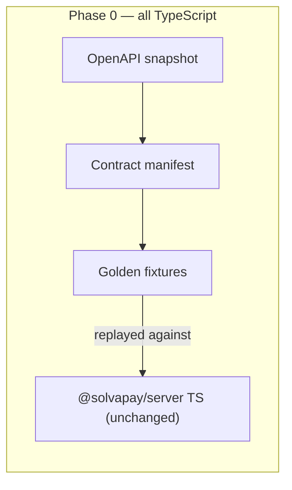

1. **OpenAPI snapshot + regen script.** Check in the filtered `/v1/sdk/*` snapshot plus a script that re-fetches, re-filters (same exclusion of `/v1/sdk/agents`, same prune + placeholder logic as [`generate-types.ts`](../../packages/server/scripts/generate-types.ts)), and diffs.
   *Scope:* snapshot file, `scripts/snapshot-openapi.ts`, CI job.
   *Gotcha:* the backend must be running for regeneration (`localhost:3001`); the CI diff job runs against a recorded spec artifact from the backend repo's CI, not a live server.
   **Done when:** regeneration is idempotent in CI (running it twice produces no diff).

2. **SDK contract manifest.** Write the manifest (§5.1) as the single canonical public-API catalog: operation names, per-language method names, normalization rules, retry/idempotency semantics, error codes + message templates, sync/async availability, and the `createSolvaPay` / `payable` / `protect` / `gate` facade entry points. Include a schema and a validation script.
   *Gotcha:* the catalog must cover all 36 client methods (§2.3 — including `updateProduct` and `getUserInfo`, which are easy to miss because integration docs rarely mention them), every top-level export in [`index.ts`](../../packages/server/src/index.ts), and the `@solvapay/core` helpers.
   **Done when:** manifest validates and a coverage script confirms every catalogued entry point maps to an idiomatic name in all five languages (TS, Python, Ruby, Go, Rust).

3. **Fixture harness.** Build the TS runner that replays JSON fixtures (§5.3) against the TS SDK: injected clock, seeded RNG (idempotency keys), mock transport for `wire` fixtures.
   **Done when:** one sample fixture passes end to end.

4. **Webhook-signature fixtures.** Capture the full §6.1 axis set (accept / five error codes / boundary timestamps / malformed variants) from `verifyWebhook` in [`index.ts`](../../packages/server/src/index.ts) *and* [`edge.ts`](../../packages/server/src/edge.ts) — both implementations must produce identical fixture results (this is itself a useful check that the current duplication hasn't drifted).
   **Done when:** fixtures pass via the harness against both implementations.

5. **Retry-schedule fixtures.** Capture §6.2 from `withRetry` in [`utils.ts`](../../packages/server/src/utils.ts): all three backoff strategies, `shouldRetry` veto paths, `onRetry` ordering, non-Error throwables.
   *Gotcha:* fixtures assert the *computed delay sequence* and callback ordering, not wall-clock time.
   **Done when:** fixtures pass via the harness.

6. **Paywall fixtures.** Classifications (full precedence table from §6.3, including the older-backend fallback paths: missing plan list, missing credit channels, `remaining === 0`), byte-exact gate/nudge copy, `buildPaywallGate` including the PAYG-topup reclassification and conditional field spreading, and `paywallErrorToClientPayload` shapes.
   **Done when:** fixtures pass via the harness.

7. **Client request/response fixtures.** For every one of the 36 `SolvaPayClient` methods: at least one success and one error fixture, plus one fixture per accepted response shape for the polymorphic methods (§2.3: `getCustomer` ×3 shapes, `listProducts` ×2, `listPlans` ×2 + price precedence, `cancelPurchase`/`reactivatePurchase` nested/flat).
   *Gotcha:* seed the RNG so auto-generated idempotency keys are deterministic; assert the `Idempotency-Key` header value in `wire` expectations.
   **Done when:** every method has passing success + error fixtures via the harness.

---

### Phase 1 — Pure, dependency-free logic (first Rust crate)

Everything in this phase is a pure function: no HTTP, no timers, no env. Ships dark — nothing consumes the Rust output yet.

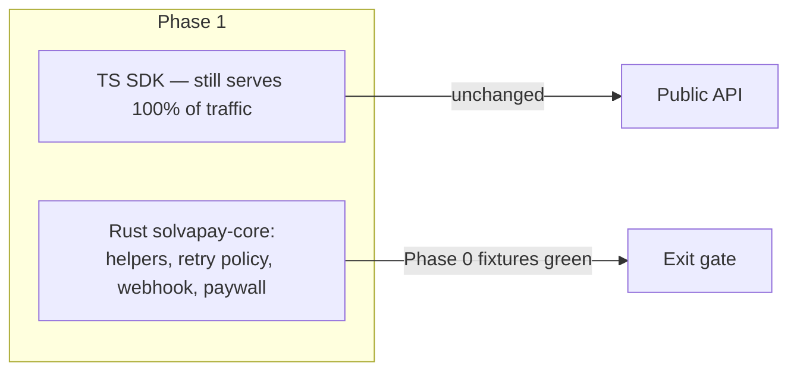

8. **Scaffold cargo workspace.** `solvapay-core` crate (deps: serde, serde_json, hmac/sha2, subtle — serde_json added at step 12 for webhook body parse), workspace layout from §4.3, CI build (stable Rust, pinned toolchain file), Rust fixture runner reading the Phase 0 JSON format, the `wasm32-unknown-unknown` compile check from §7.4, and the no-unwrap Clippy/deny gate (§4.4).
   **Done when:** CI builds native + wasm32, runs an empty fixture suite, and fails if production code uses `.unwrap()` / `.expect()`.

9. **Business details.** Translate [`business-details.ts`](../../packages/core/src/business-details.ts) + [`business-details-public.ts`](../../packages/core/src/business-details-public.ts): country tables, tax-ID derivation and examples, `validateBusinessDetails`, tax-behavior resolution.
   *Gotcha:* the Zod schema's issue shapes are part of the contract (`BusinessDetailsValidationIssue`); the Rust validator must emit the same issue codes/paths so React form errors don't change.
   **Done when:** its fixtures pass in Rust.

10. **Credit display + seller identity.** Translate [`credit-display.ts`](../../packages/core/src/credit-display.ts) (zero-decimal currency table, `creditsToDisplayMinorUnits`, `minorUnitsPerMajor`) and [`seller-identity.ts`](../../packages/core/src/seller-identity.ts) (display-label tables, `resolveSellerIdentityDisplay`).
    **Done when:** their fixtures pass in Rust.

11. **Retry policy engine.** Implement `RetryPolicy` (§4.4): policy computation only, timers stay host-side; document how the facade weaves `shouldRetry`/`onRetry` around it.
    **Done when:** step 5 fixtures pass in Rust (delay sequences + decision points identical).

12. **Webhook verification.** One implementation of §6.1 (parse, tolerance, HMAC-SHA256, constant-time compare via `subtle`), replacing the Node-sync/edge-async split. Clock is an explicit parameter.
    **Done when:** step 4 fixtures pass in Rust.

13. **Paywall state.** Translate `classifyPaywallState`, `buildGateMessage`, `buildNudgeMessage` from [`paywall-state.ts`](../../packages/server/src/paywall-state.ts), including the `reactivation_required` unreachable variant.
    **Done when:** their fixtures pass in Rust, copy byte-for-byte.

14. **Paywall gate.** Translate `buildPaywallGate` from [`paywall-gate.ts`](../../packages/server/src/paywall-gate.ts): `allPaidPlansArePayg`, the `useActivationForTopup` branch, conditional field emission (skip-absent, never `null`).
    **Done when:** its fixtures pass in Rust byte-for-byte, including JSON field-presence assertions.

---

### Phase 2 — Generated DTOs and error model

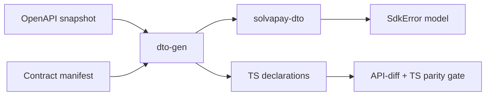

15. **Rust DTO generator.** Build `tools/dto-gen` emitting `solvapay-dto` from the OpenAPI snapshot (replacing the role of [`types/generated.ts`](../../packages/server/src/types/generated.ts) as source of truth). Must reproduce the pipeline's prune/placeholder behavior and preserve `oneOf` discriminators as Rust enums.
    *Gotcha (resolved):* `ProcessPaymentResult` `status` discriminator is non-unique across three `succeeded` branches — emitter special-cases an untagged enum with specific→bare ordering (§15 note 10). Manifest overlays remain step 16.
    **Done when:** generated crate compiles and round-trips the step 7 fixtures (serialize → deserialize → byte-equal JSON).

16. **SDK-only overlays.** Encode every §5.4 overlay from [`types/client.ts`](../../packages/server/src/types/client.ts) in the manifest and generator: `includeCheckoutSession`, `LimitResponseWithPlan`, `CustomerResponseMapped` mapping rules, `TopupProcessResult` projection, auto-recharge/display blocks, MCP bootstrap shapes.
    **Done when:** overlay types generate and compile in Rust and TS outputs.

17. **Error model.** Implement `SdkError` (§4.4) as the single cross-language error surface; map `SolvaPayError` / `PaywallError` construction paths; freeze message templates in the manifest; document the one conversion layer each binding must use (§6.4).
    *Gotcha:* no parallel error enums in transport/bindings — transport failures become `SdkError::Transport`, never a second public error type.
    **Done when:** error fixtures round-trip with stable codes and byte-identical messages; TDD RED→GREEN shown for construction + mapping tests.

18. **TS declarations + parity check.** Generate TS declarations from the manifest; add the API-diff check (generated vs current hand-written exports), the manifest-driven per-language parity/coverage check, and the **signature-parity test suite** for TypeScript (§2.8) — presence, arity/names, defaults, error mapping, sync/async matrix for every catalogued entry point.
    **Done when:** generated declarations are drop-in compatible with current exports (diff empty), the parity check passes for TypeScript, and the TS signature-parity suite is green.

---

### Phase 3 — HTTP client core

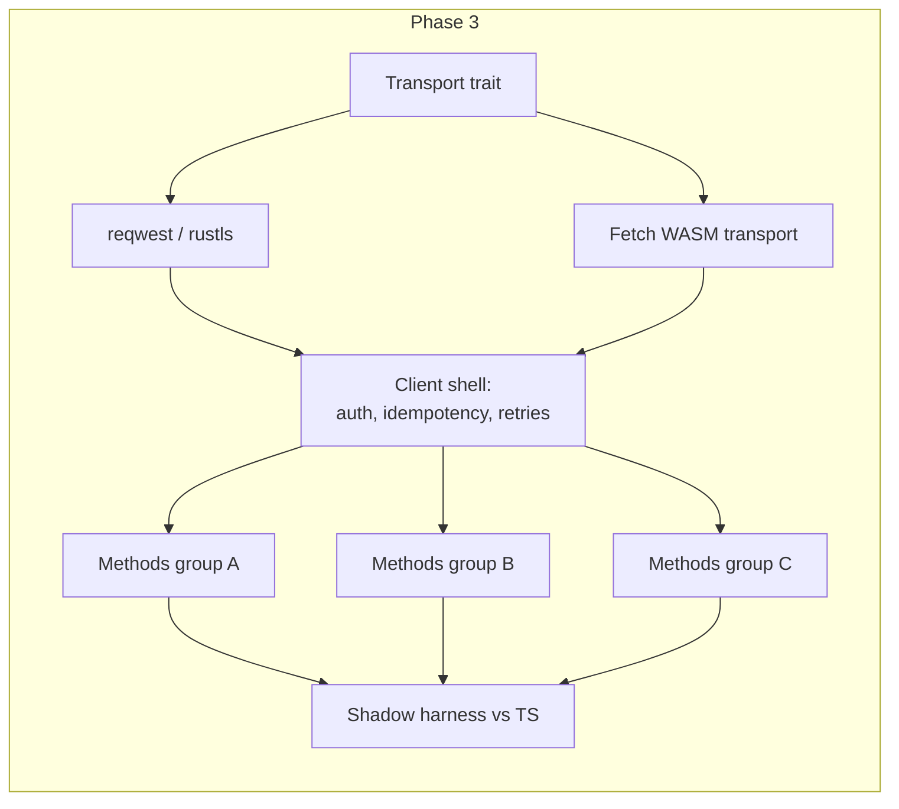

19. **Native transport.** Define the `Transport` trait (§4.4) in `solvapay-transport`; implement `reqwest`/rustls behind it. Respect the `maybe_async_send` cfg discipline from step 8.
    **Done when:** a recorded-fixture mock server round-trips through it (status, headers, body).

20. **WASM Fetch transport.** Implement the Fetch-backed transport behind the same trait via `wasm-bindgen` / `web-sys`, `!Send` futures.
    *Gotcha:* Workers' Fetch lacks some browser request options; keep the transport surface to what both provide (method/url/headers/body — no streaming request bodies in v1).
    **Done when:** the same round-trip passes under `wasm32-unknown-unknown` (wasm-pack test or Workers miniflare harness). ✅ Landed — Node `wasm-bindgen-test` harness + `rust/scripts/wasm-fixture-server.mjs` (per-fixture `/__case/<i>` mounts); see §15 note 14.

21. **Client shell.** Auth header injection, base-URL handling (default `https://api.solvapay.com`), request construction, idempotency-key generation (seeded-RNG hook for fixtures; formats from §2.3), retry wiring of `RetryPolicy` over the transport trait, structured-error mapping from non-OK responses using manifest message templates. Shell default is **no retries** (`max_retries: 0`) — today's TS `client.ts` does not retry and shell fixtures record one wire exchange; `withRetry` semantics stay facade-side. The loop is fully wired and tested so later steps can enable retries without touching it.
    **Done when:** shell-level fixtures pass on both transports.

22. **Client methods, group A — customers, sessions, auth-adjacent.** `createCustomer`, `updateCustomer`, `getCustomer` (three-shape normalization), `assignCredits`, `getCustomerBalance`, `getUserInfo`, `createCheckoutSession`, `createCustomerSession`, `getMerchant`, `getPlatformConfig`.
    **Done when:** their step 7 fixtures pass in Rust.

23. **Client methods, group B — payments, top-ups, checkout.** `createPaymentIntent`, `createTopupPaymentIntent`, `processPaymentIntent` (full 7-branch result), `attachBusinessDetails`, `activatePlan`.
    **Done when:** their fixtures pass, including every `ProcessPaymentResult` branch.

24. **Client methods, group C — the rest.** `checkLimits`, `trackUsage`, `trackUsageBulk`, `cancelPurchase`, `reactivatePurchase` (nested-purchase extraction), products (`get`/`list`/`create`/`update`/`delete`/`clone`, `bootstrapMcpProduct`, `configureMcpPlans`), plans (`list` with price precedence, `create`/`update`/`delete`), `getPaymentMethod`, auto-recharge trio.
    **Done when:** their fixtures pass; a coverage script confirms all 36 methods are implemented.

25. **Shadow-mode harness.** Run TS and Rust clients side by side against the live backend contract-test environment; assert deep equality on normalized responses (see sequence diagram §11.4).
    *Gotcha:* normalize non-deterministic fields (timestamps, generated refs) via the manifest before comparing; log any divergence with the full wire exchange.
    **Done when:** results are identical across the suite.

---

### Phase 4 — Route helper cores

Each step: translate the decision/normalization core of the helpers to Rust, keep `Request` parsing in a thin TS shim, then pass the **existing** `*.test.ts` suites against the binding — the current tests become the conformance gate, no new test-writing needed.

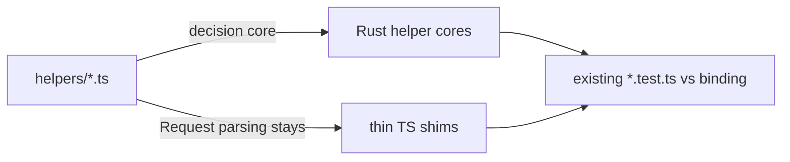

26. [`customer.ts`](../../packages/server/src/helpers/customer.ts), [`auth.ts`](../../packages/server/src/helpers/auth.ts), [`activation.ts`](../../packages/server/src/helpers/activation.ts) — customer sync/ensure logic, authenticated-user resolution core, activation flow.
    **Done when:** existing helper tests pass against the binding.
    **Step 26 note:** conformance landed via golden fixtures (`helper-auth` / `helper-customer-sync` / `helper-activation`) + Rust `fixture-runner` (Phase 1 precedent); literal binding conformance deferred to step 37. Decision-only `ensureCustomer` scope; caches/HTTP stay TS. See migration-map Step 26 decisions + §15 note 18.

27. [`payment.ts`](../../packages/server/src/helpers/payment.ts) (541 LOC — the largest helper; budget the whole session for it), [`payment-method.ts`](../../packages/server/src/helpers/payment-method.ts), [`checkout.ts`](../../packages/server/src/helpers/checkout.ts).
    **Done when:** existing helper tests pass against the binding.
    **Step 27 note:** decision/normalization cores only (`validate*`, `projectPaymentIntentResult`, `projectTopupProcessOutcome`, `resolveReturnUrl`); `payment-method.ts` has nil decision core (orchestration-only). Conformance via `helper-payment` / `helper-checkout` fixtures + characterization suites; balance poll stays host (step 28). See migration-map Step 27 decisions + §15 note 19.

28. [`auto-recharge.ts`](../../packages/server/src/helpers/auto-recharge.ts), [`balance-poll.ts`](../../packages/server/src/helpers/balance-poll.ts) — `BALANCE_RECONCILE_DELAYS_MS` / `TOPUP_BALANCE_POLL_DELAYS_MS` become policy data in Rust; the poll loop's timers stay host-side (same pattern as retries).
    **Done when:** existing helper tests pass against the binding.
    **Step 28 note:** nil auto-recharge decision core (orchestration-only, like payment-method); balance-poll tables + `evaluate_balance_observation` in `solvapay-core::balance_poll`; host-side poll loop / timers (step-11 precedent). Conformance via `helper-balance-poll` fixtures + characterization suites; no TS extract (withRetry precedent). See migration-map Step 28 decisions + §15 note 20.

29. [`purchase.ts`](../../packages/server/src/helpers/purchase.ts), [`renewal.ts`](../../packages/server/src/helpers/renewal.ts).
    **Done when:** existing helper tests pass against the binding.
    **Step 29 note:** decision/normalization cores only (`selectActivePurchases`, cache-ref predicate, `validatePurchaseRef`, cancel/reactivate normalize + classify); settle delay / auth / HTTP stay host. Conformance via `helper-purchase` / `helper-renewal` fixtures + characterization suites; shared `is_truthy` for JS field presence. See migration-map Step 29 decisions + §15 note 21.

30. [`usage.ts`](../../packages/server/src/helpers/usage.ts), [`limits.ts`](../../packages/server/src/helpers/limits.ts), [`plans.ts`](../../packages/server/src/helpers/plans.ts).
    **Done when:** existing helper tests pass against the binding.
    **Step 30 note:** decision/normalization cores only (`projectUsageSnapshot`, `resolveCheckLimitsParams`, `validateListPlansParams`); `trackUsageCore` / auth / HTTP / config guards stay host. Conformance via `helper-usage` / `helper-limits` / `helper-plans` fixtures + characterization suites; frozen productRef message differs from checkout; shared `serialize_whole_f64` for integer emission. See migration-map Step 30 decisions + §15 note 22.

31. [`merchant.ts`](../../packages/server/src/helpers/merchant.ts), [`product.ts`](../../packages/server/src/helpers/product.ts), [`error.ts`](../../packages/server/src/helpers/error.ts) — `handleRouteError` / `isErrorResult` status-mapping core.
    **Done when:** existing helper tests pass against the binding.
    **Step 31 note:** decision/normalization cores only (`mapRouteError`, `isErrorResult`, `validateGetProductParams`); `merchant.ts` / config / HTTP / `console.error` / `instanceof` narrowing stay host. Conformance via `helper-error` / `helper-product` fixtures + characterization suites; reuse `HelperErrorResult` with/without details. See migration-map Step 31 decisions + §15 note 23.

---

### Phase 5 — Paywall decision engine and MCP contracts

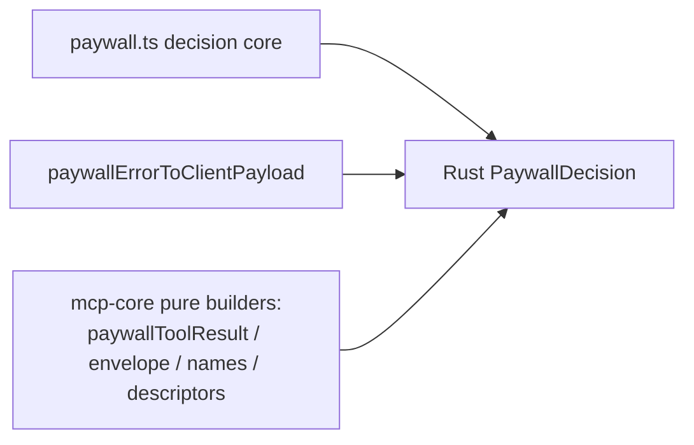

32. **Paywall decision core.** Translate the decision core of [`paywall.ts`](../../packages/server/src/paywall.ts): limit evaluation and `PaywallDecision` production. Handler/context plumbing, the customer-lookup deduplicator, and the 10 s limits cache with optimistic decrement all **stay TS** (§8) — the Rust core is called at the decision point with resolved inputs.
    **Done when:** decision fixtures pass.
    **Step 32 note:** decision cores only (`resolveProductRef`, `evaluateCachedLimits`, `evaluateFreshLimits`, `decidePaywallOutcome`); cache Map/TTL, ensureCustomer, checkLimits HTTP, trackUsage stay host. Gate reuses step-14 `build_paywall_gate` (TS injects `buildGate`). Conformance via `paywall/decision` fixtures + `paywall.unit.test.ts`. See migration-map Step 32 decisions + §15 note 24.

33. **Client payload shapes.** Translate `paywallErrorToClientPayload` (§6.3 stable JSON) and related shapes.
    **Done when:** payload fixtures pass, field-presence exact.
    **Step 33 note:** `solvapay-core::paywall_payload` (`paywall_client_payload` + `PaywallClientPayload`); no TS extract — fixtures bind the existing `@solvapay/server` export directly (withRetry / step-28 precedent). Payment branch never emits `plans` / `confirmationUrl`; `confirmationUrl: ""` is emitted (presence `!== undefined`); input null ≡ absent pinned. Conformance via `paywall/client-payload` (9, was 4). See migration-map Step 33 decisions + §15 note 25.

34. **MCP payload builders.** Translate the pure builders from [`packages/mcp-core`](../../packages/mcp-core): `paywallToolResult` (preserving the deliberate `isError: false`, §6.5) and `response-envelope`.
    **Done when:** `@solvapay/server` and `@solvapay/mcp-core` produce identical payloads from shared fixtures.
    **Step 34 note:** `solvapay-core::mcp` (`paywall_tool_result` + envelope); no TS extract — dual-binding fixtures (`mcp-core` + `server` `formatGate`) prove identical payloads. Typed `PaywallGate` input; `message === gate.message` pin; envelope skip-absent `options` / empty `emittedBlocks`; `assertResponseResult` message frozen in `errors.mcp.messages.rawHandlerReturn`. Conformance via `mcp/` (19). See migration-map Step 34 decisions + §15 note 26.

35. **MCP names + descriptors.** Translate [`tool-names.ts`](../../packages/mcp-core/src/tool-names.ts) (the 12-name `MCP_TOOL_NAMES` table — single source of truth stays single) and the pure parts of [`descriptors.ts`](../../packages/mcp-core/src/descriptors.ts).
    **Done when:** descriptor fixtures pass.
    **Step 35 note:** `solvapay-core::mcp::{tool_names,descriptors}` + TS pure extract `descriptor-metadata.ts` rewired into `buildSolvaPayDescriptors` / `buildSolvaPayPrompts`. Handlers / zod / fs / crypto / CSP / narration stay host. Conformance via `mcp/{tool-names,derive-icons,descriptors,prompts}` (+20 → corpus 431). See migration-map Step 35 decisions + §15 note 27.

---

### Phase 6 — Node binding cutover, then edge/browser WASM

The first phase where Rust serves production traffic.

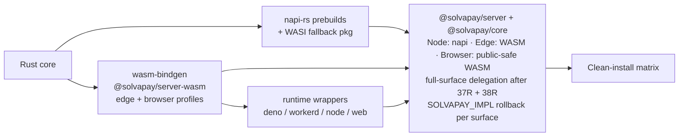

Steps 37/38 cut over `verifyWebhook` only; the `EXP` node reflects the end state of this phase after Step 37R (full-surface Node napi delegation) **and Step 38R** (full-surface edge WASM delegation + browser public-safe subset).

36. **Scaffold napi-rs.** Binding package with prebuilds for the §7.7 platform matrix using napi-rs v3's per-target optional-dependency layout, plus the WASI fallback package. Add the explicit pre-publish artifact gate (every target directory exists and contains exactly the expected `.node`/`.wasm` — the napi CLI warns-and-continues on missing artifacts, so CI must hard-fail instead; §15 note 1).
    **Done when:** `require` works on every matrix target in CI, including a `NAPI_RS_FORCE_WASI` job.

37. **Wire conditional exports.** `@solvapay/server` → napi-rs binding with WASI fallback, behind a version flag (`SOLVAPAY_IMPL=ts|rust` or a package export condition) so rollback is a flag flip, not a republish.
    **Done when:** the existing server test suite is green on the binding, and green again with the flag forced back to TS.
    **Step 37 note:** Cut over Node sync `verifyWebhook` only (full-surface napi later). Runtime flag `SOLVAPAY_IMPL` (`ts` / `rust` / unset→prefer rust with silent TS fallback). Loader is sync `createRequire` in `packages/server/src/webhook-native.ts` (never imported by `edge.ts`). `@solvapay/server` optionalDependency on `@solvapay/server-native` via `workspace:*`; CI gate `node-binding-conformance`. See migration-map Step 37 decisions. **The narrow scope of this step is superseded by Step 37R** (full-surface Node napi cutover, below) — the flag semantics, loader pattern, and CI gate carry forward; only the "verifyWebhook only" scope is redone.

38. **Edge/browser WASM cutover.** Cut `edge.ts` consumers over to the `wasm-bindgen` build (capability-separated: the browser artifact has no secret-key symbols, §7.1). Record the size and cold-start baselines that become the §7.8 budgets.
    *Gotcha:* `@solvapay/mcp-core` under Deno resolves `@solvapay/server` to the edge build — its test suite is part of this step's gate.
    **Done when:** edge export tests + mcp-core Deno tests pass and WASM size/cold-start budgets are recorded and met.
    **Step 38 note:** Narrow cutover — only async edge `verifyWebhook` → `solvapay_core::verify_webhook` via `@solvapay/server-wasm` (wasm-bindgen `web` target + runtime wrappers). Node stays on Step 37 napi. Browser profile exports `wasmVersion` only (symbol audit). Budgets in `rust/bindings/wasm/budgets.json`. See migration-map Step 38 decisions + §15 note 29.

39. **Clean-install smoke tests.** Fresh `npm install` + one native call across the platform matrix (glibc, musl, macOS x64/arm64, Windows; Node 22/24/26) as a permanent CI gate, plus the WASI-fallback install path.
    **Done when:** the gate runs green on main.
    **Step 39 note:** Consumer-path gate (not in-tree). `node-binding-artifacts` packs an immutable `server-clean-install-packages` bundle (`scripts/prepare-clean-install-packages.mjs` → publish-shaped `.tgz` + `manifest.json`). Runtime jobs `node clean install (native, <target>, Node <major>)` (24) and `node clean install (WASI, Node <major>)` (3) download that bundle, `npm install` into an empty temp project, and call public `@solvapay/server` `verifyWebhook` with `SOLVAPAY_IMPL=rust`. Native omits WASI; WASI uses `NAPI_RS_FORCE_WASI=error` and omits every `.node` target. Harness: `scripts/clean-install-smoke.mjs` + `scripts/clean-install-consumer.mjs`; shared targets in `scripts/targets.mjs`. Phase 6 Mermaid `EXP → SMOKE` already models this flow. CI remains PR-triggered (`pull_request` to `main`/`dev`); branch protection on those checks is the “green on main” interpretation. See §15 note 30 + migration-map Step 39 decisions.

37R. **Full-surface Node napi cutover (supersedes Step 37's narrow scope).** Every public method of `@solvapay/server` and `@solvapay/core` becomes a delegation shim over `@solvapay/server-native`: async methods via the napi `tokio_rt` shared runtime, HTTP through the reqwest/rustls transport in `solvapay-transport`, config/error conversion at the binding boundary. `SOLVAPAY_IMPL` rollback semantics extend per-surface (each cut-over surface honors `ts` / `rust` / unset-prefer-rust independently, read per-call as in Step 37). §8 exclusions stay untouched — React, framework adapters, factory ergonomics, deduplicator/caches, MCP registration/middleware glue keep their TS logic. Binding mechanism stays napi-rs per D1 (no C ABI for first-party). Sequenced after Step 39's CI matrix is green and before Phase 7, so Python starts from a proven full-surface binding pattern (§15 notes 31–32).
    Confirmed session-sized sub-steps (Step 37R patch plan / §15 note 32):
    - **37R-a — Binding foundation + client Group A.** New napi `NativeClient` class (constructor: `apiKey`, `apiBaseUrl`) wrapping Rust `SolvaPayClient` over `ReqwestTransport`; async methods for the 10 Group A ops; generalized loader/dispatch module `packages/server/src/native.ts` (supersedes `webhook-native.ts` pattern); `SdkError`→JSON-envelope error mapping in `rust/bindings/node/src/error.rs`. Touched: `rust/bindings/node/src/{lib.rs,error.rs}`, regenerated `index.d.ts`, `packages/server/src/native.ts` (new), `packages/server/src/client.ts` (per-method dispatch), server unit tests. RED: force `SOLVAPAY_IMPL=rust`, inject a fake `NativeClient` via `setNativeClientForTests`; the 10 Group A methods fail (TS-only) until each dispatches. Done when: `test:unit:rust` + `test:unit:ts` green (≥329 each) with `SOLVAPAY_IMPL=rust` and `ts`; Group A client fixtures pass both flags; `node-binding-conformance` green.
    - **37R-b — Client Groups B + C (26 methods).** ✅ Landed (2026-07-21). Mechanical extension of 37R-a for the remaining typed methods (payment/checkout/process, products/plans/purchases/usage/limits/auto-recharge), reusing the Rust `SolvaPayClient` Group B/C impls and normalization already landed in `solvapay-transport`. RED: same fake-client injection; B/C methods fail until dispatched. Done when: full 36-method client fixture corpus green both flags; suites green both flags. See §15 note 34.
    - **37R-c — Helper decision cores + paywall + retry.** ✅ Landed (2026-07-21). Delegate the `@solvapay/core` Phase-4 extracts (`customer-sync`, `payment`, `checkout`, `purchase`, `renewal`, `usage`, `limits`, `plans`, `error`, `product`, `paywall-decision`) and the `@solvapay/server` paywall/retry surfaces (`buildPaywallGate`, `buildGateMessage`, `buildNudgeMessage`, `classifyPaywallState`, `paywallErrorToClientPayload`, `withRetry`) — all **sync** napi calls except that `withRetry` keeps host timers and delegates only `RetryPolicy::next_delay` per attempt. Server route-helper `*Core` functions stay TS *orchestration* shims (auth / `ensureCustomer` / HTTP / `console`) whose *decisions* already live in delegated `@solvapay/core` extracts — catalogued as "host orchestration, decisions delegated," not as non-delegating logic. RED: force `rust`, stub the sync binding functions absent; helper unit + `helper-*` / `paywall/*` / `retry-schedule` fixtures fail until each shim delegates. Done when: those fixtures + unit suites green both flags; `withRetry` delay-schedule fixtures identical both flags. See §15 note 35.
    - **37R-d — `@solvapay/core` pure logic + MCP builders.** ✅ Landed (2026-07-21). Sync napi delegation for `business-details`, `credit-display`, `seller-identity` (`@solvapay/core`) and the MCP payload builders (`McpAdapter.formatGate`, `paywallToolResult`, tool-names/descriptors in `@solvapay/mcp-core`) via per-package install-gated wrappers (`native-core.ts` / `native-mcp.ts`) over `payload_builders.rs`. RED: force `rust`, stub binding fns; `business-details`/`credit-display`/`seller-identity` + `mcp/*` fixtures fail until delegated. Done when: those fixtures green both flags; React package tests run **unmodified**. See §15 note 36.
    - **37R-e — Conformance + gates.** ✅ Landed (2026-07-21). No new delegation; wired the closing gates: full server + core + mcp-core suites + `test:contract` green with `SOLVAPAY_IMPL=rust` and again with `ts`; `pnpm shadow:selftest` IDENTICAL (TS driver pins `SOLVAPAY_IMPL=ts` for fetch wire capture); clean-install smoke extended (`verifyWebhook` + `buildPaywallGate` + host-native `getCustomer` stub); `node-binding-delegation` grep gate (`pnpm delegation:check` + CI job); React tests unmodified. See §15 note 37.
    **Done when:** server + core test suites are green with `SOLVAPAY_IMPL=rust` forced and again with `ts` forced, and the `node-binding-delegation` grep inventory shows every non-§8 export delegating to the binding.

38R. **Full-surface edge WASM cutover (supersedes Step 38's narrow scope).** ✅ Landed (2026-07-21). Edge mirror of 37R: every non-§8 export of the `@solvapay/server` edge surface (+ install-gated `@solvapay/core` / `@solvapay/mcp-core`) delegates to `@solvapay/server-wasm`, with per-surface `SOLVAPAY_IMPL` rollback (`ts` forces TypeScript; `rust`/unset prefers WASM with **no silent fallback** on edge). Async client methods route through a wasm-bindgen `WasmClient` over `FetchTransport`; sync decision/paywall/core/MCP surfaces use `initSync` + one JSON-envelope boundary shared with the napi path. The browser profile additionally gains the public-safe pure-logic subset with async warm-up + sync TS fallback (§7.1 / §7.8). Node stays on the 37R napi path; the two graphs never cross-import (`node:module` / `@solvapay/server-native` / `./native` never enter the edge graph; the browser bundle never ships `WasmClient` / `verifyWebhook` / MCP symbols).
    Sub-steps (§15 note 38):
    - **38R-a — WASM foundation + Group A + `wasm.ts`.** `rust/bindings/wasm`: `Cargo.toml` gains `serde` / `solvapay-dto` / `solvapay-transport` / `wasm-bindgen-futures` (the `edge` feature drives `webhook-verify` + the transport client); `error.rs` gains the envelope helpers (`ok_envelope` / `err_envelope` / `internal_error_envelope` / `parse_args_json` / `run_envelope_sync` / async `run_envelope`) mirroring the node binding (webhook-throw path + `js_sys` moved under `#[cfg(feature = "edge")]`); `args.rs` copied/adapted (no napi); `wasm_client.rs` wraps `Rc<SolvaPayClient>` over `FetchTransport` and exposes all 36 Groups A–C methods as async JSON-envelope fns (`#![cfg(all(feature = "edge", target_arch = "wasm32"))]`). TS: `packages/server/src/wasm.ts` generalizes `webhook-wasm.ts` (`loadWasmBinding`, `getWasmClient`, `callWasm`, `callWasmSync`, `ensureWasmReadySync`, `resolveEdgeImpl`, envelope reconstruct, test seams); `client.ts` `dispatchClient` splits edge→WASM / Node→napi via runtime check + dynamic import; runtime wrappers (`node`/`workerd`/`deno`/`web`) `export *` + `ready()`/`ensureReadySync()`.
    - **38R-b — Groups B + C.** Covered by the same `WasmClient` (all 36) + the `client-wasm-dispatch` unit suite exercising B/C exactly as `client-native-dispatch` does for napi.
    - **38R-c — Sync decisions/paywall/retry via `initSync`.** `decisions.rs` adapted node→wasm (`#[wasm_bindgen(js_name=…)]`, edge-only); `ensureWasmReadySync` (Node edge `readFileSync`+`initSync`; workerd/Deno `initSync`); `edge.ts` installs `installNativeDecisionApi({ callNativeSync: callWasmSync, resolveImpl: resolveEdgeImpl })`; `native-decisions.ts` `dispatchSync` re-gated on install (dropped the `process.versions.node` check).
    - **38R-d — core + mcp-core install on edge.** `edge.ts` also installs `installNativeCoreApi` + `McpAdapter.formatGate` and publishes `Symbol.for('solvapay.nativeSyncApi')` for mcp-core; `payload_builders.rs` exports the sync builders (public-safe subset dual-profile; MCP subset edge-only); `native-core.ts` / `native-mcp.ts` `shouldAttempt` re-gated on install. Deno smoke stays green; React unmodified.
    - **38R-e — Browser profile public-safe logic.** Browser feature exports business-details / credit-display / seller-identity sync fns only (no webhook / no `WasmClient`); `check-browser-symbols.mjs` allowlist extended; opt-in `@solvapay/core/browser-wasm` `warmBrowserCoreWasm()` async-warms + installs WASM as the core sync dispatch (main entry stays TS so React is unaffected); browser budget re-recorded with rationale.
    - **38R-f — Gates.** `DELEGATION_MARKERS` gains `callWasm` / `callWasmSync` / `verifyWebhookWasm`; both-flags server/core/mcp-core suites + delegation check + symbol audit + budgets + Deno edge smoke + clean-install orchestrator unit green.
    - **38R-g — Docs.** This section + §7.1 / §7.8 / §13 gate row / §15 note 38 / Phase 6 Mermaid + migration-map Step 38R.
    **Done when:** the edge export suites are green with `SOLVAPAY_IMPL=rust` and again with `ts`, the browser symbol audit + WASM budgets pass, the `node-binding-delegation` inventory recognizes edge markers, and the Deno edge smoke exercises the async webhook plus sync decision/paywall/MCP dispatch end-to-end.

---

### Phase 6G — Binding-glue generator (retrofit, then forward)

The §5.6 pipeline generates facade signatures; Phase 6G adds the §5.7 binding-glue emitters and **proves them against the hand-written 37R/38R shims before any new language depends on them** — the same "so Python starts from a proven pattern" sequencing that put 37R/38R before Phase 7. `G`-suffixed step ids preserve the 1–55 numbering (like `37R`/`38R`). Docs-only prerequisite for Phases 7–10; no new production surface.

39G-a. **Binding-boundary IR + manifest `bindings:` section.** Add the `bindings:` section + Zod schema to the contract manifest; lower it into `Ir.binding_symbols` in [`rust/tools/dto-gen/src/ir.rs`](../../rust/tools/dto-gen/src/ir.rs) (§5.7 descriptor: core fn path, per-toolchain export names, ordered JSON-args with boundary types + required/optional + host-injected flags, `split_path_refs` rules, return shape, sync/async, envelope mode). Enumerate today's hand-written symbols (the `decisions.rs` / `payload_builders.rs` / client-dispatch fns across node + wasm). Add the catalog-reconciliation cross-check (every non-§8 core symbol ↔ exactly one `BindingSymbol`).
    **Done when:** `dto-gen` builds the binding IR, `pnpm manifest:check` reconciliation is green, and regenerating the IR from the same inputs is byte-identical (idempotence gate).

39G-b. **Rust shim emitters (napi + wasm) + retrofit proof.** Emit `args.rs` / `decisions.rs` / `payload_builders.rs` / client-dispatch for both toolchains from the binding IR; regenerate over the committed 37R (node) and 38R (wasm) files and prove **byte-identical**.
    *Gotcha:* the wasm crate has no `webhook-verify` feature (the `edge` feature drives it) and is `panic=abort` (no `catch_unwind`); the emitter must reproduce the `#[cfg]` gating exactly (§15 note 38) or the diff fails.
    **Done when:** regenerated node + wasm shims diff-clean against the committed hand-written output, both-`SOLVAPAY_IMPL`-flag server/core/mcp-core suites stay green on the generated shims, and the hand-edit header gate covers the shim files.

39G-c. **Native-side marshalling emitters (TS).** Emit the `native.ts` / `wasm.ts` dispatch + the envelope → `SolvaPayError` / `PaywallError` reconstructor from the IR; regenerate over the committed 37R/38R TS glue and prove byte-identical.
    **Done when:** server / core / mcp-core suites are green under both flags on the generated glue, and `node-binding-delegation` is unchanged (the generated markers match the committed inventory).

---

### Phase 7 — Python

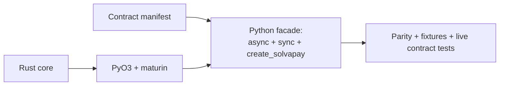

40. **Scaffold PyO3/maturin.** Package with the tokio runtime via `pyo3-async-runtimes`, GIL-release plumbing for the sync facade, `abi3` wheel config, thread-safe module declaration for free-threaded CPython (§15 note 2). The Rust-side PyO3 binding shims are **generated from the §5.7 emitter** (add the PyO3 toolchain column to the binding-boundary matrix + the PyO3 emitter), not hand-written — this step scaffolds the package/runtime plumbing the generated shims plug into.
    **Done when:** wheels build for the §7.7 matrix and a hello-world call round-trips async *and* sync.

41. **Generate the Python facade.** Async + blocking-sync surfaces from the IR (§5.6) (snake_case names, `.pyi` stubs), the full portable surface, and the idiomatic `create_solvapay` / `@sp.payable` decorator / `sp.gate` (§2.4) driven by the shared decision core. The Python binding glue (PyO3 shims + native-side marshalling/reconstruction) is generated alongside the facade signatures from the §5.7 emitter. Add the Python **signature-parity test suite** (§2.8) — same assertion classes as the TS suite from step 18 (presence, arity/names, defaults, `SdkError` mapping, sync/async matrix).
    **Done when:** shared fixture conformance passes, the per-language parity check confirms every catalogued entry point with matching semantics, and the Python signature-parity suite is green and structurally equivalent to the TS suite.

42. **Live contract tests + publish.** Run the backend contract suite from Python; wire PyPI publishing into the release train with version stamping (§7.7).
    **Done when:** contract tests green and the wheel installs cleanly into a fresh venv on each matrix platform.

---

### Phase 8 — Ruby

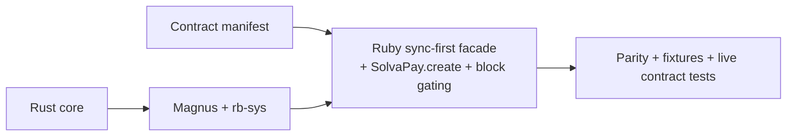

43. **Scaffold Magnus/rb-sys.** Gem with `extconf.rb` via the `rb_sys` gem + `rake-compiler`, GVL-release plumbing around blocking calls, precompiled platform gems via `rb-sys-dock`, source gem as fallback (§15 note 3). The Rust-side Magnus binding shims are **generated from the §5.7 emitter** (add the Magnus toolchain column + emitter), not hand-written.
    **Done when:** platform gems build and a hello-world call round-trips.

44. **Generate the Ruby facade.** Sync-first surface from the IR (§5.6) (snake_case, keyword args, RBS signatures), the full portable surface, and the idiomatic `SolvaPay.create` / block-based `protect` / `sp.gate` (§2.4) driven by the shared decision core. The Ruby binding glue (Magnus shims + native-side marshalling/reconstruction) is generated alongside the facade signatures from the §5.7 emitter. Add the Ruby **signature-parity test suite** (§2.8) — same assertion classes as the TS (step 18) and Python (step 41) suites.
    **Done when:** shared fixture conformance passes, the per-language parity check confirms every catalogued entry point with matching semantics, and the Ruby signature-parity suite is green and structurally equivalent to the TS/Python suites.

45. **Live contract tests + publish.** Run the backend contract suite from Ruby; wire RubyGems publishing into the release train.
    **Done when:** contract tests green and the gem installs cleanly (`gem install` on each matrix platform, plus one source-compile check).

---

### Phase 9 — Rust public crate (`solvapay` on crates.io)

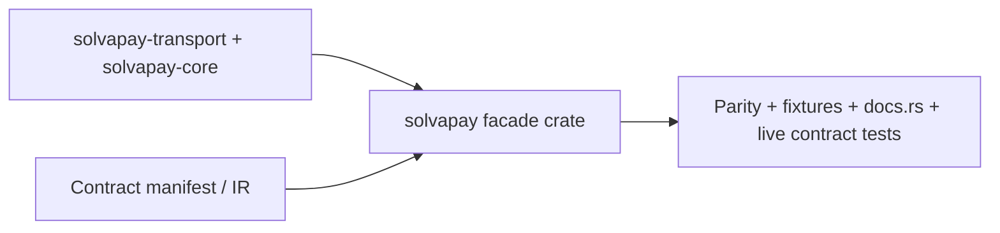

46. **Scaffold the `solvapay` facade crate.** Carve idiomatic public API out of `solvapay-transport` + `solvapay-core`: re-exports, `Client::new`, `gate` / payable-style ergonomics (§2.4), optional `blocking` feature. No new semantic logic — ergonomics only. Workspace layout from §4.3; MSRV pinned; docs.rs metadata.
    *Gotcha:* keep `solvapay-core` / `solvapay-transport` as the internal crates; only `solvapay` is the public crates.io name consumers depend on. Version the facade with the release train (§7.7, §15 note 5).
    **Done when:** crate builds, a hello-world async call round-trips against a mock transport, and `blocking` feature compiles.

47. **Generate Rust facade signatures + signature-parity suite.** Emit `pub` signatures from the IR (§5.6); add the Rust **signature-parity test suite** (§2.8) — same assertion classes as TS/Python/Ruby — plus fixture conformance against Phase 0 goldens.
    **Done when:** shared fixture conformance passes, the per-language parity check confirms every catalogued entry point, and the Rust signature-parity suite is green and structurally equivalent to the TS/Python/Ruby suites.

48. **crates.io publish + docs.rs + live contract tests.** Wire publishing into the release train; run the backend contract suite from the Rust facade; verify docs.rs builds.
    **Done when:** contract tests green, `cargo add solvapay` installs cleanly on a fresh project, and docs.rs renders the public API.

---

### Phase 10 — Go (wazero + embedded WASM)

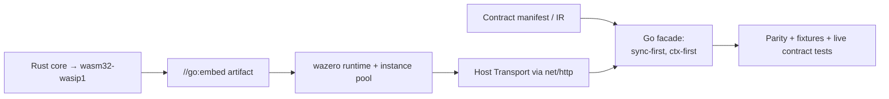

49. **Scaffold wazero binding.** Build the core for `wasm32-wasip1`; embed via `//go:embed`; load with wazero (pure Go, zero cgo). Implement the `Transport` trait contract as a wazero host function backed by `net/http`. Instance pool for concurrent calls (one WASM instance is single-threaded). Map `ctx` cancellation to instance teardown; map `SdkError` → `solvapay.Error` retrievable via `errors.As` (§15 note 4).
    *Gotcha:* do **not** use cgo — consumer cross-compilation and go-module distribution forbid it (§4.6). Resolve whether the `.wasm` artifact is committed in-repo or attached to release tags before this step's cutover (§13).
    The Rust-side `wasm32-wasip1` export shims (the wazero host-function surface over the JSON envelope) are **generated from the §5.7 emitter** (add the wazero-export toolchain column + emitter), not hand-written.
    **Done when:** `go test` round-trips a hello-world call through the embedded WASM + host transport, including a concurrent call that exercises the instance pool.

50. **Generate the Go facade + signature-parity suite.** Sync-first surface from the IR (§5.6): exported PascalCase names, `ctx context.Context` first, option structs, `Payable`/`Gate` ergonomics (§2.4). The Go binding glue (wazero-export shims + host-side marshalling/reconstruction) is generated alongside the facade signatures from the §5.7 emitter. Add the Go **signature-parity test suite** (§2.8) — same assertion classes as the other surfaces.
    **Done when:** shared fixture conformance passes, the per-language parity check confirms every catalogued entry point, and the Go signature-parity suite is green and structurally equivalent to the other four suites.

51. **Live contract tests + go module release wiring.** Run the backend contract suite from Go; wire tagged module releases into the release train (§7.7).
    **Done when:** contract tests green and `go get` installs cleanly into a fresh module on each supported GOOS/GOARCH.

---

### After cutover — deletion and C ABI (one deletion step per area, in this order)

52. **Delete superseded TS in `@solvapay/core`.** Business-details/credit-display/seller-identity implementations go; the package keeps its export surface as a facade over the binding.
    *Depends on Step 37R* (and 38R for edge consumers): deletion assumes every export already delegates to the binding — the narrow Step 37/38 cutovers alone do not wire that.
    **Done when:** package tests green with Rust-only logic.

53. **Delete superseded TS in `@solvapay/server`.** `withRetry` internals, both `verifyWebhook` bodies, paywall-state/gate, client method bodies, helper decision cores. Facades, adapters, caches, and deduplicator stay.
    *Depends on Steps 37R and 38R*: Node and edge surfaces must both be delegating before their TS bodies can be deleted.
    **Done when:** server suite green; a grep gate confirms no dead duplicated logic remains.

54. **Publish the optional C ABI.** cbindgen headers, opaque handles, `solvapay_free_*` functions, `SOLVAPAY_ABI_VERSION`, panic containment per §7.6. The third-party C surface reuses the **§5.7 envelope emitter** — the same JSON-envelope marshalling generated for the first-party toolchains (add the C toolchain column + cbindgen emitter), so the C ABI is not a separately hand-written boundary.
    **Done when:** the header compiles in a C smoke test that exercises create/call/free and a deliberate handle-misuse error path.

55. **Promote all compatibility gates.** API diff, cross-surface parity/coverage, homogeneous signature-parity suites for all five surfaces (§2.8), signature-generation reliability gates (§5.6), fixture conformance for all bindings + surfaces, no-unwrap Clippy/deny, size budgets, clean-install matrices, fuzzing (webhook parser, FFI JSON boundaries, C ABI handle misuse) — all required checks on main.
    **Done when:** all gates are required on main and a dry-run release passes end to end.

---

### MCP-authoring adapters — post-cutover future track (layer 3)

A distinct, **post-cutover future track** — not part of steps 1–55 (which stay contiguous and deliver core-surface parity, §2). It sits after Phase 10/Go because it depends on the per-language facades those phases ship. It delivers the additive commitment named in §2.5: turnkey **paid-MCP authoring** parity across languages, via a thin `registerPayable(...)` / `ctx.respond(...)` ergonomic in each ecosystem. This is the same category as `@solvapay/react` or a future FastAPI/Rack/Axum adapter (§2.5, §8) — idiomatic framework glue, **NOT** core, and **NOT** emitted by the §5.6/§5.7 generators. Every artifact here is **hand-written** (unlike the `generated — do not edit` facades and binding glue).

The surface decomposes into three layers:

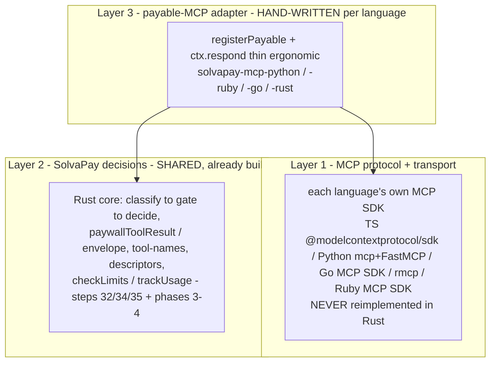

- **Layer 1 (reused, never Rust):** the MCP protocol and transport come from each ecosystem's own MCP SDK. Maintaining a competing five-language MCP implementation in Rust would be strictly worse than reusing the mature ecosystem SDKs, so layer 1 is *never* reimplemented in the core.
- **Layer 2 (shared, already built):** the SolvaPay decision core — classify → build gate → decide, `paywallToolResult`/envelope, tool-names, descriptors, `checkLimits`/`trackUsage` — is the Rust core delivered by steps 32/34/35 and Phases 3–4. Gate copy and structured content are byte-identical across languages because they come from this one core.
- **Layer 3 (new, hand-written):** the only new surface — a thin per-language facade that wraps a merchant handler with the layer-2 pre-check and registers it on a layer-1 server object. This mirrors what `@solvapay/mcp` does today via [`registerPayableTool.ts`](../../packages/mcp/src/registerPayableTool.ts) + [`payable-handler.ts`](../../packages/mcp-core/src/payable-handler.ts) (whose header already anticipates future adapters) over [`buildMcpServer.ts`](../../packages/mcp/src/internal/buildMcpServer.ts).

Lettered step ids keep steps 1–55 intact (same convention as `37R` / `6G`). The canonical authoring skill is `create-mcp-app`.

- **MA-0 — Shared MCP-authoring conformance fixtures + adapter contract.**
  **Done when:** a language-neutral fixture set (a paywalled tool → allow round-trip + gate round-trip, with byte-identical gate copy sourced from layer 2) exists, and the TS `@solvapay/mcp` adapter replays it green as the reference implementation.
- **MA-Py — `solvapay-mcp` (Python) over `mcp`/FastMCP.**
  **Done when:** the shared MCP fixtures (MA-0) pass through the Python adapter; a paywalled tool round-trips allow + gate on Python's native MCP SDK (`mcp`/FastMCP, layer 1); the `registerPayable` ergonomic reaches parity with the TS reference.
- **MA-Rb — `solvapay-mcp` (Ruby) over the Ruby MCP SDK.**
  **Done when:** the shared MA-0 fixtures pass through the Ruby adapter; a paywalled tool round-trips allow + gate on Ruby's native MCP SDK (layer 1); parity with the TS `registerPayable` ergonomic.
- **MA-Go — `solvapay-mcp` (Go) over the Go MCP SDK.**
  **Done when:** the shared MA-0 fixtures pass through the Go adapter; a paywalled tool round-trips allow + gate on the Go MCP SDK (layer 1); parity with the TS `registerPayable` ergonomic.
- **MA-Rs — `solvapay-mcp` (Rust) over `rmcp`.**
  **Done when:** the shared MA-0 fixtures pass through the Rust adapter; a paywalled tool round-trips allow + gate on `rmcp` (layer 1); parity with the TS `registerPayable` ergonomic.

---

## 10. Migration and verification roadmap

### 10.1 Migration principles

- Follow §9 in order; the exit gate of each phase must be green before the next begins.
- Preserve existing npm package names and React imports throughout; Python/Ruby/Go packages and the crates.io `solvapay` crate are the intentionally new artifacts.
- Ship every phase behind the existing TypeScript surface (no public API changes) until Phases 7–10 add new packages.
- Rust serves zero production traffic until step 37, and step 37 is flag-reversible.
- Every Rust step follows aggressive RED→GREEN→REFACTOR (TDD rule, §9); no implementation before a failing test.
- Production Rust never uses `.unwrap()` / `.expect()`; errors flow through the single `SdkError` model into each surface (§4.4, §6.4).
- All five surfaces share the same signature-parity test shape for the portable public API (§2.8), generated from the IR (§5.6).

### 10.2 Rollback boundaries

| Surface | Rollback strategy |
| --- | --- |
| `@solvapay/server` conditional exports | Version flag (step 37) forces the previous TS path or WASI path without a republish |
| `verifyWebhook` Node-sync / edge-async | Thin facades keep both signatures; the core swap is internal and independently revertible |
| Fetch-runtime validation | Adapter tests remain TS; helpers can point back at TS cores during rollback (step 53 is deliberately late) |
| Deno / Workers | WASM build pinning; size/cold-start gate rejects a broken WASM before publish |
| React behavior | Unmodified React tests at every cutover; React never binds to native directly |
| Python / Ruby / Go / Rust crate | New packages — rollback is yanking a release; no existing consumers at risk |

### 10.3 CI gates

| Gate | Purpose | Introduced |
| --- | --- | --- |
| OpenAPI snapshot diff | Backend drift is a visible PR | Step 1 |
| Manifest validation + coverage | Catalog completeness across five languages | Step 2 |
| Generated-diff checks | Snapshot + generated DTOs/declarations in sync | Steps 15–18 |
| Signature-generation reliability | Idempotence, committed-output drift, hand-edit detection, golden signature snapshots (§5.6) | Steps 15–18; enforced for all emitters by step 55 |
| TS API diff | No silent public-API drift | Step 18 |
| Per-language parity/coverage | Every surface exposes every catalogued entry point with matching semantics | Steps 18, 41, 44, 47, 50 |
| Homogeneous signature-parity suites | Same assertion classes (presence, arity/names, defaults, error mapping, sync/async) for all five surfaces (§2.8); suites themselves generated from IR | Steps 18, 41, 44, 47, 50 |
| Shared fixture conformance | All bindings + all five surfaces replay the golden set | Step 8 onward |
| No-unwrap / no-expect deny | Production Rust may not panic via `.unwrap()` / `.expect()` (§4.4) | Step 8 |
| wasm32 no-tokio compile check | Runtime-agnostic core stays agnostic | Step 8 |
| Shadow mode | Live-backend identity TS vs Rust (`pnpm shadow:run`; offline `pnpm shadow:selftest` in CI). Live CI gate is manual-dispatch until a hosted contract-test environment exists | Step 25 |
| Clean-install smoke tests | Platform matrix, incl. WASI fallback | Step 39 |
| node-binding-delegation | Grep inventory: every non-§8 `@solvapay/server` / `@solvapay/core` export routes through the napi binding (allowlist in `contract/delegation-allowlist.json`); fails on missing markers or stale allowlist symbols | Step 37R-e ✅ |
| Platform build matrices | napi-rs / wheels / gems / WASM / go module / crates.io | Steps 36, 40, 43, 46, 49 |
| Pre-publish artifact gate | Every expected `.node`/`.wasm`/wheel/gem present (napi CLI won't hard-fail for us) | Step 36 |
| Browser-WASM symbol audit | No secret-key ops in browser build | Step 38 |
| Fuzzing | Webhook parser, FFI JSON boundaries, C ABI handle misuse | Step 55 |
| Performance regression | WASM size, cold start, request-overhead budgets (§7.8) | Step 38 onward |
| Binding-glue regen (drift / idempotence / hand-edit) | Generated §5.7 shims + native glue in sync, deterministic, and header-protected against hand edits | Phase 6G (39G-b Rust shims ✅; 39G-c native glue ✅) |
| Binding-boundary catalog reconciliation | Every non-§8 core symbol has exactly one `BindingSymbol` and vice-versa (§5.7) | Phase 6G (39G-a) |
| Retrofit byte-identical proof | Regenerated node + wasm shims byte-identical to committed 37R/38R output; both-flag suites green on generated glue | Phase 6G (39G-b Rust shims ✅; 39G-c native glue ✅) |

### 10.4 Testing strategy summary

- Phase 0 fixtures are the behavioral golden set; §5.3 defines the format once for all runners.
- The Rust fixture runner (step 8) reuses the same JSON files — no translation layer between TS-captured and Rust-verified behavior.
- Every Rust step is RED→GREEN→REFACTOR: failing tests first, minimal green, then refactor (TDD rule, §9).
- Existing `*.test.ts` helper suites become binding conformance tests in Phase 4 without modification.
- React package tests run unmodified at every cutover step.
- Shadow mode (step 25) is the live-backend identity check before any Node cutover.
- Python/Ruby/Go/Rust-crate run the same fixtures plus the live contract suite (steps 42, 45, 48, 51).
- Signature-parity suites (§2.8) are the same *type* of test in every surface language — locking the portable function signatures, not only behavioral fixtures — and are generated from the IR (§5.6).

---

## 11. Sequence diagrams (subtle flows)

### 11.1 Client request with retries

```mermaid
sequenceDiagram
  participant App as Language facade
  participant Bind as Binding (napi / wasm / PyO3 / Magnus / wazero) or native Rust facade
  participant Shell as Rust client shell
  participant Pol as RetryPolicy (core, pure)
  participant Tr as Transport trait
  participant API as SolvaPay API

  App->>Bind: checkLimits / check_limits / CheckLimits(...)
  Bind->>Shell: typed request (+ idempotency key if applicable)
  Shell->>Tr: send(request)
  Tr->>API: HTTP
  API-->>Tr: 429 / 5xx
  Tr-->>Shell: error (retryable)
  Shell->>Pol: next_delay(attempt=0)?
  alt None (exhausted)
    Pol-->>Shell: None
    Note over Shell: reject last error — no shouldRetry / onRetry
  else Some(delay)
    Pol-->>Shell: Some(500ms)
    Note over Shell,Bind: facade may call shouldRetry then onRetry (host closures)
    Note over Shell,Bind: host-side sleep — binding owns the timer; core has none
    Shell->>Tr: send(request) [same idempotency key]
    Tr->>API: HTTP
    API-->>Tr: 200 + body
    Tr-->>Shell: bytes
  end
  Shell->>Shell: normalize (§2.3 quirks)
  Shell-->>Bind: Result<T, SdkError>
  Bind-->>App: Promise / awaitable / sync return / exception / error
```

### 11.2 Webhook verification

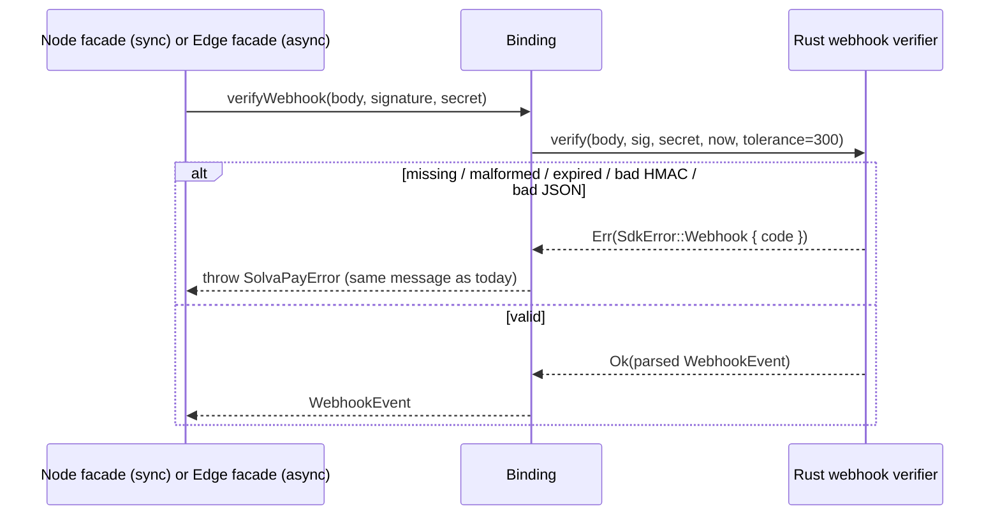

### 11.3 Paywall decision path

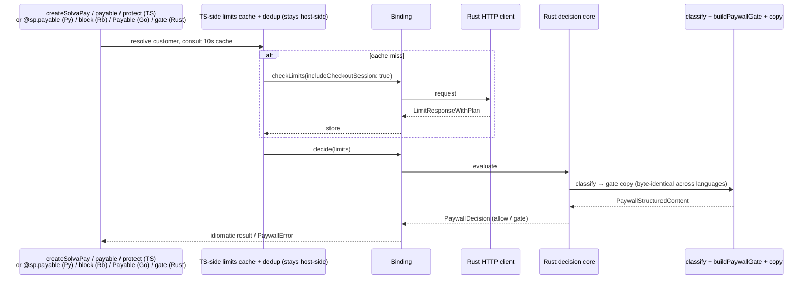

### 11.4 Shadow-mode comparison (step 25)

> **Phase 3 note:** Until the napi binding exists (step 36), the Rust side is invoked via a CLI subprocess (`rust/tools/shadow-invoker`) rather than “via binding”. The sequence is otherwise unchanged.

```mermaid
sequenceDiagram
  participant Har as Shadow harness
  participant TS as TS SolvaPayClient
  participant RS as Rust client (via CLI invoker)
  participant API as Backend (contract env)

  Har->>TS: method(fixture args)
  Har->>RS: method(fixture args)
  TS->>API: HTTP
  RS->>API: HTTP
  API-->>TS: response
  API-->>RS: response
  Har->>Har: normalize volatile fields (manifest rules)
  Har->>Har: assert deep equality; on divergence, dump both wire exchanges
```

---

## 12. Explicit decisions

| ID | Decision | Rationale anchor |
| --- | --- | --- |
| D1 | Specialized bindings (napi-rs, wasm-bindgen, PyO3, Magnus, wazero); first-party Rust facade crate; optional C ABI for third parties only | §4.6 |
| D2 | Cross-surface API parity across five surfaces is a CI-enforced success criterion, driven by one manifest + canonical IR | §2, §5.6, §10.3 |
| D3 | std-based core with size discipline; not `no_std` | §7.2 |
| D4 | Async Rust; runtime-agnostic core (`Send` behind cfg, no tokio in signatures); bindings own event loops and timers | §7.3–7.5 |
| D5 | Checked-in filtered OpenAPI snapshot + SDK contract manifest as the dual generation inputs; emitters consume only the compiled IR | §5.1, §5.6 |
| D6 | React, framework adapters, factory ergonomics, caches/dedup, auth/next/cli stay TypeScript | §8 |
| D7 | Migration is 55 session-sized steps (Phases 0–10) with per-step "done when" gates; Rust serves no traffic before step 37, which is flag-reversible | §9, §10.2 |
| D8 | This document is living: research findings and diagram updates land in the same session as code | Research rule, §15 |
| D9 | Browser WASM is `wasm-bindgen`, not napi-rs's WASI artifact (SharedArrayBuffer / cross-origin-isolation constraint); napi-rs WASI serves only as the Node no-prebuild fallback | §4.5, §15 note 1 |
| D10 | No env-var reads and no timers inside the Rust core; facades own both | §4.2 |
| D11 | Single `SdkError` taxonomy with one conversion layer per binding; no `.unwrap()` / `.expect()` in production Rust | §4.4, §6.4, §7.6 |
| D12 | Aggressive RED→GREEN→REFACTOR TDD for every Rust step | TDD rule, §9 |
| D13 | Homogeneous signature-parity test suites across all five surfaces (TS, Python, Ruby, Go, Rust), generated from the IR | §2.8, §5.6, §10.3 |
| D14 | Go via wazero + embedded `wasm32-wasip1` WASM, not cgo — pure Go distribution, host `net/http` transport, instance pool for concurrency | §4.5–4.6, §7.5, §15 note 4 |
| D15 | First-party `solvapay` Rust crate on crates.io is a public surface with the same parity obligations as the other wrappers | §4.3, §4.5, Phase 9, §15 note 5 |
| D16 | The JSON envelope over string (`{"ok":true,"value":…}` \| `{"ok":false,"error":<SdkError>}`) is the universal binding ABI; the binding-glue layer around it is **generated, not hand-written** (no first-party cbindgen — the optional C ABI reuses the same envelope emitter) | §5.7, §4.6, §15 note 32 |
| D17 | The per-core-symbol binding-boundary descriptor lives in the manifest `bindings:` section, reconciled against the catalog; IR-driven §5.7 emitters produce every toolchain shim (napi/wasm/PyO3/Magnus/wazero/C) + native-side marshalling | §5.7, §5.6, Phase 6G |

---

## 13. Unresolved implementation gates

Intentionally open until the phase that needs them; resolve with research + a PR that updates this section.

| Gate | Resolve by | Notes |
| --- | --- | --- |
| Exact WASM size / cold-start numeric budgets | Step 38 baseline; re-recorded step 38R | **Resolved (step 38; re-recorded 38R):** see `rust/bindings/wasm/budgets.json` — after the full-surface cutover browser gzip **63633** bytes / cold ~**13.3 ms** (public-safe subset + serde; lazy + opt-in) and edge diagnostic gzip **298838** / ~**16.4 ms** (full transport client + all sync envelopes; lazy); both carry rationale notes; regression >10% needs approval + `--record` |
| Final npm optional-dependency layout + package names for prebuilds | Steps 36–37 | **Resolved (step 37):** `@solvapay/server-native` + per-target `@solvapay/server-native-<platform>` + `-wasm32-wasi` via `create-npm-dirs`; `@solvapay/server` optionalDependency `workspace:*` on `@solvapay/server-native` |
| Python package name on PyPI (`solvapay` vs scoped) and minimum CPython (abi3 floor) | Steps 40–42 | Check PyPI name availability early — before step 40 |
| Ruby gem name + versioning scheme; source-gem toolchain floor | Steps 43–45 | Check RubyGems name availability early |
| Go module path naming (`github.com/solvapay/solvapay-go` vs vanity import) | Steps 49–51 | Decide before first tagged release; vanity import needs DNS + hosting |
| Whether the Go WASM artifact is committed in-repo or attached to release tags | Before step 49 cutover | Committed = simpler `go get`; release-attached = smaller clone, more release plumbing |
| WASM instance-pool sizing strategy for Go (fixed pool vs demand; max concurrent instances) | Step 49 | One instance is single-threaded; pool size vs memory trade-off |
| crates.io name reservation for `solvapay` (and whether internal crates are published) | Before step 46 | Check early; reserve the name; decide publish set vs facade-only |
| ~~Whether the shared tokio runtime in napi-rs is per-addon or per-process~~ | **Resolved (step 36)** | Per-addon via napi `tokio_rt` feature; safe under `worker_threads` (see §15 note 28) |
| ~~37R binding async surface (Promise conversion, error mapping, cancellation)~~ | **Resolved (37R patch plan)** | JSON-envelope `String` boundary + `#[napi] async fn` → Promise on per-addon `tokio_rt`; no cancellation surface (see §15 note 32) |
| ~~37R per-surface `SOLVAPAY_IMPL` rollback semantics~~ | **Resolved (37R patch plan)** | Per-call `resolveImpl(surface)` in generalized `native.ts`; `ts` / `rust` / unset→prefer-rust-silent-TS-fallback (see §15 note 32) |
| ~~Process-payment OpenAPI discriminator fix — backend republish vs manifest overlay; ownership~~ | **Resolved (step 15)** | Snapshot has real `oneOf` + `discriminator.propertyName: status` over 7 named branches; non-unique `succeeded` handled in `dto-gen` via `#[serde(untagged)]` with specific→bare ordering (see §15 note 10) |
| ~~`includeCheckoutSession` OpenAPI republish~~ | **Resolved (step 15)** | `CheckLimitRequest.includeCheckoutSession` is present in `sdk-v1.snapshot.json` |
| Free-threaded CPython: declare `gil_used = false` from day one, or after an audit? | Step 40 | PyO3 0.28 defaults modules to thread-safe; audit is cheap if core stays lock-light (§15 note 2) |
| Fuzz corpus seed strategy (webhook payloads, malformed signatures, FFI JSON) | Step 55 | Seed from Phase 0 fixtures + mutation |
| Whether UniFFI is ever used for a *sixth* language later | Only if a new language can't use a specialized binding | §4.6 |
| How host-injected args (`nowMs` / clock / seeded RNG) and path-ref splits are declared in the binding-boundary descriptor | Step 39G-a | **Resolved (39G-a):** each `bindings:` arg carries `hostInjected: bool` (default false); path splits are an ordered `splitPathRefs: string[]` on the symbol (e.g. `["customerRef"]`, `["productRef","planRef"]`). See §15 note 40 |
| Whether a later proc-macro layer auto-derives binding-boundary descriptors from the Rust core signatures | Deferred (post-Phase 6G) | The manifest `bindings:` section is the source of truth for now; a derive macro is only worth it if the descriptor set grows faster than the manifest can track |
| Hosted contract-test environment for CI shadow live runs | Post–step 25 | Offline `pnpm shadow:selftest` is in CI; live `pnpm shadow:run` is manual-dispatch (`.github/workflows/shadow.yml`) until a shared sandbox/contract env + secrets exist |
| Turnkey paid-MCP authoring parity scope + naming of each `solvapay-mcp-<lang>` package (PyPI / RubyGems / Go module / crates.io) | Before the MCP-authoring track (§9) | Is turnkey paid-MCP authoring in every language a first-class product goal, or is core-surface parity (§2) sufficient? Names are per-ecosystem; check availability early |

---

## 14. How to use this document in a session

1. Pick the next incomplete step in §9.
2. Run the research rule for that step's toolchains; update §7 / §12 / §13 / §15 if findings change anything.
3. For Rust steps: write failing tests first (RED), then minimal implementation (GREEN), then refactor — TDD rule in §9. Never land production `.unwrap()` / `.expect()`; route failures through `SdkError`.
4. Implement only that step's scope. The per-step *Scope* and *Gotcha* notes are the session brief; §6 has the behavioral contract for whatever module you're translating.
5. Prove the "done when" check (including signature-parity suites when the step touches a language facade).
6. Update any Mermaid diagram the step changes.
7. Append a dated entry to the §15 research log (terse: what was checked, version, decision impact).
8. Stop. Do not start the next step in the same session unless the sizing rule still holds (rare).

---

## 15. Research log and authoritative links

Re-check the linked sources at the start of any step touching the corresponding layer; pin versions in Cargo/npm/pyproject/gemspec/go.mod when adopting.

### Dated findings

**Note 1 — napi-rs (checked 2026-07):** v3 (announced 2025-07) is current. Prebuilds ship as per-target npm packages under `optionalDependencies`; the generated loader tries native first and falls back to an official WASI artifact built for `wasm32-wasip1-threads`, published with `cpu: ["wasm32"]` so package managers skip it unless needed. `NAPI_RS_FORCE_WASI` forces the fallback for CI testing. Browser execution of the WASI artifact requires SharedArrayBuffer and cross-origin isolation — unsuitable as our general browser path, which confirms D9 (wasm-bindgen for browser/Workers). Cross-compilation is first-class (`--use-napi-cross`, cargo-zigbuild, cargo-xwin). Upstream CI covers Node 22/24/26. The napi CLI *warns and continues* when a target artifact is missing at publish time — hence the hard pre-publish artifact gate in step 36. Sources: [napi.rs v3 announcement](https://napi.rs/blog/announce-v3), [WebAssembly/WASI docs](https://napi.rs/docs/concepts/webassembly), [release guide](https://napi.rs/docs/deep-dive/release).

**Note 2 — PyO3 / maturin (checked 2026-07):** PyO3 0.28 + maturin 1.8 are current; the API is the `Bound<'py, T>` generation. Async interop goes through `pyo3-async-runtimes` (tokio feature): `future_into_py` converts Rust futures to awaitables; the binding must initialize the runtime itself (Python owns the main thread). Free-threaded CPython (3.13t/3.14t, PEP 779) is supported; PyO3 0.28 defaults modules to thread-safe, with `#[pymodule(gil_used = true)]` as the opt-out — our lock-light core should declare thread-safety after a short audit (gate in §13). GIL release for the blocking facade uses `Python::detach` / `py.allow_threads`. `abi3-py39` wheels cover CPython 3.9+ from one build. Sources: [PyO3 free-threading guide](https://github.com/PyO3/pyo3/blob/main/guide/src/free-threading.md), [pyo3-async-runtimes](https://docs.rs/pyo3-async-runtimes/), [maturin](https://www.maturin.rs/).

**Note 3 — Magnus / rb-sys (checked 2026-07):** Magnus (high-level) over rb-sys (raw C-API bindings) remains the recommended stack; gems build via the `rb_sys` gem + `rake-compiler` with `bundle gem --ext=rust` scaffolding, `crate-type = ["cdylib"]`, `#[magnus::init]` entry point. Precompiled platform gems cross-compile through `rb-sys-dock` (Docker); production precedent includes wasmtime-rb and blake3-rb. RubyGems has beta native Rust support that may eventually obsolete the `rb_sys` gem dependency — re-check at step 43. Ruby 3.0+ recommended (2.7 minimum), Rust 1.71+. GVL release for blocking calls goes through Magnus's `without_gvl`-style helpers over `rb_thread_call_without_gvl`. Sources: [magnus](https://github.com/matsadler/magnus), [rb-sys](https://github.com/oxidize-rb/rb-sys), [oxidize-rb docs](https://oxidize-rb.org/docs/).

**Note 4 — wazero / Go WASM embedding (checked 2026-07):** wazero v1.12 is current — pure Go WebAssembly runtime with zero dependencies and no cgo. The established distribution pattern for Rust-core Go SDKs (Arcjet, `ncruces/go-sqlite3`, wasilibs) is: compile the core to `wasm32-wasip1`, embed the artifact with `//go:embed`, execute via wazero. One WASM instance is single-threaded, so concurrent Go callers need an instance pool; `ctx` cancellation should tear down or recycle the borrowed instance. HTTP stays host-side (`net/http` as a wazero host function) to match the "timers and transport are host-owned" rules. Confirms D14 (no cgo). Sources: [wazero](https://wazero.io/), [github.com/tetratelabs/wazero](https://github.com/tetratelabs/wazero), [ncruces/go-sqlite3](https://github.com/ncruces/go-sqlite3).

**Note 5 — crates.io facade crate (checked 2026-07):** Publishing a thin `solvapay` facade that depends on workspace crates (`solvapay-transport`, `solvapay-core`) is the standard pattern (re-export + ergonomics). Decide early whether internal crates are published (version-locked path for facade) or the facade vendors/re-exports a single publishable surface. docs.rs builds from the published crate; MSRV and feature flags (`blocking`) must be documented. Name collision risk on crates.io is real — reserve `solvapay` before Phase 9. Confirms D15. Sources: [crates.io publishing](https://doc.rust-lang.org/cargo/reference/publishing.html), [docs.rs about](https://docs.rs/about).

**Note 6 — Step 8 cargo workspace scaffold (checked 2026-07-16):** Stable Rust is `1.96.0`; pin via `rust/rust-toolchain.toml` with `channel = "1.96.0"`, components `clippy` + `rustfmt`, and target `wasm32-unknown-unknown` so CI/local rustup install the wasm compile check without a separate step. `[workspace.lints.clippy]` inherits into members via `lints.workspace = true` (stable since 1.74) — deny `unwrap_used`, `expect_used`, `panic`; test modules opt out with `#[allow(...)]` on `#[cfg(test)]` (Cargo.toml lints apply to tests too — no production-only scope). Crate pins from crates.io: `serde 1.0.228`, `serde_json 1.0.150`, `hmac 0.13.0`, `sha2 0.11.0`, `subtle 2.6.1`. No contradiction with §4.3 / §4.4 / §7.2 / §7.4 — proceed as specified. Sources: [Cargo workspaces](https://doc.rust-lang.org/cargo/reference/workspaces.html), [Cargo lints](https://doc.rust-lang.org/cargo/reference/lints.html), [rust-toolchain.toml](https://rust-lang.github.io/rustup/overrides.html#the-toolchain-file).

**Note 7 — Step 11 retry policy / `std::time::Duration` (checked 2026-07-16):** Current stable Rust is **1.97.0** ([announcement](https://blog.rust-lang.org/2026/07/09/Rust-1.97.0/), [releases](https://doc.rust-lang.org/stable/releases.html)); this workspace intentionally remains on the Step 8 pin **1.96.0**. `Duration::from_millis` and saturating/`checked_shl` integer ops used by `RetryPolicy::next_delay` are available under that pin ([`Duration` docs](https://doc.rust-lang.org/stable/std/time/struct.Duration.html)). No new crate dependency; no architecture change — core stays timer-free; host/fixture-runner owns sleep + `shouldRetry`/`onRetry`. Sources: [Rust 1.97.0 blog](https://blog.rust-lang.org/2026/07/09/Rust-1.97.0/), [std::time::Duration](https://doc.rust-lang.org/stable/std/time/struct.Duration.html).

**Note 8 — Step 12 webhook verification / hmac·sha2·subtle (checked 2026-07-16):** Confirmed against current docs for the Step 8 pins: `hmac 0.13.0`, `sha2 0.11.0`, `subtle 2.6.1`. HMAC-SHA256 uses `Hmac::<Sha256>::new_from_slice(key)` (`KeyInit` + `Mac` from `hmac`), `update`, then `finalize().into_bytes()` for the raw digest bytes (hex-encode locally — no `hex` crate). Constant-time compare of the **hex strings** (length check first, matching Node `timingSafeEqual` on hex UTF-8) via `subtle::ConstantTimeEq::ct_eq` on `&[u8]`, then `bool::from(choice)`. `new_from_slice` returns `Result` but HMAC accepts any key length — map `Err` without `.unwrap()`. `serde_json` becomes a production dependency of `solvapay-core` for §6.1 item 5 (`invalid_payload`); no `chrono` in core (clock stays `i64` unix seconds; ISO parse is host-side in the fixture-runner). No contradiction with §4.3 / §6.1 / §7.2. Sources: [hmac 0.13 docs](https://docs.rs/hmac/0.13.0/hmac/), [sha2](https://docs.rs/sha2/0.11.0/sha2/), [subtle::ConstantTimeEq](https://docs.rs/subtle/2.6.1/subtle/trait.ConstantTimeEq.html).

**Note 9 — Step 13 paywall state (checked 2026-07-16):** Pure logic only — no new crate deps beyond existing `serde` / `serde_json`. Translated `classifyPaywallState`, `buildGateMessage`, `buildNudgeMessage` into `solvapay-core::paywall_state` with tagged `PaywallState` (`kind`, snake_case) including unreachable `reactivation_required`. Minimal `PaywallLimits` / `GateContent` DTOs (full typed DTOs at step 15). Fixture runner: `executed` 165→190 (+25 classification/messages), `skipped-unbound` 140→115; 7 `gate/` + 4 `client-payload/` remain unbound (steps 14 / 32–33). Intentional TS divergence pinned in unit test: serde `Option` treats JSON `balance: null` as absent (TS `!== undefined` would not); backend does not emit explicit null. No contradiction with §6.3 / §4.3. Toolchain-research step is a no-op (no new deps).

**Note 10 — Step 15 dto-gen / `solvapay-dto` (checked 2026-07-16):** Scaffolded `tools/dto-gen` + committed `crates/solvapay-dto` from `contract/openapi/sdk-v1.snapshot.json` only (manifest overlays = step 16). Serde research: a plain `#[serde(tag = "status")]` enum cannot represent `ProcessPaymentResult` because three branches share `status: "succeeded"` and disambiguate via `type` (`recurring` / `one-time` / absent). Emitter uses `#[serde(untagged)]` over the seven named branch structs with specific→bare ordering. Payment-method `kind` oneOf uses the same untagged pattern (structs embed the tag). Wire fields are all `Option` + `skip_serializing_if` so sparse step-7 fixture bodies round-trip; comparison is `serde_json::Value` semantic equality (f64 number normalize; absent ≡ null). Regenerated via `cargo run -p dto-gen -- --snapshot ../contract/openapi/sdk-v1.snapshot.json --out crates/solvapay-dto/src`; CI drift gate diffs the crate. §13 cutover gates for `includeCheckoutSession` + process-payment discriminator marked resolved — both already in the snapshot. Phase 2 §9 diagram unchanged (manifest still feeds dto-gen for step 16+). Sources: [serde container attributes (tag/untagged)](https://serde.rs/container-attrs.html), OpenAPI snapshot `oneOf` at `/v1/sdk/payment-intents/{processorPaymentId}/process`.

**Note 11 — Step 16 SDK overlays / YAML crate (checked 2026-07-16):** Pinned `serde_norway 0.9.42` (maintained hard-fork of `serde_yaml`; `serde_yml` is deprecated/shim-only) as the dto-gen manifest reader so `sdk-contract.yaml` stays the single source of truth. Manifest gains a top-level `overlays:` catalog (`extendDto` | `mapDto` | `projectUnion` | `synthetic`) validated by Zod; `crossCheckOpenApi` requires every operation overlay ref + overlay base/field ref to resolve (OpenAPI schema, overlay, or IR-synthesized `ProcessPaymentResult` / `PaymentMethodResult`). Generator: `--manifest` + `--ts-out`; lowers overlays into IR and emits `solvapay-dto/src/overlays.rs` + `packages/server/src/types/overlays.generated.d.ts` (imports wire types from existing `generated.ts`). Does not redefine wire `ProcessPaymentResult` / `OneTimePurchaseInfo` (identity alias skipped) or `PaymentMethodInfo` beyond a TS operations-response alias. Gates: regen idempotence, committed-output drift (Rust job), `tsc --noEmit` on the `.d.ts` (JS job). Sources: [serde_norway](https://crates.io/crates/serde_norway), [serde_yml deprecation / MIGRATION](https://github.com/sebastienrousseau/serde_yml/blob/master/MIGRATION.md).

**Note 12 — Step 18 TS declarations / parity tooling (checked 2026-07-16):** Vitest 4 type-testing: `*.test-d.ts` files are type tests by default; enable with `vitest --typecheck` or `test.typecheck.enabled`. Assertions use `expectTypeOf` / `assertType` (runtime no-ops); prefer `toEqualTypeOf` for exact mutual equality and `toExtend` for assignability (`toMatchTypeOf` deprecated). Under the hood Vitest runs `tsc --noEmit` and parses diagnostics — aligns with API-diff as mutual assignability rather than text diff. For export enumeration in `parity:check`, prefer **ts-morph** (`Project` + `sourceFile.getExportedDeclarations()`) over raw `typescript` Compiler API: same checker underneath, far less binder/symbol boilerplate for a script that only needs export names. `@microsoft/api-extractor` is overkill here (API report / .d.ts rollup product) — we already have a committed generated `.d.ts` + assignability gate. Repo precedent for compile-only surface checks is `packages/react` `test:types` (`tsc -p __tests__/tsconfig.types.json`); Step 18 adds vitest typecheck for `api-diff.test-d.ts` alongside that pattern. No architecture change vs §5.6 / §2.8. Sources: [Vitest testing types](https://vitest.dev/guide/testing-types), [expectTypeOf](https://vitest.dev/api/expect-typeof), [ts-morph exports](https://ts-morph.com/details/exports).

**Note 13 — Step 19 native transport / reqwest·rustls·wiremock (checked 2026-07-17):** Pinned `reqwest 0.12.28` with `default-features = false` + `rustls-tls` (aliases `rustls-tls-webpki-roots`; no OpenSSL / `default-tls`). crates.io latest is `0.13.4` where rustls is the new default and feature names changed (`rustls` vs `rustls-tls`) — stayed on 0.12.x for the plan's feature naming and wiremock 0.6.5's own reqwest ^0.12 test matrix. Dev-only: `tokio 1.52.4` (`rt`, `macros`), `wiremock 0.6.5`. Mock-server choice: wiremock over httpmock (async-native, matches recorded-fixture round-trips). `maybe_async_send` never landed as a macro in step 8 — step 19 introduces the equivalent cfg'd `BoxFuture` alias (`Send` on native, bare on `wasm32`) so `Transport` stays dyn-compatible for `Arc<dyn Transport>` under the 1.96.0 pin; AFIT + RPITIT is not dyn-safe without boxing. Trait returns `Result<HttpResponse, SdkError>` (not a parallel `TransportError`) — step 17 froze the single error surface; §4.4 sketch updated accordingly. Non-OK HTTP statuses are successful transports (`HttpResponse`); only I/O/build failures become `SdkError::Transport`. Sources: [reqwest 0.12.28](https://docs.rs/reqwest/0.12.28/reqwest/), [wiremock](https://docs.rs/wiremock/0.6.5/wiremock/), [rustls](https://docs.rs/rustls/).

**Note 14 — Step 20 WASM Fetch transport (checked 2026-07-17):** Pinned the wasm-bindgen release train **0.2.126** end-to-end: `wasm-bindgen 0.2.126`, `js-sys`/`web-sys 0.3.103`, `wasm-bindgen-futures 0.4.76`, `wasm-bindgen-test 0.3.76`, and `wasm-bindgen-cli 0.2.126` (CLI must match the crate pin exactly — `rust/.cargo/config.toml` sets `runner = "wasm-bindgen-test-runner"`). Harness choice: **Node-based `wasm-bindgen-test`** (lighter than miniflare; Workers-specific validation stays step 38). `FetchTransport` resolves `fetch` from `js_sys::global()` (not `web_sys::window()`) so the same path works in browsers, Workers, and Node ≥18. Request surface is method/url/headers/body only — body as `Uint8Array`, no streaming (Workers `RequestInit` parity). Error mapping: request-build failures (bad URL/headers) → `SdkError::Transport { retryable: false }`; fetch rejection (network/DNS/refused) → `retryable: true`; non-OK HTTP stays `HttpResponse`. Fixture delivery: `rust/scripts/wasm-fixture-server.mjs` serves `GET /__fixtures` plus per-fixture mounts at `/__case/<index><wire.path>` — required because ~34 wire request shapes are shared across multiple response variants (client normalization cases); a single global matcher first-hits the wrong response. Wrapper: `rust/scripts/test-wasm-transport.sh`. Sources: [wasm-bindgen 0.2.126](https://crates.io/crates/wasm-bindgen/0.2.126), [web-sys fetch example](https://rustwasm.github.io/docs/wasm-bindgen/examples/fetch.html), [wasm-bindgen-test usage](https://rustwasm.github.io/docs/wasm-bindgen/wasm-bindgen-test/usage.html), [Workers limits](https://developers.cloudflare.com/workers/platform/limits/).

**Note 15 — Step 21 client shell / retry sleeper on wasm32 (checked 2026-07-17):** reqwest 0.13.x added `ClientBuilder::retry` but that API is **unavailable on WASM** (and we stay on pinned 0.12.28 anyway) — shell-owned `RetryPolicy` + injectable sleeper remains the right design; do not lean on transport-level retries. For wasm32 sleep without tokio: wrap `setTimeout` in `js_sys::Promise` and await via `wasm_bindgen_futures` / `JsFuture` (or await `Promise` directly on the current js-sys futures path). Shell keeps a host-injected `sleeper: Fn(Duration) -> BoxFuture<()>` so native tests record delays with a no-op/mock sleeper and wasm uses `setTimeout`; core stays timer-free (§4.4). Default shell policy is `max_retries: 0` (TS client parity / one-exchange fixtures). Sources: [reqwest::retry (not on WASM)](https://docs.rs/reqwest/latest/reqwest/retry/index.html), [wasm-bindgen Promises and Futures](https://rustwasm.github.io/wasm-bindgen/reference/js-promises-and-rust-futures.html), [wasm-bindgen-futures 0.4.76](https://crates.io/crates/wasm-bindgen-futures/0.4.76).

**Note 16 — Step 24 Group C client methods (checked 2026-07-17):** No new crate deps / toolchain pins — reused `ClientShell`, wiremock, and Fetch fixture server from steps 19–23. Added `ClientShell::execute_raw` (auth/retry, no status map) for delete-404-as-success and cancel/reactivate CASES/`bodyPrefix200`. `dto-gen` now emits `OPERATION_NAMES` for the 36-method coverage gate. Decision impact: architecture unchanged (§4.1 shell + typed client); Group C completes the 36-method typed surface before step 25 shadow harness. Sources: Phase 0 client fixtures under `contract/fixtures/client/`, TS `packages/server/src/client.ts` merge/404 quirks.

**Note 17 — Step 25 shadow-mode harness / child_process·vitest·wiremock (checked 2026-07-17):** Node `child_process`: prefer `spawn` over `exec` for the Rust invoker — `exec` buffers stdout up to `maxBuffer` (default 1 MiB) and kills the child on overflow; `spawn` streams chunks. Accumulate stdout until `close`, then `JSON.parse` once (request/response is one JSON object per invocation, not a long-lived NDJSON stream). Ensure the child flushes before exit (write full response then drop stdout handle / process end) so pipe buffering does not truncate. Vitest: workers inherit `process.env` by default — `SOLVAPAY_SHADOW_*` set in the parent shell reach tests and spawned `cargo run` children without a special pass-through config; use `test.env` / `poolOptions.forks.execArgv` only if a `.env` file must be injected. Wiremock remains pinned at workspace `0.6.5` (step 19); shadow-invoker integration tests reuse it for representative Group A/B/C + error + delete-404 cases. Decision impact: §11.4 “via binding” becomes “via CLI invoker” for Phase 3; live shadow CI stays manual-dispatch until a hosted contract env exists (§10.3 / §13). Sources: [Node child_process](https://nodejs.org/api/child_process.html), [Vitest environment](https://vitest.dev/guide/environment), [wiremock 0.6.5](https://docs.rs/wiremock/0.6.5/wiremock/).

**Note 18 — Step 26 helper cores / jose HS256 (checked 2026-07-17):** Confirmed against current [jose `jwtVerify`](https://github.com/panva/jose/blob/HEAD/docs/jwt/verify/functions/jwtVerify.md) / [`JWTVerifyOptions`](https://github.com/panva/jose/blob/main/docs/jwt/verify/interfaces/JWTVerifyOptions.md): TS `verifyHs256` calls `jwtVerify(token, key, { algorithms: ['HS256'] })` with no `clockTolerance` → default **0**. jose validates `exp` and `nbf` against wall clock (`new Date()`); `exp` rejects when `exp <= now`, `nbf` rejects when `nbf > now`. Individual claim checks cannot be disabled without switching to `compactVerify`. Decision impact: Rust `auth_resolution` hand-rolls HS256 (step 8 dep freeze — no `jsonwebtoken` crate) with explicit `now_unix_secs`; fixtures use far-past/far-future dates because harness `Date.now` patching does not intercept jose's clock; boundary semantics locked in Rust unit tests. Shared `hmac_util` extracted for webhook + JWT. No new core deps. Sources: [jose JWTVerifyOptions](https://github.com/panva/jose/blob/main/docs/jwt/verify/interfaces/JWTVerifyOptions.md), [Discussion #494](https://github.com/panva/jose/discussions/494).

**Note 19 — Step 27 payment / checkout helper cores (checked 2026-07-17):** No new crate deps / toolchain pins — reused `HelperErrorResult`, serde skip-absent, and fixture-runner helper bindings from step 26. Pure cores: create/topup/process/attach validators, PI projection, topup outcome narrowing, checkout productRef + returnUrl precedence. JS-truthiness for amounts (`!amount || amount <= 0`, including NaN) and empty-string refs mirrored in Rust `Option` + nonempty checks; currency case uses `to_ascii_uppercase` for the byte-exact invalid-currency message. Decision impact: `payment-method.ts` stays TS-only (nil decision core); balance-poll timers deferred to step 28; characterization suites fill the redesign's missing-test gap for checkout / payment-method. RED stubs → fixture `failed=17`; GREEN `executed=286 passed=286 failed=0`. Sources: existing step-26 helper pattern; no upstream research beyond confirming no new deps needed under the step-8 freeze.

**Note 20 — Step 28 auto-recharge / balance-poll (checked 2026-07-17):** No new crate deps / toolchain pins under the step-8 freeze — pure `solvapay-core::balance_poll` + existing fixture-runner host adapter (step-11 `withRetry` delay-recorder precedent). Tables `TOPUP_BALANCE_POLL_DELAYS_MS` / `BALANCE_RECONCILE_DELAYS_MS` and `evaluate_balance_observation` (strict `>`) live in Rust; timers + `getBalance` stay host-side. No TS extract of `pollBalanceUntilIncreased` (already a standalone `@solvapay/server` export — fixtures bind it directly, same as `withRetry`). `auto-recharge.ts` is a nil decision core (sync → capability guard → client call); characterization suite hardened (error propagation, capability guards, option pass-through); boy-scout `return await` so `handleRouteError` actually catches client rejections. Serde gotcha: whole-number `creditsAdded` must emit JSON integers (`9600` not `9600.0`) for fixture deep-equality. RED: unit `failed=3` + fixture `failed=12` (wrong empty tables + evaluate always `None`); GREEN: `helper-balance-poll` 14/14 + full corpus `executed=300 passed=300 failed=0`. Sources: step-11 host-loop / delay-recorder; step-23 `serialize_whole_f64` integer-emission precedent; no upstream research beyond confirming no new deps.

**Note 21 — Step 29 purchase / renewal helper cores (checked 2026-07-17):** No new crate deps / toolchain pins — reused `HelperErrorResult` (with `details` present on classify paths), serde skip-absent, and fixture-runner helper bindings from steps 26–27. Pure cores: `select_active_purchases`, `is_cached_customer_ref_valid`, `resolve_purchase_customer_ref`, `validate_purchase_ref`, cancel/reactivate normalize (nested `.purchase` unwrap) + SolvaPayError message classify. Shared `is_truthy` mirrors JS field presence for `reference` / `cancelledAt`; dynamic cancel-not-cancelled message formats missing status as `"undefined"`. Decision impact: auth, settle `setTimeout(500)`, `instanceof SolvaPayError`, and `handleRouteError` stay TS; characterization suite fills the redesign's missing-test gap for `renewal.ts`. RED stubs → unit `failed=23`; GREEN `executed=334 passed=334 failed=0`. Sources: existing step-26/27 helper pattern; no upstream research beyond confirming no new deps needed under the step-8 freeze.

**Note 22 — Step 30 usage / limits / plans helper cores (checked 2026-07-17):** No new crate deps / toolchain pins under the step-8 freeze — reused `HelperErrorResult` + fixture-runner helper bindings from steps 26–29; extracted shared `serde_util::{serialize_whole_f64, serialize_opt_whole_f64}` in `solvapay-core` (step-23/28 integer-emission precedent) for `UsageSnapshot` whole-number JSON parity. Pure cores: `project_usage_snapshot` (meterRef/meterId fallback, remaining/percent clamps, skip-absent periods), `resolve_check_limits_params` (productRef required + meterName → `requests`), `validate_list_plans_params` (productRef required). Frozen message `'Missing required parameter: productRef'` differs from checkout's `… is required` suffix — separate validators required. Decision impact: `trackUsageCore` stays TS-only (nil decision core); auth/HTTP/config/capability guards stay host; characterization suites fill the redesign's missing-test gap for `limits.ts` / `plans.ts` / `getUsageCore`. RED stubs → unit `failed=11` + fixture `failed=15`; GREEN `helper-usage` 12 + `helper-limits` 5 + `helper-plans` 3 + full corpus `executed=354 passed=354 failed=0`. Sources: existing step-26/27/29 helper pattern; no upstream research beyond confirming no new deps needed.

**Note 23 — Step 31 merchant / product / error helper cores (checked 2026-07-17):** No new crate deps / toolchain pins under the step-8 freeze — reused `HelperErrorResult` + fixture-runner helper bindings from steps 26–30. Pure cores: `map_route_error` (SolvaPay status preserve / plain+unknown → 500 + defaultMessage), `is_error_result` (object with `error`+`status` keys), `validate_get_product_params` (productRef required, same frozen message as limits/plans). Decision impact: `merchant.ts` stays TS-only (nil decision core); `handleRouteError` host shim keeps `console.error` + `instanceof` narrowing into `RouteErrorKind`; characterization suites fill the redesign's missing-test gap for `merchant.ts` / `product.ts` and extend `error.test.ts`. RED stubs → unit `failed=8` + fixture `failed=8`; GREEN `helper-error` 10 + `helper-product` 3 + full corpus `executed=367 passed=367 failed=0`. Sources: existing step-26–30 helper pattern; no upstream research beyond confirming no new deps needed.

**Note 24 — Step 32 paywall decision core (checked 2026-07-17):** No new crate deps / toolchain pins under the step-8 freeze — reused `build_paywall_gate` / `PaywallGateLimits` (step 14), `serde_util::serialize_whole_f64` (steps 23/28/30), and fixture-runner helper bindings. Pure cores: `resolve_product_ref` (JS `||` falsy), `evaluate_cached_limits` (decrement/evict/block-once), `evaluate_fresh_limits` (consume + shouldCache), `decide_paywall_outcome` (allow vs gate + fallback limits synthesis). Decision impact: limitsCache Map/TTL, ensureCustomer/dedup, checkLimits HTTP, and trackUsage stay TS (§8); TS `decidePaywallOutcome` injects `buildGate` so `@solvapay/core` does not depend on `@solvapay/server`; Rust composes in-crate `build_paywall_gate`. Characterization extended on `paywall.unit.test.ts` before extract. RED stubs → unit `failed=11` + fixture `failed=13`; GREEN `paywall/decision` 16/16 + full corpus `executed=383 passed=383 failed=0`. Sources: existing step-26–31 helper pattern + step-14 gate; no upstream research beyond confirming no new deps / serde changes needed.

**Note 25 — Step 33 client payload shapes (checked 2026-07-17):** No new crate deps / toolchain pins under the step-8 freeze — reused step-14 `PaywallGate` / `PaywallGateKind` as input and local `present()` (null ≡ absent). Pure core: `paywall_client_payload` → stable 402 JSON (`success: false`, kind-derived `error` label, pass-through product/checkoutUrl/message/kind, branch-asymmetric optionals). No TS extract of `paywallErrorToClientPayload` (already a standalone `@solvapay/server` export — fixtures bind it directly, same as `withRetry` / step-28). Generic 500 `{ success: false, error }` bodies stay host Response plumbing (step-31 `handleRouteError` class). Decision impact: payment branch never emits `plans`/`confirmationUrl` even when set on the input gate; `confirmationUrl: ""` is emitted (TS `!== undefined`, not `||` truthiness). RED stub → unit `failed=5` + fixture `failed=9`; GREEN `paywall/client-payload` 9/9 + full corpus `executed=392 passed=392 failed=0` (was 383). Sources: step-14 gate + step 26–32 helper/fixture-runner pattern; no upstream research beyond confirming no new deps needed.

**Note 26 — Step 34 MCP payload builders (checked 2026-07-17):** No new crate deps / toolchain pins under the step-8 freeze — reused step-14 `PaywallGate` as typed input and `solvapay_dto::error_templates` for the frozen assert message. Pure cores: `paywall_tool_result` (`isError: false` + narration + gate verbatim — no payment-branch dropping, unlike step 33) and `make_response_result` / `assert_response_result` (brand + skip-absent `options` / empty `emittedBlocks`). No TS extract — dual-binding fixtures prove `@solvapay/mcp-core` `paywallToolResult` ≡ `@solvapay/server` `McpAdapter.formatGate` (step-4 node/edge precedent); additive exports `McpAdapter` / `makeResponseResult` / `assertResponseResult` + root `@solvapay/mcp-core` devDependency. Manifest freeze: `errors.mcp.messages.rawHandlerReturn` → dto-gen `error_templates::mcp::RAW_HANDLER_RETURN`. Decision impact: fixtures pin `args.message === structuredContent.message` so both bindings agree; `checkoutUrl: ""` and `confirmationUrl: ""` pass through on `structuredContent`. GREEN: `mcp/` 19/19 + full corpus `executed=411 passed=411 failed=0` (was 392). Sources: step-33 dual-binding / no-extract pattern; step-17 error_templates emit; MCP Apps text-only paywall (`isError: false`, §6.5).

**Note 27 — Step 35 MCP names + descriptors (checked 2026-07-17):** No new crate deps / toolchain pins under the step-8 freeze — serde/serde_json only. Pure cores: `MCP_TOOL_NAMES` (12), `TOOL_FOR_VIEW`/`VIEW_FOR_TOOL`, `derive_icons`, `build_tool_descriptor_metadata`, `build_prompt_descriptor_metadata`, `build_prompt_user_message`, `validate_public_base_url`. TS extract `packages/mcp-core/src/descriptor-metadata.ts` rewired into `descriptors.ts` (handlers/schemas/fs/crypto/CSP stay host). Decision impact: registration order is contract (intent → transport → activate_plan); skip-absent `title`/`icons`/annotation flags; `deriveIcons` undefined → fixture `null`; frozen `publicBaseUrl` message stays a local const (no manifest `errors.mcp` key). Characterization extended on `descriptors.unit.test.ts` before extract. GREEN: +20 fixtures under `mcp/{tool-names,derive-icons,descriptors,prompts}` + full corpus `executed=431 passed=431 failed=0` (was 411). Sources: step-32 TS-extract rewire pattern; step-34 `mcp/` fixture layout; no upstream research beyond confirming no new deps needed.

**Note 42 — Step 39G-c native-side TS marshalling emitters + retrofit proof (checked 2026-07-23):** Landed the TypeScript half of §5.7 emission (`native.ts` / `wasm.ts`). **IR → unions:** `dto-gen` `emit_bindings_ts.rs` builds `NativeClientMethod`/`WasmClientMethod` from `client` symbols and `NativeSyncMethod`/`WasmSyncMethod` from `decisions` then `payloadBuilders` (MCP section split injects the two group comments), ordered by `emitOrder`. Loader/cache/`resolveImpl`/`unwrapEnvelope`/`reconstructEnvelopeError`/`callNative*`/`callWasm*`/`verifyWebhook*` chrome is verbatim from `assets/native-ts-emit.snapshot.json` (refreshed by `scripts/extract-native-ts-emit.mjs`); node vs wasm comment variants (`Step 37R-d — …` vs bare `@solvapay/core`) stay in chrome. **CLI:** `--native-ts-out` / `--wasm-ts-out` (single files). **Byte-identical proof:** regenerating the two files yields only the intentional `@generated by dto-gen — do not edit.` header block; golden `native_ts_golden.rs` asserts body equality after stripping leading JSDocs. **emitOrder alignment:** six `payloadBuilders` credit-display / seller-identity symbols had TS-union order inverted vs Rust shim `emitOrder` — reordered those `emitOrder` values to the public TS order and regenerated `payload_builders.rs` (mechanical reorder only; 39G-b golden still green). **Gates:** CI regen-drift + `@generated` header gate cover `native.ts` / `wasm.ts`. GREEN: `cargo test -p dto-gen` (incl. both goldens); `cargo test -p solvapay-node` 22/22; server 366×2, core 117×2, mcp-core 108×2; `pnpm delegation:check` OK (inventory unchanged). Sources: committed 37R/38R TS glue; §15 note 41.

**Note 41 — Step 39G-b Rust shim emitters + retrofit proof (checked 2026-07-22):** Landed the Rust half of §5.7 emission (native-side TS marshalling landed in 39G-c — see note 42). **IR enrichment:** each `bindings:` entry gained additive emit fields — `artifact` (`decisions`/`payloadBuilders`/`client`/`webhook`), `emitOrder`, `section`, `doc`, `rustFnName`, per-arg `extract`/`typedAs`/`typedStyle`/`local`, discriminated `call` (`wrap` + serialize kind + arg templates, or `verbatim`), `verbatimBody` / optional `verbatimBodyWasm`, `dtoType`, `coreCall`, `clientCallArgs`. Defaults keep 39G-a fixtures valid; `extract` derives from `(type, required)` when omitted. **Emitter:** `dto-gen` `emit_bindings_rs.rs` is a pure `Ir → text` path parameterized by `Toolchain` (`napi` vs `wasm_bindgen` attrs, `Arc` vs `Rc`, header/`#![cfg]` chrome). Regular symbols render from `call`/`extract`; bespoke bodies (`retryNextDelayMs`, `mapRouteError`, MCP helpers, …) use the verbatim escape hatch; module headers / `use` blocks / `args.rs` / `mod tests` trailers / client preamble·postamble / wasm `mcp_payload` scaffold are verbatim chrome assets (`assets/binding-emit.snapshot.json`, refreshed by `scripts/extract-binding-emit.mjs`). **Byte-identical proof:** regenerating the eight shim files yields only the intentional `//! @generated by dto-gen — do not edit.` first-line delta; golden integration test asserts body equality after header normalization; `cargo test -p solvapay-node` 22/22 on generated shims. **Gates:** CI `solvapay-dto regen drift` passes `--node-bindings-out` / `--wasm-bindings-out` and diffs all eight shim paths; `@generated` header gate covers them. Both-flag `node-binding-conformance` / `wasm-binding` jobs are unchanged (behavioral proof on the generated bytes). Sources: committed 37R/38R shims; §15 notes 39–40.

**Note 40 — Step 39G-a binding-boundary IR (checked 2026-07-22):** Landed the descriptor-and-gate half of §5.7 (no shim emission — that is 39G-b/c). **Manifest:** Zod-validated `bindings:` section in `sdk-contract.yaml` (102 symbols = 36 client + 42 decisions + 23 payload builders + `verifyWebhook`); each entry carries `core`, `names` (`IrLangNames`; `ts` = today's `js_name`), `catalog` (`operation`/`topLevel`/`coreHelper`/`facade` + id, or `kind: none`), ordered `args` (`name` + boundary type `string|string?|f64|f64?|i64|bool|value` + `required` + `hostInjected`), ordered `splitPathRefs`, `return: value`, `sync`, `envelope` (`sync`/`async`/`webhookThrow`). **IR:** `dto-gen` deserializes into `BindingDef` and lowers into `Ir.binding_symbols` via `lower_bindings.rs`. **Gates:** (1) `assertBindingReconciliation` in `pnpm manifest:check` — catalog-linked subset is 1:1 with boundary catalog entries; committed shim `js_name`s (minus `BINDING_INFRA_ALLOWLIST` = `napiVersion`/`wasmVersion`/`NativeClient`/`WasmClient`) match `bindings` export names; core paths unique. (2) `dto-gen --dump-bindings` writes canonical `contract/manifest/binding-symbols.snapshot.json`; CI regen-drift covers it; Rust test asserts two lowers yield identical IR. **Host-injected / path-ref shape (closes §13 gate):** `hostInjected: true` on args the host supplies (`nowMs`, `nowUnixSecs`); `splitPathRefs` ordered list on the symbol. Internal decision cores stay `catalog: none` (host-orchestration-decisions-delegated). Sources: committed 37R/38R shims; §15 note 39 design.

**Note 39 — Binding-glue generation design (recorded 2026-07-22):** Recorded the design for generating the per-language binding-glue layer (§5.7 / Phase 6G / D16–D17). **Confirmed design:** (1) the existing JSON-envelope-over-string boundary (`{"ok":true,"value":…}` | `{"ok":false,"error":<SdkError>}`, §15 note 32) stays the universal binding ABI — §5.7 generates only the marshalling/shim code around it, not a new boundary; no first-party cbindgen (D1 / §4.6 intact), and the optional C ABI (step 54) reuses the same envelope emitter for third parties. (2) IR/manifest-driven: a new Zod-validated manifest `bindings:` section lowers into `Ir.binding_symbols` (one `BindingSymbol` per core symbol — core fn path, per-toolchain export names via the existing `IrLangNames` casing, ordered JSON-args with boundary type + required/optional + host-injected flag, `split_path_refs` rules, return shape, sync/async, envelope mode), reconciled against the catalog (`OPERATION_NAMES` / `entry_points`); dto-gen emitters then produce every toolchain shim (`args`/`decisions`/`payload_builders`/client-dispatch for napi + wasm today; PyO3/Magnus/wazero/C later) plus the native-side `native.ts` / `wasm.ts` dispatch + envelope reconstructor — preserving "emitters consume only the IR" (§5.6). (3) Retrofit-proof scope: node napi (37R) + wasm (38R) are the generator's golden target — regenerate and prove **byte-identical** to the committed hand-written shims before forward-applying to Ruby/Rust/Go/TS/Python (mirrors the 37R "Python starts from a proven pattern" sequencing). New CI gates: binding-glue regen drift/idempotence/hand-edit, binding-boundary catalog reconciliation, retrofit byte-identical proof (§10.3). Open gates (§13): exact declaration shape for host-injected args (`nowMs`/clock/RNG) + path-ref splits (pinned by the 37R/38R retrofit); whether a later proc-macro auto-derives descriptors from Rust signatures (deferred). Docs-only change — no code generated in this task. Sources: existing `rust/bindings/{node,wasm}/src/` hand-written shims; §15 note 32 (envelope boundary); §15 note 34 (`split_path_refs`). Step 39G-a later closed the host-injected/path-ref gate and landed the IR (see note 40).

**Note 38 — Step 38R full-surface edge WASM cutover (checked 2026-07-21):** Edge mirror of 37R over `@solvapay/server-wasm`. **Rust:** `wasm_client.rs` wraps `Rc<SolvaPayClient>` over `FetchTransport` (not `Arc` — the fetch client is `!Send`/`!Sync` on wasm32; `Arc` trips `clippy::arc_with_non_send_sync`) and exposes all 36 Groups A–C async JSON-envelope methods (`#![cfg(all(feature = "edge", target_arch = "wasm32"))]`); `decisions.rs` + `payload_builders.rs` mirror the napi sync bindings via `#[wasm_bindgen(js_name=…)]` (edge-only MCP subset; public-safe business-details/credit-display/seller-identity dual-profile); `error.rs` envelope helpers + `run_envelope_sync` (no `catch_unwind` — wasm32 `panic=abort`); the webhook-throw `BindingError` + `js_sys` + async `run_envelope` move under `#[cfg(feature = "edge")]` (the wasm crate has no `webhook-verify` feature; `edge` drives it). **TS:** `packages/server/src/wasm.ts` generalizes `webhook-wasm.ts` (`loadWasmBinding` async `ready()`, `getWasmClient`, `callWasm`, `callWasmSync`, `ensureWasmReadySync`, `resolveEdgeImpl(surface)`, envelope→`SolvaPayError`/`PaywallError` reconstruct, test seams incl. `isWasmClientOverrideActive`, `publishWasmSyncApi`, `warmWasm`); `webhook-wasm.ts` is a re-export shim. `client.ts` `dispatchClient` splits edge→WASM / Node→napi via `isNodeRuntime()` + dynamic import (edge tsup externalizes `./native` + `./webhook-native` + `node:module` so the edge graph never statically pulls napi; unit tests force the edge path under Node via `setWasmClientForTests` + `SOLVAPAY_IMPL=rust`). `edge.ts` installs decision/core/MCP WASM dispatch, publishes `Symbol.for('solvapay.nativeSyncApi')`, and fires `warmWasm()`. **Install-is-the-gate:** removed the `process.versions.node` check from `native-decisions`/`native-core`/`native-mcp` `dispatchSync` (edge installs are now the sole gate). **Browser:** public-safe subset only (`browser-web.js` enumerates exports for the audit); opt-in `@solvapay/core/browser-wasm` `warmBrowserCoreWasm()` async-warms + installs WASM as the core sync dispatch — NOT imported by the core main entry, so React stays TS; eager main-thread cost ~1.8 KB, the ~63 KB WASM is opt-in. **Gate/budget:** `DELEGATION_MARKERS` gains `callWasm`/`callWasmSync`/`verifyWebhookWasm`; budgets re-recorded (browser 6531→63633, edge 34157→298838 gzip, both lazy/opt-in with rationale notes). GREEN: server 366×2, mcp-core 108×2, core 117 (incl. `warmBrowserCoreWasm` TS↔WASM flip), React 1083 unmodified, `pnpm delegation:check` OK, browser symbol audit + `measure-wasm --check` OK, Deno edge smoke (async webhook + `classifyPaywallState`/`buildPaywallGate` sync dispatch + ambient `getMcpToolNamesTable`), clean-install orchestrator unit 10/10. Next: Step 39 CI matrix → Phase 6 close.

**Note 37 — Step 37R-e conformance + gates (checked 2026-07-21):** Closing gates only (no new delegation). **Delegation inventory:** `scripts/lib/delegation-check.ts` + `pnpm delegation:check` / CI `node-binding-delegation` enumerate `@solvapay/server` + `@solvapay/core` value exports via the TS compiler API, resolve re-export chains to definition files, require a marker (`dispatchClient` / `dispatchSync` / `callNative` / `callNativeSync` / `verifyWebhookNative`) or an allowlist entry in `contract/delegation-allowlist.json`. Permitted reasons: `section-8-exclusion`, `host-orchestration-decisions-delegated`, `type-guard-or-const`, `binding-infra`, `portable-ts-fallback` (core decision bodies that Node hits via server `native-decisions`). Fails on missing markers, stale allowlist symbols, or invalid reasons. **Both-flags scope:** CI `node-binding-conformance` widened to `@solvapay/{server,core,mcp-core} test:unit:rust|ts` + `pnpm test:contract` both flags + React unmodified. GREEN locally: server 359×2, core 114×2, mcp-core 107×2, contract 1181×2, React 1083. **Clean-install extension:** consumer under `SOLVAPAY_IMPL=rust` calls `verifyWebhook` + sync `buildPaywallGate` (payment-minimal golden) + host-native async `getCustomer` against an in-process `node:http` stub (`client-smoke-fixture.mjs` staged by `stageConsumerSmoke`). WASI omits `NativeClient` (no `ReqwestTransport`) — sync surfaces only (`customer=skipped-wasi`); host-native proves the async path. NativeClient extracted to `native_client.rs` with `#![cfg(not(target_arch = "wasm32"))]`. **Shadow:** `installTsDriverSession` pins `SOLVAPAY_IMPL=ts` so fetch wire capture still works after client cutover; `pnpm shadow:selftest` IDENTICAL (live `shadow:run` still manual-dispatch). Next: Step 39 CI matrix green → Phase 6 close; then Step 40.

**Note 36 — Step 37R-d core pure logic + MCP builders (checked 2026-07-21):** Sync JSON-envelope napi surface over existing `solvapay_core::{business_details,credit_display,seller_identity,mcp}` (`payload_builders.rs` + shared `args.rs`; regenerated `index.d.ts`). TS: per-package install-gated delegation — `packages/core/src/native-core.ts` + `packages/mcp-core/src/native-mcp.ts` (no static `node:module` / `@solvapay/server-native`); Node server installs core + `McpAdapter.formatGate` (dual-binding shares `paywallToolResult`) and publishes `Symbol.for('solvapay.nativeSyncApi')` for ambient mcp-core pickup (no hard server→mcp-core dep; avoids `createRequire` CJS/ESM dual-instance); `@solvapay/mcp` Node entry also calls `installNativeMcpApi` via `native-install.ts` (`sideEffects` listed so bundlers keep it). Fixture harness / vitest setups install explicitly. Const tables keep TS identity; fixture accessors delegate. React `@solvapay/core/business-details` stays pure TS (never installs). GREEN: `cargo test -p solvapay-node` (22); server `test:unit:rust`/`ts` 359/359; core 114/114; mcp-core 107/107; `test:contract` 1178 both flags; React 1083 unmodified. Next: 37R-e (landed — see note 37).

**Note 35 — Step 37R-c helper/paywall/retry sync cutover (checked 2026-07-21):** Sync JSON-envelope napi surface over existing `solvapay_core` decision cores (`run_envelope_sync` + `decisions.rs`; regenerated `index.d.ts`). TS: `callNativeSync` in `native.ts`; `native-decisions.ts` wrappers with `installNativeDecisionApi` (no static `./native` import — edge stays on TS fallback); helpers/paywall/`withRetry` rewired; pure paywall bodies in `paywall-*-ts.ts`. `withRetry` delegates only `retryNextDelayMs` (`RetryPolicy::next_delay`); host timers/callbacks stay. Fixture harness points 37R-c bindings at server wrappers; client/webhook bindings force `SOLVAPAY_IMPL=ts` under ambient rust (fetch mock + `Date.now` clock). GREEN: `cargo test -p solvapay-node` (18); `test:unit:rust`/`ts` 359/359; `test:contract` 1178 both flags; helper/paywall/retry fixtures green under rust. Next: 37R-d (`@solvapay/core` pure logic + MCP builders).

**Note 34 — Step 37R-b client Groups B + C (checked 2026-07-21):** Mechanical extension of 37R-a — 26 more `#[napi] async fn` methods on `NativeClient` over existing `SolvaPayClient` Group B/C impls (no new HTTP/normalization). Regenerated `index.d.ts`. TS: `NativeClientMethod` union + `client.ts` `dispatchClient` for all 36 methods; multi-positional args combined on the TS side (`{ productRef, ... }` / `{ productRef, planRef, ... }`) and split via reusable Rust `split_path_refs` (also replaced the one-off `parse_update_customer_args`). `deleteProduct`/`deletePlan` envelope `value: null` returned verbatim. Fetch-mocked characterization suites (`bootstrap-mcp`, `client-topup`, `client-error`, `multi-currency-plans`, plus prior `create-customer` / `credits-usage`) pin `SOLVAPAY_IMPL=ts`. Edge graph still free of `./native` (dynamic import + tsup externals). GREEN: `cargo test -p solvapay-node` (13); `test:unit:rust`/`ts` 353/353; node binding smoke 3/3; step-8 fmt/clippy/no-unwrap/wasm. Next: 37R-c (helper/paywall/retry cores).

**Note 33 — Step 37R-a binding foundation + Group A (checked 2026-07-21):** Landed napi `NativeClient` (constructor + 10 Group A async methods) over `ReqwestTransport`/`ClientShell`/`SolvaPayClient` with JSON-envelope boundary (`ok_envelope`/`err_envelope`/`run_envelope` in `error.rs`). Regenerated `index.d.ts`. TS: new `packages/server/src/native.ts` (`resolveImpl`/`loadNativeBinding`/`getNativeClient`/`callNative` + envelope→`SolvaPayError`/`PaywallError` reconstructor; test seams `setNativeBindingForTests`/`setNativeClientForTests`/`resetNativeCache`); `webhook-native.ts` folded to shims; `client.ts` Group A methods dispatch via dynamic `import('./native')` after a Node-only guard (edge graph stays free of `node:module`). **Decisions:** (1) `cargo test` link fix = apple-darwin `dynamic_lookup` rustflags in `rust/.cargo/config.toml` (napi-rs#1005) once async/`tokio_rt` references N-API symbols; (2) no TS re-normalization on rust success path — return envelope `value` verbatim; (3) fetch-mocked TS characterization suites force `SOLVAPAY_IMPL=ts`; rust-flag Group A unit coverage uses fake `NativeClient` (wiremock parity stays in `client_group_a_fixtures.rs`); (4) `updateCustomer` args JSON is `{ customerRef, ...body }`. GREEN: `cargo test -p solvapay-node` (13); `test:unit:rust`/`ts` 351/351; node binding smoke 3/3. Next: 37R-b (Groups B+C).

**Note 32 — Step 37R patch plan (recorded 2026-07-21):** Confirmed the five session-sized sub-steps in §9 (amendments: 37R-a absorbs async-runtime + error-envelope + client-construction foundation with Group A as proof surface; every surface uses a JSON-envelope boundary; server `*Core` route helpers stay TS orchestration whose decisions live in delegated `@solvapay/core` extracts). **Per-package install-gated core/mcp delegation (37R-d amendment):** `@solvapay/core` and `@solvapay/mcp-core` install their own `callNativeSync` dispatch (mirroring `native-decisions.ts`) so browser/React/Deno never statically import `node:module`; Node server + fixture harness perform the install. **Async binding surface:** `#[napi] async fn` on `NativeClient` auto-returns a JS `Promise` on the per-addon `tokio_rt` runtime (§15 note 28). Every binding method (async client + sync pure-logic) takes params as a JSON string and returns a JSON envelope string `{"ok":true,"value":…}` | `{"ok":false,"error":<SdkError JSON>}` — one hop, honors §7.8 "≤1 encode". Rust never throws for domain errors; only `catch_unwind` panics map to `internal_error`. Rationale: returning `Err`/custom `ToNapiValue` from an async fn can throw in the current env instead of rejecting the Promise ([napi-rs #3022](https://github.com/napi-rs/napi-rs/issues/3022)); a plain `String` envelope side-steps that and preserves the `PaywallError` gate payload a thrown JS `Error` would drop. **Error mapping:** single TS reconstructor in `native.ts` maps envelope → frozen classes byte-identically (`Api`→`SolvaPayError`, `Paywall`→`PaywallError` with `structuredContent`, `Webhook`/`Transport`→`SolvaPayError`); messages rendered core-side from `solvapay_dto::error_templates`. **Cancellation:** not exposed — current TS client methods take no `AbortSignal` (no public API change); dropping a Promise does not cancel the Rust future. **Per-call dispatch:** `native.ts` generalizes `webhook-native.ts` — `resolveImpl(surface)`, cached `loadNativeBinding()`, lazy `getNativeClient(config)`, `callNative(fn, argsJson)`; test seams `setNativeBindingForTests` / `setNativeClientForTests` / `resetNativeCache`. **Delegation inventory gate:** enumerate public exports via ts-morph (Step 18 precedent); allowlist §8 exclusions in `contract/delegation-allowlist.json` (`react` / `adapters` / `factory` / `dedup-cache` / `mcp-registration` / `types-only` / `host-orchestration-decisions-delegated`); assert non-allowlisted exports carry a delegation marker; CI job `node-binding-delegation` (Introduced 37R-e). Sub-steps a–e each append their own dated research notes 33–37 in their own sessions.

**Note 31 — Step 37R decision (recorded 2026-07-21):** Step 37 landed narrowly: only Node sync `verifyWebhook` routes through the napi binding; every other public surface of `@solvapay/server` / `@solvapay/core` still executes TypeScript, with the Rust ports (Phases 3–5) verified by conformance fixtures only. The old "full-surface napi cutover stays later" note had no step number, yet Steps 52–53 (delete superseded TS) silently assumed that wiring existed — a sequencing gap. Decision: redo the cutover as **Step 37R** — every non-§8 export of both packages becomes a thin delegation shim over `@solvapay/server-native` (thin-facade rule now codified in §1 principle 1 and the §8 intro). D1 reaffirmed: napi-rs for Node, not the C ABI, for first-party bindings. Edge full-surface WASM is deliberately split out as the **38R** placeholder (separate follow-up, not part of this redo). Sequencing: after Step 39's CI matrix is green (Phase 6 close) and before Phase 7, so Python starts from a proven full-surface binding pattern rather than repeating the narrow-then-redo cycle. Sub-steps 37R-a…e confirmed by the Step 37R patch plan (§15 note 32). Steps 52–53 now carry explicit 37R/38R dependency notes.

**Note 30 — Step 39 clean-install smoke (checked 2026-07-21):** Confirmed `napi artifacts` / `napi create-npm-dirs` as the supported path to place downloaded binaries into per-target npm packages ([napi artifacts](https://napi.rs/docs/cli/artifacts), [release native packages](https://napi.rs/docs/deep-dive/release)). `NAPI_RS_FORCE_WASI` still forces only for `true` / `error` (CLI ≥3.7); Step 39 WASI leg uses `error`. `pnpm pack` (from the package directory) rewrites `workspace:*` to concrete versions; `pnpm --filter <pkg> pack` is rejected on pnpm 9.6 — pack from each package cwd instead. Publish-shaped `@solvapay/server-native` optionalDependencies are version pins (not `file:npm/…`); the packer builds that manifest in a staging dir so the same path can feed a future release workflow. Fresh consumer installs use **`npm install`** (never `pnpm`, never `npm ci`, never workspace links) with `--ignore-scripts` so success cannot come from a local source rebuild. WASI direct dependency on host CPU needs `npm_config_cpu=wasm32` + `--force` to defeat `EBADPLATFORM` for `cpu: ["wasm32"]`. Alpine/musl: run smoke inside `node:<major>-alpine` on a glibc runner — do not run `actions/setup-node` inside musl (downloaded Node is glibc-linked). Runner labels: `ubuntu-24.04`, `ubuntu-24.04-arm`, `macos-15`, `macos-15-intel`, `windows-latest`, `windows-11-arm`. Node majors **22 / 24 / 26** via `actions/setup-node@v4` (same major as existing binding jobs). **Out of scope for this gate:** `@solvapay/server-wasm` edge/browser wasm-bindgen path (Step 38) — Step 39 proves the napi packaged path only. Diagram in Phase 6 already shows `EXP → SMOKE`; no architectural change. Sources: napi-rs release docs; npm `os`/`cpu`/`libc` optionalDeps; GitHub-hosted runner labels (2026).

**Note 29 — Step 38 edge/browser WASM cutover (checked 2026-07-21):** Confirmed upstream against pinned **wasm-bindgen 0.2.126** CLI: `--target web` emits ESM glue with async default `init(module_or_path?)` and `initSync({ module })` (object-form; positional deprecated). Deno also has `--target deno`, but a **single shared `web` output + thin runtime wrappers** avoids duplicating the edge binary across Node/Deno/workerd/browser loaders. Deno 2.x npm resolution: put `deno` (and `workerd`/`worker`/`edge-light`) **before** `node`/`import`/`default` in `package.json` `exports` — Deno advertises `node` and `import`. Cloudflare Workers/workerd: a `.wasm` (or `.wasm?module`) import yields a `WebAssembly.Module`; the workerd wrapper calls `initSync({ module })`. Binaryen pin: npm **`binaryen@131.0.0`** (`bin/wasm-opt`) — do not rely on an unversioned global. Workspace Rust pin remains **1.96.0** via `rust-toolchain.toml` (host `rustc` may be newer). Narrow cutover: only edge async `verifyWebhook` → `solvapay_core::verify_webhook` via `@solvapay/server-wasm`; Node stays on Step 37 napi; other edge exports stay TypeScript. `SOLVAPAY_IMPL` on edge uses a guarded runtime-neutral env lookup (never `node:process` / `node:module` in the edge graph); unset/`rust` → WASM; `ts` → retained Web Crypto rollback until Step 53. Panic strategy: `wasm-release` uses `panic = "abort"` — prevention/no-panic linting is the primary safety mechanism (no recoverable unwinding). Package: `@solvapay/server-wasm` under `rust/bindings/wasm/`; committed `pkg/{edge,browser}/` + drift check. Sources: [wasm-bindgen deployment](https://wasm-bindgen.github.io/wasm-bindgen/reference/deployment.html), [initSync](https://rustwasm.github.io/docs/wasm-bindgen/examples/synchronous-instantiation.html), [Workers Wasm](https://developers.cloudflare.com/workers/runtime-apis/webassembly/), [binaryen npm](https://www.npmjs.com/package/binaryen).

**Note 28 — Step 36 napi-rs scaffold (checked 2026-07-20):** Current stack: `napi`/`napi-derive` **3.10.x**, `@napi-rs/cli` **3.7.3**, `napi-build` **2.3.x**, `@napi-rs/wasm-runtime` **^1.1.6** (required by generated `.wasi.cjs`). MSRV for napi 3.10 is **1.88** — workspace pin **1.96.0** stays (no bump). CLI flags confirmed: `napi build --platform --release [--target <triple>]`, `--use-napi-cross` (linux gnu), `--cross-compile`/`-x` (musl / zigbuild / xwin), `napi create-npm-dirs`, `napi artifacts`, `napi prepublish` (still warns-and-continues on missing artifacts → our `scripts/check-artifacts.mjs` hard-fails). WASI target `wasm32-wasip1-threads` added to `rust-toolchain.toml`. **`NAPI_RS_FORCE_WASI` tri-state (CLI ≥3.7):** unset = native-first; `true` = prefer WASI; `error` = prefer WASI and throw if absent; values `1`/`0`/`false` do **not** force WASI (supersedes casual `=1` wording). **Tokio:** enable `napi` feature `tokio_rt` — shared multi-thread runtime is **per-addon** (napi owns it on an extra thread); safe under `worker_threads`; sync `verifyWebhook` smoke does not exercise it. Provisional npm name `@solvapay/server-native` + per-target optionalDependencies + `wasm32-wasi` (`cpu: ["wasm32"]`). Until first publish, optionalDeps are `file:./npm/<triple>` (registry versions would break `npm ci` lock sync). Smoke surface only: `napiVersion` + `verifyWebhook` → `solvapay_core::verify_webhook`. Sources: [napi.rs v3 announcement](https://napi.rs/blog/announce-v3), [WASI docs](https://napi.rs/docs/concepts/webassembly), [build CLI](https://napi.rs/docs/cli/build), [crates.io napi 3.10](https://crates.io/crates/napi).

### Link table

| Topic | Links |
| --- | --- |
| napi-rs | [napi.rs](https://napi.rs/), [github.com/napi-rs/napi-rs](https://github.com/napi-rs/napi-rs) |
| wasm-bindgen | [rustwasm.github.io/wasm-bindgen](https://rustwasm.github.io/wasm-bindgen/), [wasm-pack](https://rustwasm.github.io/wasm-pack/) |
| PyO3 / maturin | [pyo3.rs](https://pyo3.rs/), [maturin.rs](https://www.maturin.rs/), [pyo3-async-runtimes](https://github.com/PyO3/pyo3-async-runtimes) |
| Magnus / rb-sys | [Magnus](https://github.com/matsadler/magnus), [rb-sys](https://github.com/oxidize-rb/rb-sys), [oxidize-rb](https://oxidize-rb.org/) |
| wazero | [wazero.io](https://wazero.io/), [github.com/tetratelabs/wazero](https://github.com/tetratelabs/wazero) |
| Go WASM embedding precedent | [ncruces/go-sqlite3](https://github.com/ncruces/go-sqlite3), [wasilibs](https://github.com/wasilibs) |
| crates.io / docs.rs | [Publishing on crates.io](https://doc.rust-lang.org/cargo/reference/publishing.html), [docs.rs](https://docs.rs/) |
| cbindgen | [mozilla/cbindgen](https://github.com/mozilla/cbindgen) |
| UniFFI | [mozilla/uniffi-rs](https://github.com/mozilla/uniffi-rs), [docs.rs/uniffi](https://docs.rs/uniffi) |
| Diplomat | [rust-diplomat/diplomat](https://github.com/rust-diplomat/diplomat) |
| Rust FFI safety | [Rustonomicon — FFI](https://doc.rust-lang.org/nomicon/ffi.html), [Unsafe Code Guidelines](https://rust-lang.github.io/unsafe-code-guidelines/) |
| WebAssembly Component Model / WIT | [component-model.bytecodealliance.org](https://component-model.bytecodealliance.org/) |
| reqwest / rustls | [docs.rs/reqwest](https://docs.rs/reqwest), [docs.rs/rustls](https://docs.rs/rustls) |
| Workers / WASM limits | [Cloudflare Workers limits](https://developers.cloudflare.com/workers/platform/limits/) |

When Phase 0 begins, continue the dated-findings list above with one terse bullet per session: what was checked, the version, and the decision impact.
